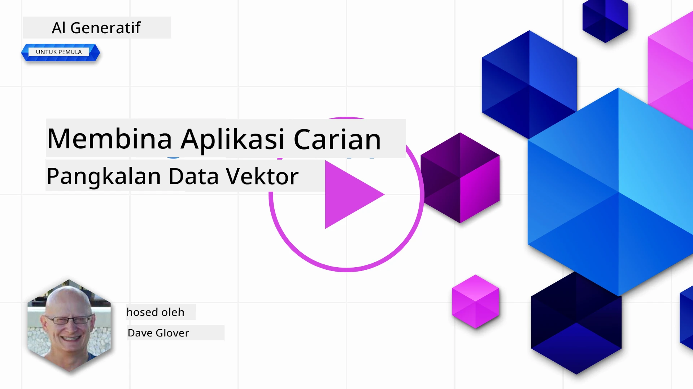
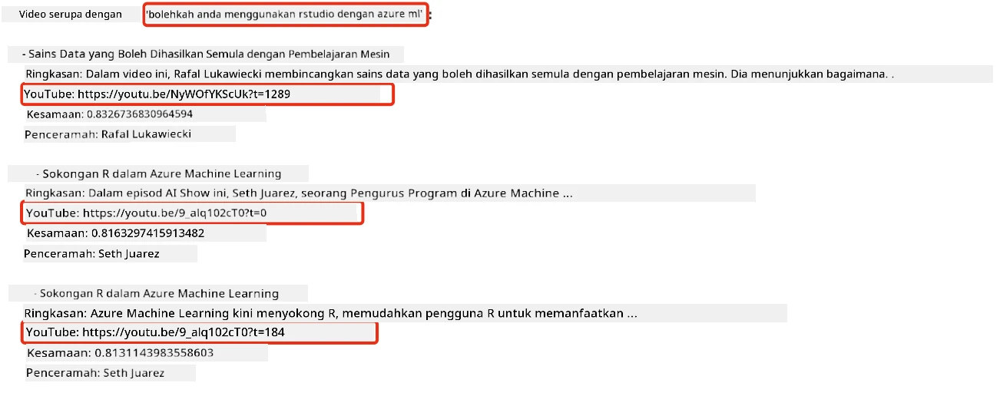
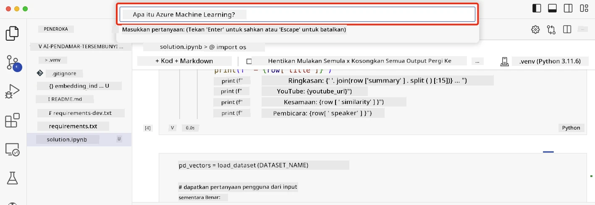

# Membangun Aplikasi Carian

[](https://youtu.be/W0-nzXjOjr0?si=GcsqiTTvd7RKbo7V)

> > _Klik imej di atas untuk menonton video pelajaran ini_

Ada lebih banyak lagi mengenai LLM selain chatbot dan penjanaan teks. Anda juga boleh membina aplikasi carian menggunakan Embeddings. Embeddings adalah representasi berangka bagi data yang juga dikenali sebagai vektor, dan boleh digunakan untuk carian semantik bagi data.

Dalam pelajaran ini, anda akan membina aplikasi carian untuk syarikat permulaan pendidikan kami. Syarikat permulaan kami adalah sebuah organisasi bukan berkeuntungan yang menyediakan pendidikan percuma kepada pelajar di negara membangun. Syarikat permulaan kami mempunyai sejumlah besar video YouTube yang boleh digunakan oleh pelajar untuk belajar tentang AI. Syarikat permulaan kami ingin membina aplikasi carian yang membolehkan pelajar mencari video YouTube dengan menaip soalan.

Contohnya, seorang pelajar mungkin menaip 'Apakah Jupyter Notebooks?' atau 'Apakah Azure ML' dan aplikasi carian akan memaparkan senarai video YouTube yang berkaitan dengan soalan tersebut, dan lebih baik lagi, aplikasi carian akan memaparkan pautan ke tempat dalam video di mana jawapan bagi soalan tersebut terletak.

## Pengenalan

Dalam pelajaran ini, kita akan membincangkan:

- Carian Semantik vs Carian Kata Kunci.
- Apakah Text Embeddings.
- Membina Indeks Text Embeddings.
- Mencari dalam Indeks Text Embeddings.

## Matlamat Pembelajaran

Selepas menyelesaikan pelajaran ini, anda akan mampu:

- Membezakan antara carian semantik dan carian kata kunci.
- Menjelaskan apa itu Text Embeddings.
- Membangun aplikasi menggunakan Embeddings untuk mencari data.

## Mengapa membina aplikasi carian?

Membangun aplikasi carian akan membantu anda memahami cara menggunakan Embeddings untuk mencari data. Anda juga akan belajar bagaimana membina aplikasi carian yang boleh digunakan oleh pelajar untuk mendapatkan maklumat dengan cepat.

Pelajaran ini termasuk Indeks Embedding bagi transkrip YouTube untuk saluran YouTube Microsoft [AI Show](https://www.youtube.com/playlist?list=PLlrxD0HtieHi0mwteKBOfEeOYf0LJU4O1). AI Show adalah saluran YouTube yang mengajar anda tentang AI dan pembelajaran mesin. Indeks Embedding mengandungi Embeddings bagi setiap transkrip YouTube sehingga Okt 2023. Anda akan menggunakan Indeks Embedding untuk membina aplikasi carian bagi syarikat permulaan kami. Aplikasi carian mengembalikan pautan ke tempat dalam video di mana jawapan kepada soalan ditemui. Ini adalah cara terbaik untuk pelajar mendapatkan maklumat yang mereka perlukan dengan cepat.

Berikut adalah contoh pertanyaan semantik bagi soalan 'bolehkah anda menggunakan rstudio dengan azure ml?'. Semak url YouTube, anda akan melihat url mengandungi cap masa yang membawa anda ke tempat dalam video di mana jawapan bagi soalan itu terletak.



## Apakah carian semantik?

Kini anda mungkin tertanya-tanya, apakah carian semantik? Carian semantik adalah teknik carian yang menggunakan semantik, atau maksud, perkataan dalam pertanyaan untuk memaparkan hasil yang relevan.

Berikut adalah contoh carian semantik. Katakan anda ingin membeli kereta, anda mungkin mencari 'kereta impian saya', carian semantik memahami bahawa anda bukan `bermimpi` tentang kereta, tetapi sebenarnya anda sedang mencari kereta `ideal` anda. Carian semantik memahami niat anda dan memaparkan hasil yang relevan. Pilihan lain ialah `carian kata kunci` yang akan mencari secara literal mimpi mengenai kereta dan sering mengembalikan hasil yang tidak relevan.

## Apakah Text Embeddings?

[Text embeddings](https://en.wikipedia.org/wiki/Word_embedding?WT.mc_id=academic-105485-koreyst) adalah teknik representasi teks yang digunakan dalam [natural language processing](https://en.wikipedia.org/wiki/Natural_language_processing?WT.mc_id=academic-105485-koreyst). Text embeddings adalah representasi berangka semantik bagi teks. Embeddings digunakan untuk mewakili data dalam cara yang mudah difahami mesin. Terdapat banyak model untuk membina text embeddings, dalam pelajaran ini, kita akan fokus pada menjana embeddings menggunakan Model Embedding OpenAI.

Berikut adalah contoh, bayangkan teks berikut adalah dalam transkrip daripada satu episod di saluran YouTube AI Show:

```text
Today we are going to learn about Azure Machine Learning.
```

Kami akan menghantar teks kepada OpenAI Embedding API dan ia akan mengembalikan embedding berikut terdiri daripada 1536 nombor iaitu vektor. Setiap nombor dalam vektor mewakili aspek berbeza bagi teks tersebut. Untuk ringkasan, berikut adalah 10 nombor pertama dalam vektor itu.

```python
[-0.006655829958617687, 0.0026128944009542465, 0.008792596869170666, -0.02446001023054123, -0.008540431968867779, 0.022071078419685364, -0.010703742504119873, 0.003311325330287218, -0.011632772162556648, -0.02187200076878071, ...]
```

## Bagaimana Indeks Embedding dicipta?

Indeks Embedding bagi pelajaran ini dicipta dengan beberapa skrip Python. Anda boleh menemui skrip ini bersama arahan dalam [README](./scripts/README.md?WT.mc_id=academic-105485-koreyst) dalam folder 'scripts' bagi pelajaran ini. Anda tidak perlu menjalankan skrip ini untuk menyelesaikan pelajaran kerana Indeks Embedding disediakan untuk anda.

Skrip melakukan operasi berikut:

1. Transkrip setiap video YouTube dalam senarai main [AI Show](https://www.youtube.com/playlist?list=PLlrxD0HtieHi0mwteKBOfEeOYf0LJU4O1) dimuat turun.
2. Menggunakan [OpenAI Functions](https://learn.microsoft.com/azure/ai-foundry/openai/how-to/function-calling?WT.mc_id=academic-105485-koreyst), cubaan dibuat untuk mengekstrak nama penceramah dari 3 minit pertama transkrip YouTube. Nama penceramah bagi setiap video disimpan dalam Indeks Embedding yang dinamakan `embedding_index_3m.json`.
3. Teks transkrip kemudian dibahagikan kepada **segmen teks 3 minit**. Segmen itu termasuk kira-kira 20 perkataan bertindih dari segmen seterusnya untuk memastikan Embedding bagi segmen itu tidak terputus dan memberi konteks carian yang lebih baik.
4. Setiap segmen teks dihantar ke OpenAI Chat API untuk meringkaskan teks kepada 60 perkataan. Ringkasan juga disimpan dalam Indeks Embedding `embedding_index_3m.json`.
5. Akhir sekali, teks segmen dihantar ke OpenAI Embedding API. Embedding API mengembalikan vektor 1536 nombor yang mewakili makna semantik segmen itu. Segmen bersama vektor Embedding OpenAI disimpan dalam Indeks Embedding `embedding_index_3m.json`.

### Pangkalan Data Vektor

Untuk memudahkan pelajaran, Indeks Embedding disimpan dalam fail JSON dinamakan `embedding_index_3m.json` dan dimuatkan ke dalam Pandas DataFrame. Walau bagaimanapun, dalam produksi, Indeks Embedding akan disimpan dalam pangkalan data vektor seperti [Azure Cognitive Search](https://learn.microsoft.com/training/modules/improve-search-results-vector-search?WT.mc_id=academic-105485-koreyst), [Redis](https://cookbook.openai.com/examples/vector_databases/redis/readme?WT.mc_id=academic-105485-koreyst), [Pinecone](https://cookbook.openai.com/examples/vector_databases/pinecone/readme?WT.mc_id=academic-105485-koreyst), [Weaviate](https://cookbook.openai.com/examples/vector_databases/weaviate/readme?WT.mc_id=academic-105485-koreyst), antaranya.

## Memahami Persamaan Kosinus

Kita telah belajar tentang text embeddings, langkah seterusnya adalah belajar bagaimana menggunakan text embeddings untuk mencari data dan khususnya mencari embeddings yang paling serupa dengan pertanyaan yang diberikan menggunakan persamaan kosinus.

### Apakah persamaan kosinus?

Persamaan kosinus ialah ukuran kesamaan antara dua vektor, anda juga akan terdengar ini dirujuk sebagai `carian jiran terdekat`. Untuk melakukan carian persamaan kosinus anda perlu _menukar ke vektor_ untuk teks _pertanyaan_ menggunakan OpenAI Embedding API. Kemudian kira _persamaan kosinus_ antara vektor pertanyaan dengan setiap vektor di Indeks Embedding. Ingat, Indeks Embedding mempunyai vektor bagi setiap segmen teks transkrip YouTube. Akhirnya, susun hasil mengikut persamaan kosinus dan segmen teks dengan persamaan kosinus tertinggi adalah yang paling mirip dengan pertanyaan.

Dari perspektif matematik, persamaan kosinus mengukur kosinus sudut antara dua vektor yang diproyeksikan dalam ruang pelbagai dimensi. Ukuran ini bermanfaat kerana jika dua dokumen jauh antara satu sama lain mengikut jarak Euclidean kerana saiz, mereka masih boleh mempunyai sudut yang lebih kecil antara satu sama lain dan oleh itu persamaan kosinus yang lebih tinggi. Untuk maklumat lanjut tentang persamaan kosinus, lihat [Cosine similarity](https://en.wikipedia.org/wiki/Cosine_similarity?WT.mc_id=academic-105485-koreyst).

## Membina aplikasi carian pertama anda

Seterusnya, kita akan belajar cara membina aplikasi carian menggunakan Embeddings. Aplikasi carian akan membolehkan pelajar mencari video dengan menaip soalan. Aplikasi carian akan memaparkan senarai video yang berkaitan dengan soalan tersebut. Aplikasi carian juga akan memaparkan pautan ke tempat dalam video di mana jawapan bagi soalan itu terletak.

Penyelesaian ini dibina dan diuji pada Windows 11, macOS, dan Ubuntu 22.04 menggunakan Python 3.10 atau lebih baru. Anda boleh memuat turun Python dari [python.org](https://www.python.org/downloads/?WT.mc_id=academic-105485-koreyst).

## Tugasan - membina aplikasi carian, untuk memudahkan pelajar

Kami memperkenalkan syarikat permulaan kami pada permulaan pelajaran ini. Kini tiba masa untuk memudahkan pelajar membina aplikasi carian untuk penilaian mereka.

Dalam tugasan ini, anda akan mencipta Perkhidmatan Azure OpenAI yang akan digunakan untuk membina aplikasi carian. Anda akan mencipta Perkhidmatan Azure OpenAI berikut. Anda memerlukan langganan Azure untuk menyelesaikan tugasan ini.

### Mulakan Azure Cloud Shell

1. Log masuk ke [portal Azure](https://portal.azure.com/?WT.mc_id=academic-105485-koreyst).
2. Pilih ikon Cloud Shell di penjuru kanan atas portal Azure.
3. Pilih **Bash** sebagai jenis persekitaran.

#### Cipta kumpulan sumber

> Untuk arahan ini, kami menggunakan kumpulan sumber yang bernama "semantic-video-search" di East US.
> Anda boleh menukar nama kumpulan sumber, tetapi apabila menukar lokasi sumber,
> semak [jadual ketersediaan model](https://aka.ms/oai/models?WT.mc_id=academic-105485-koreyst).

```shell
az group create --name semantic-video-search --location eastus
```

#### Cipta sumber Perkhidmatan Azure OpenAI

Dari Azure Cloud Shell, jalankan arahan berikut untuk mencipta sumber Perkhidmatan Azure OpenAI.

```shell
az cognitiveservices account create --name semantic-video-openai --resource-group semantic-video-search \
    --location eastus --kind OpenAI --sku s0
```

#### Dapatkan titik akhir dan kunci untuk kegunaan dalam aplikasi ini

Dari Azure Cloud Shell, jalankan arahan berikut untuk mendapatkan titik akhir dan kunci untuk sumber Perkhidmatan Azure OpenAI.

```shell
az cognitiveservices account show --name semantic-video-openai \
   --resource-group  semantic-video-search | jq -r .properties.endpoint
az cognitiveservices account keys list --name semantic-video-openai \
   --resource-group semantic-video-search | jq -r .key1
```

#### Laksanakan model OpenAI Embedding

Dari Azure Cloud Shell, jalankan arahan berikut untuk melaksanakan model OpenAI Embedding.

```shell
az cognitiveservices account deployment create \
    --name semantic-video-openai \
    --resource-group  semantic-video-search \
    --deployment-name text-embedding-ada-002 \
    --model-name text-embedding-ada-002 \
    --model-version "2"  \
    --model-format OpenAI \
    --sku-capacity 100 --sku-name "Standard"
```

## Penyelesaian

Buka [notebook penyelesaian](./python/aoai-solution.ipynb?WT.mc_id=academic-105485-koreyst) dalam GitHub Codespaces dan ikuti arahan dalam Jupyter Notebook.

Apabila anda menjalankan notebook, anda akan diminta untuk memasukkan pertanyaan. Kotak input akan kelihatan seperti ini:



## Kerja yang Bagus! Teruskan Pembelajaran Anda

Selepas menyelesaikan pelajaran ini, lihat koleksi [Pembelajaran AI Generatif kami](https://aka.ms/genai-collection?WT.mc_id=academic-105485-koreyst) untuk terus meningkatkan pengetahuan AI Generatif anda!

Teruskan ke Pelajaran 9 di mana kita akan melihat bagaimana untuk [membina aplikasi penjanaan imej](../09-building-image-applications/README.md?WT.mc_id=academic-105485-koreyst)!

---

<!-- CO-OP TRANSLATOR DISCLAIMER START -->
**Penafian**:
Dokumen ini telah diterjemahkan menggunakan perkhidmatan terjemahan AI [Co-op Translator](https://github.com/Azure/co-op-translator). Walaupun kami berusaha untuk ketepatan, sila ambil maklum bahawa terjemahan automatik mungkin mengandungi kesilapan atau ketidaktepatan. Dokumen asal dalam bahasa asalnya harus dianggap sebagai sumber yang sahih. Untuk maklumat penting, terjemahan oleh manusia profesional adalah disyorkan. Kami tidak bertanggungjawab terhadap sebarang salah faham atau salah tafsir yang timbul daripada penggunaan terjemahan ini.
<!-- CO-OP TRANSLATOR DISCLAIMER END -->