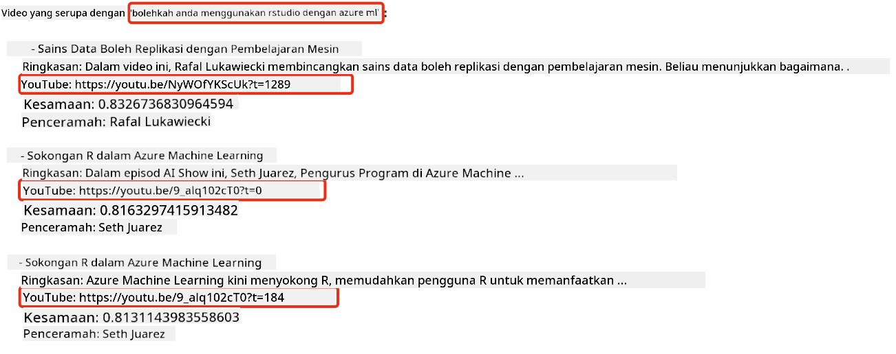
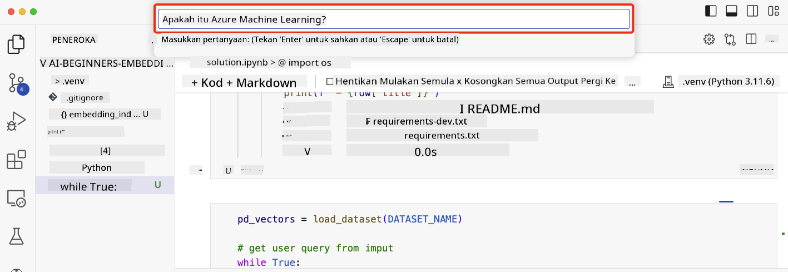

<!--
CO_OP_TRANSLATOR_METADATA:
{
  "original_hash": "d46aad0917a1a342d613e2c13d457da5",
  "translation_date": "2025-07-09T12:59:27+00:00",
  "source_file": "08-building-search-applications/README.md",
  "language_code": "ms"
}
-->
# Membangunkan Aplikasi Carian

[](https://aka.ms/gen-ai-lesson8-gh?WT.mc_id=academic-105485-koreyst)

> > _Klik imej di atas untuk menonton video pelajaran ini_

LLM bukan sekadar chatbot dan penjanaan teks sahaja. Ia juga boleh digunakan untuk membina aplikasi carian menggunakan Embeddings. Embeddings adalah representasi berangka bagi data yang juga dikenali sebagai vektor, dan boleh digunakan untuk carian semantik bagi data.

Dalam pelajaran ini, anda akan membina aplikasi carian untuk syarikat permulaan pendidikan kami. Syarikat permulaan kami adalah sebuah organisasi bukan untung yang menyediakan pendidikan percuma kepada pelajar di negara membangun. Syarikat kami mempunyai banyak video YouTube yang boleh digunakan oleh pelajar untuk belajar tentang AI. Kami ingin membina aplikasi carian yang membolehkan pelajar mencari video YouTube dengan menaip soalan.

Sebagai contoh, seorang pelajar mungkin menaip 'Apa itu Jupyter Notebooks?' atau 'Apa itu Azure ML' dan aplikasi carian akan memaparkan senarai video YouTube yang berkaitan dengan soalan tersebut, dan lebih baik lagi, aplikasi carian akan memaparkan pautan ke bahagian dalam video di mana jawapan kepada soalan itu terletak.

## Pengenalan

Dalam pelajaran ini, kita akan membincangkan:

- Carian Semantik vs Carian Kata Kunci.
- Apa itu Text Embeddings.
- Mewujudkan Indeks Text Embeddings.
- Mencari dalam Indeks Text Embeddings.

## Matlamat Pembelajaran

Selepas menamatkan pelajaran ini, anda akan dapat:

- Membezakan antara carian semantik dan carian kata kunci.
- Menerangkan apa itu Text Embeddings.
- Mewujudkan aplikasi menggunakan Embeddings untuk mencari data.

## Kenapa membina aplikasi carian?

Membina aplikasi carian akan membantu anda memahami cara menggunakan Embeddings untuk mencari data. Anda juga akan belajar bagaimana membina aplikasi carian yang boleh digunakan oleh pelajar untuk mencari maklumat dengan cepat.

Pelajaran ini termasuk Indeks Embedding bagi transkrip YouTube untuk saluran Microsoft [AI Show](https://www.youtube.com/playlist?list=PLlrxD0HtieHi0mwteKBOfEeOYf0LJU4O1). AI Show adalah saluran YouTube yang mengajar tentang AI dan pembelajaran mesin. Indeks Embedding mengandungi Embeddings untuk setiap transkrip YouTube sehingga Oktober 2023. Anda akan menggunakan Indeks Embedding ini untuk membina aplikasi carian untuk syarikat permulaan kami. Aplikasi carian akan memaparkan pautan ke bahagian dalam video di mana jawapan kepada soalan itu terletak. Ini adalah cara yang sangat baik untuk pelajar mencari maklumat yang mereka perlukan dengan cepat.

Berikut adalah contoh pertanyaan semantik untuk soalan 'bolehkah anda menggunakan rstudio dengan azure ml?'. Lihat url YouTube, anda akan nampak url tersebut mengandungi cap masa yang membawa anda ke bahagian dalam video di mana jawapan kepada soalan itu terletak.



## Apa itu carian semantik?

Anda mungkin tertanya-tanya, apa itu carian semantik? Carian semantik adalah teknik carian yang menggunakan semantik, atau makna, perkataan dalam pertanyaan untuk memaparkan hasil yang relevan.

Berikut adalah contoh carian semantik. Katakan anda ingin membeli kereta, anda mungkin mencari 'kereta impian saya', carian semantik memahami bahawa anda bukan sedang `bermimpi` tentang kereta, tetapi anda sedang mencari kereta `ideal` anda. Carian semantik memahami niat anda dan memaparkan hasil yang relevan. Alternatifnya ialah `carian kata kunci` yang akan mencari secara literal tentang mimpi berkaitan kereta dan sering memaparkan hasil yang tidak relevan.

## Apa itu Text Embeddings?

[Text embeddings](https://en.wikipedia.org/wiki/Word_embedding?WT.mc_id=academic-105485-koreyst) adalah teknik representasi teks yang digunakan dalam [pemprosesan bahasa semula jadi](https://en.wikipedia.org/wiki/Natural_language_processing?WT.mc_id=academic-105485-koreyst). Text embeddings adalah representasi berangka semantik bagi teks. Embeddings digunakan untuk mewakili data dalam bentuk yang mudah difahami oleh mesin. Terdapat banyak model untuk membina text embeddings, dalam pelajaran ini, kita akan fokus pada penjanaan embeddings menggunakan Model Embedding OpenAI.

Berikut adalah contoh, bayangkan teks berikut adalah dalam transkrip salah satu episod di saluran YouTube AI Show:

```text
Today we are going to learn about Azure Machine Learning.
```

Kita akan menghantar teks ini ke OpenAI Embedding API dan ia akan memulangkan embedding berikut yang terdiri daripada 1536 nombor atau vektor. Setiap nombor dalam vektor mewakili aspek berbeza bagi teks tersebut. Untuk ringkasan, berikut adalah 10 nombor pertama dalam vektor tersebut.

```python
[-0.006655829958617687, 0.0026128944009542465, 0.008792596869170666, -0.02446001023054123, -0.008540431968867779, 0.022071078419685364, -0.010703742504119873, 0.003311325330287218, -0.011632772162556648, -0.02187200076878071, ...]
```

## Bagaimana Indeks Embedding diwujudkan?

Indeks Embedding untuk pelajaran ini diwujudkan menggunakan beberapa skrip Python. Anda boleh dapati skrip-skrip tersebut bersama arahan dalam [README](./scripts/README.md?WT.mc_id=academic-105485-koreyst) dalam folder 'scripts' untuk pelajaran ini. Anda tidak perlu menjalankan skrip ini untuk menamatkan pelajaran kerana Indeks Embedding telah disediakan untuk anda.

Skrip-skrip ini melakukan operasi berikut:

1. Transkrip untuk setiap video YouTube dalam senarai main [AI Show](https://www.youtube.com/playlist?list=PLlrxD0HtieHi0mwteKBOfEeOYf0LJU4O1) dimuat turun.
2. Menggunakan [OpenAI Functions](https://learn.microsoft.com/azure/ai-services/openai/how-to/function-calling?WT.mc_id=academic-105485-koreyst), cubaan dibuat untuk mengekstrak nama penceramah dari 3 minit pertama transkrip YouTube. Nama penceramah untuk setiap video disimpan dalam Indeks Embedding bernama `embedding_index_3m.json`.
3. Teks transkrip kemudian dibahagikan kepada **segmen teks 3 minit**. Segmen ini termasuk kira-kira 20 perkataan bertindih dari segmen seterusnya untuk memastikan Embedding bagi segmen tidak terputus dan memberikan konteks carian yang lebih baik.
4. Setiap segmen teks kemudian dihantar ke OpenAI Chat API untuk meringkaskan teks menjadi 60 perkataan. Ringkasan ini juga disimpan dalam Indeks Embedding `embedding_index_3m.json`.
5. Akhir sekali, teks segmen dihantar ke OpenAI Embedding API. API Embedding memulangkan vektor 1536 nombor yang mewakili makna semantik segmen tersebut. Segmen bersama vektor Embedding OpenAI disimpan dalam Indeks Embedding `embedding_index_3m.json`.

### Pangkalan Data Vektor

Untuk memudahkan pelajaran, Indeks Embedding disimpan dalam fail JSON bernama `embedding_index_3m.json` dan dimuatkan ke dalam Pandas DataFrame. Namun, dalam pengeluaran sebenar, Indeks Embedding akan disimpan dalam pangkalan data vektor seperti [Azure Cognitive Search](https://learn.microsoft.com/training/modules/improve-search-results-vector-search?WT.mc_id=academic-105485-koreyst), [Redis](https://cookbook.openai.com/examples/vector_databases/redis/readme?WT.mc_id=academic-105485-koreyst), [Pinecone](https://cookbook.openai.com/examples/vector_databases/pinecone/readme?WT.mc_id=academic-105485-koreyst), [Weaviate](https://cookbook.openai.com/examples/vector_databases/weaviate/readme?WT.mc_id=academic-105485-koreyst), antara lain.

## Memahami kesamaan kosinus

Kita telah belajar tentang text embeddings, langkah seterusnya adalah belajar bagaimana menggunakan text embeddings untuk mencari data dan khususnya mencari embeddings yang paling serupa dengan pertanyaan menggunakan kesamaan kosinus.

### Apa itu kesamaan kosinus?

Kesamaan kosinus adalah ukuran kesamaan antara dua vektor, anda juga mungkin mendengar ia dirujuk sebagai `carian jiran terdekat`. Untuk melakukan carian kesamaan kosinus, anda perlu _menvektorkan_ teks _pertanyaan_ menggunakan OpenAI Embedding API. Kemudian kira _kesamaan kosinus_ antara vektor pertanyaan dan setiap vektor dalam Indeks Embedding. Ingat, Indeks Embedding mempunyai vektor untuk setiap segmen teks transkrip YouTube. Akhir sekali, susun hasil mengikut kesamaan kosinus dan segmen teks dengan kesamaan kosinus tertinggi adalah yang paling serupa dengan pertanyaan.

Dari perspektif matematik, kesamaan kosinus mengukur kosinus sudut antara dua vektor yang diproyeksikan dalam ruang berdimensi tinggi. Ukuran ini berguna kerana jika dua dokumen jauh antara satu sama lain berdasarkan jarak Euclidean disebabkan saiz, mereka masih boleh mempunyai sudut yang lebih kecil antara satu sama lain dan oleh itu kesamaan kosinus yang lebih tinggi. Untuk maklumat lanjut tentang persamaan kesamaan kosinus, lihat [Cosine similarity](https://en.wikipedia.org/wiki/Cosine_similarity?WT.mc_id=academic-105485-koreyst).

## Membangunkan aplikasi carian pertama anda

Seterusnya, kita akan belajar bagaimana membina aplikasi carian menggunakan Embeddings. Aplikasi carian ini akan membolehkan pelajar mencari video dengan menaip soalan. Aplikasi carian akan memaparkan senarai video yang berkaitan dengan soalan tersebut. Aplikasi carian juga akan memaparkan pautan ke bahagian dalam video di mana jawapan kepada soalan itu terletak.

Penyelesaian ini dibina dan diuji pada Windows 11, macOS, dan Ubuntu 22.04 menggunakan Python 3.10 atau lebih baru. Anda boleh muat turun Python dari [python.org](https://www.python.org/downloads/?WT.mc_id=academic-105485-koreyst).

## Tugasan - membina aplikasi carian, untuk membantu pelajar

Kami telah memperkenalkan syarikat permulaan kami pada awal pelajaran ini. Kini tiba masanya untuk membolehkan pelajar membina aplikasi carian untuk tugasan mereka.

Dalam tugasan ini, anda akan mencipta Azure OpenAI Services yang akan digunakan untuk membina aplikasi carian. Anda akan mencipta Azure OpenAI Services berikut. Anda memerlukan langganan Azure untuk menyiapkan tugasan ini.

### Mulakan Azure Cloud Shell

1. Log masuk ke [portal Azure](https://portal.azure.com/?WT.mc_id=academic-105485-koreyst).
2. Pilih ikon Cloud Shell di penjuru kanan atas portal Azure.
3. Pilih **Bash** sebagai jenis persekitaran.

#### Cipta kumpulan sumber

> Untuk arahan ini, kami menggunakan kumpulan sumber bernama "semantic-video-search" di East US.
> Anda boleh menukar nama kumpulan sumber, tetapi apabila menukar lokasi sumber,
> semak [jadual ketersediaan model](https://aka.ms/oai/models?WT.mc_id=academic-105485-koreyst).

```shell
az group create --name semantic-video-search --location eastus
```

#### Cipta sumber Azure OpenAI Service

Dari Azure Cloud Shell, jalankan arahan berikut untuk mencipta sumber Azure OpenAI Service.

```shell
az cognitiveservices account create --name semantic-video-openai --resource-group semantic-video-search \
    --location eastus --kind OpenAI --sku s0
```

#### Dapatkan endpoint dan kunci untuk digunakan dalam aplikasi ini

Dari Azure Cloud Shell, jalankan arahan berikut untuk mendapatkan endpoint dan kunci bagi sumber Azure OpenAI Service.

```shell
az cognitiveservices account show --name semantic-video-openai \
   --resource-group  semantic-video-search | jq -r .properties.endpoint
az cognitiveservices account keys list --name semantic-video-openai \
   --resource-group semantic-video-search | jq -r .key1
```

#### Lancarkan model OpenAI Embedding

Dari Azure Cloud Shell, jalankan arahan berikut untuk melancarkan model OpenAI Embedding.

```shell
az cognitiveservices account deployment create \
    --name semantic-video-openai \
    --resource-group  semantic-video-search \
    --deployment-name text-embedding-ada-002 \
    --model-name text-embedding-ada-002 \
    --model-version "2"  \
    --model-format OpenAI \
    --sku-capacity 100 --sku-name "Standard"
```

## Penyelesaian

Buka [notebook penyelesaian](../../../08-building-search-applications/python/aoai-solution.ipynb) dalam GitHub Codespaces dan ikut arahan dalam Jupyter Notebook.

Apabila anda menjalankan notebook, anda akan diminta memasukkan pertanyaan. Kotak input akan kelihatan seperti ini:



## Kerja yang hebat! Teruskan Pembelajaran Anda

Selepas menamatkan pelajaran ini, lihat koleksi [Pembelajaran Generative AI kami](https://aka.ms/genai-collection?WT.mc_id=academic-105485-koreyst) untuk terus meningkatkan pengetahuan Generative AI anda!

Teruskan ke Pelajaran 9 di mana kita akan melihat bagaimana untuk [membangunkan aplikasi penjanaan imej](../09-building-image-applications/README.md?WT.mc_id=academic-105485-koreyst)!

**Penafian**:  
Dokumen ini telah diterjemahkan menggunakan perkhidmatan terjemahan AI [Co-op Translator](https://github.com/Azure/co-op-translator). Walaupun kami berusaha untuk ketepatan, sila ambil maklum bahawa terjemahan automatik mungkin mengandungi kesilapan atau ketidaktepatan. Dokumen asal dalam bahasa asalnya harus dianggap sebagai sumber yang sahih. Untuk maklumat penting, terjemahan profesional oleh manusia adalah disyorkan. Kami tidak bertanggungjawab atas sebarang salah faham atau salah tafsir yang timbul daripada penggunaan terjemahan ini.