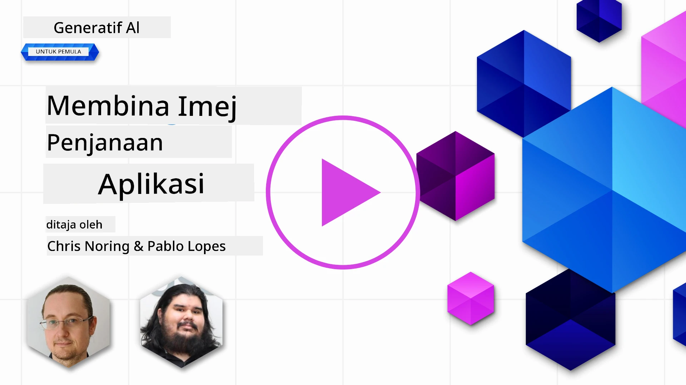

# Membina Aplikasi Penjanaan Imej

[](https://youtu.be/B5VP0_J7cs8?si=5P3L5o7F_uS_QcG9)

LLM lebih daripada sekadar penjanaan teks. Ia juga boleh menjana imej daripada penerangan teks. Mempunyai imej sebagai modaliti boleh sangat berguna dalam pelbagai bidang seperti MedTech, seni bina, pelancongan, pembangunan permainan dan banyak lagi. Dalam bab ini, kita akan membincangkan dua model penjanaan imej paling popular, DALL-E dan Midjourney.

## Pengenalan

Dalam pelajaran ini, kita akan merangkumi:

- Penjanaan imej dan mengapa ia berguna.
- DALL-E dan Midjourney, apa mereka dan bagaimana mereka berfungsi.
- Bagaimana anda membina aplikasi penjanaan imej.

## Matlamat Pembelajaran

Selepas melengkapkan pelajaran ini, anda akan dapat:

- Membina aplikasi penjanaan imej.
- Menetapkan had untuk aplikasi anda dengan meta prompts.
- Bekerja dengan DALL-E dan Midjourney.

## Mengapa membina aplikasi penjanaan imej?

Aplikasi penjanaan imej adalah cara yang hebat untuk meneroka keupayaan AI Generatif. Ia boleh digunakan untuk, contohnya:

- **Suntingan imej dan sintesis**. Anda boleh menjana imej untuk pelbagai kegunaan, seperti suntingan imej dan sintesis imej.

- **Digunakan dalam pelbagai industri**. Ia juga boleh digunakan untuk menjana imej untuk pelbagai industri seperti Medtech, Pelancongan, Pembangunan Permainan dan banyak lagi.

## Senario: Edu4All

Sebagai sebahagian daripada pelajaran ini, kita akan terus bekerjasama dengan startup kami, Edu4All, dalam pelajaran ini. Pelajar akan mencipta imej untuk penilaian mereka, imej apa yang mereka hasilkan terpulang kepada mereka, tetapi ia boleh menjadi ilustrasi untuk cerita dongeng mereka sendiri atau membuat watak baru untuk cerita mereka atau membantu mereka memvisualisasikan idea dan konsep mereka.

Berikut adalah contoh apa yang pelajar Edu4All boleh jana jika mereka sedang bekerja di kelas tentang monumen:


menggunakan prompt seperti

> "Anjing di sebelah Menara Eiffel pada cahaya matahari pagi awal"

## Apa itu DALL-E dan Midjourney?

[DALL-E](https://openai.com/dall-e-2?WT.mc_id=academic-105485-koreyst) dan [Midjourney](https://www.midjourney.com/?WT.mc_id=academic-105485-koreyst) adalah dua model penjanaan imej paling popular, mereka membenarkan anda menggunakan prompt untuk menjana imej.

### DALL-E

Mari kita mulakan dengan DALL-E, iaitu model AI Generatif yang menjana imej daripada penerangan teks.

> [DALL-E adalah gabungan dua model, CLIP dan diffused attention](https://towardsdatascience.com/openais-dall-e-and-clip-101-a-brief-introduction-3a4367280d4e?WT.mc_id=academic-105485-koreyst).

- **CLIP**, adalah model yang menjana embedding, iaitu representasi numerik data, dari imej dan teks.

- **Diffused attention**, adalah model yang menjana imej daripada embedding. DALL-E dilatih pada set data imej dan teks dan boleh digunakan untuk menjana imej daripada penerangan teks. Contohnya, DALL-E boleh digunakan untuk menjana imej kucing memakai topi, atau anjing dengan mohawk.

### Midjourney

Midjourney berfungsi dengan cara yang serupa dengan DALL-E, ia menjana imej daripada prompt teks. Midjourney juga boleh digunakan untuk menjana imej menggunakan prompt seperti "kucing memakai topi", atau "anjing dengan mohawk".


_Imej kredit Wikipedia, imej dijana oleh Midjourney_

## Bagaimana DALL-E dan Midjourney Berfungsi

Pertama, [DALL-E](https://arxiv.org/pdf/2102.12092.pdf?WT.mc_id=academic-105485-koreyst). DALL-E adalah model AI Generatif berdasarkan seni bina transformer dengan _autoregressive transformer_.

_Autoregressive transformer_ mentakrifkan bagaimana model menjana imej daripada penerangan teks, ia menjana satu piksel pada satu masa, kemudian menggunakan piksel yang dijana untuk menjana piksel seterusnya. Melalui beberapa lapisan dalam rangkaian neural, sehingga imej itu lengkap.

Dengan proses ini, DALL-E mengawal atribut, objek, ciri dan lebih lagi dalam imej yang dihasilkannya. Walau bagaimanapun, DALL-E 2 dan 3 mempunyai kawalan lebih baik ke atas imej yang dijana.

## Membina aplikasi penjanaan imej pertama anda

Jadi, apa yang diperlukan untuk membina aplikasi penjanaan imej? Anda memerlukan perpustakaan berikut:

- **python-dotenv**, sangat disyorkan menggunakan perpustakaan ini untuk menyimpan rahsia anda dalam fail _.env_ jauh dari kod.
- **openai**, perpustakaan ini adalah untuk berinteraksi dengan API OpenAI.
- **pillow**, untuk bekerja dengan imej dalam Python.
- **requests**, untuk membantu anda membuat permintaan HTTP.

## Membuat dan melancarkan model Azure OpenAI

Jika belum dibuat, ikut arahan di halaman [Microsoft Learn](https://learn.microsoft.com/azure/ai-foundry/openai/how-to/create-resource?pivots=web-portal&WT.mc_id=academic-105485-koreyst)
untuk mencipta sumber dan model Azure OpenAI. Pilih **gpt-image-1** sebagai model (model imej Azure OpenAI generasi kini; DALL-E 3 adalah warisan dan tidak lagi tersedia untuk penempatan baru).

## Cipta aplikasi

1. Cipta fail _.env_ dengan kandungan berikut:

   ```text
   AZURE_OPENAI_ENDPOINT=<your endpoint>
   AZURE_OPENAI_API_KEY=<your key>
   AZURE_OPENAI_DEPLOYMENT="gpt-image-1"
   ```

   Cari maklumat ini di Azure OpenAI Foundry Portal untuk sumber anda di bahagian "Deployments".

1. Kumpulkan perpustakaan di atas dalam fail bernama _requirements.txt_ seperti berikut:

   ```text
   python-dotenv
   openai
   pillow
   requests
   ```

1. Seterusnya, cipta persekitaran virtual dan pasang perpustakaan:

   ```bash
   python3 -m venv venv
   source venv/bin/activate
   pip install -r requirements.txt
   ```

   Untuk Windows, gunakan arahan berikut untuk cipta dan aktifkan persekitaran virtual anda:

   ```bash
   python3 -m venv venv
   venv\Scripts\activate.bat
   ```

1. Tambah kod berikut dalam fail bernama _app.py_:

    ```python
    import openai
    import os
    import requests
    from PIL import Image
    import dotenv
    from openai import OpenAI, AzureOpenAI
    
    # import dotenv
    dotenv.load_dotenv()
    
    # Konfigurasikan klien perkhidmatan Azure OpenAI
    client = AzureOpenAI(
      azure_endpoint = os.environ["AZURE_OPENAI_ENDPOINT"],
      api_key=os.environ['AZURE_OPENAI_API_KEY'],
      api_version = "2024-10-21"
      )
    try:
        # Cipta imej menggunakan API penjanaan imej
        generation_response = client.images.generate(
                                prompt='Bunny on horse, holding a lollipop, on a foggy meadow where it grows daffodils',
                                size='1024x1024', n=1,
                                model=os.environ['AZURE_OPENAI_DEPLOYMENT']
                              )

        # Tetapkan direktori untuk imej yang disimpan
        image_dir = os.path.join(os.curdir, 'images')

        # Jika direktori tidak wujud, cipta ia
        if not os.path.isdir(image_dir):
            os.mkdir(image_dir)

        # Inisialisasi laluan imej (perhatikan jenis fail harus png)
        image_path = os.path.join(image_dir, 'generated-image.png')

        # Dapatkan imej yang dijana
        image_url = generation_response.data[0].url  # ekstrak URL imej dari respons
        generated_image = requests.get(image_url).content  # muat turun imej
        with open(image_path, "wb") as image_file:
            image_file.write(generated_image)

        # Paparkan imej dalam penampil imej lalai
        image = Image.open(image_path)
        image.show()

    # tangkap pengecualian
    except openai.BadRequestError as err:
        print(err)
   ```

Mari kita terangkan kod ini:

- Pertama, kita import perpustakaan yang diperlukan, termasuk perpustakaan OpenAI, dotenv, requests, dan Pillow.

  ```python
  import openai
  import os
  import requests
  from PIL import Image
  import dotenv
  ```

- Seterusnya, kita muatkan pemboleh ubah persekitaran dari fail _.env_.

  ```python
  # import dotenv
  dotenv.load_dotenv()
  ```

- Selepas itu, kita konfigurasikan klien perkhidmatan Azure OpenAI

  ```python
  # Dapatkan titik akhir dan kunci daripada pembolehubah persekitaran
  client = AzureOpenAI(
      azure_endpoint = os.environ["AZURE_OPENAI_ENDPOINT"],
      api_key=os.environ['AZURE_OPENAI_API_KEY'],
      api_version = "2024-10-21"
      )
  ```

- Seterusnya, kita jana imej:

  ```python
  # Cipta imej dengan menggunakan API penjanaan imej
  generation_response = client.images.generate(
                        prompt='Bunny on horse, holding a lollipop, on a foggy meadow where it grows daffodils',
                        size='1024x1024', n=1,
                        model=os.environ['AZURE_OPENAI_DEPLOYMENT']
                      )
  ```

  Kod di atas membalas dengan objek JSON yang mengandungi URL imej yang dijana. Kita boleh menggunakan URL tersebut untuk memuat turun imej dan simpan ke fail.

- Akhir sekali, kita buka imej dan gunakan penonton imej standard untuk memaparkannya:

  ```python
  image = Image.open(image_path)
  image.show()
  ```

### Perincian lanjut tentang penjanaan imej

Mari kita lihat kod yang menjana imej dengan lebih terperinci:

   ```python
     generation_response = client.images.generate(
                               prompt='Bunny on horse, holding a lollipop, on a foggy meadow where it grows daffodils',
                               size='1024x1024', n=1,
                               model=os.environ['AZURE_OPENAI_DEPLOYMENT']
                           )
   ```

- **prompt**, adalah prompt teks yang digunakan untuk menjana imej. Dalam kes ini, kita menggunakan prompt "Arnab atas kuda, memegang gula-gula lollipop, di padang rumput berkabus tempat tumbuh bunga daffodil".
- **size**, adalah saiz imej yang dijana. Dalam kes ini, imej dijana berukuran 1024x1024 piksel.
- **n**, adalah bilangan imej yang dijana. Dalam kes ini, kita menjana dua imej.
- **temperature**, adalah parameter yang mengawal rawak keluaran model AI Generatif. Nilai suhu antara 0 dan 1 di mana 0 bermakna keluaran deterministik dan 1 bermakna keluaran rawak. Nilai lalai adalah 0.7.

Ada lebih banyak perkara yang boleh anda lakukan dengan imej yang akan kita bincangkan dalam bahagian seterusnya.

## Keupayaan tambahan penjanaan imej

Anda telah lihat setakat ini bagaimana kita dapat menjana imej menggunakan beberapa baris kod dalam Python. Namun, ada lagi perkara yang boleh anda lakukan dengan imej.

Anda juga boleh melakukan perkara berikut:

- **Melakukan suntingan**. Dengan menyediakan imej sedia ada, topeng dan prompt, anda boleh mengubah imej. Contohnya, anda boleh menambah sesuatu pada sebahagian imej. Bayangkan imej arnab kita, anda boleh tambah topi pada arnab itu. Cara untuk melakukan itu adalah dengan menyediakan imej, topeng (mengenal pasti bahagian untuk ubahan) dan prompt teks yang menyatakan apa yang perlu dibuat.
> Nota: ini tidak disokong dalam DALL-E 3.
 
Berikut contoh menggunakan GPT Image:

   ```python
   response = client.images.edit(
       model="gpt-image-1",
       image=open("sunlit_lounge.png", "rb"),
       mask=open("mask.png", "rb"),
       prompt="A sunlit indoor lounge area with a pool containing a flamingo"
   )
   image_url = response.data[0].url
   ```

  Imej asas hanya mengandungi ruang santai dengan kolam renang tetapi imej akhir mempunyai flamingo:

<div style="display: flex; justify-content: space-between; align-items: center; margin: 20px 0;">
  
  
  
</div>


- **Mencipta variasi**. Idea ialah anda ambil imej sedia ada dan minta variasi dicipta. Untuk mencipta variasi, anda menyediakan imej dan prompt teks dan kod seperti berikut:

  ```python
  response = client.images.create_variation(
    image=open("bunny-lollipop.png", "rb"),
    n=1,
    size="1024x1024"
  )
  image_url = response.data[0].url
  ```

  > Nota, ini hanya disokong model DALL-E 2 OpenAI, bukan gpt-image-1

## Suhu

Suhu adalah parameter yang mengawal kerandoman keluaran model AI Generatif. Nilai suhu antara 0 dan 1 di mana 0 bermakna keluaran deterministik dan 1 bermakna keluaran rawak. Nilai lalai adalah 0.7.

Mari lihat contoh bagaimana suhu berfungsi, dengan menjalankan prompt ini dua kali:

> Prompt : "Arnab atas kuda, memegang gula-gula lollipop, di padang rumput berkabus tempat tumbuh bunga daffodil"


Sekarang mari jalankan prompt yang sama sekali lagi untuk lihat bahawa kita tidak akan dapat imej yang sama dua kali:


Seperti yang anda lihat, imej adalah serupa, tetapi tidak sama. Mari cuba ubah nilai suhu ke 0.1 dan lihat apa yang berlaku:

```python
 generation_response = client.images.generate(
        prompt='Bunny on horse, holding a lollipop, on a foggy meadow where it grows daffodils',    # Masukkan teks arahan anda di sini
        size='1024x1024',
        n=2
    )
```

### Menukar suhu

Jadi mari cuba buat respon lebih deterministik. Kita boleh perhatikan daripada dua imej yang dijana bahawa dalam imej pertama, terdapat arnab dan dalam imej kedua, terdapat kuda, jadi imej berbeza dengan ketara.

Oleh itu, mari kita ubah kod dan tetapkan suhu ke 0, seperti berikut:

```python
generation_response = client.images.generate(
        prompt='Bunny on horse, holding a lollipop, on a foggy meadow where it grows daffodils',    # Masukkan teks arahan anda di sini
        size='1024x1024',
        n=2,
        temperature=0
    )
```

Apabila anda jalankan kod ini, anda akan dapat dua imej ini:

- 
- 

Di sini anda jelas dapat lihat bagaimana imej lebih menyerupai antara satu sama lain.

## Cara menetapkan had untuk aplikasi anda dengan metaprompt

Dengan demo kami, kita sudah boleh menjana imej untuk pelanggan. Namun, kita perlu mencipta had untuk aplikasi kita.

Contohnya, kita tidak mahu menghasilkan imej yang tidak sesuai untuk kerja, atau tidak sesuai untuk kanak-kanak.

Kita boleh lakukan ini dengan _metaprompts_. Metaprompt adalah prompt teks yang digunakan untuk mengawal keluaran model AI Generatif. Contohnya, kita boleh gunakan metaprompt untuk mengawal keluaran dan memastikan imej yang dijana selamat untuk kerja, atau sesuai untuk kanak-kanak.

### Bagaimana ia berfungsi?

Jadi, bagaimana metaprompt berfungsi?

Metaprompt adalah prompt teks yang digunakan untuk mengawal keluaran model AI Generatif, ia diletakkan sebelum prompt teks, digunakan untuk mengawal keluaran model dan disisipkan dalam aplikasi untuk kawal keluaran model. Menggabungkan input prompt dan input metaprompt dalam satu prompt teks.

Contoh metaprompt adalah seperti berikut:

```text
You are an assistant designer that creates images for children.

The image needs to be safe for work and appropriate for children.

The image needs to be in color.

The image needs to be in landscape orientation.

The image needs to be in a 16:9 aspect ratio.

Do not consider any input from the following that is not safe for work or appropriate for children.

(Input)

```

Sekarang, mari kita lihat bagaimana kita boleh gunakan metaprompt dalam demo kita.

```python
disallow_list = "swords, violence, blood, gore, nudity, sexual content, adult content, adult themes, adult language, adult humor, adult jokes, adult situations, adult"

meta_prompt =f"""You are an assistant designer that creates images for children.

The image needs to be safe for work and appropriate for children.

The image needs to be in color.

The image needs to be in landscape orientation.

The image needs to be in a 16:9 aspect ratio.

Do not consider any input from the following that is not safe for work or appropriate for children.
{disallow_list}
"""

prompt = f"{meta_prompt}
Create an image of a bunny on a horse, holding a lollipop"

# TODO tambah permintaan untuk menjana imej
```

Dari prompt di atas, anda boleh lihat bagaimana semua imej yang dihasilkan mengambil kira metaprompt.

## Tugasan - mari benarkan pelajar

Kita telah memperkenalkan Edu4All pada permulaan pelajaran ini. Kini tiba masanya untuk membolehkan pelajar menjana imej untuk penilaian mereka.


Pelajar akan mencipta imej untuk penilaian mereka yang mengandungi monumen, tepat apa monumen adalah terpulang kepada pelajar. Pelajar diminta menggunakan kreativiti mereka dalam tugasan ini untuk meletakkan monumen ini dalam konteks yang berbeza.

## Penyelesaian

Berikut adalah satu penyelesaian yang mungkin:

```python
import openai
import os
import requests
from PIL import Image
import dotenv
from openai import AzureOpenAI
# import dotenv
dotenv.load_dotenv()

# Dapatkan titik hujung dan kunci dari pembolehubah persekitaran
client = AzureOpenAI(
  azure_endpoint = os.environ["AZURE_OPENAI_ENDPOINT"],
  api_key=os.environ['AZURE_OPENAI_API_KEY'],
  api_version = "2024-10-21"
  )


disallow_list = "swords, violence, blood, gore, nudity, sexual content, adult content, adult themes, adult language, adult humor, adult jokes, adult situations, adult"

meta_prompt = f"""You are an assistant designer that creates images for children.

The image needs to be safe for work and appropriate for children.

The image needs to be in color.

The image needs to be in landscape orientation.

The image needs to be in a 16:9 aspect ratio.

Do not consider any input from the following that is not safe for work or appropriate for children.
{disallow_list}
"""

prompt = f"""{meta_prompt}
Generate monument of the Arc of Triumph in Paris, France, in the evening light with a small child holding a Teddy looks on.
"""

try:
    # Cipta imej dengan menggunakan API penjanaan imej
    generation_response = client.images.generate(
        prompt=prompt,    # Masukkan teks arahan anda di sini
        size='1024x1024',
        n=1,
    )
    # Tetapkan direktori untuk imej yang disimpan
    image_dir = os.path.join(os.curdir, 'images')

    # Jika direktori tidak wujud, cipta ia
    if not os.path.isdir(image_dir):
        os.mkdir(image_dir)

    # Inisialisasi laluan imej (nota jenis fail harus png)
    image_path = os.path.join(image_dir, 'generated-image.png')

    # Dapatkan imej yang dijana
    image_url = generation_response.data[0].url  # ekstrak URL imej dari tindak balas
    generated_image = requests.get(image_url).content  # muat turun imej
    with open(image_path, "wb") as image_file:
        image_file.write(generated_image)

    # Paparkan imej dalam penonton imej lalai
    image = Image.open(image_path)
    image.show()

# tangkap pengecualian
except openai.BadRequestError as err:
    print(err)
```

## Kerja Hebat! Teruskan Pembelajaran Anda

Setelah menyelesaikan pelajaran ini, lihat koleksi [Pembelajaran AI Generatif kami](https://aka.ms/genai-collection?WT.mc_id=academic-105485-koreyst) untuk terus meningkatkan pengetahuan AI Generatif anda!

Pergi ke Pelajaran 10 di mana kita akan melihat cara untuk [membina aplikasi AI dengan kod rendah](../10-building-low-code-ai-applications/README.md?WT.mc_id=academic-105485-koreyst)

---

<!-- CO-OP TRANSLATOR DISCLAIMER START -->
**Penafian**:
Dokumen ini telah diterjemahkan menggunakan perkhidmatan terjemahan AI [Co-op Translator](https://github.com/Azure/co-op-translator). Walaupun kami berusaha untuk ketepatan, sila ambil maklum bahawa terjemahan automatik mungkin mengandungi kesilapan atau ketidaktepatan. Dokumen asal dalam bahasa asalnya harus dianggap sebagai sumber yang sahih. Untuk maklumat penting, terjemahan oleh manusia profesional adalah disyorkan. Kami tidak bertanggungjawab terhadap sebarang salah faham atau salah tafsir yang timbul daripada penggunaan terjemahan ini.
<!-- CO-OP TRANSLATOR DISCLAIMER END -->