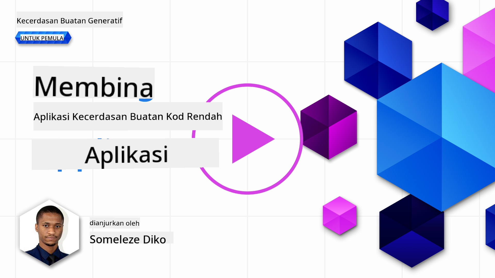
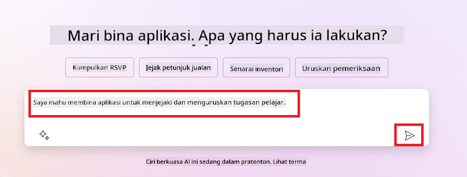
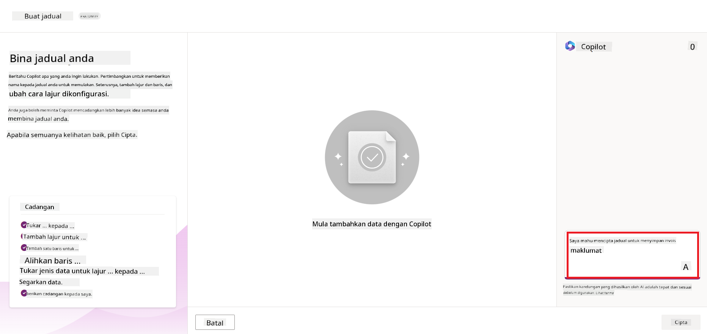
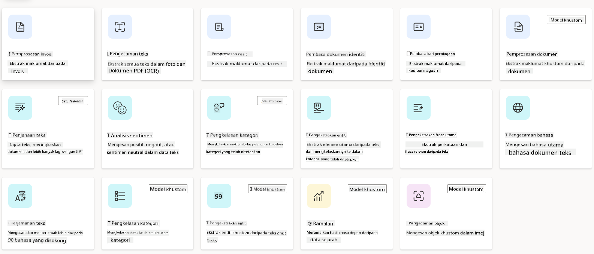
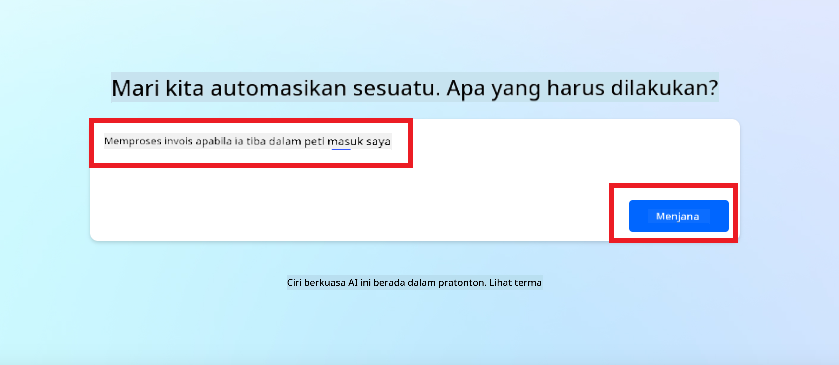
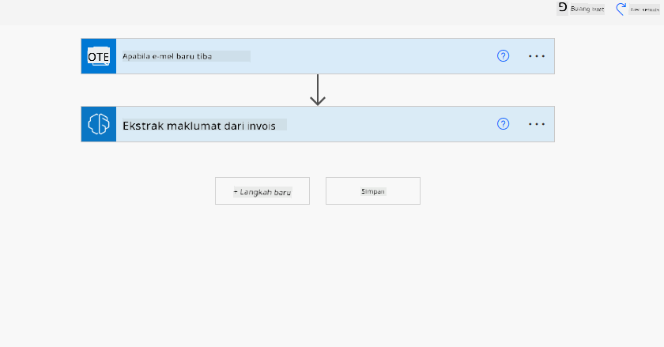
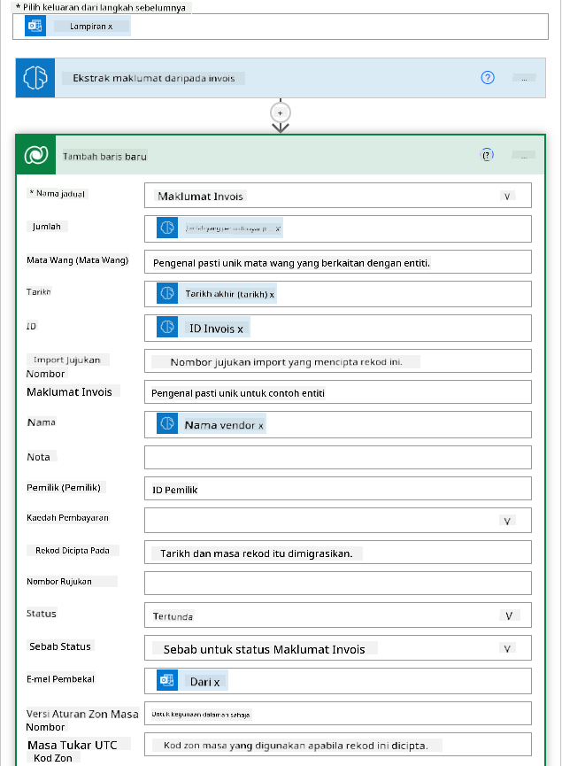
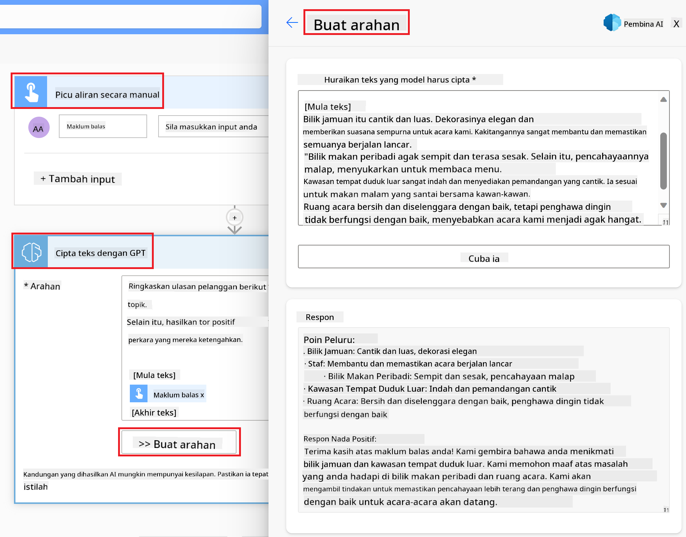

<!--
CO_OP_TRANSLATOR_METADATA:
{
  "original_hash": "f5ff3b6204a695a117d6f452403c95f7",
  "translation_date": "2025-05-19T20:50:10+00:00",
  "source_file": "10-building-low-code-ai-applications/README.md",
  "language_code": "ms"
}
-->
# Membina Aplikasi AI Kod Rendah

> _(Klik gambar di atas untuk menonton video pelajaran ini)_

## Pengenalan

Sekarang kita telah belajar bagaimana membina aplikasi penjanaan imej, mari kita berbicara tentang kod rendah. AI penjanaan boleh digunakan untuk pelbagai bidang termasuk kod rendah, tetapi apakah kod rendah dan bagaimana kita boleh menambah AI padanya?

Membina aplikasi dan penyelesaian telah menjadi lebih mudah untuk pembangun tradisional dan bukan pembangun melalui penggunaan Platform Pembangunan Kod Rendah. Platform Pembangunan Kod Rendah membolehkan anda membina aplikasi dan penyelesaian dengan sedikit atau tiada kod. Ini dicapai dengan menyediakan persekitaran pembangunan visual yang membolehkan anda mengheret dan melepaskan komponen untuk membina aplikasi dan penyelesaian. Ini membolehkan anda membina aplikasi dan penyelesaian dengan lebih cepat dan dengan kurang sumber. Dalam pelajaran ini, kita akan mendalami cara menggunakan Kod Rendah dan bagaimana meningkatkan pembangunan kod rendah dengan AI menggunakan Power Platform.

Power Platform menyediakan organisasi dengan peluang untuk memperkasakan pasukan mereka untuk membina penyelesaian mereka sendiri melalui persekitaran kod rendah atau tiada kod yang intuitif. Persekitaran ini membantu mempermudah proses membina penyelesaian. Dengan Power Platform, penyelesaian boleh dibina dalam beberapa hari atau minggu dan bukannya bulan atau tahun. Power Platform terdiri daripada lima produk utama: Power Apps, Power Automate, Power BI, Power Pages dan Copilot Studio.

Pelajaran ini merangkumi:

- Pengenalan kepada AI Penjanaan dalam Power Platform
- Pengenalan kepada Copilot dan bagaimana menggunakannya
- Menggunakan AI Penjanaan untuk membina aplikasi dan aliran dalam Power Platform
- Memahami Model AI dalam Power Platform dengan AI Builder

## Matlamat Pembelajaran

Menjelang akhir pelajaran ini, anda akan dapat:

- Memahami bagaimana Copilot berfungsi dalam Power Platform.

- Membina Aplikasi Penjejak Tugasan Pelajar untuk permulaan pendidikan kami.

- Membina Aliran Pemprosesan Invois yang menggunakan AI untuk mengekstrak maklumat daripada invois.

- Mengaplikasikan amalan terbaik semasa menggunakan Model AI Buat Teks dengan GPT.

Alat dan teknologi yang anda akan gunakan dalam pelajaran ini adalah:

- **Power Apps**, untuk aplikasi Penjejak Tugasan Pelajar, yang menyediakan persekitaran pembangunan kod rendah untuk membina aplikasi untuk menjejak, mengurus dan berinteraksi dengan data.

- **Dataverse**, untuk menyimpan data untuk aplikasi Penjejak Tugasan Pelajar di mana Dataverse akan menyediakan platform data kod rendah untuk menyimpan data aplikasi.

- **Power Automate**, untuk aliran Pemprosesan Invois di mana anda akan mempunyai persekitaran pembangunan kod rendah untuk membina aliran kerja untuk mengotomatisasi proses Pemprosesan Invois.

- **AI Builder**, untuk Model AI Pemprosesan Invois di mana anda akan menggunakan Model AI yang telah dibina untuk memproses invois untuk permulaan kami.

## AI Penjanaan dalam Power Platform

Meningkatkan pembangunan dan aplikasi kod rendah dengan AI penjanaan adalah fokus utama untuk Power Platform. Tujuannya adalah untuk membolehkan semua orang membina aplikasi, laman web, papan pemuka dan mengotomatisasi proses dengan AI, _tanpa memerlukan kepakaran sains data_. Tujuan ini dicapai dengan mengintegrasikan AI penjanaan ke dalam pengalaman pembangunan kod rendah dalam Power Platform dalam bentuk Copilot dan AI Builder.

### Bagaimana ini berfungsi?

Copilot adalah pembantu AI yang membolehkan anda membina penyelesaian Power Platform dengan menggambarkan keperluan anda dalam beberapa langkah perbualan menggunakan bahasa semula jadi. Anda boleh, sebagai contoh, mengarahkan pembantu AI anda untuk menyatakan apa bidang yang akan digunakan oleh aplikasi anda dan ia akan mencipta kedua-dua aplikasi dan model data asas atau anda boleh menentukan bagaimana untuk menyediakan aliran dalam Power Automate.

Anda boleh menggunakan fungsi yang didorong oleh Copilot sebagai ciri dalam skrin aplikasi anda untuk membolehkan pengguna mencari wawasan melalui interaksi perbualan.

AI Builder adalah keupayaan AI kod rendah yang tersedia dalam Power Platform yang membolehkan anda menggunakan Model AI untuk membantu anda mengotomatisasi proses dan meramalkan hasil. Dengan AI Builder anda boleh membawa AI ke aplikasi dan aliran anda yang menghubungkan kepada data anda dalam Dataverse atau dalam pelbagai sumber data awan, seperti SharePoint, OneDrive atau Azure.

Copilot tersedia dalam semua produk Power Platform: Power Apps, Power Automate, Power BI, Power Pages dan Power Virtual Agents. AI Builder tersedia dalam Power Apps dan Power Automate. Dalam pelajaran ini, kita akan fokus pada bagaimana menggunakan Copilot dan AI Builder dalam Power Apps dan Power Automate untuk membina penyelesaian untuk permulaan pendidikan kami.

### Copilot dalam Power Apps

Sebagai sebahagian daripada Power Platform, Power Apps menyediakan persekitaran pembangunan kod rendah untuk membina aplikasi untuk menjejak, mengurus dan berinteraksi dengan data. Ia adalah suite perkhidmatan pembangunan aplikasi dengan platform data yang boleh diskalakan dan keupayaan untuk menyambung ke perkhidmatan awan dan data di premis. Power Apps membolehkan anda membina aplikasi yang berjalan pada pelayar, tablet, dan telefon, dan boleh dikongsi dengan rakan sekerja. Power Apps memudahkan pengguna untuk memulakan pembangunan aplikasi dengan antara muka yang mudah, supaya setiap pengguna perniagaan atau pembangun profesional boleh membina aplikasi tersuai. Pengalaman pembangunan aplikasi juga dipertingkatkan dengan AI Penjanaan melalui Copilot.

Ciri pembantu AI copilot dalam Power Apps membolehkan anda menggambarkan jenis aplikasi yang anda perlukan dan maklumat apa yang anda mahu aplikasi anda jejak, kumpulkan, atau tunjukkan. Copilot kemudian menjana aplikasi Canvas yang responsif berdasarkan penerangan anda. Anda kemudian boleh menyesuaikan aplikasi untuk memenuhi keperluan anda. AI Copilot juga menjana dan mencadangkan Jadual Dataverse dengan bidang yang anda perlukan untuk menyimpan data yang anda mahu jejak dan beberapa data contoh. Kami akan melihat apa itu Dataverse dan bagaimana anda boleh menggunakannya dalam Power Apps dalam pelajaran ini kemudian. Anda kemudian boleh menyesuaikan jadual untuk memenuhi keperluan anda menggunakan ciri pembantu AI Copilot melalui langkah-langkah perbualan. Ciri ini tersedia dari skrin utama Power Apps.

### Copilot dalam Power Automate

Sebagai sebahagian daripada Power Platform, Power Automate membolehkan pengguna mencipta aliran kerja automatik antara aplikasi dan perkhidmatan. Ia membantu mengotomatisasi proses perniagaan berulang seperti komunikasi, pengumpulan data, dan kelulusan keputusan. Antara mukanya yang mudah membolehkan pengguna dengan setiap kompetensi teknikal (dari pemula hingga pembangun berpengalaman) mengotomatisasi tugas kerja. Pengalaman pembangunan aliran kerja juga dipertingkatkan dengan AI Penjanaan melalui Copilot.

Ciri pembantu AI copilot dalam Power Automate membolehkan anda menggambarkan jenis aliran yang anda perlukan dan tindakan apa yang anda mahu aliran anda lakukan. Copilot kemudian menjana aliran berdasarkan penerangan anda. Anda kemudian boleh menyesuaikan aliran untuk memenuhi keperluan anda. AI Copilot juga menjana dan mencadangkan tindakan yang anda perlukan untuk melaksanakan tugas yang anda mahu automatik. Kami akan melihat apa itu aliran dan bagaimana anda boleh menggunakannya dalam Power Automate dalam pelajaran ini kemudian. Anda kemudian boleh menyesuaikan tindakan untuk memenuhi keperluan anda menggunakan ciri pembantu AI Copilot melalui langkah-langkah perbualan. Ciri ini tersedia dari skrin utama Power Automate.

## Tugasan: Mengurus tugasan pelajar dan invois untuk permulaan kami, menggunakan Copilot

Permulaan kami menyediakan kursus dalam talian kepada pelajar. Permulaan telah berkembang dengan pesat dan kini bergelut untuk memenuhi permintaan untuk kursusnya. Permulaan telah mengupah anda sebagai pembangun Power Platform untuk membantu mereka membina penyelesaian kod rendah untuk membantu mereka menguruskan tugasan pelajar dan invois mereka. Penyelesaian mereka harus dapat membantu mereka menjejak dan menguruskan tugasan pelajar melalui aplikasi dan mengotomatisasi proses pemprosesan invois melalui aliran kerja. Anda telah diminta untuk menggunakan AI Penjanaan untuk membangunkan penyelesaian.

Apabila anda memulakan dengan menggunakan Copilot, anda boleh menggunakan [Perpustakaan Prompt Copilot Power Platform](https://github.com/pnp/powerplatform-prompts?WT.mc_id=academic-109639-somelezediko) untuk memulakan dengan prompt. Perpustakaan ini mengandungi senarai prompt yang boleh anda gunakan untuk membina aplikasi dan aliran dengan Copilot. Anda juga boleh menggunakan prompt dalam perpustakaan untuk mendapatkan idea bagaimana menggambarkan keperluan anda kepada Copilot.

### Membina Aplikasi Penjejak Tugasan Pelajar untuk Permulaan Kami

Para pendidik di permulaan kami telah bergelut untuk menjejak tugasan pelajar. Mereka telah menggunakan spreadsheet untuk menjejak tugasan tetapi ini telah menjadi sukar untuk diuruskan apabila bilangan pelajar meningkat. Mereka telah meminta anda untuk membina aplikasi yang akan membantu mereka menjejak dan menguruskan tugasan pelajar. Aplikasi tersebut harus membolehkan mereka menambah tugasan baru, melihat tugasan, mengemas kini tugasan dan memadam tugasan. Aplikasi tersebut juga harus membolehkan pendidik dan pelajar melihat tugasan yang telah dinilai dan yang belum dinilai.

Anda akan membina aplikasi menggunakan Copilot dalam Power Apps mengikuti langkah-langkah di bawah:

1. Navigasi ke skrin utama [Power Apps](https://make.powerapps.com?WT.mc_id=academic-105485-koreyst).

1. Gunakan kawasan teks pada skrin utama untuk menggambarkan aplikasi yang anda mahu bina. Sebagai contoh, **_Saya mahu membina aplikasi untuk menjejak dan menguruskan tugasan pelajar_**. Klik pada butang **Send** untuk menghantar prompt kepada AI Copilot.

1. AI Copilot akan mencadangkan Jadual Dataverse dengan bidang yang anda perlukan untuk menyimpan data yang anda mahu jejak dan beberapa data contoh. Anda kemudian boleh menyesuaikan jadual untuk memenuhi keperluan anda menggunakan ciri pembantu AI Copilot melalui langkah-langkah perbualan.

   > **Penting**: Dataverse adalah platform data asas untuk Power Platform. Ia adalah platform data kod rendah untuk menyimpan data aplikasi. Ia adalah perkhidmatan yang diurus sepenuhnya yang menyimpan data dengan selamat dalam Awan Microsoft dan disediakan dalam persekitaran Power Platform anda. Ia dilengkapi dengan keupayaan tadbir urus data terbina dalam, seperti klasifikasi data, garis keturunan data, kawalan akses terperinci, dan banyak lagi. Anda boleh belajar lebih lanjut tentang Dataverse [di sini](https://docs.microsoft.com/powerapps/maker/data-platform/data-platform-intro?WT.mc_id=academic-109639-somelezediko).

   

1. Para pendidik mahu menghantar emel kepada pelajar yang telah menyerahkan tugasan mereka untuk mengemas kini mereka tentang kemajuan tugasan mereka. Anda boleh menggunakan Copilot untuk menambah bidang baru ke jadual untuk menyimpan emel pelajar. Sebagai contoh, anda boleh menggunakan prompt berikut untuk menambah bidang baru ke jadual: **_Saya mahu menambah lajur untuk menyimpan emel pelajar_**. Klik pada butang **Send** untuk menghantar prompt kepada AI Copilot.

1. AI Copilot akan menjana bidang baru dan anda kemudian boleh menyesuaikan bidang tersebut untuk memenuhi keperluan anda.

1. Setelah anda selesai dengan jadual, klik pada butang **Create app** untuk mencipta aplikasi.

1. AI Copilot akan menjana aplikasi Canvas yang responsif berdasarkan penerangan anda. Anda kemudian boleh menyesuaikan aplikasi untuk memenuhi keperluan anda.

1. Untuk pendidik menghantar emel kepada pelajar, anda boleh menggunakan Copilot untuk menambah skrin baru ke aplikasi. Sebagai contoh, anda boleh menggunakan prompt berikut untuk menambah skrin baru ke aplikasi: **_Saya mahu menambah skrin untuk menghantar emel kepada pelajar_**. Klik pada butang **Send** untuk menghantar prompt kepada AI Copilot.

1. AI Copilot akan menjana skrin baru dan anda kemudian boleh menyesuaikan skrin tersebut untuk memenuhi keperluan anda.

1. Setelah anda selesai dengan aplikasi, klik pada butang **Save** untuk menyimpan aplikasi.

1. Untuk berkongsi aplikasi dengan pendidik, klik pada butang **Share** dan kemudian klik pada butang **Share** sekali lagi. Anda kemudian boleh berkongsi aplikasi dengan pendidik dengan memasukkan alamat emel mereka.

> **Kerja rumah anda**: Aplikasi yang anda baru bina adalah permulaan yang baik tetapi boleh diperbaiki. Dengan ciri emel, pendidik hanya boleh menghantar emel kepada pelajar secara manual dengan perlu menaip emel mereka. Bolehkah anda menggunakan Copilot untuk membina automasi yang akan membolehkan pendidik menghantar emel kepada pelajar secara automatik apabila mereka menyerahkan tugasan mereka? Petunjuk anda adalah dengan prompt yang betul anda boleh menggunakan Copilot dalam Power Automate untuk membina ini.

### Membina Jadual Maklumat Invois untuk Permulaan Kami

Pasukan kewangan permulaan kami telah bergelut untuk menjejak invois. Mereka telah menggunakan spreadsheet untuk menjejak invois tetapi ini telah menjadi sukar untuk diuruskan apabila bilangan invois meningkat. Mereka telah meminta anda untuk membina jadual yang akan membantu mereka menyimpan, menjejak dan menguruskan maklumat invois yang mereka terima. Jadual tersebut harus digunakan untuk membina automasi yang akan mengekstrak semua maklumat invois dan menyimpannya dalam jadual. Jadual tersebut juga harus membolehkan pasukan kewangan melihat invois yang telah dibayar dan yang belum dibayar.

Power Platform mempunyai platform data asas yang dipanggil Dataverse yang membolehkan anda menyimpan data untuk aplikasi dan penyelesaian anda. Dataverse menyediakan platform data kod rendah untuk menyimpan data aplikasi. Ia adalah perkhidmatan yang diurus sepenuhnya yang menyimpan data dengan selamat dalam Awan Microsoft dan disediakan dalam persekitaran Power Platform anda. Ia dilengkapi dengan keupayaan tadbir urus data terbina dalam, seperti klasifikasi data, garis keturunan data, kawalan akses terperinci, dan banyak lagi. Anda boleh belajar lebih lanjut [tentang Dataverse di sini](https://docs.microsoft.com/powerapps/maker/data-platform/data-platform-intro?WT.mc_id=academic-109639-somelezediko).

Mengapa kita harus menggunakan Dataverse untuk permulaan kita? Jadual standard dan tersuai dalam Dataverse menyediakan pilihan penyimpanan yang selamat dan berasaskan awan untuk data anda. Jadual membolehkan anda menyimpan pelbagai jenis data, sama seperti bagaimana anda mungkin menggunakan pelbagai lembaran kerja dalam satu buku kerja Excel. Anda boleh menggunakan jadual untuk menyimpan data yang khusus untuk keperluan organisasi atau perniagaan anda. Beberapa manfaat yang permulaan kita akan dapat daripada menggunakan Dataverse termasuk tetapi tidak terhad kepada:

- **Mudah untuk diurus**: Kedua-dua metadata dan data disimpan dalam awan, jadi anda tidak perlu bimbang tentang butiran bagaimana ia disimpan atau diuruskan. Anda boleh fokus pada membina aplikasi dan penyelesaian anda.

- **Selamat**: Dataverse menyediakan pilihan penyimpanan yang selamat dan berasaskan awan untuk data anda. Anda boleh mengawal siapa yang mempunyai akses kepada data dalam jadual anda dan bagaimana mereka boleh mengaksesnya menggunakan keselamatan berasaskan peranan.

- **Metadata yang kaya**: Jenis data dan hubungan digunakan secara langsung dalam Power Apps

- **Logik dan pengesahan**: Anda boleh menggunakan peraturan perniagaan, medan terhitung, dan peraturan pengesahan untuk menguatkuasakan logik perniagaan dan mengekalkan ketepatan data.

Sekarang anda tahu apa itu Dataverse dan mengapa anda harus menggunakannya, mari kita lihat bagaimana anda boleh menggunakan Copilot untuk mencipta jadual dalam Dataverse untuk memenuhi keperluan pasukan kewangan kami.

> **Nota** : Anda akan menggunakan jadual ini dalam bahagian seterusnya untuk membina automasi yang akan mengekstrak semua maklumat invois dan menyimpannya dalam jadual.
Untuk mencipta jadual dalam Dataverse menggunakan Copilot, ikuti langkah-langkah di bawah: 1. Navigasi ke skrin utama [Power Apps](https://make.powerapps.com?WT.mc_id=academic-105485-koreyst). 2. Pada bar navigasi kiri, pilih **Tables** dan kemudian klik pada **Describe the new Table**.  1. Pada skrin **Describe the new Table**, gunakan kawasan teks untuk menggambarkan jadual yang anda mahu cipta. Sebagai contoh, **_Saya mahu mencipta jadual untuk menyimpan maklumat invois_**. Klik pada butang **Send** untuk menghantar prompt kepada AI Copilot.  1. AI Copilot akan mencadangkan Jadual Dataverse dengan bidang yang anda perlukan untuk menyimpan data yang anda mahu jejak dan beberapa data contoh. Anda kemudian boleh menyesuaikan jadual untuk memenuhi keperluan anda menggunakan ciri pembantu AI Copilot melalui langkah-langkah perbualan.  1. Pasukan kewangan mahu menghantar emel kepada pembekal untuk mengemas kini mereka dengan status semasa invois mereka. Anda boleh menggunakan Copilot untuk menambah
teks. - **Analisis Sentimen**: Model ini mengesan sentimen positif, negatif, neutral, atau campuran dalam teks. - **Pembaca Kad Perniagaan**: Model ini mengekstrak maklumat dari kad perniagaan. - **Pengecaman Teks**: Model ini mengekstrak teks dari imej. - **Pengesanan Objek**: Model ini mengesan dan mengekstrak objek dari imej. - **Pemprosesan Dokumen**: Model ini mengekstrak maklumat dari borang. - **Pemprosesan Invois**: Model ini mengekstrak maklumat dari invois. Dengan Model AI Custom, anda boleh membawa model anda sendiri ke AI Builder supaya ia boleh berfungsi seperti mana-mana model custom AI Builder, membolehkan anda melatih model menggunakan data anda sendiri. Anda boleh menggunakan model-model ini untuk mengautomasi proses dan meramal hasil dalam kedua-dua Power Apps dan Power Automate. Apabila menggunakan model anda sendiri terdapat batasan yang dikenakan. Baca lebih lanjut mengenai [batasan](https://learn.microsoft.com/ai-builder/byo-model#limitations?WT.mc_id=academic-105485-koreyst) ini.  ## Tugasan #2 - Membina Aliran Pemprosesan Invois untuk Startup Kita Pasukan kewangan menghadapi kesukaran memproses invois. Mereka telah menggunakan spreadsheet untuk mengesan invois tetapi ini menjadi sukar untuk diuruskan apabila bilangan invois meningkat. Mereka telah meminta anda untuk membina aliran kerja yang akan membantu mereka memproses invois menggunakan AI. Aliran kerja tersebut harus membolehkan mereka mengekstrak maklumat dari invois dan menyimpan maklumat tersebut dalam jadual Dataverse. Aliran kerja tersebut juga harus membolehkan mereka menghantar e-mel kepada pasukan kewangan dengan maklumat yang diekstrak. Sekarang anda tahu apa itu AI Builder dan mengapa anda harus menggunakannya, mari kita lihat bagaimana anda boleh menggunakan Model AI Pemprosesan Invois dalam AI Builder, yang kita telah bincangkan sebelum ini, untuk membina aliran kerja yang akan membantu pasukan kewangan memproses invois. Untuk membina aliran kerja yang akan membantu pasukan kewangan memproses invois menggunakan Model AI Pemprosesan Invois dalam AI Builder, ikuti langkah-langkah berikut: 1. Navigasi ke skrin utama [Power Automate](https://make.powerautomate.com?WT.mc_id=academic-105485-koreyst). 2. Gunakan kawasan teks pada skrin utama untuk menerangkan aliran kerja yang anda ingin bina. Sebagai contoh, **_Proses invois apabila ia tiba dalam peti mel saya_**. Klik pada butang **Send** untuk menghantar arahan kepada AI Copilot.  3. AI Copilot akan mencadangkan tindakan yang anda perlu lakukan untuk tugas yang anda ingin automasi. Anda boleh klik pada butang **Next** untuk meneruskan langkah seterusnya. 4. Pada langkah seterusnya, Power Automate akan meminta anda untuk menyediakan sambungan yang diperlukan untuk aliran tersebut. Setelah selesai, klik pada butang **Create flow** untuk mencipta aliran tersebut. 5. AI Copilot akan menghasilkan aliran dan anda boleh mengubahsuai aliran tersebut untuk memenuhi keperluan anda. 6. Kemas kini pencetus aliran dan tetapkan **Folder** kepada folder di mana invois akan disimpan. Sebagai contoh, anda boleh menetapkan folder kepada **Inbox**. Klik pada **Show advanced options** dan tetapkan **Only with Attachments** kepada **Yes**. Ini akan memastikan aliran hanya berjalan apabila e-mel dengan lampiran diterima dalam folder tersebut. 7. Buang tindakan berikut dari aliran: **HTML to text**, **Compose**, **Compose 2**, **Compose 3** dan **Compose 4** kerana anda tidak akan menggunakannya. 8. Buang tindakan **Condition** dari aliran kerana anda tidak akan menggunakannya. Ia harus kelihatan seperti tangkapan skrin berikut:  9. Klik pada butang **Add an action** dan cari **Dataverse**. Pilih tindakan **Add a new row**. 10. Pada tindakan **Extract Information from invoices**, kemas kini **Invoice File** untuk menunjuk kepada **Attachment Content** dari e-mel. Ini akan memastikan aliran mengekstrak maklumat dari lampiran invois. 11. Pilih **Table** yang anda cipta sebelum ini. Sebagai contoh, anda boleh memilih jadual **Invoice Information**. Pilih kandungan dinamik dari tindakan sebelumnya untuk mengisi medan berikut: - ID - Jumlah - Tarikh - Nama - Status - Tetapkan **Status** kepada **Pending**. - E-mel Pembekal - Gunakan kandungan dinamik **From** dari pencetus **When a new email arrives**.  12. Setelah selesai dengan aliran, klik pada butang **Save** untuk menyimpan aliran tersebut. Anda kemudian boleh menguji aliran dengan menghantar e-mel dengan invois ke folder yang anda nyatakan dalam pencetus. > **Kerja rumah anda**: Aliran yang anda baru bina adalah permulaan yang baik, sekarang anda perlu memikirkan bagaimana anda boleh membina automasi yang akan membolehkan pasukan kewangan kita menghantar e-mel kepada pembekal untuk mengemas kini mereka dengan status semasa invois mereka. Petunjuk anda: aliran mesti berjalan apabila status invois berubah.

## Menggunakan Model AI Penjanaan Teks dalam Power Automate

Model AI Buat Teks dengan GPT dalam AI Builder membolehkan anda menjana teks berdasarkan arahan dan dikuasakan oleh Microsoft Azure OpenAI Service. Dengan kemampuan ini, anda boleh menggabungkan teknologi GPT (Generative Pre-Trained Transformer) ke dalam aplikasi dan aliran anda untuk membina pelbagai aliran automasi dan aplikasi yang berwawasan.

Model GPT menjalani latihan intensif pada sejumlah besar data, membolehkan mereka menghasilkan teks yang menyerupai bahasa manusia apabila diberikan arahan. Apabila digabungkan dengan automasi aliran kerja, model AI seperti GPT boleh dimanfaatkan untuk mempermudah dan mengautomasi pelbagai tugas.

Sebagai contoh, anda boleh membina aliran untuk menjana teks secara automatik untuk pelbagai penggunaan, seperti: draf e-mel, penerangan produk, dan banyak lagi. Anda juga boleh menggunakan model untuk menjana teks untuk pelbagai aplikasi, seperti chatbot dan aplikasi khidmat pelanggan yang membolehkan ejen khidmat pelanggan memberi respons dengan berkesan dan cekap terhadap pertanyaan pelanggan.

Untuk belajar bagaimana menggunakan Model AI ini dalam Power Automate, lalui modul [Tambah kepintaran dengan AI Builder dan GPT](https://learn.microsoft.com/training/modules/ai-builder-text-generation/?WT.mc_id=academic-109639-somelezediko).

## Kerja Hebat! Teruskan Pembelajaran Anda

Selepas menyelesaikan pelajaran ini, lihat koleksi [Pembelajaran AI Generatif](https://aka.ms/genai-collection?WT.mc_id=academic-105485-koreyst) kami untuk terus meningkatkan pengetahuan AI Generatif anda!

Pergi ke Pelajaran 11 di mana kita akan melihat bagaimana untuk [mengintegrasikan AI Generatif dengan Panggilan Fungsi](../11-integrating-with-function-calling/README.md?WT.mc_id=academic-105485-koreyst)!

**Penafian**:  
Dokumen ini telah diterjemahkan menggunakan perkhidmatan terjemahan AI [Co-op Translator](https://github.com/Azure/co-op-translator). Walaupun kami berusaha untuk ketepatan, sila ambil perhatian bahawa terjemahan automatik mungkin mengandungi kesilapan atau ketidaktepatan. Dokumen asal dalam bahasa asalnya harus dianggap sebagai sumber yang berwibawa. Untuk maklumat kritikal, terjemahan manusia profesional disyorkan. Kami tidak bertanggungjawab atas sebarang salah faham atau salah tafsir yang timbul daripada penggunaan terjemahan ini.