<!--
CO_OP_TRANSLATOR_METADATA:
{
  "original_hash": "f5ff3b6204a695a117d6f452403c95f7",
  "translation_date": "2025-06-25T19:08:53+00:00",
  "source_file": "10-building-low-code-ai-applications/README.md",
  "language_code": "ms"
}
-->
# Membina Aplikasi AI Kod Rendah

[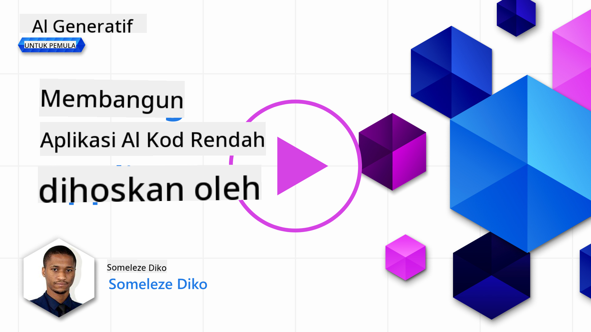](https://aka.ms/gen-ai-lesson10-gh?WT.mc_id=academic-105485-koreyst)

> _(Klik gambar di atas untuk menonton video pelajaran ini)_

## Pengenalan

Sekarang kita telah belajar bagaimana membina aplikasi penjanaan imej, mari kita bincangkan tentang kod rendah. AI generatif boleh digunakan untuk pelbagai bidang termasuk kod rendah, tetapi apakah kod rendah dan bagaimana kita boleh menambah AI kepadanya?

Membina aplikasi dan penyelesaian telah menjadi lebih mudah untuk pembangun tradisional dan bukan pembangun melalui penggunaan Platform Pembangunan Kod Rendah. Platform Pembangunan Kod Rendah membolehkan anda membina aplikasi dan penyelesaian dengan sedikit atau tanpa kod. Ini dicapai dengan menyediakan persekitaran pembangunan visual yang membolehkan anda seret dan lepas komponen untuk membina aplikasi dan penyelesaian. Ini membolehkan anda membina aplikasi dan penyelesaian dengan lebih cepat dan dengan sumber yang lebih sedikit. Dalam pelajaran ini, kita akan mendalami bagaimana menggunakan Kod Rendah dan bagaimana meningkatkan pembangunan kod rendah dengan AI menggunakan Power Platform.

Power Platform memberikan organisasi peluang untuk memperkasakan pasukan mereka untuk membina penyelesaian mereka sendiri melalui persekitaran kod rendah atau tanpa kod yang intuitif. Persekitaran ini membantu memudahkan proses membina penyelesaian. Dengan Power Platform, penyelesaian boleh dibina dalam beberapa hari atau minggu berbanding bulan atau tahun. Power Platform terdiri daripada lima produk utama: Power Apps, Power Automate, Power BI, Power Pages dan Copilot Studio.

Pelajaran ini merangkumi:

- Pengenalan kepada AI Generatif dalam Power Platform
- Pengenalan kepada Copilot dan cara menggunakannya
- Menggunakan AI Generatif untuk membina aplikasi dan aliran dalam Power Platform
- Memahami Model AI dalam Power Platform dengan AI Builder

## Matlamat Pembelajaran

Menjelang akhir pelajaran ini, anda akan dapat:

- Memahami bagaimana Copilot berfungsi dalam Power Platform.

- Membina Aplikasi Penjejak Tugasan Pelajar untuk permulaan pendidikan kami.

- Membina Aliran Pemprosesan Invois yang menggunakan AI untuk mengekstrak maklumat dari invois.

- Menggunakan amalan terbaik semasa menggunakan Model AI Create Text dengan GPT.

Alat dan teknologi yang anda akan gunakan dalam pelajaran ini adalah:

- **Power Apps**, untuk aplikasi Penjejak Tugasan Pelajar, yang menyediakan persekitaran pembangunan kod rendah untuk membina aplikasi untuk menjejak, mengurus dan berinteraksi dengan data.

- **Dataverse**, untuk menyimpan data untuk aplikasi Penjejak Tugasan Pelajar di mana Dataverse akan menyediakan platform data kod rendah untuk menyimpan data aplikasi.

- **Power Automate**, untuk aliran Pemprosesan Invois di mana anda akan mempunyai persekitaran pembangunan kod rendah untuk membina aliran kerja untuk mengotomasi proses Pemprosesan Invois.

- **AI Builder**, untuk Model AI Pemprosesan Invois di mana anda akan menggunakan Model AI sedia ada untuk memproses invois untuk permulaan kami.

## AI Generatif dalam Power Platform

Meningkatkan pembangunan dan aplikasi kod rendah dengan AI generatif adalah kawasan fokus utama untuk Power Platform. Matlamatnya adalah untuk membolehkan semua orang membina aplikasi berkuasa AI, laman web, papan pemuka dan mengotomasi proses dengan AI, _tanpa memerlukan kepakaran sains data_. Matlamat ini dicapai dengan mengintegrasikan AI generatif ke dalam pengalaman pembangunan kod rendah dalam Power Platform dalam bentuk Copilot dan AI Builder.

### Bagaimana ini berfungsi?

Copilot adalah pembantu AI yang membolehkan anda membina penyelesaian Power Platform dengan menggambarkan keperluan anda dalam satu siri langkah perbualan menggunakan bahasa semula jadi. Anda boleh, sebagai contoh, mengarahkan pembantu AI anda untuk menyatakan bidang apa yang akan digunakan oleh aplikasi anda dan ia akan mencipta kedua-dua aplikasi dan model data asas atau anda boleh menentukan bagaimana untuk menetapkan aliran dalam Power Automate.

Anda boleh menggunakan fungsi yang didorong oleh Copilot sebagai ciri dalam skrin aplikasi anda untuk membolehkan pengguna menemui wawasan melalui interaksi perbualan.

AI Builder adalah keupayaan AI kod rendah yang tersedia dalam Power Platform yang membolehkan anda menggunakan Model AI untuk membantu anda mengotomasi proses dan meramalkan hasil. Dengan AI Builder, anda boleh membawa AI ke aplikasi dan aliran anda yang berhubung dengan data anda dalam Dataverse atau dalam pelbagai sumber data awan, seperti SharePoint, OneDrive atau Azure.

Copilot tersedia dalam semua produk Power Platform: Power Apps, Power Automate, Power BI, Power Pages dan Power Virtual Agents. AI Builder tersedia dalam Power Apps dan Power Automate. Dalam pelajaran ini, kita akan fokus pada bagaimana menggunakan Copilot dan AI Builder dalam Power Apps dan Power Automate untuk membina penyelesaian untuk permulaan pendidikan kami.

### Copilot dalam Power Apps

Sebagai sebahagian daripada Power Platform, Power Apps menyediakan persekitaran pembangunan kod rendah untuk membina aplikasi untuk menjejak, mengurus dan berinteraksi dengan data. Ia adalah suite perkhidmatan pembangunan aplikasi dengan platform data yang boleh diskalakan dan keupayaan untuk berhubung dengan perkhidmatan awan dan data di premis. Power Apps membolehkan anda membina aplikasi yang berjalan di pelayar, tablet, dan telefon, dan boleh dikongsi dengan rakan sekerja. Power Apps memudahkan pengguna ke dalam pembangunan aplikasi dengan antara muka yang mudah, supaya setiap pengguna perniagaan atau pembangun pro boleh membina aplikasi tersuai. Pengalaman pembangunan aplikasi juga dipertingkatkan dengan AI Generatif melalui Copilot.

Ciri pembantu AI copilot dalam Power Apps membolehkan anda menggambarkan jenis aplikasi yang anda perlukan dan maklumat apa yang anda mahu aplikasi anda jejak, kumpul, atau tunjukkan. Copilot kemudian menghasilkan aplikasi Canvas responsif berdasarkan penerangan anda. Anda kemudian boleh menyesuaikan aplikasi untuk memenuhi keperluan anda. AI Copilot juga menghasilkan dan mencadangkan Jadual Dataverse dengan bidang yang anda perlukan untuk menyimpan data yang anda mahu jejak dan beberapa data contoh. Kita akan melihat apa itu Dataverse dan bagaimana anda boleh menggunakannya dalam Power Apps dalam pelajaran ini nanti. Anda kemudian boleh menyesuaikan jadual untuk memenuhi keperluan anda menggunakan ciri pembantu AI Copilot melalui langkah perbualan. Ciri ini tersedia dari skrin utama Power Apps.

### Copilot dalam Power Automate

Sebagai sebahagian daripada Power Platform, Power Automate membolehkan pengguna mencipta aliran kerja automatik antara aplikasi dan perkhidmatan. Ia membantu mengotomasi proses perniagaan yang berulang seperti komunikasi, pengumpulan data, dan kelulusan keputusan. Antara muka yang mudah membolehkan pengguna dengan setiap kecekapan teknikal (dari pemula hingga pembangun berpengalaman) untuk mengotomasi tugas kerja. Pengalaman pembangunan aliran kerja juga dipertingkatkan dengan AI Generatif melalui Copilot.

Ciri pembantu AI copilot dalam Power Automate membolehkan anda menggambarkan jenis aliran yang anda perlukan dan tindakan apa yang anda mahu aliran anda lakukan. Copilot kemudian menghasilkan aliran berdasarkan penerangan anda. Anda kemudian boleh menyesuaikan aliran untuk memenuhi keperluan anda. AI Copilot juga menghasilkan dan mencadangkan tindakan yang anda perlukan untuk melaksanakan tugas yang anda mahu otomasi. Kita akan melihat apa itu aliran dan bagaimana anda boleh menggunakannya dalam Power Automate dalam pelajaran ini nanti. Anda kemudian boleh menyesuaikan tindakan untuk memenuhi keperluan anda menggunakan ciri pembantu AI Copilot melalui langkah perbualan. Ciri ini tersedia dari skrin utama Power Automate.

## Tugasan: Menguruskan tugasan pelajar dan invois untuk permulaan kami, menggunakan Copilot

Permulaan kami menyediakan kursus dalam talian kepada pelajar. Permulaan ini telah berkembang dengan pesat dan kini bergelut untuk memenuhi permintaan kursusnya. Permulaan ini telah mengupah anda sebagai pembangun Power Platform untuk membantu mereka membina penyelesaian kod rendah untuk membantu mereka menguruskan tugasan pelajar dan invois mereka. Penyelesaian mereka sepatutnya dapat membantu mereka menjejak dan menguruskan tugasan pelajar melalui aplikasi dan mengotomasi proses pemprosesan invois melalui aliran kerja. Anda telah diminta untuk menggunakan AI Generatif untuk membangunkan penyelesaian tersebut.

Apabila anda memulakan dengan menggunakan Copilot, anda boleh menggunakan [Perpustakaan Prompt Copilot Power Platform](https://github.com/pnp/powerplatform-prompts?WT.mc_id=academic-109639-somelezediko) untuk memulakan dengan prompt. Perpustakaan ini mengandungi senarai prompt yang anda boleh gunakan untuk membina aplikasi dan aliran dengan Copilot. Anda juga boleh menggunakan prompt dalam perpustakaan untuk mendapatkan idea bagaimana menggambarkan keperluan anda kepada Copilot.

### Membina Aplikasi Penjejak Tugasan Pelajar untuk Permulaan Kami

Pendidik di permulaan kami telah bergelut untuk menjejak tugasan pelajar. Mereka telah menggunakan hamparan untuk menjejak tugasan tetapi ini telah menjadi sukar untuk diuruskan apabila bilangan pelajar meningkat. Mereka telah meminta anda membina aplikasi yang akan membantu mereka menjejak dan menguruskan tugasan pelajar. Aplikasi ini sepatutnya membolehkan mereka menambah tugasan baru, melihat tugasan, mengemas kini tugasan dan memadam tugasan. Aplikasi ini juga sepatutnya membolehkan pendidik dan pelajar melihat tugasan yang telah dinilai dan yang belum dinilai.

Anda akan membina aplikasi menggunakan Copilot dalam Power Apps mengikuti langkah-langkah berikut:

1. Pergi ke skrin utama [Power Apps](https://make.powerapps.com?WT.mc_id=academic-105485-koreyst).

1. Gunakan kawasan teks di skrin utama untuk menggambarkan aplikasi yang anda mahu bina. Sebagai contoh, **_Saya mahu membina aplikasi untuk menjejak dan menguruskan tugasan pelajar_**. Klik pada butang **Hantar** untuk menghantar prompt kepada AI Copilot.

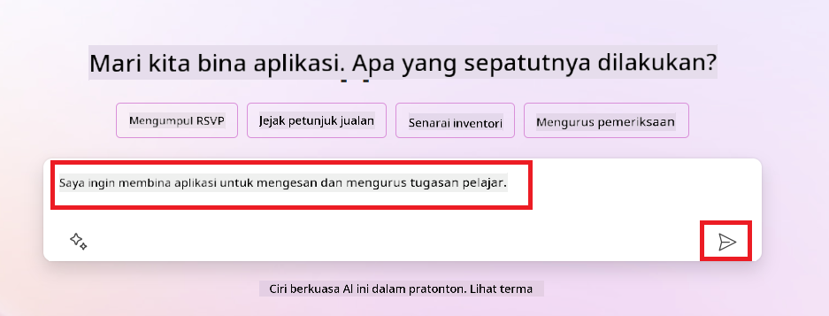

1. AI Copilot akan mencadangkan Jadual Dataverse dengan bidang yang anda perlukan untuk menyimpan data yang anda mahu jejak dan beberapa data contoh. Anda kemudian boleh menyesuaikan jadual untuk memenuhi keperluan anda menggunakan ciri pembantu AI Copilot melalui langkah perbualan.

   > **Penting**: Dataverse adalah platform data asas untuk Power Platform. Ia adalah platform data kod rendah untuk menyimpan data aplikasi. Ia adalah perkhidmatan yang diuruskan sepenuhnya yang menyimpan data dengan selamat dalam Microsoft Cloud dan disediakan dalam persekitaran Power Platform anda. Ia datang dengan keupayaan tadbir urus data terbina dalam, seperti pengelasan data, garis keturunan data, kawalan akses terperinci, dan banyak lagi. Anda boleh belajar lebih lanjut tentang Dataverse [di sini](https://docs.microsoft.com/powerapps/maker/data-platform/data-platform-intro?WT.mc_id=academic-109639-somelezediko).

   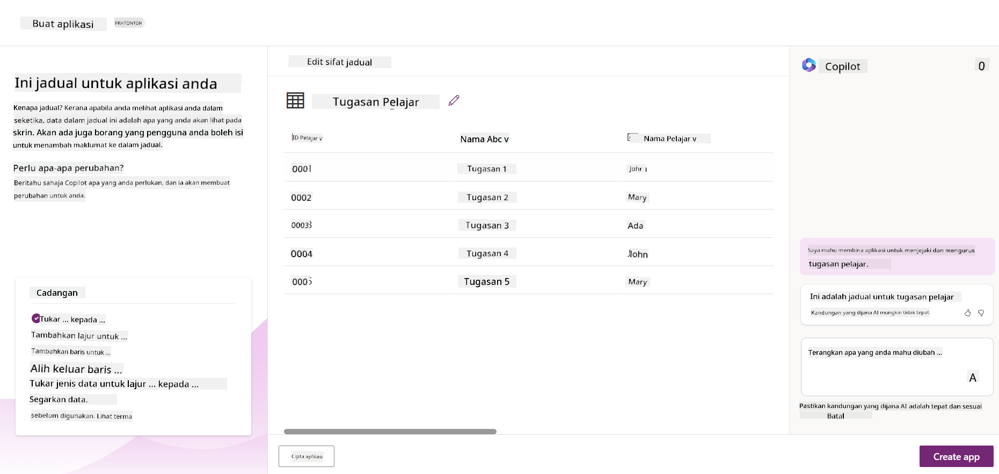

1. Pendidik mahu menghantar e-mel kepada pelajar yang telah menghantar tugasan mereka untuk mengemas kini mereka tentang kemajuan tugasan mereka. Anda boleh menggunakan Copilot untuk menambah bidang baru kepada jadual untuk menyimpan e-mel pelajar. Sebagai contoh, anda boleh menggunakan prompt berikut untuk menambah bidang baru kepada jadual: **_Saya mahu menambah lajur untuk menyimpan e-mel pelajar_**. Klik pada butang **Hantar** untuk menghantar prompt kepada AI Copilot.

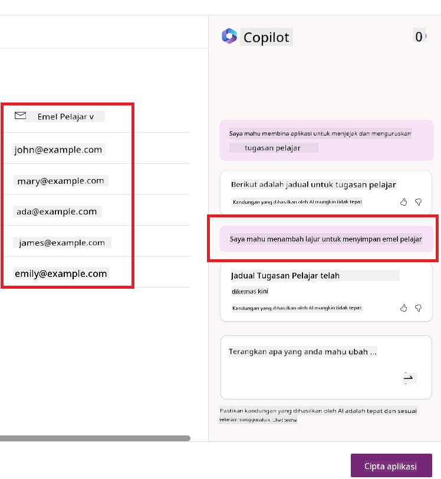

1. AI Copilot akan menghasilkan bidang baru dan anda kemudian boleh menyesuaikan bidang untuk memenuhi keperluan anda.

1. Setelah anda selesai dengan jadual, klik pada butang **Bina aplikasi** untuk membina aplikasi.

1. AI Copilot akan menghasilkan aplikasi Canvas responsif berdasarkan penerangan anda. Anda kemudian boleh menyesuaikan aplikasi untuk memenuhi keperluan anda.

1. Untuk pendidik menghantar e-mel kepada pelajar, anda boleh menggunakan Copilot untuk menambah skrin baru kepada aplikasi. Sebagai contoh, anda boleh menggunakan prompt berikut untuk menambah skrin baru kepada aplikasi: **_Saya mahu menambah skrin untuk menghantar e-mel kepada pelajar_**. Klik pada butang **Hantar** untuk menghantar prompt kepada AI Copilot.

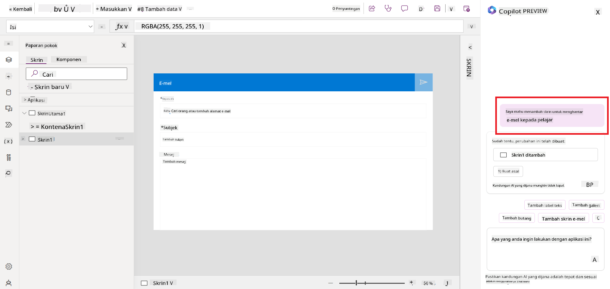

1. AI Copilot akan menghasilkan skrin baru dan anda kemudian boleh menyesuaikan skrin untuk memenuhi keperluan anda.

1. Setelah anda selesai dengan aplikasi, klik pada butang **Simpan** untuk menyimpan aplikasi.

1. Untuk berkongsi aplikasi dengan pendidik, klik pada butang **Kongsi** dan kemudian klik pada butang **Kongsi** sekali lagi. Anda kemudian boleh berkongsi aplikasi dengan pendidik dengan memasukkan alamat e-mel mereka.

> **Kerja rumah anda**: Aplikasi yang baru anda bina adalah permulaan yang baik tetapi boleh diperbaiki. Dengan ciri e-mel, pendidik hanya boleh menghantar e-mel kepada pelajar secara manual dengan perlu menaip e-mel mereka. Bolehkah anda menggunakan Copilot untuk membina automasi yang akan membolehkan pendidik menghantar e-mel kepada pelajar secara automatik apabila mereka menghantar tugasan mereka? Petunjuk anda adalah dengan prompt yang betul anda boleh menggunakan Copilot dalam Power Automate untuk membina ini.

### Membina Jadual Maklumat Invois untuk Permulaan Kami

Pasukan kewangan permulaan kami telah bergelut untuk menjejak invois. Mereka telah menggunakan hamparan untuk menjejak invois tetapi ini telah menjadi sukar untuk diuruskan apabila bilangan invois meningkat. Mereka telah meminta anda membina jadual yang akan membantu mereka menyimpan, menjejak dan menguruskan maklumat invois yang mereka terima. Jadual ini sepatutnya digunakan untuk membina automasi yang akan mengekstrak semua maklumat invois dan menyimpannya dalam jadual. Jadual ini juga sepatutnya membolehkan pasukan kewangan melihat invois yang telah dibayar dan yang belum dibayar.

Power Platform mempunyai platform data asas yang dipanggil Dataverse yang membolehkan anda menyimpan data untuk aplikasi dan penyelesaian anda. Dataverse menyediakan platform data kod rendah untuk menyimpan data aplikasi. Ia adalah perkhidmatan yang diuruskan sepenuhnya yang menyimpan data dengan selamat dalam Microsoft Cloud dan disediakan dalam persekitaran Power Platform anda. Ia datang dengan keupayaan tadbir urus data terbina dalam, seperti pengelasan data, garis keturunan data, kawalan akses terperinci, dan banyak lagi. Anda boleh belajar lebih lanjut [tentang Dataverse di sini](https://docs.microsoft.com/powerapps/maker/data-platform/data-platform-intro?WT.mc_id=academic-109639-somelezediko).

Mengapa kita harus menggunakan Dataverse untuk permulaan kami? Jadual standard dan tersuai dalam Dataverse menyediakan pilihan penyimpanan yang selamat dan berasaskan awan untuk data anda. Jadual membolehkan anda menyimpan pelbagai jenis data, sama seperti bagaimana anda mungkin menggunakan pelbagai lembaran kerja dalam satu buku kerja Excel. Anda boleh menggunakan jadual untuk menyimpan data yang khusus kepada keperluan organisasi atau perniagaan anda. Beberapa manfaat yang permulaan kami akan dapat dari menggunakan Dataverse termasuk tetapi tidak terhad kepada:

- **Mudah diurus**: Kedua-dua metadata dan data disimpan dalam awan, jadi anda tidak perlu risau tentang butiran bagaimana ia disimpan atau diuruskan. Anda boleh fokus pada membina aplikasi dan penyelesaian anda.

- **Selamat**: Dataverse menyediakan pilihan penyimpanan yang selamat dan berasaskan awan untuk data anda. Anda boleh mengawal siapa yang mempunyai akses kepada data dalam jadual anda dan bagaimana mereka boleh mengaksesnya menggunakan keselamatan berasaskan peranan.

- **Metadata yang kaya**: Jenis data dan hubungan digunakan secara langsung dalam Power Apps

- **Logik dan pengesahan**: Anda boleh menggunakan peraturan perniagaan, medan terhitung, dan peraturan pengesahan untuk menguatkuasakan logik perniagaan dan mengekalkan ketepatan data.

Sekarang anda tahu apa itu Dataverse dan mengapa anda harus menggunakannya, mari kita lihat bagaimana anda boleh menggunakan Copilot untuk mencipta jadual dalam Dataverse untuk memenuhi keperluan pasukan kewangan kami.

> **Nota**: Anda akan menggunakan jadual ini dalam bahagian seterusnya untuk membina automasi yang akan mengekstrak semua maklumat invois dan menyimpannya dalam jadual.
Untuk mencipta jadual dalam Dataverse menggunakan Copilot, ikuti langkah-langkah berikut: 1. Pergi ke skrin utama [Power Apps](https://make.powerapps.com?WT.mc_id=academic-105485-koreyst). 2. Pada bar navigasi kiri, pilih **Jadual** dan kemudian klik pada **Gambarkan Jadual Baru**. 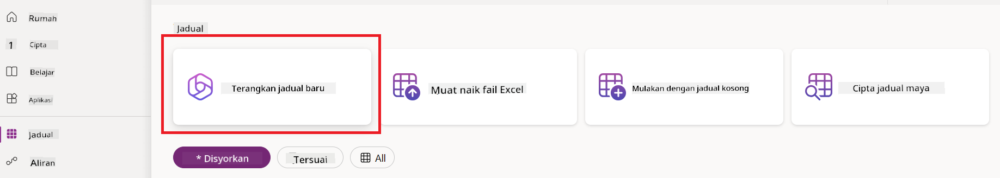 1. Pada skrin **Gambarkan Jadual Baru**, gunakan kawasan teks untuk menggambarkan jadual yang anda mahu cipta. Sebagai contoh, **_Saya mahu mencipta jadual untuk menyimpan maklumat invois_**. Klik pada butang **Hantar** untuk menghantar prompt kepada AI Copilot. 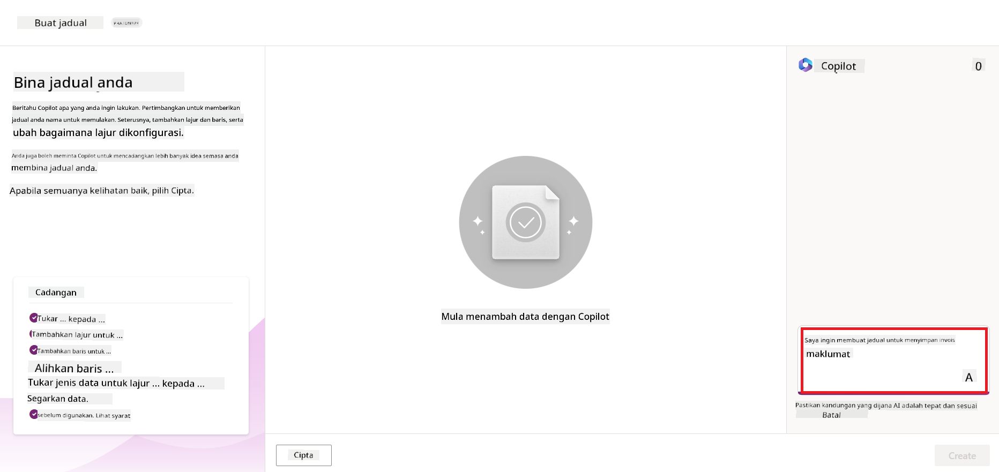 1. AI Copilot akan mencadangkan Jadual Dataverse dengan bidang yang anda perlukan untuk menyimpan data yang anda mahu jejak dan beberapa data contoh. Anda kemudian boleh menyesuaikan jadual untuk memenuhi keperluan anda menggunakan ciri pembantu AI Copilot melalui langkah perbualan. 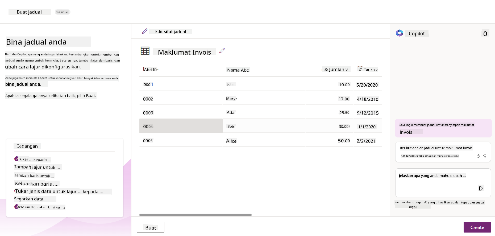 1. Pasukan kewangan mahu menghantar e-mel kepada pembekal untuk mengemas kini mereka dengan status semasa invois mereka. Anda boleh menggunakan
teks. - **Analisis Sentimen**: Model ini mengesan sentimen positif, negatif, neutral, atau campuran dalam teks. - **Pembaca Kad Perniagaan**: Model ini mengekstrak maklumat daripada kad perniagaan. - **Pengecaman Teks**: Model ini mengekstrak teks daripada imej. - **Pengesanan Objek**: Model ini mengesan dan mengekstrak objek daripada imej. - **Pemprosesan Dokumen**: Model ini mengekstrak maklumat daripada borang. - **Pemprosesan Invois**: Model ini mengekstrak maklumat daripada invois. Dengan Model AI Tersuai, anda boleh membawa model anda sendiri ke dalam AI Builder supaya ia boleh berfungsi seperti mana-mana model tersuai AI Builder, membolehkan anda melatih model menggunakan data anda sendiri. Anda boleh menggunakan model ini untuk mengautomatikkan proses dan meramalkan hasil dalam kedua-dua Power Apps dan Power Automate. Apabila menggunakan model anda sendiri terdapat batasan yang dikenakan. Baca lebih lanjut mengenai [batasan](https://learn.microsoft.com/ai-builder/byo-model#limitations?WT.mc_id=academic-105485-koreyst) ini. 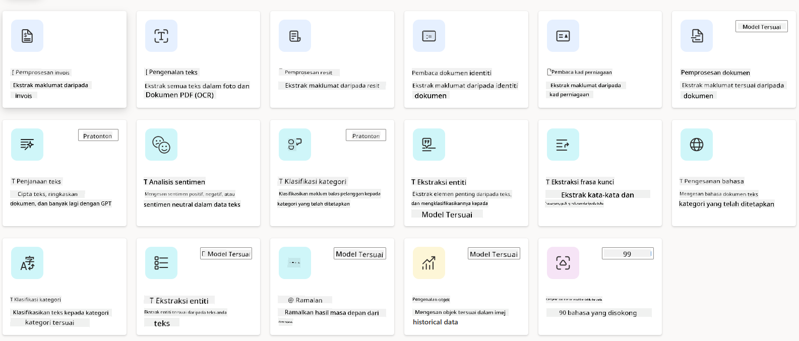

## Tugasan #2 - Bina Aliran Pemprosesan Invois untuk Permulaan Kami

Pasukan kewangan telah menghadapi kesukaran untuk memproses invois. Mereka telah menggunakan hamparan untuk menjejaki invois tetapi ini menjadi sukar untuk diuruskan apabila bilangan invois meningkat. Mereka telah meminta anda membina aliran kerja yang akan membantu mereka memproses invois menggunakan AI. Aliran kerja itu harus membolehkan mereka mengekstrak maklumat daripada invois dan menyimpan maklumat tersebut dalam jadual Dataverse. Aliran kerja itu juga harus membolehkan mereka menghantar e-mel kepada pasukan kewangan dengan maklumat yang diekstrak. Sekarang anda tahu apa itu AI Builder dan mengapa anda harus menggunakannya, mari kita lihat bagaimana anda boleh menggunakan Model AI Pemprosesan Invois dalam AI Builder, yang telah kita bincangkan sebelum ini, untuk membina aliran kerja yang akan membantu pasukan kewangan memproses invois. Untuk membina aliran kerja yang akan membantu pasukan kewangan memproses invois menggunakan Model AI Pemprosesan Invois dalam AI Builder, ikuti langkah-langkah berikut:

1. Navigasi ke skrin utama [Power Automate](https://make.powerautomate.com?WT.mc_id=academic-105485-koreyst).
2. Gunakan kawasan teks pada skrin utama untuk menerangkan aliran kerja yang ingin anda bina. Sebagai contoh, **_Proseskan invois apabila ia tiba di peti mel saya_**. Klik butang **Hantar** untuk menghantar arahan kepada AI Copilot. 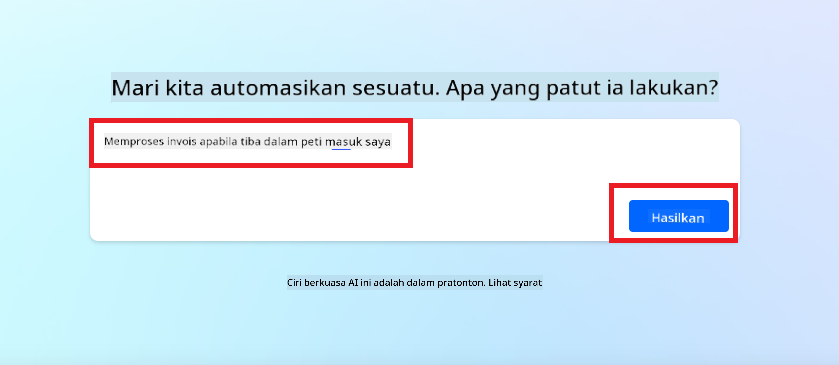
3. AI Copilot akan mencadangkan tindakan yang perlu anda lakukan untuk melaksanakan tugas yang ingin anda automatikkan. Anda boleh klik butang **Seterusnya** untuk meneruskan ke langkah seterusnya.
4. Pada langkah seterusnya, Power Automate akan meminta anda untuk menyediakan sambungan yang diperlukan untuk aliran tersebut. Setelah selesai, klik butang **Cipta aliran** untuk mencipta aliran tersebut.
5. AI Copilot akan menghasilkan aliran dan anda kemudian boleh menyesuaikan aliran tersebut untuk memenuhi keperluan anda.
6. Kemas kini pencetus aliran dan tetapkan **Folder** kepada folder di mana invois akan disimpan. Sebagai contoh, anda boleh menetapkan folder kepada **Inbox**. Klik pada **Tunjukkan pilihan lanjutan** dan tetapkan **Hanya dengan Lampiran** kepada **Ya**. Ini akan memastikan aliran hanya berjalan apabila e-mel dengan lampiran diterima dalam folder tersebut.
7. Buang tindakan berikut dari aliran: **HTML kepada teks**, **Compose**, **Compose 2**, **Compose 3** dan **Compose 4** kerana anda tidak akan menggunakannya.
8. Buang tindakan **Condition** dari aliran kerana anda tidak akan menggunakannya. Ia harus kelihatan seperti tangkapan skrin berikut: 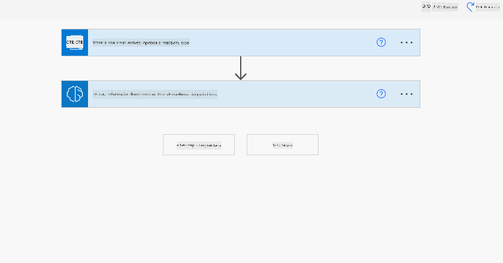
9. Klik pada butang **Tambah tindakan** dan cari **Dataverse**. Pilih tindakan **Tambah baris baru**.
10. Pada tindakan **Ekstrak Maklumat dari invois**, kemas kini **Fail Invois** untuk menunjuk kepada **Kandungan Lampiran** dari e-mel. Ini akan memastikan aliran mengekstrak maklumat dari lampiran invois.
11. Pilih **Jadual** yang anda cipta sebelum ini. Sebagai contoh, anda boleh memilih jadual **Maklumat Invois**. Pilih kandungan dinamik dari tindakan sebelumnya untuk mengisi medan berikut:
   - ID
   - Jumlah
   - Tarikh
   - Nama
   - Status
   - Tetapkan **Status** kepada **Tertunda**.
   - E-mel Pembekal
   - Gunakan kandungan dinamik **Dari** dari pencetus **Apabila e-mel baru tiba**. 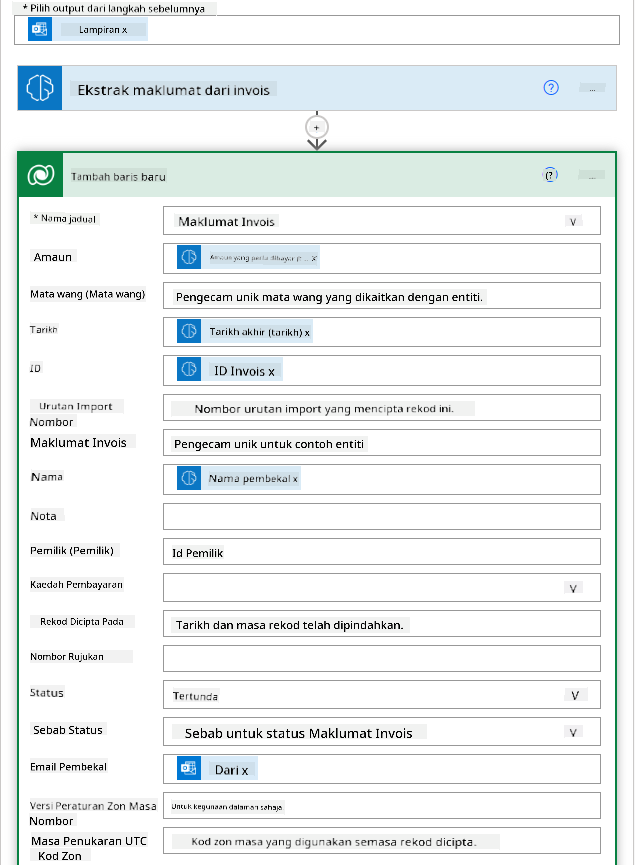
12. Setelah selesai dengan aliran, klik butang **Simpan** untuk menyimpan aliran tersebut. Anda kemudian boleh menguji aliran dengan menghantar e-mel dengan invois ke folder yang anda tentukan dalam pencetus.

> **Kerja rumah anda**: Aliran yang baru anda bina adalah permulaan yang baik, sekarang anda perlu memikirkan bagaimana anda boleh membina automasi yang akan membolehkan pasukan kewangan kami menghantar e-mel kepada pembekal untuk mengemas kini mereka dengan status semasa invois mereka. Petunjuk anda: aliran mesti berjalan apabila status invois berubah.

## Gunakan Model AI Penjanaan Teks dalam Power Automate

Model AI Buat Teks dengan GPT dalam AI Builder membolehkan anda menjana teks berdasarkan arahan dan dikuasakan oleh Perkhidmatan Microsoft Azure OpenAI. Dengan keupayaan ini, anda boleh menggabungkan teknologi GPT (Generative Pre-Trained Transformer) ke dalam aplikasi dan aliran anda untuk membina pelbagai aliran automatik dan aplikasi yang berwawasan.

Model GPT menjalani latihan yang meluas pada jumlah data yang besar, membolehkan mereka menghasilkan teks yang menyerupai bahasa manusia apabila diberikan arahan. Apabila diintegrasikan dengan automasi aliran kerja, model AI seperti GPT boleh digunakan untuk memudahkan dan mengautomatikkan pelbagai tugas.

Sebagai contoh, anda boleh membina aliran untuk menjana teks secara automatik untuk pelbagai kegunaan, seperti: draf e-mel, penerangan produk, dan banyak lagi. Anda juga boleh menggunakan model untuk menjana teks untuk pelbagai aplikasi, seperti chatbot dan aplikasi perkhidmatan pelanggan yang membolehkan ejen perkhidmatan pelanggan bertindak balas dengan berkesan dan cekap terhadap pertanyaan pelanggan.

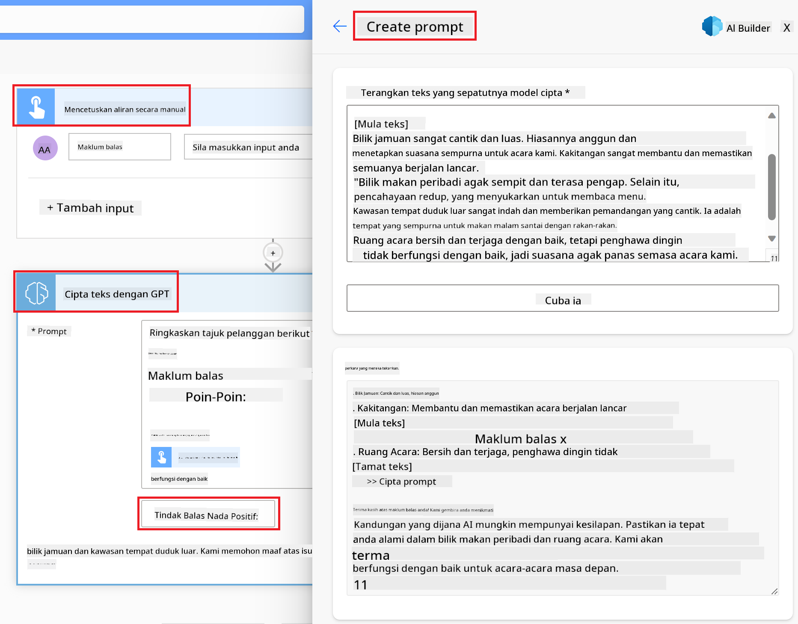

Untuk belajar bagaimana menggunakan Model AI ini dalam Power Automate, lalui modul [Tambah kecerdasan dengan AI Builder dan GPT](https://learn.microsoft.com/training/modules/ai-builder-text-generation/?WT.mc_id=academic-109639-somelezediko).

## Kerja Hebat! Teruskan Pembelajaran Anda

Selepas menyelesaikan pelajaran ini, lihat koleksi [Pembelajaran AI Generatif](https://aka.ms/genai-collection?WT.mc_id=academic-105485-koreyst) kami untuk terus meningkatkan pengetahuan AI Generatif anda!

Pergi ke Pelajaran 11 di mana kita akan melihat bagaimana untuk [mengintegrasikan AI Generatif dengan Panggilan Fungsi](../11-integrating-with-function-calling/README.md?WT.mc_id=academic-105485-koreyst)!

**Penafian**:  
Dokumen ini telah diterjemahkan menggunakan perkhidmatan terjemahan AI [Co-op Translator](https://github.com/Azure/co-op-translator). Walaupun kami berusaha untuk ketepatan, sila ambil perhatian bahawa terjemahan automatik mungkin mengandungi kesilapan atau ketidaktepatan. Dokumen asal dalam bahasa asalnya harus dianggap sebagai sumber yang berwibawa. Untuk maklumat kritikal, terjemahan manusia profesional adalah disyorkan. Kami tidak bertanggungjawab atas sebarang salah faham atau salah tafsir yang timbul daripada penggunaan terjemahan ini.