# Membangun Aplikasi AI Kod Rendah

[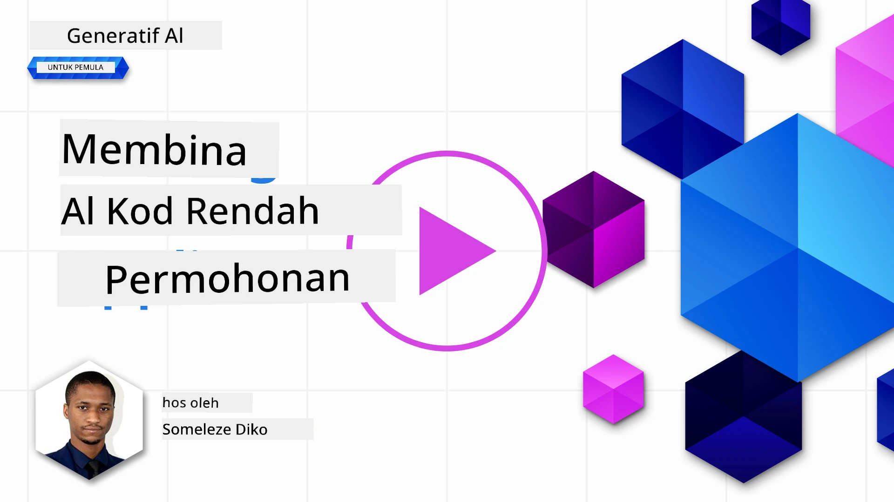](https://youtu.be/1vzq3Nd8GBA?si=h6LHWJXdmqf6mhDg)

> _(Klik gambar di atas untuk menonton video pelajaran ini)_

## Pengenalan

Sekarang bahawa kita telah belajar cara membina aplikasi penjana imej, mari kita bercakap tentang kod rendah. AI generatif boleh digunakan untuk pelbagai bidang termasuk kod rendah, tetapi apakah kod rendah dan bagaimana kita boleh menambah AI kepadanya?

Membina aplikasi dan penyelesaian telah menjadi lebih mudah untuk pembangun tradisional dan bukan pembangun melalui penggunaan Platform Pembangunan Kod Rendah. Platform Pembangunan Kod Rendah membolehkan anda membina aplikasi dan penyelesaian dengan sedikit atau tanpa kod. Ini dicapai dengan menyediakan persekitaran pembangunan visual yang membolehkan anda menyeret dan melepaskan komponen untuk membina aplikasi dan penyelesaian. Ini membolehkan anda membina aplikasi dan penyelesaian dengan lebih pantas dan dengan lebih sedikit sumber. Dalam pelajaran ini, kami menyelami bagaimana menggunakan Kod Rendah dan bagaimana meningkatkan pembangunan kod rendah dengan AI menggunakan Power Platform.

Power Platform menyediakan organisasi dengan peluang untuk memperkasakan pasukan mereka untuk membina penyelesaian mereka sendiri melalui persekitaran kod rendah atau tanpa kod yang intuitif. Persekitaran ini membantu mempermudah proses membina penyelesaian. Dengan Power Platform, penyelesaian boleh dibina dalam masa beberapa hari atau minggu dan bukannya bulan atau tahun. Power Platform terdiri daripada lima produk utama: Power Apps, Power Automate, Power BI, Power Pages dan Copilot Studio.

Pelajaran ini merangkumi:

- Pengenalan kepada AI Generatif dalam Power Platform
- Pengenalan kepada Copilot dan cara menggunakannya
- Menggunakan AI Generatif untuk membina aplikasi dan aliran dalam Power Platform
- Memahami Model AI dalam Power Platform dengan AI Builder
- Membina ejen pintar dengan Microsoft Copilot Studio

## Matlamat Pembelajaran

Pada akhir pelajaran ini, anda akan dapat:

- Memahami bagaimana Copilot berfungsi dalam Power Platform.

- Membina Aplikasi Penjejak Tugasan Pelajar untuk startup pendidikan kami.

- Membina Aliran Pemprosesan Invois yang menggunakan AI untuk mengekstrak maklumat daripada invois.

- Mengamalkan amalan terbaik apabila menggunakan Model AI Buat Teks dengan GPT.

- Memahami apa itu Microsoft Copilot Studio dan cara membina ejen pintar dengannya.

Alat dan teknologi yang akan anda gunakan dalam pelajaran ini adalah:

- **Power Apps**, untuk aplikasi Penjejak Tugasan Pelajar, yang menyediakan persekitaran pembangunan kod rendah untuk membina aplikasi bagi menjejak, mengurus dan berinteraksi dengan data.

- **Dataverse**, untuk menyimpan data bagi aplikasi Penjejak Tugasan Pelajar di mana Dataverse menyediakan platform data kod rendah untuk menyimpan data aplikasi.

- **Power Automate**, untuk aliran Pemprosesan Invois di mana anda akan mempunyai persekitaran pembangunan kod rendah untuk membina aliran kerja bagi mengautomasikan proses Pemprosesan Invois.

- **AI Builder**, untuk Model AI Pemprosesan Invois di mana anda akan menggunakan Model AI yang telah dibina untuk memproses invois bagi startup kami.

## AI Generatif dalam Power Platform

Meningkatkan pembangunan kod rendah dan aplikasi dengan AI generatif adalah bidang fokus utama untuk Power Platform. Matlamatnya adalah membolehkan semua orang membina aplikasi, laman web, papan pemuka yang dikuasakan AI dan mengautomasikan proses dengan AI, _tanpa memerlukan kepakaran sains data_. Matlamat ini dicapai dengan mengintegrasikan AI generatif ke dalam pengalaman pembangunan kod rendah dalam Power Platform dalam bentuk Copilot dan AI Builder.

### Bagaimana ini berfungsi?

Copilot adalah pembantu AI yang membolehkan anda membina penyelesaian Power Platform dengan menerangkan keperluan anda dalam beberapa langkah perbualan menggunakan bahasa semula jadi. Anda boleh, contohnya, mengarahkan pembantu AI anda untuk menyatakan bidang apa yang akan digunakan aplikas anda dan ia akan mencipta kedua-dua aplikasi dan model data asas atau anda boleh menetapkan cara menyediakan aliran dalam Power Automate.

Anda boleh menggunakan fungsi yang dipacu Copilot sebagai ciri dalam skrin aplikasi anda untuk membolehkan pengguna mencari wawasan melalui interaksi perbualan.

AI Builder adalah keupayaan AI kod rendah yang tersedia dalam Power Platform yang membolehkan anda menggunakan Model AI untuk membantu anda mengautomasikan proses dan meramalkan hasil. Dengan AI Builder anda boleh membawa AI ke aplikasi dan aliran yang bersambung dengan data anda di Dataverse atau dalam pelbagai sumber data awan, seperti SharePoint, OneDrive atau Azure.

Copilot tersedia dalam semua produk Power Platform: Power Apps, Power Automate, Power BI, Power Pages dan Copilot Studio (dahulunya Power Virtual Agents). AI Builder tersedia dalam Power Apps dan Power Automate. Dalam pelajaran ini, kita akan fokus pada cara menggunakan Copilot dan AI Builder dalam Power Apps dan Power Automate untuk membina penyelesaian bagi startup pendidikan kami.

### Copilot dalam Power Apps

Sebagai sebahagian daripada Power Platform, Power Apps menyediakan persekitaran pembangunan kod rendah untuk membina aplikasi bagi menjejak, mengurus dan berinteraksi dengan data. Ia adalah suite perkhidmatan pembangunan aplikasi dengan platform data yang skalabel dan keupayaan untuk menyambung ke perkhidmatan awan dan data di premis. Power Apps membolehkan anda membina aplikasi yang berjalan pada pelayar, tablet, dan telefon, dan boleh dikongsi dengan rakan sekerja. Power Apps memudahkan pengguna untuk membina aplikasi dengan antara muka yang mudah, supaya setiap pengguna perniagaan atau pembangun pro boleh membina aplikasi khusus. Pengalaman pembangunan aplikasi juga dipertingkatkan dengan AI Generatif melalui Copilot.

Ciri pembantu AI Copilot dalam Power Apps membolehkan anda menerangkan jenis aplikasi yang anda perlukan dan maklumat yang anda mahu aplikasi anda jejak, kumpul, atau tunjukkan. Copilot kemudian menjana aplikasi Canvas yang responsif berdasarkan penerangan anda. Anda boleh kemudian mengubah suai aplikasi itu mengikut keperluan anda. AI Copilot juga menjana dan mencadangkan Jadual Dataverse dengan medan yang anda perlukan untuk menyimpan data yang anda ingin jejak dan beberapa data contoh. Kita akan lihat apa itu Dataverse dan bagaimana anda boleh menggunakannya dalam Power Apps dalam pelajaran ini. Anda boleh kemudian mengubah suai jadual itu mengikut keperluan menggunakan ciri pembantu AI Copilot melalui langkah-langkah perbualan. Ciri ini tersedia dengan mudah dari skrin utama Power Apps.

### Copilot dalam Power Automate

Sebagai sebahagian daripada Power Platform, Power Automate membolehkan pengguna membuat aliran kerja automatik antara aplikasi dan perkhidmatan. Ia membantu mengautomasikan proses perniagaan yang berulang seperti komunikasi, pengumpulan data, dan kelulusan keputusan. Antara muka yang mudah membolehkan pengguna dengan setiap tahap kemahiran teknikal (dari pemula hingga pembangun berpengalaman) mengautomasikan tugas kerja. Pengalaman pembangunan aliran juga dipertingkatkan dengan AI Generatif melalui Copilot.

Ciri pembantu AI Copilot dalam Power Automate membolehkan anda menerangkan jenis aliran yang anda perlukan dan tindakan yang anda mahu aliran anda lakukan. Copilot kemudian menjana aliran berdasarkan penerangan anda. Anda boleh kemudian mengubah suai aliran itu mengikut keperluan anda. AI Copilot juga menjana dan mencadangkan tindakan yang anda perlukan untuk melaksanakan tugas yang anda mahu automasikan. Kita akan lihat apa itu aliran dan bagaimana anda boleh menggunakannya dalam Power Automate dalam pelajaran ini. Anda boleh kemudian mengubah suai tindakan tersebut mengikut keperluan menggunakan ciri pembantu AI Copilot melalui langkah-langkah perbualan. Ciri ini tersedia dengan mudah dari skrin utama Power Automate.

## Membina Ejen Pintar dengan Microsoft Copilot Studio

[Microsoft Copilot Studio](https://learn.microsoft.com/microsoft-copilot-studio/fundamentals-what-is-copilot-studio?WT.mc_id=academic-105485-koreyst) (dahulunya Power Virtual Agents) adalah ahli kod rendah Power Platform untuk membina **ejen AI** — copilots perbualan yang boleh menjawab soalan, mengambil tindakan, dan mengautomasikan tugas bagi pihak pengguna anda. Sama seperti selebihnya Power Platform, anda membina ejen ini dalam pengalaman visual yang mengutamakan bahasa semula jadi: anda menerangkan apa yang anda mahu ejen lakukan, dan Copilot Studio membantu merangka arahan, pengetahuan, dan tindakan ejen.

Untuk startup pendidikan kami, anda boleh membina ejen yang menjawab soalan pelajar tentang kursus, memeriksa tarikh akhir tugasan, dan malah menghantar e-mel kepada pengajar — semua ini tanpa menulis kod.

Berikut adalah beberapa keupayaan terkini yang menjadikan Copilot Studio berkuasa:

- **Jawapan generatif daripada pengetahuan anda**. Daripada menulis setiap perbualan secara manual, anda boleh menyambung **sumber pengetahuan** — laman web awam, SharePoint, OneDrive, Dataverse, fail yang dimuat naik, atau data perusahaan melalui penyambung — dan ejen menjana jawapan berpandukan sumber tersebut.

- **Orkestrasi generatif**. Daripada bergantung pada frasa pencetus yang kaku, ejen menggunakan AI untuk memahami permintaan dan secara dinamik memutuskan pengetahuan, topik, dan tindakan apa yang hendak digabungkan untuk memenuhinya, termasuk menggabungkan beberapa langkah bersama.

- **Tindakan dan penyambung**. Ejen boleh *melakukan* perkara, bukan sekadar berbual. Anda boleh memberi ejen tindakan yang disokong oleh lebih 1,500 penyambung Power Platform yang terbina, aliran Power Automate, API REST khusus, arahan, atau pelayan **Model Context Protocol (MCP)**.

- **Ejen autonomi**. Ejen tidak terhad untuk memberi respons di dalam tetingkap sembang. Anda boleh membina **ejen autonomi** yang dicetuskan oleh peristiwa — seperti e-mel baru, rekod baru di Dataverse, atau fail yang dimuat naik — dan kemudian bertindak di latar belakang untuk melengkapkan tugas.

- **Orkestrasi pelbagai ejen**. Ejen boleh memanggil ejen lain. Ejen Copilot Studio boleh menyerahkan tugas kepada, atau diperluas oleh, ejen lain, termasuk ejen yang diterbitkan ke Microsoft 365 Copilot dan ejen yang dibina dalam Microsoft Foundry.

- **Pilihan model**. Selain model terbina dalam, anda boleh membawa model daripada katalog model Microsoft Foundry untuk menyesuaikan cara ejen anda berfikir dan memberi respons.

- **Terbit di mana-mana**. Setelah dibina, ejen boleh diterbitkan ke pelbagai saluran — Microsoft Teams, Microsoft 365 Copilot, laman web atau aplikasi khusus, dan lain-lain — dengan keselamatan, pengesahan, dan analitik diurus melalui pengalaman pentadbir Power Platform.

Anda boleh mula membina ejen pertama anda di [copilotstudio.microsoft.com](https://copilotstudio.microsoft.com?WT.mc_id=academic-105485-koreyst) dan belajar lebih lanjut dalam [dokumentasi Microsoft Copilot Studio](https://learn.microsoft.com/microsoft-copilot-studio/?WT.mc_id=academic-105485-koreyst).

## Tugasan: Mengurus tugasan pelajar dan invois untuk startup kami, menggunakan Copilot

Startup kami menyediakan kursus dalam talian kepada pelajar. Startup ini berkembang pesat dan kini menghadapi kesukaran untuk mengikut permintaan terhadap kursusnya. Startup telah mengambil anda sebagai pembangun Power Platform untuk membantu mereka membina penyelesaian kod rendah untuk membantu mereka mengurus tugasan pelajar dan invois mereka. Penyelesaian mereka harus dapat membantu mereka menjejak dan mengurus tugasan pelajar melalui aplikasi dan mengautomasikan proses pemprosesan invois melalui aliran kerja. Anda diminta menggunakan AI Generatif untuk membangunkan penyelesaian tersebut.

Ketika anda mula menggunakan Copilot, anda boleh menggunakan [Perpustakaan Prompt Copilot Power Platform](https://github.com/pnp/powerplatform-prompts?WT.mc_id=academic-109639-somelezediko) untuk memulakan dengan prompt yang disediakan. Perpustakaan ini mengandungi senarai prompt yang boleh anda gunakan untuk membina aplikasi dan aliran dengan Copilot. Anda juga boleh menggunakan prompt dalam perpustakaan untuk mendapat idea bagaimana menerangkan keperluan anda kepada Copilot.

### Membangun Aplikasi Penjejak Tugasan Pelajar untuk Startup Kami

Para pendidik di startup kami menghadapi kesukaran untuk menjejak tugasan pelajar. Mereka telah menggunakan hamparan untuk menjejak tugasan tetapi ini menjadi sukar untuk diurus kerana bilangan pelajar telah meningkat. Mereka meminta anda membina aplikasi yang akan membantu mereka menjejak dan mengurus tugasan pelajar. Aplikasi harus membolehkan mereka menambah tugasan baru, melihat tugasan, mengemas kini tugasan dan memadam tugasan. Aplikasi juga harus membolehkan pendidik dan pelajar melihat tugasan yang telah dinilai dan yang belum dinilai.

Anda akan membina aplikasi menggunakan Copilot dalam Power Apps mengikut langkah-langkah berikut:

1. Pergi ke skrin utama [Power Apps](https://make.powerapps.com?WT.mc_id=academic-105485-koreyst).

1. Gunakan ruang teks di skrin utama untuk menerangkan aplikasi yang anda ingin bina. Contohnya, **_Saya ingin membina aplikasi untuk menjejak dan mengurus tugasan pelajar_**. Klik pada butang **Hantar** untuk menghantar prompt kepada AI Copilot.

1. AI Copilot akan mencadangkan Jadual Dataverse dengan medan yang anda perlukan untuk menyimpan data yang anda mahu jejak dan beberapa data contoh. Anda kemudian boleh mengubah suai jadual untuk memenuhi keperluan anda menggunakan ciri pembantu AI Copilot melalui langkah perbualan.

   > **Penting**: Dataverse adalah platform data asas untuk Power Platform. Ia adalah platform data kod rendah untuk menyimpan data aplikasi. Ia adalah perkhidmatan yang diurus sepenuhnya yang menyimpan data dengan selamat dalam Awan Microsoft dan disediakan dalam persekitaran Power Platform anda. Ia datang dengan keupayaan tadbir urus data terbina dalam, seperti klasifikasi data, garis keturunan data, kawalan akses terperinci, dan banyak lagi. Anda boleh belajar lebih lanjut tentang Dataverse [di sini](https://learn.microsoft.com/power-apps/maker/data-platform/data-platform-intro?WT.mc_id=academic-109639-somelezediko).

   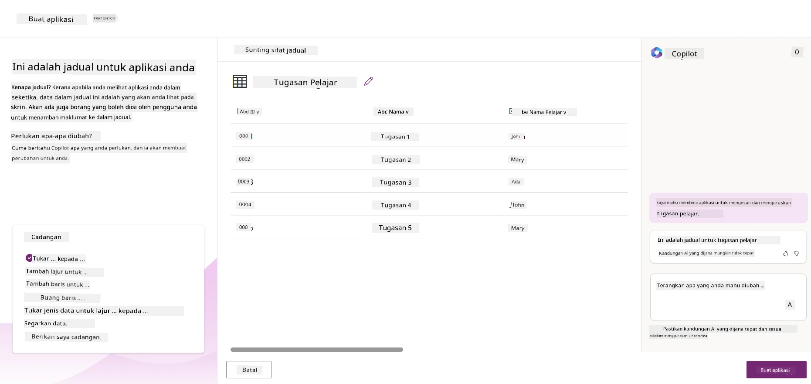

1. Pendidik ingin menghantar e-mel kepada pelajar yang telah menghantar tugasan mereka untuk memberitahu kemajuan tugasan mereka. Anda boleh menggunakan Copilot untuk menambah medan baru ke jadual untuk menyimpan e-mel pelajar. Contohnya, anda boleh menggunakan prompt berikut untuk menambah medan baru ke jadual: **_Saya ingin menambah lajur untuk menyimpan e-mel pelajar_**. Klik pada butang **Hantar** untuk menghantar prompt kepada AI Copilot.

1. AI Copilot akan menjana medan baru dan anda boleh mengubah suai medan tersebut mengikut keperluan anda.

1. Setelah anda selesai dengan jadual, klik pada butang **Create app** untuk membuat aplikasi.

1. AI Copilot akan menjana aplikasi Canvas yang responsif berdasarkan penerangan anda. Anda kemudian boleh menyesuaikan aplikasi itu mengikut keperluan anda.

1. Untuk pendidik menghantar emel kepada pelajar, anda boleh menggunakan Copilot untuk menambah skrin baru kepada aplikasi. Contohnya, anda boleh menggunakan arahan berikut untuk menambah skrin baru kepada aplikasi: **_Saya mahu menambah skrin untuk menghantar emel kepada pelajar_**. Klik pada butang **Send** untuk menghantar arahan itu kepada AI Copilot.

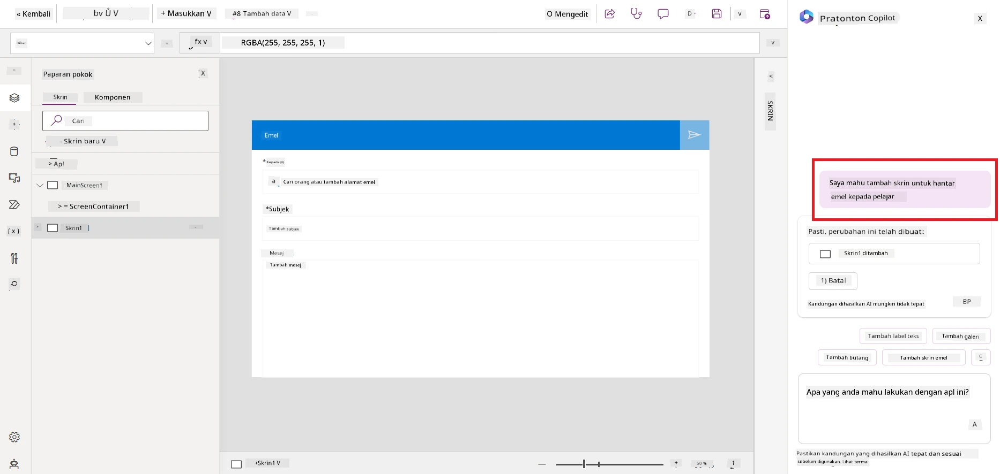

1. AI Copilot akan menjana skrin baru dan anda kemudian boleh menyesuaikan skrin tersebut mengikut keperluan anda.

1. Setelah anda selesai dengan aplikasi itu, klik pada butang **Save** untuk menyimpan aplikasi.

1. Untuk berkongsi aplikasi dengan pendidik, klik pada butang **Share** dan kemudian klik sekali lagi pada butang **Share**. Anda kemudian boleh berkongsi aplikasi tersebut dengan pendidik dengan memasukkan alamat emel mereka.

> **Kerja rumah anda**: Aplikasi yang anda bina baru sahaja adalah permulaan yang baik tetapi boleh diperbaiki. Dengan ciri emel, pendidik hanya boleh menghantar emel kepada pelajar secara manual dengan menaip emel mereka. Bolehkah anda menggunakan Copilot untuk membina automasi yang akan membolehkan pendidik menghantar emel kepada pelajar secara automatik apabila mereka menghantar tugasan? Petunjuk anda ialah dengan arahan yang betul anda boleh menggunakan Copilot dalam Power Automate untuk membinanya.

### Bina Jadual Maklumat Invois untuk Startup Kami

Pasukan kewangan di startup kami menghadapi kesukaran untuk mengesan invois. Mereka telah menggunakan spreadsheet untuk mengesan invois tetapi perkara ini menjadi sukar untuk diuruskan apabila bilangan invois bertambah. Mereka meminta anda membina jadual yang akan membantu mereka menyimpan, mengesan dan mengurus maklumat invois yang mereka terima. Jadual tersebut harus digunakan untuk membina automasi yang akan mengekstrak semua maklumat invois dan menyimpannya dalam jadual. Jadual ini juga harus membolehkan pasukan kewangan melihat invois yang telah dibayar dan yang belum dibayar.

Power Platform mempunyai platform data asas yang dipanggil Dataverse yang membolehkan anda menyimpan data untuk aplikasi dan penyelesaian anda. Dataverse menyediakan platform data kod rendah untuk menyimpan data aplikasi. Ia adalah perkhidmatan yang diurus sepenuhnya yang menyimpan data dengan selamat di Microsoft Cloud dan dijalankan dalam persekitaran Power Platform anda. Ia datang dengan keupayaan tadbir urus data terbina dalam, seperti klasifikasi data, garisan keturunan data, kawalan akses bertingkat halus, dan banyak lagi. Anda boleh mempelajari lebih lanjut [mengenai Dataverse di sini](https://learn.microsoft.com/power-apps/maker/data-platform/data-platform-intro?WT.mc_id=academic-109639-somelezediko).

Mengapa kita harus menggunakan Dataverse untuk startup kita? Jadual standard dan tersuai dalam Dataverse menyediakan pilihan penyimpanan yang selamat dan berasaskan awan untuk data anda. Jadual membolehkan anda menyimpan pelbagai jenis data, serupa dengan cara anda menggunakan beberapa lembaran kerja dalam satu buku kerja Excel. Anda boleh menggunakan jadual untuk menyimpan data yang khusus untuk organisasi atau keperluan perniagaan anda. Beberapa manfaat yang akan diperoleh startup kami daripada penggunaan Dataverse termasuk tetapi tidak terhad kepada:

- **Mudah diurus**: Metadata dan data disimpan di awan, jadi anda tidak perlu risau tentang butiran bagaimana ia disimpan atau diurus. Anda boleh menumpukan perhatian pada membina aplikasi dan penyelesaian anda.

- **Selamat**: Dataverse menyediakan pilihan penyimpanan yang selamat dan berasaskan awan untuk data anda. Anda boleh mengawal siapa yang mempunyai akses kepada data dalam jadual anda dan bagaimana mereka boleh mengaksesnya menggunakan keselamatan berasaskan peranan.

- **Metadata yang kaya**: Jenis data dan hubungan digunakan secara langsung dalam Power Apps

- **Logik dan pengesahan**: Anda boleh menggunakan peraturan perniagaan, medan dikira, dan peraturan pengesahan untuk menguatkuasakan logik perniagaan dan mengekalkan ketepatan data.

Sekarang anda tahu apa itu Dataverse dan mengapa anda harus menggunakannya, mari kita lihat bagaimana anda boleh menggunakan Copilot untuk mencipta jadual dalam Dataverse untuk memenuhi keperluan pasukan kewangan kami.

> **Nota** : Anda akan menggunakan jadual ini dalam bahagian seterusnya untuk membina automasi yang akan mengekstrak semua maklumat invois dan menyimpannya dalam jadual tersebut.

Untuk mencipta jadual dalam Dataverse menggunakan Copilot, ikut langkah-langkah di bawah:

1. Pergi ke skrin utama [Power Apps](https://make.powerapps.com?WT.mc_id=academic-105485-koreyst).

2. Pada bar navigasi kiri, pilih **Tables** dan kemudian klik pada **Describe the new Table**.

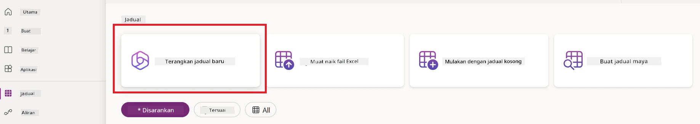

1. Pada skrin **Describe the new Table**, gunakan ruang teks untuk menerangkan jadual yang anda mahu cipta. Contohnya, **_Saya mahu mencipta jadual untuk menyimpan maklumat invois_**. Klik pada butang **Send** untuk menghantar arahan kepada AI Copilot.

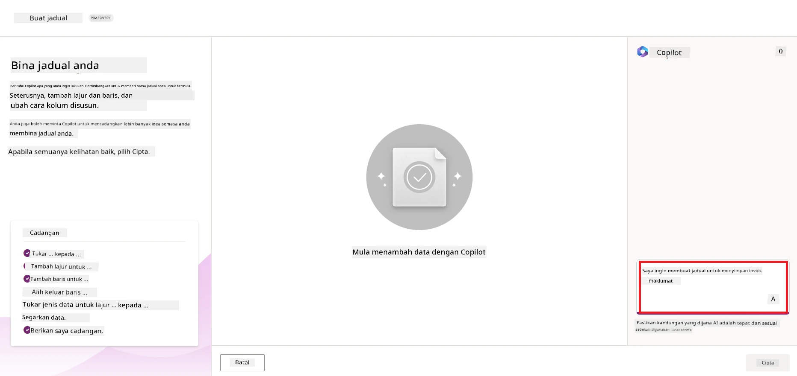

1. AI Copilot akan mencadangkan Jadual Dataverse dengan medan yang anda perlukan untuk menyimpan data yang anda mahu jejak dan juga beberapa contoh data. Anda kemudian boleh menyesuaikan jadual itu mengikut keperluan menggunakan ciri pembantu AI Copilot melalui langkah-langkah perbualan.

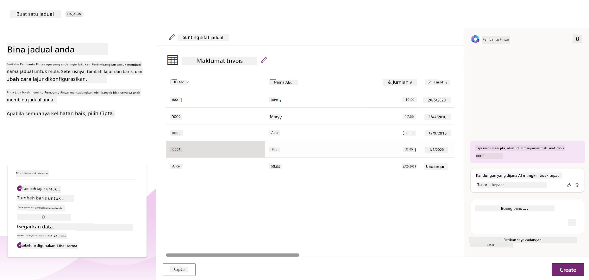

1. Pasukan kewangan ingin menghantar emel kepada pembekal untuk mengemas kini mereka dengan status terkini invois mereka. Anda boleh menggunakan Copilot untuk menambah medan baru dalam jadual untuk menyimpan emel pembekal. Contohnya, anda boleh menggunakan arahan berikut untuk menambah medan baru dalam jadual: **_Saya mahu menambah lajur untuk menyimpan emel pembekal_**. Klik pada butang **Send** untuk menghantar arahan kepada AI Copilot.

1. AI Copilot akan menjana medan baru dan anda kemudian boleh menyesuaikan medan itu mengikut keperluan anda.

1. Setelah anda selesai dengan jadual itu, klik pada butang **Create** untuk mencipta jadual tersebut.

## Model AI dalam Power Platform dengan AI Builder

AI Builder adalah keupayaan AI kod rendah yang tersedia dalam Power Platform yang membolehkan anda menggunakan Model AI untuk membantu mengautomasikan proses dan meramalkan hasil. Dengan AI Builder anda boleh membawa AI ke dalam aplikasi dan aliran kerja anda yang berhubung dengan data anda di Dataverse atau di pelbagai sumber data awan, seperti SharePoint, OneDrive atau Azure.

## Model AI Pra-bina vs Model AI Tersuai

AI Builder menyediakan dua jenis Model AI: Model AI Pra-bina dan Model AI Tersuai. Model AI Pra-bina adalah model AI yang sedia digunakan yang telah dilatih oleh Microsoft dan tersedia dalam Power Platform. Ini membantu anda menambah kecerdasan ke aplikasi dan aliran tanpa perlu mengumpul data dan kemudian membina, melatih dan menerbitkan model anda sendiri. Anda boleh menggunakan model ini untuk mengautomasikan proses dan meramalkan hasil.

Beberapa Model AI Pra-bina yang tersedia dalam Power Platform termasuk:

- **Pengekstrakan Frasa Utama**: Model ini mengekstrak frasa utama dari teks.
- **Pengesanan Bahasa**: Model ini mengesan bahasa teks.
- **Analisis Sentimen**: Model ini mengesan sentimen positif, negatif, neutral, atau campuran dalam teks.
- **Pembaca Kad Perniagaan**: Model ini mengekstrak maklumat dari kad perniagaan.
- **Pengecaman Teks**: Model ini mengekstrak teks dari imej.
- **Pengesanan Objek**: Model ini mengesan dan mengekstrak objek dari imej.
- **Pemprosesan Dokumen**: Model ini mengekstrak maklumat dari borang.
- **Pemprosesan Invois**: Model ini mengekstrak maklumat dari invois.

Dengan Model AI Tersuai anda boleh membawa model anda sendiri ke AI Builder supaya ia boleh berfungsi seperti mana-mana model AI Builder tersuai, membolehkan anda melatih model menggunakan data anda sendiri. Anda boleh menggunakan model ini untuk mengautomasikan proses dan meramalkan hasil dalam kedua-dua Power Apps dan Power Automate. Apabila menggunakan model sendiri terdapat had tertentu yang dikenakan. Baca lebih lanjut mengenai [had ini](https://learn.microsoft.com/ai-builder/byo-model#limitations?WT.mc_id=academic-105485-koreyst).

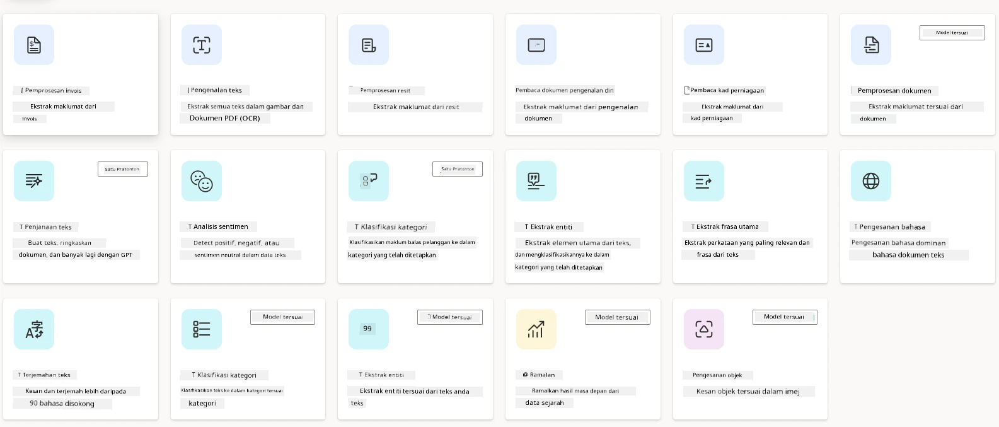

## Tugasan #2 - Bina Aliran Pemprosesan Invois untuk Startup Kami

Pasukan kewangan menghadapi kesukaran memproses invois. Mereka telah menggunakan spreadsheet untuk mengesan invois tetapi ia menjadi sukar untuk diuruskan apabila bilangan invois meningkat. Mereka meminta anda membina aliran kerja yang akan membantu mereka memproses invois menggunakan AI. Aliran kerja itu harus membolehkan mereka mengekstrak maklumat dari invois dan menyimpan maklumat itu dalam jadual Dataverse. Aliran kerja itu juga harus membolehkan mereka menghantar emel kepada pasukan kewangan dengan maklumat yang telah diekstrak.

Sekarang anda tahu apa itu AI Builder dan mengapa anda perlu menggunakannya, mari kita lihat bagaimana anda boleh menggunakan Model AI Pemprosesan Invois dalam AI Builder, yang telah kita bincangkan tadi, untuk membina aliran kerja yang akan membantu pasukan kewangan memproses invois.

Untuk membina aliran kerja yang akan membantu pasukan kewangan memproses invois menggunakan Model AI Pemprosesan Invois dalam AI Builder, ikut langkah-langkah berikut:

1. Pergi ke skrin utama [Power Automate](https://make.powerautomate.com?WT.mc_id=academic-105485-koreyst).

2. Gunakan ruang teks pada skrin utama untuk menerangkan aliran kerja yang anda mahu bina. Contohnya, **_Proses invois apabila ia sampai ke peti masuk saya_**. Klik pada butang **Send** untuk menghantar arahan itu kepada AI Copilot.

   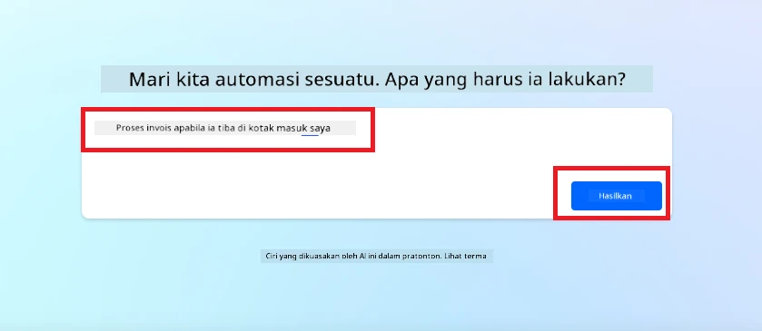

3. AI Copilot akan mencadangkan tindakan yang anda perlu lakukan untuk tugasan yang ingin anda automasikan. Anda boleh klik pada butang **Next** untuk pergi ke langkah seterusnya.

4. Pada langkah seterusnya, Power Automate akan meminta anda menyiapkan sambungan yang diperlukan untuk aliran itu. Setelah selesai, klik pada butang **Create flow** untuk mencipta aliran tersebut.

5. AI Copilot akan menjana aliran dan anda kemudian boleh menyesuaikan aliran itu mengikut keperluan anda.

6. Kemas kini pencetus aliran dan tetapkan **Folder** ke folder di mana invois akan disimpan. Contohnya, anda boleh tetapkan folder kepada **Inbox**. Klik pada **Show advanced options** dan tetapkan **Only with Attachments** kepada **Yes**. Ini akan memastikan aliran hanya berjalan apabila emel dengan lampiran diterima di folder itu.

7. Buang tindakan berikut dari aliran: **HTML to text**, **Compose**, **Compose 2**, **Compose 3** dan **Compose 4** kerana anda tidak akan menggunakannya.

8. Buang tindakan **Condition** dari aliran kerana anda tidak akan menggunakannya. Ia harus kelihatan seperti tangkapan skrin berikut:

   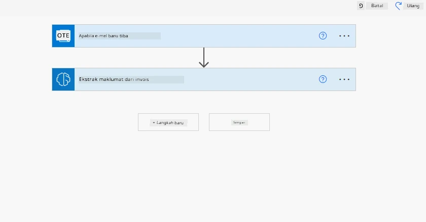

9. Klik pada butang **Add an action** dan cari **Dataverse**. Pilih tindakan **Add a new row**.

10. Pada tindakan **Extract Information from invoices**, kemas kini **Invoice File** untuk menunjuk kepada **Attachment Content** dari emel. Ini akan memastikan aliran mengekstrak maklumat dari lampiran invois.

11. Pilih **Table** yang anda cipta sebelum ini. Contohnya, anda boleh pilih jadual **Invoice Information**. Pilih kandungan dinamik dari tindakan sebelumnya untuk mengisi medan berikut:

    - ID
    - Amaun
    - Tarikh
    - Nama
    - Status - Tetapkan **Status** kepada **Pending**.
    - Emel Pembekal - Gunakan kandungan dinamik **From** dari pencetus **When a new email arrives**.

    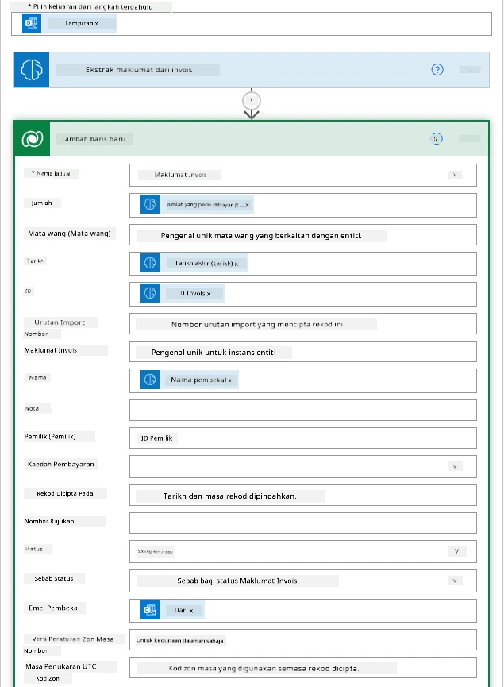

12. Setelah anda selesai dengan aliran itu, klik pada butang **Save** untuk menyimpan aliran. Anda kemudian boleh menguji aliran dengan menghantar emel yang mengandungi invois ke folder yang anda tetapkan dalam pencetus.

> **Kerja rumah anda**: Aliran yang anda bina baru sahaja adalah permulaan yang baik, sekarang anda perlu memikirkan bagaimana anda boleh membina automasi yang akan membolehkan pasukan kewangan kami menghantar emel kepada pembekal untuk mengemas kini mereka dengan status terkini invois mereka. Petunjuk anda: aliran mesti berjalan apabila status invois berubah.

## Gunakan Model AI Penjanaan Teks dalam Power Automate

Model AI Create Text with GPT dalam AI Builder membolehkan anda menjana teks berdasarkan arahan dan dikuasakan oleh Microsoft Azure OpenAI Service. Dengan kemampuan ini, anda boleh memasukkan teknologi GPT (Generative Pre-Trained Transformer) ke dalam aplikasi dan aliran kerja anda untuk membina pelbagai aliran automatik dan aplikasi yang bermaklumat.

Model GPT melalui latihan yang meluas pada sejumlah besar data, membolehkan mereka menghasilkan teks yang sangat mirip dengan bahasa manusia apabila diberikan arahan. Apabila digabungkan dengan automasi aliran kerja, model AI seperti GPT boleh digunakan untuk memperkemas dan mengautomasikan pelbagai tugas.

Contohnya, anda boleh membina aliran untuk menjana teks secara automatik untuk pelbagai kegunaan, seperti: draf emel, penerangan produk, dan banyak lagi. Anda juga boleh menggunakan model itu untuk menjana teks bagi pelbagai aplikasi, seperti chatbot dan aplikasi khidmat pelanggan yang membolehkan ejen khidmat pelanggan bertindak balas dengan berkesan dan efisien kepada pertanyaan pelanggan.

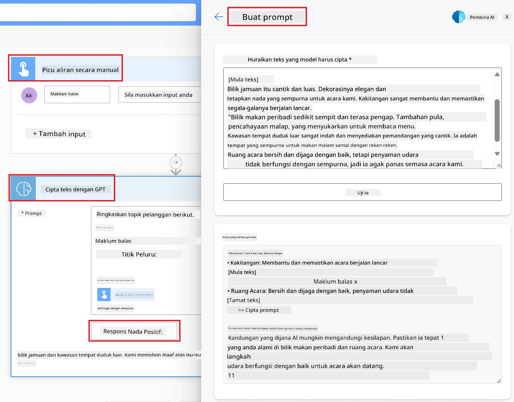

Untuk belajar cara menggunakan Model AI ini dalam Power Automate, ikuti modul [Tambah kecerdasan dengan AI Builder dan GPT](https://learn.microsoft.com/training/modules/ai-builder-text-generation/?WT.mc_id=academic-109639-somelezediko).

## Kerja Hebat! Teruskan Pembelajaran Anda

Selepas menamatkan pelajaran ini, lihat koleksi [Pembelajaran AI Generatif kami](https://aka.ms/genai-collection?WT.mc_id=academic-105485-koreyst) untuk terus meningkatkan pengetahuan AI Generatif anda!

Mahu mengubah suai dan mendapatkan lebih banyak dari Copilot? Terokai [Awesome Copilot](https://github.com/github/awesome-copilot?WT.mc_id=academic-105485-koreyst) — satu koleksi arahan, ejen, kemahiran, dan konfigurasi yang disumbangkan oleh komuniti untuk membantu anda memanfaatkan sepenuhnya GitHub Copilot.

Pergi ke Pelajaran 11 di mana kita akan melihat cara untuk [mengintegrasikan AI Generatif dengan Panggilan Fungsi](../11-integrating-with-function-calling/README.md?WT.mc_id=academic-105485-koreyst)!

---

<!-- CO-OP TRANSLATOR DISCLAIMER START -->
**Penafian**:
Dokumen ini telah diterjemahkan menggunakan perkhidmatan terjemahan AI [Co-op Translator](https://github.com/Azure/co-op-translator). Walaupun kami berusaha untuk ketepatan, sila ambil maklum bahawa terjemahan automatik mungkin mengandungi kesilapan atau ketidaktepatan. Dokumen asal dalam bahasa asalnya harus dianggap sebagai sumber yang sahih. Untuk maklumat penting, terjemahan oleh manusia profesional adalah disyorkan. Kami tidak bertanggungjawab terhadap sebarang salah faham atau salah tafsir yang timbul daripada penggunaan terjemahan ini.
<!-- CO-OP TRANSLATOR DISCLAIMER END -->