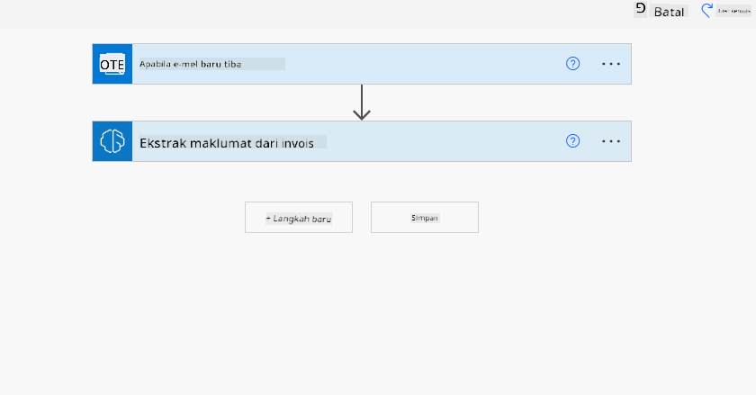
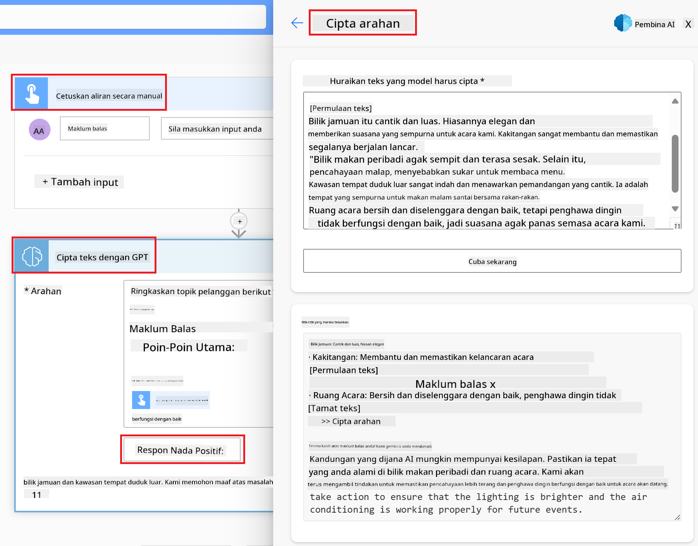

<!--
CO_OP_TRANSLATOR_METADATA:
{
  "original_hash": "846ac8e3b7dcfb697d3309fec05f0fea",
  "translation_date": "2025-10-17T20:55:52+00:00",
  "source_file": "10-building-low-code-ai-applications/README.md",
  "language_code": "ms"
}
-->
# Membina Aplikasi AI Kod Rendah

> _(Klik imej di atas untuk menonton video pelajaran ini)_

## Pengenalan

Sekarang kita telah belajar cara membina aplikasi penjanaan imej, mari kita bincangkan tentang kod rendah. AI generatif boleh digunakan dalam pelbagai bidang termasuk kod rendah, tetapi apa itu kod rendah dan bagaimana kita boleh menambah AI padanya?

Membina aplikasi dan penyelesaian telah menjadi lebih mudah untuk pembangun tradisional dan bukan pembangun melalui penggunaan Platform Pembangunan Kod Rendah. Platform ini membolehkan anda membina aplikasi dan penyelesaian dengan sedikit atau tiada kod. Ini dicapai dengan menyediakan persekitaran pembangunan visual yang membolehkan anda menyeret dan melepaskan komponen untuk membina aplikasi dan penyelesaian. Ini membolehkan anda membina aplikasi dan penyelesaian dengan lebih cepat dan menggunakan sumber yang lebih sedikit. Dalam pelajaran ini, kita akan mendalami cara menggunakan kod rendah dan bagaimana meningkatkan pembangunan kod rendah dengan AI menggunakan Power Platform.

Power Platform memberikan peluang kepada organisasi untuk memperkasakan pasukan mereka membina penyelesaian mereka sendiri melalui persekitaran kod rendah atau tanpa kod yang intuitif. Persekitaran ini membantu mempermudah proses membina penyelesaian. Dengan Power Platform, penyelesaian boleh dibina dalam beberapa hari atau minggu, bukannya bulan atau tahun. Power Platform terdiri daripada lima produk utama: Power Apps, Power Automate, Power BI, Power Pages dan Copilot Studio.

Pelajaran ini merangkumi:

- Pengenalan kepada AI Generatif dalam Power Platform
- Pengenalan kepada Copilot dan cara menggunakannya
- Menggunakan AI Generatif untuk membina aplikasi dan aliran dalam Power Platform
- Memahami Model AI dalam Power Platform dengan AI Builder

## Matlamat Pembelajaran

Menjelang akhir pelajaran ini, anda akan dapat:

- Memahami cara Copilot berfungsi dalam Power Platform.

- Membina Aplikasi Penjejak Tugasan Pelajar untuk permulaan pendidikan kita.

- Membina Aliran Pemprosesan Invois yang menggunakan AI untuk mengekstrak maklumat daripada invois.

- Mengaplikasikan amalan terbaik semasa menggunakan Model AI Create Text dengan GPT.

Alat dan teknologi yang akan anda gunakan dalam pelajaran ini adalah:

- **Power Apps**, untuk aplikasi Penjejak Tugasan Pelajar, yang menyediakan persekitaran pembangunan kod rendah untuk membina aplikasi bagi menjejak, mengurus dan berinteraksi dengan data.

- **Dataverse**, untuk menyimpan data bagi aplikasi Penjejak Tugasan Pelajar di mana Dataverse akan menyediakan platform data kod rendah untuk menyimpan data aplikasi.

- **Power Automate**, untuk aliran Pemprosesan Invois di mana anda akan mempunyai persekitaran pembangunan kod rendah untuk membina aliran kerja bagi mengautomasi proses Pemprosesan Invois.

- **AI Builder**, untuk Model AI Pemprosesan Invois di mana anda akan menggunakan Model AI yang telah dibina untuk memproses invois bagi permulaan kami.

## AI Generatif dalam Power Platform

Meningkatkan pembangunan dan aplikasi kod rendah dengan AI generatif adalah fokus utama untuk Power Platform. Matlamatnya adalah untuk membolehkan semua orang membina aplikasi berkuasa AI, laman web, papan pemuka dan mengautomasi proses dengan AI, _tanpa memerlukan kepakaran sains data_. Matlamat ini dicapai dengan mengintegrasikan AI generatif ke dalam pengalaman pembangunan kod rendah dalam Power Platform dalam bentuk Copilot dan AI Builder.

### Bagaimana ia berfungsi?

Copilot adalah pembantu AI yang membolehkan anda membina penyelesaian Power Platform dengan menerangkan keperluan anda dalam beberapa langkah perbualan menggunakan bahasa semula jadi. Sebagai contoh, anda boleh mengarahkan pembantu AI anda untuk menyatakan medan yang akan digunakan oleh aplikasi anda dan ia akan mencipta kedua-dua aplikasi dan model data asas atau anda boleh menentukan cara untuk menyediakan aliran dalam Power Automate.

Anda boleh menggunakan fungsi yang didorong oleh Copilot sebagai ciri dalam skrin aplikasi anda untuk membolehkan pengguna menemui wawasan melalui interaksi perbualan.

AI Builder adalah keupayaan AI kod rendah yang tersedia dalam Power Platform yang membolehkan anda menggunakan Model AI untuk membantu anda mengautomasi proses dan meramalkan hasil. Dengan AI Builder, anda boleh membawa AI ke aplikasi dan aliran anda yang bersambung dengan data anda dalam Dataverse atau dalam pelbagai sumber data awan, seperti SharePoint, OneDrive atau Azure.

Copilot tersedia dalam semua produk Power Platform: Power Apps, Power Automate, Power BI, Power Pages dan Power Virtual Agents. AI Builder tersedia dalam Power Apps dan Power Automate. Dalam pelajaran ini, kita akan fokus pada cara menggunakan Copilot dan AI Builder dalam Power Apps dan Power Automate untuk membina penyelesaian bagi permulaan pendidikan kita.

### Copilot dalam Power Apps

Sebagai sebahagian daripada Power Platform, Power Apps menyediakan persekitaran pembangunan kod rendah untuk membina aplikasi bagi menjejak, mengurus dan berinteraksi dengan data. Ia adalah suite perkhidmatan pembangunan aplikasi dengan platform data yang boleh diskalakan dan keupayaan untuk bersambung dengan perkhidmatan awan dan data di premis. Power Apps membolehkan anda membina aplikasi yang berjalan di pelayar, tablet, dan telefon, serta boleh dikongsi dengan rakan sekerja. Power Apps memudahkan pengguna untuk membina aplikasi dengan antara muka yang mudah, supaya setiap pengguna perniagaan atau pembangun profesional boleh membina aplikasi tersuai. Pengalaman pembangunan aplikasi juga dipertingkatkan dengan AI Generatif melalui Copilot.

Ciri pembantu AI Copilot dalam Power Apps membolehkan anda menerangkan jenis aplikasi yang anda perlukan dan maklumat yang anda mahu aplikasi anda jejak, kumpul, atau tunjukkan. Copilot kemudian menjana aplikasi Canvas responsif berdasarkan penerangan anda. Anda kemudian boleh menyesuaikan aplikasi untuk memenuhi keperluan anda. AI Copilot juga menjana dan mencadangkan Jadual Dataverse dengan medan yang anda perlukan untuk menyimpan data yang anda mahu jejak dan beberapa data contoh. Kita akan melihat apa itu Dataverse dan bagaimana anda boleh menggunakannya dalam Power Apps dalam pelajaran ini nanti. Anda kemudian boleh menyesuaikan jadual untuk memenuhi keperluan anda menggunakan ciri pembantu AI Copilot melalui langkah perbualan. Ciri ini tersedia dari skrin utama Power Apps.

### Copilot dalam Power Automate

Sebagai sebahagian daripada Power Platform, Power Automate membolehkan pengguna mencipta aliran kerja automatik antara aplikasi dan perkhidmatan. Ia membantu mengautomasi proses perniagaan yang berulang seperti komunikasi, pengumpulan data, dan kelulusan keputusan. Antara muka yang mudah membolehkan pengguna dengan setiap tahap kecekapan teknikal (dari pemula hingga pembangun berpengalaman) mengautomasi tugas kerja. Pengalaman pembangunan aliran kerja juga dipertingkatkan dengan AI Generatif melalui Copilot.

Ciri pembantu AI Copilot dalam Power Automate membolehkan anda menerangkan jenis aliran yang anda perlukan dan tindakan yang anda mahu aliran anda lakukan. Copilot kemudian menjana aliran berdasarkan penerangan anda. Anda kemudian boleh menyesuaikan aliran untuk memenuhi keperluan anda. AI Copilot juga menjana dan mencadangkan tindakan yang anda perlukan untuk melaksanakan tugas yang anda mahu automasi. Kita akan melihat apa itu aliran dan bagaimana anda boleh menggunakannya dalam Power Automate dalam pelajaran ini nanti. Anda kemudian boleh menyesuaikan tindakan untuk memenuhi keperluan anda menggunakan ciri pembantu AI Copilot melalui langkah perbualan. Ciri ini tersedia dari skrin utama Power Automate.

## Tugasan: Mengurus tugasan pelajar dan invois untuk permulaan kami, menggunakan Copilot

Permulaan kami menyediakan kursus dalam talian kepada pelajar. Permulaan ini telah berkembang pesat dan kini bergelut untuk memenuhi permintaan kursusnya. Permulaan ini telah mengupah anda sebagai pembangun Power Platform untuk membantu mereka membina penyelesaian kod rendah bagi membantu mereka mengurus tugasan pelajar dan invois. Penyelesaian mereka seharusnya dapat membantu mereka menjejak dan mengurus tugasan pelajar melalui aplikasi dan mengautomasi proses pemprosesan invois melalui aliran kerja. Anda telah diminta untuk menggunakan AI Generatif untuk membangunkan penyelesaian ini.

Apabila anda mula menggunakan Copilot, anda boleh menggunakan [Perpustakaan Prompt Copilot Power Platform](https://github.com/pnp/powerplatform-prompts?WT.mc_id=academic-109639-somelezediko) untuk memulakan dengan prompt. Perpustakaan ini mengandungi senarai prompt yang boleh anda gunakan untuk membina aplikasi dan aliran dengan Copilot. Anda juga boleh menggunakan prompt dalam perpustakaan untuk mendapatkan idea tentang cara menerangkan keperluan anda kepada Copilot.

### Membina Aplikasi Penjejak Tugasan Pelajar untuk Permulaan Kami

Para pendidik di permulaan kami telah bergelut untuk menjejak tugasan pelajar. Mereka telah menggunakan spreadsheet untuk menjejak tugasan tetapi ini menjadi sukar untuk diuruskan apabila bilangan pelajar meningkat. Mereka telah meminta anda untuk membina aplikasi yang akan membantu mereka menjejak dan mengurus tugasan pelajar. Aplikasi ini seharusnya membolehkan mereka menambah tugasan baru, melihat tugasan, mengemas kini tugasan dan memadam tugasan. Aplikasi ini juga seharusnya membolehkan pendidik dan pelajar melihat tugasan yang telah dinilai dan yang belum dinilai.

Anda akan membina aplikasi ini menggunakan Copilot dalam Power Apps dengan mengikuti langkah-langkah berikut:

1. Navigasi ke skrin utama [Power Apps](https://make.powerapps.com?WT.mc_id=academic-105485-koreyst).

1. Gunakan kawasan teks pada skrin utama untuk menerangkan aplikasi yang anda mahu bina. Sebagai contoh, **_Saya mahu membina aplikasi untuk menjejak dan mengurus tugasan pelajar_**. Klik pada butang **Send** untuk menghantar prompt kepada AI Copilot.

1. AI Copilot akan mencadangkan Jadual Dataverse dengan medan yang anda perlukan untuk menyimpan data yang anda mahu jejak dan beberapa data contoh. Anda kemudian boleh menyesuaikan jadual untuk memenuhi keperluan anda menggunakan ciri pembantu AI Copilot melalui langkah perbualan.

   > **Penting**: Dataverse adalah platform data asas untuk Power Platform. Ia adalah platform data kod rendah untuk menyimpan data aplikasi. Ia adalah perkhidmatan yang diurus sepenuhnya yang menyimpan data dengan selamat di Microsoft Cloud dan disediakan dalam persekitaran Power Platform anda. Ia dilengkapi dengan keupayaan tadbir urus data terbina dalam, seperti klasifikasi data, garis keturunan data, kawalan akses yang terperinci, dan banyak lagi. Anda boleh belajar lebih lanjut tentang Dataverse [di sini](https://docs.microsoft.com/powerapps/maker/data-platform/data-platform-intro?WT.mc_id=academic-109639-somelezediko).

   

1. Pendidik mahu menghantar e-mel kepada pelajar yang telah menghantar tugasan mereka untuk mengemas kini mereka tentang kemajuan tugasan mereka. Anda boleh menggunakan Copilot untuk menambah medan baru pada jadual untuk menyimpan e-mel pelajar. Sebagai contoh, anda boleh menggunakan prompt berikut untuk menambah medan baru pada jadual: **_Saya mahu menambah lajur untuk menyimpan e-mel pelajar_**. Klik pada butang **Send** untuk menghantar prompt kepada AI Copilot.

1. AI Copilot akan menjana medan baru dan anda kemudian boleh menyesuaikan medan untuk memenuhi keperluan anda.

1. Setelah selesai dengan jadual, klik pada butang **Create app** untuk mencipta aplikasi.

1. AI Copilot akan menjana aplikasi Canvas responsif berdasarkan penerangan anda. Anda kemudian boleh menyesuaikan aplikasi untuk memenuhi keperluan anda.

1. Untuk pendidik menghantar e-mel kepada pelajar, anda boleh menggunakan Copilot untuk menambah skrin baru pada aplikasi. Sebagai contoh, anda boleh menggunakan prompt berikut untuk menambah skrin baru pada aplikasi: **_Saya mahu menambah skrin untuk menghantar e-mel kepada pelajar_**. Klik pada butang **Send** untuk menghantar prompt kepada AI Copilot.

1. AI Copilot akan menjana skrin baru dan anda kemudian boleh menyesuaikan skrin untuk memenuhi keperluan anda.

1. Setelah selesai dengan aplikasi, klik pada butang **Save** untuk menyimpan aplikasi.

1. Untuk berkongsi aplikasi dengan pendidik, klik pada butang **Share** dan kemudian klik pada butang **Share** sekali lagi. Anda kemudian boleh berkongsi aplikasi dengan pendidik dengan memasukkan alamat e-mel mereka.

> **Kerja rumah anda**: Aplikasi yang baru anda bina adalah permulaan yang baik tetapi boleh diperbaiki. Dengan ciri e-mel, pendidik hanya boleh menghantar e-mel kepada pelajar secara manual dengan perlu menaip e-mel mereka. Bolehkah anda menggunakan Copilot untuk membina automasi yang akan membolehkan pendidik menghantar e-mel kepada pelajar secara automatik apabila mereka menghantar tugasan mereka? Petunjuk anda adalah dengan prompt yang betul, anda boleh menggunakan Copilot dalam Power Automate untuk membina ini.

### Membina Jadual Maklumat Invois untuk Permulaan Kami

Pasukan kewangan permulaan kami telah bergelut untuk menjejak invois. Mereka telah menggunakan spreadsheet untuk menjejak invois tetapi ini menjadi sukar untuk diuruskan apabila bilangan invois meningkat. Mereka telah meminta anda untuk membina jadual yang akan membantu mereka menyimpan, menjejak dan mengurus maklumat invois yang mereka terima. Jadual ini seharusnya digunakan untuk membina automasi yang akan mengekstrak semua maklumat invois dan menyimpannya dalam jadual. Jadual ini juga seharusnya membolehkan pasukan kewangan melihat invois yang telah dibayar dan yang belum dibayar.

Power Platform mempunyai platform data asas yang dipanggil Dataverse yang membolehkan anda menyimpan data untuk aplikasi dan penyelesaian anda. Dataverse menyediakan platform data kod rendah untuk menyimpan data aplikasi. Ia adalah perkhidmatan yang diurus sepenuhnya yang menyimpan data dengan selamat di Microsoft Cloud dan disediakan dalam persekitaran Power Platform anda. Ia dilengkapi dengan keupayaan tadbir urus data terbina dalam, seperti klasifikasi data, garis keturunan data, kawalan akses yang terperinci, dan banyak lagi. Anda boleh belajar lebih lanjut [tentang Dataverse di sini](https://docs.microsoft.com/powerapps/maker/data-platform/data-platform-intro?WT.mc_id=academic-109639-somelezediko).
Mengapa kita patut menggunakan Dataverse untuk startup kita? Jadual standard dan tersuai dalam Dataverse menyediakan pilihan penyimpanan yang selamat dan berasaskan awan untuk data anda. Jadual membolehkan anda menyimpan pelbagai jenis data, sama seperti anda menggunakan pelbagai lembaran kerja dalam satu buku kerja Excel. Anda boleh menggunakan jadual untuk menyimpan data yang khusus untuk keperluan organisasi atau perniagaan anda. Beberapa manfaat yang startup kita akan peroleh daripada menggunakan Dataverse termasuk tetapi tidak terhad kepada:

- **Mudah diurus**: Metadata dan data disimpan di awan, jadi anda tidak perlu risau tentang butiran bagaimana ia disimpan atau diuruskan. Anda boleh fokus pada membina aplikasi dan penyelesaian anda.

- **Selamat**: Dataverse menyediakan pilihan penyimpanan yang selamat dan berasaskan awan untuk data anda. Anda boleh mengawal siapa yang mempunyai akses kepada data dalam jadual anda dan bagaimana mereka boleh mengaksesnya menggunakan keselamatan berasaskan peranan.

- **Metadata yang kaya**: Jenis data dan hubungan digunakan secara langsung dalam Power Apps.

- **Logik dan pengesahan**: Anda boleh menggunakan peraturan perniagaan, medan terhitung, dan peraturan pengesahan untuk menguatkuasakan logik perniagaan dan mengekalkan ketepatan data.

Sekarang anda tahu apa itu Dataverse dan mengapa anda patut menggunakannya, mari kita lihat bagaimana anda boleh menggunakan Copilot untuk mencipta jadual dalam Dataverse bagi memenuhi keperluan pasukan kewangan kita.

> **Note** : Anda akan menggunakan jadual ini dalam bahagian seterusnya untuk membina automasi yang akan mengekstrak semua maklumat invois dan menyimpannya dalam jadual.

Untuk mencipta jadual dalam Dataverse menggunakan Copilot, ikuti langkah-langkah berikut:

1. Pergi ke skrin utama [Power Apps](https://make.powerapps.com?WT.mc_id=academic-105485-koreyst).

2. Pada bar navigasi kiri, pilih **Tables** dan kemudian klik pada **Describe the new Table**.

3. Pada skrin **Describe the new Table**, gunakan kawasan teks untuk menerangkan jadual yang anda ingin cipta. Sebagai contoh, **_Saya ingin mencipta jadual untuk menyimpan maklumat invois_**. Klik pada butang **Send** untuk menghantar arahan kepada AI Copilot.

4. AI Copilot akan mencadangkan Jadual Dataverse dengan medan yang anda perlukan untuk menyimpan data yang ingin anda jejak dan beberapa data contoh. Anda kemudian boleh menyesuaikan jadual untuk memenuhi keperluan anda menggunakan ciri pembantu AI Copilot melalui langkah-langkah perbualan.

5. Pasukan kewangan ingin menghantar e-mel kepada pembekal untuk mengemas kini mereka dengan status semasa invois mereka. Anda boleh menggunakan Copilot untuk menambah medan baru ke jadual untuk menyimpan e-mel pembekal. Sebagai contoh, anda boleh menggunakan arahan berikut untuk menambah medan baru ke jadual: **_Saya ingin menambah lajur untuk menyimpan e-mel pembekal_**. Klik pada butang **Send** untuk menghantar arahan kepada AI Copilot.

6. AI Copilot akan menjana medan baru dan anda kemudian boleh menyesuaikan medan tersebut untuk memenuhi keperluan anda.

7. Setelah selesai dengan jadual, klik pada butang **Create** untuk mencipta jadual.

## Model AI dalam Power Platform dengan AI Builder

AI Builder adalah keupayaan AI kod rendah yang tersedia dalam Power Platform yang membolehkan anda menggunakan Model AI untuk membantu anda mengautomasi proses dan meramalkan hasil. Dengan AI Builder, anda boleh membawa AI ke dalam aplikasi dan aliran anda yang bersambung dengan data anda dalam Dataverse atau dalam pelbagai sumber data awan seperti SharePoint, OneDrive atau Azure.

## Model AI Sedia Ada vs Model AI Tersuai

AI Builder menyediakan dua jenis Model AI: Model AI Sedia Ada dan Model AI Tersuai. Model AI Sedia Ada adalah model AI yang sedia digunakan dan dilatih oleh Microsoft serta tersedia dalam Power Platform. Model ini membantu anda menambah kecerdasan kepada aplikasi dan aliran anda tanpa perlu mengumpulkan data dan kemudian membina, melatih, serta menerbitkan model anda sendiri. Anda boleh menggunakan model ini untuk mengautomasi proses dan meramalkan hasil.

Beberapa Model AI Sedia Ada yang tersedia dalam Power Platform termasuk:

- **Ekstraksi Frasa Utama**: Model ini mengekstrak frasa utama daripada teks.
- **Pengesanan Bahasa**: Model ini mengesan bahasa teks.
- **Analisis Sentimen**: Model ini mengesan sentimen positif, negatif, neutral, atau campuran dalam teks.
- **Pembaca Kad Perniagaan**: Model ini mengekstrak maklumat daripada kad perniagaan.
- **Pengecaman Teks**: Model ini mengekstrak teks daripada imej.
- **Pengesanan Objek**: Model ini mengesan dan mengekstrak objek daripada imej.
- **Pemprosesan Dokumen**: Model ini mengekstrak maklumat daripada borang.
- **Pemprosesan Invois**: Model ini mengekstrak maklumat daripada invois.

Dengan Model AI Tersuai, anda boleh membawa model anda sendiri ke dalam AI Builder supaya ia boleh berfungsi seperti mana-mana model tersuai AI Builder, membolehkan anda melatih model menggunakan data anda sendiri. Anda boleh menggunakan model ini untuk mengautomasi proses dan meramalkan hasil dalam Power Apps dan Power Automate. Apabila menggunakan model anda sendiri, terdapat batasan yang dikenakan. Baca lebih lanjut mengenai [batasan ini](https://learn.microsoft.com/ai-builder/byo-model#limitations?WT.mc_id=academic-105485-koreyst).

## Tugasan #2 - Bina Aliran Pemprosesan Invois untuk Startup Kita

Pasukan kewangan menghadapi kesukaran untuk memproses invois. Mereka telah menggunakan spreadsheet untuk menjejak invois tetapi ini menjadi sukar untuk diuruskan apabila bilangan invois meningkat. Mereka telah meminta anda untuk membina aliran kerja yang akan membantu mereka memproses invois menggunakan AI. Aliran kerja ini harus membolehkan mereka mengekstrak maklumat daripada invois dan menyimpan maklumat tersebut dalam jadual Dataverse. Aliran kerja ini juga harus membolehkan mereka menghantar e-mel kepada pasukan kewangan dengan maklumat yang diekstrak.

Sekarang anda tahu apa itu AI Builder dan mengapa anda patut menggunakannya, mari kita lihat bagaimana anda boleh menggunakan Model AI Pemprosesan Invois dalam AI Builder, yang telah kita bincangkan sebelum ini, untuk membina aliran kerja yang akan membantu pasukan kewangan memproses invois.

Untuk membina aliran kerja yang akan membantu pasukan kewangan memproses invois menggunakan Model AI Pemprosesan Invois dalam AI Builder, ikuti langkah-langkah berikut:

1. Pergi ke skrin utama [Power Automate](https://make.powerautomate.com?WT.mc_id=academic-105485-koreyst).

2. Gunakan kawasan teks pada skrin utama untuk menerangkan aliran kerja yang anda ingin bina. Sebagai contoh, **_Proseskan invois apabila ia tiba di peti masuk saya_**. Klik pada butang **Send** untuk menghantar arahan kepada AI Copilot.

   

3. AI Copilot akan mencadangkan tindakan yang anda perlukan untuk melaksanakan tugas yang ingin anda automasikan. Anda boleh klik pada butang **Next** untuk melalui langkah-langkah seterusnya.

4. Pada langkah seterusnya, Power Automate akan meminta anda untuk menyediakan sambungan yang diperlukan untuk aliran. Setelah selesai, klik pada butang **Create flow** untuk mencipta aliran.

5. AI Copilot akan menjana aliran dan anda kemudian boleh menyesuaikan aliran tersebut untuk memenuhi keperluan anda.

6. Kemas kini pencetus aliran dan tetapkan **Folder** kepada folder di mana invois akan disimpan. Sebagai contoh, anda boleh menetapkan folder kepada **Inbox**. Klik pada **Show advanced options** dan tetapkan **Only with Attachments** kepada **Yes**. Ini akan memastikan aliran hanya berjalan apabila e-mel dengan lampiran diterima dalam folder.

7. Buang tindakan berikut daripada aliran: **HTML to text**, **Compose**, **Compose 2**, **Compose 3** dan **Compose 4** kerana anda tidak akan menggunakannya.

8. Buang tindakan **Condition** daripada aliran kerana anda tidak akan menggunakannya. Ia sepatutnya kelihatan seperti tangkapan skrin berikut:

   

9. Klik pada butang **Add an action** dan cari **Dataverse**. Pilih tindakan **Add a new row**.

10. Pada tindakan **Extract Information from invoices**, kemas kini **Invoice File** untuk menunjuk kepada **Attachment Content** daripada e-mel. Ini akan memastikan aliran mengekstrak maklumat daripada lampiran invois.

11. Pilih **Table** yang anda cipta sebelum ini. Sebagai contoh, anda boleh memilih jadual **Invoice Information**. Pilih kandungan dinamik daripada tindakan sebelumnya untuk mengisi medan berikut:

    - ID
    - Amount
    - Date
    - Name
    - Status - Tetapkan **Status** kepada **Pending**.
    - Supplier Email - Gunakan kandungan dinamik **From** daripada pencetus **When a new email arrives**.

    

12. Setelah selesai dengan aliran, klik pada butang **Save** untuk menyimpan aliran. Anda kemudian boleh menguji aliran dengan menghantar e-mel dengan invois ke folder yang anda tentukan dalam pencetus.

> **Kerja rumah anda**: Aliran yang baru anda bina adalah permulaan yang baik, sekarang anda perlu memikirkan bagaimana anda boleh membina automasi yang akan membolehkan pasukan kewangan kita menghantar e-mel kepada pembekal untuk mengemas kini mereka dengan status semasa invois mereka. Petunjuk anda: aliran mesti berjalan apabila status invois berubah.

## Gunakan Model AI Penjanaan Teks dalam Power Automate

Model AI Create Text dengan GPT dalam AI Builder membolehkan anda menjana teks berdasarkan arahan dan dikuasakan oleh Microsoft Azure OpenAI Service. Dengan keupayaan ini, anda boleh mengintegrasikan teknologi GPT (Generative Pre-Trained Transformer) ke dalam aplikasi dan aliran anda untuk membina pelbagai aliran automasi dan aplikasi yang memberikan wawasan.

Model GPT menjalani latihan yang meluas pada sejumlah besar data, membolehkan mereka menghasilkan teks yang menyerupai bahasa manusia apabila diberikan arahan. Apabila diintegrasikan dengan automasi aliran kerja, model AI seperti GPT boleh dimanfaatkan untuk menyelaraskan dan mengautomasi pelbagai tugas.

Sebagai contoh, anda boleh membina aliran untuk menjana teks secara automatik untuk pelbagai kegunaan, seperti: draf e-mel, penerangan produk, dan banyak lagi. Anda juga boleh menggunakan model ini untuk menjana teks untuk pelbagai aplikasi, seperti chatbot dan aplikasi perkhidmatan pelanggan yang membolehkan ejen perkhidmatan pelanggan memberikan respons yang berkesan dan efisien kepada pertanyaan pelanggan.

Untuk belajar bagaimana menggunakan Model AI ini dalam Power Automate, lalui modul [Add intelligence with AI Builder and GPT](https://learn.microsoft.com/training/modules/ai-builder-text-generation/?WT.mc_id=academic-109639-somelezediko).

## Kerja Hebat! Teruskan Pembelajaran Anda

Selepas menyelesaikan pelajaran ini, lihat koleksi pembelajaran [Generative AI Learning](https://aka.ms/genai-collection?WT.mc_id=academic-105485-koreyst) kami untuk terus meningkatkan pengetahuan anda tentang Generative AI!

Pergi ke Pelajaran 11 di mana kita akan melihat bagaimana untuk [mengintegrasikan Generative AI dengan Function Calling](../11-integrating-with-function-calling/README.md?WT.mc_id=academic-105485-koreyst)!

---

**Penafian**:  
Dokumen ini telah diterjemahkan menggunakan perkhidmatan terjemahan AI [Co-op Translator](https://github.com/Azure/co-op-translator). Walaupun kami berusaha untuk ketepatan, sila ambil perhatian bahawa terjemahan automatik mungkin mengandungi kesilapan atau ketidaktepatan. Dokumen asal dalam bahasa asalnya harus dianggap sebagai sumber yang berwibawa. Untuk maklumat kritikal, terjemahan manusia profesional adalah disyorkan. Kami tidak bertanggungjawab atas sebarang salah faham atau salah tafsir yang timbul daripada penggunaan terjemahan ini.