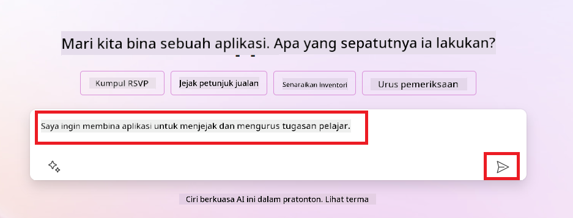
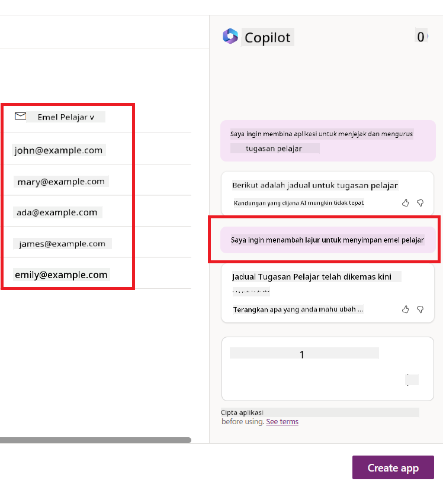
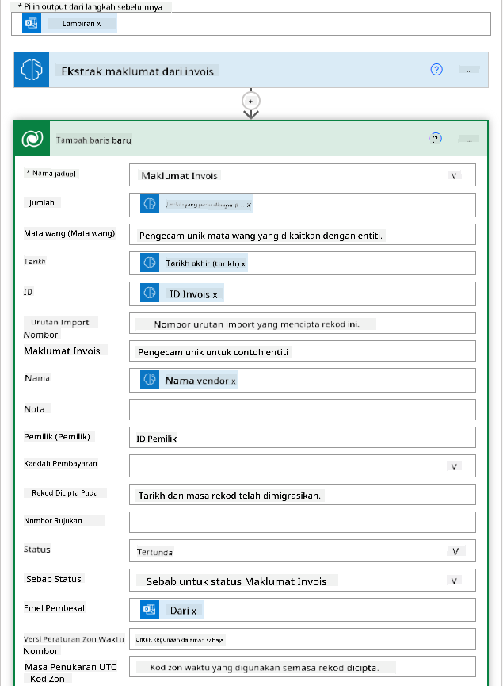

<!--
CO_OP_TRANSLATOR_METADATA:
{
  "original_hash": "f5ff3b6204a695a117d6f452403c95f7",
  "translation_date": "2025-07-09T14:08:04+00:00",
  "source_file": "10-building-low-code-ai-applications/README.md",
  "language_code": "ms"
}
-->
# Membangun Aplikasi AI Low Code

> _(Klik imej di atas untuk menonton video pelajaran ini)_

## Pengenalan

Kini setelah kita mempelajari cara membina aplikasi penjana imej, mari kita bincangkan tentang low code. Generative AI boleh digunakan dalam pelbagai bidang termasuk low code, tetapi apakah itu low code dan bagaimana kita boleh menambah AI kepadanya?

Membangun aplikasi dan penyelesaian menjadi lebih mudah untuk pembangun tradisional dan bukan pembangun melalui penggunaan Platform Pembangunan Low Code. Platform Pembangunan Low Code membolehkan anda membina aplikasi dan penyelesaian dengan sedikit atau tanpa kod langsung. Ini dicapai dengan menyediakan persekitaran pembangunan visual yang membolehkan anda seret dan lepas komponen untuk membina aplikasi dan penyelesaian. Ini membolehkan anda membina aplikasi dan penyelesaian dengan lebih pantas dan menggunakan sumber yang lebih sedikit. Dalam pelajaran ini, kita akan mendalami cara menggunakan Low Code dan bagaimana meningkatkan pembangunan low code dengan AI menggunakan Power Platform.

Power Platform memberikan peluang kepada organisasi untuk memperkasakan pasukan mereka membina penyelesaian sendiri melalui persekitaran low-code atau no-code yang intuitif. Persekitaran ini membantu mempermudah proses membina penyelesaian. Dengan Power Platform, penyelesaian boleh dibina dalam beberapa hari atau minggu, bukannya bulan atau tahun. Power Platform terdiri daripada lima produk utama: Power Apps, Power Automate, Power BI, Power Pages dan Copilot Studio.

Pelajaran ini merangkumi:

- Pengenalan kepada Generative AI dalam Power Platform  
- Pengenalan kepada Copilot dan cara menggunakannya  
- Menggunakan Generative AI untuk membina aplikasi dan aliran dalam Power Platform  
- Memahami Model AI dalam Power Platform dengan AI Builder  

## Matlamat Pembelajaran

Menjelang akhir pelajaran ini, anda akan dapat:

- Memahami cara Copilot berfungsi dalam Power Platform.

- Membina Aplikasi Penjejak Tugasan Pelajar untuk startup pendidikan kami.

- Membina Aliran Pemprosesan Invois yang menggunakan AI untuk mengekstrak maklumat daripada invois.

- Mengaplikasikan amalan terbaik ketika menggunakan Model AI Create Text dengan GPT.

Alat dan teknologi yang akan anda gunakan dalam pelajaran ini adalah:

- **Power Apps**, untuk aplikasi Penjejak Tugasan Pelajar, yang menyediakan persekitaran pembangunan low-code untuk membina aplikasi bagi menjejak, mengurus dan berinteraksi dengan data.

- **Dataverse**, untuk menyimpan data bagi aplikasi Penjejak Tugasan Pelajar di mana Dataverse menyediakan platform data low-code untuk menyimpan data aplikasi.

- **Power Automate**, untuk aliran Pemprosesan Invois di mana anda akan mempunyai persekitaran pembangunan low-code untuk membina aliran kerja bagi mengautomasikan proses Pemprosesan Invois.

- **AI Builder**, untuk Model AI Pemprosesan Invois di mana anda akan menggunakan Model AI yang telah dibina untuk memproses invois bagi startup kami.

## Generative AI dalam Power Platform

Meningkatkan pembangunan low-code dan aplikasi dengan generative AI adalah fokus utama bagi Power Platform. Matlamatnya adalah untuk membolehkan semua orang membina aplikasi, laman web, papan pemuka yang dikuasakan AI dan mengautomasikan proses dengan AI, _tanpa memerlukan kepakaran sains data_. Matlamat ini dicapai dengan mengintegrasikan generative AI ke dalam pengalaman pembangunan low-code dalam Power Platform dalam bentuk Copilot dan AI Builder.

### Bagaimana ia berfungsi?

Copilot adalah pembantu AI yang membolehkan anda membina penyelesaian Power Platform dengan menerangkan keperluan anda melalui beberapa langkah perbualan menggunakan bahasa semula jadi. Contohnya, anda boleh mengarahkan pembantu AI anda untuk menyatakan medan apa yang aplikasi anda akan gunakan dan ia akan mencipta aplikasi serta model data asas, atau anda boleh menentukan cara menyediakan aliran dalam Power Automate.

Anda boleh menggunakan fungsi yang dipacu Copilot sebagai ciri dalam skrin aplikasi anda untuk membolehkan pengguna mendapatkan pandangan melalui interaksi perbualan.

AI Builder adalah keupayaan AI low-code yang tersedia dalam Power Platform yang membolehkan anda menggunakan Model AI untuk membantu mengautomasikan proses dan meramalkan hasil. Dengan AI Builder, anda boleh membawa AI ke aplikasi dan aliran anda yang bersambung ke data anda dalam Dataverse atau pelbagai sumber data awan, seperti SharePoint, OneDrive atau Azure.

Copilot tersedia dalam semua produk Power Platform: Power Apps, Power Automate, Power BI, Power Pages dan Power Virtual Agents. AI Builder tersedia dalam Power Apps dan Power Automate. Dalam pelajaran ini, kita akan fokus pada cara menggunakan Copilot dan AI Builder dalam Power Apps dan Power Automate untuk membina penyelesaian bagi startup pendidikan kami.

### Copilot dalam Power Apps

Sebagai sebahagian daripada Power Platform, Power Apps menyediakan persekitaran pembangunan low-code untuk membina aplikasi bagi menjejak, mengurus dan berinteraksi dengan data. Ia adalah satu set perkhidmatan pembangunan aplikasi dengan platform data yang boleh diskalakan dan keupayaan untuk menyambung ke perkhidmatan awan dan data di premis. Power Apps membolehkan anda membina aplikasi yang berjalan di pelayar, tablet, dan telefon, dan boleh dikongsi dengan rakan sekerja. Power Apps memudahkan pengguna untuk membina aplikasi dengan antara muka yang ringkas, supaya setiap pengguna perniagaan atau pembangun profesional boleh membina aplikasi tersuai. Pengalaman pembangunan aplikasi juga dipertingkatkan dengan Generative AI melalui Copilot.

Ciri pembantu AI copilot dalam Power Apps membolehkan anda menerangkan jenis aplikasi yang anda perlukan dan maklumat apa yang anda mahu aplikasi anda jejak, kumpul, atau paparkan. Copilot kemudian menjana aplikasi Canvas responsif berdasarkan penerangan anda. Anda boleh menyesuaikan aplikasi itu mengikut keperluan anda. AI Copilot juga menjana dan mencadangkan Jadual Dataverse dengan medan yang anda perlukan untuk menyimpan data yang anda mahu jejak serta beberapa data contoh. Kita akan lihat apa itu Dataverse dan bagaimana anda boleh menggunakannya dalam Power Apps dalam pelajaran ini nanti. Anda kemudian boleh menyesuaikan jadual itu mengikut keperluan menggunakan ciri pembantu AI Copilot melalui langkah perbualan. Ciri ini boleh diakses terus dari skrin utama Power Apps.

### Copilot dalam Power Automate

Sebagai sebahagian daripada Power Platform, Power Automate membolehkan pengguna mencipta aliran kerja automatik antara aplikasi dan perkhidmatan. Ia membantu mengautomasikan proses perniagaan yang berulang seperti komunikasi, pengumpulan data, dan kelulusan keputusan. Antara muka yang ringkas membolehkan pengguna dengan pelbagai tahap kemahiran teknikal (dari pemula hingga pembangun berpengalaman) mengautomasikan tugasan kerja. Pengalaman pembangunan aliran kerja juga dipertingkatkan dengan Generative AI melalui Copilot.

Ciri pembantu AI copilot dalam Power Automate membolehkan anda menerangkan jenis aliran yang anda perlukan dan tindakan apa yang anda mahu aliran anda lakukan. Copilot kemudian menjana aliran berdasarkan penerangan anda. Anda boleh menyesuaikan aliran itu mengikut keperluan anda. AI Copilot juga menjana dan mencadangkan tindakan yang anda perlukan untuk melaksanakan tugasan yang anda mahu automasikan. Kita akan lihat apa itu aliran dan bagaimana anda boleh menggunakannya dalam Power Automate dalam pelajaran ini nanti. Anda kemudian boleh menyesuaikan tindakan itu mengikut keperluan menggunakan ciri pembantu AI Copilot melalui langkah perbualan. Ciri ini boleh diakses terus dari skrin utama Power Automate.

## Tugasan: Urus tugasan pelajar dan invois untuk startup kami, menggunakan Copilot

Startup kami menyediakan kursus dalam talian kepada pelajar. Startup ini berkembang dengan pesat dan kini menghadapi kesukaran untuk memenuhi permintaan kursus mereka. Startup ini telah mengupah anda sebagai pembangun Power Platform untuk membantu mereka membina penyelesaian low code bagi mengurus tugasan pelajar dan invois mereka. Penyelesaian mereka harus dapat membantu menjejak dan mengurus tugasan pelajar melalui aplikasi dan mengautomasikan proses pemprosesan invois melalui aliran kerja. Anda diminta menggunakan Generative AI untuk membangunkan penyelesaian ini.

Apabila anda mula menggunakan Copilot, anda boleh menggunakan [Power Platform Copilot Prompt Library](https://github.com/pnp/powerplatform-prompts?WT.mc_id=academic-109639-somelezediko) untuk memulakan dengan arahan. Perpustakaan ini mengandungi senarai arahan yang boleh anda gunakan untuk membina aplikasi dan aliran dengan Copilot. Anda juga boleh menggunakan arahan dalam perpustakaan untuk mendapatkan idea bagaimana menerangkan keperluan anda kepada Copilot.

### Bina Aplikasi Penjejak Tugasan Pelajar untuk Startup Kami

Para pendidik di startup kami menghadapi kesukaran untuk menjejak tugasan pelajar. Mereka menggunakan hamparan untuk menjejak tugasan tetapi ini menjadi sukar untuk diurus apabila bilangan pelajar meningkat. Mereka meminta anda membina aplikasi yang akan membantu mereka menjejak dan mengurus tugasan pelajar. Aplikasi itu harus membolehkan mereka menambah tugasan baru, melihat tugasan, mengemas kini tugasan dan memadam tugasan. Aplikasi itu juga harus membolehkan pendidik dan pelajar melihat tugasan yang telah dinilai dan yang belum dinilai.

Anda akan membina aplikasi menggunakan Copilot dalam Power Apps dengan mengikuti langkah berikut:

1. Pergi ke skrin utama [Power Apps](https://make.powerapps.com?WT.mc_id=academic-105485-koreyst).

1. Gunakan ruang teks di skrin utama untuk menerangkan aplikasi yang anda mahu bina. Contohnya, **_Saya mahu membina aplikasi untuk menjejak dan mengurus tugasan pelajar_**. Klik butang **Hantar** untuk menghantar arahan kepada AI Copilot.

1. AI Copilot akan mencadangkan Jadual Dataverse dengan medan yang anda perlukan untuk menyimpan data yang anda mahu jejak serta beberapa data contoh. Anda kemudian boleh menyesuaikan jadual itu mengikut keperluan menggunakan ciri pembantu AI Copilot melalui langkah perbualan.

   > **Penting**: Dataverse adalah platform data asas untuk Power Platform. Ia adalah platform data low-code untuk menyimpan data aplikasi. Ia adalah perkhidmatan yang diurus sepenuhnya yang menyimpan data dengan selamat dalam Microsoft Cloud dan disediakan dalam persekitaran Power Platform anda. Ia dilengkapi dengan keupayaan tadbir urus data terbina dalam, seperti pengelasan data, garis keturunan data, kawalan akses terperinci, dan banyak lagi. Anda boleh belajar lebih lanjut tentang Dataverse [di sini](https://docs.microsoft.com/powerapps/maker/data-platform/data-platform-intro?WT.mc_id=academic-109639-somelezediko).

   

1. Pendidik mahu menghantar emel kepada pelajar yang telah menyerahkan tugasan mereka untuk memaklumkan perkembangan tugasan tersebut. Anda boleh menggunakan Copilot untuk menambah medan baru dalam jadual untuk menyimpan emel pelajar. Contohnya, anda boleh menggunakan arahan berikut untuk menambah medan baru dalam jadual: **_Saya mahu menambah lajur untuk menyimpan emel pelajar_**. Klik butang **Hantar** untuk menghantar arahan kepada AI Copilot.

1. AI Copilot akan menjana medan baru dan anda boleh menyesuaikan medan itu mengikut keperluan anda.

1. Setelah selesai dengan jadual, klik butang **Bina aplikasi** untuk mencipta aplikasi.

1. AI Copilot akan menjana aplikasi Canvas responsif berdasarkan penerangan anda. Anda boleh menyesuaikan aplikasi itu mengikut keperluan anda.

1. Untuk membolehkan pendidik menghantar emel kepada pelajar, anda boleh menggunakan Copilot untuk menambah skrin baru dalam aplikasi. Contohnya, anda boleh menggunakan arahan berikut untuk menambah skrin baru dalam aplikasi: **_Saya mahu menambah skrin untuk menghantar emel kepada pelajar_**. Klik butang **Hantar** untuk menghantar arahan kepada AI Copilot.

1. AI Copilot akan menjana skrin baru dan anda boleh menyesuaikan skrin itu mengikut keperluan anda.

1. Setelah selesai dengan aplikasi, klik butang **Simpan** untuk menyimpan aplikasi.

1. Untuk berkongsi aplikasi dengan pendidik, klik butang **Kongsi** dan kemudian klik butang **Kongsi** sekali lagi. Anda boleh berkongsi aplikasi dengan pendidik dengan memasukkan alamat emel mereka.

> **Kerja rumah anda**: Aplikasi yang baru anda bina adalah permulaan yang baik tetapi boleh diperbaiki. Dengan ciri emel, pendidik hanya boleh menghantar emel kepada pelajar secara manual dengan menaip emel mereka. Bolehkah anda menggunakan Copilot untuk membina automasi yang membolehkan pendidik menghantar emel kepada pelajar secara automatik apabila mereka menyerahkan tugasan? Petunjuk anda ialah dengan arahan yang betul, anda boleh menggunakan Copilot dalam Power Automate untuk membina ini.

### Bina Jadual Maklumat Invois untuk Startup Kami

Pasukan kewangan startup kami menghadapi kesukaran untuk menjejak invois. Mereka menggunakan hamparan untuk menjejak invois tetapi ini menjadi sukar untuk diurus apabila bilangan invois meningkat. Mereka meminta anda membina jadual yang akan membantu mereka menyimpan, menjejak dan mengurus maklumat invois yang diterima. Jadual itu harus digunakan untuk membina automasi yang akan mengekstrak semua maklumat invois dan menyimpannya dalam jadual. Jadual itu juga harus membolehkan pasukan kewangan melihat invois yang telah dibayar dan yang belum dibayar.

Power Platform mempunyai platform data asas yang dipanggil Dataverse yang membolehkan anda menyimpan data untuk aplikasi dan penyelesaian anda. Dataverse menyediakan platform data low-code untuk menyimpan data aplikasi. Ia adalah perkhidmatan yang diurus sepenuhnya yang menyimpan data dengan selamat dalam Microsoft Cloud dan disediakan dalam persekitaran Power Platform anda. Ia dilengkapi dengan keupayaan tadbir urus data terbina dalam, seperti pengelasan data, garis keturunan data, kawalan akses terperinci, dan banyak lagi. Anda boleh belajar lebih lanjut [tentang Dataverse di sini](https://docs.microsoft.com/powerapps/maker/data-platform/data-platform-intro?WT.mc_id=academic-109639-somelezediko).

Mengapa kita harus menggunakan Dataverse untuk startup kita? Jadual standard dan tersuai dalam Dataverse menyediakan pilihan penyimpanan yang selamat dan berasaskan awan untuk data anda. Jadual membolehkan anda menyimpan pelbagai jenis data, serupa dengan bagaimana anda mungkin menggunakan beberapa helaian kerja dalam satu buku kerja Excel. Anda boleh menggunakan jadual untuk menyimpan data yang khusus untuk organisasi atau keperluan perniagaan anda. Beberapa manfaat yang akan diperoleh startup kami daripada menggunakan Dataverse termasuk tetapi tidak terhad kepada:
- **Mudah diurus**: Metadata dan data disimpan di awan, jadi anda tidak perlu risau tentang cara ia disimpan atau diurus. Anda boleh fokus membina aplikasi dan penyelesaian anda.

- **Selamat**: Dataverse menyediakan pilihan penyimpanan yang selamat dan berasaskan awan untuk data anda. Anda boleh mengawal siapa yang mempunyai akses ke data dalam jadual anda dan bagaimana mereka boleh mengaksesnya menggunakan keselamatan berasaskan peranan.

- **Metadata yang kaya**: Jenis data dan hubungan digunakan secara langsung dalam Power Apps

- **Logik dan pengesahan**: Anda boleh menggunakan peraturan perniagaan, medan terhitung, dan peraturan pengesahan untuk menguatkuasakan logik perniagaan dan mengekalkan ketepatan data.

Sekarang anda sudah tahu apa itu Dataverse dan mengapa anda perlu menggunakannya, mari kita lihat bagaimana anda boleh menggunakan Copilot untuk mencipta jadual dalam Dataverse bagi memenuhi keperluan pasukan kewangan kami.

> **Note** : Anda akan menggunakan jadual ini dalam bahagian seterusnya untuk membina automasi yang akan mengekstrak semua maklumat invois dan menyimpannya dalam jadual.

Untuk mencipta jadual dalam Dataverse menggunakan Copilot, ikut langkah berikut:

1. Pergi ke skrin utama [Power Apps](https://make.powerapps.com?WT.mc_id=academic-105485-koreyst).

2. Pada bar navigasi kiri, pilih **Tables** dan kemudian klik pada **Describe the new Table**.

1. Pada skrin **Describe the new Table**, gunakan ruang teks untuk menerangkan jadual yang anda ingin cipta. Contohnya, **_Saya ingin mencipta jadual untuk menyimpan maklumat invois_**. Klik butang **Send** untuk menghantar arahan kepada AI Copilot.

1. AI Copilot akan mencadangkan Jadual Dataverse dengan medan yang anda perlukan untuk menyimpan data yang ingin anda jejak serta beberapa data contoh. Anda kemudian boleh menyesuaikan jadual mengikut keperluan menggunakan ciri pembantu AI Copilot melalui langkah perbualan.

1. Pasukan kewangan ingin menghantar emel kepada pembekal untuk mengemas kini mereka dengan status terkini invois mereka. Anda boleh menggunakan Copilot untuk menambah medan baru dalam jadual bagi menyimpan emel pembekal. Contohnya, anda boleh menggunakan arahan berikut untuk menambah medan baru: **_Saya ingin menambah lajur untuk menyimpan emel pembekal_**. Klik butang **Send** untuk menghantar arahan kepada AI Copilot.

1. AI Copilot akan menjana medan baru dan anda boleh menyesuaikan medan tersebut mengikut keperluan anda.

1. Setelah selesai dengan jadual, klik butang **Create** untuk mencipta jadual tersebut.

## Model AI dalam Power Platform dengan AI Builder

AI Builder adalah keupayaan AI berkod rendah yang tersedia dalam Power Platform yang membolehkan anda menggunakan Model AI untuk membantu mengautomasikan proses dan meramalkan hasil. Dengan AI Builder, anda boleh membawa AI ke dalam aplikasi dan aliran kerja anda yang bersambung ke data anda dalam Dataverse atau pelbagai sumber data awan seperti SharePoint, OneDrive atau Azure.

## Model AI Sedia Ada vs Model AI Tersuai

AI Builder menyediakan dua jenis Model AI: Model AI Sedia Ada dan Model AI Tersuai. Model AI Sedia Ada adalah model yang sudah dilatih oleh Microsoft dan tersedia dalam Power Platform. Model ini membantu anda menambah kecerdasan ke aplikasi dan aliran kerja tanpa perlu mengumpul data, membina, melatih dan menerbitkan model anda sendiri. Anda boleh menggunakan model ini untuk mengautomasikan proses dan meramalkan hasil.

Beberapa Model AI Sedia Ada yang tersedia dalam Power Platform termasuk:

- **Key Phrase Extraction**: Model ini mengekstrak frasa utama daripada teks.
- **Language Detection**: Model ini mengesan bahasa teks.
- **Sentiment Analysis**: Model ini mengesan sentimen positif, negatif, neutral, atau campuran dalam teks.
- **Business Card Reader**: Model ini mengekstrak maklumat daripada kad perniagaan.
- **Text Recognition**: Model ini mengekstrak teks daripada imej.
- **Object Detection**: Model ini mengesan dan mengekstrak objek daripada imej.
- **Document processing**: Model ini mengekstrak maklumat daripada borang.
- **Invoice Processing**: Model ini mengekstrak maklumat daripada invois.

Dengan Model AI Tersuai, anda boleh membawa model anda sendiri ke dalam AI Builder supaya ia berfungsi seperti mana-mana model tersuai AI Builder, membolehkan anda melatih model menggunakan data anda sendiri. Anda boleh menggunakan model ini untuk mengautomasikan proses dan meramalkan hasil dalam Power Apps dan Power Automate. Apabila menggunakan model anda sendiri, terdapat had yang dikenakan. Baca lebih lanjut mengenai [had ini](https://learn.microsoft.com/ai-builder/byo-model#limitations?WT.mc_id=academic-105485-koreyst).

## Tugasan #2 - Bina Aliran Pemprosesan Invois untuk Startup Kami

Pasukan kewangan menghadapi kesukaran untuk memproses invois. Mereka menggunakan hamparan untuk menjejak invois tetapi ia menjadi sukar untuk diurus apabila bilangan invois meningkat. Mereka meminta anda membina aliran kerja yang akan membantu mereka memproses invois menggunakan AI. Aliran kerja ini harus membolehkan mereka mengekstrak maklumat daripada invois dan menyimpan maklumat tersebut dalam jadual Dataverse. Aliran kerja juga harus membolehkan mereka menghantar emel kepada pasukan kewangan dengan maklumat yang telah diekstrak.

Sekarang anda sudah tahu apa itu AI Builder dan mengapa anda perlu menggunakannya, mari kita lihat bagaimana anda boleh menggunakan Model AI Pemprosesan Invois dalam AI Builder, yang telah kita bincangkan sebelum ini, untuk membina aliran kerja yang akan membantu pasukan kewangan memproses invois.

Untuk membina aliran kerja yang akan membantu pasukan kewangan memproses invois menggunakan Model AI Pemprosesan Invois dalam AI Builder, ikut langkah berikut:

1. Pergi ke skrin utama [Power Automate](https://make.powerautomate.com?WT.mc_id=academic-105485-koreyst).

2. Gunakan ruang teks pada skrin utama untuk menerangkan aliran kerja yang anda ingin bina. Contohnya, **_Proses invois apabila ia tiba di peti masuk saya_**. Klik butang **Send** untuk menghantar arahan kepada AI Copilot.

   

3. AI Copilot akan mencadangkan tindakan yang perlu anda lakukan untuk tugasan yang ingin anda automasikan. Anda boleh klik butang **Next** untuk meneruskan ke langkah seterusnya.

4. Pada langkah seterusnya, Power Automate akan meminta anda menyediakan sambungan yang diperlukan untuk aliran tersebut. Setelah selesai, klik butang **Create flow** untuk mencipta aliran.

5. AI Copilot akan menjana aliran dan anda boleh menyesuaikan aliran tersebut mengikut keperluan anda.

6. Kemas kini pencetus aliran dan tetapkan **Folder** kepada folder di mana invois akan disimpan. Contohnya, anda boleh tetapkan folder kepada **Inbox**. Klik pada **Show advanced options** dan tetapkan **Only with Attachments** kepada **Yes**. Ini memastikan aliran hanya berjalan apabila emel dengan lampiran diterima dalam folder tersebut.

7. Buang tindakan berikut daripada aliran: **HTML to text**, **Compose**, **Compose 2**, **Compose 3** dan **Compose 4** kerana anda tidak akan menggunakannya.

8. Buang tindakan **Condition** daripada aliran kerana anda tidak akan menggunakannya. Ia harus kelihatan seperti tangkapan skrin berikut:

   

9. Klik butang **Add an action** dan cari **Dataverse**. Pilih tindakan **Add a new row**.

10. Pada tindakan **Extract Information from invoices**, kemas kini **Invoice File** untuk menunjuk kepada **Attachment Content** daripada emel. Ini memastikan aliran mengekstrak maklumat daripada lampiran invois.

11. Pilih **Table** yang anda cipta sebelum ini. Contohnya, anda boleh pilih jadual **Invoice Information**. Pilih kandungan dinamik daripada tindakan sebelumnya untuk mengisi medan berikut:

    - ID
    - Amount
    - Date
    - Name
    - Status - Tetapkan **Status** kepada **Pending**.
    - Supplier Email - Gunakan kandungan dinamik **From** daripada pencetus **When a new email arrives**.

    

12. Setelah selesai dengan aliran, klik butang **Save** untuk menyimpan aliran. Anda boleh menguji aliran dengan menghantar emel yang mengandungi invois ke folder yang anda tetapkan dalam pencetus.

> **Kerja rumah anda**: Aliran yang baru anda bina adalah permulaan yang baik, kini anda perlu fikirkan bagaimana untuk membina automasi yang membolehkan pasukan kewangan kami menghantar emel kepada pembekal untuk mengemas kini mereka dengan status terkini invois mereka. Petunjuk anda: aliran mesti berjalan apabila status invois berubah.

## Gunakan Model AI Penjanaan Teks dalam Power Automate

Model AI Create Text with GPT dalam AI Builder membolehkan anda menjana teks berdasarkan arahan dan dikuasakan oleh Microsoft Azure OpenAI Service. Dengan keupayaan ini, anda boleh menggabungkan teknologi GPT (Generative Pre-Trained Transformer) ke dalam aplikasi dan aliran kerja anda untuk membina pelbagai aliran automatik dan aplikasi yang bermaklumat.

Model GPT menjalani latihan intensif menggunakan sejumlah besar data, membolehkan mereka menghasilkan teks yang hampir menyerupai bahasa manusia apabila diberikan arahan. Apabila digabungkan dengan automasi aliran kerja, model AI seperti GPT boleh digunakan untuk mempermudah dan mengautomasikan pelbagai tugasan.

Sebagai contoh, anda boleh membina aliran untuk menjana teks secara automatik bagi pelbagai kegunaan, seperti: draf emel, penerangan produk, dan banyak lagi. Anda juga boleh menggunakan model ini untuk menjana teks bagi pelbagai aplikasi, seperti chatbot dan aplikasi perkhidmatan pelanggan yang membolehkan ejen perkhidmatan pelanggan memberi respons dengan berkesan dan cekap kepada pertanyaan pelanggan.

Untuk belajar cara menggunakan Model AI ini dalam Power Automate, ikuti modul [Add intelligence with AI Builder and GPT](https://learn.microsoft.com/training/modules/ai-builder-text-generation/?WT.mc_id=academic-109639-somelezediko).

## Kerja yang Hebat! Teruskan Pembelajaran Anda

Selepas menamatkan pelajaran ini, lihat koleksi pembelajaran [Generative AI Learning collection](https://aka.ms/genai-collection?WT.mc_id=academic-105485-koreyst) untuk terus meningkatkan pengetahuan Generative AI anda!

Teruskan ke Pelajaran 11 di mana kita akan melihat bagaimana untuk [mengintegrasikan Generative AI dengan Function Calling](../11-integrating-with-function-calling/README.md?WT.mc_id=academic-105485-koreyst)!

**Penafian**:  
Dokumen ini telah diterjemahkan menggunakan perkhidmatan terjemahan AI [Co-op Translator](https://github.com/Azure/co-op-translator). Walaupun kami berusaha untuk ketepatan, sila ambil perhatian bahawa terjemahan automatik mungkin mengandungi kesilapan atau ketidaktepatan. Dokumen asal dalam bahasa asalnya harus dianggap sebagai sumber yang sahih. Untuk maklumat penting, terjemahan profesional oleh manusia adalah disyorkan. Kami tidak bertanggungjawab atas sebarang salah faham atau salah tafsir yang timbul daripada penggunaan terjemahan ini.