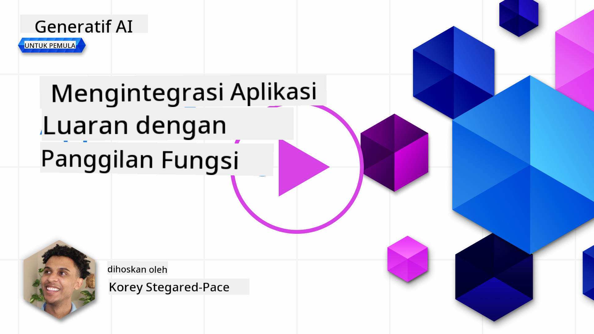
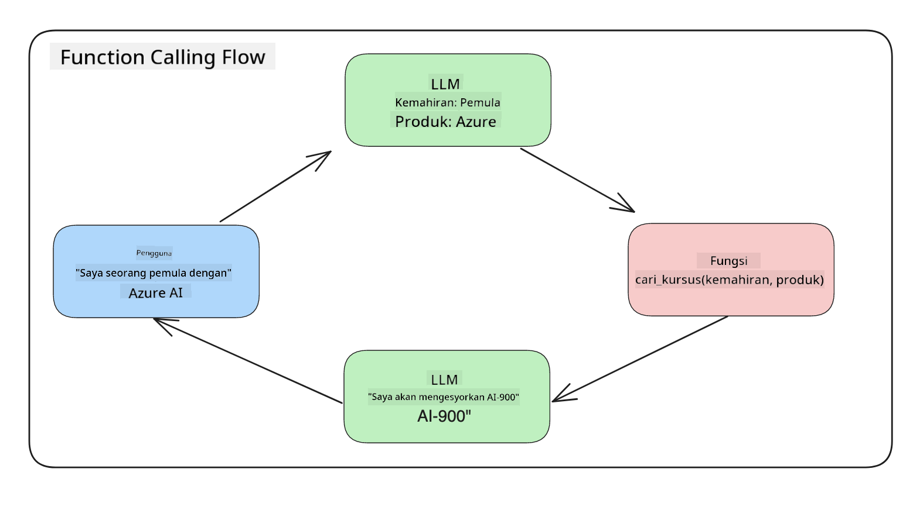
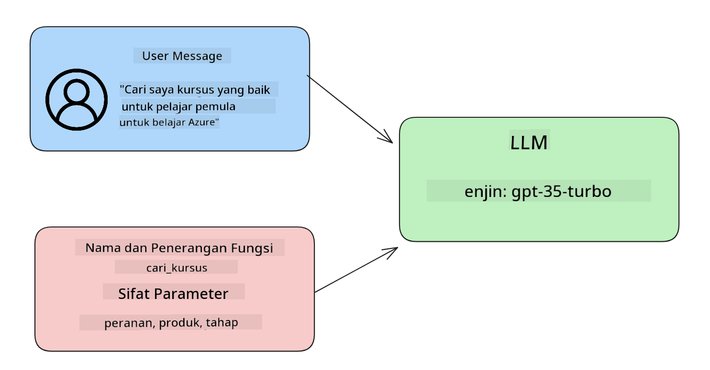

<!--
CO_OP_TRANSLATOR_METADATA:
{
  "original_hash": "77a48a201447be19aa7560706d6f93a0",
  "translation_date": "2025-07-09T14:39:30+00:00",
  "source_file": "11-integrating-with-function-calling/README.md",
  "language_code": "ms"
}
-->
# Integrasi dengan pemanggilan fungsi

[](https://aka.ms/gen-ai-lesson11-gh?WT.mc_id=academic-105485-koreyst)

Anda telah mempelajari banyak perkara setakat ini dalam pelajaran sebelum ini. Namun, kita boleh memperbaiki lagi. Beberapa perkara yang boleh kita atasi adalah bagaimana kita boleh mendapatkan format respons yang lebih konsisten supaya lebih mudah untuk bekerja dengan respons tersebut di peringkat seterusnya. Selain itu, kita mungkin ingin menambah data dari sumber lain untuk memperkayakan aplikasi kita.

Masalah yang disebutkan di atas adalah apa yang bab ini ingin atasi.

## Pengenalan

Pelajaran ini akan merangkumi:

- Menjelaskan apa itu pemanggilan fungsi dan kes penggunaannya.
- Membuat panggilan fungsi menggunakan Azure OpenAI.
- Cara mengintegrasikan panggilan fungsi ke dalam aplikasi.

## Matlamat Pembelajaran

Menjelang akhir pelajaran ini, anda akan dapat:

- Menjelaskan tujuan menggunakan pemanggilan fungsi.
- Menyediakan Pemanggilan Fungsi menggunakan Perkhidmatan Azure OpenAI.
- Mereka bentuk panggilan fungsi yang berkesan untuk kes penggunaan aplikasi anda.

## Senario: Memperbaiki chatbot kita dengan fungsi

Untuk pelajaran ini, kita ingin membina ciri untuk startup pendidikan kita yang membolehkan pengguna menggunakan chatbot untuk mencari kursus teknikal. Kita akan mencadangkan kursus yang sesuai dengan tahap kemahiran, peranan semasa dan teknologi yang diminati oleh mereka.

Untuk melengkapkan senario ini, kita akan menggunakan gabungan:

- `Azure OpenAI` untuk mencipta pengalaman chat untuk pengguna.
- `Microsoft Learn Catalog API` untuk membantu pengguna mencari kursus berdasarkan permintaan pengguna.
- `Function Calling` untuk mengambil pertanyaan pengguna dan menghantarnya ke fungsi untuk membuat permintaan API.

Untuk memulakan, mari kita lihat mengapa kita ingin menggunakan pemanggilan fungsi pada mulanya:

## Mengapa Pemanggilan Fungsi

Sebelum pemanggilan fungsi, respons dari LLM adalah tidak berstruktur dan tidak konsisten. Pembangun perlu menulis kod pengesahan yang kompleks untuk memastikan mereka dapat mengendalikan setiap variasi respons. Pengguna tidak dapat mendapatkan jawapan seperti "Apakah cuaca semasa di Stockholm?". Ini kerana model terhad kepada masa data dilatih.

Pemanggilan Fungsi adalah ciri Perkhidmatan Azure OpenAI untuk mengatasi had berikut:

- **Format respons yang konsisten**. Jika kita dapat mengawal format respons dengan lebih baik, kita boleh lebih mudah mengintegrasikan respons tersebut ke sistem lain.
- **Data luaran**. Keupayaan menggunakan data dari sumber lain dalam konteks chat aplikasi.

## Mengilustrasikan masalah melalui senario

> Kami mengesyorkan anda menggunakan [notebook yang disertakan](python/aoai-assignment.ipynb) jika anda ingin menjalankan senario di bawah. Anda juga boleh hanya membaca kerana kami cuba menggambarkan masalah di mana fungsi boleh membantu menyelesaikan masalah tersebut.

Mari kita lihat contoh yang menggambarkan masalah format respons:

Katakan kita ingin mencipta pangkalan data data pelajar supaya kita boleh mencadangkan kursus yang sesuai kepada mereka. Di bawah ini terdapat dua penerangan pelajar yang sangat serupa dari segi data yang terkandung.

1. Cipta sambungan ke sumber Azure OpenAI kita:

   ```python
   import os
   import json
   from openai import AzureOpenAI
   from dotenv import load_dotenv
   load_dotenv()

   client = AzureOpenAI(
   api_key=os.environ['AZURE_OPENAI_API_KEY'],  # this is also the default, it can be omitted
   api_version = "2023-07-01-preview"
   )

   deployment=os.environ['AZURE_OPENAI_DEPLOYMENT']
   ```

   Di bawah adalah beberapa kod Python untuk mengkonfigurasi sambungan kita ke Azure OpenAI di mana kita menetapkan `api_type`, `api_base`, `api_version` dan `api_key`.

1. Membuat dua penerangan pelajar menggunakan pembolehubah `student_1_description` dan `student_2_description`.

   ```python
   student_1_description="Emily Johnson is a sophomore majoring in computer science at Duke University. She has a 3.7 GPA. Emily is an active member of the university's Chess Club and Debate Team. She hopes to pursue a career in software engineering after graduating."

   student_2_description = "Michael Lee is a sophomore majoring in computer science at Stanford University. He has a 3.8 GPA. Michael is known for his programming skills and is an active member of the university's Robotics Club. He hopes to pursue a career in artificial intelligence after finishing his studies."
   ```

   Kita ingin menghantar penerangan pelajar di atas ke LLM untuk mengurai data tersebut. Data ini kemudian boleh digunakan dalam aplikasi kita dan dihantar ke API atau disimpan dalam pangkalan data.

1. Mari kita buat dua arahan yang sama di mana kita mengarahkan LLM tentang maklumat yang kita minati:

   ```python
   prompt1 = f'''
   Please extract the following information from the given text and return it as a JSON object:

   name
   major
   school
   grades
   club

   This is the body of text to extract the information from:
   {student_1_description}
   '''

   prompt2 = f'''
   Please extract the following information from the given text and return it as a JSON object:

   name
   major
   school
   grades
   club

   This is the body of text to extract the information from:
   {student_2_description}
   '''
   ```

   Arahan di atas mengarahkan LLM untuk mengekstrak maklumat dan mengembalikan respons dalam format JSON.

1. Selepas menyediakan arahan dan sambungan ke Azure OpenAI, kita akan menghantar arahan tersebut ke LLM menggunakan `openai.ChatCompletion`. Kita menyimpan arahan dalam pembolehubah `messages` dan menetapkan peranan sebagai `user`. Ini untuk meniru mesej dari pengguna yang ditulis ke chatbot.

   ```python
   # response from prompt one
   openai_response1 = client.chat.completions.create(
   model=deployment,
   messages = [{'role': 'user', 'content': prompt1}]
   )
   openai_response1.choices[0].message.content

   # response from prompt two
   openai_response2 = client.chat.completions.create(
   model=deployment,
   messages = [{'role': 'user', 'content': prompt2}]
   )
   openai_response2.choices[0].message.content
   ```

Sekarang kita boleh menghantar kedua-dua permintaan ke LLM dan memeriksa respons yang diterima dengan mencarinya seperti ini `openai_response1['choices'][0]['message']['content']`.

1. Akhir sekali, kita boleh menukar respons ke format JSON dengan memanggil `json.loads`:

   ```python
   # Loading the response as a JSON object
   json_response1 = json.loads(openai_response1.choices[0].message.content)
   json_response1
   ```

   Respons 1:

   ```json
   {
     "name": "Emily Johnson",
     "major": "computer science",
     "school": "Duke University",
     "grades": "3.7",
     "club": "Chess Club"
   }
   ```

   Respons 2:

   ```json
   {
     "name": "Michael Lee",
     "major": "computer science",
     "school": "Stanford University",
     "grades": "3.8 GPA",
     "club": "Robotics Club"
   }
   ```

   Walaupun arahan adalah sama dan penerangan hampir serupa, kita melihat nilai sifat `Grades` diformatkan secara berbeza, kerana kadang-kadang kita mendapat format `3.7` atau `3.7 GPA` contohnya.

   Keputusan ini kerana LLM mengambil data tidak berstruktur dalam bentuk arahan bertulis dan mengembalikan juga data tidak berstruktur. Kita perlu mempunyai format berstruktur supaya kita tahu apa yang dijangka apabila menyimpan atau menggunakan data ini.

Jadi bagaimana kita menyelesaikan masalah format ini? Dengan menggunakan pemanggilan fungsi, kita boleh memastikan kita menerima data berstruktur kembali. Apabila menggunakan pemanggilan fungsi, LLM sebenarnya tidak memanggil atau menjalankan sebarang fungsi. Sebaliknya, kita mencipta struktur untuk LLM ikuti bagi responsnya. Kita kemudian menggunakan respons berstruktur itu untuk mengetahui fungsi mana yang perlu dijalankan dalam aplikasi kita.



Kita kemudian boleh mengambil apa yang dikembalikan dari fungsi dan menghantarnya kembali ke LLM. LLM akan membalas menggunakan bahasa semula jadi untuk menjawab pertanyaan pengguna.

## Kes Penggunaan untuk menggunakan panggilan fungsi

Terdapat banyak kes penggunaan di mana panggilan fungsi boleh memperbaiki aplikasi anda seperti:

- **Memanggil Alat Luaran**. Chatbot sangat baik dalam memberikan jawapan kepada soalan pengguna. Dengan menggunakan pemanggilan fungsi, chatbot boleh menggunakan mesej dari pengguna untuk melengkapkan tugas tertentu. Contohnya, seorang pelajar boleh meminta chatbot "Hantar emel kepada pengajar saya mengatakan saya perlukan lebih bantuan dengan subjek ini". Ini boleh membuat panggilan fungsi ke `send_email(to: string, body: string)`

- **Membuat Pertanyaan API atau Pangkalan Data**. Pengguna boleh mencari maklumat menggunakan bahasa semula jadi yang ditukar menjadi pertanyaan atau permintaan API yang diformatkan. Contohnya, seorang guru yang meminta "Siapa pelajar yang telah menyiapkan tugasan terakhir" yang boleh memanggil fungsi bernama `get_completed(student_name: string, assignment: int, current_status: string)`

- **Mencipta Data Berstruktur**. Pengguna boleh mengambil blok teks atau CSV dan menggunakan LLM untuk mengekstrak maklumat penting daripadanya. Contohnya, seorang pelajar boleh menukar artikel Wikipedia tentang perjanjian damai untuk mencipta flashcard AI. Ini boleh dilakukan dengan menggunakan fungsi bernama `get_important_facts(agreement_name: string, date_signed: string, parties_involved: list)`

## Mencipta Panggilan Fungsi Pertama Anda

Proses mencipta panggilan fungsi merangkumi 3 langkah utama:

1. **Memanggil** API Chat Completions dengan senarai fungsi anda dan mesej pengguna.
2. **Membaca** respons model untuk melakukan tindakan iaitu menjalankan fungsi atau Panggilan API.
3. **Membuat** panggilan lain ke API Chat Completions dengan respons dari fungsi anda untuk menggunakan maklumat itu bagi mencipta respons kepada pengguna.



### Langkah 1 - mencipta mesej

Langkah pertama adalah mencipta mesej pengguna. Ini boleh ditetapkan secara dinamik dengan mengambil nilai dari input teks atau anda boleh menetapkan nilai di sini. Jika ini kali pertama anda bekerja dengan API Chat Completions, kita perlu mentakrifkan `role` dan `content` mesej.

`role` boleh sama ada `system` (mencipta peraturan), `assistant` (model) atau `user` (pengguna akhir). Untuk pemanggilan fungsi, kita akan menetapkannya sebagai `user` dan contoh soalan.

```python
messages= [ {"role": "user", "content": "Find me a good course for a beginner student to learn Azure."} ]
```

Dengan menetapkan peranan yang berbeza, ia menjelaskan kepada LLM sama ada sistem yang bercakap atau pengguna, yang membantu membina sejarah perbualan yang boleh dibina oleh LLM.

### Langkah 2 - mencipta fungsi

Seterusnya, kita akan mentakrifkan fungsi dan parameter fungsi tersebut. Kita akan menggunakan satu fungsi sahaja di sini yang dipanggil `search_courses` tetapi anda boleh mencipta pelbagai fungsi.

> **Penting** : Fungsi dimasukkan dalam mesej sistem kepada LLM dan akan termasuk dalam jumlah token yang tersedia untuk anda.

Di bawah, kita mencipta fungsi sebagai array item. Setiap item adalah fungsi dan mempunyai sifat `name`, `description` dan `parameters`:

```python
functions = [
   {
      "name":"search_courses",
      "description":"Retrieves courses from the search index based on the parameters provided",
      "parameters":{
         "type":"object",
         "properties":{
            "role":{
               "type":"string",
               "description":"The role of the learner (i.e. developer, data scientist, student, etc.)"
            },
            "product":{
               "type":"string",
               "description":"The product that the lesson is covering (i.e. Azure, Power BI, etc.)"
            },
            "level":{
               "type":"string",
               "description":"The level of experience the learner has prior to taking the course (i.e. beginner, intermediate, advanced)"
            }
         },
         "required":[
            "role"
         ]
      }
   }
]
```

Mari kita terangkan setiap contoh fungsi dengan lebih terperinci di bawah:

- `name` - Nama fungsi yang kita mahu dipanggil.
- `description` - Ini adalah penerangan bagaimana fungsi berfungsi. Di sini penting untuk spesifik dan jelas.
- `parameters` - Senarai nilai dan format yang anda mahu model hasilkan dalam responsnya. Array parameter terdiri daripada item di mana item mempunyai sifat berikut:
  1.  `type` - Jenis data bagi sifat yang akan disimpan.
  1.  `properties` - Senarai nilai khusus yang model akan gunakan untuk responsnya
      1. `name` - Kunci adalah nama sifat yang model akan gunakan dalam respons yang diformatkan, contohnya, `product`.
      1. `type` - Jenis data bagi sifat ini, contohnya, `string`.
      1. `description` - Penerangan tentang sifat khusus tersebut.

Terdapat juga sifat pilihan `required` - sifat wajib untuk panggilan fungsi diselesaikan.

### Langkah 3 - Membuat panggilan fungsi

Selepas mentakrifkan fungsi, kita kini perlu memasukkannya dalam panggilan ke API Chat Completion. Kita lakukan ini dengan menambah `functions` ke dalam permintaan. Dalam kes ini `functions=functions`.

Terdapat juga pilihan untuk menetapkan `function_call` kepada `auto`. Ini bermakna kita membiarkan LLM memutuskan fungsi mana yang perlu dipanggil berdasarkan mesej pengguna dan bukannya menetapkannya sendiri.

Berikut adalah beberapa kod di bawah di mana kita memanggil `ChatCompletion.create`, perhatikan bagaimana kita menetapkan `functions=functions` dan `function_call="auto"` dan dengan itu memberi pilihan kepada LLM bila untuk memanggil fungsi yang kita sediakan:

```python
response = client.chat.completions.create(model=deployment,
                                        messages=messages,
                                        functions=functions,
                                        function_call="auto")

print(response.choices[0].message)
```

Respons yang diterima kini kelihatan seperti ini:

```json
{
  "role": "assistant",
  "function_call": {
    "name": "search_courses",
    "arguments": "{\n  \"role\": \"student\",\n  \"product\": \"Azure\",\n  \"level\": \"beginner\"\n}"
  }
}
```

Di sini kita boleh lihat bagaimana fungsi `search_courses` dipanggil dan dengan argumen apa, seperti yang disenaraikan dalam sifat `arguments` dalam respons JSON.

Kesimpulannya LLM dapat mencari data untuk memenuhi argumen fungsi kerana ia mengekstrak dari nilai yang diberikan kepada parameter `messages` dalam panggilan chat completion. Di bawah adalah peringatan nilai `messages`:

```python
messages= [ {"role": "user", "content": "Find me a good course for a beginner student to learn Azure."} ]
```

Seperti yang anda lihat, `student`, `Azure` dan `beginner` diekstrak dari `messages` dan ditetapkan sebagai input kepada fungsi. Menggunakan fungsi dengan cara ini adalah cara yang baik untuk mengekstrak maklumat dari arahan tetapi juga untuk menyediakan struktur kepada LLM dan mempunyai fungsi yang boleh digunakan semula.

Seterusnya, kita perlu lihat bagaimana kita boleh menggunakan ini dalam aplikasi kita.

## Mengintegrasikan Panggilan Fungsi ke dalam Aplikasi

Selepas kita menguji respons yang diformatkan dari LLM, kita kini boleh mengintegrasikannya ke dalam aplikasi.

### Mengurus aliran

Untuk mengintegrasikan ini ke dalam aplikasi kita, mari ambil langkah berikut:

1. Pertama, mari buat panggilan ke perkhidmatan OpenAI dan simpan mesej dalam pembolehubah yang dipanggil `response_message`.

   ```python
   response_message = response.choices[0].message
   ```

1. Kini kita akan mentakrifkan fungsi yang akan memanggil Microsoft Learn API untuk mendapatkan senarai kursus:

   ```python
   import requests

   def search_courses(role, product, level):
     url = "https://learn.microsoft.com/api/catalog/"
     params = {
        "role": role,
        "product": product,
        "level": level
     }
     response = requests.get(url, params=params)
     modules = response.json()["modules"]
     results = []
     for module in modules[:5]:
        title = module["title"]
        url = module["url"]
        results.append({"title": title, "url": url})
     return str(results)
   ```

   Perhatikan bagaimana kita kini mencipta fungsi Python sebenar yang memetakan kepada nama fungsi yang diperkenalkan dalam pembolehubah `functions`. Kita juga membuat panggilan API luaran sebenar untuk mendapatkan data yang diperlukan. Dalam kes ini, kita menggunakan Microsoft Learn API untuk mencari modul latihan.

Baiklah, kita telah mencipta pembolehubah `functions` dan fungsi Python yang sepadan, bagaimana kita memberitahu LLM bagaimana untuk memetakan kedua-duanya supaya fungsi Python kita dipanggil?

1. Untuk melihat jika kita perlu memanggil fungsi Python, kita perlu melihat respons LLM dan lihat jika `function_call` adalah sebahagian daripadanya dan memanggil fungsi yang ditunjukkan. Berikut adalah cara anda boleh membuat pemeriksaan tersebut di bawah:

   ```python
   # Check if the model wants to call a function
   if response_message.function_call.name:
    print("Recommended Function call:")
    print(response_message.function_call.name)
    print()

    # Call the function.
    function_name = response_message.function_call.name

    available_functions = {
            "search_courses": search_courses,
    }
    function_to_call = available_functions[function_name]

    function_args = json.loads(response_message.function_call.arguments)
    function_response = function_to_call(**function_args)

    print("Output of function call:")
    print(function_response)
    print(type(function_response))


    # Add the assistant response and function response to the messages
    messages.append( # adding assistant response to messages
        {
            "role": response_message.role,
            "function_call": {
                "name": function_name,
                "arguments": response_message.function_call.arguments,
            },
            "content": None
        }
    )
    messages.append( # adding function response to messages
        {
            "role": "function",
            "name": function_name,
            "content":function_response,
        }
    )
   ```

   Tiga baris ini memastikan kita mengekstrak nama fungsi, argumen dan membuat panggilan:

   ```python
   function_to_call = available_functions[function_name]

   function_args = json.loads(response_message.function_call.arguments)
   function_response = function_to_call(**function_args)
   ```

   Di bawah adalah output dari menjalankan kod kita:

   **Output**

   ```Recommended Function call:
   {
     "name": "search_courses",
     "arguments": "{\n  \"role\": \"student\",\n  \"product\": \"Azure\",\n  \"level\": \"beginner\"\n}"
   }

   Output of function call:
   [{'title': 'Describe concepts of cryptography', 'url': 'https://learn.microsoft.com/training/modules/describe-concepts-of-cryptography/?
   WT.mc_id=api_CatalogApi'}, {'title': 'Introduction to audio classification with TensorFlow', 'url': 'https://learn.microsoft.com/en-
   us/training/modules/intro-audio-classification-tensorflow/?WT.mc_id=api_CatalogApi'}, {'title': 'Design a Performant Data Model in Azure SQL
   Database with Azure Data Studio', 'url': 'https://learn.microsoft.com/training/modules/design-a-data-model-with-ads/?
   WT.mc_id=api_CatalogApi'}, {'title': 'Getting started with the Microsoft Cloud Adoption Framework for Azure', 'url':
   'https://learn.microsoft.com/training/modules/cloud-adoption-framework-getting-started/?WT.mc_id=api_CatalogApi'}, {'title': 'Set up the
   Rust development environment', 'url': 'https://learn.microsoft.com/training/modules/rust-set-up-environment/?WT.mc_id=api_CatalogApi'}]
   <class 'str'>
   ```

1. Kini kita akan menghantar mesej yang dikemas kini, `messages` ke LLM supaya kita boleh menerima respons dalam bahasa semula jadi dan bukannya respons JSON yang diformatkan API.

   ```python
   print("Messages in next request:")
   print(messages)
   print()

   second_response = client.chat.completions.create(
      messages=messages,
      model=deployment,
      function_call="auto",
      functions=functions,
      temperature=0
         )  # get a new response from GPT where it can see the function response


   print(second_response.choices[0].message)
   ```

   **Output**

   ```python
   {
     "role": "assistant",
     "content": "I found some good courses for beginner students to learn Azure:\n\n1. [Describe concepts of cryptography] (https://learn.microsoft.com/training/modules/describe-concepts-of-cryptography/?WT.mc_id=api_CatalogApi)\n2. [Introduction to audio classification with TensorFlow](https://learn.microsoft.com/training/modules/intro-audio-classification-tensorflow/?WT.mc_id=api_CatalogApi)\n3. [Design a Performant Data Model in Azure SQL Database with Azure Data Studio](https://learn.microsoft.com/training/modules/design-a-data-model-with-ads/?WT.mc_id=api_CatalogApi)\n4. [Getting started with the Microsoft Cloud Adoption Framework for Azure](https://learn.microsoft.com/training/modules/cloud-adoption-framework-getting-started/?WT.mc_id=api_CatalogApi)\n5. [Set up the Rust development environment](https://learn.microsoft.com/training/modules/rust-set-up-environment/?WT.mc_id=api_CatalogApi)\n\nYou can click on the links to access the courses."
   }

   ```

## Tugasan

Untuk meneruskan pembelajaran anda tentang Azure OpenAI Function Calling anda boleh membina:

- Lebih banyak parameter fungsi yang mungkin membantu pelajar mencari lebih banyak kursus.
- Cipta panggilan fungsi lain yang mengambil lebih banyak maklumat dari pelajar seperti bahasa ibunda mereka.
- Cipta pengendalian ralat apabila panggilan fungsi dan/atau panggilan API tidak mengembalikan kursus yang sesuai.
## Kerja Hebat! Teruskan Perjalanan

Selepas menamatkan pelajaran ini, lihat koleksi [Pembelajaran AI Generatif](https://aka.ms/genai-collection?WT.mc_id=academic-105485-koreyst) kami untuk terus meningkatkan pengetahuan AI Generatif anda!

Teruskan ke Pelajaran 12, di mana kita akan melihat cara untuk [mereka bentuk UX untuk aplikasi AI](../12-designing-ux-for-ai-applications/README.md?WT.mc_id=academic-105485-koreyst)!

**Penafian**:  
Dokumen ini telah diterjemahkan menggunakan perkhidmatan terjemahan AI [Co-op Translator](https://github.com/Azure/co-op-translator). Walaupun kami berusaha untuk ketepatan, sila ambil perhatian bahawa terjemahan automatik mungkin mengandungi kesilapan atau ketidaktepatan. Dokumen asal dalam bahasa asalnya harus dianggap sebagai sumber yang sahih. Untuk maklumat penting, terjemahan profesional oleh manusia adalah disyorkan. Kami tidak bertanggungjawab atas sebarang salah faham atau salah tafsir yang timbul daripada penggunaan terjemahan ini.