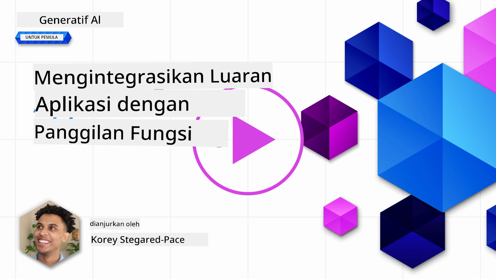
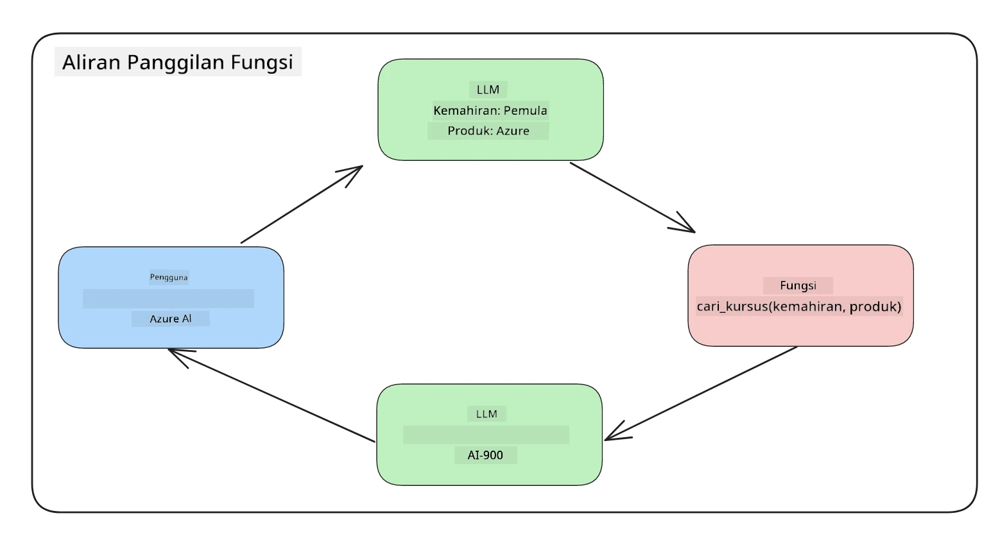
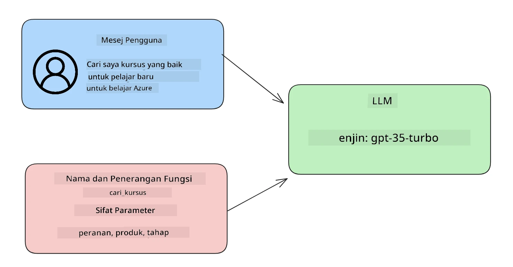

# Mengintegrasi dengan panggilan fungsi

[](https://youtu.be/DgUdCLX8qYQ?si=f1ouQU5HQx6F8Gl2)

Anda telah mempelajari cukup banyak setakat ini dalam pelajaran-pelajaran sebelum ini. Walau bagaimanapun, kita boleh tingkatkan lagi. Beberapa perkara yang boleh kita atasi adalah bagaimana kita boleh mendapatkan format respons yang lebih konsisten untuk memudahkan kerja dengan respons tersebut di peringkat seterusnya. Selain itu, kita mungkin ingin menambah data dari sumber lain untuk memperkayakan aplikasi kita.

Masalah yang telah disebutkan di atas adalah apa yang bab ini ingin selesaikan.

## Pengenalan

Pelajaran ini akan merangkumi:

- Menjelaskan apa itu panggilan fungsi dan kes penggunaan nya.
- Membuat panggilan fungsi menggunakan Azure OpenAI.
- Cara mengintegrasikan panggilan fungsi ke dalam aplikasi.

## Matlamat Pembelajaran

Menjelang akhir pelajaran ini, anda akan dapat:

- Menjelaskan tujuan menggunakan panggilan fungsi.
- Menyediakan Panggilan Fungsi menggunakan Azure OpenAI Service.
- Mereka bentuk panggilan fungsi yang efektif untuk kes penggunaan aplikasi anda.

## Senario: Meningkatkan chatbot kita dengan fungsi

Untuk pelajaran ini, kami ingin membina fungsi untuk startup pendidikan kami yang membolehkan pengguna menggunakan chatbot untuk mencari kursus teknikal. Kami akan mencadangkan kursus yang sesuai dengan tahap kemahiran mereka, peranan semasa dan teknologi yang diminati.

Untuk melengkapkan senario ini, kami akan menggunakan gabungan:

- `Azure OpenAI` untuk mencipta pengalaman chat untuk pengguna.
- `Microsoft Learn Catalog API` untuk membantu pengguna mencari kursus berdasarkan permintaan pengguna.
- `Function Calling` untuk mengambil pertanyaan pengguna dan menghantarnya kepada fungsi untuk membuat permintaan API.

Untuk bermula, mari kita lihat mengapa kita ingin menggunakan panggilan fungsi pada mulanya:

## Mengapa Panggilan Fungsi

Sebelum panggilan fungsi, respons dari LLM tidak berstruktur dan tidak konsisten. Pembangun perlu menulis kod validasi yang kompleks untuk memastikan mereka dapat menangani setiap variasi respons. Pengguna tidak dapat memperoleh jawapan seperti "Apakah cuaca semasa di Stockholm?". Ini kerana model terhad pada masa data dilatih.

Panggilan Fungsi adalah ciri perkhidmatan Azure OpenAI untuk mengatasi had berikut:

- **Format respons konsisten**. Jika kita boleh mengawal format respons dengan lebih baik, kita boleh mengintegrasikan respons dengan lebih mudah ke sistem lain.
- **Data luaran**. Kebolehan menggunakan data dari sumber lain dalam aplikasi dalam konteks chat.

## Mengilustrasikan masalah melalui senario

> Kami mengesyorkan anda menggunakan [notebook yang disertakan](./python/aoai-assignment.ipynb?WT.mc_id=academic-105485-koreyst) jika anda ingin menjalankan senario di bawah. Anda juga boleh hanya baca sahaja kerana kami cuba mengilustrasikan masalah yang boleh diselesaikan oleh fungsi.

Mari lihat contoh yang menggambarkan masalah format respons:

Katakan kita ingin mencipta pangkalan data data pelajar supaya kita boleh mencadangkan kursus yang tepat untuk mereka. Di bawah terdapat dua penerangan pelajar yang sangat serupa di dalam data yang terkandung.

1. Cipta sambungan ke sumber Azure OpenAI kami:

   ```python
   import os
   import json
   from openai import OpenAI
   from dotenv import load_dotenv
   load_dotenv()

   # API Respon disediakan dari Azure OpenAI (Microsoft Foundry) v1
   # titik hujung, jadi kami mengarahkan klien OpenAI ke <your-endpoint>/openai/v1/.
   endpoint = os.environ['AZURE_OPENAI_ENDPOINT']
   client = OpenAI(
   api_key=os.environ['AZURE_OPENAI_API_KEY'],
   base_url=f"{endpoint.rstrip('/')}/openai/v1/",
   )

   deployment=os.environ['AZURE_OPENAI_DEPLOYMENT']
   ```

   Di bawah ini adalah beberapa kod Python untuk mengkonfigurasi sambungan kami ke Azure OpenAI. Kerana kami menggunakan endpoint v1, kami hanya perlu tetapkan `api_key` dan `base_url` (tidak perlu `api_version`).

1. Mencipta dua penerangan pelajar menggunakan pemboleh ubah `student_1_description` dan `student_2_description`.

   ```python
   student_1_description="Emily Johnson is a sophomore majoring in computer science at Duke University. She has a 3.7 GPA. Emily is an active member of the university's Chess Club and Debate Team. She hopes to pursue a career in software engineering after graduating."

   student_2_description = "Michael Lee is a sophomore majoring in computer science at Stanford University. He has a 3.8 GPA. Michael is known for his programming skills and is an active member of the university's Robotics Club. He hopes to pursue a career in artificial intelligence after finishing his studies."
   ```

   Kami ingin menghantar penerangan pelajar di atas kepada LLM untuk mengurai data tersebut. Data ini kemudiannya boleh digunakan dalam aplikasi kami dan dihantar ke API atau disimpan dalam pangkalan data.

1. Mari cipta dua prompt yang sama di mana kami mengarah LLM tentang maklumat apa yang kami berminat:

   ```python
   prompt1 = f'''
   Please extract the following information from the given text and return it as a JSON object:

   name
   major
   school
   grades
   club

   This is the body of text to extract the information from:
   {student_1_description}
   '''

   prompt2 = f'''
   Please extract the following information from the given text and return it as a JSON object:

   name
   major
   school
   grades
   club

   This is the body of text to extract the information from:
   {student_2_description}
   '''
   ```

   Prompt di atas mengarahkan LLM untuk mengekstrak maklumat dan mengembalikan respons dalam format JSON.

1. Selepas menyediakan prompt dan sambungan ke Azure OpenAI, kami kini akan menghantar prompt tersebut ke LLM menggunakan `client.responses.create`. Kami simpan prompt dalam pemboleh ubah `input` dan tetapkan peranan sebagai `user`. Ini untuk meniru mesej dari pengguna yang ditulis kepada chatbot.

   ```python
   # respons dari arahan satu
   openai_response1 = client.responses.create(
   model=deployment,
   input = [{'role': 'user', 'content': prompt1}],
   store=False,
   )
   openai_response1.output_text

   # respons dari arahan dua
   openai_response2 = client.responses.create(
   model=deployment,
   input = [{'role': 'user', 'content': prompt2}],
   store=False,
   )
   openai_response2.output_text
   ```

Kini kami boleh menghantar kedua-dua permintaan ke LLM dan memeriksa respons yang diterima dengan mencarinya seperti ini `openai_response1.output_text`.

1. Akhir sekali, kami boleh menukar respons kepada format JSON dengan memanggil `json.loads`:

   ```python
   # Memuatkan balasan sebagai objek JSON
   json_response1 = json.loads(openai_response1.output_text)
   json_response1
   ```

   Respons 1:

   ```json
   {
     "name": "Emily Johnson",
     "major": "computer science",
     "school": "Duke University",
     "grades": "3.7",
     "club": "Chess Club"
   }
   ```

   Respons 2:

   ```json
   {
     "name": "Michael Lee",
     "major": "computer science",
     "school": "Stanford University",
     "grades": "3.8 GPA",
     "club": "Robotics Club"
   }
   ```

   Walaupun prompt sama dan penerangan serupa, kita lihat nilai harta `Grades` diformatkan secara berbeza, kerana kadang kala kita dapatkan format `3.7` atau `3.7 GPA` sebagai contoh.

   Hasil ini kerana LLM mengambil data tidak berstruktur dalam bentuk prompt bertulis dan juga mengembalikan data tidak berstruktur. Kita perlu mempunyai format berstruktur supaya kita tahu apa yang dijangka ketika menyimpan atau menggunakan data ini.

Jadi bagaimana kita selesaikan masalah format ini? Dengan menggunakan panggilan fungsi, kita boleh pastikan kita menerima data berstruktur kembali. Semasa menggunakan panggilan fungsi, LLM sebenarnya tidak memanggil atau menjalankan fungsi apa pun. Sebaliknya, kita mencipta struktur untuk LLM ikuti bagi responsnya. Kita kemudian menggunakan respons berstruktur tersebut untuk tahu fungsi mana yang perlu dijalankan dalam aplikasi kita.



Kemudian kita boleh mengambil apa yang dikembalikan oleh fungsi dan menghantarnya kembali ke LLM. LLM akan memberi respons menggunakan bahasa semula jadi untuk menjawab pertanyaan pengguna.

## Kes Penggunaan untuk menggunakan panggilan fungsi

Terdapat banyak kes penggunaan di mana panggilan fungsi boleh meningkatkan aplikasi anda seperti:

- **Memanggil Alat Luaran**. Chatbot sangat bagus dalam memberi jawapan kepada soalan pengguna. Dengan menggunakan panggilan fungsi, chatbot boleh menggunakan mesej dari pengguna untuk melengkapkan tugasan tertentu. Contohnya, pelajar boleh meminta chatbot untuk "Hantar email kepada pengajar saya berkata saya perlukan lebih bantuan dengan subjek ini". Ini boleh membuat panggilan fungsi ke `send_email(to: string, body: string)`

- **Mencipta Pertanyaan API atau Pangkalan Data**. Pengguna boleh mencari maklumat menggunakan bahasa semula jadi yang ditukar kepada pertanyaan format atau permintaan API. Contohnya guru yang meminta "Siapa pelajar yang menyiapkan tugasan terakhir" yang boleh memanggil fungsi bernama `get_completed(student_name: string, assignment: int, current_status: string)`

- **Mencipta Data Berstruktur**. Pengguna boleh mengambil blok teks atau CSV dan menggunakan LLM untuk mengekstrak maklumat penting. Contohnya, pelajar boleh menukar artikel Wikipedia mengenai perjanjian damai kepada kad flash AI. Ini boleh dilakukan dengan menggunakan fungsi dipanggil `get_important_facts(agreement_name: string, date_signed: string, parties_involved: list)`

## Mencipta Panggilan Fungsi Pertama Anda

Proses mencipta panggilan fungsi termasuk 3 langkah utama:

1. **Memanggil** Responses API dengan senarai fungsi (alat) dan mesej pengguna anda.
2. **Membaca** respons model untuk melakukan tindakan iaitu jalankan fungsi atau Panggilan API.
3. **Membuat** panggilan lain kepada Responses API dengan respons dari fungsi anda untuk gunakan maklumat itu bagi mencipta respons kepada pengguna.



### Langkah 1 - mencipta mesej

Langkah pertama adalah mencipta mesej pengguna. Ini boleh ditetapkan secara dinamik dengan mengambil nilai dari input teks atau anda boleh tetapkan nilai di sini. Jika ini kali pertama anda menggunakan Responses API, kita perlu definisikan `role` dan `content` mesej.

`role` boleh jadi `system` (mencipta peraturan), `assistant` (model) atau `user` (pengguna akhir). Untuk panggilan fungsi, kami akan tetapkan sebagai `user` dan soalan contoh.

```python
messages= [ {"role": "user", "content": "Find me a good course for a beginner student to learn Azure."} ]
```

Dengan menetapkan peranan berbeza, ia menjelaskan kepada LLM sama ada sistem yang bercakap atau pengguna, membantu membina sejarah perbualan yang boleh dibina oleh LLM.

### Langkah 2 - mencipta fungsi

Seterusnya, kami akan mentakrif fungsi dan parameter fungsi itu. Kami akan gunakan hanya satu fungsi di sini dipanggil `search_courses` tetapi anda boleh mencipta pelbagai fungsi.

> **Penting** : Fungsi dimasukkan dalam mesej sistem kepada LLM dan akan termasuk dalam jumlah token yang tersedia.

Di bawah, kami cipta fungsi sebagai array item. Setiap item adalah alat dalam format Responses API yang rata, dengan sifat `type`, `name`, `description` dan `parameters`:

```python
functions = [
   {
      "type":"function",
      "name":"search_courses",
      "description":"Retrieves courses from the search index based on the parameters provided",
      "parameters":{
         "type":"object",
         "properties":{
            "role":{
               "type":"string",
               "description":"The role of the learner (i.e. developer, data scientist, student, etc.)"
            },
            "product":{
               "type":"string",
               "description":"The product that the lesson is covering (i.e. Azure, Power BI, etc.)"
            },
            "level":{
               "type":"string",
               "description":"The level of experience the learner has prior to taking the course (i.e. beginner, intermediate, advanced)"
            }
         },
         "required":[
            "role"
         ]
      }
   }
]
```

Mari terangkan setiap contoh fungsi dengan lebih terperinci di bawah:

- `name` - Nama fungsi yang kami mahu dipanggil.
- `description` - Ini adalah keterangan bagaimana fungsi bekerja. Penting untuk spesifik dan jelas di sini.
- `parameters` - Senarai nilai dan format yang anda mahu model hasilkan dalam responsnya. Array parameter terdiri daripada item yang mempunyai sifat berikut:
  1.  `type` - Jenis data sifat yang akan disimpan.
  1.  `properties` - Senarai nilai khusus yang model akan gunakan untuk responsnya
      1. `name` - Kekunci ialah nama sifat yang model akan gunakan dalam respons berformat, contohnya, `product`.
      1. `type` - Jenis data sifat ini, contohnya, `string`.
      1. `description` - Penerangan untuk sifat khusus itu.

Terdapat juga sifat opsyenal `required` - sifat wajib untuk panggilan fungsi disiapkan.

### Langkah 3 - Membuat panggilan fungsi

Selepas mentakrif fungsi, kita perlu masukkan ia dalam panggilan ke Responses API. Kita lakukan ini dengan menambah `tools` ke permintaan. Dalam kes ini `tools=functions`.

Terdapat juga pilihan untuk tetapkan `tool_choice` ke `auto`. Ini bermakna kita akan biarkan LLM memilih fungsi mana yang perlu dipanggil berdasarkan mesej pengguna daripada menetapkannya sendiri.

Berikut adalah kod di bawah di mana kita panggil `client.responses.create`, perhatikan bagaimana kita tetapkan `tools=functions` dan `tool_choice="auto"` memberi LLM pilihan bila hendak panggil fungsi yang kita berikan:

```python
response = client.responses.create(model=deployment,
                                        input=messages,
                                        tools=functions,
                                        tool_choice="auto",
                                        store=False)

print(response.output)
```

Respons yang diterima kini termasuk item `function_call` dalam `response.output` yang kelihatan seperti ini:

```json
{
  "type": "function_call",
  "name": "search_courses",
  "call_id": "call_abc123",
  "arguments": "{\n  \"role\": \"student\",\n  \"product\": \"Azure\",\n  \"level\": \"beginner\"\n}"
}
```

Di sini kita dapat lihat bagaimana fungsi `search_courses` dipanggil dan dengan argumen apa, seperti disenaraikan dalam sifat `arguments` di respons JSON.

Kesimpulannya LLM dapat mencari data yang sesuai dengan argumen fungsi semasa mengekstraknya dari nilai yang diberikan kepada parameter `input` dalam panggilan Responses API. Di bawah adalah peringatan nilai `messages`:

```python
messages= [ {"role": "user", "content": "Find me a good course for a beginner student to learn Azure."} ]
```

Seperti yang anda lihat, `student`, `Azure` dan `beginner` diekstrak dari `messages` dan ditetapkan sebagai input kepada fungsi. Menggunakan fungsi begini adalah cara yang baik untuk mengekstrak maklumat dari prompt tetapi juga menyediakan struktur kepada LLM dan mempunyai fungsi boleh guna semula.

Seterusnya, kita perlu lihat bagaimana kita boleh menggunakan ini dalam aplikasi kita.

## Mengintegrasi Panggilan Fungsi ke dalam Aplikasi

Selepas kita menguji respons berformat dari LLM, kita kini boleh mengintegrasikan ini ke dalam aplikasi.

### Mengurus aliran

Untuk mengintegrasikan ini ke dalam aplikasi kami, mari ambil langkah berikut:

1. Pertama, mari buat panggilan ke perkhidmatan OpenAI dan ekstrak item panggilan fungsi dari respons `output`.

   ```python
   response_items = response.output
   tool_calls = [item for item in response_items if item.type == "function_call"]
   ```

1. Kini kami akan mentakrif fungsi yang akan memanggil Microsoft Learn API untuk mendapatkan senarai kursus:

   ```python
   import requests

   def search_courses(role, product, level):
     url = "https://learn.microsoft.com/api/catalog/"
     params = {
        "role": role,
        "product": product,
        "level": level
     }
     response = requests.get(url, params=params)
     modules = response.json()["modules"]
     results = []
     for module in modules[:5]:
        title = module["title"]
        url = module["url"]
        results.append({"title": title, "url": url})
     return str(results)
   ```

   Perhatikan bagaimana kami kini mencipta fungsi Python sebenar yang memetakan nama fungsi yang diperkenalkan dalam pemboleh ubah `functions`. Kami juga membuat panggilan API luaran sebenar untuk mendapatkan data yang kami perlukan. Dalam kes ini, kami mengakses Microsoft Learn API untuk mencari modul latihan.

Baik, kami sudah mencipta pemboleh ubah `functions` dan fungsi Python sepadan, bagaimana kami beritahu LLM bagaimana untuk memetakan dua ini supaya fungsi Python kami dipanggil?

1. Untuk melihat jika kita perlu memanggil fungsi Python, kita perlu periksa respons LLM dan lihat jika item `function_call` ada di dalamnya dan panggil fungsi yang dinyatakan. Berikut cara membuat pemeriksaan tersebut:

   ```python
   # Semak jika model ingin memanggil fungsi
   if tool_calls:
    for tool_call in tool_calls:
     print("Recommended Function call:")
     print(tool_call.name)
     print()

     # Panggil fungsi itu.
     function_name = tool_call.name

     available_functions = {
             "search_courses": search_courses,
     }
     function_to_call = available_functions[function_name]

     function_args = json.loads(tool_call.arguments)
     function_response = function_to_call(**function_args)

     print("Output of function call:")
     print(function_response)
     print(type(function_response))

     # Tambah panggilan fungsi dan hasilnya kembali ke perbualan.
     # Item function_call model mesti ditambah sebelum outputnya.
     messages.append(tool_call)  # item function_call pembantu
     messages.append( # hasil fungsi
         {
             "type": "function_call_output",
             "call_id": tool_call.call_id,
             "output": function_response,
         }
     )
   ```

   Tiga baris ini memastikan kita ekstrak nama fungsi, argumen dan membuat panggilan:

   ```python
   function_to_call = available_functions[function_name]

   function_args = json.loads(tool_call.arguments)
   function_response = function_to_call(**function_args)
   ```

   Di bawah adalah output dari menjalankan kod kami:

   **Output**

   ```Recommended Function call:
   {
     "name": "search_courses",
     "arguments": "{\n  \"role\": \"student\",\n  \"product\": \"Azure\",\n  \"level\": \"beginner\"\n}"
   }

   Output of function call:
   [{'title': 'Describe concepts of cryptography', 'url': 'https://learn.microsoft.com/training/modules/describe-concepts-of-cryptography/?
   WT.mc_id=api_CatalogApi'}, {'title': 'Introduction to audio classification with TensorFlow', 'url': 'https://learn.microsoft.com/en-
   us/training/modules/intro-audio-classification-tensorflow/?WT.mc_id=api_CatalogApi'}, {'title': 'Design a Performant Data Model in Azure SQL
   Database with Azure Data Studio', 'url': 'https://learn.microsoft.com/training/modules/design-a-data-model-with-ads/?
   WT.mc_id=api_CatalogApi'}, {'title': 'Getting started with the Microsoft Cloud Adoption Framework for Azure', 'url':
   'https://learn.microsoft.com/training/modules/cloud-adoption-framework-getting-started/?WT.mc_id=api_CatalogApi'}, {'title': 'Set up the
   Rust development environment', 'url': 'https://learn.microsoft.com/training/modules/rust-set-up-environment/?WT.mc_id=api_CatalogApi'}]
   <class 'str'>
   ```

1. Kini kami akan menghantar mesej yang dikemas kini, `messages` ke LLM supaya kami dapat menerimaan respons dalam bahasa semula jadi dan bukannya respons JSON format API.

   ```python
   print("Messages in next request:")
   print(messages)
   print()

   second_response = client.responses.create(
      input=messages,
      model=deployment,
      tool_choice="auto",
      tools=functions,
      temperature=0,
      store=False,
         )  # dapatkan respons baru dari model di mana ia boleh melihat respons fungsi


   print(second_response.output_text)
   ```

   **Output**

   ```text
   I found some good courses for beginner students to learn Azure:

   1. [Describe concepts of cryptography](https://learn.microsoft.com/training/modules/describe-concepts-of-cryptography/?WT.mc_id=api_CatalogApi)
   2. [Introduction to audio classification with TensorFlow](https://learn.microsoft.com/training/modules/intro-audio-classification-tensorflow/?WT.mc_id=api_CatalogApi)
   3. [Design a Performant Data Model in Azure SQL Database with Azure Data Studio](https://learn.microsoft.com/training/modules/design-a-data-model-with-ads/?WT.mc_id=api_CatalogApi)
   4. [Getting started with the Microsoft Cloud Adoption Framework for Azure](https://learn.microsoft.com/training/modules/cloud-adoption-framework-getting-started/?WT.mc_id=api_CatalogApi)
   5. [Set up the Rust development environment](https://learn.microsoft.com/training/modules/rust-set-up-environment/?WT.mc_id=api_CatalogApi)

   You can click on the links to access the courses.
   ```

## Tugasan

Untuk meneruskan pembelajaran panggilan fungsi Azure OpenAI, anda boleh membina:

- Lebih banyak parameter fungsi yang mungkin membantu pelajar mencari lebih banyak kursus.

- Buat panggilan fungsi lain yang mengambil lebih banyak maklumat dari pelajar seperti bahasa ibunda mereka
- Buat pengendalian ralat apabila panggilan fungsi dan/atau panggilan API tidak mengembalikan sebarang kursus yang sesuai

Petunjuk: Ikuti halaman [Dokumentasi rujukan API Learn](https://learn.microsoft.com/training/support/catalog-api-developer-reference?WT.mc_id=academic-105485-koreyst) untuk melihat bagaimana dan di mana data ini tersedia.

## Kerja Hebat! Teruskan Perjalanan

Setelah menyelesaikan pelajaran ini, lihat koleksi [Pembelajaran AI Generatif kami](https://aka.ms/genai-collection?WT.mc_id=academic-105485-koreyst) untuk terus meningkatkan pengetahuan AI Generatif anda!

Teruskan ke Pelajaran 12, di mana kita akan melihat cara untuk [mereka bentuk UX untuk aplikasi AI](../12-designing-ux-for-ai-applications/README.md?WT.mc_id=academic-105485-koreyst)!

---

<!-- CO-OP TRANSLATOR DISCLAIMER START -->
**Penafian**:
Dokumen ini telah diterjemahkan menggunakan perkhidmatan terjemahan AI [Co-op Translator](https://github.com/Azure/co-op-translator). Walaupun kami berusaha untuk ketepatan, sila ambil maklum bahawa terjemahan automatik mungkin mengandungi kesilapan atau ketidaktepatan. Dokumen asal dalam bahasa asalnya harus dianggap sebagai sumber yang sahih. Untuk maklumat penting, terjemahan oleh manusia profesional adalah disyorkan. Kami tidak bertanggungjawab terhadap sebarang salah faham atau salah tafsir yang timbul daripada penggunaan terjemahan ini.
<!-- CO-OP TRANSLATOR DISCLAIMER END -->