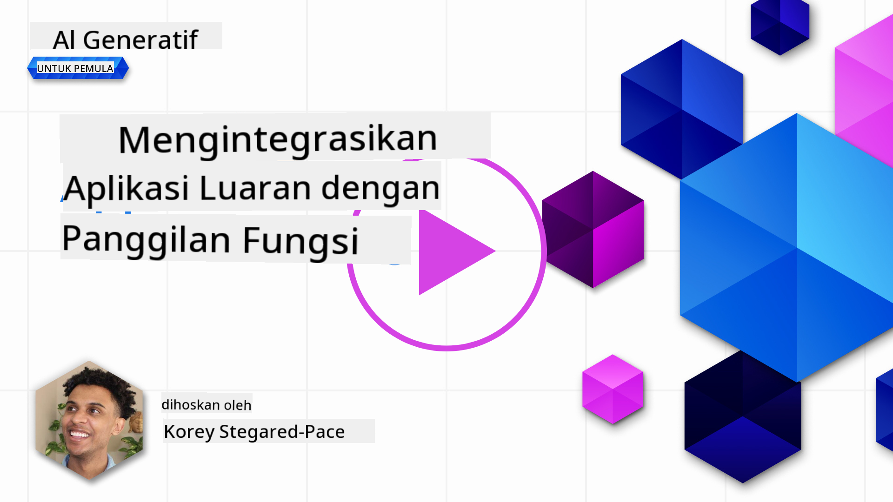
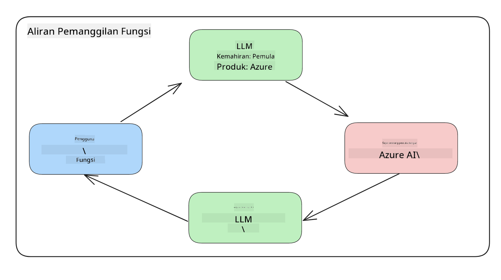
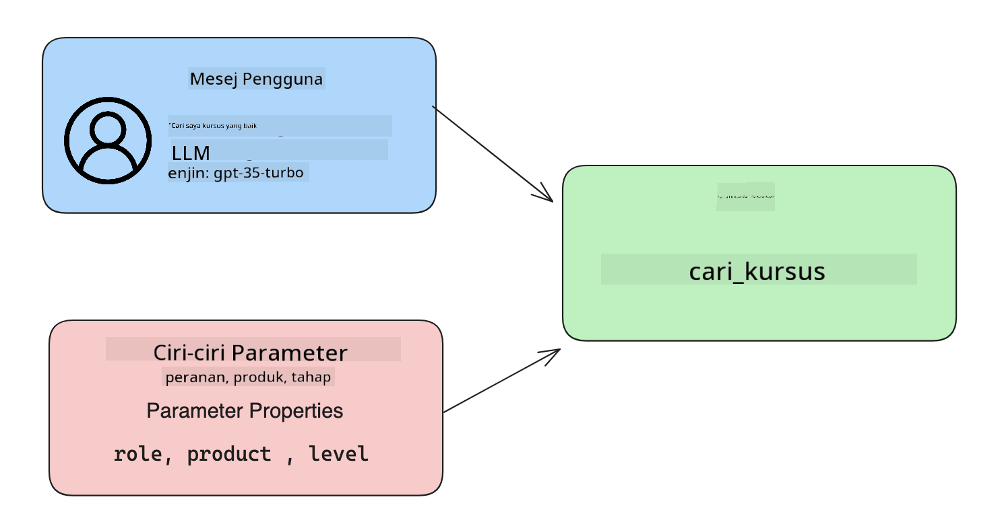

<!--
CO_OP_TRANSLATOR_METADATA:
{
  "original_hash": "f6f84f9ef2d066cd25850cab93580a50",
  "translation_date": "2025-10-17T20:52:52+00:00",
  "source_file": "11-integrating-with-function-calling/README.md",
  "language_code": "ms"
}
-->
# Mengintegrasikan dengan Panggilan Fungsi

[](https://youtu.be/DgUdCLX8qYQ?si=f1ouQU5HQx6F8Gl2)

Anda telah mempelajari banyak perkara dalam pelajaran sebelumnya. Namun, kita masih boleh memperbaiki lagi. Beberapa perkara yang boleh kita tangani adalah bagaimana kita boleh mendapatkan format respons yang lebih konsisten untuk memudahkan kerja dengan respons tersebut di peringkat seterusnya. Selain itu, kita mungkin ingin menambah data daripada sumber lain untuk memperkayakan lagi aplikasi kita.

Masalah yang disebutkan di atas adalah apa yang akan dibincangkan dalam bab ini.

## Pengenalan

Pelajaran ini akan merangkumi:

- Penjelasan tentang apa itu panggilan fungsi dan kegunaannya.
- Membuat panggilan fungsi menggunakan Azure OpenAI.
- Cara mengintegrasikan panggilan fungsi ke dalam aplikasi.

## Matlamat Pembelajaran

Pada akhir pelajaran ini, anda akan dapat:

- Menjelaskan tujuan menggunakan panggilan fungsi.
- Menyediakan Panggilan Fungsi menggunakan Azure OpenAI Service.
- Merancang panggilan fungsi yang berkesan untuk kegunaan aplikasi anda.

## Senario: Meningkatkan chatbot kita dengan fungsi

Untuk pelajaran ini, kita ingin membina ciri untuk permulaan pendidikan kita yang membolehkan pengguna menggunakan chatbot untuk mencari kursus teknikal. Kami akan mencadangkan kursus yang sesuai dengan tahap kemahiran mereka, peranan semasa dan teknologi yang diminati.

Untuk melengkapkan senario ini, kita akan menggunakan gabungan:

- `Azure OpenAI` untuk mencipta pengalaman sembang bagi pengguna.
- `Microsoft Learn Catalog API` untuk membantu pengguna mencari kursus berdasarkan permintaan mereka.
- `Panggilan Fungsi` untuk mengambil pertanyaan pengguna dan menghantarnya ke fungsi untuk membuat permintaan API.

Untuk memulakan, mari kita lihat mengapa kita ingin menggunakan panggilan fungsi pada awalnya:

## Mengapa Panggilan Fungsi

Sebelum panggilan fungsi, respons daripada LLM adalah tidak berstruktur dan tidak konsisten. Pembangun perlu menulis kod pengesahan yang kompleks untuk memastikan mereka dapat menangani setiap variasi respons. Pengguna tidak dapat mendapatkan jawapan seperti "Apakah cuaca semasa di Stockholm?". Ini kerana model terhad kepada masa data dilatih.

Panggilan Fungsi adalah ciri Azure OpenAI Service untuk mengatasi batasan berikut:

- **Format respons yang konsisten**. Jika kita dapat mengawal format respons dengan lebih baik, kita boleh mengintegrasikan respons dengan lebih mudah ke sistem lain.
- **Data luaran**. Keupayaan untuk menggunakan data daripada sumber lain dalam aplikasi dalam konteks sembang.

## Mengilustrasikan masalah melalui senario

> Kami mengesyorkan anda menggunakan [notebook yang disertakan](./python/aoai-assignment.ipynb?WT.mc_id=academic-105485-koreyst) jika anda ingin menjalankan senario di bawah. Anda juga boleh membaca sahaja kerana kami cuba menggambarkan masalah di mana fungsi boleh membantu menyelesaikan masalah tersebut.

Mari kita lihat contoh yang menggambarkan masalah format respons:

Katakan kita ingin mencipta pangkalan data maklumat pelajar supaya kita boleh mencadangkan kursus yang sesuai kepada mereka. Di bawah ini terdapat dua deskripsi pelajar yang sangat serupa dalam data yang mereka kandungi.

1. Buat sambungan ke sumber Azure OpenAI kita:

   ```python
   import os
   import json
   from openai import AzureOpenAI
   from dotenv import load_dotenv
   load_dotenv()

   client = AzureOpenAI(
   api_key=os.environ['AZURE_OPENAI_API_KEY'],  # this is also the default, it can be omitted
   api_version = "2023-07-01-preview"
   )

   deployment=os.environ['AZURE_OPENAI_DEPLOYMENT']
   ```

   Di bawah ini adalah kod Python untuk mengkonfigurasi sambungan kita ke Azure OpenAI di mana kita menetapkan `api_type`, `api_base`, `api_version` dan `api_key`.

1. Membuat dua deskripsi pelajar menggunakan pemboleh ubah `student_1_description` dan `student_2_description`.

   ```python
   student_1_description="Emily Johnson is a sophomore majoring in computer science at Duke University. She has a 3.7 GPA. Emily is an active member of the university's Chess Club and Debate Team. She hopes to pursue a career in software engineering after graduating."

   student_2_description = "Michael Lee is a sophomore majoring in computer science at Stanford University. He has a 3.8 GPA. Michael is known for his programming skills and is an active member of the university's Robotics Club. He hopes to pursue a career in artificial intelligence after finishing his studies."
   ```

   Kita ingin menghantar deskripsi pelajar di atas kepada LLM untuk menganalisis data. Data ini kemudian boleh digunakan dalam aplikasi kita dan dihantar ke API atau disimpan dalam pangkalan data.

1. Mari kita buat dua arahan yang sama di mana kita mengarahkan LLM tentang maklumat yang kita minati:

   ```python
   prompt1 = f'''
   Please extract the following information from the given text and return it as a JSON object:

   name
   major
   school
   grades
   club

   This is the body of text to extract the information from:
   {student_1_description}
   '''

   prompt2 = f'''
   Please extract the following information from the given text and return it as a JSON object:

   name
   major
   school
   grades
   club

   This is the body of text to extract the information from:
   {student_2_description}
   '''
   ```

   Arahan di atas mengarahkan LLM untuk mengekstrak maklumat dan mengembalikan respons dalam format JSON.

1. Selepas menyediakan arahan dan sambungan ke Azure OpenAI, kita kini akan menghantar arahan kepada LLM dengan menggunakan `openai.ChatCompletion`. Kita menyimpan arahan dalam pemboleh ubah `messages` dan menetapkan peranan kepada `user`. Ini untuk meniru mesej daripada pengguna yang ditulis kepada chatbot.

   ```python
   # response from prompt one
   openai_response1 = client.chat.completions.create(
   model=deployment,
   messages = [{'role': 'user', 'content': prompt1}]
   )
   openai_response1.choices[0].message.content

   # response from prompt two
   openai_response2 = client.chat.completions.create(
   model=deployment,
   messages = [{'role': 'user', 'content': prompt2}]
   )
   openai_response2.choices[0].message.content
   ```

Kini kita boleh menghantar kedua-dua permintaan kepada LLM dan memeriksa respons yang kita terima dengan mencarinya seperti ini `openai_response1['choices'][0]['message']['content']`.

1. Akhir sekali, kita boleh menukar respons kepada format JSON dengan memanggil `json.loads`:

   ```python
   # Loading the response as a JSON object
   json_response1 = json.loads(openai_response1.choices[0].message.content)
   json_response1
   ```

   Respons 1:

   ```json
   {
     "name": "Emily Johnson",
     "major": "computer science",
     "school": "Duke University",
     "grades": "3.7",
     "club": "Chess Club"
   }
   ```

   Respons 2:

   ```json
   {
     "name": "Michael Lee",
     "major": "computer science",
     "school": "Stanford University",
     "grades": "3.8 GPA",
     "club": "Robotics Club"
   }
   ```

   Walaupun arahan adalah sama dan deskripsi adalah serupa, kita melihat nilai sifat `Grades` diformatkan secara berbeza, seperti kadang-kadang kita mendapat format `3.7` atau `3.7 GPA` sebagai contoh.

   Hasil ini adalah kerana LLM mengambil data tidak berstruktur dalam bentuk arahan bertulis dan juga mengembalikan data tidak berstruktur. Kita perlu mempunyai format berstruktur supaya kita tahu apa yang diharapkan apabila menyimpan atau menggunakan data ini.

Jadi bagaimana kita menyelesaikan masalah format ini? Dengan menggunakan panggilan fungsi, kita boleh memastikan bahawa kita menerima data berstruktur kembali. Apabila menggunakan panggilan fungsi, LLM sebenarnya tidak memanggil atau menjalankan sebarang fungsi. Sebaliknya, kita mencipta struktur untuk LLM ikuti untuk responsnya. Kita kemudian menggunakan respons berstruktur tersebut untuk mengetahui fungsi apa yang perlu dijalankan dalam aplikasi kita.



Kita kemudian boleh mengambil apa yang dikembalikan daripada fungsi dan menghantarnya kembali kepada LLM. LLM kemudian akan memberikan respons menggunakan bahasa semula jadi untuk menjawab pertanyaan pengguna.

## Kegunaan Panggilan Fungsi

Terdapat banyak kegunaan di mana panggilan fungsi boleh meningkatkan aplikasi anda seperti:

- **Memanggil Alat Luaran**. Chatbot sangat bagus untuk memberikan jawapan kepada soalan daripada pengguna. Dengan menggunakan panggilan fungsi, chatbot boleh menggunakan mesej daripada pengguna untuk melengkapkan tugas tertentu. Sebagai contoh, seorang pelajar boleh meminta chatbot untuk "Hantar e-mel kepada pengajar saya mengatakan saya memerlukan lebih banyak bantuan dengan subjek ini". Ini boleh membuat panggilan fungsi kepada `send_email(to: string, body: string)`.

- **Mencipta Permintaan API atau Pangkalan Data**. Pengguna boleh mencari maklumat menggunakan bahasa semula jadi yang ditukar kepada permintaan yang diformatkan atau permintaan API. Contohnya, seorang guru boleh meminta "Siapa pelajar yang telah menyelesaikan tugasan terakhir" yang boleh memanggil fungsi bernama `get_completed(student_name: string, assignment: int, current_status: string)`.

- **Mencipta Data Berstruktur**. Pengguna boleh mengambil blok teks atau CSV dan menggunakan LLM untuk mengekstrak maklumat penting daripadanya. Sebagai contoh, seorang pelajar boleh menukar artikel Wikipedia tentang perjanjian damai untuk mencipta kad imbas AI. Ini boleh dilakukan dengan menggunakan fungsi yang dipanggil `get_important_facts(agreement_name: string, date_signed: string, parties_involved: list)`.

## Membuat Panggilan Fungsi Pertama Anda

Proses membuat panggilan fungsi merangkumi 3 langkah utama:

1. **Memanggil** API Chat Completions dengan senarai fungsi anda dan mesej pengguna.
2. **Membaca** respons model untuk melaksanakan tindakan iaitu menjalankan fungsi atau panggilan API.
3. **Membuat** panggilan lain kepada API Chat Completions dengan respons daripada fungsi anda untuk menggunakan maklumat tersebut bagi mencipta respons kepada pengguna.



### Langkah 1 - mencipta mesej

Langkah pertama adalah mencipta mesej pengguna. Ini boleh ditetapkan secara dinamik dengan mengambil nilai input teks atau anda boleh menetapkan nilai di sini. Jika ini kali pertama anda bekerja dengan API Chat Completions, kita perlu menentukan `role` dan `content` mesej.

`Role` boleh sama ada `system` (mencipta peraturan), `assistant` (model) atau `user` (pengguna akhir). Untuk panggilan fungsi, kita akan menetapkannya sebagai `user` dan contoh soalan.

```python
messages= [ {"role": "user", "content": "Find me a good course for a beginner student to learn Azure."} ]
```

Dengan menetapkan peranan yang berbeza, ia menjelaskan kepada LLM sama ada sistem yang bercakap atau pengguna, yang membantu membina sejarah perbualan yang boleh dibina oleh LLM.

### Langkah 2 - mencipta fungsi

Seterusnya, kita akan menentukan fungsi dan parameter fungsi tersebut. Kita akan menggunakan satu fungsi sahaja di sini yang dipanggil `search_courses` tetapi anda boleh mencipta beberapa fungsi.

> **Penting** : Fungsi dimasukkan dalam mesej sistem kepada LLM dan akan termasuk dalam jumlah token yang tersedia.

Di bawah ini, kita mencipta fungsi sebagai array item. Setiap item adalah fungsi dan mempunyai sifat `name`, `description` dan `parameters`:

```python
functions = [
   {
      "name":"search_courses",
      "description":"Retrieves courses from the search index based on the parameters provided",
      "parameters":{
         "type":"object",
         "properties":{
            "role":{
               "type":"string",
               "description":"The role of the learner (i.e. developer, data scientist, student, etc.)"
            },
            "product":{
               "type":"string",
               "description":"The product that the lesson is covering (i.e. Azure, Power BI, etc.)"
            },
            "level":{
               "type":"string",
               "description":"The level of experience the learner has prior to taking the course (i.e. beginner, intermediate, advanced)"
            }
         },
         "required":[
            "role"
         ]
      }
   }
]
```

Mari kita terangkan setiap contoh fungsi dengan lebih terperinci di bawah:

- `name` - Nama fungsi yang kita ingin panggil.
- `description` - Ini adalah deskripsi tentang bagaimana fungsi berfungsi. Di sini penting untuk menjadi spesifik dan jelas.
- `parameters` - Senarai nilai dan format yang kita ingin model hasilkan dalam responsnya. Array parameter terdiri daripada item di mana item tersebut mempunyai sifat berikut:
  1.  `type` - Jenis data yang akan disimpan dalam sifat.
  1.  `properties` - Senarai nilai spesifik yang akan digunakan oleh model untuk responsnya.
      1. `name` - Kunci adalah nama sifat yang akan digunakan oleh model dalam respons yang diformatkan, contohnya, `product`.
      1. `type` - Jenis data sifat ini, contohnya, `string`.
      1. `description` - Deskripsi sifat spesifik.

Terdapat juga sifat pilihan `required` - sifat yang diperlukan untuk panggilan fungsi diselesaikan.

### Langkah 3 - Membuat panggilan fungsi

Selepas menentukan fungsi, kita kini perlu memasukkannya dalam panggilan kepada API Chat Completion. Kita melakukan ini dengan menambah `functions` kepada permintaan. Dalam kes ini `functions=functions`.

Terdapat juga pilihan untuk menetapkan `function_call` kepada `auto`. Ini bermaksud kita akan membiarkan LLM memutuskan fungsi mana yang harus dipanggil berdasarkan mesej pengguna daripada menetapkannya sendiri.

Berikut adalah kod di bawah di mana kita memanggil `ChatCompletion.create`, perhatikan bagaimana kita menetapkan `functions=functions` dan `function_call="auto"` dan dengan itu memberikan LLM pilihan bila untuk memanggil fungsi yang kita sediakan:

```python
response = client.chat.completions.create(model=deployment,
                                        messages=messages,
                                        functions=functions,
                                        function_call="auto")

print(response.choices[0].message)
```

Respons yang datang sekarang kelihatan seperti ini:

```json
{
  "role": "assistant",
  "function_call": {
    "name": "search_courses",
    "arguments": "{\n  \"role\": \"student\",\n  \"product\": \"Azure\",\n  \"level\": \"beginner\"\n}"
  }
}
```

Di sini kita dapat melihat bagaimana fungsi `search_courses` dipanggil dan dengan argumen apa, seperti yang disenaraikan dalam sifat `arguments` dalam respons JSON.

Kesimpulannya, LLM dapat mencari data untuk memenuhi argumen fungsi kerana ia mengekstraknya daripada nilai yang diberikan kepada parameter `messages` dalam panggilan penyelesaian sembang. Di bawah ini adalah peringatan tentang nilai `messages`:

```python
messages= [ {"role": "user", "content": "Find me a good course for a beginner student to learn Azure."} ]
```

Seperti yang anda lihat, `student`, `Azure` dan `beginner` diekstrak daripada `messages` dan ditetapkan sebagai input kepada fungsi. Menggunakan fungsi dengan cara ini adalah cara yang hebat untuk mengekstrak maklumat daripada arahan tetapi juga untuk menyediakan struktur kepada LLM dan mempunyai fungsi yang boleh digunakan semula.

Seterusnya, kita perlu melihat bagaimana kita boleh menggunakan ini dalam aplikasi kita.

## Mengintegrasikan Panggilan Fungsi ke dalam Aplikasi

Selepas kita menguji respons yang diformatkan daripada LLM, kita kini boleh mengintegrasikan ini ke dalam aplikasi kita.

### Mengurus aliran

Untuk mengintegrasikan ini ke dalam aplikasi kita, mari kita ambil langkah berikut:

1. Pertama, mari kita buat panggilan kepada perkhidmatan OpenAI dan simpan mesej dalam pemboleh ubah yang dipanggil `response_message`.

   ```python
   response_message = response.choices[0].message
   ```

1. Sekarang kita akan menentukan fungsi yang akan memanggil Microsoft Learn API untuk mendapatkan senarai kursus:

   ```python
   import requests

   def search_courses(role, product, level):
     url = "https://learn.microsoft.com/api/catalog/"
     params = {
        "role": role,
        "product": product,
        "level": level
     }
     response = requests.get(url, params=params)
     modules = response.json()["modules"]
     results = []
     for module in modules[:5]:
        title = module["title"]
        url = module["url"]
        results.append({"title": title, "url": url})
     return str(results)
   ```

   Perhatikan bagaimana kita kini mencipta fungsi Python sebenar yang memetakan kepada nama fungsi yang diperkenalkan dalam pemboleh ubah `functions`. Kita juga membuat panggilan API luaran sebenar untuk mendapatkan data yang kita perlukan. Dalam kes ini, kita menggunakan Microsoft Learn API untuk mencari modul latihan.

Baiklah, jadi kita mencipta pemboleh ubah `functions` dan fungsi Python yang sepadan, bagaimana kita memberitahu LLM bagaimana memetakan kedua-duanya supaya fungsi Python kita dipanggil?

1. Untuk melihat sama ada kita perlu memanggil fungsi Python, kita perlu melihat respons LLM dan melihat sama ada `function_call` adalah sebahagian daripadanya dan memanggil fungsi yang ditunjukkan. Berikut adalah cara anda boleh membuat semakan yang disebutkan di bawah:

   ```python
   # Check if the model wants to call a function
   if response_message.function_call.name:
    print("Recommended Function call:")
    print(response_message.function_call.name)
    print()

    # Call the function.
    function_name = response_message.function_call.name

    available_functions = {
            "search_courses": search_courses,
    }
    function_to_call = available_functions[function_name]

    function_args = json.loads(response_message.function_call.arguments)
    function_response = function_to_call(**function_args)

    print("Output of function call:")
    print(function_response)
    print(type(function_response))


    # Add the assistant response and function response to the messages
    messages.append( # adding assistant response to messages
        {
            "role": response_message.role,
            "function_call": {
                "name": function_name,
                "arguments": response_message.function_call.arguments,
            },
            "content": None
        }
    )
    messages.append( # adding function response to messages
        {
            "role": "function",
            "name": function_name,
            "content":function_response,
        }
    )
   ```

   Tiga baris ini memastikan kita mengekstrak nama fungsi, argumen dan membuat panggilan:

   ```python
   function_to_call = available_functions[function_name]

   function_args = json.loads(response_message.function_call.arguments)
   function_response = function_to_call(**function_args)
   ```

   Di bawah adalah output daripada menjalankan kod kita:

   **Output**

   ```Recommended Function call:
   {
     "name": "search_courses",
     "arguments": "{\n  \"role\": \"student\",\n  \"product\": \"Azure\",\n  \"level\": \"beginner\"\n}"
   }

   Output of function call:
   [{'title': 'Describe concepts of cryptography', 'url': 'https://learn.microsoft.com/training/modules/describe-concepts-of-cryptography/?
   WT.mc_id=api_CatalogApi'}, {'title': 'Introduction to audio classification with TensorFlow', 'url': 'https://learn.microsoft.com/en-
   us/training/modules/intro-audio-classification-tensorflow/?WT.mc_id=api_CatalogApi'}, {'title': 'Design a Performant Data Model in Azure SQL
   Database with Azure Data Studio', 'url': 'https://learn.microsoft.com/training/modules/design-a-data-model-with-ads/?
   WT.mc_id=api_CatalogApi'}, {'title': 'Getting started with the Microsoft Cloud Adoption Framework for Azure', 'url':
   'https://learn.microsoft.com/training/modules/cloud-adoption-framework-getting-started/?WT.mc_id=api_CatalogApi'}, {'title': 'Set up the
   Rust development environment', 'url': 'https://learn.microsoft.com/training/modules/rust-set-up-environment/?WT.mc_id=api_CatalogApi'}]
   <class 'str'>
   ```

1. Sekarang kita akan menghantar mesej yang dikemas kini, `messages` kepada LLM supaya kita boleh menerima respons bahasa semula jadi dan bukannya respons JSON yang diformatkan API.

   ```python
   print("Messages in next request:")
   print(messages)
   print()

   second_response = client.chat.completions.create(
      messages=messages,
      model=deployment,
      function_call="auto",
      functions=functions,
      temperature=0
         )  # get a new response from GPT where it can see the function response


   print(second_response.choices[0].message)
   ```

   **Output**

   ```python
   {
     "role": "assistant",
     "content": "I found some good courses for beginner students to learn Azure:\n\n1. [Describe concepts of cryptography] (https://learn.microsoft.com/training/modules/describe-concepts-of-cryptography/?WT.mc_id=api_CatalogApi)\n2. [Introduction to audio classification with TensorFlow](https://learn.microsoft.com/training/modules/intro-audio-classification-tensorflow/?WT.mc_id=api_CatalogApi)\n3. [Design a Performant Data Model in Azure SQL Database with Azure Data Studio](https://learn.microsoft.com/training/modules/design-a-data-model-with-ads/?WT.mc_id=api_CatalogApi)\n4. [Getting started with the Microsoft Cloud Adoption Framework for Azure](https://learn.microsoft.com/training/modules/cloud-adoption-framework-getting-started/?WT.mc_id=api_CatalogApi)\n5. [Set up the Rust development environment](https://learn.microsoft.com/training/modules/rust-set-up-environment/?WT.mc_id=api_CatalogApi)\n\nYou can click on the links to access the courses."
   }

   ```

## Tugasan

Untuk meneruskan pembelajaran anda tentang Azure OpenAI Function Calling, anda boleh membina:

- Lebih banyak parameter fungsi yang mungkin membantu pelajar mencari lebih banyak kursus.
- Cipta panggilan fungsi lain yang mengambil lebih banyak maklumat daripada pelajar seperti bahasa asal mereka.
- Buat pengendalian ralat apabila panggilan fungsi dan/atau panggilan API tidak mengembalikan sebarang kursus yang sesuai

Petunjuk: Rujuk halaman [dokumentasi rujukan API Learn](https://learn.microsoft.com/training/support/catalog-api-developer-reference?WT.mc_id=academic-105485-koreyst) untuk melihat bagaimana dan di mana data ini tersedia.

## Kerja Hebat! Teruskan Perjalanan

Selepas menyelesaikan pelajaran ini, lihat koleksi [Pembelajaran AI Generatif](https://aka.ms/genai-collection?WT.mc_id=academic-105485-koreyst) kami untuk terus meningkatkan pengetahuan anda tentang AI Generatif!

Pergi ke Pelajaran 12, di mana kita akan melihat bagaimana untuk [mereka bentuk UX untuk aplikasi AI](../12-designing-ux-for-ai-applications/README.md?WT.mc_id=academic-105485-koreyst)!

---

**Penafian**:  
Dokumen ini telah diterjemahkan menggunakan perkhidmatan terjemahan AI [Co-op Translator](https://github.com/Azure/co-op-translator). Walaupun kami berusaha untuk ketepatan, sila ambil perhatian bahawa terjemahan automatik mungkin mengandungi kesilapan atau ketidaktepatan. Dokumen asal dalam bahasa asalnya harus dianggap sebagai sumber yang berwibawa. Untuk maklumat kritikal, terjemahan manusia profesional adalah disyorkan. Kami tidak bertanggungjawab atas sebarang salah faham atau salah tafsir yang timbul daripada penggunaan terjemahan ini.