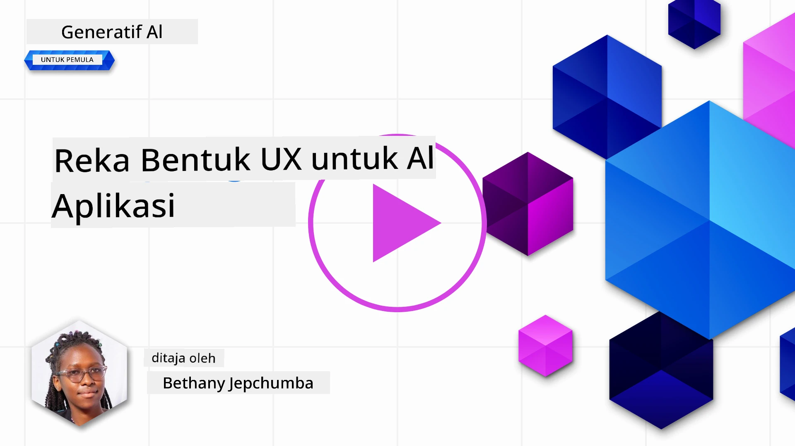
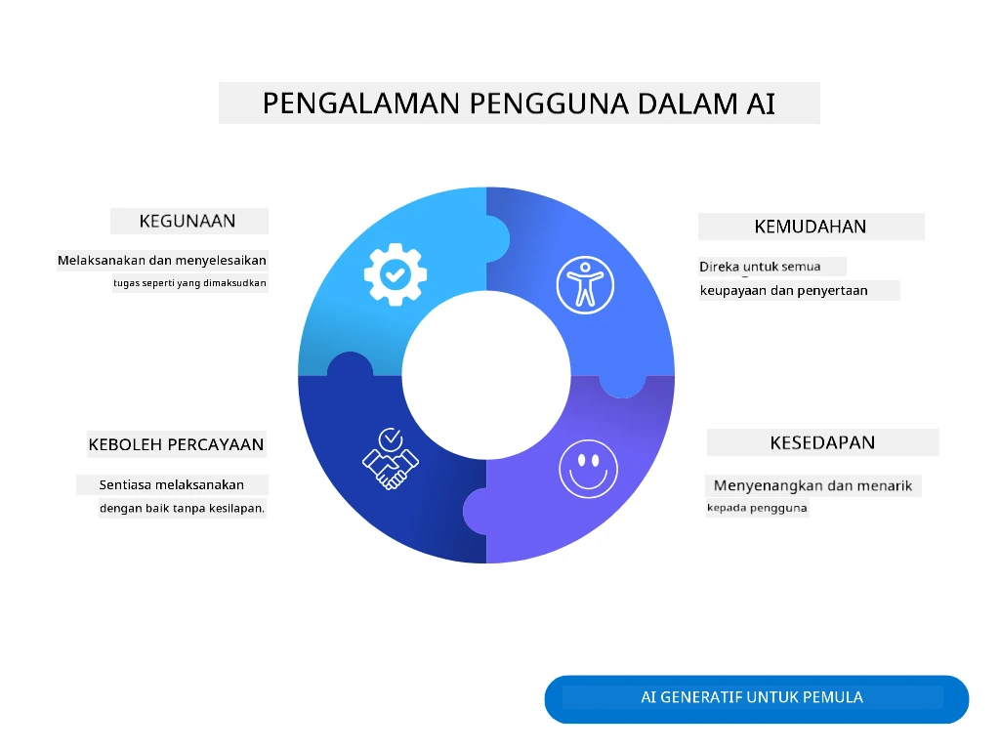
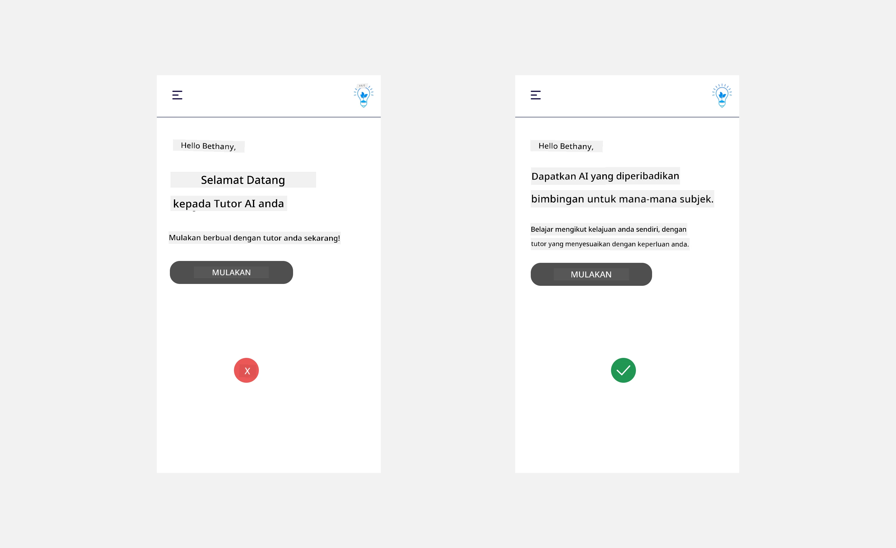
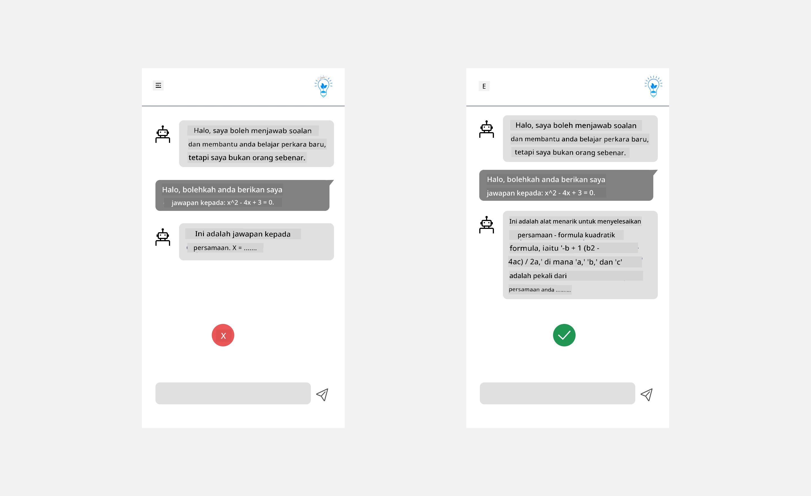
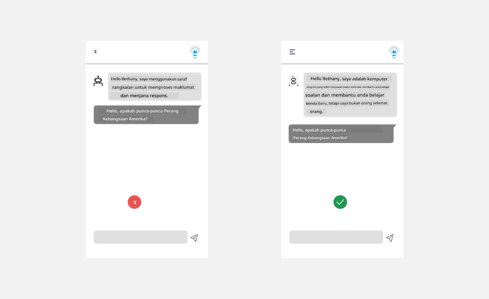
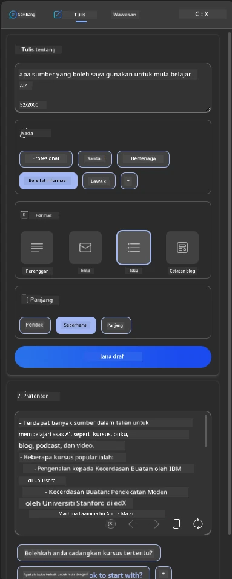
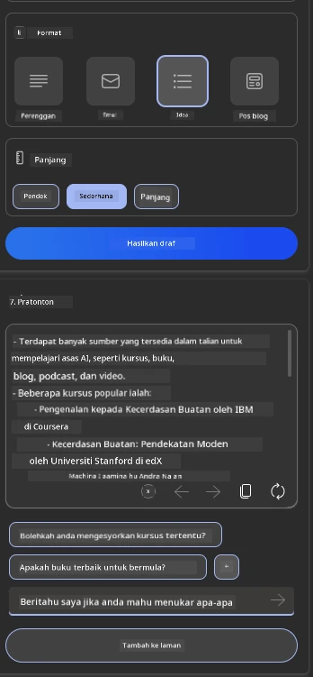
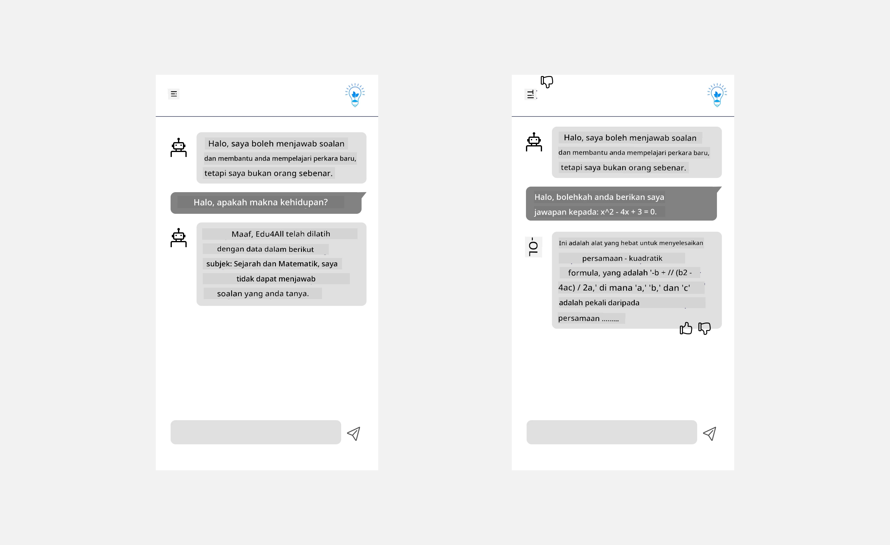

# Mereka Bentuk UX untuk Aplikasi AI

> _(Klik gambar di atas untuk menonton video pelajaran ini)_

Pengalaman pengguna adalah aspek yang sangat penting dalam membina aplikasi. Pengguna perlu dapat menggunakan aplikasi anda dengan cara yang berkesan untuk melaksanakan tugas. Menjadi cekap adalah satu perkara tetapi anda juga perlu mereka bentuk aplikasi supaya ia boleh digunakan oleh semua orang, agar menjadi _boleh diakses_. Bab ini akan menumpukan pada bidang ini supaya diharapkan anda dapat mereka bentuk aplikasi yang boleh dan ingin digunakan oleh orang ramai.

## Pengenalan

Pengalaman pengguna adalah bagaimana pengguna berinteraksi dan menggunakan produk atau perkhidmatan tertentu sama ada sistem, alat, atau reka bentuk. Apabila membangunkan aplikasi AI, pembangun tidak hanya fokus untuk memastikan pengalaman pengguna berkesan tetapi juga beretika. Dalam pelajaran ini, kami membincangkan bagaimana membina aplikasi Kecerdasan Buatan (AI) yang memenuhi keperluan pengguna.

Pelajaran ini akan meliputi bidang berikut:

- Pengenalan kepada Pengalaman Pengguna dan Memahami Keperluan Pengguna
- Mereka Bentuk Aplikasi AI untuk Kepercayaan dan Ketelusan
- Mereka Bentuk Aplikasi AI untuk Kerjasama dan Maklum Balas

## Matlamat Pembelajaran

Selepas mengikuti pelajaran ini, anda akan dapat:

- Memahami bagaimana membina aplikasi AI yang memenuhi keperluan pengguna.
- Mereka bentuk aplikasi AI yang menggalakkan kepercayaan dan kerjasama.

### Prasyarat

Luangkan masa dan baca lebih lanjut tentang [pengalaman pengguna dan pemikiran reka bentuk.](https://learn.microsoft.com/training/modules/ux-design?WT.mc_id=academic-105485-koreyst)

## Pengenalan kepada Pengalaman Pengguna dan Memahami Keperluan Pengguna

Dalam startup pendidikan khayalan kami, kami mempunyai dua pengguna utama, guru dan pelajar. Setiap dua pengguna mempunyai keperluan unik mereka sendiri. Reka bentuk berpusatkan pengguna mengutamakan pengguna memastikan produk relevan dan memberi manfaat kepada mereka yang ditujukan.

Aplikasi harus **berguna, boleh dipercayai, boleh diakses dan menyenangkan** untuk memberikan pengalaman pengguna yang baik.

### Kebolehgunaan

Menjadi berguna bermakna aplikasi mempunyai fungsi yang sesuai dengan tujuan yang dimaksudkan, seperti mengautomasikan proses penandaan atau menghasilkan flashcard untuk ulang kaji. Aplikasi yang mengautomasikan proses penandaan harus dapat menetapkan skor kepada kerja pelajar dengan tepat dan cekap berdasarkan kriteria yang telah ditetapkan. Sama juga, aplikasi yang menghasilkan flashcard ulang kaji harus dapat mencipta soalan yang relevan dan pelbagai berdasarkan data yang ada.

### Kebolehpercayaan

Menjadi boleh dipercayai bermakna aplikasi dapat melaksanakan tugasnya secara konsisten dan tanpa kesilapan. Walau bagaimanapun, AI sama seperti manusia tidak sempurna dan boleh terdedah kepada kesilapan. Aplikasi mungkin menghadapi ralat atau situasi tidak dijangka yang memerlukan campur tangan atau pembetulan manusia. Bagaimana anda mengendalikan ralat? Dalam seksyen terakhir pelajaran ini, kita akan membincangkan bagaimana sistem dan aplikasi AI direka untuk kerjasama dan maklum balas.

### Kebolehcapaian

Menjadi boleh diakses bermakna meluaskan pengalaman pengguna kepada pengguna dengan pelbagai keupayaan, termasuk mereka yang mempunyai kecacatan, memastikan tiada siapa yang terkecuali. Dengan mengikuti garis panduan dan prinsip kebolehcapaian, penyelesaian AI menjadi lebih inklusif, boleh digunakan dan memberi manfaat kepada semua pengguna.

### Menyenangkan

Menjadi menyenangkan bermakna aplikasi itu menyeronokkan untuk digunakan. Pengalaman pengguna yang menarik boleh memberi kesan positif kepada pengguna menggalakkan mereka kembali ke aplikasi dan meningkatkan hasil perniagaan.

Tidak semua cabaran boleh diselesaikan dengan AI. AI hadir untuk menambah pengalaman pengguna anda, sama ada mengautomasikan tugas manual, atau memperibadikan pengalaman pengguna.

## Mereka Bentuk Aplikasi AI untuk Kepercayaan dan Ketelusan

Membina kepercayaan adalah kritikal apabila mereka bentuk aplikasi AI. Kepercayaan memastikan pengguna yakin bahawa aplikasi akan menyelesaikan kerja, memberikan hasil secara konsisten dan hasil tersebut adalah apa yang pengguna perlukan. Risiko dalam bidang ini adalah ketidakpercayaan dan keterlaluan mempercayai. Ketidakpercayaan berlaku apabila pengguna mempunyai sedikit atau tiada kepercayaan terhadap sistem AI, ini menyebabkan pengguna menolak aplikasi anda. Keterlaluan mempercayai berlaku apabila pengguna terlalu menganggarkan kemampuan sistem AI, menyebabkan pengguna mempercayai sistem AI secara berlebihan. Sebagai contoh, sistem penandaan automatik dalam kes keterlaluan mempercayai mungkin menyebabkan guru tidak memeriksa beberapa kertas untuk memastikan sistem penandaan berfungsi dengan baik. Ini boleh mengakibatkan gred yang tidak adil atau tidak tepat untuk pelajar, atau peluang maklum balas dan penambahbaikan terlepas.

Dua cara untuk memastikan kepercayaan diletakkan betul-betul di tengah reka bentuk adalah kebolehnya diterangkan dan kawalan.

### Kebolehnya Diterangkan

Apabila AI membantu membuat keputusan seperti menyampaikan pengetahuan kepada generasi akan datang, adalah penting untuk guru dan ibu bapa memahami bagaimana keputusan AI dibuat. Ini adalah kebolehnya diterangkan - memahami bagaimana aplikasi AI membuat keputusan. Mereka bentuk untuk kebolehnya diterangkan termasuk menambah perincian yang menonjolkan bagaimana AI sampai kepada output. Penonton mesti sedar bahawa output dijana oleh AI dan bukan manusia. Sebagai contoh, daripada berkata "Mulakan berbual dengan tutor anda sekarang" katakan "Gunakan tutor AI yang menyesuaikan diri dengan keperluan anda dan membantu anda belajar mengikut kadar anda."

Contoh lain adalah bagaimana AI menggunakan data pengguna dan peribadi. Sebagai contoh, pengguna dengan persona pelajar mungkin mempunyai batasan berdasarkan persona mereka. AI mungkin tidak dapat mendedahkan jawapan kepada soalan tetapi mungkin membantu membimbing pengguna untuk memikirkan bagaimana mereka boleh menyelesaikan masalah.

Satu lagi bahagian utama kebolehnya diterangkan adalah mempermudah penjelasan. Pelajar dan guru mungkin bukan pakar AI, oleh itu penjelasan tentang apa yang aplikasi boleh atau tidak boleh lakukan harus dipermudahkan dan mudah difahami.

### Kawalan

AI generatif mencipta kerjasama antara AI dan pengguna, di mana contohnya pengguna boleh mengubah suai arahan untuk hasil yang berbeza. Selain itu, setelah output dijana, pengguna harus dapat mengubah suai hasil memberi mereka rasa kawalan. Sebagai contoh, ketika menggunakan Microsoft Copilot (dahulu Bing Chat), anda boleh menyesuaikan arahan anda berdasarkan format, nada dan panjang. Selain itu, anda boleh menambah perubahan pada output anda dan mengubah suai output seperti yang ditunjukkan di bawah:

Ciri lain dalam Microsoft Copilot yang membolehkan pengguna mengawal aplikasi adalah kebolehan untuk memilih untuk sertai dan memilih untuk keluar dari data yang digunakan AI. Untuk aplikasi sekolah, pelajar mungkin mahu menggunakan nota mereka serta sumber guru sebagai bahan ulang kaji.

> Apabila mereka bentuk aplikasi AI, bertujuan adalah kunci untuk memastikan pengguna tidak mempercayai secara berlebihan menetapkan jangkaan yang tidak realistik bagi kemampuannya. Salah satu cara untuk melakukan ini adalah dengan mencipta geseran antara arahan dan hasil. Mengingatkan pengguna, bahawa ini adalah AI dan bukan manusia biasa

## Mereka Bentuk Aplikasi AI untuk Kerjasama dan Maklum Balas

Seperti yang disebutkan sebelum ini, AI generatif mencipta kerjasama antara pengguna dan AI. Kebanyakan interaksi adalah dengan pengguna memasukkan arahan dan AI menjana output. Bagaimana jika output itu salah? Bagaimana aplikasi mengendalikan ralat jika ia berlaku? Adakah AI menyalahkan pengguna atau mengambil masa untuk menjelaskan ralat?

Aplikasi AI harus dibina untuk menerima dan memberi maklum balas. Ini bukan sahaja membantu sistem AI memperbaiki tetapi juga membina kepercayaan dengan pengguna. Gelung maklum balas harus dimasukkan dalam reka bentuk, contohnya boleh jadi jempol naik atau turun pada output.

Cara lain untuk mengendalikan ini adalah untuk berkomunikasi dengan jelas keupayaan dan batasan sistem. Apabila pengguna membuat kesilapan meminta sesuatu di luar keupayaan AI, harus ada cara untuk mengendalikannya, seperti yang ditunjukkan di bawah.

Ralat sistem adalah biasa dengan aplikasi di mana pengguna mungkin memerlukan bantuan dengan maklumat di luar skop AI atau aplikasi mungkin mempunyai had berapa banyak soalan/subjek yang boleh pengguna buat ringkasan. Sebagai contoh, aplikasi AI yang dilatih dengan data pada subjek terhad contohnya, Sejarah dan Matematik mungkin tidak dapat mengendalikan soalan tentang Geografi. Untuk mengurangkan ini, sistem AI boleh memberi respon seperti: "Maaf, produk kami telah dilatih dengan data dalam subjek berikut....., saya tidak dapat menjawab soalan yang anda tanyakan."

Aplikasi AI tidak sempurna, oleh itu, mereka pasti melakukan kesilapan. Apabila mereka bentuk aplikasi anda, anda harus memastikan anda mencipta ruang untuk maklum balas dari pengguna dan pengendalian ralat dengan cara yang mudah dan mudah diterangkan.

## Tugasan

Ambil mana-mana aplikasi AI yang anda telah bina setakat ini, pertimbangkan melaksanakan langkah di bawah dalam aplikasi anda:

- **Menyenangkan:** Pertimbangkan bagaimana anda boleh membuat aplikasi anda lebih menyenangkan. Adakah anda menambah penjelasan di mana-mana sahaja? Adakah anda menggalakkan pengguna untuk meneroka? Bagaimana anda menyusun mesej ralat anda?

- **Kebolehgunaan:** Membangun aplikasi web. Pastikan aplikasi anda boleh dinavigasi oleh kedua-dua tetikus dan papan kekunci.

- **Kepercayaan dan ketelusan:** Jangan mempercayai AI sepenuhnya dan outputnya, pertimbangkan bagaimana anda akan menambah manusia dalam proses untuk mengesahkan output. Juga, pertimbangkan dan laksanakan cara lain untuk mencapai kepercayaan dan ketelusan.

- **Kawalan:** Beri pengguna kawalan data yang mereka berikan kepada aplikasi. Laksanakan cara pengguna boleh memilih untuk sertai dan memilih untuk keluar dari pengumpulan data dalam aplikasi AI.

<!-- ## [Post-lecture quiz](../../../12-designing-ux-for-ai-applications/quiz-url) -->

## Teruskan Pembelajaran Anda!

Selepas melengkapkan pelajaran ini, semak koleksi [Pembelajaran AI Generatif](https://aka.ms/genai-collection?WT.mc_id=academic-105485-koreyst) kami untuk terus meningkatkan pengetahuan AI Generatif anda!

Teruskan ke Pelajaran 13, di mana kita akan melihat bagaimana untuk [mengamankan aplikasi AI](../13-securing-ai-applications/README.md?WT.mc_id=academic-105485-koreyst)!

---

<!-- CO-OP TRANSLATOR DISCLAIMER START -->
**Penafian**:
Dokumen ini telah diterjemahkan menggunakan perkhidmatan terjemahan AI [Co-op Translator](https://github.com/Azure/co-op-translator). Walaupun kami berusaha untuk ketepatan, sila ambil maklum bahawa terjemahan automatik mungkin mengandungi kesilapan atau ketidaktepatan. Dokumen asal dalam bahasa asalnya harus dianggap sebagai sumber yang sahih. Untuk maklumat penting, terjemahan oleh manusia profesional adalah disyorkan. Kami tidak bertanggungjawab terhadap sebarang salah faham atau salah tafsir yang timbul daripada penggunaan terjemahan ini.
<!-- CO-OP TRANSLATOR DISCLAIMER END -->