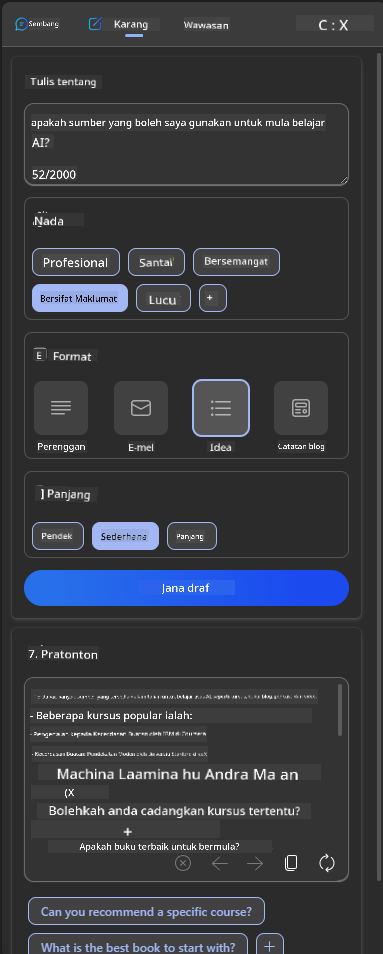

<!--
CO_OP_TRANSLATOR_METADATA:
{
  "original_hash": "ec385b41ee50579025d50cc03bfb3a25",
  "translation_date": "2025-07-09T15:01:51+00:00",
  "source_file": "12-designing-ux-for-ai-applications/README.md",
  "language_code": "ms"
}
-->
# Mereka Bentuk UX untuk Aplikasi AI

> _(Klik imej di atas untuk menonton video pelajaran ini)_

Pengalaman pengguna adalah aspek yang sangat penting dalam membina aplikasi. Pengguna perlu dapat menggunakan aplikasi anda dengan cara yang cekap untuk melaksanakan tugasan. Menjadi cekap adalah satu perkara, tetapi anda juga perlu mereka bentuk aplikasi supaya ia boleh digunakan oleh semua orang, agar ia _boleh diakses_. Bab ini akan memberi tumpuan kepada bidang ini supaya anda dapat mereka bentuk aplikasi yang orang boleh dan mahu gunakan.

## Pengenalan

Pengalaman pengguna adalah bagaimana seseorang pengguna berinteraksi dan menggunakan produk atau perkhidmatan tertentu sama ada sistem, alat, atau reka bentuk. Apabila membangunkan aplikasi AI, pembangun bukan sahaja memberi tumpuan untuk memastikan pengalaman pengguna berkesan tetapi juga beretika. Dalam pelajaran ini, kita akan membincangkan cara membina aplikasi Kecerdasan Buatan (AI) yang memenuhi keperluan pengguna.

Pelajaran ini akan merangkumi bidang berikut:

- Pengenalan kepada Pengalaman Pengguna dan Memahami Keperluan Pengguna  
- Mereka Bentuk Aplikasi AI untuk Kepercayaan dan Ketelusan  
- Mereka Bentuk Aplikasi AI untuk Kerjasama dan Maklum Balas  

## Matlamat Pembelajaran

Selepas mengikuti pelajaran ini, anda akan dapat:

- Memahami cara membina aplikasi AI yang memenuhi keperluan pengguna.  
- Mereka bentuk aplikasi AI yang menggalakkan kepercayaan dan kerjasama.  

### Prasyarat

Luangkan masa dan baca lebih lanjut tentang [pengalaman pengguna dan pemikiran reka bentuk.](https://learn.microsoft.com/training/modules/ux-design?WT.mc_id=academic-105485-koreyst)

## Pengenalan kepada Pengalaman Pengguna dan Memahami Keperluan Pengguna

Dalam syarikat permulaan pendidikan rekaan kami, terdapat dua pengguna utama, guru dan pelajar. Setiap daripada dua pengguna ini mempunyai keperluan unik. Reka bentuk berpusatkan pengguna mengutamakan pengguna dengan memastikan produk relevan dan memberi manfaat kepada mereka yang menjadi sasaran.

Aplikasi haruslah **berguna, boleh dipercayai, boleh diakses dan menyenangkan** untuk memberikan pengalaman pengguna yang baik.

### Kebolehgunaan

Berguna bermaksud aplikasi mempunyai fungsi yang sesuai dengan tujuan yang dimaksudkan, seperti mengautomasikan proses penilaian atau menjana kad imbasan untuk ulang kaji. Aplikasi yang mengautomasikan proses penilaian harus dapat memberikan skor dengan tepat dan cekap berdasarkan kriteria yang telah ditetapkan. Begitu juga, aplikasi yang menjana kad imbasan ulang kaji harus dapat mencipta soalan yang relevan dan pelbagai berdasarkan data yang ada.

### Kebolehpercayaan

Boleh dipercayai bermaksud aplikasi dapat melaksanakan tugasan secara konsisten dan tanpa kesilapan. Namun, AI seperti manusia tidak sempurna dan mungkin terdedah kepada kesilapan. Aplikasi mungkin menghadapi ralat atau situasi tidak dijangka yang memerlukan campur tangan atau pembetulan manusia. Bagaimana anda mengendalikan kesilapan? Dalam bahagian terakhir pelajaran ini, kita akan membincangkan bagaimana sistem dan aplikasi AI direka untuk kerjasama dan maklum balas.

### Kebolehcapaian

Boleh diakses bermaksud memperluaskan pengalaman pengguna kepada pengguna dengan pelbagai keupayaan, termasuk mereka yang mempunyai kecacatan, memastikan tiada siapa yang tercicir. Dengan mengikuti garis panduan dan prinsip kebolehcapaian, penyelesaian AI menjadi lebih inklusif, boleh digunakan, dan memberi manfaat kepada semua pengguna.

### Menyenangkan

Menyenangkan bermaksud aplikasi itu menyeronokkan untuk digunakan. Pengalaman pengguna yang menarik boleh memberi kesan positif kepada pengguna, menggalakkan mereka untuk kembali menggunakan aplikasi dan meningkatkan pendapatan perniagaan.

Tidak semua cabaran boleh diselesaikan dengan AI. AI hadir untuk meningkatkan pengalaman pengguna anda, sama ada mengautomasikan tugasan manual, atau mempersonalisasikan pengalaman pengguna.

## Mereka Bentuk Aplikasi AI untuk Kepercayaan dan Ketelusan

Membina kepercayaan adalah penting apabila mereka bentuk aplikasi AI. Kepercayaan memastikan pengguna yakin bahawa aplikasi akan menyelesaikan tugasan, memberikan hasil secara konsisten dan hasil tersebut adalah apa yang pengguna perlukan. Risiko dalam bidang ini adalah ketidakpercayaan dan kepercayaan berlebihan. Ketidakpercayaan berlaku apabila pengguna mempunyai sedikit atau tiada kepercayaan terhadap sistem AI, ini menyebabkan pengguna menolak aplikasi anda. Kepercayaan berlebihan berlaku apabila pengguna terlebih anggap keupayaan sistem AI, menyebabkan pengguna terlalu mempercayai sistem AI. Contohnya, sistem penilaian automatik dalam kes kepercayaan berlebihan mungkin menyebabkan guru tidak menyemak beberapa kertas untuk memastikan sistem penilaian berfungsi dengan baik. Ini boleh mengakibatkan markah yang tidak adil atau tidak tepat untuk pelajar, atau peluang maklum balas dan penambahbaikan terlepas.

Dua cara untuk memastikan kepercayaan diletakkan tepat di tengah reka bentuk adalah kebolehjelasan dan kawalan.

### Kebolehjelasan

Apabila AI membantu membuat keputusan seperti menyampaikan ilmu kepada generasi akan datang, adalah penting bagi guru dan ibu bapa memahami bagaimana keputusan AI dibuat. Ini dipanggil kebolehjelasan - memahami bagaimana aplikasi AI membuat keputusan. Mereka bentuk untuk kebolehjelasan termasuk menambah butiran contoh apa yang aplikasi AI boleh lakukan. Contohnya, daripada "Mulakan dengan guru AI", sistem boleh menggunakan: "Ringkaskan nota anda untuk ulang kaji yang lebih mudah menggunakan AI."

Contoh lain adalah bagaimana AI menggunakan data pengguna dan peribadi. Contohnya, pengguna dengan persona pelajar mungkin mempunyai had berdasarkan persona mereka. AI mungkin tidak dapat mendedahkan jawapan kepada soalan tetapi boleh membantu membimbing pengguna berfikir bagaimana mereka boleh menyelesaikan masalah.

Satu lagi bahagian penting kebolehjelasan adalah mempermudahkan penjelasan. Pelajar dan guru mungkin bukan pakar AI, oleh itu penjelasan tentang apa yang aplikasi boleh atau tidak boleh lakukan harus dipermudahkan dan mudah difahami.

### Kawalan

Generative AI mewujudkan kerjasama antara AI dan pengguna, di mana contohnya pengguna boleh mengubah suai arahan untuk hasil yang berbeza. Selain itu, setelah output dijana, pengguna harus dapat mengubah suai hasil tersebut memberikan mereka rasa kawalan. Contohnya, apabila menggunakan Bing, anda boleh menyesuaikan arahan berdasarkan format, nada dan panjang. Selain itu, anda boleh menambah perubahan pada output dan mengubah output seperti yang ditunjukkan di bawah:

Satu lagi ciri dalam Bing yang membolehkan pengguna mengawal aplikasi adalah keupayaan untuk memilih untuk menyertai atau tidak menyertai pengumpulan data yang digunakan oleh AI. Untuk aplikasi sekolah, pelajar mungkin mahu menggunakan nota mereka serta sumber guru sebagai bahan ulang kaji.

> Apabila mereka bentuk aplikasi AI, niat adalah kunci untuk memastikan pengguna tidak terlalu mempercayai dengan menetapkan jangkaan yang tidak realistik terhadap keupayaannya. Salah satu cara untuk melakukan ini adalah dengan mewujudkan halangan antara arahan dan hasil. Mengingatkan pengguna, bahawa ini adalah AI dan bukan manusia biasa.

## Mereka Bentuk Aplikasi AI untuk Kerjasama dan Maklum Balas

Seperti yang disebutkan sebelum ini, generative AI mewujudkan kerjasama antara pengguna dan AI. Kebanyakan interaksi adalah dengan pengguna memasukkan arahan dan AI menjana output. Bagaimana jika output itu salah? Bagaimana aplikasi mengendalikan kesilapan jika ia berlaku? Adakah AI menyalahkan pengguna atau mengambil masa untuk menerangkan kesilapan?

Aplikasi AI harus dibina untuk menerima dan memberi maklum balas. Ini bukan sahaja membantu sistem AI memperbaiki diri tetapi juga membina kepercayaan dengan pengguna. Gelung maklum balas harus dimasukkan dalam reka bentuk, contohnya boleh berupa isyarat ibu jari naik atau turun pada output.

Satu lagi cara untuk mengendalikan ini adalah dengan berkomunikasi dengan jelas tentang keupayaan dan had sistem. Apabila pengguna membuat kesilapan dengan meminta sesuatu di luar keupayaan AI, harus ada cara untuk mengendalikannya, seperti yang ditunjukkan di bawah.

Ralat sistem adalah perkara biasa dalam aplikasi di mana pengguna mungkin memerlukan bantuan dengan maklumat di luar skop AI atau aplikasi mungkin mempunyai had berapa banyak soalan/subjek yang boleh dijana ringkasan. Contohnya, aplikasi AI yang dilatih dengan data pada subjek terhad seperti Sejarah dan Matematik mungkin tidak dapat mengendalikan soalan berkaitan Geografi. Untuk mengurangkan ini, sistem AI boleh memberi respons seperti: "Maaf, produk kami telah dilatih dengan data dalam subjek berikut....., saya tidak dapat menjawab soalan yang anda ajukan."

Aplikasi AI tidak sempurna, oleh itu, ia pasti akan membuat kesilapan. Apabila mereka bentuk aplikasi anda, pastikan anda menyediakan ruang untuk maklum balas daripada pengguna dan pengendalian kesilapan dengan cara yang mudah dan mudah difahami.

## Tugasan

Ambil mana-mana aplikasi AI yang telah anda bina setakat ini, pertimbangkan untuk melaksanakan langkah-langkah berikut dalam aplikasi anda:

- **Menyenangkan:** Fikirkan bagaimana anda boleh menjadikan aplikasi anda lebih menyenangkan. Adakah anda menambah penjelasan di mana-mana? Adakah anda menggalakkan pengguna untuk meneroka? Bagaimana anda menyusun mesej ralat anda?

- **Kebolehgunaan:** Membangunkan aplikasi web. Pastikan aplikasi anda boleh dinavigasi menggunakan tetikus dan papan kekunci.

- **Kepercayaan dan ketelusan:** Jangan percayai AI sepenuhnya dan outputnya, fikirkan bagaimana anda boleh menambah elemen manusia dalam proses untuk mengesahkan output. Juga, pertimbangkan dan laksanakan cara lain untuk mencapai kepercayaan dan ketelusan.

- **Kawalan:** Berikan pengguna kawalan ke atas data yang mereka berikan kepada aplikasi. Laksanakan cara pengguna boleh memilih untuk menyertai atau tidak menyertai pengumpulan data dalam aplikasi AI.

## Teruskan Pembelajaran Anda!

Selepas menamatkan pelajaran ini, lihat koleksi [Pembelajaran Generative AI](https://aka.ms/genai-collection?WT.mc_id=academic-105485-koreyst) kami untuk terus meningkatkan pengetahuan Generative AI anda!

Teruskan ke Pelajaran 13, di mana kita akan melihat cara [mengamankan aplikasi AI](../13-securing-ai-applications/README.md?WT.mc_id=academic-105485-koreyst)!

**Penafian**:  
Dokumen ini telah diterjemahkan menggunakan perkhidmatan terjemahan AI [Co-op Translator](https://github.com/Azure/co-op-translator). Walaupun kami berusaha untuk ketepatan, sila ambil maklum bahawa terjemahan automatik mungkin mengandungi kesilapan atau ketidaktepatan. Dokumen asal dalam bahasa asalnya harus dianggap sebagai sumber yang sahih. Untuk maklumat penting, terjemahan profesional oleh manusia adalah disyorkan. Kami tidak bertanggungjawab atas sebarang salah faham atau salah tafsir yang timbul daripada penggunaan terjemahan ini.