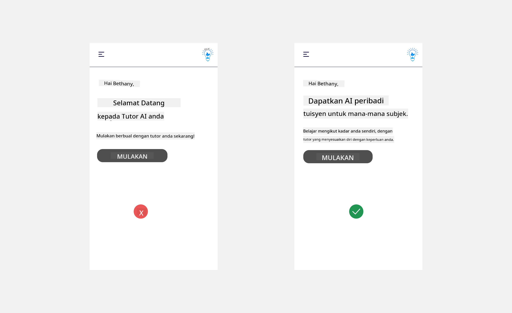
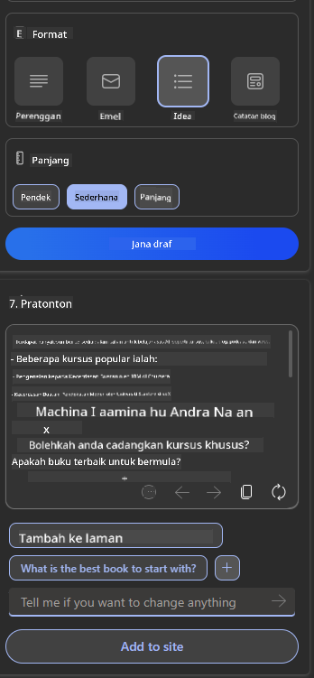

<!--
CO_OP_TRANSLATOR_METADATA:
{
  "original_hash": "747668e4c53d067369f06e9ec2e6313e",
  "translation_date": "2025-08-26T18:28:39+00:00",
  "source_file": "12-designing-ux-for-ai-applications/README.md",
  "language_code": "ms"
}
-->
# Mereka Bentuk UX untuk Aplikasi AI

> _(Klik imej di atas untuk menonton video pelajaran ini)_

Pengalaman pengguna adalah aspek yang sangat penting dalam membina aplikasi. Pengguna perlu dapat menggunakan aplikasi anda dengan cara yang cekap untuk melaksanakan tugasan. Menjadi cekap adalah satu perkara tetapi anda juga perlu mereka bentuk aplikasi supaya ia boleh digunakan oleh semua orang, untuk menjadikannya _mudah diakses_. Bab ini akan memberi tumpuan kepada aspek ini supaya anda akhirnya dapat mereka bentuk aplikasi yang orang boleh dan mahu gunakan.

## Pengenalan

Pengalaman pengguna ialah bagaimana seseorang berinteraksi dan menggunakan sesuatu produk atau perkhidmatan sama ada sistem, alat, atau reka bentuk. Apabila membangunkan aplikasi AI, pembangun bukan sahaja menumpukan pada memastikan pengalaman pengguna itu berkesan tetapi juga beretika. Dalam pelajaran ini, kita akan membincangkan cara membina aplikasi Kecerdasan Buatan (AI) yang memenuhi keperluan pengguna.

Pelajaran ini akan merangkumi perkara berikut:

- Pengenalan kepada Pengalaman Pengguna dan Memahami Keperluan Pengguna
- Mereka Bentuk Aplikasi AI untuk Kepercayaan dan Ketelusan
- Mereka Bentuk Aplikasi AI untuk Kerjasama dan Maklum Balas

## Objektif Pembelajaran

Selepas mengikuti pelajaran ini, anda akan dapat:

- Memahami cara membina aplikasi AI yang memenuhi keperluan pengguna.
- Mereka bentuk aplikasi AI yang menggalakkan kepercayaan dan kerjasama.

### Prasyarat

Luangkan masa untuk membaca lebih lanjut tentang [pengalaman pengguna dan pemikiran reka bentuk.](https://learn.microsoft.com/training/modules/ux-design?WT.mc_id=academic-105485-koreyst)

## Pengenalan kepada Pengalaman Pengguna dan Memahami Keperluan Pengguna

Dalam syarikat permulaan pendidikan rekaan kita, kita mempunyai dua pengguna utama, guru dan pelajar. Setiap pengguna ini mempunyai keperluan yang unik. Reka bentuk berpusatkan pengguna mengutamakan pengguna dengan memastikan produk itu relevan dan bermanfaat untuk mereka yang disasarkan.

Aplikasi tersebut harus **berguna, boleh dipercayai, mudah diakses dan menyenangkan** untuk memberikan pengalaman pengguna yang baik.

### Kebolehgunaan

Berguna bermaksud aplikasi mempunyai fungsi yang sepadan dengan tujuan asalnya, seperti mengautomasikan proses pemarkahan atau menjana kad imbas untuk ulang kaji. Aplikasi yang mengautomasikan proses pemarkahan harus dapat memberikan markah dengan tepat dan cekap kepada kerja pelajar berdasarkan kriteria yang telah ditetapkan. Begitu juga, aplikasi yang menjana kad imbas ulang kaji harus dapat mencipta soalan yang relevan dan pelbagai berdasarkan datanya.

### Kebolehpercayaan

Boleh dipercayai bermaksud aplikasi boleh melaksanakan tugasnya secara konsisten dan tanpa ralat. Namun, AI seperti manusia juga tidak sempurna dan mungkin terdedah kepada kesilapan. Aplikasi mungkin menghadapi ralat atau situasi tidak dijangka yang memerlukan campur tangan atau pembetulan manusia. Bagaimana anda menangani ralat? Dalam bahagian terakhir pelajaran ini, kita akan bincangkan bagaimana sistem dan aplikasi AI direka untuk kerjasama dan maklum balas.

### Kebolehcapaian

Mudah diakses bermaksud memperluaskan pengalaman pengguna kepada pengguna dengan pelbagai keupayaan, termasuk mereka yang kurang upaya, supaya tiada siapa yang tercicir. Dengan mengikuti garis panduan dan prinsip kebolehcapaian, penyelesaian AI menjadi lebih inklusif, boleh digunakan, dan bermanfaat untuk semua pengguna.

### Menyenangkan

Menyenangkan bermaksud aplikasi itu seronok digunakan. Pengalaman pengguna yang menarik boleh memberi kesan positif kepada pengguna, menggalakkan mereka kembali menggunakan aplikasi dan meningkatkan hasil perniagaan.

Bukan semua cabaran boleh diselesaikan dengan AI. AI digunakan untuk menambah baik pengalaman pengguna anda, sama ada mengautomasikan tugas manual, atau memperibadikan pengalaman pengguna.

## Mereka Bentuk Aplikasi AI untuk Kepercayaan dan Ketelusan

Membina kepercayaan adalah sangat penting apabila mereka bentuk aplikasi AI. Kepercayaan memastikan pengguna yakin bahawa aplikasi akan menyelesaikan tugasan, memberikan hasil secara konsisten dan hasilnya adalah seperti yang diperlukan pengguna. Risiko dalam aspek ini ialah kurang percaya atau terlalu percaya. Kurang percaya berlaku apabila pengguna tidak yakin atau langsung tidak percaya pada sistem AI, ini menyebabkan pengguna menolak aplikasi anda. Terlalu percaya berlaku apabila pengguna melebih-lebihkan keupayaan sistem AI, menyebabkan mereka terlalu mempercayai AI. Sebagai contoh, sistem pemarkahan automatik jika terlalu dipercayai mungkin menyebabkan guru tidak menyemak semula beberapa kertas untuk memastikan sistem pemarkahan berfungsi dengan baik. Ini boleh menyebabkan markah yang tidak adil atau tidak tepat untuk pelajar, atau peluang maklum balas dan penambahbaikan terlepas.

Dua cara untuk memastikan kepercayaan diletakkan di tengah-tengah reka bentuk ialah kebolehjelasan dan kawalan.

### Kebolehjelasan

Apabila AI membantu membuat keputusan seperti menyampaikan ilmu kepada generasi akan datang, adalah penting untuk guru dan ibu bapa memahami bagaimana keputusan AI dibuat. Inilah kebolehjelasan - memahami bagaimana aplikasi AI membuat keputusan. Mereka bentuk untuk kebolehjelasan termasuk menambah butiran yang menunjukkan bagaimana AI sampai kepada hasil. Pengguna mesti sedar bahawa hasil itu dijana oleh AI dan bukannya manusia. Sebagai contoh, daripada berkata "Mula berbual dengan tutor anda sekarang" katakan "Gunakan tutor AI yang menyesuaikan diri dengan keperluan anda dan membantu anda belajar mengikut rentak anda."

Contoh lain ialah bagaimana AI menggunakan data pengguna dan peribadi. Sebagai contoh, seorang pengguna dengan persona pelajar mungkin mempunyai had berdasarkan persona mereka. AI mungkin tidak dapat mendedahkan jawapan kepada soalan tetapi boleh membantu membimbing pengguna untuk berfikir bagaimana mereka boleh menyelesaikan masalah.

Satu lagi bahagian penting dalam kebolehjelasan ialah memudahkan penjelasan. Pelajar dan guru mungkin bukan pakar AI, jadi penjelasan tentang apa yang aplikasi boleh atau tidak boleh lakukan harus dipermudahkan dan mudah difahami.

### Kawalan

AI generatif mewujudkan kerjasama antara AI dan pengguna, di mana contohnya pengguna boleh mengubah suai arahan untuk mendapatkan hasil yang berbeza. Selain itu, selepas hasil dijana, pengguna harus boleh mengubah hasil tersebut untuk memberi mereka rasa kawalan. Sebagai contoh, apabila menggunakan Bing, anda boleh menyesuaikan arahan anda berdasarkan format, nada dan panjang. Anda juga boleh menambah perubahan pada hasil dan mengubah hasil seperti yang ditunjukkan di bawah:

Satu lagi ciri dalam Bing yang membolehkan pengguna mengawal aplikasi ialah keupayaan untuk memilih sama ada mahu membenarkan atau tidak data digunakan oleh AI. Untuk aplikasi sekolah, pelajar mungkin mahu menggunakan nota mereka serta sumber guru sebagai bahan ulang kaji.

> Apabila mereka bentuk aplikasi AI, niat yang jelas adalah penting untuk memastikan pengguna tidak terlalu mempercayai AI sehingga meletakkan jangkaan yang tidak realistik terhadap keupayaannya. Salah satu cara ialah dengan mewujudkan sedikit 'geseran' antara arahan dan hasil. Ingatkan pengguna bahawa ini adalah AI dan bukannya manusia.

## Mereka Bentuk Aplikasi AI untuk Kerjasama dan Maklum Balas

Seperti yang dinyatakan sebelum ini, AI generatif mewujudkan kerjasama antara pengguna dan AI. Kebanyakan interaksi berlaku apabila pengguna memasukkan arahan dan AI menjana hasil. Bagaimana jika hasilnya tidak betul? Bagaimana aplikasi mengendalikan ralat jika ia berlaku? Adakah AI menyalahkan pengguna atau mengambil masa untuk menerangkan ralat?

Aplikasi AI harus dibina untuk menerima dan memberi maklum balas. Ini bukan sahaja membantu sistem AI bertambah baik tetapi juga membina kepercayaan dengan pengguna. Satu kitaran maklum balas harus dimasukkan dalam reka bentuk, contohnya boleh jadi butang suka atau tidak suka pada hasil.

Satu lagi cara untuk mengendalikan perkara ini ialah dengan berkomunikasi dengan jelas tentang keupayaan dan had sistem. Apabila pengguna membuat kesilapan dengan meminta sesuatu di luar keupayaan AI, harus ada cara untuk mengendalikannya, seperti yang ditunjukkan di bawah.

Ralat sistem adalah perkara biasa dalam aplikasi di mana pengguna mungkin memerlukan bantuan dengan maklumat di luar skop AI atau aplikasi mungkin mempunyai had berapa banyak soalan/subjek yang boleh dijana ringkasan oleh pengguna. Sebagai contoh, aplikasi AI yang dilatih dengan data pada subjek terhad seperti Sejarah dan Matematik mungkin tidak dapat mengendalikan soalan berkaitan Geografi. Untuk mengatasinya, sistem AI boleh memberikan respons seperti: "Maaf, produk kami hanya dilatih dengan data dalam subjek berikut....., saya tidak dapat menjawab soalan yang anda tanya."

Aplikasi AI tidak sempurna, jadi ia pasti akan melakukan kesilapan. Apabila mereka bentuk aplikasi anda, pastikan anda menyediakan ruang untuk maklum balas daripada pengguna dan pengendalian ralat dengan cara yang mudah dan senang dijelaskan.

## Tugasan

Ambil mana-mana aplikasi AI yang anda telah bina setakat ini, pertimbangkan untuk melaksanakan langkah-langkah di bawah dalam aplikasi anda:

- **Menyenangkan:** Fikirkan bagaimana anda boleh menjadikan aplikasi anda lebih menyenangkan. Adakah anda menambah penjelasan di mana-mana? Adakah anda menggalakkan pengguna untuk meneroka? Bagaimana anda menyusun ayat mesej ralat anda?

- **Kebolehgunaan:** Jika membina aplikasi web, pastikan aplikasi anda boleh dinavigasi menggunakan tetikus dan papan kekunci.

- **Kepercayaan dan ketelusan:** Jangan terlalu mempercayai AI dan hasilnya, fikirkan bagaimana anda boleh menambah manusia dalam proses untuk mengesahkan hasil. Juga, pertimbangkan dan laksanakan cara lain untuk mencapai kepercayaan dan ketelusan.

- **Kawalan:** Beri pengguna kawalan ke atas data yang mereka berikan kepada aplikasi. Laksanakan cara untuk pengguna memilih sama ada mahu membenarkan atau tidak pengumpulan data dalam aplikasi AI.

## Teruskan Pembelajaran Anda!

Selepas melengkapkan pelajaran ini, lihat [koleksi Pembelajaran AI Generatif](https://aka.ms/genai-collection?WT.mc_id=academic-105485-koreyst) untuk terus meningkatkan pengetahuan AI Generatif anda!

Teruskan ke Pelajaran 13, di mana kita akan melihat bagaimana untuk [melindungi aplikasi AI](../13-securing-ai-applications/README.md?WT.mc_id=academic-105485-koreyst)!

---

**Penafian**:  
Dokumen ini telah diterjemahkan menggunakan perkhidmatan terjemahan AI [Co-op Translator](https://github.com/Azure/co-op-translator). Walaupun kami berusaha untuk ketepatan, sila ambil maklum bahawa terjemahan automatik mungkin mengandungi kesilapan atau ketidaktepatan. Dokumen asal dalam bahasa asalnya harus dianggap sebagai sumber yang berwibawa. Untuk maklumat kritikal, terjemahan manusia profesional adalah disyorkan. Kami tidak bertanggungjawab atas sebarang salah faham atau salah tafsir yang timbul daripada penggunaan terjemahan ini.