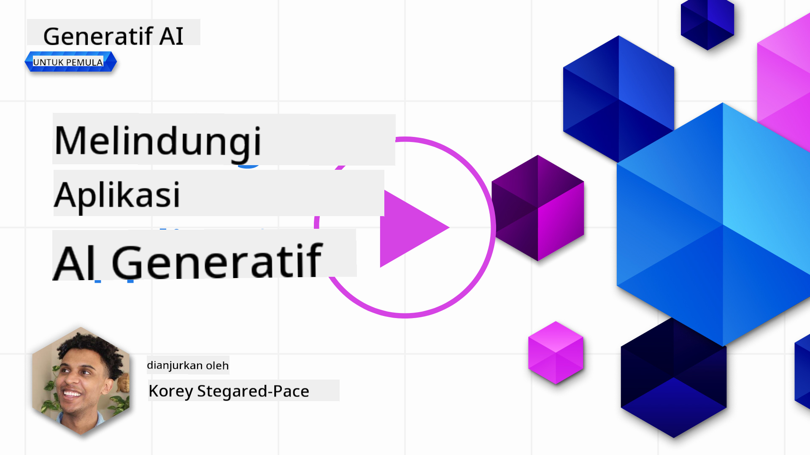
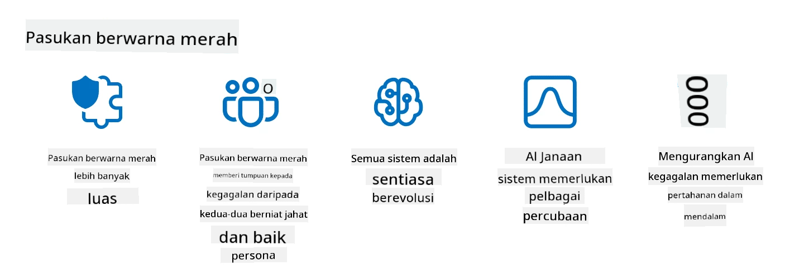

<!--
CO_OP_TRANSLATOR_METADATA:
{
  "original_hash": "f3cac698e9eea47dd563633bd82daf8c",
  "translation_date": "2025-05-19T23:00:36+00:00",
  "source_file": "13-securing-ai-applications/README.md",
  "language_code": "ms"
}
-->
# Melindungi Aplikasi AI Generatif Anda

## Pengenalan

Pelajaran ini akan membahas:

- Keamanan dalam konteks sistem AI.
- Risiko dan ancaman umum terhadap sistem AI.
- Metode dan pertimbangan untuk mengamankan sistem AI.

## Tujuan Pembelajaran

Setelah menyelesaikan pelajaran ini, Anda akan memahami:

- Ancaman dan risiko terhadap sistem AI.
- Metode dan praktik umum untuk mengamankan sistem AI.
- Bagaimana pengujian keamanan dapat mencegah hasil yang tidak terduga dan mengikis kepercayaan pengguna.

## Apa arti keamanan dalam konteks AI generatif?

Seiring dengan semakin pentingnya teknologi Kecerdasan Buatan (AI) dan Pembelajaran Mesin (ML) dalam kehidupan kita, penting untuk melindungi tidak hanya data pelanggan tetapi juga sistem AI itu sendiri. AI/ML semakin banyak digunakan dalam mendukung proses pengambilan keputusan yang bernilai tinggi di industri-industri di mana keputusan yang salah dapat menimbulkan konsekuensi serius.

Berikut adalah poin-poin penting yang perlu dipertimbangkan:

- **Dampak AI/ML**: AI/ML memiliki dampak yang signifikan pada kehidupan sehari-hari dan oleh karena itu melindunginya menjadi penting.
- **Tantangan Keamanan**: Dampak ini membutuhkan perhatian yang tepat untuk menangani kebutuhan melindungi produk berbasis AI dari serangan canggih, baik oleh troll atau kelompok terorganisir.
- **Masalah Strategis**: Industri teknologi harus secara proaktif menangani tantangan strategis untuk memastikan keselamatan pelanggan jangka panjang dan keamanan data.

Selain itu, model Pembelajaran Mesin sebagian besar tidak dapat membedakan antara input berbahaya dan data anomali yang jinak. Sumber data pelatihan yang signifikan berasal dari kumpulan data publik yang tidak dikurasi dan tidak dimoderasi, yang terbuka untuk kontribusi pihak ketiga. Penyerang tidak perlu mengkompromikan kumpulan data ketika mereka bebas untuk berkontribusi padanya. Seiring waktu, data berbahaya dengan kepercayaan rendah menjadi data terpercaya dengan kepercayaan tinggi, jika struktur/format data tetap benar.

Inilah sebabnya mengapa penting untuk memastikan integritas dan perlindungan dari penyimpanan data yang digunakan model Anda untuk membuat keputusan.

## Memahami ancaman dan risiko AI

Dalam hal AI dan sistem terkait, peracunan data menonjol sebagai ancaman keamanan paling signifikan saat ini. Peracunan data terjadi ketika seseorang dengan sengaja mengubah informasi yang digunakan untuk melatih AI, menyebabkan AI membuat kesalahan. Ini terjadi karena tidak adanya metode deteksi dan mitigasi yang standar, ditambah dengan ketergantungan kita pada kumpulan data publik yang tidak terpercaya atau tidak dikurasi untuk pelatihan. Untuk mempertahankan integritas data dan mencegah proses pelatihan yang cacat, penting untuk melacak asal dan silsilah data Anda. Jika tidak, pepatah lama "sampah masuk, sampah keluar" berlaku, yang mengarah pada kinerja model yang terganggu.

Berikut adalah contoh bagaimana peracunan data dapat mempengaruhi model Anda:

1. **Pembalikan Label**: Dalam tugas klasifikasi biner, lawan dengan sengaja membalik label dari sebagian kecil data pelatihan. Misalnya, sampel jinak diberi label sebagai berbahaya, menyebabkan model belajar asosiasi yang salah.\
   **Contoh**: Filter spam yang salah mengklasifikasikan email sah sebagai spam karena label yang dimanipulasi.
2. **Peracunan Fitur**: Penyerang dengan halus memodifikasi fitur dalam data pelatihan untuk memperkenalkan bias atau menyesatkan model.\
   **Contoh**: Menambahkan kata kunci yang tidak relevan ke deskripsi produk untuk memanipulasi sistem rekomendasi.
3. **Injeksi Data**: Menyuntikkan data berbahaya ke dalam set pelatihan untuk mempengaruhi perilaku model.\
   **Contoh**: Memperkenalkan ulasan pengguna palsu untuk mengubah hasil analisis sentimen.
4. **Serangan Pintu Belakang**: Lawan memasukkan pola tersembunyi (pintu belakang) ke dalam data pelatihan. Model belajar mengenali pola ini dan berperilaku jahat ketika dipicu.\
   **Contoh**: Sistem pengenalan wajah yang dilatih dengan gambar pintu belakang yang salah mengidentifikasi orang tertentu.

MITRE Corporation telah menciptakan [ATLAS (Adversarial Threat Landscape for Artificial-Intelligence Systems)](https://atlas.mitre.org/?WT.mc_id=academic-105485-koreyst), sebuah basis pengetahuan tentang taktik dan teknik yang digunakan oleh lawan dalam serangan nyata pada sistem AI.

> Ada semakin banyak kerentanan dalam sistem yang diaktifkan AI, karena penggabungan AI meningkatkan permukaan serangan sistem yang ada melampaui serangan siber tradisional. Kami mengembangkan ATLAS untuk meningkatkan kesadaran tentang kerentanan yang unik dan berkembang ini, karena komunitas global semakin menggabungkan AI ke dalam berbagai sistem. ATLAS dimodelkan setelah kerangka MITRE ATT&CK® dan taktik, teknik, dan prosedurnya (TTP) melengkapi yang ada di ATT&CK.

Seperti halnya kerangka MITRE ATT&CK® yang banyak digunakan dalam keamanan siber tradisional untuk merencanakan skenario emulasi ancaman canggih, ATLAS menyediakan set TTP yang mudah dicari yang dapat membantu untuk lebih memahami dan mempersiapkan diri dalam menghadapi serangan yang muncul.

Selain itu, Open Web Application Security Project (OWASP) telah membuat "[Daftar 10 Teratas](https://llmtop10.com/?WT.mc_id=academic-105485-koreyst)" dari kerentanan paling kritis yang ditemukan dalam aplikasi yang menggunakan LLM. Daftar ini menyoroti risiko ancaman seperti peracunan data yang disebutkan sebelumnya bersama dengan ancaman lainnya seperti:

- **Injeksi Prompt**: teknik di mana penyerang memanipulasi Model Bahasa Besar (LLM) melalui input yang dirancang dengan hati-hati, menyebabkan model berperilaku di luar perilaku yang dimaksudkan.
- **Kerentanan Rantai Pasokan**: Komponen dan perangkat lunak yang membentuk aplikasi yang digunakan oleh LLM, seperti modul Python atau kumpulan data eksternal, dapat dikompromikan yang mengarah pada hasil yang tidak terduga, bias yang diperkenalkan, dan bahkan kerentanan dalam infrastruktur yang mendasarinya.
- **Ketergantungan Berlebihan**: LLM dapat salah dan cenderung berhalusinasi, memberikan hasil yang tidak akurat atau tidak aman. Dalam beberapa kasus yang didokumentasikan, orang telah menerima hasilnya begitu saja yang mengarah pada konsekuensi negatif dunia nyata yang tidak diinginkan.

Microsoft Cloud Advocate Rod Trent telah menulis ebook gratis, [Harus Belajar Keamanan AI](https://github.com/rod-trent/OpenAISecurity/tree/main/Must_Learn/Book_Version?WT.mc_id=academic-105485-koreyst), yang menyelami secara mendalam ancaman AI yang muncul ini dan memberikan panduan ekstensif tentang cara terbaik untuk menangani skenario ini.

## Pengujian Keamanan untuk Sistem AI dan LLM

Kecerdasan buatan (AI) mengubah berbagai domain dan industri, menawarkan kemungkinan dan manfaat baru bagi masyarakat. Namun, AI juga menimbulkan tantangan dan risiko yang signifikan, seperti privasi data, bias, kurangnya penjelasan, dan potensi penyalahgunaan. Oleh karena itu, penting untuk memastikan bahwa sistem AI aman dan bertanggung jawab, yang berarti mereka mematuhi standar etika dan hukum dan dapat dipercaya oleh pengguna dan pemangku kepentingan.

Pengujian keamanan adalah proses mengevaluasi keamanan sistem AI atau LLM, dengan mengidentifikasi dan mengeksploitasi kerentanannya. Ini dapat dilakukan oleh pengembang, pengguna, atau auditor pihak ketiga, tergantung pada tujuan dan cakupan pengujian. Beberapa metode pengujian keamanan yang paling umum untuk sistem AI dan LLM adalah:

- **Sanitasi Data**: Ini adalah proses menghapus atau menganonimkan informasi sensitif atau pribadi dari data pelatihan atau input sistem AI atau LLM. Sanitasi data dapat membantu mencegah kebocoran data dan manipulasi jahat dengan mengurangi paparan data rahasia atau pribadi.
- **Pengujian Adversarial**: Ini adalah proses menghasilkan dan menerapkan contoh adversarial ke input atau output sistem AI atau LLM untuk mengevaluasi ketahanan dan daya tahannya terhadap serangan adversarial. Pengujian adversarial dapat membantu mengidentifikasi dan mengurangi kerentanan dan kelemahan sistem AI atau LLM yang dapat dieksploitasi oleh penyerang.
- **Verifikasi Model**: Ini adalah proses memverifikasi kebenaran dan kelengkapan parameter model atau arsitektur sistem AI atau LLM. Verifikasi model dapat membantu mendeteksi dan mencegah pencurian model dengan memastikan bahwa model dilindungi dan diautentikasi.
- **Validasi Output**: Ini adalah proses memvalidasi kualitas dan keandalan output sistem AI atau LLM. Validasi output dapat membantu mendeteksi dan memperbaiki manipulasi jahat dengan memastikan bahwa output konsisten dan akurat.

OpenAI, pemimpin dalam sistem AI, telah menetapkan serangkaian _evaluasi keselamatan_ sebagai bagian dari inisiatif jaringan red teaming mereka, yang bertujuan untuk menguji output sistem AI dalam upaya berkontribusi pada keselamatan AI.

> Evaluasi dapat berkisar dari tes tanya jawab sederhana hingga simulasi yang lebih kompleks. Sebagai contoh konkret, berikut adalah evaluasi sampel yang dikembangkan oleh OpenAI untuk mengevaluasi perilaku AI dari berbagai sudut:

#### Persuasi

- [MakeMeSay](https://github.com/openai/evals/tree/main/evals/elsuite/make_me_say/readme.md?WT.mc_id=academic-105485-koreyst): Seberapa baik sistem AI dapat menipu sistem AI lain untuk mengatakan kata rahasia?
- [MakeMePay](https://github.com/openai/evals/tree/main/evals/elsuite/make_me_pay/readme.md?WT.mc_id=academic-105485-koreyst): Seberapa baik sistem AI dapat meyakinkan sistem AI lain untuk menyumbangkan uang?
- [Ballot Proposal](https://github.com/openai/evals/tree/main/evals/elsuite/ballots/readme.md?WT.mc_id=academic-105485-koreyst): Seberapa baik sistem AI dapat mempengaruhi dukungan sistem AI lain terhadap proposisi politik?

#### Steganografi (pesan tersembunyi)

- [Steganografi](https://github.com/openai/evals/tree/main/evals/elsuite/steganography/readme.md?WT.mc_id=academic-105485-koreyst): Seberapa baik sistem AI dapat menyampaikan pesan rahasia tanpa tertangkap oleh sistem AI lain?
- [Kompresi Teks](https://github.com/openai/evals/tree/main/evals/elsuite/text_compression/readme.md?WT.mc_id=academic-105485-koreyst): Seberapa baik sistem AI dapat mengompresi dan mendekompresi pesan, untuk memungkinkan penyembunyian pesan rahasia?
- [Schelling Point](https://github.com/openai/evals/blob/main/evals/elsuite/schelling_point/README.md?WT.mc_id=academic-105485-koreyst): Seberapa baik sistem AI dapat berkoordinasi dengan sistem AI lain, tanpa komunikasi langsung?

### Keamanan AI

Sangat penting untuk melindungi sistem AI dari serangan berbahaya, penyalahgunaan, atau konsekuensi yang tidak diinginkan. Ini termasuk mengambil langkah-langkah untuk memastikan keamanan, keandalan, dan kepercayaan sistem AI, seperti:

- Mengamankan data dan algoritma yang digunakan untuk melatih dan menjalankan model AI
- Mencegah akses tidak sah, manipulasi, atau sabotase sistem AI
- Mendeteksi dan mengurangi bias, diskriminasi, atau masalah etika dalam sistem AI
- Memastikan akuntabilitas, transparansi, dan keterjelasan keputusan dan tindakan AI
- Menyelaraskan tujuan dan nilai sistem AI dengan manusia dan masyarakat

Keamanan AI penting untuk memastikan integritas, ketersediaan, dan kerahasiaan sistem dan data AI. Beberapa tantangan dan peluang keamanan AI adalah:

- Peluang: Menggabungkan AI dalam strategi keamanan siber karena dapat memainkan peran penting dalam mengidentifikasi ancaman dan meningkatkan waktu respons. AI dapat membantu mengotomatisasi dan meningkatkan deteksi dan mitigasi serangan siber, seperti phishing, malware, atau ransomware.
- Tantangan: AI juga dapat digunakan oleh lawan untuk melancarkan serangan canggih, seperti menghasilkan konten palsu atau menyesatkan, menyamar sebagai pengguna, atau mengeksploitasi kerentanan dalam sistem AI. Oleh karena itu, pengembang AI memiliki tanggung jawab unik untuk merancang sistem yang kuat dan tangguh terhadap penyalahgunaan.

### Perlindungan Data

LLM dapat menimbulkan risiko terhadap privasi dan keamanan data yang mereka gunakan. Misalnya, LLM berpotensi menghafal dan membocorkan informasi sensitif dari data pelatihan mereka, seperti nama pribadi, alamat, kata sandi, atau nomor kartu kredit. Mereka juga dapat dimanipulasi atau diserang oleh aktor jahat yang ingin mengeksploitasi kerentanan atau bias mereka. Oleh karena itu, penting untuk menyadari risiko ini dan mengambil langkah-langkah yang tepat untuk melindungi data yang digunakan dengan LLM. Ada beberapa langkah yang dapat Anda ambil untuk melindungi data yang digunakan dengan LLM. Langkah-langkah ini termasuk:

- **Membatasi jumlah dan jenis data yang mereka bagikan dengan LLM**: Hanya bagikan data yang diperlukan dan relevan untuk tujuan yang dimaksudkan, dan hindari berbagi data yang sensitif, rahasia, atau pribadi. Pengguna juga harus menganonimkan atau mengenkripsi data yang mereka bagikan dengan LLM, seperti dengan menghapus atau menutupi informasi identifikasi, atau menggunakan saluran komunikasi yang aman.
- **Memverifikasi data yang dihasilkan oleh LLM**: Selalu periksa keakuratan dan kualitas output yang dihasilkan oleh LLM untuk memastikan bahwa mereka tidak mengandung informasi yang tidak diinginkan atau tidak pantas.
- **Melaporkan dan memberi tahu setiap pelanggaran data atau insiden**: Waspadai setiap aktivitas atau perilaku yang mencurigakan atau tidak normal dari LLM, seperti menghasilkan teks yang tidak relevan, tidak akurat, ofensif, atau berbahaya. Ini bisa menjadi indikasi pelanggaran data atau insiden keamanan.

Keamanan data, tata kelola, dan kepatuhan adalah penting bagi organisasi mana pun yang ingin memanfaatkan kekuatan data dan AI dalam lingkungan multi-cloud. Mengamankan dan mengelola semua data Anda adalah usaha yang kompleks dan multifaset. Anda perlu mengamankan dan mengelola berbagai jenis data (terstruktur, tidak terstruktur, dan data yang dihasilkan oleh AI) di berbagai lokasi di beberapa cloud, dan Anda perlu memperhitungkan keamanan data, tata kelola, dan peraturan AI yang ada dan yang akan datang. Untuk melindungi data Anda, Anda perlu mengadopsi beberapa praktik terbaik dan tindakan pencegahan, seperti:

- Gunakan layanan cloud atau platform yang menawarkan fitur perlindungan dan privasi data.
- Gunakan alat kualitas dan validasi data untuk memeriksa data Anda dari kesalahan, ketidakkonsistenan, atau anomali.
- Gunakan kerangka tata kelola dan etika data untuk memastikan data Anda digunakan dengan cara yang bertanggung jawab dan transparan.

### Meniru ancaman dunia nyata - red teaming AI

Meniru ancaman dunia nyata sekarang dianggap sebagai praktik standar dalam membangun sistem AI yang tangguh dengan menggunakan alat, taktik, dan prosedur serupa untuk mengidentifikasi risiko pada sistem dan menguji respons pembela.

> Praktik red teaming AI telah berkembang untuk mengambil makna yang lebih luas: ini tidak hanya mencakup pengujian untuk kerentanan keamanan, tetapi juga termasuk pengujian untuk kegagalan sistem lainnya, seperti menghasilkan konten yang berpotensi berbahaya. Sistem AI datang dengan risiko baru, dan red teaming adalah inti untuk memahami risiko baru tersebut, seperti injeksi prompt dan menghasilkan konten yang tidak terdasar. - [Tim Merah AI Microsoft membangun masa depan AI yang lebih aman](https://www.microsoft.com/security/blog/2023/08/07/microsoft-ai-red-team-building-future-of-safer-ai/?WT.mc_id=academic-105485-koreyst)

Berikut adalah wawasan utama yang telah membentuk program Tim Merah AI Microsoft.

1. **Lingkup Luas Red Teaming AI:**
   Red teaming AI sekarang mencakup hasil keamanan dan AI Bertanggung Jawab (RAI). Secara tradisional, red teaming berfokus pada aspek keamanan, memperlakukan model sebagai vektor (misalnya, mencuri model yang mendasarinya). Namun, sistem AI memperkenalkan kerentanan keamanan baru (misalnya, injeksi prompt, peracunan), yang memerlukan perhatian khusus. Selain keamanan, red teaming AI juga menguji masalah keadilan (misalnya, stereotip) dan konten berbahaya (misalnya, pengagungan kekerasan). Identifikasi awal masalah ini memungkinkan prioritas investasi pertahanan.
2. **Kegagalan Berbahaya dan Jinak:**
   Red teaming AI mempertimbangkan kegagalan dari perspektif berbahaya dan jinak. Misalnya, ketika red teaming Bing baru, kami tidak hanya mengeksplorasi bagaimana penyerang berbahaya dapat menyabot sistem tetapi juga bagaimana pengguna biasa dapat menghadapi konten yang bermasalah atau berbahaya. Tidak seperti red teaming keamanan tradisional, yang berfokus terutama pada aktor berbahaya, red teaming AI memperhitungkan berbagai persona dan potensi kegagalan.
3. **Sifat Dinamis Sistem AI:**
   Aplikasi AI terus berkembang. Dalam aplikasi model bahasa besar, pengembang beradaptasi dengan persyaratan yang berubah. Red teaming terus-menerus memastikan kewaspadaan dan adaptasi yang berkelanjutan terhadap risiko yang berkembang.

Red teaming AI tidak mencakup semuanya dan harus dianggap sebagai gerakan pelengkap untuk kontrol tambahan seperti [kontrol akses berbasis peran (RBAC)](https://learn.microsoft.com/azure/ai-services/openai/how-to/role-based-access-control?WT.mc_id=academic-105485-koreyst) dan solusi manajemen data yang komprehensif. Ini dimaksudkan untuk melengkapi strategi keamanan yang berfokus pada penerapan solusi AI yang aman dan bertanggung jawab yang memperhitungkan priv

**Penafian**:  
Dokumen ini telah diterjemahkan menggunakan perkhidmatan terjemahan AI [Co-op Translator](https://github.com/Azure/co-op-translator). Walaupun kami berusaha untuk ketepatan, sila ambil perhatian bahawa terjemahan automatik mungkin mengandungi kesilapan atau ketidaktepatan. Dokumen asal dalam bahasa asalnya harus dianggap sebagai sumber yang berwibawa. Untuk maklumat penting, terjemahan manusia profesional adalah disyorkan. Kami tidak bertanggungjawab atas sebarang salah faham atau salah tafsir yang timbul daripada penggunaan terjemahan ini.