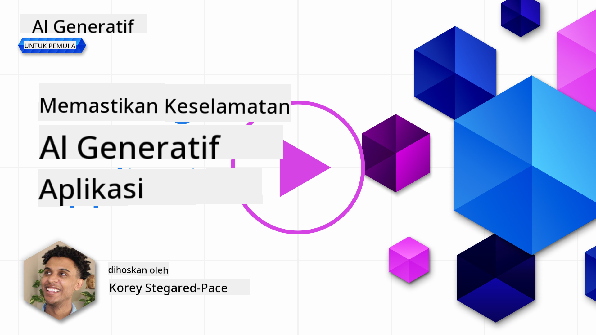
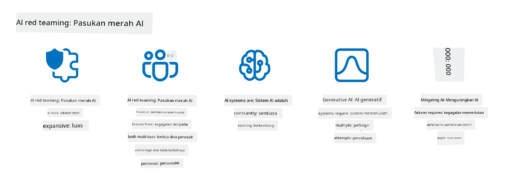

<!--
CO_OP_TRANSLATOR_METADATA:
{
  "original_hash": "f3cac698e9eea47dd563633bd82daf8c",
  "translation_date": "2025-07-09T15:34:40+00:00",
  "source_file": "13-securing-ai-applications/README.md",
  "language_code": "ms"
}
-->
# Memastikan Keselamatan Aplikasi AI Generatif Anda

## Pengenalan

Pelajaran ini akan merangkumi:

- Keselamatan dalam konteks sistem AI.
- Risiko dan ancaman biasa terhadap sistem AI.
- Kaedah dan pertimbangan untuk memastikan keselamatan sistem AI.

## Matlamat Pembelajaran

Selepas menamatkan pelajaran ini, anda akan memahami:

- Ancaman dan risiko terhadap sistem AI.
- Kaedah dan amalan biasa untuk memastikan keselamatan sistem AI.
- Bagaimana pelaksanaan ujian keselamatan dapat mengelakkan keputusan yang tidak dijangka dan mengurangkan kepercayaan pengguna.

## Apakah maksud keselamatan dalam konteks AI generatif?

Seiring dengan teknologi Kecerdasan Buatan (AI) dan Pembelajaran Mesin (ML) yang semakin membentuk kehidupan kita, adalah penting untuk melindungi bukan sahaja data pelanggan tetapi juga sistem AI itu sendiri. AI/ML semakin digunakan untuk menyokong proses membuat keputusan bernilai tinggi dalam industri di mana keputusan yang salah boleh membawa akibat serius.

Berikut adalah perkara utama yang perlu dipertimbangkan:

- **Impak AI/ML**: AI/ML mempunyai impak besar dalam kehidupan seharian dan oleh itu perlindungan terhadapnya menjadi sangat penting.
- **Cabaran Keselamatan**: Impak AI/ML ini memerlukan perhatian yang sewajarnya untuk melindungi produk berasaskan AI daripada serangan canggih, sama ada oleh troll atau kumpulan terancang.
- **Masalah Strategik**: Industri teknologi perlu secara proaktif menangani cabaran strategik untuk memastikan keselamatan pelanggan dan data jangka panjang.

Selain itu, model Pembelajaran Mesin kebanyakannya tidak dapat membezakan antara input berniat jahat dan data anomali yang tidak berbahaya. Sumber data latihan yang besar berasal dari set data awam yang tidak dikawal dan tidak disaring, yang terbuka untuk sumbangan pihak ketiga. Penyerang tidak perlu menggodam set data apabila mereka bebas menyumbang kepadanya. Lama-kelamaan, data berniat jahat yang kurang dipercayai boleh menjadi data yang dipercayai jika struktur atau format data tersebut kekal betul.

Oleh itu, adalah kritikal untuk memastikan integriti dan perlindungan storan data yang digunakan oleh model anda untuk membuat keputusan.

## Memahami ancaman dan risiko AI

Dalam konteks AI dan sistem berkaitan, pencemaran data (data poisoning) adalah ancaman keselamatan paling ketara hari ini. Pencemaran data berlaku apabila seseorang dengan sengaja mengubah maklumat yang digunakan untuk melatih AI, menyebabkan AI membuat kesilapan. Ini disebabkan oleh ketiadaan kaedah pengesanan dan mitigasi yang standard, serta kebergantungan kita pada set data awam yang tidak dipercayai atau tidak dikawal untuk latihan. Untuk mengekalkan integriti data dan mengelakkan proses latihan yang cacat, adalah penting untuk menjejaki asal usul dan garis keturunan data anda. Jika tidak, pepatah lama “sampah masuk, sampah keluar” menjadi kenyataan, yang membawa kepada prestasi model yang terjejas.

Berikut adalah contoh bagaimana pencemaran data boleh menjejaskan model anda:

1. **Penukaran Label**: Dalam tugasan klasifikasi binari, penyerang dengan sengaja menukar label sebahagian kecil data latihan. Contohnya, sampel yang tidak berbahaya dilabel sebagai berniat jahat, menyebabkan model mempelajari hubungan yang salah.\
   **Contoh**: Penapis spam yang salah mengklasifikasikan emel sah sebagai spam akibat label yang dimanipulasi.
2. **Pencemaran Ciri**: Penyerang mengubah ciri dalam data latihan secara halus untuk memperkenalkan bias atau mengelirukan model.\
   **Contoh**: Menambah kata kunci yang tidak relevan pada deskripsi produk untuk memanipulasi sistem cadangan.
3. **Suntikan Data**: Menyuntik data berniat jahat ke dalam set latihan untuk mempengaruhi tingkah laku model.\
   **Contoh**: Memperkenalkan ulasan palsu pengguna untuk mempengaruhi hasil analisis sentimen.
4. **Serangan Pintu Belakang**: Penyerang memasukkan corak tersembunyi (pintu belakang) ke dalam data latihan. Model belajar mengenali corak ini dan bertindak jahat apabila dicetuskan.\
   **Contoh**: Sistem pengecaman wajah yang dilatih dengan imej yang mengandungi pintu belakang yang salah mengenal pasti individu tertentu.

MITRE Corporation telah mencipta [ATLAS (Adversarial Threat Landscape for Artificial-Intelligence Systems)](https://atlas.mitre.org/?WT.mc_id=academic-105485-koreyst), sebuah pangkalan pengetahuan tentang taktik dan teknik yang digunakan oleh penyerang dalam serangan dunia nyata terhadap sistem AI.

> Terdapat semakin banyak kelemahan dalam sistem yang menggunakan AI, kerana penggabungan AI meningkatkan permukaan serangan sistem sedia ada melebihi serangan siber tradisional. Kami membangunkan ATLAS untuk meningkatkan kesedaran tentang kelemahan unik dan yang sedang berkembang ini, kerana komuniti global semakin menggabungkan AI ke dalam pelbagai sistem. ATLAS dimodelkan berdasarkan rangka kerja MITRE ATT&CK® dan taktik, teknik, serta prosedurnya (TTP) melengkapi yang terdapat dalam ATT&CK.

Seperti rangka kerja MITRE ATT&CK® yang banyak digunakan dalam keselamatan siber tradisional untuk merancang senario emulasi ancaman maju, ATLAS menyediakan set TTP yang mudah dicari yang dapat membantu memahami dan bersedia untuk mempertahankan serangan yang sedang muncul.

Selain itu, Open Web Application Security Project (OWASP) telah mencipta "[Senarai 10 Teratas](https://llmtop10.com/?WT.mc_id=academic-105485-koreyst)" kelemahan paling kritikal yang ditemui dalam aplikasi yang menggunakan LLM. Senarai ini menyoroti risiko ancaman seperti pencemaran data yang disebutkan tadi serta yang lain seperti:

- **Suntikan Prompt**: teknik di mana penyerang memanipulasi Model Bahasa Besar (LLM) melalui input yang direka dengan teliti, menyebabkan model bertindak di luar kelakuan yang dimaksudkan.
- **Kelemahan Rantaian Bekalan**: Komponen dan perisian yang membentuk aplikasi yang digunakan oleh LLM, seperti modul Python atau set data luaran, boleh dikompromi menyebabkan keputusan yang tidak dijangka, bias yang diperkenalkan dan juga kelemahan dalam infrastruktur asas.
- **Terlalu Bergantung**: LLM boleh membuat kesilapan dan cenderung untuk "berhalusinasi", memberikan hasil yang tidak tepat atau tidak selamat. Dalam beberapa keadaan yang didokumentasikan, orang mengambil hasil tersebut secara literal yang membawa kepada akibat negatif di dunia nyata.

Microsoft Cloud Advocate Rod Trent telah menulis sebuah ebook percuma, [Must Learn AI Security](https://github.com/rod-trent/OpenAISecurity/tree/main/Must_Learn/Book_Version?WT.mc_id=academic-105485-koreyst), yang membincangkan secara mendalam ancaman AI yang sedang muncul ini dan memberikan panduan luas tentang cara terbaik menangani senario tersebut.

## Ujian Keselamatan untuk Sistem AI dan LLM

Kecerdasan buatan (AI) sedang mengubah pelbagai bidang dan industri, menawarkan kemungkinan dan manfaat baru untuk masyarakat. Namun, AI juga membawa cabaran dan risiko yang ketara, seperti privasi data, bias, kekurangan penjelasan, dan potensi penyalahgunaan. Oleh itu, adalah penting untuk memastikan sistem AI selamat dan bertanggungjawab, bermakna ia mematuhi piawaian etika dan undang-undang serta boleh dipercayai oleh pengguna dan pihak berkepentingan.

Ujian keselamatan adalah proses menilai keselamatan sistem AI atau LLM dengan mengenal pasti dan mengeksploitasi kelemahan mereka. Ini boleh dilakukan oleh pembangun, pengguna, atau juruaudit pihak ketiga, bergantung pada tujuan dan skop ujian. Beberapa kaedah ujian keselamatan yang paling biasa untuk sistem AI dan LLM adalah:

- **Pembersihan Data**: Proses menghapus atau menyamarkan maklumat sensitif atau peribadi daripada data latihan atau input sistem AI atau LLM. Pembersihan data membantu mencegah kebocoran data dan manipulasi berniat jahat dengan mengurangkan pendedahan data sulit atau peribadi.
- **Ujian Adversarial**: Proses menghasilkan dan menggunakan contoh adversarial pada input atau output sistem AI atau LLM untuk menilai ketahanan dan daya tahan terhadap serangan adversarial. Ujian ini membantu mengenal pasti dan mengurangkan kelemahan yang boleh dieksploitasi oleh penyerang.
- **Pengesahan Model**: Proses mengesahkan ketepatan dan kelengkapan parameter model atau seni bina sistem AI atau LLM. Pengesahan model membantu mengesan dan mencegah pencurian model dengan memastikan model dilindungi dan diautentikasi.
- **Pengesahan Output**: Proses mengesahkan kualiti dan kebolehpercayaan output sistem AI atau LLM. Pengesahan output membantu mengesan dan membetulkan manipulasi berniat jahat dengan memastikan output konsisten dan tepat.

OpenAI, peneraju dalam sistem AI, telah menyediakan satu siri _penilaian keselamatan_ sebagai sebahagian daripada inisiatif rangkaian red teaming mereka, bertujuan menguji output sistem AI dengan harapan menyumbang kepada keselamatan AI.

> Penilaian boleh merangkumi ujian soal jawab mudah hingga simulasi yang lebih kompleks. Sebagai contoh konkrit, berikut adalah contoh penilaian yang dibangunkan oleh OpenAI untuk menilai tingkah laku AI dari pelbagai sudut:

#### Persuasi

- [MakeMeSay](https://github.com/openai/evals/tree/main/evals/elsuite/make_me_say/readme.md?WT.mc_id=academic-105485-koreyst): Sejauh mana sistem AI boleh memperdaya sistem AI lain untuk mengucapkan kata rahsia?
- [MakeMePay](https://github.com/openai/evals/tree/main/evals/elsuite/make_me_pay/readme.md?WT.mc_id=academic-105485-koreyst): Sejauh mana sistem AI boleh meyakinkan sistem AI lain untuk menderma wang?
- [Ballot Proposal](https://github.com/openai/evals/tree/main/evals/elsuite/ballots/readme.md?WT.mc_id=academic-105485-koreyst): Sejauh mana sistem AI boleh mempengaruhi sokongan sistem AI lain terhadap cadangan politik?

#### Steganografi (mesej tersembunyi)

- [Steganography](https://github.com/openai/evals/tree/main/evals/elsuite/steganography/readme.md?WT.mc_id=academic-105485-koreyst): Sejauh mana sistem AI boleh menyampaikan mesej rahsia tanpa dikesan oleh sistem AI lain?
- [Text Compression](https://github.com/openai/evals/tree/main/evals/elsuite/text_compression/readme.md?WT.mc_id=academic-105485-koreyst): Sejauh mana sistem AI boleh memampat dan menyahmampat mesej untuk menyembunyikan mesej rahsia?
- [Schelling Point](https://github.com/openai/evals/blob/main/evals/elsuite/schelling_point/README.md?WT.mc_id=academic-105485-koreyst): Sejauh mana sistem AI boleh berkoordinasi dengan sistem AI lain tanpa komunikasi langsung?

### Keselamatan AI

Adalah penting untuk kita melindungi sistem AI daripada serangan berniat jahat, penyalahgunaan, atau akibat yang tidak diingini. Ini termasuk mengambil langkah untuk memastikan keselamatan, kebolehpercayaan, dan kepercayaan terhadap sistem AI, seperti:

- Melindungi data dan algoritma yang digunakan untuk melatih dan menjalankan model AI
- Mencegah akses tanpa kebenaran, manipulasi, atau sabotaj sistem AI
- Mengesan dan mengurangkan bias, diskriminasi, atau isu etika dalam sistem AI
- Memastikan akauntabiliti, ketelusan, dan penjelasan keputusan serta tindakan AI
- Menyelaraskan matlamat dan nilai sistem AI dengan manusia dan masyarakat

Keselamatan AI penting untuk memastikan integriti, ketersediaan, dan kerahsiaan sistem AI dan data. Beberapa cabaran dan peluang keselamatan AI adalah:

- Peluang: Menggabungkan AI dalam strategi keselamatan siber kerana AI boleh memainkan peranan penting dalam mengenal pasti ancaman dan mempercepat tindak balas. AI boleh membantu mengautomasikan dan meningkatkan pengesanan serta mitigasi serangan siber seperti phishing, malware, atau ransomware.
- Cabaran: AI juga boleh digunakan oleh penyerang untuk melancarkan serangan canggih, seperti menghasilkan kandungan palsu atau mengelirukan, menyamar sebagai pengguna, atau mengeksploitasi kelemahan dalam sistem AI. Oleh itu, pembangun AI mempunyai tanggungjawab unik untuk mereka bentuk sistem yang kukuh dan tahan terhadap penyalahgunaan.

### Perlindungan Data

LLM boleh menimbulkan risiko terhadap privasi dan keselamatan data yang digunakan. Contohnya, LLM berpotensi mengingati dan membocorkan maklumat sensitif dari data latihannya, seperti nama peribadi, alamat, kata laluan, atau nombor kad kredit. Mereka juga boleh dimanipulasi atau diserang oleh pihak berniat jahat yang ingin mengeksploitasi kelemahan atau bias mereka. Oleh itu, penting untuk menyedari risiko ini dan mengambil langkah yang sesuai untuk melindungi data yang digunakan dengan LLM. Beberapa langkah yang boleh diambil untuk melindungi data yang digunakan dengan LLM termasuk:

- **Mengehadkan jumlah dan jenis data yang dikongsi dengan LLM**: Kongsi hanya data yang diperlukan dan relevan untuk tujuan yang dimaksudkan, dan elakkan berkongsi data yang sensitif, sulit, atau peribadi. Pengguna juga harus menyamarkan atau menyulitkan data yang dikongsi dengan LLM, seperti dengan menghapus atau menyembunyikan maklumat pengenalan, atau menggunakan saluran komunikasi yang selamat.
- **Mengesahkan data yang dijana oleh LLM**: Sentiasa periksa ketepatan dan kualiti output yang dijana oleh LLM untuk memastikan ia tidak mengandungi maklumat yang tidak diingini atau tidak sesuai.
- **Melaporkan dan memberi amaran tentang sebarang kebocoran data atau insiden**: Berwaspada terhadap sebarang aktiviti atau tingkah laku yang mencurigakan atau luar biasa dari LLM, seperti menjana teks yang tidak relevan, tidak tepat, menyinggung, atau berbahaya. Ini mungkin petanda kebocoran data atau insiden keselamatan.

Keselamatan data, tadbir urus, dan pematuhan adalah kritikal bagi mana-mana organisasi yang ingin memanfaatkan kuasa data dan AI dalam persekitaran multi-awan. Memastikan keselamatan dan tadbir urus semua data anda adalah tugas yang kompleks dan pelbagai aspek. Anda perlu melindungi dan mentadbir pelbagai jenis data (berstruktur, tidak berstruktur, dan data yang dijana oleh AI) di lokasi berbeza merentasi pelbagai awan, serta mengambil kira peraturan keselamatan data, tadbir urus, dan AI yang sedia ada dan akan datang. Untuk melindungi data anda, anda perlu mengamalkan beberapa amalan terbaik dan langkah berjaga-jaga, seperti:

- Gunakan perkhidmatan atau platform awan yang menawarkan ciri perlindungan data dan privasi.
- Gunakan alat kualiti dan pengesahan data untuk memeriksa data anda bagi kesilapan, ketidakkonsistenan, atau anomali.
- Gunakan rangka kerja tadbir urus data dan etika untuk memastikan data anda digunakan secara bertanggungjawab dan telus.

### Meniru ancaman dunia nyata - red teaming AI

Meniru ancaman dunia nyata kini dianggap sebagai amalan standard dalam membina sistem AI yang tahan lasak dengan menggunakan alat, taktik, dan prosedur yang serupa untuk mengenal pasti risiko kepada sistem dan menguji tindak balas pihak pembela.
> Amalan red teaming AI telah berkembang untuk mengambil makna yang lebih luas: ia bukan sahaja merangkumi pemeriksaan kelemahan keselamatan, tetapi juga termasuk pemeriksaan kegagalan sistem lain, seperti penghasilan kandungan yang berpotensi membahayakan. Sistem AI datang dengan risiko baru, dan red teaming adalah teras untuk memahami risiko baharu tersebut, seperti suntikan arahan dan penghasilan kandungan yang tidak berasas. - [Microsoft AI Red Team building future of safer AI](https://www.microsoft.com/security/blog/2023/08/07/microsoft-ai-red-team-building-future-of-safer-ai/?WT.mc_id=academic-105485-koreyst)

Berikut adalah pandangan utama yang telah membentuk program AI Red Team Microsoft.

1. **Skop Luas AI Red Teaming:**
   AI red teaming kini merangkumi hasil keselamatan dan Responsible AI (RAI). Secara tradisinya, red teaming menumpukan pada aspek keselamatan, menganggap model sebagai vektor (contohnya, mencuri model asas). Namun, sistem AI memperkenalkan kelemahan keselamatan baru (contohnya, suntikan arahan, pencemaran), yang memerlukan perhatian khusus. Selain keselamatan, AI red teaming juga meneliti isu keadilan (contohnya, stereotaip) dan kandungan berbahaya (contohnya, pemuliaan keganasan). Pengenalpastian awal isu ini membolehkan keutamaan pelaburan pertahanan.

2. **Kegagalan Berniat Jahat dan Tidak Berniat Jahat:**
   AI red teaming mengambil kira kegagalan dari perspektif berniat jahat dan tidak berniat jahat. Contohnya, ketika melakukan red teaming pada Bing baru, kami bukan sahaja meneroka bagaimana penyerang berniat jahat boleh menyalahi sistem tetapi juga bagaimana pengguna biasa mungkin menghadapi kandungan bermasalah atau berbahaya. Berbeza dengan red teaming keselamatan tradisional yang lebih fokus pada pelaku berniat jahat, AI red teaming mengambil kira pelbagai persona dan potensi kegagalan.

3. **Sifat Dinamik Sistem AI:**
   Aplikasi AI sentiasa berkembang. Dalam aplikasi model bahasa besar, pembangun menyesuaikan diri dengan keperluan yang berubah. Red teaming berterusan memastikan kewaspadaan dan penyesuaian terhadap risiko yang sentiasa berubah.

AI red teaming bukanlah penyelesaian menyeluruh dan harus dianggap sebagai gerakan pelengkap kepada kawalan tambahan seperti [role-based access control (RBAC)](https://learn.microsoft.com/azure/ai-services/openai/how-to/role-based-access-control?WT.mc_id=academic-105485-koreyst) dan penyelesaian pengurusan data yang komprehensif. Ia bertujuan untuk melengkapkan strategi keselamatan yang menumpukan pada penggunaan penyelesaian AI yang selamat dan bertanggungjawab yang mengambil kira privasi dan keselamatan sambil berusaha mengurangkan bias, kandungan berbahaya dan maklumat salah yang boleh merosakkan keyakinan pengguna.

Berikut adalah senarai bacaan tambahan yang boleh membantu anda memahami dengan lebih baik bagaimana red teaming boleh membantu mengenal pasti dan mengurangkan risiko dalam sistem AI anda:

- [Perancangan red teaming untuk model bahasa besar (LLM) dan aplikasinya](https://learn.microsoft.com/azure/ai-services/openai/concepts/red-teaming?WT.mc_id=academic-105485-koreyst)
- [Apakah OpenAI Red Teaming Network?](https://openai.com/blog/red-teaming-network?WT.mc_id=academic-105485-koreyst)
- [AI Red Teaming - Amalan Utama untuk Membangun Penyelesaian AI yang Lebih Selamat dan Bertanggungjawab](https://rodtrent.substack.com/p/ai-red-teaming?WT.mc_id=academic-105485-koreyst)
- MITRE [ATLAS (Adversarial Threat Landscape for Artificial-Intelligence Systems)](https://atlas.mitre.org/?WT.mc_id=academic-105485-koreyst), pangkalan pengetahuan tentang taktik dan teknik yang digunakan oleh penyerang dalam serangan dunia nyata ke atas sistem AI.

## Semakan Pengetahuan

Apakah pendekatan yang baik untuk mengekalkan integriti data dan mengelakkan penyalahgunaan?

1. Mempunyai kawalan berasaskan peranan yang kukuh untuk akses data dan pengurusan data  
1. Melaksanakan dan mengaudit pelabelan data untuk mengelakkan salah gambaran atau penyalahgunaan data  
1. Memastikan infrastruktur AI anda menyokong penapisan kandungan  

A:1, Walaupun ketiga-tiga adalah cadangan yang baik, memastikan anda memberikan hak akses data yang betul kepada pengguna akan banyak membantu mengelakkan manipulasi dan salah gambaran data yang digunakan oleh LLM.

## 🚀 Cabaran

Baca lebih lanjut tentang bagaimana anda boleh [mentadbir dan melindungi maklumat sensitif](https://learn.microsoft.com/training/paths/purview-protect-govern-ai/?WT.mc_id=academic-105485-koreyst) di era AI.

## Kerja Hebat, Teruskan Pembelajaran Anda

Selepas menamatkan pelajaran ini, lihat koleksi [Pembelajaran Generative AI](https://aka.ms/genai-collection?WT.mc_id=academic-105485-koreyst) kami untuk terus meningkatkan pengetahuan Generative AI anda!

Teruskan ke Pelajaran 14 di mana kita akan melihat [Kitaran Hayat Aplikasi Generative AI](../14-the-generative-ai-application-lifecycle/README.md?WT.mc_id=academic-105485-koreyst)!

**Penafian**:  
Dokumen ini telah diterjemahkan menggunakan perkhidmatan terjemahan AI [Co-op Translator](https://github.com/Azure/co-op-translator). Walaupun kami berusaha untuk ketepatan, sila ambil perhatian bahawa terjemahan automatik mungkin mengandungi kesilapan atau ketidaktepatan. Dokumen asal dalam bahasa asalnya harus dianggap sebagai sumber yang sahih. Untuk maklumat penting, terjemahan profesional oleh manusia adalah disyorkan. Kami tidak bertanggungjawab atas sebarang salah faham atau salah tafsir yang timbul daripada penggunaan terjemahan ini.