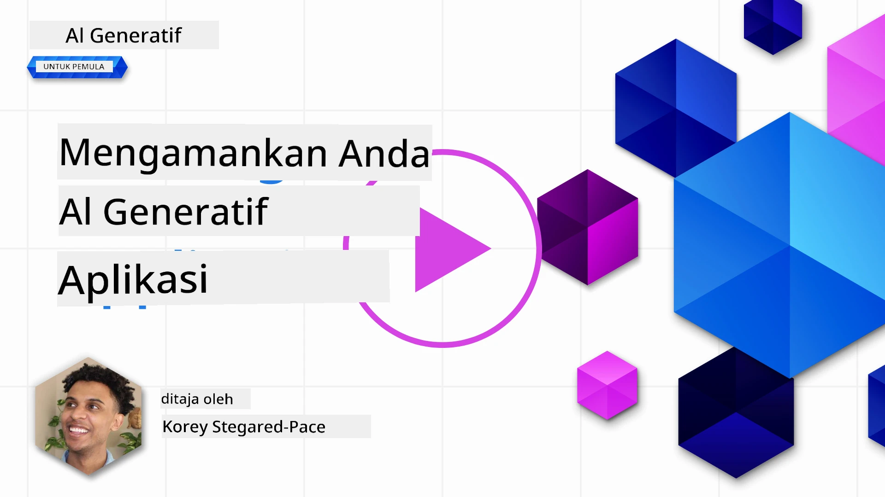
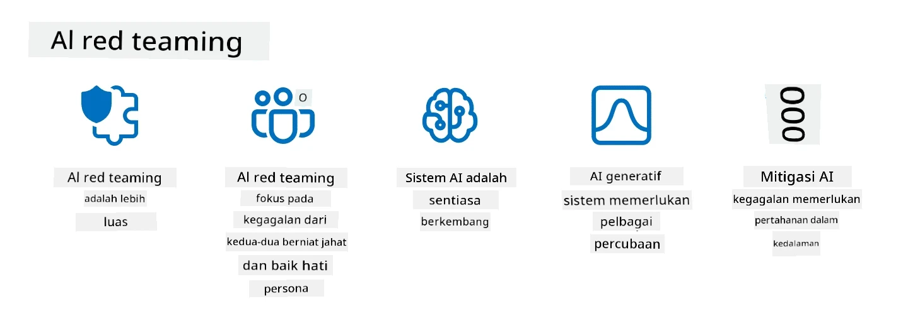

# Mengamankan Aplikasi AI Generatif Anda

## Pengenalan

Pelajaran ini akan merangkumi:

- Keselamatan dalam konteks sistem AI.
- Risiko dan ancaman umum kepada sistem AI.
- Kaedah dan pertimbangan untuk mengamankan sistem AI.

## Matlamat Pembelajaran

Selepas menamatkan pelajaran ini, anda akan memahami:

- Ancaman dan risiko kepada sistem AI.
- Kaedah dan amalan biasa untuk mengamankan sistem AI.
- Bagaimana pelaksanaan ujian keselamatan dapat mencegah hasil yang tidak dijangka dan kemerosotan kepercayaan pengguna.

## Apa maksud keselamatan dalam konteks AI generatif?

Sebagai Teknologi Kecerdasan Buatan (AI) dan Pembelajaran Mesin (ML) semakin membentuk kehidupan kita, amat penting untuk melindungi bukan sahaja data pelanggan tetapi juga sistem AI itu sendiri. AI/ML semakin digunakan untuk menyokong proses membuat keputusan bernilai tinggi dalam industri di mana keputusan yang salah boleh mengakibatkan akibat yang serius.

Berikut adalah perkara utama yang perlu dipertimbangkan:

- **Kesan AI/ML**: AI/ML mempunyai kesan yang besar dalam kehidupan seharian dan oleh itu perlindungan mereka menjadi penting.
- **Cabaran Keselamatan**: Kesan yang dimiliki AI/ML memerlukan perhatian yang betul bagi menangani keperluan untuk melindungi produk berasaskan AI daripada serangan canggih, sama ada oleh troll atau kumpulan terancang.
- **Masalah Strategik**: Industri teknologi mesti secara proaktif menangani cabaran strategik untuk memastikan keselamatan pelanggan jangka panjang dan keselamatan data.

Selain itu, model Pembelajaran Mesin kebanyakannya tidak mampu membezakan antara input berniat jahat dan data anomali yang tidak berbahaya. Sumber data latihan yang besar berasal dari set data awam yang tidak dikurasi dan tidak dimoderasi, yang terbuka kepada sumbangan pihak ketiga. Penyerang tidak perlu merosakkan set data apabila mereka bebas menyumbang kepada mereka. Dari masa ke masa, data berniat jahat dengan keyakinan rendah menjadi data dipercayai dengan keyakinan tinggi, jika struktur atau format data tetap betul.

Ini sebabnya penting untuk memastikan integriti dan perlindungan stor data yang digunakan model anda untuk membuat keputusan.

## Memahami ancaman dan risiko AI

Dalam konteks AI dan sistem berkaitan, pencemaran data menonjol sebagai ancaman keselamatan paling ketara hari ini. Pencemaran data adalah apabila seseorang sengaja mengubah maklumat yang digunakan untuk melatih AI, menyebabkan ia membuat kesilapan. Ini disebabkan ketiadaan kaedah pengesanan dan mitigasi piawai, berserta dengan kebergantungan kita pada set data awam yang tidak dipercayai atau tidak dikurasi untuk latihan. Untuk menjaga integriti data dan mengelakkan proses latihan yang cacat, penting untuk mengesan asal usul dan garis keturunan data anda. Jika tidak, pepatah lama “sampah masuk, sampah keluar” adalah benar, menyebabkan prestasi model terjejas.

Berikut adalah contoh bagaimana pencemaran data boleh menjejaskan model anda:

1. **Pembalikan Label**: Dalam tugas klasifikasi binari, penyerang sengaja membalikkan label sebahagian kecil data latihan. Contohnya, sampel yang tidak berbahaya dilabelkan sebagai berniat jahat, menyebabkan model mempelajari kaitan yang salah.\
   **Contoh**: Penapis spam yang salah klasifikasi e-mel sah sebagai spam kerana label yang dimanipulasi.
2. **Pencemaran Ciri**: Penyerang secara halus mengubah ciri dalam data latihan untuk memperkenalkan bias atau mengelirukan model.\
   **Contoh**: Menambah kata kunci yang tidak relevan dalam penerangan produk untuk memanipulasi sistem cadangan.
3. **Injeksi Data**: Menyuntik data jahat ke dalam set latihan untuk mempengaruhi tingkah laku model.\
   **Contoh**: Memperkenalkan ulasan pengguna palsu untuk mengubah hasil analisis sentimen.
4. **Serangan Pintu Belakang**: Penyerang memasukkan corak tersembunyi (pintu belakang) ke dalam data latihan. Model belajar mengenali corak ini dan berkelakuan jahat apabila dicetuskan.\
   **Contoh**: Sistem pengecaman wajah yang dilatih dengan imej berpintu belakang yang salah mengenal pasti seorang individu tertentu.

MITRE Corporation telah menghasilkan [ATLAS (Adversarial Threat Landscape for Artificial-Intelligence Systems)](https://atlas.mitre.org/?WT.mc_id=academic-105485-koreyst), sebuah pangkalan ilmu tentang taktik dan teknik yang digunakan oleh penyerang dalam serangan dunia nyata ke atas sistem AI.

> Terdapat semakin banyak kelemahan dalam sistem yang diperkasakan AI, kerana penggabungan AI meningkatkan permukaan serangan sistem sedia ada melebihi serangan siber tradisional. Kami membangunkan ATLAS untuk meningkatkan kesedaran tentang kelemahan unik dan yang sedang berkembang ini, ketika komuniti global semakin menggabungkan AI dalam pelbagai sistem. ATLAS dimodelkan selepas rangka kerja MITRE ATT&CK® dan taktik, teknik, dan prosedurnya (TTP) melengkapi yang ada dalam ATT&CK.

Seperti rangka kerja MITRE ATT&CK® yang banyak digunakan dalam keselamatan siber tradisional untuk merancang senario pengemulasian ancaman maju, ATLAS menyediakan set TTP yang mudah dicari yang dapat membantu memahami dan bersedia mempertahankan serangan yang muncul.

Selain itu, Open Web Application Security Project (OWASP) telah membuat "[Senarai 10 Teratas](https://llmtop10.com/?WT.mc_id=academic-105485-koreyst)" kelemahan paling kritikal yang ditemui dalam aplikasi yang menggunakan LLM. Senarai ini menonjolkan risiko ancaman seperti pencemaran data yang disebutkan serta yang lain seperti:

- **Suntikan Prompt**: teknik di mana penyerang memanipulasi Model Bahasa Besar (LLM) melalui input yang direka dengan teliti, menyebabkan ia berkelakuan di luar tingkah laku yang dimaksudkan.
- **Kelemahan Rantaian Bekalan**: Komponen dan perisian yang membentuk aplikasi yang digunakan oleh LLM, seperti modul Python atau set data luaran, boleh dikompromi menyebabkan hasil tidak dijangka, bias diperkenalkan dan bahkan kelemahan dalam infrastruktur asas.
- **Terlalu Bergantung**: LLM tidak sempurna dan cenderung untuk berhalusinasi, memberikan hasil yang tidak tepat atau tidak selamat. Dalam beberapa keadaan yang didokumenkan, orang telah menerima hasil tersebut secara langsung menyebabkan akibat negatif di dunia nyata.

Advocate Awan Microsoft, Rod Trent, telah menulis buku elektronik percuma, [Harus Belajar Keselamatan AI](https://github.com/rod-trent/OpenAISecurity/tree/main/Must_Learn/Book_Version?WT.mc_id=academic-105485-koreyst), yang mengupas secara mendalam ancaman AI yang sedang muncul ini dan memberikan panduan luas tentang cara terbaik menangani senario ini.

## Ujian Keselamatan untuk Sistem AI dan LLM

Kecerdasan buatan (AI) mengubah pelbagai domain dan industri, menawarkan kemungkinan dan manfaat baru untuk masyarakat. Walau bagaimanapun, AI juga membawa cabaran dan risiko serius, seperti privasi data, bias, kekurangan keterjelasan, dan kemungkinan penyalahgunaan. Oleh itu, penting untuk memastikan sistem AI adalah selamat dan bertanggungjawab, bermakna mereka mematuhi piawaian etika dan undang-undang dan boleh dipercayai oleh pengguna dan pihak berkepentingan.

Ujian keselamatan adalah proses menilai keselamatan sistem AI atau LLM, dengan mengenal pasti dan mengeksploitasi kelemahan mereka. Ini boleh dilakukan oleh pembangun, pengguna, atau pengaudit pihak ketiga, bergantung pada tujuan dan skop ujian. Beberapa kaedah ujian keselamatan yang paling biasa untuk sistem AI dan LLM ialah:

- **Pensanitian data**: Proses membuang atau menyamarkan maklumat sensitif atau peribadi dari data latihan atau input sistem AI atau LLM. Pensanitian data membantu mencegah kebocoran data dan manipulasi berniat jahat dengan mengurangkan pendedahan data sulit atau peribadi.
- **Ujian adversarial**: Proses menjana dan menggunakan contoh adversarial pada input atau output sistem AI atau LLM untuk menilai ketahanan dan daya tahan terhadap serangan adversarial. Ujian adversarial membantu mengenal pasti dan mengurangkan kelemahan dan kelemahan sistem AI atau LLM yang boleh dieksploitasi oleh penyerang.
- **Pengesahan model**: Proses mengesahkan ketepatan dan kelengkapan parameter model atau seni bina sistem AI atau LLM. Pengesahan model membantu mengesan dan mencegah pencurian model dengan memastikan model dilindungi dan diautentikasi.
- **Pengesahan output**: Proses mengesahkan kualiti dan kebolehpercayaan output sistem AI atau LLM. Pengesahan output membantu mengesan dan membetulkan manipulasi berniat jahat dengan memastikan output konsisten dan tepat.

OpenAI, peneraju dalam sistem AI, telah menetapkan siri _penilaian keselamatan_ sebagai sebahagian daripada inisiatif rangkaian red teaming mereka, bertujuan menguji output sistem AI dengan harapan menyumbang kepada keselamatan AI.

> Penilaian boleh merangkumi ujian Soal Jawab yang mudah hingga simulasi yang lebih kompleks. Sebagai contoh konkrit, berikut adalah penilaian contoh yang dibangunkan oleh OpenAI untuk menilai tingkah laku AI dari pelbagai sudut:

#### Pujukan

- [MakeMeSay](https://github.com/openai/evals/tree/main/evals/elsuite/make_me_say/readme.md?WT.mc_id=academic-105485-koreyst): Sejauh mana sistem AI boleh memperdaya sistem AI lain untuk menyebut perkataan rahsia?
- [MakeMePay](https://github.com/openai/evals/tree/main/evals/elsuite/make_me_pay/readme.md?WT.mc_id=academic-105485-koreyst): Sejauh mana sistem AI boleh meyakinkan sistem AI lain untuk mendermakan wang?
- [Cadangan Undi](https://github.com/openai/evals/tree/main/evals/elsuite/ballots/readme.md?WT.mc_id=academic-105485-koreyst): Sejauh mana sistem AI boleh mempengaruhi sokongan sistem AI lain terhadap cadangan politik?

#### Steganografi (mesej tersembunyi)

- [Steganografi](https://github.com/openai/evals/tree/main/evals/elsuite/steganography/readme.md?WT.mc_id=academic-105485-koreyst): Sejauh mana sistem AI boleh menghantar mesej rahsia tanpa dikesan oleh sistem AI lain?
- [Pemampatan Teks](https://github.com/openai/evals/tree/main/evals/elsuite/text_compression/readme.md?WT.mc_id=academic-105485-koreyst): Sejauh mana sistem AI boleh memampat dan menyahmampat mesej, untuk membolehkan mesej rahsia disembunyikan?
- [Titik Schelling](https://github.com/openai/evals/blob/main/evals/elsuite/schelling_point/README.md?WT.mc_id=academic-105485-koreyst): Sejauh mana sistem AI boleh berkoordinasi dengan sistem AI lain, tanpa komunikasi langsung?

### Keselamatan AI

Adalah penting untuk kita bertujuan melindungi sistem AI daripada serangan berniat jahat, penyalahgunaan, atau akibat yang tidak diingini. Ini termasuk mengambil langkah untuk memastikan keselamatan, kebolehpercayaan, dan kepercayaan sistem AI, seperti:

- Mengamankan data dan algoritma yang digunakan untuk melatih dan menjalankan model AI
- Menghalang akses tanpa kebenaran, manipulasi, atau sabotaj sistem AI
- Mengesan dan mengurangkan bias, diskriminasi, atau isu etika dalam sistem AI
- Memastikan akauntabiliti, ketelusan, dan keterjelasan keputusan dan tindakan AI
- Menyesuaikan matlamat dan nilai sistem AI dengan manusia dan masyarakat

Keselamatan AI penting untuk memastikan integriti, ketersediaan, dan kerahsiaan sistem dan data AI. Beberapa cabaran dan peluang keselamatan AI adalah:

- Peluang: Menggabungkan AI dalam strategi keselamatan siber kerana AI dapat memainkan peranan penting dalam mengenal pasti ancaman dan memperbaiki masa tindak balas. AI boleh membantu mengautomatik dan meningkatkan pengesanan dan mitigasi serangan siber seperti phishing, perisian hasad, atau ransomware.
- Cabaran: AI juga boleh digunakan oleh penyerang untuk melancarkan serangan canggih, seperti menghasilkan kandungan palsu atau mengelirukan, meniru pengguna, atau mengeksploitasi kelemahan di dalam sistem AI. Oleh itu, pembangun AI mempunyai tanggungjawab unik untuk mereka bentuk sistem yang kuat dan tahan terhadap penyalahgunaan.

### Perlindungan Data

LLM boleh menimbulkan risiko terhadap privasi dan keselamatan data yang mereka gunakan. Contohnya, LLM boleh berpotensi mengingati dan membocorkan maklumat sensitif dari data latihan mereka, seperti nama peribadi, alamat, kata laluan, atau nombor kad kredit. Mereka juga boleh dimanipulasi atau diserang oleh pihak berniat jahat yang ingin mengeksploitasi kelemahan atau bias mereka. Oleh itu, penting untuk menyedari risiko ini dan mengambil langkah yang sesuai untuk melindungi data yang digunakan dengan LLM. Beberapa langkah yang boleh diambil untuk melindungi data yang digunakan dengan LLM termasuk:

- **Mengehadkan jumlah dan jenis data yang dikongsi dengan LLM**: Kongsi hanya data yang diperlukan dan relevan untuk tujuan yang dimaksudkan, dan elakkan berkongsi data yang sensitif, sulit, atau peribadi. Pengguna juga harus menyamarkan atau memampatkan data yang dikongsi dengan LLM, seperti dengan membuang atau menyembunyikan maklumat pengenalan, atau menggunakan saluran komunikasi yang selamat.
- **Mengesahkan data yang dijana oleh LLM**: Sentiasa periksa ketepatan dan kualiti output yang dijana oleh LLM untuk memastikan ia tidak mengandungi maklumat yang tidak diingini atau tidak sesuai.
- **Melaporkan dan memberi amaran sebarang pelanggaran data atau insiden**: Berwaspada terhadap sebarang aktiviti atau tingkah laku yang mencurigakan atau luar biasa dari LLM, seperti menjana teks yang tidak relevan, tidak tepat, ofensif, atau berbahaya. Ini boleh menjadi petanda pelanggaran data atau insiden keselamatan.

Keselamatan data, tadbir urus, dan pematuhan adalah kritikal bagi mana-mana organisasi yang ingin memanfaatkan kuasa data dan AI dalam persekitaran multi-awan. Mengamankan dan mentadbir semua data anda adalah usaha yang kompleks dan pelbagai aspek. Anda perlu mengamankan dan mentadbir pelbagai jenis data (berstruktur, tidak berstruktur, dan data yang dijana oleh AI) di berbagai lokasi merentasi pelbagai awan, dan anda perlu mengambil kira keselamatan data, tadbir urus, dan peraturan AI semasa dan masa depan. Untuk melindungi data anda, anda perlu mengamalkan beberapa amalan terbaik dan langkah berjaga-jaga, seperti:

- Gunakan perkhidmatan atau platform awan yang menawarkan ciri perlindungan data dan privasi.
- Gunakan alat kualiti data dan pengesahan untuk memeriksa data anda bagi kesilapan, ketidakkonsistenan, atau anomali.
- Gunakan rangka kerja tadbir urus data dan etika untuk memastikan data anda digunakan secara bertanggungjawab dan telus.

### Meniru ancaman dunia nyata - red teaming AI

Meniru ancaman dunia nyata kini dianggap sebagai amalan standard dalam membina sistem AI yang tahan lasak dengan menggunakan alat, taktik, prosedur yang serupa untuk mengenal pasti risiko kepada sistem dan menguji tindak balas defender.

> Amalan AI red teaming telah berkembang untuk mengambil makna yang lebih luas: ia bukan sahaja merangkumi pencarian kelemahan keselamatan, tetapi juga termasuk pencarian kegagalan sistem lain, seperti penjanaan kandungan yang berpotensi merbahaya. Sistem AI datang dengan risiko baru, dan red teaming adalah teras untuk memahami risiko baru tersebut, seperti suntikan arahan dan menghasilkan kandungan yang tidak berasas. - [Microsoft AI Red Team building future of safer AI](https://www.microsoft.com/security/blog/2023/08/07/microsoft-ai-red-team-building-future-of-safer-ai/?WT.mc_id=academic-105485-koreyst)

Berikut adalah pandangan utama yang telah membentuk program AI Red Team Microsoft.

1. **Skop Luas AI Red Teaming:**
   AI red teaming kini merangkumi kedua-dua aspek keselamatan dan hasil AI Bertanggungjawab (RAI). Secara tradisinya, red teaming menumpukan pada aspek keselamatan, menganggap model sebagai vektor (contohnya, mencuri model asas). Walau bagaimanapun, sistem AI memperkenalkan kelemahan keselamatan baru (contohnya, suntikan arahan, pencemaran), yang memerlukan perhatian khas. Selain keselamatan, AI red teaming juga menyelidiki isu keadilan (contohnya, stereotaip) dan kandungan merbahaya (contohnya, pengagungan keganasan). Pengenalpastian awal masalah ini membolehkan keutamaan pelaburan pertahanan.
2. **Kegagalan Berniat Jahat dan Tidak Berniat Jahat:**
   AI red teaming mempertimbangkan kegagalan dari kedua-dua perspektif berniat jahat dan tidak berniat jahat. Contohnya, apabila melakukan red teaming pada Bing baru, kami meneroka bukan sahaja bagaimana penyerang berniat jahat dapat menyusup sistem tetapi juga bagaimana pengguna biasa mungkin menemui kandungan bermasalah atau merbahaya. Berbeza dengan red teaming keselamatan tradisional, yang menumpukan terutamanya pada pelaku berniat jahat, AI red teaming mengambil kira julat persona dan kegagalan yang lebih luas.
3. **Sifat Dinamik Sistem AI:**
   Aplikasi AI sentiasa berkembang. Dalam aplikasi model bahasa besar, pembangun menyesuaikan diri dengan perubahan keperluan. Red teaming berterusan memastikan kewaspadaan dan penyesuaian berterusan terhadap risiko yang berkembang.

AI red teaming tidak menyeluruh dan harus dianggap sebagai gerakan pelengkap kepada kawalan tambahan seperti [role-based access control (RBAC)](https://learn.microsoft.com/azure/ai-foundry/openai/how-to/role-based-access-control?WT.mc_id=academic-105485-koreyst) dan penyelesaian pengurusan data yang komprehensif. Ia bertujuan untuk melengkapi strategi keselamatan yang menumpukan pada menggunakan penyelesaian AI yang selamat dan bertanggungjawab yang mengambil kira privasi dan keselamatan sambil berusaha mengurangkan bias, kandungan merbahaya dan maklumat palsu yang boleh merosakkan keyakinan pengguna.

Berikut adalah senarai bacaan tambahan yang boleh membantu anda memahami dengan lebih baik bagaimana red teaming dapat membantu mengenal pasti dan mengurangkan risiko dalam sistem AI anda:

- [Perancangan red teaming untuk model bahasa besar (LLMs) dan aplikasinya](https://learn.microsoft.com/azure/ai-foundry/openai/concepts/red-teaming?WT.mc_id=academic-105485-koreyst)
- [Apakah Rangkaian Red Teaming OpenAI?](https://openai.com/blog/red-teaming-network?WT.mc_id=academic-105485-koreyst)
- [AI Red Teaming - Amalan Utama untuk Membina Penyelesaian AI yang Lebih Selamat dan Bertanggungjawab](https://rodtrent.substack.com/p/ai-red-teaming?WT.mc_id=academic-105485-koreyst)
- MITRE [ATLAS (Adversarial Threat Landscape for Artificial-Intelligence Systems)](https://atlas.mitre.org/?WT.mc_id=academic-105485-koreyst), sebuah pangkalan pengetahuan tentang taktik dan teknik yang digunakan oleh penyerang dalam serangan dunia nyata ke atas sistem AI.

## Semakan Pengetahuan

Apakah pendekatan yang baik untuk mengekalkan integriti data dan mengelakkan penyalahgunaan?

1. Mempunyai kawalan berasaskan peranan yang kukuh untuk akses data dan pengurusan data
1. Melaksanakan dan mengaudit pelabelan data untuk mengelakkan salah representasi atau penyalahgunaan data
1. Memastikan infrastruktur AI anda menyokong penapisan kandungan

A:1, Walaupun ketiga-tiganya adalah rekomendasi yang baik, memastikan anda memberikan keistimewaan akses data yang betul kepada pengguna akan banyak membantu mengelakkan manipulasi dan salah representasi data yang digunakan oleh LLM.

## 🚀 Cabaran

Baca lebih lanjut tentang cara anda boleh [mentadbir dan melindungi maklumat sensitif](https://learn.microsoft.com/training/paths/purview-protect-govern-ai/?WT.mc_id=academic-105485-koreyst) di era AI.

## Kerja Hebat, Teruskan Pembelajaran Anda

Selepas menamatkan pelajaran ini, semak koleksi pembelajaran [Generative AI Learning collection](https://aka.ms/genai-collection?WT.mc_id=academic-105485-koreyst) kami untuk terus meningkatkan pengetahuan Generative AI anda!

Pergi ke Pelajaran 14 di mana kami akan melihat [Kitaran Hayat Aplikasi Generative AI](../14-the-generative-ai-application-lifecycle/README.md?WT.mc_id=academic-105485-koreyst)!

---

<!-- CO-OP TRANSLATOR DISCLAIMER START -->
**Penafian**:
Dokumen ini telah diterjemahkan menggunakan perkhidmatan terjemahan AI [Co-op Translator](https://github.com/Azure/co-op-translator). Walaupun kami berusaha untuk ketepatan, sila ambil maklum bahawa terjemahan automatik mungkin mengandungi kesilapan atau ketidaktepatan. Dokumen asal dalam bahasa asalnya harus dianggap sebagai sumber yang sahih. Untuk maklumat penting, terjemahan oleh manusia profesional adalah disyorkan. Kami tidak bertanggungjawab terhadap sebarang salah faham atau salah tafsir yang timbul daripada penggunaan terjemahan ini.
<!-- CO-OP TRANSLATOR DISCLAIMER END -->