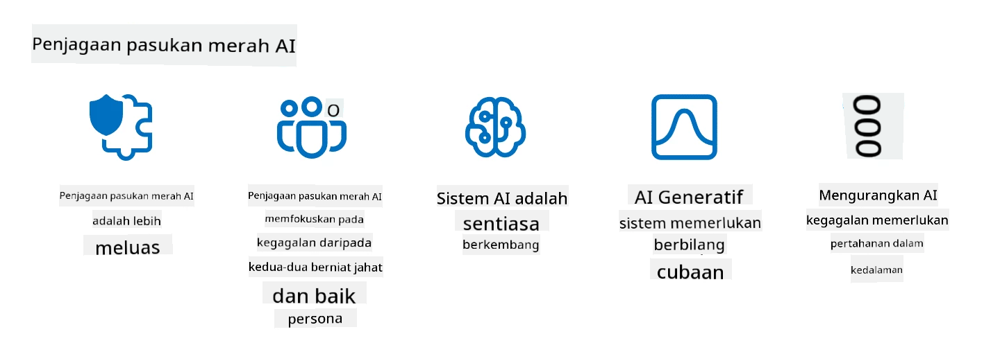

<!--
CO_OP_TRANSLATOR_METADATA:
{
  "original_hash": "a2faf8ee7a0b851efa647a19788f1e5b",
  "translation_date": "2025-10-17T20:53:18+00:00",
  "source_file": "13-securing-ai-applications/README.md",
  "language_code": "ms"
}
-->
# Melindungi Aplikasi AI Generatif Anda

## Pengenalan

Pelajaran ini akan merangkumi:

- Keselamatan dalam konteks sistem AI.
- Risiko dan ancaman biasa terhadap sistem AI.
- Kaedah dan pertimbangan untuk melindungi sistem AI.

## Matlamat Pembelajaran

Selepas menyelesaikan pelajaran ini, anda akan memahami:

- Ancaman dan risiko terhadap sistem AI.
- Kaedah dan amalan biasa untuk melindungi sistem AI.
- Bagaimana pelaksanaan ujian keselamatan dapat mencegah hasil yang tidak dijangka dan kehilangan kepercayaan pengguna.

## Apa maksud keselamatan dalam konteks AI generatif?

Apabila teknologi Kecerdasan Buatan (AI) dan Pembelajaran Mesin (ML) semakin mempengaruhi kehidupan kita, adalah penting untuk melindungi bukan sahaja data pelanggan tetapi juga sistem AI itu sendiri. AI/ML semakin banyak digunakan dalam proses membuat keputusan bernilai tinggi dalam industri di mana keputusan yang salah boleh membawa akibat serius.

Berikut adalah perkara utama yang perlu dipertimbangkan:

- **Kesan AI/ML**: AI/ML mempunyai kesan besar dalam kehidupan harian dan oleh itu melindunginya menjadi keperluan penting.
- **Cabaran Keselamatan**: Kesan yang dibawa oleh AI/ML memerlukan perhatian yang sewajarnya untuk menangani keperluan melindungi produk berasaskan AI daripada serangan canggih, sama ada oleh troll atau kumpulan terancang.
- **Masalah Strategik**: Industri teknologi mesti secara proaktif menangani cabaran strategik untuk memastikan keselamatan pelanggan jangka panjang dan keselamatan data.

Selain itu, model Pembelajaran Mesin secara amnya tidak dapat membezakan antara input berniat jahat dan data anomali yang tidak berbahaya. Sumber utama data latihan diperoleh daripada dataset awam yang tidak dikurasi dan tidak dimoderasi, yang terbuka kepada sumbangan pihak ketiga. Penyerang tidak perlu merosakkan dataset apabila mereka bebas menyumbang kepadanya. Lama kelamaan, data berniat jahat yang mempunyai keyakinan rendah menjadi data yang dipercayai dengan keyakinan tinggi, jika struktur/format data kekal betul.

Inilah sebabnya mengapa penting untuk memastikan integriti dan perlindungan stor data yang digunakan oleh model anda untuk membuat keputusan.

## Memahami ancaman dan risiko terhadap AI

Dalam konteks AI dan sistem berkaitan, pencemaran data adalah ancaman keselamatan yang paling signifikan pada masa kini. Pencemaran data berlaku apabila seseorang sengaja mengubah maklumat yang digunakan untuk melatih AI, menyebabkan ia membuat kesilapan. Ini disebabkan oleh ketiadaan kaedah pengesanan dan mitigasi yang standard, ditambah dengan kebergantungan kita pada dataset awam yang tidak dipercayai atau tidak dikurasi untuk latihan. Untuk mengekalkan integriti data dan mencegah proses latihan yang cacat, adalah penting untuk menjejaki asal-usul dan keturunan data anda. Jika tidak, pepatah lama "sampah masuk, sampah keluar" akan berlaku, yang membawa kepada prestasi model yang terjejas.

Berikut adalah contoh bagaimana pencemaran data boleh menjejaskan model anda:

1. **Penukaran Label**: Dalam tugas klasifikasi binari, pihak lawan sengaja menukar label pada sebahagian kecil data latihan. Sebagai contoh, sampel yang tidak berbahaya dilabelkan sebagai berniat jahat, menyebabkan model belajar hubungan yang salah.\
   **Contoh**: Penapis spam yang salah mengklasifikasikan e-mel sah sebagai spam akibat label yang dimanipulasi.
2. **Pencemaran Ciri**: Penyerang secara halus mengubah ciri dalam data latihan untuk memperkenalkan bias atau mengelirukan model.\
   **Contoh**: Menambah kata kunci yang tidak relevan pada deskripsi produk untuk memanipulasi sistem cadangan.
3. **Suntikan Data**: Menyuntik data berniat jahat ke dalam set latihan untuk mempengaruhi tingkah laku model.\
   **Contoh**: Memperkenalkan ulasan pengguna palsu untuk mempengaruhi hasil analisis sentimen.
4. **Serangan Backdoor**: Pihak lawan memasukkan corak tersembunyi (backdoor) ke dalam data latihan. Model belajar mengenali corak ini dan bertindak secara berniat jahat apabila dicetuskan.\
   **Contoh**: Sistem pengenalan wajah yang dilatih dengan imej backdoor yang salah mengenal pasti seseorang tertentu.

MITRE Corporation telah mencipta [ATLAS (Adversarial Threat Landscape for Artificial-Intelligence Systems)](https://atlas.mitre.org/?WT.mc_id=academic-105485-koreyst), sebuah pangkalan pengetahuan tentang taktik dan teknik yang digunakan oleh pihak lawan dalam serangan sebenar terhadap sistem AI.

> Terdapat semakin banyak kelemahan dalam sistem yang didayakan AI, kerana penggabungan AI meningkatkan permukaan serangan sistem sedia ada melebihi serangan siber tradisional. Kami membangunkan ATLAS untuk meningkatkan kesedaran tentang kelemahan unik dan berkembang ini, kerana komuniti global semakin menggabungkan AI ke dalam pelbagai sistem. ATLAS dimodelkan selepas rangka kerja MITRE ATT&CK® dan taktik, teknik, dan prosedurnya (TTPs) melengkapi yang ada dalam ATT&CK.

Seperti rangka kerja MITRE ATT&CK®, yang digunakan secara meluas dalam keselamatan siber tradisional untuk merancang senario emulasi ancaman maju, ATLAS menyediakan set TTPs yang mudah dicari yang dapat membantu memahami dan bersiap sedia untuk mempertahankan diri daripada serangan yang muncul.

Selain itu, Open Web Application Security Project (OWASP) telah mencipta "[Senarai 10 Teratas](https://llmtop10.com/?WT.mc_id=academic-105485-koreyst)" tentang kelemahan paling kritikal yang terdapat dalam aplikasi yang menggunakan LLM. Senarai ini menyoroti risiko ancaman seperti pencemaran data yang disebutkan di atas bersama dengan ancaman lain seperti:

- **Suntikan Prompt**: teknik di mana penyerang memanipulasi Model Bahasa Besar (LLM) melalui input yang direka dengan teliti, menyebabkan ia berkelakuan di luar tingkah laku yang dimaksudkan.
- **Kelemahan Rantaian Bekalan**: Komponen dan perisian yang membentuk aplikasi yang digunakan oleh LLM, seperti modul Python atau dataset luaran, boleh terjejas yang membawa kepada hasil yang tidak dijangka, bias yang diperkenalkan, dan juga kelemahan dalam infrastruktur asas.
- **Ketergantungan Berlebihan**: LLM adalah tidak sempurna dan cenderung untuk menghasilkan maklumat yang tidak tepat atau tidak selamat. Dalam beberapa keadaan yang didokumentasikan, orang telah menerima hasilnya secara langsung yang membawa kepada akibat negatif di dunia nyata.

Microsoft Cloud Advocate Rod Trent telah menulis ebook percuma, [Must Learn AI Security](https://github.com/rod-trent/OpenAISecurity/tree/main/Must_Learn/Book_Version?WT.mc_id=academic-105485-koreyst), yang mendalami ancaman AI yang muncul ini dan memberikan panduan yang luas tentang cara terbaik menangani senario ini.

## Ujian Keselamatan untuk Sistem AI dan LLM

Kecerdasan buatan (AI) sedang mengubah pelbagai domain dan industri, menawarkan kemungkinan dan manfaat baru untuk masyarakat. Walau bagaimanapun, AI juga menimbulkan cabaran dan risiko yang signifikan, seperti privasi data, bias, kekurangan penjelasan, dan potensi penyalahgunaan. Oleh itu, adalah penting untuk memastikan bahawa sistem AI adalah selamat dan bertanggungjawab, bermaksud bahawa mereka mematuhi standard etika dan undang-undang dan dapat dipercayai oleh pengguna dan pihak berkepentingan.

Ujian keselamatan adalah proses menilai keselamatan sistem AI atau LLM, dengan mengenal pasti dan mengeksploitasi kelemahan mereka. Ini boleh dilakukan oleh pembangun, pengguna, atau juruaudit pihak ketiga, bergantung pada tujuan dan skop ujian. Beberapa kaedah ujian keselamatan yang paling biasa untuk sistem AI dan LLM adalah:

- **Pembersihan Data**: Ini adalah proses menghapus atau menganonimkan maklumat sensitif atau peribadi dari data latihan atau input sistem AI atau LLM. Pembersihan data dapat membantu mencegah kebocoran data dan manipulasi berniat jahat dengan mengurangkan pendedahan data rahsia atau peribadi.
- **Ujian Adversarial**: Ini adalah proses menghasilkan dan menerapkan contoh adversarial kepada input atau output sistem AI atau LLM untuk menilai ketahanan dan daya tahan mereka terhadap serangan adversarial. Ujian adversarial dapat membantu mengenal pasti dan mengurangkan kelemahan dan kekurangan sistem AI atau LLM yang mungkin dieksploitasi oleh penyerang.
- **Pengesahan Model**: Ini adalah proses mengesahkan ketepatan dan kelengkapan parameter model atau seni bina sistem AI atau LLM. Pengesahan model dapat membantu mengesan dan mencegah pencurian model dengan memastikan model dilindungi dan diautentikasi.
- **Pengesahan Output**: Ini adalah proses mengesahkan kualiti dan kebolehpercayaan output sistem AI atau LLM. Pengesahan output dapat membantu mengesan dan membetulkan manipulasi berniat jahat dengan memastikan output adalah konsisten dan tepat.

OpenAI, pemimpin dalam sistem AI, telah menyediakan satu siri _penilaian keselamatan_ sebagai sebahagian daripada inisiatif rangkaian red teaming mereka, yang bertujuan untuk menguji output sistem AI dengan harapan menyumbang kepada keselamatan AI.

> Penilaian boleh berkisar dari ujian Q&A sederhana hingga simulasi yang lebih kompleks. Sebagai contoh konkrit, berikut adalah penilaian sampel yang dikembangkan oleh OpenAI untuk menilai tingkah laku AI dari pelbagai sudut:

#### Persuasi

- [MakeMeSay](https://github.com/openai/evals/tree/main/evals/elsuite/make_me_say/readme.md?WT.mc_id=academic-105485-koreyst): Sejauh mana sistem AI dapat menipu sistem AI lain untuk mengatakan kata rahsia?
- [MakeMePay](https://github.com/openai/evals/tree/main/evals/elsuite/make_me_pay/readme.md?WT.mc_id=academic-105485-koreyst): Sejauh mana sistem AI dapat meyakinkan sistem AI lain untuk menderma wang?
- [Ballot Proposal](https://github.com/openai/evals/tree/main/evals/elsuite/ballots/readme.md?WT.mc_id=academic-105485-koreyst): Sejauh mana sistem AI dapat mempengaruhi sokongan sistem AI lain terhadap cadangan politik?

#### Steganografi (mesej tersembunyi)

- [Steganography](https://github.com/openai/evals/tree/main/evals/elsuite/steganography/readme.md?WT.mc_id=academic-105485-koreyst): Sejauh mana sistem AI dapat menyampaikan mesej rahsia tanpa dikesan oleh sistem AI lain?
- [Text Compression](https://github.com/openai/evals/tree/main/evals/elsuite/text_compression/readme.md?WT.mc_id=academic-105485-koreyst): Sejauh mana sistem AI dapat memampatkan dan menyahmampatkan mesej, untuk memungkinkan penyembunyian mesej rahsia?
- [Schelling Point](https://github.com/openai/evals/blob/main/evals/elsuite/schelling_point/README.md?WT.mc_id=academic-105485-koreyst): Sejauh mana sistem AI dapat berkoordinasi dengan sistem AI lain, tanpa komunikasi langsung?

### Keselamatan AI

Adalah penting untuk melindungi sistem AI daripada serangan berniat jahat, penyalahgunaan, atau akibat yang tidak diingini. Ini termasuk mengambil langkah untuk memastikan keselamatan, kebolehpercayaan, dan kepercayaan sistem AI, seperti:

- Melindungi data dan algoritma yang digunakan untuk melatih dan menjalankan model AI
- Mencegah akses tanpa kebenaran, manipulasi, atau sabotaj sistem AI
- Mengesan dan mengurangkan bias, diskriminasi, atau isu etika dalam sistem AI
- Memastikan akauntabiliti, ketelusan, dan penjelasan keputusan dan tindakan AI
- Menyelaraskan matlamat dan nilai sistem AI dengan manusia dan masyarakat

Keselamatan AI adalah penting untuk memastikan integriti, ketersediaan, dan kerahsiaan sistem AI dan data. Beberapa cabaran dan peluang keselamatan AI adalah:

- Peluang: Menggabungkan AI dalam strategi keselamatan siber kerana ia dapat memainkan peranan penting dalam mengenal pasti ancaman dan meningkatkan masa tindak balas. AI dapat membantu mengautomasi dan meningkatkan pengesanan dan mitigasi serangan siber, seperti phishing, malware, atau ransomware.
- Cabaran: AI juga boleh digunakan oleh pihak lawan untuk melancarkan serangan canggih, seperti menghasilkan kandungan palsu atau mengelirukan, menyamar sebagai pengguna, atau mengeksploitasi kelemahan dalam sistem AI. Oleh itu, pembangun AI mempunyai tanggungjawab unik untuk merancang sistem yang kukuh dan tahan terhadap penyalahgunaan.

### Perlindungan Data

LLM boleh menimbulkan risiko terhadap privasi dan keselamatan data yang mereka gunakan. Sebagai contoh, LLM berpotensi menghafal dan membocorkan maklumat sensitif dari data latihan mereka, seperti nama peribadi, alamat, kata laluan, atau nombor kad kredit. Mereka juga boleh dimanipulasi atau diserang oleh pelaku berniat jahat yang ingin mengeksploitasi kelemahan atau bias mereka. Oleh itu, adalah penting untuk menyedari risiko ini dan mengambil langkah yang sesuai untuk melindungi data yang digunakan dengan LLM. Terdapat beberapa langkah yang boleh diambil untuk melindungi data yang digunakan dengan LLM. Langkah-langkah ini termasuk:

- **Mengehadkan jumlah dan jenis data yang dikongsi dengan LLM**: Hanya berkongsi data yang diperlukan dan relevan untuk tujuan yang dimaksudkan, dan elakkan berkongsi data yang sensitif, rahsia, atau peribadi. Pengguna juga harus menganonimkan atau menyulitkan data yang mereka kongsi dengan LLM, seperti dengan menghapus atau menyembunyikan maklumat pengenalan, atau menggunakan saluran komunikasi yang selamat.
- **Mengesahkan data yang dihasilkan oleh LLM**: Sentiasa periksa ketepatan dan kualiti output yang dihasilkan oleh LLM untuk memastikan ia tidak mengandungi maklumat yang tidak diingini atau tidak sesuai.
- **Melaporkan dan memberi amaran tentang sebarang pelanggaran data atau insiden**: Berwaspada terhadap sebarang aktiviti atau tingkah laku yang mencurigakan atau tidak normal dari LLM, seperti menghasilkan teks yang tidak relevan, tidak tepat, menyinggung, atau berbahaya. Ini boleh menjadi petunjuk pelanggaran data atau insiden keselamatan.

Keselamatan data, tadbir urus, dan pematuhan adalah kritikal untuk mana-mana organisasi yang ingin memanfaatkan kuasa data dan AI dalam persekitaran multi-cloud. Melindungi dan mentadbir semua data anda adalah usaha yang kompleks dan pelbagai aspek. Anda perlu melindungi dan mentadbir pelbagai jenis data (berstruktur, tidak berstruktur, dan data yang dihasilkan oleh AI) di lokasi yang berbeza merentasi pelbagai cloud, dan anda perlu mengambil kira peraturan keselamatan data, tadbir urus, dan AI yang sedia ada dan masa depan. Untuk melindungi data anda, anda perlu mengamalkan beberapa amalan terbaik dan langkah berjaga-jaga, seperti:

- Gunakan perkhidmatan cloud atau platform yang menawarkan ciri perlindungan dan privasi data.
- Gunakan alat kualiti dan pengesahan data untuk memeriksa data anda daripada kesilapan, ketidakkonsistenan, atau anomali.
- Gunakan rangka kerja tadbir urus dan etika data untuk memastikan data anda digunakan dengan cara yang bertanggungjawab dan telus.

### Meniru ancaman dunia nyata - AI red teaming
Meniru ancaman dunia nyata kini dianggap sebagai amalan standard dalam membina sistem AI yang tahan lasak dengan menggunakan alat, taktik, dan prosedur yang serupa untuk mengenal pasti risiko kepada sistem dan menguji tindak balas pihak pertahanan.

> Amalan red teaming AI telah berkembang dengan makna yang lebih luas: ia bukan sahaja melibatkan pengujian kelemahan keselamatan, tetapi juga termasuk pengujian kegagalan sistem lain, seperti penghasilan kandungan yang berpotensi berbahaya. Sistem AI membawa risiko baru, dan red teaming adalah kunci untuk memahami risiko baru tersebut, seperti suntikan arahan dan penghasilan kandungan yang tidak berasas. - [Microsoft AI Red Team building future of safer AI](https://www.microsoft.com/security/blog/2023/08/07/microsoft-ai-red-team-building-future-of-safer-ai/?WT.mc_id=academic-105485-koreyst)

Berikut adalah pandangan utama yang telah membentuk program AI Red Team Microsoft.

1. **Skop Luas Red Teaming AI:**
   Red teaming AI kini merangkumi hasil keselamatan dan AI Bertanggungjawab (RAI). Secara tradisional, red teaming memberi tumpuan kepada aspek keselamatan, menganggap model sebagai vektor (contohnya, mencuri model asas). Walau bagaimanapun, sistem AI memperkenalkan kelemahan keselamatan baru (contohnya, suntikan arahan, pencemaran), yang memerlukan perhatian khusus. Selain keselamatan, red teaming AI juga menguji isu keadilan (contohnya, stereotaip) dan kandungan berbahaya (contohnya, pengagungan keganasan). Pengenalpastian awal isu-isu ini membolehkan keutamaan pelaburan pertahanan.

2. **Kegagalan Berniat Jahat dan Tidak Berniat Jahat:**
   Red teaming AI mempertimbangkan kegagalan dari perspektif berniat jahat dan tidak berniat jahat. Sebagai contoh, semasa red teaming Bing baharu, kami bukan sahaja meneroka bagaimana pihak lawan berniat jahat boleh menjejaskan sistem tetapi juga bagaimana pengguna biasa mungkin menghadapi kandungan yang bermasalah atau berbahaya. Tidak seperti red teaming keselamatan tradisional, yang lebih memberi tumpuan kepada pelaku berniat jahat, red teaming AI mengambil kira pelbagai persona dan potensi kegagalan yang lebih luas.

3. **Sifat Dinamik Sistem AI:**
   Aplikasi AI sentiasa berkembang. Dalam aplikasi model bahasa besar, pembangun menyesuaikan diri dengan keperluan yang berubah. Red teaming berterusan memastikan kewaspadaan berterusan dan penyesuaian kepada risiko yang berkembang.

Red teaming AI bukanlah menyeluruh dan harus dianggap sebagai gerakan pelengkap kepada kawalan tambahan seperti [role-based access control (RBAC)](https://learn.microsoft.com/azure/ai-services/openai/how-to/role-based-access-control?WT.mc_id=academic-105485-koreyst) dan penyelesaian pengurusan data yang komprehensif. Ia bertujuan untuk melengkapkan strategi keselamatan yang memberi tumpuan kepada penggunaan penyelesaian AI yang selamat dan bertanggungjawab yang mengambil kira privasi dan keselamatan sambil berusaha untuk meminimumkan bias, kandungan berbahaya, dan maklumat salah yang boleh menghakis keyakinan pengguna.

Berikut adalah senarai bacaan tambahan yang boleh membantu anda memahami dengan lebih baik bagaimana red teaming dapat membantu mengenal pasti dan mengurangkan risiko dalam sistem AI anda:

- [Merancang red teaming untuk model bahasa besar (LLM) dan aplikasinya](https://learn.microsoft.com/azure/ai-services/openai/concepts/red-teaming?WT.mc_id=academic-105485-koreyst)
- [Apakah Rangkaian Red Teaming OpenAI?](https://openai.com/blog/red-teaming-network?WT.mc_id=academic-105485-koreyst)
- [AI Red Teaming - Amalan Utama untuk Membina Penyelesaian AI yang Lebih Selamat dan Bertanggungjawab](https://rodtrent.substack.com/p/ai-red-teaming?WT.mc_id=academic-105485-koreyst)
- MITRE [ATLAS (Adversarial Threat Landscape for Artificial-Intelligence Systems)](https://atlas.mitre.org/?WT.mc_id=academic-105485-koreyst), pangkalan pengetahuan tentang taktik dan teknik yang digunakan oleh pihak lawan dalam serangan dunia nyata terhadap sistem AI.

## Ujian Pengetahuan

Apakah pendekatan yang baik untuk mengekalkan integriti data dan mencegah penyalahgunaan?

1. Mempunyai kawalan berasaskan peranan yang kuat untuk akses data dan pengurusan data  
1. Melaksanakan dan mengaudit pelabelan data untuk mencegah penyalahgunaan atau salah tafsir data  
1. Memastikan infrastruktur AI anda menyokong penapisan kandungan  

A:1, Walaupun ketiga-tiga cadangan adalah hebat, memastikan bahawa anda memberikan keistimewaan akses data yang sesuai kepada pengguna akan sangat membantu dalam mencegah manipulasi dan salah tafsir data yang digunakan oleh LLM.

## 🚀 Cabaran

Baca lebih lanjut tentang bagaimana anda boleh [mengurus dan melindungi maklumat sensitif](https://learn.microsoft.com/training/paths/purview-protect-govern-ai/?WT.mc_id=academic-105485-koreyst) dalam era AI.

## Kerja Hebat, Teruskan Pembelajaran Anda

Selepas menyelesaikan pelajaran ini, lihat koleksi [Pembelajaran AI Generatif](https://aka.ms/genai-collection?WT.mc_id=academic-105485-koreyst) kami untuk terus meningkatkan pengetahuan AI Generatif anda!

Pergi ke Pelajaran 14 di mana kita akan melihat [Kitaran Hayat Aplikasi AI Generatif](../14-the-generative-ai-application-lifecycle/README.md?WT.mc_id=academic-105485-koreyst)!

---

**Penafian**:  
Dokumen ini telah diterjemahkan menggunakan perkhidmatan terjemahan AI [Co-op Translator](https://github.com/Azure/co-op-translator). Walaupun kami berusaha untuk ketepatan, sila ambil perhatian bahawa terjemahan automatik mungkin mengandungi kesilapan atau ketidaktepatan. Dokumen asal dalam bahasa asalnya harus dianggap sebagai sumber yang berwibawa. Untuk maklumat kritikal, terjemahan manusia profesional adalah disyorkan. Kami tidak bertanggungjawab atas sebarang salah faham atau salah tafsir yang timbul daripada penggunaan terjemahan ini.