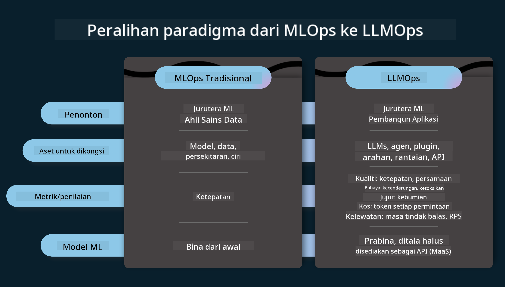
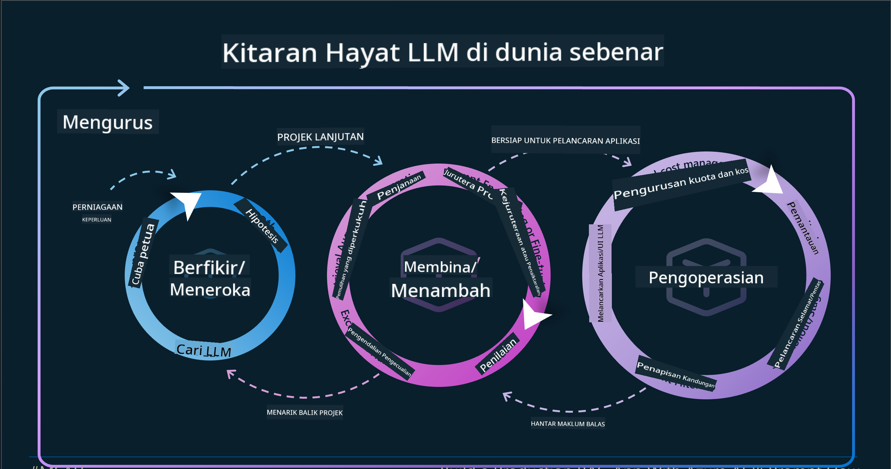
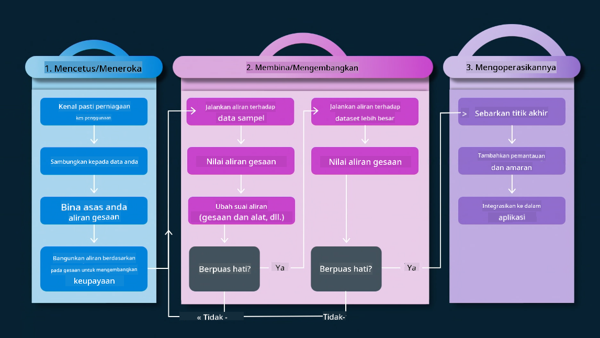
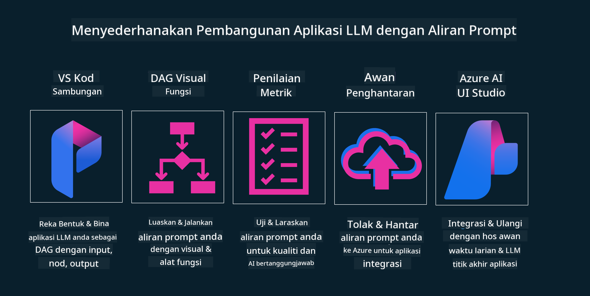

<!--
CO_OP_TRANSLATOR_METADATA:
{
  "original_hash": "27a5347a5022d5ef0a72ab029b03526a",
  "translation_date": "2025-05-19T23:32:02+00:00",
  "source_file": "14-the-generative-ai-application-lifecycle/README.md",
  "language_code": "ms"
}
-->

# Kitaran Hayat Aplikasi AI Generatif

Satu soalan penting untuk semua aplikasi AI ialah relevansi ciri AI, kerana AI adalah bidang yang berkembang pesat, untuk memastikan aplikasi anda kekal relevan, boleh dipercayai, dan kukuh, anda perlu memantau, menilai, dan memperbaikinya secara berterusan. Di sinilah kitaran hayat AI generatif berperanan.

Kitaran hayat AI generatif adalah rangka kerja yang membimbing anda melalui tahap pembangunan, penyebaran, dan penyelenggaraan aplikasi AI generatif. Ia membantu anda menentukan matlamat anda, mengukur prestasi anda, mengenal pasti cabaran anda, dan melaksanakan penyelesaian anda. Ia juga membantu anda menyelaraskan aplikasi anda dengan piawaian etika dan undang-undang domain anda dan pihak berkepentingan anda. Dengan mengikuti kitaran hayat AI generatif, anda dapat memastikan aplikasi anda sentiasa memberikan nilai dan memuaskan pengguna anda.

## Pengenalan

Dalam bab ini, anda akan:

- Memahami Perubahan Paradigma dari MLOps ke LLMOps
- Kitaran Hayat LLM
- Alat Kitaran Hayat
- Metrik dan Penilaian Kitaran Hayat

## Memahami Perubahan Paradigma dari MLOps ke LLMOps

LLM adalah alat baru dalam senjata Kecerdasan Buatan, mereka sangat berkuasa dalam tugas analisis dan penjanaan untuk aplikasi, namun kekuatan ini mempunyai beberapa akibat dalam cara kita menyelaraskan tugas AI dan Pembelajaran Mesin Klasik.

Dengan ini, kita memerlukan Paradigma baru untuk menyesuaikan alat ini secara dinamik, dengan insentif yang betul. Kita boleh mengkategorikan aplikasi AI lama sebagai "Aplikasi ML" dan Aplikasi AI baru sebagai "Aplikasi GenAI" atau hanya "Aplikasi AI", mencerminkan teknologi dan teknik arus perdana yang digunakan pada masa itu. Ini mengubah naratif kita dalam pelbagai cara, lihat perbandingan berikut.

Perhatikan bahawa dalam LLMOps, kita lebih fokus kepada Pembangun Aplikasi, menggunakan integrasi sebagai titik utama, menggunakan "Model-sebagai-Perkhidmatan" dan memikirkan perkara berikut untuk metrik.

- Kualiti: Kualiti respons
- Bahaya: AI Bertanggungjawab
- Kejujuran: Keberadaan respons (Masuk akal? Adakah ia betul?)
- Kos: Bajet penyelesaian
- Kelewatan: Masa purata untuk respons token

## Kitaran Hayat LLM

Pertama, untuk memahami kitaran hayat dan pengubahsuaian, mari kita perhatikan infografik berikut.

Seperti yang anda perhatikan, ini berbeza daripada Kitaran Hayat biasa dari MLOps. LLM mempunyai banyak keperluan baru, seperti Prompting, teknik berbeza untuk meningkatkan kualiti (Fine-Tuning, RAG, Meta-Prompts), penilaian dan tanggungjawab berbeza dengan AI bertanggungjawab, terakhir, metrik penilaian baru (Kualiti, Bahaya, Kejujuran, Kos dan Kelewatan).

Sebagai contoh, lihat bagaimana kita berideasi. Menggunakan kejuruteraan prompt untuk bereksperimen dengan pelbagai LLM untuk meneroka kemungkinan untuk menguji sama ada Hipotesis mereka boleh betul.

Perhatikan bahawa ini bukan linear, tetapi gelung bersepadu, iteratif dan dengan kitaran menyeluruh.

Bagaimana kita boleh meneroka langkah-langkah tersebut? Mari kita melangkah ke dalam butiran bagaimana kita boleh membina kitaran hayat.

Ini mungkin kelihatan agak rumit, mari kita fokus pada tiga langkah besar terlebih dahulu.

1. Berideasi/Meneroka: Eksplorasi, di sini kita boleh meneroka mengikut keperluan perniagaan kita. Prototip, mencipta [PromptFlow](https://microsoft.github.io/promptflow/index.html?WT.mc_id=academic-105485-koreyst) dan menguji jika ia cukup efisien untuk Hipotesis kita.
2. Membina/Meningkatkan: Pelaksanaan, sekarang, kita mula menilai untuk set data yang lebih besar melaksanakan teknik, seperti Fine-tuning dan RAG, untuk memeriksa kekukuhan penyelesaian kita. Jika tidak, melaksanakannya semula, menambah langkah baru dalam aliran kita atau menyusun semula data, mungkin membantu. Selepas menguji aliran kita dan skala kita, jika ia berfungsi dan memeriksa Metrik kita, ia sedia untuk langkah seterusnya.
3. Mengoperasikan: Integrasi, sekarang menambah Sistem Pemantauan dan Amaran kepada sistem kita, penyebaran dan integrasi aplikasi ke Aplikasi kita.

Kemudian, kita mempunyai kitaran menyeluruh Pengurusan, memberi tumpuan kepada keselamatan, pematuhan dan tadbir urus.

Tahniah, sekarang anda mempunyai Aplikasi AI yang siap untuk pergi dan beroperasi. Untuk pengalaman praktikal, lihat [Demo Sembang Contoso.](https://nitya.github.io/contoso-chat/?WT.mc_id=academic-105485-koreys)

Sekarang, alat apa yang boleh kita gunakan?

## Alat Kitaran Hayat

Untuk Alat, Microsoft menyediakan [Platform AI Azure](https://azure.microsoft.com/solutions/ai/?WT.mc_id=academic-105485-koreys) dan [PromptFlow](https://microsoft.github.io/promptflow/index.html?WT.mc_id=academic-105485-koreyst) memudahkan dan menjadikan kitaran anda mudah dilaksanakan dan siap untuk pergi.

[Platform AI Azure](https://azure.microsoft.com/solutions/ai/?WT.mc_id=academic-105485-koreys), membolehkan anda menggunakan [AI Studio](https://ai.azure.com/?WT.mc_id=academic-105485-koreys). AI Studio adalah portal web yang membolehkan anda meneroka model, sampel dan alat. Menguruskan sumber anda, aliran pembangunan UI dan pilihan SDK/CLI untuk pembangunan Code-First.

AI Azure, membolehkan anda menggunakan pelbagai sumber, untuk mengurus operasi, perkhidmatan, projek, carian vektor dan keperluan pangkalan data anda.

Bina, dari Bukti-Konsep(POC) hingga aplikasi berskala besar dengan PromptFlow:

- Reka dan Bina aplikasi dari VS Code, dengan alat visual dan fungsional
- Uji dan sesuaikan aplikasi anda untuk AI berkualiti, dengan mudah.
- Gunakan AI Studio Azure untuk Mengintegrasikan dan Mengiterasi dengan awan, Push dan Deploy untuk integrasi cepat.

## Hebat! Teruskan Pembelajaran Anda!

Hebat, sekarang belajar lebih lanjut tentang bagaimana kita menyusun aplikasi untuk menggunakan konsep dengan [Aplikasi Sembang Contoso](https://nitya.github.io/contoso-chat/?WT.mc_id=academic-105485-koreyst), untuk melihat bagaimana Advokasi Awan menambah konsep tersebut dalam demonstrasi. Untuk lebih banyak kandungan, lihat [sesi pecahan Ignite!
](https://www.youtube.com/watch?v=DdOylyrTOWg)

Sekarang, lihat Pelajaran 15, untuk memahami bagaimana [Penjanaan Augmentasi Pengambilan dan Pangkalan Data Vektor](../15-rag-and-vector-databases/README.md?WT.mc_id=academic-105485-koreyst) memberi kesan kepada AI Generatif dan untuk membuat Aplikasi yang lebih menarik!

**Penafian**: 
Dokumen ini telah diterjemahkan menggunakan perkhidmatan terjemahan AI [Co-op Translator](https://github.com/Azure/co-op-translator). Walaupun kami berusaha untuk ketepatan, sila ambil perhatian bahawa terjemahan automatik mungkin mengandungi kesilapan atau ketidaktepatan. Dokumen asal dalam bahasa asalnya harus dianggap sebagai sumber yang berwibawa. Untuk maklumat kritikal, terjemahan manusia profesional adalah disyorkan. Kami tidak bertanggungjawab atas sebarang salah faham atau salah tafsir yang timbul daripada penggunaan terjemahan ini.