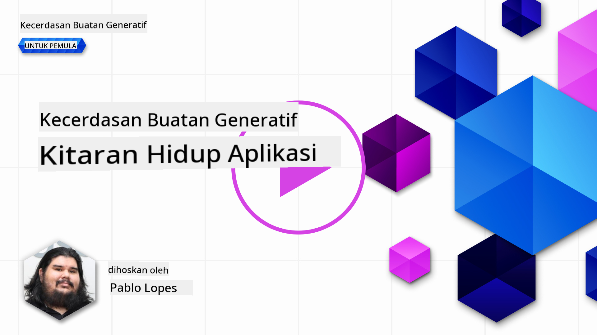
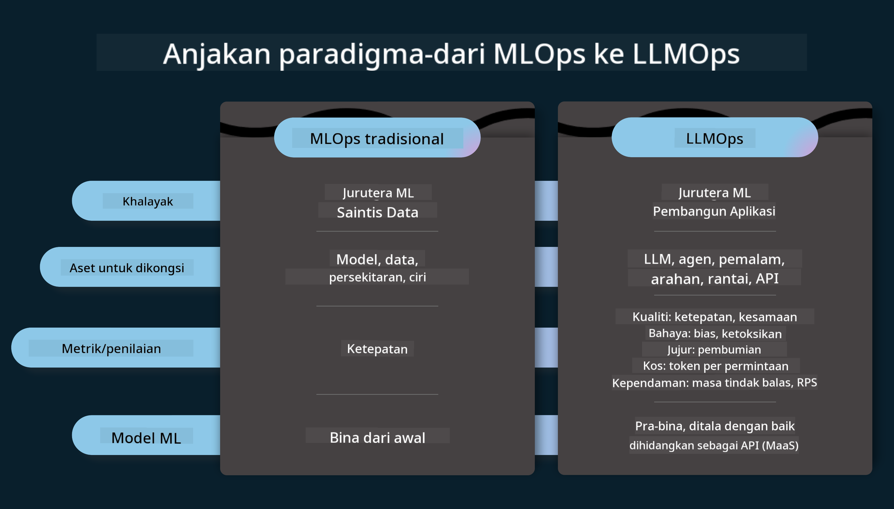
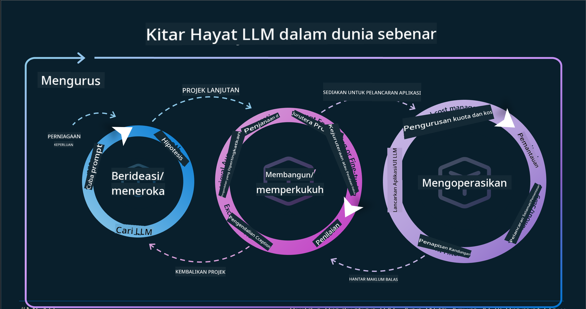
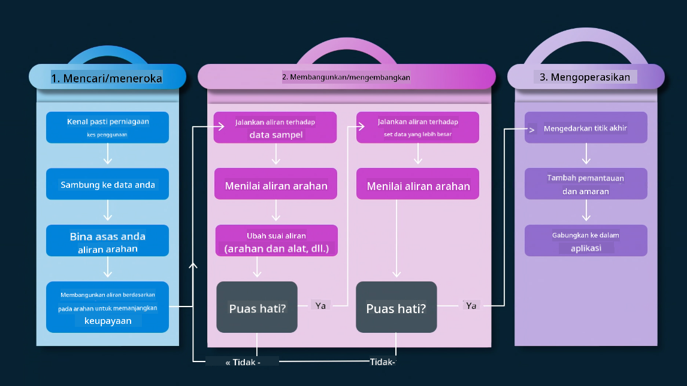
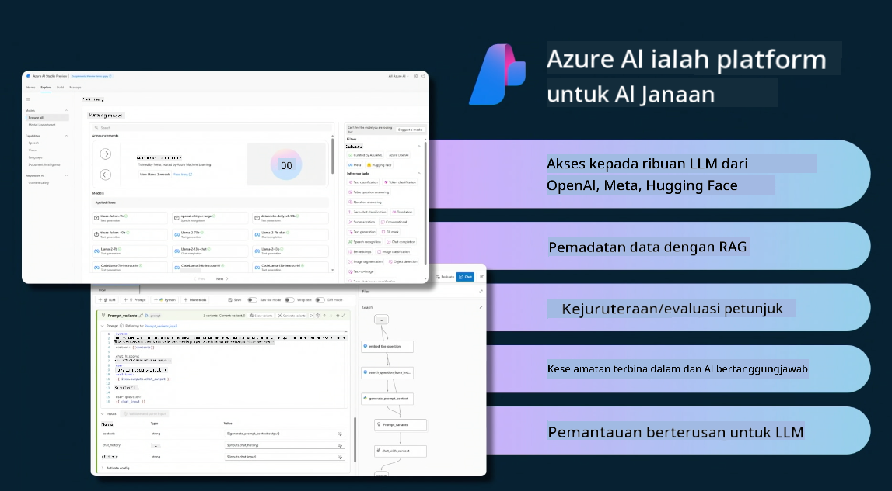
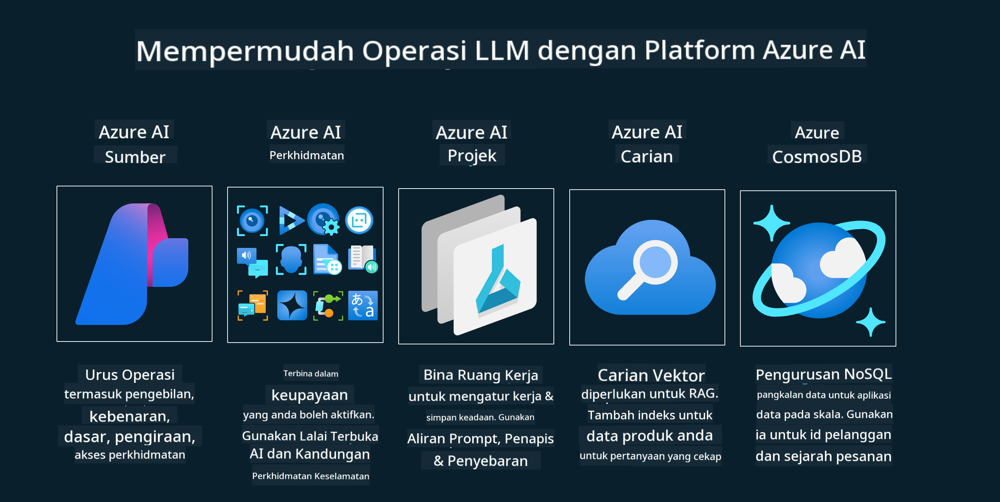
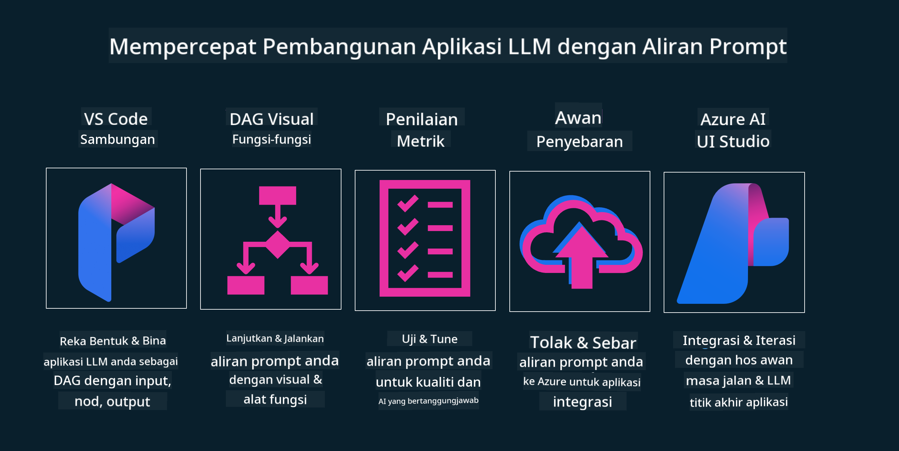

<!--
CO_OP_TRANSLATOR_METADATA:
{
  "original_hash": "27a5347a5022d5ef0a72ab029b03526a",
  "translation_date": "2025-06-25T22:07:41+00:00",
  "source_file": "14-the-generative-ai-application-lifecycle/README.md",
  "language_code": "ms"
}
-->

# Kitaran Hayat Aplikasi AI Generatif

Satu soalan penting untuk semua aplikasi AI adalah relevansi ciri AI, kerana AI adalah bidang yang berkembang pesat, untuk memastikan aplikasi anda kekal relevan, boleh dipercayai, dan kukuh, anda perlu memantau, menilai, dan memperbaikinya secara berterusan. Inilah di mana kitaran hayat AI generatif memainkan peranan.

Kitaran hayat AI generatif adalah rangka kerja yang membimbing anda melalui tahap membangun, melancarkan, dan menyelenggara aplikasi AI generatif. Ia membantu anda untuk menentukan matlamat anda, mengukur prestasi anda, mengenal pasti cabaran anda, dan melaksanakan penyelesaian anda. Ia juga membantu anda untuk menyelaraskan aplikasi anda dengan standard etika dan undang-undang dalam domain anda dan pihak berkepentingan anda. Dengan mengikuti kitaran hayat AI generatif, anda boleh memastikan bahawa aplikasi anda sentiasa memberikan nilai dan memuaskan pengguna anda.

## Pengenalan

Dalam bab ini, anda akan:

- Memahami Peralihan Paradigma dari MLOps ke LLMOps
- Kitaran Hayat LLM
- Alat Kitaran Hayat
- Metrifikasi dan Penilaian Kitaran Hayat

## Memahami Peralihan Paradigma dari MLOps ke LLMOps

LLM adalah alat baru dalam senjata Kecerdasan Buatan, ia sangat berkuasa dalam tugas analisis dan penjanaan untuk aplikasi, namun kekuatan ini mempunyai beberapa akibat dalam cara kita menyelaraskan tugas AI dan Pembelajaran Mesin Klasik.

Dengan ini, kita memerlukan Paradigma baru untuk menyesuaikan alat ini dalam cara dinamik, dengan insentif yang betul. Kita boleh mengkategorikan aplikasi AI lama sebagai "Aplikasi ML" dan Aplikasi AI baru sebagai "Aplikasi GenAI" atau hanya "Aplikasi AI", mencerminkan teknologi dan teknik utama yang digunakan pada masa itu. Ini mengubah naratif kita dalam pelbagai cara, lihat perbandingan berikut.

Perhatikan bahawa dalam LLMOps, kita lebih fokus kepada Pembangun Aplikasi, menggunakan integrasi sebagai titik utama, menggunakan "Model-sebagai-Perkhidmatan" dan memikirkan perkara berikut untuk metrik.

- Kualiti: Kualiti respons
- Bahaya: AI Bertanggungjawab
- Kejujuran: Kebumian respons (Masuk akal? Adakah ia betul?)
- Kos: Bajet Penyelesaian
- Kelewatan: Masa purata untuk respons token

## Kitaran Hayat LLM

Pertama, untuk memahami kitaran hayat dan modifikasi, mari perhatikan infografik berikut.

Seperti yang anda mungkin perhatikan, ini berbeza daripada Kitaran Hayat biasa dari MLOps. LLM mempunyai banyak keperluan baru, seperti Prompting, teknik berbeza untuk meningkatkan kualiti (Fine-Tuning, RAG, Meta-Prompts), penilaian dan tanggungjawab yang berbeza dengan AI bertanggungjawab, akhirnya, metrik penilaian baru (Kualiti, Bahaya, Kejujuran, Kos dan Kelewatan).

Sebagai contoh, lihat bagaimana kita beride. Menggunakan kejuruteraan prompt untuk bereksperimen dengan pelbagai LLM untuk meneroka kemungkinan untuk menguji jika Hipotesis mereka mungkin betul.

Perhatikan bahawa ini bukan linear, tetapi gelung bersepadu, iteratif dan dengan kitaran keseluruhan.

Bagaimana kita boleh meneroka langkah-langkah tersebut? Mari kita perincikan bagaimana kita boleh membina kitaran hayat.

Ini mungkin kelihatan agak rumit, mari kita fokus pada tiga langkah besar terlebih dahulu.

1. Mengideakan/Meneroka: Penerokaan, di sini kita boleh meneroka mengikut keperluan perniagaan kita. Prototyping, mencipta [PromptFlow](https://microsoft.github.io/promptflow/index.html?WT.mc_id=academic-105485-koreyst) dan menguji jika ia cukup efisien untuk Hipotesis kita.
2. Membina/Meningkatkan: Pelaksanaan, sekarang, kita mula menilai untuk set data yang lebih besar melaksanakan teknik, seperti Fine-tuning dan RAG, untuk memeriksa ketahanan penyelesaian kita. Jika tidak, melaksanakannya semula, menambah langkah baru dalam aliran kita atau menyusun semula data, mungkin membantu. Selepas menguji aliran dan skala kita, jika ia berfungsi dan memeriksa Metrik kita, ia sedia untuk langkah seterusnya.
3. Mengoperasikan: Integrasi, kini menambah Sistem Pemantauan dan Amaran kepada sistem kita, pelancaran dan integrasi aplikasi kepada Aplikasi kita.

Kemudian, kita mempunyai kitaran keseluruhan Pengurusan, memberi tumpuan kepada keselamatan, pematuhan dan tadbir urus.

Tahniah, sekarang anda mempunyai Aplikasi AI anda sedia untuk digunakan dan beroperasi. Untuk pengalaman praktikal, lihat [Demo Sembang Contoso.](https://nitya.github.io/contoso-chat/?WT.mc_id=academic-105485-koreys)

Sekarang, apakah alat yang boleh kita gunakan?

## Alat Kitaran Hayat

Untuk Alat, Microsoft menyediakan [Platform AI Azure](https://azure.microsoft.com/solutions/ai/?WT.mc_id=academic-105485-koreys) dan [PromptFlow](https://microsoft.github.io/promptflow/index.html?WT.mc_id=academic-105485-koreyst) memudahkan dan menjadikan kitaran anda mudah untuk dilaksanakan dan sedia digunakan.

[Platform AI Azure](https://azure.microsoft.com/solutions/ai/?WT.mc_id=academic-105485-koreys), membolehkan anda menggunakan [AI Studio](https://ai.azure.com/?WT.mc_id=academic-105485-koreys). AI Studio adalah portal web yang membolehkan anda Meneroka model, sampel dan alat. Menguruskan sumber anda, aliran pembangunan UI dan pilihan SDK/CLI untuk pembangunan Berasaskan Kod.

AI Azure, membolehkan anda menggunakan pelbagai sumber, untuk mengurus operasi, perkhidmatan, projek, carian vektor dan keperluan pangkalan data anda.

Membina, dari Bukti-Konsep (POC) sehingga aplikasi berskala besar dengan PromptFlow:

- Reka dan Bina aplikasi dari VS Code, dengan alat visual dan fungsional
- Uji dan sesuaikan aplikasi anda untuk AI berkualiti, dengan mudah.
- Gunakan Azure AI Studio untuk Mengintegrasi dan Mengulangi dengan awan, Tekan dan Lancar untuk integrasi cepat.

## Hebat! Teruskan Pembelajaran Anda!

Hebat, sekarang pelajari lebih lanjut tentang bagaimana kita menyusun aplikasi untuk menggunakan konsep dengan [Aplikasi Sembang Contoso](https://nitya.github.io/contoso-chat/?WT.mc_id=academic-105485-koreyst), untuk melihat bagaimana Advokasi Awan menambah konsep tersebut dalam demonstrasi. Untuk lebih banyak kandungan, lihat sesi [Ignite breakout kami!
](https://www.youtube.com/watch?v=DdOylyrTOWg)

Sekarang, periksa Pelajaran 15, untuk memahami bagaimana [Retrieval Augmented Generation dan Pangkalan Data Vektor](../15-rag-and-vector-databases/README.md?WT.mc_id=academic-105485-koreyst) mempengaruhi AI Generatif dan menjadikan Aplikasi lebih menarik!

**Penafian**:  
Dokumen ini telah diterjemahkan menggunakan perkhidmatan terjemahan AI [Co-op Translator](https://github.com/Azure/co-op-translator). Walaupun kami berusaha untuk ketepatan, sila ambil perhatian bahawa terjemahan automatik mungkin mengandungi kesilapan atau ketidaktepatan. Dokumen asal dalam bahasa asalnya harus dianggap sebagai sumber yang berwibawa. Untuk maklumat penting, terjemahan manusia profesional disyorkan. Kami tidak bertanggungjawab atas sebarang salah faham atau salah tafsir yang timbul daripada penggunaan terjemahan ini.