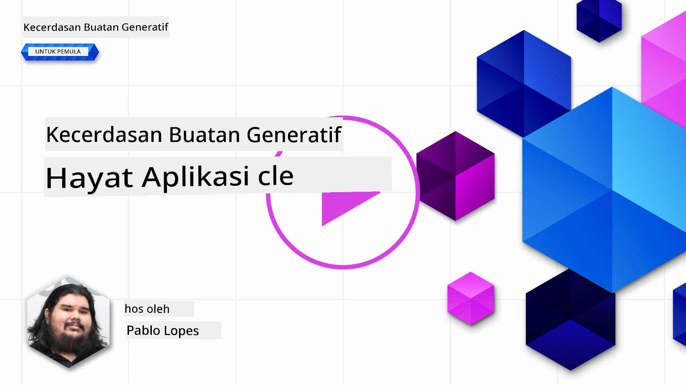
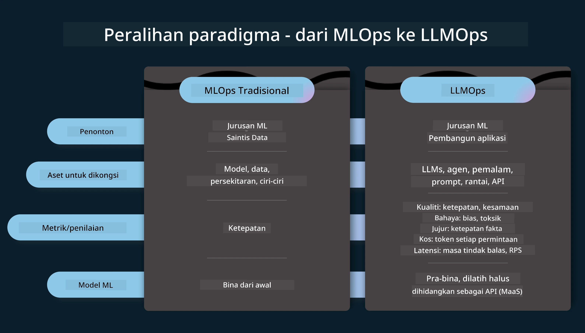
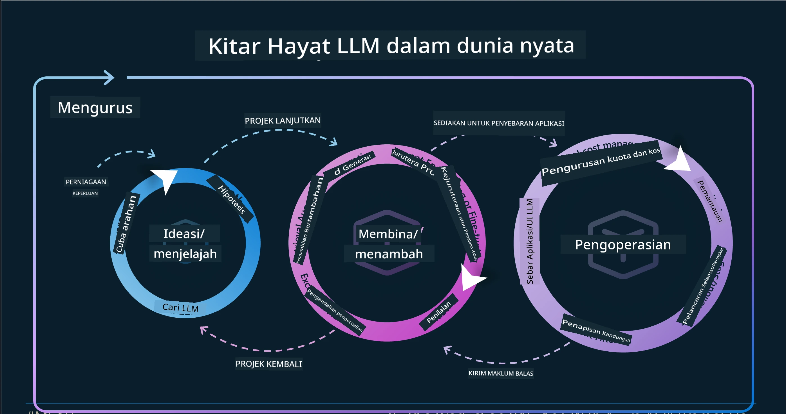
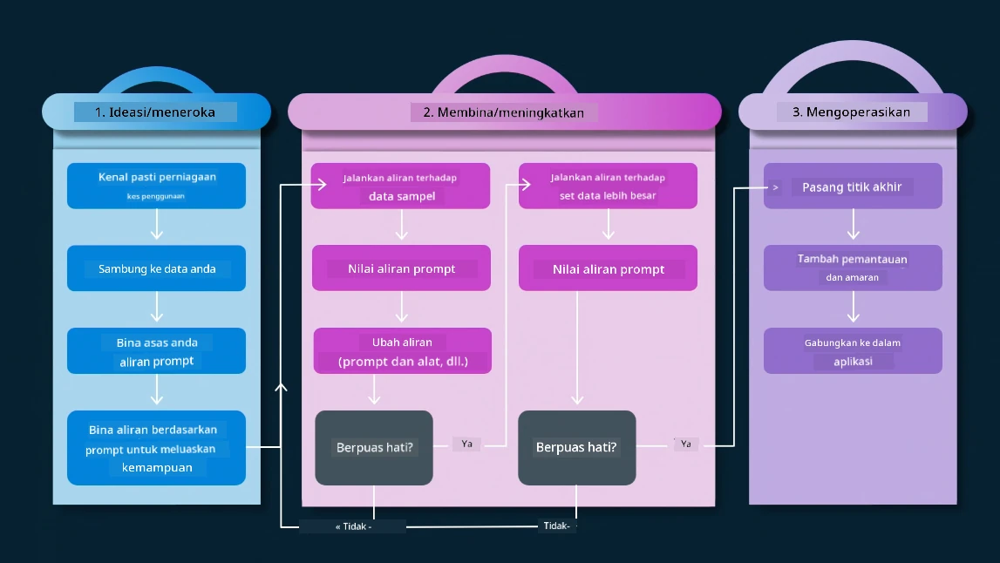
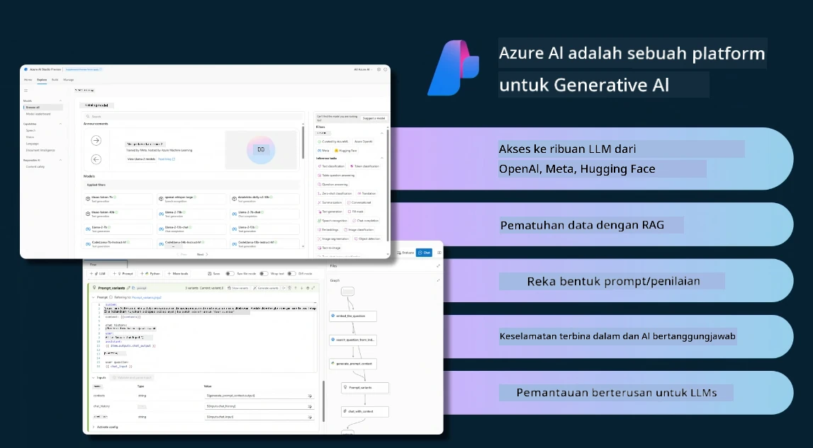
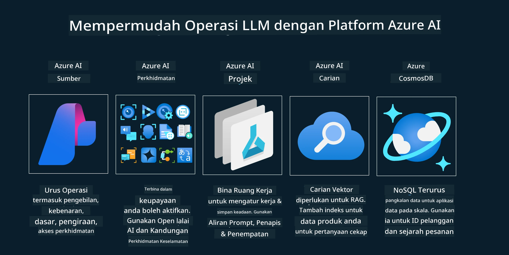
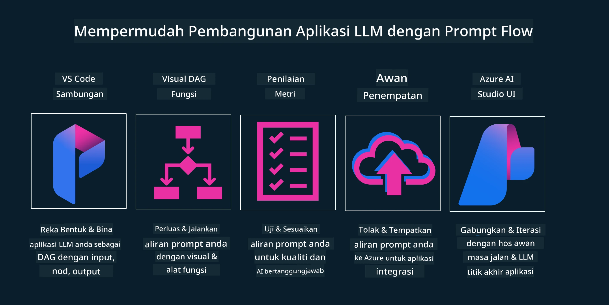

# Kitaran Hayat Aplikasi AI Generatif

Soalan penting untuk semua aplikasi AI adalah kepentingan ciri AI, kerana AI adalah bidang yang berkembang pesat, untuk memastikan aplikasi anda kekal relevan, boleh dipercayai, dan teguh, anda perlu memantau, menilai, dan memperbaikinya secara berterusan. Di sinilah kitaran hayat AI generatif memainkan peranan.

Kitaran hayat AI generatif adalah rangka kerja yang memandu anda melalui peringkat membangun, menyebarkan, dan mengekalkan aplikasi AI generatif. Ia membantu anda mentakrifkan matlamat anda, mengukur prestasi anda, mengenal pasti cabaran anda, dan melaksanakan penyelesaian anda. Ia juga membantu anda menyelaras aplikasi anda dengan piawaian etika dan undang-undang dalam domain dan pihak berkepentingan anda. Dengan mengikuti kitaran hayat AI generatif, anda boleh memastikan aplikasi anda sentiasa memberikan nilai dan memuaskan pengguna anda.

## Pengenalan

Dalam bab ini, anda akan:

- Fahami Peralihan Paradigma dari MLOps ke LLMOps
- Kitaran Hayat LLM
- Peralatan Kitaran Hayat
- Metrifikasi dan Penilaian Kitaran Hayat

## Fahami Peralihan Paradigma dari MLOps ke LLMOps

LLM adalah alat baru dalam arsenal Kecerdasan Buatan, ia sangat berkuasa dalam tugas analisis dan penjanaan untuk aplikasi, namun kuasa ini mempunyai beberapa kesan dalam cara kita memperkemaskan tugas AI dan Pembelajaran Mesin Klasik.

Dengan ini, kita memerlukan Paradigma baru untuk menyesuaikan alat ini secara dinamik, dengan insentif yang betul. Kita boleh mengkategorikan aplikasi AI lama sebagai "Aplikasi ML" dan aplikasi AI baru sebagai "Aplikasi GenAI" atau hanya "Aplikasi AI", mencerminkan teknologi arus perdana dan teknik yang digunakan pada masa itu. Ini mengubah naratif kita dalam beberapa cara, lihat perbandingan berikut.

Perhatikan bahawa dalam LLMOps, kita lebih memberi tumpuan kepada Pembangun Aplikasi, menggunakan integrasi sebagai titik utama, menggunakan "Model-sebagai-Perkhidmatan" dan berfikir dalam perkara berikut untuk metrik.

- Kualiti: Kualiti tindak balas
- Bahaya: AI yang bertanggungjawab
- Kejujuran: Ketepatan asas tindak balas (Masuk akal? Adakah ia betul?)
- Kos: Bajet penyelesaian
- Latensi: Purata masa untuk tindak balas token

## Kitaran Hayat LLM

Pertama, untuk memahami kitaran hayat dan pengubahsuaian, mari perhatikan infografik berikut.

Seperti yang anda mungkin perhatikan, ini berbeza daripada Kitaran Hayat biasa dari MLOps. LLM mempunyai banyak keperluan baru, seperti Prompting, teknik berbeza untuk meningkatkan kualiti (Fine-Tuning, RAG, Meta-Prompts), penilaian dan tanggungjawab berbeza dengan AI yang bertanggungjawab, akhirnya, metrik penilaian baru (Kualiti, Bahaya, Kejujuran, Kos dan Latensi).

Contohnya, lihat bagaimana kita berideasi. Menggunakan kejuruteraan prompt untuk bereksperimen dengan pelbagai LLM bagi meneroka kemungkinan untuk menguji jika Hipotesis mereka boleh betul.

Perhatikan bahawa ini tidak linear, tetapi gelung yang terintegrasi, berulang dan dengan kitaran menyeluruh.

Bagaimana kita boleh meneroka langkah-langkah tersebut? Mari kita lihat dengan lebih terperinci bagaimana kita boleh membina kitaran hayat.

Ini mungkin kelihatan agak rumit, mari fokus pada tiga langkah besar dahulu.

1. Berideasi/Meneroka: Eksplorasi, di sini kita boleh meneroka mengikut keperluan perniagaan kita. Melakukan prototaip, mencipta [PromptFlow](https://microsoft.github.io/promptflow/index.html?WT.mc_id=academic-105485-koreyst) dan menguji jika ia cukup cekap untuk Hipotesis kita.
1. Membangun/Meningkatkan: Pelaksanaan, kini, kita mula menilai data set yang lebih besar dan melaksanakan teknik, seperti Fine-tuning dan RAG, untuk memeriksa keteguhan penyelesaian kita. Jika tidak, melaksanakan semula, menambah langkah baru dalam aliran kita atau menyusun semula data mungkin membantu. Selepas menguji aliran dan skala kita, jika ia berfungsi dan memeriksa Metrik kita, ia sedia untuk langkah seterusnya.
1. Pengoperasian: Integrasi, kini menambah Sistem Pemantauan dan Amaran pada sistem kita, penyebaran dan integrasi aplikasi ke dalam Aplikasi kita.

Kemudian, kita mempunyai kitaran menyeluruh Pengurusan, memfokuskan pada keselamatan, pematuhan dan tadbir urus.

Tahniah, kini anda mempunyai Aplikasi AI yang sedia untuk digunakan dan beroperasi. Untuk pengalaman praktikal, lihat pada [Demo Contoso Chat.](https://nitya.github.io/contoso-chat/?WT.mc_id=academic-105485-koreyst)

Sekarang, alat apa yang boleh kita gunakan?

## Peralatan Kitaran Hayat

Untuk Peralatan, Microsoft menyediakan [Azure AI Platform](https://azure.microsoft.com/solutions/ai/?WT.mc_id=academic-105485-koreyst) dan [PromptFlow](https://microsoft.github.io/promptflow/index.html?WT.mc_id=academic-105485-koreyst) memudahkan dan menjadikan kitaran anda mudah dilaksanakan dan sedia digunakan.

[Azure AI Platform](https://azure.microsoft.com/solutions/ai/?WT.mc_id=academic-105485-koreyst), membolehkan anda menggunakan [AI Studio](https://ai.azure.com/?WT.mc_id=academic-105485-koreyst). AI Studio adalah portal web yang membolehkan anda meneroka model, contoh dan alat. Menguruskan sumber anda, aliran pembangunan UI dan pilihan SDK/CLI untuk pembangunan Kod-Pertama.

Azure AI, membolehkan anda menggunakan pelbagai sumber, untuk mengurus operasi, perkhidmatan, projek, carian vektor dan keperluan pangkalan data anda.

Membina, dari Bukti-Konsep(POC) sehingga aplikasi skala besar dengan PromptFlow:

- Reka dan Bina aplikasi dari VS Code, dengan alat visual dan fungsional
- Uji dan haluskan aplikasi anda untuk AI berkualiti, dengan mudah.
- Gunakan Azure AI Studio untuk Integrasi dan Iterasi dengan awan, Tolak dan Sebarkan untuk integrasi pantas.

## Hebat! Teruskan Pembelajaran anda!

Hebat, sekarang pelajari lebih lanjut tentang bagaimana kita menyusun aplikasi untuk menggunakan konsep dengan [Aplikasi Contoso Chat](https://nitya.github.io/contoso-chat/?WT.mc_id=academic-105485-koreyst), untuk melihat bagaimana Cloud Advocacy menambah konsep tersebut dalam demonstrasi. Untuk lebih kandungan, lihat sesi pecahan [Ignite kami!
](https://www.youtube.com/watch?v=DdOylyrTOWg)

Sekarang, semak Pelajaran 15, untuk memahami bagaimana [Penjanaan Dipertingkatkan Pengambilan dan Pangkalan Data Vektor](../15-rag-and-vector-databases/README.md?WT.mc_id=academic-105485-koreyst) memberi impak pada AI Generatif dan untuk menjadikan Aplikasi lebih menarik!

---

<!-- CO-OP TRANSLATOR DISCLAIMER START -->
**Penafian**:  
Dokumen ini telah diterjemahkan menggunakan perkhidmatan terjemahan AI [Co-op Translator](https://github.com/Azure/co-op-translator). Walaupun kami berusaha untuk ketepatan, sila ambil perhatian bahawa terjemahan automatik mungkin mengandungi kesilapan atau ketidaktepatan. Dokumen asal dalam bahasa asalnya harus dianggap sebagai sumber yang sahih. Untuk maklumat penting, terjemahan profesional oleh manusia adalah disyorkan. Kami tidak bertanggungjawab atas sebarang salah faham atau salah tafsir yang timbul daripada penggunaan terjemahan ini.
<!-- CO-OP TRANSLATOR DISCLAIMER END -->