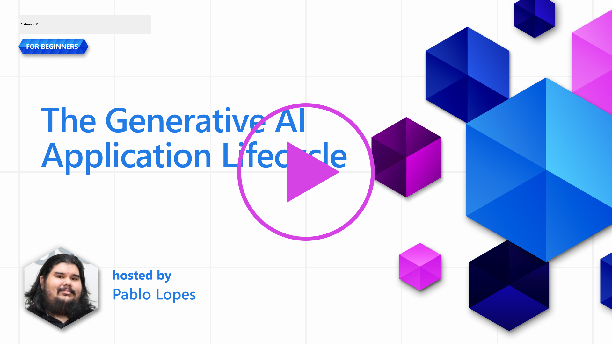
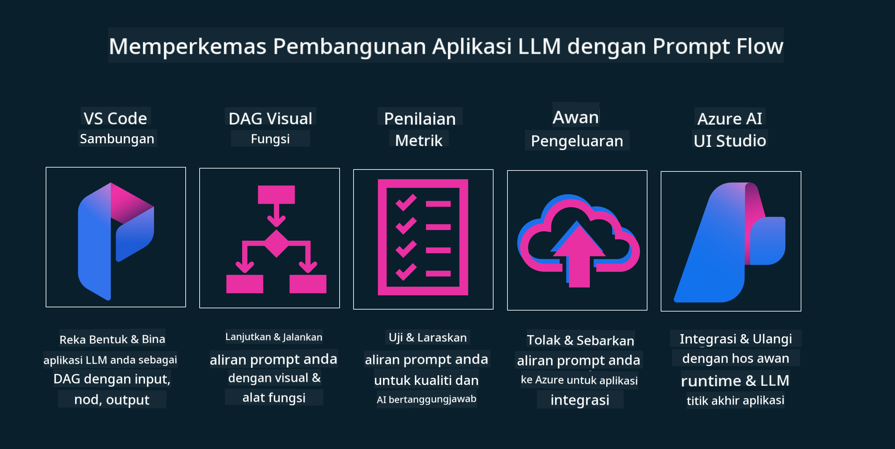

<!--
CO_OP_TRANSLATOR_METADATA:
{
  "original_hash": "b9d32511b27373a1b21b5789d4fda057",
  "translation_date": "2025-10-17T20:57:02+00:00",
  "source_file": "14-the-generative-ai-application-lifecycle/README.md",
  "language_code": "ms"
}
-->

# Kitaran Hayat Aplikasi AI Generatif

Satu persoalan penting untuk semua aplikasi AI adalah relevansi ciri AI, kerana AI adalah bidang yang berkembang pesat. Untuk memastikan aplikasi anda kekal relevan, boleh dipercayai, dan kukuh, anda perlu memantau, menilai, dan memperbaikinya secara berterusan. Di sinilah kitaran hayat AI generatif memainkan peranan.

Kitaran hayat AI generatif adalah kerangka kerja yang membimbing anda melalui peringkat pembangunan, pelaksanaan, dan penyelenggaraan aplikasi AI generatif. Ia membantu anda menentukan matlamat, mengukur prestasi, mengenal pasti cabaran, dan melaksanakan penyelesaian. Ia juga membantu anda menyelaraskan aplikasi anda dengan piawaian etika dan undang-undang dalam bidang anda serta pihak berkepentingan. Dengan mengikuti kitaran hayat AI generatif, anda dapat memastikan aplikasi anda sentiasa memberikan nilai dan memenuhi keperluan pengguna.

## Pengenalan

Dalam bab ini, anda akan:

- Memahami Peralihan Paradigma dari MLOps ke LLMOps
- Kitaran Hayat LLM
- Alat untuk Kitaran Hayat
- Metrik dan Penilaian Kitaran Hayat

## Memahami Peralihan Paradigma dari MLOps ke LLMOps

LLM adalah alat baru dalam senjata Kecerdasan Buatan, ia sangat berkuasa dalam tugas analisis dan generasi untuk aplikasi. Namun, kuasa ini membawa beberapa kesan terhadap cara kita mengoptimumkan tugas AI dan Pembelajaran Mesin Klasik.

Dengan ini, kita memerlukan Paradigma baru untuk menyesuaikan alat ini secara dinamik, dengan insentif yang betul. Kita boleh mengkategorikan aplikasi AI lama sebagai "Aplikasi ML" dan aplikasi AI baru sebagai "Aplikasi GenAI" atau hanya "Aplikasi AI", mencerminkan teknologi dan teknik utama yang digunakan pada masa itu. Ini mengubah naratif kita dalam pelbagai cara, lihat perbandingan berikut.

Perhatikan bahawa dalam LLMOps, kita lebih fokus kepada Pembangun Aplikasi, menggunakan integrasi sebagai titik utama, menggunakan "Model-sebagai-Perkhidmatan" dan memikirkan perkara berikut untuk metrik.

- Kualiti: Kualiti respons
- Bahaya: AI yang bertanggungjawab
- Kejujuran: Ketepatan respons (Adakah masuk akal? Adakah ia betul?)
- Kos: Bajet penyelesaian
- Kelewatan: Masa purata untuk respons token

## Kitaran Hayat LLM

Pertama, untuk memahami kitaran hayat dan pengubahsuaian, mari kita perhatikan infografik berikut.

Seperti yang anda perhatikan, ini berbeza daripada Kitaran Hayat biasa dalam MLOps. LLM mempunyai banyak keperluan baru, seperti Prompting, teknik berbeza untuk meningkatkan kualiti (Fine-Tuning, RAG, Meta-Prompts), penilaian dan tanggungjawab dengan AI yang bertanggungjawab, dan akhirnya, metrik penilaian baru (Kualiti, Bahaya, Kejujuran, Kos dan Kelewatan).

Sebagai contoh, lihat bagaimana kita mencipta idea. Menggunakan kejuruteraan prompt untuk bereksperimen dengan pelbagai LLM bagi meneroka kemungkinan untuk menguji sama ada Hipotesis mereka boleh betul.

Perhatikan bahawa ini bukan linear, tetapi gelung bersepadu, iteratif dan dengan kitaran menyeluruh.

Bagaimana kita boleh meneroka langkah-langkah tersebut? Mari kita perincikan bagaimana kita boleh membina kitaran hayat.

Ini mungkin kelihatan agak rumit, mari kita fokus pada tiga langkah besar terlebih dahulu.

1. Mencipta Idea/Meneroka: Penerokaan, di sini kita boleh meneroka mengikut keperluan perniagaan kita. Membuat prototaip, mencipta [PromptFlow](https://microsoft.github.io/promptflow/index.html?WT.mc_id=academic-105485-koreyst) dan menguji sama ada ia cukup cekap untuk Hipotesis kita.
2. Membina/Meningkatkan: Pelaksanaan, sekarang, kita mula menilai untuk dataset yang lebih besar, melaksanakan teknik seperti Fine-tuning dan RAG, untuk memeriksa ketahanan penyelesaian kita. Jika tidak, melaksanakannya semula, menambah langkah baru dalam aliran kita atau menyusun semula data, mungkin membantu. Selepas menguji aliran dan skala kita, jika ia berfungsi dan memenuhi Metrik kita, ia sedia untuk langkah seterusnya.
3. Mengoperasikan: Integrasi, kini menambah Sistem Pemantauan dan Amaran kepada sistem kita, pelaksanaan dan integrasi aplikasi kepada Aplikasi kita.

Kemudian, kita mempunyai kitaran menyeluruh Pengurusan, yang memberi tumpuan kepada keselamatan, pematuhan dan tadbir urus.

Tahniah, kini anda mempunyai Aplikasi AI yang sedia untuk digunakan dan beroperasi. Untuk pengalaman langsung, lihat [Demo Contoso Chat.](https://nitya.github.io/contoso-chat/?WT.mc_id=academic-105485-koreys)

Sekarang, alat apa yang boleh kita gunakan?

## Alat untuk Kitaran Hayat

Untuk alat, Microsoft menyediakan [Platform AI Azure](https://azure.microsoft.com/solutions/ai/?WT.mc_id=academic-105485-koreys) dan [PromptFlow](https://microsoft.github.io/promptflow/index.html?WT.mc_id=academic-105485-koreyst) untuk memudahkan dan menjadikan kitaran anda mudah dilaksanakan dan sedia digunakan.

[Platform AI Azure](https://azure.microsoft.com/solutions/ai/?WT.mc_id=academic-105485-koreys) membolehkan anda menggunakan [AI Studio](https://ai.azure.com/?WT.mc_id=academic-105485-koreys). AI Studio adalah portal web yang membolehkan anda meneroka model, sampel dan alat. Menguruskan sumber anda, aliran pembangunan UI dan pilihan SDK/CLI untuk pembangunan berasaskan kod.

Azure AI membolehkan anda menggunakan pelbagai sumber untuk menguruskan operasi, perkhidmatan, projek, carian vektor dan keperluan pangkalan data anda.

Bina, dari Bukti-Konsep (POC) sehingga aplikasi berskala besar dengan PromptFlow:

- Reka bentuk dan bina aplikasi dari VS Code, dengan alat visual dan fungsional
- Uji dan tingkatkan aplikasi anda untuk AI berkualiti, dengan mudah.
- Gunakan AI Studio Azure untuk Integrasi dan Iterasi dengan awan, Push dan Deploy untuk integrasi pantas.

## Hebat! Teruskan Pembelajaran Anda!

Hebat, kini pelajari lebih lanjut tentang bagaimana kami menyusun aplikasi untuk menggunakan konsep dengan [Aplikasi Contoso Chat](https://nitya.github.io/contoso-chat/?WT.mc_id=academic-105485-koreyst), untuk melihat bagaimana Cloud Advocacy menambah konsep tersebut dalam demonstrasi. Untuk kandungan lebih lanjut, lihat [sesi pecahan di Ignite!
](https://www.youtube.com/watch?v=DdOylyrTOWg)

Sekarang, lihat Pelajaran 15, untuk memahami bagaimana [Retrieval Augmented Generation dan Pangkalan Data Vektor](../15-rag-and-vector-databases/README.md?WT.mc_id=academic-105485-koreyst) mempengaruhi AI Generatif dan untuk membuat Aplikasi yang lebih menarik!

---

**Penafian**:  
Dokumen ini telah diterjemahkan menggunakan perkhidmatan terjemahan AI [Co-op Translator](https://github.com/Azure/co-op-translator). Walaupun kami berusaha untuk ketepatan, sila ambil perhatian bahawa terjemahan automatik mungkin mengandungi kesilapan atau ketidaktepatan. Dokumen asal dalam bahasa asalnya harus dianggap sebagai sumber yang berwibawa. Untuk maklumat penting, terjemahan manusia profesional adalah disyorkan. Kami tidak bertanggungjawab atas sebarang salah faham atau salah tafsir yang timbul daripada penggunaan terjemahan ini.