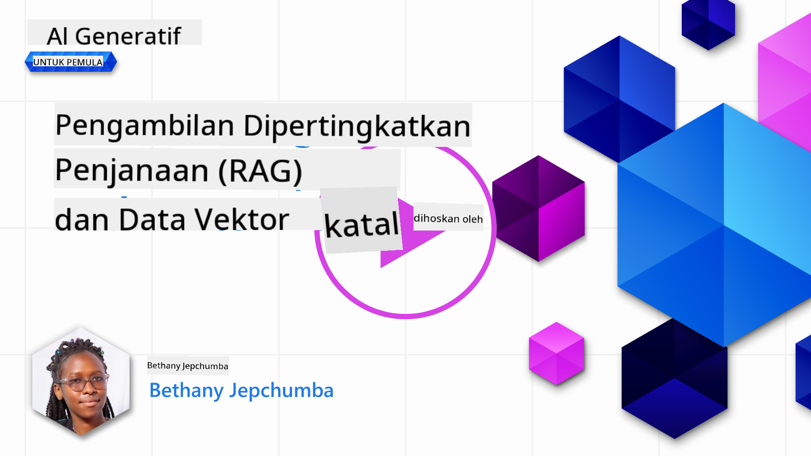
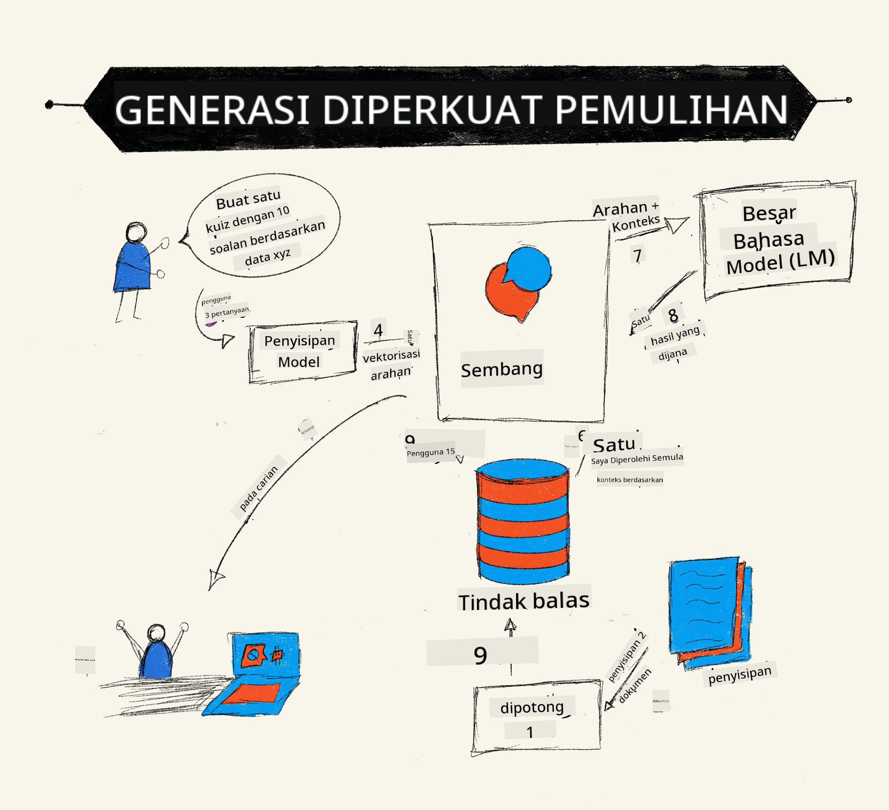
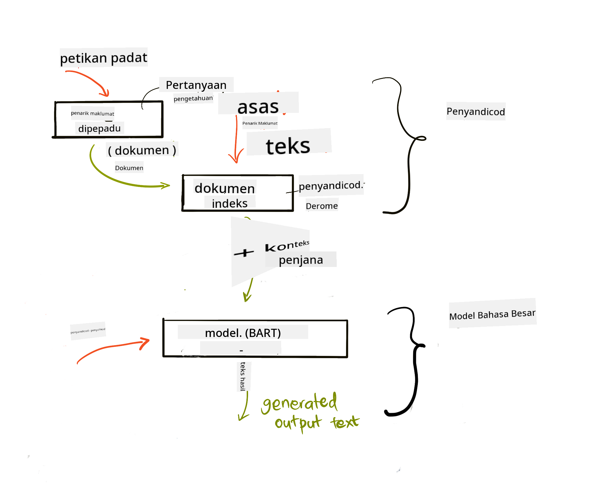

<!--
CO_OP_TRANSLATOR_METADATA:
{
  "original_hash": "e2861bbca91c0567ef32bc77fe054f9e",
  "translation_date": "2025-05-20T01:37:30+00:00",
  "source_file": "15-rag-and-vector-databases/README.md",
  "language_code": "ms"
}
-->
# Retrieval Augmented Generation (RAG) dan Pangkalan Data Vektor

[](https://aka.ms/gen-ai-lesson15-gh?WT.mc_id=academic-105485-koreyst)

Dalam pelajaran aplikasi pencarian, kita telah mempelajari secara ringkas cara mengintegrasikan data anda sendiri ke dalam Model Bahasa Besar (LLM). Dalam pelajaran ini, kita akan menyelidiki lebih lanjut konsep menanamkan data anda dalam aplikasi LLM, mekanisme proses dan kaedah untuk menyimpan data, termasuk kedua-dua embedding dan teks.

> **Video Akan Datang**

## Pengenalan

Dalam pelajaran ini kita akan meliputi perkara berikut:

- Pengenalan kepada RAG, apa itu dan mengapa ia digunakan dalam AI (kecerdasan buatan).

- Memahami apa itu pangkalan data vektor dan menciptanya untuk aplikasi kita.

- Contoh praktikal tentang cara mengintegrasikan RAG ke dalam aplikasi.

## Matlamat Pembelajaran

Setelah menyelesaikan pelajaran ini, anda akan dapat:

- Menerangkan kepentingan RAG dalam pengambilan dan pemprosesan data.

- Menyediakan aplikasi RAG dan menanamkan data anda ke dalam LLM

- Integrasi efektif RAG dan Pangkalan Data Vektor dalam Aplikasi LLM.

## Senario Kami: meningkatkan LLM kami dengan data kami sendiri

Untuk pelajaran ini, kita ingin menambah nota kita sendiri ke dalam startup pendidikan, yang membolehkan chatbot mendapatkan lebih banyak maklumat tentang subjek yang berbeza. Menggunakan nota yang kita ada, pelajar akan dapat belajar dengan lebih baik dan memahami topik yang berbeza, memudahkan mereka untuk membuat ulangkaji untuk peperiksaan mereka. Untuk mencipta senario kita, kita akan menggunakan:

- `Azure OpenAI:` LLM yang akan kita gunakan untuk mencipta chatbot kita

- `AI for beginners' lesson on Neural Networks`: ini akan menjadi data yang kita tanamkan ke dalam LLM kita

- `Azure AI Search` dan `Azure Cosmos DB:` pangkalan data vektor untuk menyimpan data kita dan mencipta indeks carian

Pengguna akan dapat mencipta kuiz latihan dari nota mereka, kad flash ulangkaji dan meringkaskannya kepada gambaran ringkas. Untuk memulakan, mari kita lihat apa itu RAG dan bagaimana ia berfungsi:

## Retrieval Augmented Generation (RAG)

Chatbot yang dikuasakan oleh LLM memproses arahan pengguna untuk menjana respons. Ia direka untuk menjadi interaktif dan berinteraksi dengan pengguna dalam pelbagai topik. Walau bagaimanapun, responsnya terhad kepada konteks yang diberikan dan data latihan asasnya. Sebagai contoh, pemotongan pengetahuan GPT-4 adalah September 2021, yang bermaksud, ia tidak mempunyai pengetahuan tentang peristiwa yang berlaku selepas tempoh ini. Selain itu, data yang digunakan untuk melatih LLM tidak termasuk maklumat sulit seperti nota peribadi atau manual produk syarikat.

### Bagaimana RAGs (Retrieval Augmented Generation) berfungsi



Katakan anda ingin menyebarkan chatbot yang mencipta kuiz dari nota anda, anda akan memerlukan sambungan ke pangkalan pengetahuan. Di sinilah RAG datang untuk menyelamatkan. RAGs beroperasi seperti berikut:

- **Pangkalan pengetahuan:** Sebelum pengambilan, dokumen ini perlu diambil dan diproses terlebih dahulu, biasanya memecah dokumen besar menjadi potongan kecil, mengubahnya menjadi embedding teks dan menyimpannya dalam pangkalan data.

- **Pertanyaan Pengguna:** pengguna bertanya soalan

- **Pengambilan:** Apabila pengguna bertanya soalan, model embedding mengambil maklumat yang relevan dari pangkalan pengetahuan kita untuk memberikan lebih banyak konteks yang akan dimasukkan ke dalam arahan.

- **Penjanaan Ditingkatkan:** LLM meningkatkan responsnya berdasarkan data yang diambil. Ia membolehkan respons yang dijana bukan sahaja berdasarkan data pra-latihan tetapi juga maklumat yang relevan dari konteks tambahan. Data yang diambil digunakan untuk meningkatkan respons LLM. LLM kemudian mengembalikan jawapan kepada soalan pengguna.



Seni bina untuk RAGs dilaksanakan menggunakan transformer yang terdiri daripada dua bahagian: encoder dan decoder. Sebagai contoh, apabila pengguna bertanya soalan, teks input 'diekodkan' ke dalam vektor yang menangkap makna perkataan dan vektor 'didekodkan' ke dalam indeks dokumen kita dan menjana teks baru berdasarkan pertanyaan pengguna. LLM menggunakan model encoder-decoder untuk menjana output.

Dua pendekatan ketika melaksanakan RAG menurut kertas cadangan: [Retrieval-Augmented Generation for Knowledge intensive NLP (perisian pemprosesan bahasa semula jadi) Tasks](https://arxiv.org/pdf/2005.11401.pdf?WT.mc_id=academic-105485-koreyst) adalah:

- **_RAG-Sequence_** menggunakan dokumen yang diambil untuk meramalkan jawapan terbaik kepada pertanyaan pengguna

- **RAG-Token** menggunakan dokumen untuk menjana token seterusnya, kemudian mengambilnya untuk menjawab pertanyaan pengguna

### Mengapa anda akan menggunakan RAGs? 

- **Kekayaan maklumat:** memastikan respons teks adalah terkini dan semasa. Oleh itu, ia meningkatkan prestasi pada tugas khusus domain dengan mengakses pangkalan pengetahuan dalaman.

- Mengurangkan fabrikasi dengan menggunakan **data yang dapat diverifikasi** dalam pangkalan pengetahuan untuk memberikan konteks kepada pertanyaan pengguna.

- Ia adalah **kos efektif** kerana ia lebih ekonomi berbanding menyempurnakan LLM

## Mencipta pangkalan pengetahuan

Aplikasi kita berdasarkan data peribadi kita iaitu, pelajaran Neural Network dalam kurikulum AI Untuk Pemula.

### Pangkalan Data Vektor

Pangkalan data vektor, tidak seperti pangkalan data tradisional, adalah pangkalan data khusus yang direka untuk menyimpan, mengurus dan mencari vektor terbenam. Ia menyimpan perwakilan numerik dokumen. Memecahkan data kepada embedding numerik memudahkan sistem AI kita untuk memahami dan memproses data.

Kita menyimpan embedding kita dalam pangkalan data vektor kerana LLM mempunyai had bilangan token yang diterima sebagai input. Oleh kerana anda tidak boleh melewati seluruh embedding ke LLM, kita perlu memecahkannya kepada potongan dan apabila pengguna bertanya soalan, embedding yang paling mirip dengan soalan akan dikembalikan bersama dengan arahan. Pemecahan juga mengurangkan kos pada bilangan token yang dilalui melalui LLM.

Beberapa pangkalan data vektor popular termasuk Azure Cosmos DB, Clarifyai, Pinecone, Chromadb, ScaNN, Qdrant dan DeepLake. Anda boleh mencipta model Azure Cosmos DB menggunakan Azure CLI dengan arahan berikut:

```bash
az login
az group create -n <resource-group-name> -l <location>
az cosmosdb create -n <cosmos-db-name> -r <resource-group-name>
az cosmosdb list-keys -n <cosmos-db-name> -g <resource-group-name>
```

### Dari teks ke embedding

Sebelum kita menyimpan data kita, kita perlu menukarnya kepada embedding vektor sebelum ia disimpan dalam pangkalan data. Jika anda bekerja dengan dokumen besar atau teks panjang, anda boleh memecahkannya berdasarkan pertanyaan yang anda jangkakan. Pemecahan boleh dilakukan pada tahap ayat, atau pada tahap perenggan. Oleh kerana pemecahan memperoleh makna dari perkataan di sekelilingnya, anda boleh menambah konteks lain kepada potongan, contohnya, dengan menambah tajuk dokumen atau memasukkan beberapa teks sebelum atau selepas potongan. Anda boleh memecahkan data seperti berikut:

```python
def split_text(text, max_length, min_length):
    words = text.split()
    chunks = []
    current_chunk = []

    for word in words:
        current_chunk.append(word)
        if len(' '.join(current_chunk)) < max_length and len(' '.join(current_chunk)) > min_length:
            chunks.append(' '.join(current_chunk))
            current_chunk = []

    # If the last chunk didn't reach the minimum length, add it anyway
    if current_chunk:
        chunks.append(' '.join(current_chunk))

    return chunks
```

Setelah dipotong, kita boleh mengembed teks kita menggunakan model embedding yang berbeza. Beberapa model yang boleh anda gunakan termasuk: word2vec, ada-002 oleh OpenAI, Azure Computer Vision dan banyak lagi. Memilih model untuk digunakan bergantung pada bahasa yang anda gunakan, jenis kandungan yang dikodkan (teks/imej/audio), saiz input yang dapat dikodkan dan panjang output embedding.

Contoh teks yang diembed menggunakan model `text-embedding-ada-002` OpenAI adalah:


## Pengambilan dan Carian Vektor

Apabila pengguna bertanya soalan, pengambil menukarkannya kepada vektor menggunakan encoder pertanyaan, kemudian mencari melalui indeks carian dokumen kita untuk vektor yang relevan dalam dokumen yang berkaitan dengan input. Setelah selesai, ia menukarkan kedua-dua vektor input dan vektor dokumen kepada teks dan melepaskannya melalui LLM.

### Pengambilan

Pengambilan berlaku apabila sistem cuba dengan cepat mencari dokumen dari indeks yang memenuhi kriteria carian. Matlamat pengambil adalah untuk mendapatkan dokumen yang akan digunakan untuk memberikan konteks dan menanamkan LLM pada data anda.

Terdapat beberapa cara untuk melakukan carian dalam pangkalan data kita seperti:

- **Carian kata kunci** - digunakan untuk carian teks

- **Carian semantik** - menggunakan makna semantik perkataan

- **Carian vektor** - menukar dokumen dari teks kepada perwakilan vektor menggunakan model embedding. Pengambilan akan dilakukan dengan membuat pertanyaan kepada dokumen yang perwakilan vektornya paling hampir dengan soalan pengguna.

- **Hibrid** - gabungan kedua-dua carian kata kunci dan vektor.

Cabaran dengan pengambilan timbul apabila tiada respons yang serupa dengan pertanyaan dalam pangkalan data, sistem kemudian akan mengembalikan maklumat terbaik yang mereka dapat, namun, anda boleh menggunakan taktik seperti menetapkan jarak maksimum untuk relevan atau menggunakan carian hibrid yang menggabungkan kedua-dua kata kunci dan carian vektor. Dalam pelajaran ini kita akan menggunakan carian hibrid, gabungan kedua-dua carian vektor dan kata kunci. Kita akan menyimpan data kita ke dalam dataframe dengan lajur yang mengandungi potongan serta embedding.

### Kesamaan Vektor

Pengambil akan mencari melalui pangkalan pengetahuan untuk embedding yang dekat, jiran terdekat, kerana mereka adalah teks yang serupa. Dalam senario pengguna bertanya pertanyaan, ia pertama kali diembed kemudian dipadankan dengan embedding yang serupa. Pengukuran umum yang digunakan untuk mencari sejauh mana serupa vektor yang berbeza adalah kesamaan kosinus yang berdasarkan pada sudut antara dua vektor.

Kita boleh mengukur kesamaan menggunakan alternatif lain seperti jarak Euclidean yang merupakan garis lurus antara titik akhir vektor dan hasil titik yang mengukur jumlah produk unsur yang bersesuaian dari dua vektor.

### Indeks carian

Apabila melakukan pengambilan, kita perlu membina indeks carian untuk pangkalan pengetahuan kita sebelum kita melakukan carian. Indeks akan menyimpan embedding kita dan dapat dengan cepat mengambil potongan yang paling serupa walaupun dalam pangkalan data yang besar. Kita boleh mencipta indeks kita secara tempatan menggunakan:

```python
from sklearn.neighbors import NearestNeighbors

embeddings = flattened_df['embeddings'].to_list()

# Create the search index
nbrs = NearestNeighbors(n_neighbors=5, algorithm='ball_tree').fit(embeddings)

# To query the index, you can use the kneighbors method
distances, indices = nbrs.kneighbors(embeddings)
```

### Penyusunan semula

Setelah anda membuat pertanyaan ke pangkalan data, anda mungkin perlu menyusun hasil dari yang paling relevan. LLM penyusunan semula menggunakan Pembelajaran Mesin untuk meningkatkan relevansi hasil carian dengan mengatur mereka dari yang paling relevan. Menggunakan Carian AI Azure, penyusunan semula dilakukan secara automatik untuk anda menggunakan penyusun semantik. Contoh bagaimana penyusunan semula berfungsi menggunakan jiran terdekat:

```python
# Find the most similar documents
distances, indices = nbrs.kneighbors([query_vector])

index = []
# Print the most similar documents
for i in range(3):
    index = indices[0][i]
    for index in indices[0]:
        print(flattened_df['chunks'].iloc[index])
        print(flattened_df['path'].iloc[index])
        print(flattened_df['distances'].iloc[index])
    else:
        print(f"Index {index} not found in DataFrame")
```

## Menggabungkan semuanya

Langkah terakhir adalah menambah LLM kita ke dalam campuran untuk mendapatkan respons yang ditanamkan pada data kita. Kita boleh melaksanakannya seperti berikut:

```python
user_input = "what is a perceptron?"

def chatbot(user_input):
    # Convert the question to a query vector
    query_vector = create_embeddings(user_input)

    # Find the most similar documents
    distances, indices = nbrs.kneighbors([query_vector])

    # add documents to query  to provide context
    history = []
    for index in indices[0]:
        history.append(flattened_df['chunks'].iloc[index])

    # combine the history and the user input
    history.append(user_input)

    # create a message object
    messages=[
        {"role": "system", "content": "You are an AI assistant that helps with AI questions."},
        {"role": "user", "content": history[-1]}
    ]

    # use chat completion to generate a response
    response = openai.chat.completions.create(
        model="gpt-4",
        temperature=0.7,
        max_tokens=800,
        messages=messages
    )

    return response.choices[0].message

chatbot(user_input)
```

## Menilai aplikasi kita

### Metrik Penilaian

- Kualiti respons yang dibekalkan memastikan ia terdengar semula jadi, lancar dan seperti manusia

- Ketertanaman data: menilai sama ada respons yang datang dari dokumen yang dibekalkan

- Relevansi: menilai respons yang sepadan dan berkaitan dengan soalan yang ditanya

- Kefasihan - sama ada respons masuk akal secara tatabahasa

## Kes Penggunaan untuk menggunakan RAG (Retrieval Augmented Generation) dan pangkalan data vektor

Terdapat banyak kes penggunaan yang berbeza di mana panggilan fungsi boleh meningkatkan aplikasi anda seperti:

- Soal Jawab: menanamkan data syarikat anda kepada chat yang boleh digunakan oleh pekerja untuk bertanya soalan.

- Sistem Cadangan: di mana anda boleh mencipta sistem yang memadankan nilai yang paling serupa contohnya filem, restoran dan banyak lagi.

- Perkhidmatan Chatbot: anda boleh menyimpan sejarah chat dan memperibadikan perbualan berdasarkan data pengguna.

- Carian imej berdasarkan embedding vektor, berguna ketika melakukan pengecaman imej dan pengesanan anomali.

## Ringkasan

Kita telah meliputi kawasan asas RAG dari menambah data kita ke aplikasi, pertanyaan pengguna dan output. Untuk memudahkan penciptaan RAG, anda boleh menggunakan rangka kerja seperti Semanti Kernel, Langchain atau Autogen.

## Tugasan

Untuk meneruskan pembelajaran anda tentang Retrieval Augmented Generation (RAG) anda boleh membina:

- Membina bahagian hadapan untuk aplikasi menggunakan rangka kerja pilihan anda

- Menggunakan rangka kerja, sama ada LangChain atau Semantik Kernel, dan mencipta semula aplikasi anda.

Tahniah kerana menyelesaikan pelajaran ini 👏.

## Pembelajaran tidak berhenti di sini, teruskan Perjalanan

Setelah menyelesaikan pelajaran ini, lihat koleksi Pembelajaran AI Generatif kami [Generative AI Learning collection](https://aka.ms/genai-collection?WT.mc_id=academic-105485-koreyst) untuk terus meningkatkan pengetahuan AI Generatif anda!

**Penafian**:  
Dokumen ini telah diterjemahkan menggunakan perkhidmatan terjemahan AI [Co-op Translator](https://github.com/Azure/co-op-translator). Walaupun kami berusaha untuk ketepatan, sila ambil perhatian bahawa terjemahan automatik mungkin mengandungi kesilapan atau ketidaktepatan. Dokumen asal dalam bahasa asalnya harus dianggap sebagai sumber yang berwibawa. Untuk maklumat penting, terjemahan manusia profesional adalah disyorkan. Kami tidak bertanggungjawab atas sebarang salah faham atau salah tafsir yang timbul daripada penggunaan terjemahan ini.