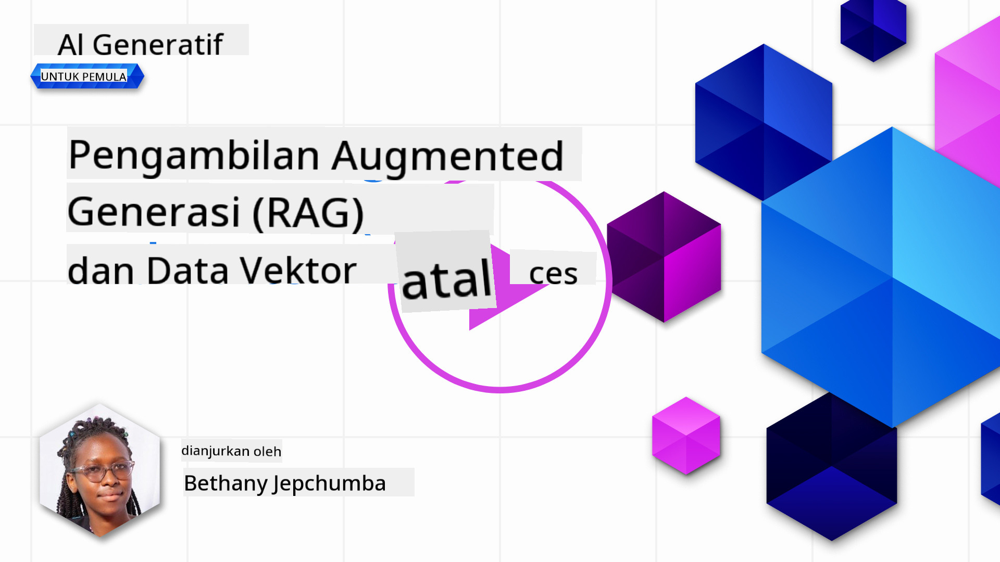
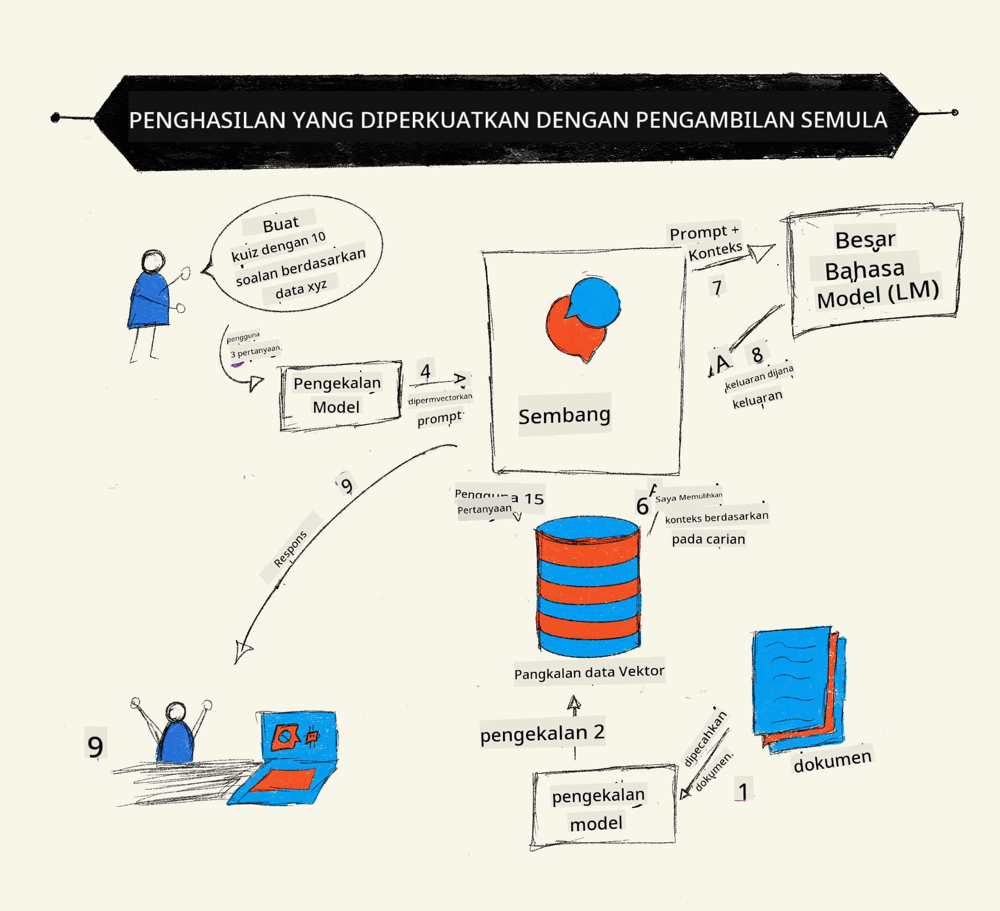
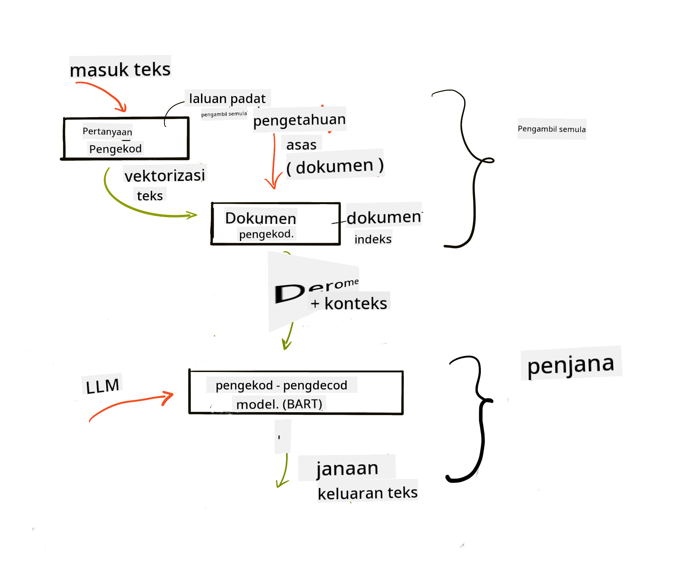
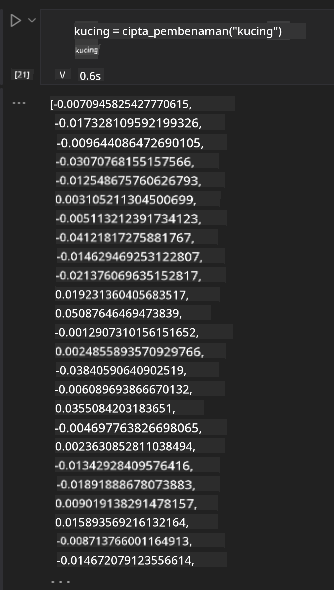

<!--
CO_OP_TRANSLATOR_METADATA:
{
  "original_hash": "e2861bbca91c0567ef32bc77fe054f9e",
  "translation_date": "2025-06-25T22:40:51+00:00",
  "source_file": "15-rag-and-vector-databases/README.md",
  "language_code": "ms"
}
-->
# Retrieval Augmented Generation (RAG) dan Pangkalan Data Vektor

[](https://aka.ms/gen-ai-lesson15-gh?WT.mc_id=academic-105485-koreyst)

Dalam pelajaran aplikasi carian, kita telah belajar secara ringkas bagaimana untuk mengintegrasikan data anda sendiri ke dalam Model Bahasa Besar (LLM). Dalam pelajaran ini, kita akan mendalami lagi konsep mengekalkan data anda dalam aplikasi LLM anda, mekanik proses dan kaedah untuk menyimpan data, termasuk kedua-dua pengekodan dan teks.

> **Video Akan Datang**

## Pengenalan

Dalam pelajaran ini kita akan merangkumi perkara berikut:

- Pengenalan kepada RAG, apa itu dan mengapa ia digunakan dalam AI (kecerdasan buatan).

- Memahami apa itu pangkalan data vektor dan menciptanya untuk aplikasi kita.

- Contoh praktikal bagaimana untuk mengintegrasikan RAG ke dalam aplikasi.

## Matlamat Pembelajaran

Selepas menyelesaikan pelajaran ini, anda akan dapat:

- Menerangkan kepentingan RAG dalam pengambilan dan pemprosesan data.

- Menyediakan aplikasi RAG dan menghubungkan data anda ke LLM

- Integrasi efektif RAG dan Pangkalan Data Vektor dalam Aplikasi LLM.

## Senario Kita: meningkatkan LLM kita dengan data kita sendiri

Untuk pelajaran ini, kita ingin menambah nota kita sendiri ke dalam startup pendidikan, yang membolehkan chatbot mendapatkan lebih banyak maklumat tentang subjek yang berbeza. Menggunakan nota yang kita ada, pelajar akan dapat belajar dengan lebih baik dan memahami topik yang berbeza, memudahkan mereka untuk membuat ulang kaji untuk peperiksaan mereka. Untuk mencipta senario kita, kita akan menggunakan:

- `Azure OpenAI:` LLM yang kita akan gunakan untuk mencipta chatbot kita

- `AI for beginners' lesson on Neural Networks`: ini akan menjadi data yang kita gunakan untuk menghubungkan LLM kita

- `Azure AI Search` dan `Azure Cosmos DB:` pangkalan data vektor untuk menyimpan data kita dan mencipta indeks carian

Pengguna akan dapat mencipta kuiz latihan daripada nota mereka, kad ulang kaji dan meringkaskannya kepada gambaran ringkas. Untuk memulakan, mari kita lihat apa itu RAG dan bagaimana ia berfungsi:

## Retrieval Augmented Generation (RAG)

Chatbot yang dikuasakan oleh LLM memproses arahan pengguna untuk menghasilkan respons. Ia direka untuk menjadi interaktif dan berinteraksi dengan pengguna dalam pelbagai topik. Walau bagaimanapun, responsnya terhad kepada konteks yang disediakan dan data latihan asasnya. Sebagai contoh, pengetahuan GPT-4 berakhir pada September 2021, bermakna ia kekurangan pengetahuan tentang peristiwa yang berlaku selepas tempoh ini. Selain itu, data yang digunakan untuk melatih LLM tidak termasuk maklumat sulit seperti nota peribadi atau manual produk syarikat.

### Bagaimana RAG (Retrieval Augmented Generation) berfungsi



Misalkan anda ingin melancarkan chatbot yang mencipta kuiz daripada nota anda, anda akan memerlukan sambungan ke pangkalan pengetahuan. Di sinilah RAG datang untuk menyelamatkan. RAG beroperasi seperti berikut:

- **Pangkalan pengetahuan:** Sebelum pengambilan, dokumen ini perlu diambil dan diproses, biasanya memecahkan dokumen besar menjadi bahagian yang lebih kecil, mengubahnya menjadi pengekodan teks dan menyimpannya dalam pangkalan data.

- **Pertanyaan Pengguna:** pengguna bertanya soalan

- **Pengambilan:** Apabila pengguna bertanya soalan, model pengekodan mendapatkan maklumat yang relevan dari pangkalan pengetahuan kita untuk menyediakan lebih banyak konteks yang akan dimasukkan ke dalam arahan.

- **Generasi Diperkaya:** LLM meningkatkan responsnya berdasarkan data yang diambil. Ia membolehkan respons yang dihasilkan tidak hanya berdasarkan data pra-latihan tetapi juga maklumat yang relevan dari konteks tambahan. Data yang diambil digunakan untuk memperkaya respons LLM. LLM kemudian memberikan jawapan kepada soalan pengguna.



Seni bina untuk RAG dilaksanakan menggunakan transformer yang terdiri daripada dua bahagian: pengekod dan penyahkod. Sebagai contoh, apabila pengguna bertanya soalan, teks input 'dikodkan' ke dalam vektor yang menangkap makna perkataan dan vektor 'disahkod' ke dalam indeks dokumen kita dan menjana teks baru berdasarkan pertanyaan pengguna. LLM menggunakan kedua-dua model pengekod-penyahkod untuk menghasilkan output.

Dua pendekatan apabila melaksanakan RAG menurut kertas cadangan: [Retrieval-Augmented Generation for Knowledge intensive NLP (natural language processing software) Tasks](https://arxiv.org/pdf/2005.11401.pdf?WT.mc_id=academic-105485-koreyst) adalah:

- **_RAG-Sequence_** menggunakan dokumen yang diambil untuk meramalkan jawapan terbaik yang mungkin untuk pertanyaan pengguna

- **RAG-Token** menggunakan dokumen untuk menjana token seterusnya, kemudian mengambilnya untuk menjawab pertanyaan pengguna

### Mengapa anda akan menggunakan RAG? 

- **Kekayaan maklumat:** memastikan respons teks terkini dan semasa. Oleh itu, ia meningkatkan prestasi pada tugas khusus domain dengan mengakses pangkalan pengetahuan dalaman.

- Mengurangkan fabrikasi dengan menggunakan **data yang boleh disahkan** dalam pangkalan pengetahuan untuk menyediakan konteks kepada pertanyaan pengguna.

- Ia **kos efektif** kerana ia lebih menjimatkan berbanding dengan menala halus LLM

## Mencipta pangkalan pengetahuan

Aplikasi kita berdasarkan data peribadi kita iaitu, pelajaran Rangkaian Neural dalam kurikulum AI Untuk Pemula.

### Pangkalan Data Vektor

Pangkalan data vektor, tidak seperti pangkalan data tradisional, adalah pangkalan data khusus yang direka untuk menyimpan, mengurus dan mencari vektor terbenam. Ia menyimpan perwakilan berangka dokumen. Memecahkan data kepada pengekodan berangka memudahkan sistem AI kita untuk memahami dan memproses data.

Kita menyimpan pengekodan kita dalam pangkalan data vektor kerana LLM mempunyai had bilangan token yang mereka terima sebagai input. Oleh kerana anda tidak boleh menghantar keseluruhan pengekodan kepada LLM, kita perlu memecahkannya kepada bahagian-bahagian dan apabila pengguna bertanya soalan, pengekodan yang paling serupa dengan soalan akan dikembalikan bersama dengan arahan. Pemecahan juga mengurangkan kos pada bilangan token yang dihantar melalui LLM.

Beberapa pangkalan data vektor yang popular termasuk Azure Cosmos DB, Clarifyai, Pinecone, Chromadb, ScaNN, Qdrant dan DeepLake. Anda boleh mencipta model Azure Cosmos DB menggunakan Azure CLI dengan perintah berikut:

```bash
az login
az group create -n <resource-group-name> -l <location>
az cosmosdb create -n <cosmos-db-name> -r <resource-group-name>
az cosmosdb list-keys -n <cosmos-db-name> -g <resource-group-name>
```

### Dari teks ke pengekodan

Sebelum kita menyimpan data kita, kita perlu menukarkannya kepada pengekodan vektor sebelum ia disimpan dalam pangkalan data. Jika anda bekerja dengan dokumen besar atau teks panjang, anda boleh memecahkannya berdasarkan pertanyaan yang anda jangkakan. Pemecahan boleh dilakukan pada peringkat ayat, atau pada peringkat perenggan. Oleh kerana pemecahan memperoleh makna dari perkataan di sekelilingnya, anda boleh menambah beberapa konteks lain kepada bahagian, sebagai contoh, dengan menambah tajuk dokumen atau termasuk beberapa teks sebelum atau selepas bahagian. Anda boleh memecahkan data seperti berikut:

```python
def split_text(text, max_length, min_length):
    words = text.split()
    chunks = []
    current_chunk = []

    for word in words:
        current_chunk.append(word)
        if len(' '.join(current_chunk)) < max_length and len(' '.join(current_chunk)) > min_length:
            chunks.append(' '.join(current_chunk))
            current_chunk = []

    # If the last chunk didn't reach the minimum length, add it anyway
    if current_chunk:
        chunks.append(' '.join(current_chunk))

    return chunks
```

Setelah dipecahkan, kita kemudian boleh mengekod teks kita menggunakan model pengekodan yang berbeza. Beberapa model yang anda boleh gunakan termasuk: word2vec, ada-002 oleh OpenAI, Azure Computer Vision dan banyak lagi. Memilih model untuk digunakan akan bergantung pada bahasa yang anda gunakan, jenis kandungan yang dikodkan (teks/imej/audio), saiz input yang boleh dikodkan dan panjang output pengekodan.

Contoh teks yang diembed menggunakan model `text-embedding-ada-002` OpenAI adalah:


## Pengambilan dan Carian Vektor

Apabila pengguna bertanya soalan, pengambil menukarkannya kepada vektor menggunakan pengekod pertanyaan, ia kemudian mencari melalui indeks carian dokumen kita untuk vektor yang relevan dalam dokumen yang berkaitan dengan input. Setelah selesai, ia menukarkan kedua-dua vektor input dan vektor dokumen kepada teks dan menghantarnya melalui LLM.

### Pengambilan

Pengambilan berlaku apabila sistem cuba dengan cepat mencari dokumen dari indeks yang memenuhi kriteria carian. Matlamat pengambil adalah untuk mendapatkan dokumen yang akan digunakan untuk menyediakan konteks dan menghubungkan LLM pada data anda.

Terdapat beberapa cara untuk melakukan carian dalam pangkalan data kita seperti:

- **Carian kata kunci** - digunakan untuk carian teks

- **Carian semantik** - menggunakan makna semantik perkataan

- **Carian vektor** - menukarkan dokumen dari teks kepada perwakilan vektor menggunakan model pengekodan. Pengambilan akan dilakukan dengan membuat pertanyaan dokumen yang perwakilan vektornya paling hampir dengan soalan pengguna.

- **Hibrid** - gabungan kedua-dua carian kata kunci dan vektor.

Cabaran dengan pengambilan datang apabila tiada respons yang serupa dengan pertanyaan dalam pangkalan data, sistem kemudian akan mengembalikan maklumat terbaik yang boleh mereka dapatkan, namun, anda boleh menggunakan taktik seperti menetapkan jarak maksimum untuk relevan atau menggunakan carian hibrid yang menggabungkan kedua-dua kata kunci dan carian vektor. Dalam pelajaran ini kita akan menggunakan carian hibrid, gabungan kedua-dua carian vektor dan kata kunci. Kita akan menyimpan data kita ke dalam dataframe dengan lajur yang mengandungi bahagian serta pengekodan.

### Kesamaan Vektor

Pengambil akan mencari melalui pangkalan data pengetahuan untuk pengekodan yang berdekatan, jiran terdekat, kerana mereka adalah teks yang serupa. Dalam senario pengguna bertanya pertanyaan, ia pertama kali diembed kemudian dipadankan dengan pengekodan yang serupa. Ukuran umum yang digunakan untuk mencari seberapa serupa vektor yang berbeza adalah kesamaan kosinus yang berdasarkan pada sudut antara dua vektor.

Kita boleh mengukur kesamaan menggunakan alternatif lain yang boleh kita gunakan adalah jarak Euclidean yang merupakan garis lurus antara titik akhir vektor dan produk titik yang mengukur jumlah produk unsur-unsur yang sepadan dari dua vektor.

### Indeks carian

Apabila melakukan pengambilan, kita perlu membina indeks carian untuk pangkalan pengetahuan kita sebelum kita melakukan carian. Indeks akan menyimpan pengekodan kita dan boleh dengan cepat mendapatkan bahagian yang paling serupa walaupun dalam pangkalan data yang besar. Kita boleh mencipta indeks kita secara tempatan menggunakan:

```python
from sklearn.neighbors import NearestNeighbors

embeddings = flattened_df['embeddings'].to_list()

# Create the search index
nbrs = NearestNeighbors(n_neighbors=5, algorithm='ball_tree').fit(embeddings)

# To query the index, you can use the kneighbors method
distances, indices = nbrs.kneighbors(embeddings)
```

### Penyusunan Semula

Setelah anda membuat pertanyaan kepada pangkalan data, anda mungkin perlu menyusun hasil dari yang paling relevan. LLM penyusunan semula menggunakan Pembelajaran Mesin untuk meningkatkan relevan hasil carian dengan menyusunnya dari yang paling relevan. Menggunakan Azure AI Search, penyusunan semula dilakukan secara automatik untuk anda menggunakan penyusun semantik. Contoh bagaimana penyusunan semula berfungsi menggunakan jiran terdekat:

```python
# Find the most similar documents
distances, indices = nbrs.kneighbors([query_vector])

index = []
# Print the most similar documents
for i in range(3):
    index = indices[0][i]
    for index in indices[0]:
        print(flattened_df['chunks'].iloc[index])
        print(flattened_df['path'].iloc[index])
        print(flattened_df['distances'].iloc[index])
    else:
        print(f"Index {index} not found in DataFrame")
```

## Menggabungkan semuanya

Langkah terakhir adalah menambah LLM kita ke dalam campuran untuk dapat mendapatkan respons yang berdasarkan data kita. Kita boleh melaksanakannya seperti berikut:

```python
user_input = "what is a perceptron?"

def chatbot(user_input):
    # Convert the question to a query vector
    query_vector = create_embeddings(user_input)

    # Find the most similar documents
    distances, indices = nbrs.kneighbors([query_vector])

    # add documents to query  to provide context
    history = []
    for index in indices[0]:
        history.append(flattened_df['chunks'].iloc[index])

    # combine the history and the user input
    history.append(user_input)

    # create a message object
    messages=[
        {"role": "system", "content": "You are an AI assistant that helps with AI questions."},
        {"role": "user", "content": history[-1]}
    ]

    # use chat completion to generate a response
    response = openai.chat.completions.create(
        model="gpt-4",
        temperature=0.7,
        max_tokens=800,
        messages=messages
    )

    return response.choices[0].message

chatbot(user_input)
```

## Menilai aplikasi kita

### Metrik Penilaian

- Kualiti respons yang diberikan memastikan ia kedengaran semula jadi, lancar dan seperti manusia

- Keterkaitan data: menilai sama ada respons yang datang dari dokumen yang diberikan

- Relevan: menilai respons sesuai dan berkaitan dengan soalan yang ditanya

- Kefasihan - sama ada respons masuk akal secara tatabahasa

## Kes Penggunaan untuk menggunakan RAG (Retrieval Augmented Generation) dan pangkalan data vektor

Terdapat banyak kes penggunaan yang berbeza di mana panggilan fungsi boleh meningkatkan aplikasi anda seperti:

- Soal Jawab: menghubungkan data syarikat anda ke sembang yang boleh digunakan oleh pekerja untuk bertanya soalan.

- Sistem Cadangan: di mana anda boleh mencipta sistem yang memadankan nilai yang paling serupa contohnya filem, restoran dan banyak lagi.

- Perkhidmatan Chatbot: anda boleh menyimpan sejarah sembang dan mempersonalisasikan perbualan berdasarkan data pengguna.

- Carian imej berdasarkan pengekodan vektor, berguna semasa melakukan pengecaman imej dan pengesanan anomali.

## Ringkasan

Kita telah merangkumi kawasan asas RAG dari menambah data kita ke aplikasi, pertanyaan pengguna dan output. Untuk mempermudahkan penciptaan RAG, anda boleh menggunakan rangka kerja seperti Kernel Semantik, Langchain atau Autogen.

## Tugasan

Untuk meneruskan pembelajaran anda tentang Retrieval Augmented Generation (RAG) anda boleh membina:

- Membangun bahagian hadapan untuk aplikasi menggunakan rangka kerja pilihan anda

- Menggunakan rangka kerja, sama ada LangChain atau Kernel Semantik, dan mencipta semula aplikasi anda.

Tahniah kerana telah menyelesaikan pelajaran ini 👏.

## Pembelajaran tidak berhenti di sini, teruskan Perjalanan

Selepas menyelesaikan pelajaran ini, lihat koleksi [Pembelajaran AI Generatif](https://aka.ms/genai-collection?WT.mc_id=academic-105485-koreyst) kami untuk terus meningkatkan pengetahuan AI Generatif anda!

**Penafian**:  
Dokumen ini telah diterjemahkan menggunakan perkhidmatan terjemahan AI [Co-op Translator](https://github.com/Azure/co-op-translator). Walaupun kami berusaha untuk ketepatan, sila ambil perhatian bahawa terjemahan automatik mungkin mengandungi kesilapan atau ketidaktepatan. Dokumen asal dalam bahasa asalnya harus dianggap sebagai sumber yang berwibawa. Untuk maklumat penting, terjemahan manusia profesional adalah disyorkan. Kami tidak bertanggungjawab atas sebarang salah faham atau salah tafsir yang timbul daripada penggunaan terjemahan ini.