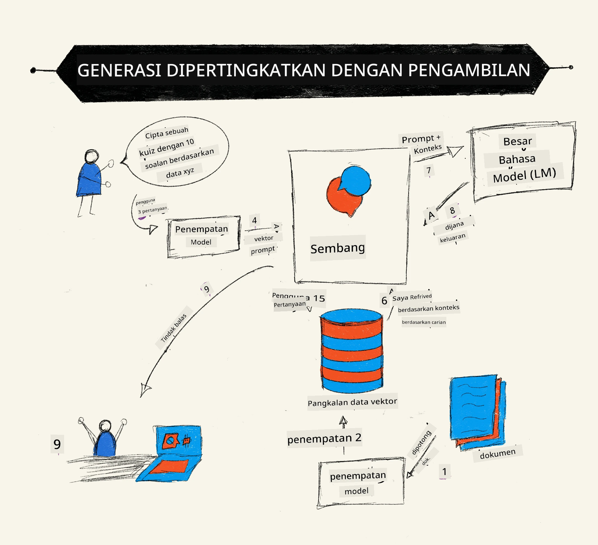
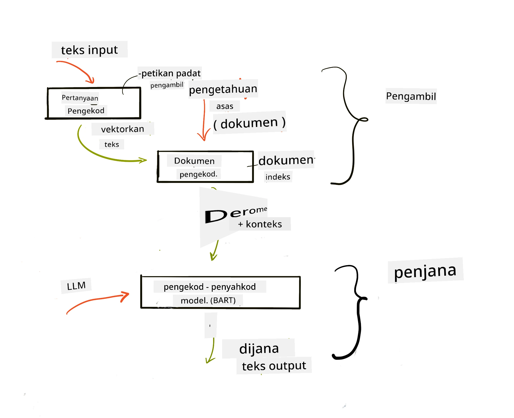

# Penghasilan Dipertingkatkan Pengambilan (RAG) dan Pangkalan Data Vektor

[](https://youtu.be/4l8zhHUBeyI?si=BmvDmL1fnHtgQYkL)

Dalam pelajaran aplikasi carian, kita telah belajar secara ringkas bagaimana untuk mengintegrasikan data sendiri ke dalam Model Bahasa Besar (LLM). Dalam pelajaran ini, kita akan mendalami lebih lanjut konsep mengasaskan data anda dalam aplikasi LLM anda, mekanik proses dan kaedah untuk menyimpan data, termasuk kedua-dua embedding dan teks.

> **Video Akan Datang Tidak Lama Lagi**

## Pengenalan

Dalam pelajaran ini kita akan merangkumi perkara berikut:

- Pengenalan kepada RAG, apa itu dan mengapa ia digunakan dalam AI (kecerdasan buatan).

- Memahami apa itu pangkalan data vektor dan bagaimana untuk mencipta satu untuk aplikasi kita.

- Contoh praktikal tentang cara mengintegrasikan RAG ke dalam aplikasi.

## Matlamat Pembelajaran

Selepas menamatkan pelajaran ini, anda akan dapat:

- Menerangkan kepentingan RAG dalam pengambilan dan pemprosesan data.

- Menyediakan aplikasi RAG dan mengasaskan data anda pada LLM

- Pengintegrasian efektif RAG dan Pangkalan Data Vektor dalam Aplikasi LLM.

## Senario Kita: meningkatkan LLM kita dengan data sendiri

Untuk pelajaran ini, kita ingin menambah nota sendiri ke dalam startup pendidikan, yang membolehkan chatbot mendapatkan maklumat lebih lanjut mengenai pelbagai subjek. Menggunakan nota yang kita ada, pelajar akan dapat belajar dengan lebih baik dan memahami pelbagai topik, menjadikannya lebih mudah untuk mengulang kaji untuk peperiksaan mereka. Untuk mencipta senario kita, kita akan menggunakan:

- `Azure OpenAI:` LLM yang akan kita gunakan untuk mencipta chatbot kita

- `Pelajaran AI untuk pemula mengenai Rangkaian Neural`: ini akan menjadi data yang kita asaskan pada LLM kita

- `Azure AI Search` dan `Azure Cosmos DB:` pangkalan data vektor untuk menyimpan data kita dan mencipta indeks carian

Pengguna akan dapat mencipta kuiz latihan dari nota mereka, kad ulang kaji dan meringkaskannya menjadi ringkasan padat. Untuk mulakan, mari kita lihat apa itu RAG dan bagaimana ia berfungsi:

## Penghasilan Dipertingkatkan Pengambilan (RAG)

Chatbot yang dikuasakan oleh LLM memproses permintaan pengguna untuk menghasilkan respons. Ia direka untuk interaktif dan berinteraksi dengan pengguna mengenai pelbagai topik. Walau bagaimanapun, responsnya terhad kepada konteks yang diberikan dan data latihan asasnya. Contohnya, GPT-4 mempunyai batas pengetahuan sehingga September 2021, bermakna ia tidak mempunyai pengetahuan mengenai peristiwa yang berlaku selepas tempoh ini. Selain itu, data yang digunakan untuk melatih LLM tidak termasuk maklumat sulit seperti nota peribadi atau manual produk syarikat.

### Bagaimana RAG (Penghasilan Dipertingkatkan Pengambilan) berfungsi



Andaian anda ingin melancarkan chatbot yang mencipta kuiz dari nota anda, anda memerlukan sambungan ke pangkalan pengetahuan. Di sinilah RAG datang membantu. RAG beroperasi seperti berikut:

- **Pangkalan Pengetahuan:** Sebelum pengambilan, dokumen ini perlu dimasukkan dan diproses terlebih dahulu, biasanya memecahkan dokumen besar kepada bahagian lebih kecil, menukarnya ke embedding teks dan menyimpannya dalam pangkalan data.

- **Pertanyaan Pengguna:** pengguna mengajukan soalan

- **Pengambilan:** Apabila pengguna mengajukan soalan, model embedding mengambil maklumat relevan dari pangkalan pengetahuan kita untuk memberikan lebih konteks yang akan dimasukkan ke dalam prompt.

- **Penghasilan Dipertingkatkan:** LLM mempertingkatkan responsnya berdasarkan data yang diambil. Ia membolehkan respons yang dihasilkan bukan sahaja berdasarkan data pra-latihan tetapi juga maklumat relevan dari konteks tambahan. Data yang diambil digunakan untuk menambah baik respons LLM. LLM kemudian memberikan jawapan kepada soalan pengguna.



Seni bina untuk RAG dilaksanakan menggunakan transformer yang terdiri dari dua bahagian: encoder dan decoder. Contohnya, apabila pengguna mengajukan soalan, teks input 'disandi' menjadi vektor yang menangkap makna perkataan dan vektor tersebut 'disahkod' ke dalam indeks dokumen kita dan menghasilkan teks baru berdasarkan pertanyaan pengguna. LLM menggunakan model encoder-decoder untuk menghasilkan output.

Dua pendekatan apabila melaksanakan RAG menurut kertas cadangan: [Retrieval-Augmented Generation for Knowledge intensive NLP (natural language processing software) Tasks](https://arxiv.org/pdf/2005.11401.pdf?WT.mc_id=academic-105485-koreyst) adalah:

- **_RAG-Sequence_** menggunakan dokumen yang diambil untuk meramalkan jawapan terbaik untuk pertanyaan pengguna

- **RAG-Token** menggunakan dokumen untuk menghasilkan token seterusnya, kemudian mengambilnya untuk menjawab pertanyaan pengguna

### Mengapa anda menggunakan RAG? 

- **Kekayaan maklumat:** memastikan respons teks adalah terkini dan semasa. Oleh itu, ia meningkatkan prestasi dalam tugasan khusus domain dengan mengakses pangkalan pengetahuan dalaman.

- Mengurangkan rekaan fakta dengan menggunakan **data yang boleh disahkan** dalam pangkalan pengetahuan untuk memberikan konteks kepada pertanyaan pengguna.

- Ia **berkos efektif** kerana ia lebih menjimatkan berbanding melatih semula LLM

## Mencipta pangkalan pengetahuan

Aplikasi kami berdasarkan data peribadi kami iaitu pelajaran Rangkaian Neural dalam kurikulum AI Untuk Pemula.

### Pangkalan Data Vektor

Pangkalan data vektor, berbeza dengan pangkalan data tradisional, adalah pangkalan data khusus yang direka untuk menyimpan, mengurus dan mencari vektor berembedding. Ia menyimpan representasi nombor dokumen. Memecahkan data kepada embedding nombor memudahkan sistem AI kami untuk memahami dan memproses data.

Kami menyimpan embedding kami dalam pangkalan data vektor kerana LLM mempunyai had bilangan token yang diterima sebagai input. Oleh kerana anda tidak boleh memberikan seluruh embedding kepada LLM, kita perlu memecahkannya kepada bahagian dan apabila pengguna mengajukan soalan, embedding yang paling mirip soalan akan dikembalikan bersama prompt. Chunking juga mengurangkan kos berdasarkan bilangan token yang dihantar melalui LLM.

Beberapa pangkalan data vektor yang popular termasuk Azure Cosmos DB, Clarifyai, Pinecone, Chromadb, ScaNN, Qdrant dan DeepLake. Anda boleh mencipta model Azure Cosmos DB menggunakan Azure CLI dengan arahan berikut:

```bash
az login
az group create -n <resource-group-name> -l <location>
az cosmosdb create -n <cosmos-db-name> -r <resource-group-name>
az cosmosdb list-keys -n <cosmos-db-name> -g <resource-group-name>
```

### Dari teks ke embedding

Sebelum kita simpan data, kita perlu menukarnya ke embedding vektor sebelum disimpan dalam pangkalan data. Jika anda bekerja dengan dokumen besar atau teks panjang, anda boleh memecahkannya berdasarkan pertanyaan yang dijangka. Chunking boleh dilakukan pada tahap ayat, atau pada perenggan. Oleh kerana chunking memperoleh makna dari perkataan sekelilingnya, anda boleh menambah konteks lain ke dalam chunk, contohnya, dengan menambah tajuk dokumen atau memasukkan teks sebelum atau selepas chunk. Anda boleh memecahkan data seperti berikut:

```python
def split_text(text, max_length, min_length):
    words = text.split()
    chunks = []
    current_chunk = []

    for word in words:
        current_chunk.append(word)
        if len(' '.join(current_chunk)) < max_length and len(' '.join(current_chunk)) > min_length:
            chunks.append(' '.join(current_chunk))
            current_chunk = []

    # Jika kepingan terakhir tidak mencapai panjang minimum, tambahkannya juga
    if current_chunk:
        chunks.append(' '.join(current_chunk))

    return chunks
```

Setelah dipisahkan, kita boleh embed teks kita menggunakan pelbagai model embedding. Beberapa model yang boleh anda gunakan termasuk: word2vec, ada-002 oleh OpenAI, Azure Computer Vision dan banyak lagi. Pemilihan model bergantung pada bahasa yang anda gunakan, jenis kandungan yang dikodkan (teks/gambar/audio), saiz input yang boleh dikodkan dan panjang output embedding.

Contoh teks berembedding menggunakan model `text-embedding-ada-002` daripada OpenAI adalah:


## Pengambilan dan Carian Vektor

Apabila pengguna mengajukan soalan, retriever menukarnya menjadi vektor menggunakan query encoder, kemudian mencari melalui indeks carian dokumen kita untuk vektor relevan dalam dokumen yang berkaitan dengan input. Setelah selesai, ia menukar kedua-dua vektor input dan dokumen menjadi teks dan menghantar ke LLM.

### Pengambilan

Pengambilan berlaku apabila sistem cuba mencari dengan cepat dokumen dari indeks yang memenuhi kriteria carian. Matlamat retriever adalah mendapatkan dokumen yang akan digunakan untuk memberikan konteks dan mengasaskan LLM pada data anda.

Terdapat beberapa cara untuk melakukan carian dalam pangkalan data kita seperti:

- **Carian kata kunci** - digunakan untuk carian teks

- **Carian vektor** - menukar dokumen dari teks ke representasi vektor menggunakan model embedding, membenarkan **carian semantik** menggunakan makna perkataan. Pengambilan dilakukan dengan menyoal dokumen yang representasi vektornya paling dekat dengan soalan pengguna.

- **Hibrid** - gabungan carian kata kunci dan carian vektor.

Cabaran dengan pengambilan muncul apabila tiada respons serupa kepada pertanyaan dalam pangkalan data, sistem akan memberikan maklumat terbaik yang boleh diperoleh, bagaimanapun, anda boleh menggunakan taktik seperti menetapkan jarak maksimum untuk relevansi atau menggunakan carian hibrid yang menggabungkan cari kata kunci dan vektor. Dalam pelajaran ini kita akan gunakan carian hibrid, gabungan carian vektor dan kata kunci. Kita akan simpan data kita dalam dataframe dengan lajur yang mengandungi bahagian serta embedding.

### Kesamaan Vektor

Retriever akan mencari dalam pangkalan pengetahuan embedding yang hampir bersama, jiran terdekat, kerana ia adalah teks yang serupa. Dalam senario apabila pengguna mengajukan pertanyaan, ia pertama diembed kemudian dicocokkan dengan embedding serupa. Ukuran umum yang digunakan untuk mengukur sejauh mana vektor berbeza serupa adalah kesamaan kosinus yang berdasarkan sudut antara dua vektor.

Kita boleh mengukur kesamaan dengan alternatif lain seperti jarak Euclidean iaitu garisan lurus antara hujung vektor dan produkt titik yang mengukur jumlah hasil darab elemen sepadan pada dua vektor.

### Indeks carian

Apabila melakukan pengambilan, kita perlu membina indeks carian untuk pangkalan pengetahuan kita sebelum membuat carian. Indeks akan menyimpan embedding kita dan boleh dengan cepat mengambil bahagian yang paling serupa walaupun dalam pangkalan data besar. Kita boleh mencipta indeks secara lokal menggunakan:

```python
from sklearn.neighbors import NearestNeighbors

embeddings = flattened_df['embeddings'].to_list()

# Buat indeks carian
nbrs = NearestNeighbors(n_neighbors=5, algorithm='ball_tree').fit(embeddings)

# Untuk membuat pertanyaan pada indeks, anda boleh menggunakan kaedah kneighbors
distances, indices = nbrs.kneighbors(embeddings)
```

### Penyusunan semula

Setelah anda menyoal pangkalan data, anda mungkin perlu menyusun keputusan dari yang paling relevan. LLM penyusun semula menggunakan Pembelajaran Mesin untuk meningkatkan relevansi hasil carian dengan mengaturnya dari yang paling sesuai. Menggunakan Azure AI Search, penyusunan semula dilakukan secara automatik untuk anda menggunakan penyusun semula semantik. Contoh bagaimana penyusunan semula berfungsi menggunakan jiran terdekat:

```python
# Cari dokumen yang paling serupa
distances, indices = nbrs.kneighbors([query_vector])

index = []
# Cetak dokumen yang paling serupa
for i in range(3):
    index = indices[0][i]
    for index in indices[0]:
        print(flattened_df['chunks'].iloc[index])
        print(flattened_df['path'].iloc[index])
        print(flattened_df['distances'].iloc[index])
    else:
        print(f"Index {index} not found in DataFrame")
```

## Menyatukan semuanya

Langkah terakhir adalah menambahkan LLM kami ke dalam campuran untuk mendapatkan respons yang diasaskan pada data kita. Kita boleh melaksanakannya seperti berikut:

```python
user_input = "what is a perceptron?"

def chatbot(user_input):
    # Tukar soalan kepada vektor pertanyaan
    query_vector = create_embeddings(user_input)

    # Cari dokumen yang paling serupa
    distances, indices = nbrs.kneighbors([query_vector])

    # tambah dokumen ke pertanyaan untuk memberikan konteks
    history = []
    for index in indices[0]:
        history.append(flattened_df['chunks'].iloc[index])

    # gabungkan sejarah dan input pengguna
    history.append(user_input)

    # buat objek mesej
    messages=[
        {"role": "system", "content": "You are an AI assistant that helps with AI questions."},
        {"role": "user", "content": "\n\n".join(history) }
    ]

    # gunakan API Respons untuk menghasilkan jawapan
    response = client.responses.create(
        model="gpt-4o-mini",
        temperature=0.7,
        max_output_tokens=800,
        input=messages,
        store=False,
    )

    return response.output_text

chatbot(user_input)
```

## Menilai aplikasi kita

### Metodologi Penilaian

- Kualiti respons yang diberikan memastikan ia kedengaran semula jadi, lancar dan seperti manusia

- Keterasasan data: menilai sama ada respons berasal dari dokumen yang disediakan

- Relevansi: menilai sama ada respons padan dan berkaitan dengan soalan yang diajukan

- Kelancaran - sama ada respons masuk akal dari segi tatabahasa

## Kes Penggunaan untuk menggunakan RAG (Penghasilan Dipertingkatkan Pengambilan) dan pangkalan data vektor

Terdapat banyak kes penggunaan berbeza di mana panggilan fungsi dapat menambah baik aplikasi anda seperti:

- Soal Jawab: mengasaskan data syarikat anda pada chat yang boleh digunakan oleh pekerja untuk bertanya soalan.

- Sistem Cadangan: di mana anda boleh mencipta sistem yang memadankan nilai paling serupa contohnya filem, restoran dan banyak lagi.

- Perkhidmatan chatbot: anda boleh menyimpan sejarah chat dan mempersonalisasikan perbualan berdasarkan data pengguna.

- Carian imej berdasarkan embedding vektor, berguna ketika melakukan pengecaman imej dan pengesanan anomali.

## Ringkasan

Kita telah merangkumi bidang asas RAG dari menambah data ke aplikasi, pertanyaan pengguna dan output. Untuk memudahkan penciptaan RAG, anda boleh menggunakan kerangka seperti Semanti Kernel, Langchain atau Autogen.

## Tugasan

Untuk meneruskan pembelajaran anda tentang Penghasilan Dipertingkatkan Pengambilan (RAG) anda boleh membina:

- Membangunkan front-end untuk aplikasi menggunakan kerangka pilihan anda

- Menggunakan kerangka, sama ada LangChain atau Semantic Kernel, dan cipta semula aplikasi anda.

Tahniah kerana menamatkan pelajaran ini 👏.

## Pembelajaran tidak berhenti di sini, teruskan Perjalanan

Setelah menamatkan pelajaran ini, lihat koleksi [Pembelajaran AI Generatif kami](https://aka.ms/genai-collection?WT.mc_id=academic-105485-koreyst) untuk terus meningkatkan pengetahuan AI Generatif anda!

---

<!-- CO-OP TRANSLATOR DISCLAIMER START -->
**Penafian**:
Dokumen ini telah diterjemahkan menggunakan perkhidmatan terjemahan AI [Co-op Translator](https://github.com/Azure/co-op-translator). Walaupun kami berusaha untuk ketepatan, sila ambil maklum bahawa terjemahan automatik mungkin mengandungi kesilapan atau ketidaktepatan. Dokumen asal dalam bahasa asalnya harus dianggap sebagai sumber yang sahih. Untuk maklumat penting, terjemahan oleh manusia profesional adalah disyorkan. Kami tidak bertanggungjawab terhadap sebarang salah faham atau salah tafsir yang timbul daripada penggunaan terjemahan ini.
<!-- CO-OP TRANSLATOR DISCLAIMER END -->