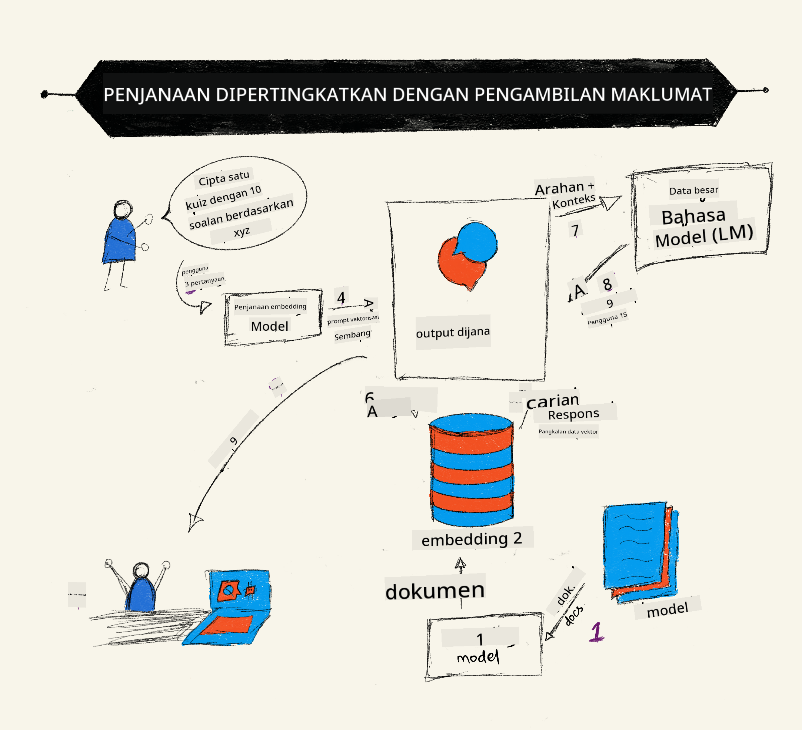

<!--
CO_OP_TRANSLATOR_METADATA:
{
  "original_hash": "b4b0266fbadbba7ded891b6485adc66d",
  "translation_date": "2025-10-17T20:54:40+00:00",
  "source_file": "15-rag-and-vector-databases/README.md",
  "language_code": "ms"
}
-->
# Retrieval Augmented Generation (RAG) dan Pangkalan Data Vektor

[](https://youtu.be/4l8zhHUBeyI?si=BmvDmL1fnHtgQYkL)

Dalam pelajaran aplikasi carian, kita telah belajar secara ringkas bagaimana untuk mengintegrasikan data anda sendiri ke dalam Model Bahasa Besar (LLM). Dalam pelajaran ini, kita akan mendalami konsep untuk menghubungkan data anda dalam aplikasi LLM, mekanisme proses tersebut dan kaedah untuk menyimpan data, termasuk kedua-dua embedding dan teks.

> **Video Akan Datang**

## Pengenalan

Dalam pelajaran ini, kita akan meliputi perkara berikut:

- Pengenalan kepada RAG, apa itu dan mengapa ia digunakan dalam AI (kecerdasan buatan).

- Memahami apa itu pangkalan data vektor dan mencipta satu untuk aplikasi kita.

- Contoh praktikal tentang bagaimana mengintegrasikan RAG ke dalam aplikasi.

## Matlamat Pembelajaran

Selepas menyelesaikan pelajaran ini, anda akan dapat:

- Menerangkan kepentingan RAG dalam pengambilan dan pemprosesan data.

- Menyediakan aplikasi RAG dan menghubungkan data anda kepada LLM.

- Integrasi berkesan RAG dan Pangkalan Data Vektor dalam Aplikasi LLM.

## Senario Kita: meningkatkan LLM kita dengan data kita sendiri

Untuk pelajaran ini, kita ingin menambah nota kita sendiri ke dalam startup pendidikan, yang membolehkan chatbot mendapatkan lebih banyak maklumat tentang pelbagai subjek. Dengan menggunakan nota yang kita ada, pelajar akan dapat belajar dengan lebih baik dan memahami topik-topik yang berbeza, menjadikannya lebih mudah untuk mengulangkaji peperiksaan mereka. Untuk mencipta senario kita, kita akan menggunakan:

- `Azure OpenAI:` LLM yang akan kita gunakan untuk mencipta chatbot kita

- `Pelajaran AI untuk pemula tentang Neural Networks:` ini akan menjadi data yang kita hubungkan kepada LLM kita

- `Azure AI Search` dan `Azure Cosmos DB:` pangkalan data vektor untuk menyimpan data kita dan mencipta indeks carian

Pengguna akan dapat mencipta kuiz latihan daripada nota mereka, kad imbasan ulangkaji dan meringkaskannya kepada gambaran ringkas. Untuk memulakan, mari kita lihat apa itu RAG dan bagaimana ia berfungsi:

## Retrieval Augmented Generation (RAG)

Chatbot yang dikuasakan oleh LLM memproses arahan pengguna untuk menghasilkan respons. Ia direka untuk menjadi interaktif dan berinteraksi dengan pengguna dalam pelbagai topik. Walau bagaimanapun, responsnya terhad kepada konteks yang diberikan dan data latihan asasnya. Sebagai contoh, pengetahuan GPT-4 terhad sehingga September 2021, bermakna ia tidak mempunyai pengetahuan tentang peristiwa yang berlaku selepas tempoh ini. Selain itu, data yang digunakan untuk melatih LLM tidak termasuk maklumat sulit seperti nota peribadi atau manual produk syarikat.

### Bagaimana RAG (Retrieval Augmented Generation) berfungsi



Katakan anda ingin melancarkan chatbot yang mencipta kuiz daripada nota anda, anda memerlukan sambungan kepada pangkalan pengetahuan. Di sinilah RAG membantu. RAG berfungsi seperti berikut:

- **Pangkalan pengetahuan:** Sebelum pengambilan, dokumen-dokumen ini perlu dimasukkan dan diproses terlebih dahulu, biasanya memecahkan dokumen besar kepada bahagian kecil, mengubahnya kepada embedding teks dan menyimpannya dalam pangkalan data.

- **Pertanyaan Pengguna:** pengguna bertanya soalan.

- **Pengambilan:** Apabila pengguna bertanya soalan, model embedding mengambil maklumat yang relevan daripada pangkalan pengetahuan kita untuk memberikan lebih banyak konteks yang akan dimasukkan ke dalam arahan.

- **Generasi Augmented:** LLM meningkatkan responsnya berdasarkan data yang diambil. Ia membolehkan respons yang dihasilkan bukan sahaja berdasarkan data yang telah dilatih tetapi juga maklumat yang relevan daripada konteks tambahan. Data yang diambil digunakan untuk meningkatkan respons LLM. LLM kemudian memberikan jawapan kepada soalan pengguna.


Seni bina untuk RAG dilaksanakan menggunakan transformer yang terdiri daripada dua bahagian: encoder dan decoder. Sebagai contoh, apabila pengguna bertanya soalan, teks input 'dikodkan' ke dalam vektor yang menangkap makna perkataan dan vektor tersebut 'didekodkan' ke dalam indeks dokumen kita dan menghasilkan teks baru berdasarkan pertanyaan pengguna. LLM menggunakan model encoder-decoder untuk menghasilkan output.

Dua pendekatan apabila melaksanakan RAG menurut kertas cadangan: [Retrieval-Augmented Generation for Knowledge intensive NLP (natural language processing software) Tasks](https://arxiv.org/pdf/2005.11401.pdf?WT.mc_id=academic-105485-koreyst) adalah:

- **_RAG-Sequence_** menggunakan dokumen yang diambil untuk meramalkan jawapan terbaik kepada pertanyaan pengguna.

- **RAG-Token** menggunakan dokumen untuk menghasilkan token seterusnya, kemudian mengambilnya untuk menjawab pertanyaan pengguna.

### Mengapa anda menggunakan RAG? 

- **Kekayaan maklumat:** memastikan respons teks adalah terkini dan semasa. Oleh itu, ia meningkatkan prestasi pada tugas khusus domain dengan mengakses pangkalan pengetahuan dalaman.

- Mengurangkan fabrikasi dengan menggunakan **data yang boleh disahkan** dalam pangkalan pengetahuan untuk memberikan konteks kepada pertanyaan pengguna.

- Ia **kos efektif** kerana lebih ekonomi berbanding dengan melatih semula LLM.

## Mencipta pangkalan pengetahuan

Aplikasi kita berdasarkan data peribadi kita iaitu pelajaran Neural Network dalam kurikulum AI For Beginners.

### Pangkalan Data Vektor

Pangkalan data vektor, tidak seperti pangkalan data tradisional, adalah pangkalan data khusus yang direka untuk menyimpan, mengurus dan mencari vektor embedding. Ia menyimpan representasi numerik dokumen. Memecahkan data kepada embedding numerik memudahkan sistem AI kita memahami dan memproses data.

Kita menyimpan embedding kita dalam pangkalan data vektor kerana LLM mempunyai had jumlah token yang diterima sebagai input. Oleh kerana anda tidak boleh menghantar keseluruhan embedding kepada LLM, kita perlu memecahkannya kepada bahagian kecil dan apabila pengguna bertanya soalan, embedding yang paling serupa dengan soalan akan dikembalikan bersama dengan arahan. Pemecahan juga mengurangkan kos pada jumlah token yang dihantar melalui LLM.

Beberapa pangkalan data vektor popular termasuk Azure Cosmos DB, Clarifyai, Pinecone, Chromadb, ScaNN, Qdrant dan DeepLake. Anda boleh mencipta model Azure Cosmos DB menggunakan Azure CLI dengan arahan berikut:

```bash
az login
az group create -n <resource-group-name> -l <location>
az cosmosdb create -n <cosmos-db-name> -r <resource-group-name>
az cosmosdb list-keys -n <cosmos-db-name> -g <resource-group-name>
```

### Daripada teks kepada embedding

Sebelum kita menyimpan data kita, kita perlu menukarnya kepada embedding vektor sebelum ia disimpan dalam pangkalan data. Jika anda bekerja dengan dokumen besar atau teks panjang, anda boleh memecahkannya berdasarkan pertanyaan yang anda jangkakan. Pemecahan boleh dilakukan pada peringkat ayat, atau pada peringkat perenggan. Oleh kerana pemecahan memperoleh makna daripada perkataan di sekelilingnya, anda boleh menambah beberapa konteks lain kepada bahagian tersebut, contohnya, dengan menambah tajuk dokumen atau termasuk beberapa teks sebelum atau selepas bahagian tersebut. Anda boleh memecahkan data seperti berikut:

```python
def split_text(text, max_length, min_length):
    words = text.split()
    chunks = []
    current_chunk = []

    for word in words:
        current_chunk.append(word)
        if len(' '.join(current_chunk)) < max_length and len(' '.join(current_chunk)) > min_length:
            chunks.append(' '.join(current_chunk))
            current_chunk = []

    # If the last chunk didn't reach the minimum length, add it anyway
    if current_chunk:
        chunks.append(' '.join(current_chunk))

    return chunks
```

Setelah dipecahkan, kita kemudian boleh mengubah teks kita kepada embedding menggunakan pelbagai model embedding. Beberapa model yang boleh digunakan termasuk: word2vec, ada-002 oleh OpenAI, Azure Computer Vision dan banyak lagi. Pemilihan model bergantung pada bahasa yang digunakan, jenis kandungan yang dikodkan (teks/imej/audio), saiz input yang boleh dikodkan dan panjang output embedding.

Contoh teks yang diubah kepada embedding menggunakan model `text-embedding-ada-002` oleh OpenAI adalah:


## Pengambilan dan Carian Vektor

Apabila pengguna bertanya soalan, retriever menukarkannya kepada vektor menggunakan encoder pertanyaan, kemudian mencari melalui indeks carian dokumen kita untuk vektor yang relevan dalam dokumen yang berkaitan dengan input. Setelah selesai, ia menukarkan kedua-dua vektor input dan vektor dokumen kepada teks dan menghantarnya melalui LLM.

### Pengambilan

Pengambilan berlaku apabila sistem cuba dengan cepat mencari dokumen daripada indeks yang memenuhi kriteria carian. Matlamat retriever adalah untuk mendapatkan dokumen yang akan digunakan untuk memberikan konteks dan menghubungkan LLM kepada data anda.

Terdapat beberapa cara untuk melakukan carian dalam pangkalan data kita seperti:

- **Carian kata kunci** - digunakan untuk carian teks.

- **Carian semantik** - menggunakan makna semantik perkataan.

- **Carian vektor** - menukarkan dokumen daripada teks kepada representasi vektor menggunakan model embedding. Pengambilan dilakukan dengan menanyakan dokumen yang representasi vektornya paling dekat dengan soalan pengguna.

- **Hibrid** - gabungan antara carian kata kunci dan carian vektor.

Cabaran dengan pengambilan berlaku apabila tiada respons serupa dengan pertanyaan dalam pangkalan data, sistem kemudian akan memberikan maklumat terbaik yang boleh diperoleh, namun, anda boleh menggunakan taktik seperti menetapkan jarak maksimum untuk relevansi atau menggunakan carian hibrid yang menggabungkan kedua-dua kata kunci dan carian vektor. Dalam pelajaran ini kita akan menggunakan carian hibrid, gabungan antara carian vektor dan kata kunci. Kita akan menyimpan data kita ke dalam dataframe dengan lajur yang mengandungi bahagian serta embedding.

### Keserupaan Vektor

Retriever akan mencari melalui pangkalan pengetahuan untuk embedding yang berdekatan, jiran terdekat, kerana mereka adalah teks yang serupa. Dalam senario pengguna bertanya pertanyaan, ia pertama kali diubah kepada embedding kemudian dipadankan dengan embedding yang serupa. Ukuran umum yang digunakan untuk mencari sejauh mana vektor yang berbeza adalah serupa ialah keserupaan kosinus yang berdasarkan sudut antara dua vektor.

Kita boleh mengukur keserupaan menggunakan alternatif lain seperti jarak Euclidean yang merupakan garis lurus antara titik akhir vektor dan produk dot yang mengukur jumlah produk elemen-elemen yang sepadan antara dua vektor.

### Indeks Carian

Apabila melakukan pengambilan, kita perlu membina indeks carian untuk pangkalan pengetahuan kita sebelum kita melakukan carian. Indeks akan menyimpan embedding kita dan boleh dengan cepat mengambil bahagian yang paling serupa walaupun dalam pangkalan data yang besar. Kita boleh mencipta indeks kita secara tempatan menggunakan:

```python
from sklearn.neighbors import NearestNeighbors

embeddings = flattened_df['embeddings'].to_list()

# Create the search index
nbrs = NearestNeighbors(n_neighbors=5, algorithm='ball_tree').fit(embeddings)

# To query the index, you can use the kneighbors method
distances, indices = nbrs.kneighbors(embeddings)
```

### Penarafan Semula

Setelah anda menanyakan pangkalan data, anda mungkin perlu menyusun hasil daripada yang paling relevan. LLM penarafan semula menggunakan Pembelajaran Mesin untuk meningkatkan relevansi hasil carian dengan menyusunnya daripada yang paling relevan. Menggunakan Azure AI Search, penarafan semula dilakukan secara automatik untuk anda menggunakan penarafan semantik. Contoh bagaimana penarafan semula berfungsi menggunakan jiran terdekat:

```python
# Find the most similar documents
distances, indices = nbrs.kneighbors([query_vector])

index = []
# Print the most similar documents
for i in range(3):
    index = indices[0][i]
    for index in indices[0]:
        print(flattened_df['chunks'].iloc[index])
        print(flattened_df['path'].iloc[index])
        print(flattened_df['distances'].iloc[index])
    else:
        print(f"Index {index} not found in DataFrame")
```

## Menggabungkan semuanya

Langkah terakhir adalah menambah LLM kita ke dalam campuran untuk dapat mendapatkan respons yang berdasarkan data kita. Kita boleh melaksanakannya seperti berikut:

```python
user_input = "what is a perceptron?"

def chatbot(user_input):
    # Convert the question to a query vector
    query_vector = create_embeddings(user_input)

    # Find the most similar documents
    distances, indices = nbrs.kneighbors([query_vector])

    # add documents to query  to provide context
    history = []
    for index in indices[0]:
        history.append(flattened_df['chunks'].iloc[index])

    # combine the history and the user input
    history.append(user_input)

    # create a message object
    messages=[
        {"role": "system", "content": "You are an AI assistant that helps with AI questions."},
        {"role": "user", "content": history[-1]}
    ]

    # use chat completion to generate a response
    response = openai.chat.completions.create(
        model="gpt-4",
        temperature=0.7,
        max_tokens=800,
        messages=messages
    )

    return response.choices[0].message

chatbot(user_input)
```

## Menilai aplikasi kita

### Metrik Penilaian

- Kualiti respons yang diberikan memastikan ia kedengaran semula jadi, lancar dan seperti manusia.

- Ketepatan data: menilai sama ada respons yang datang daripada dokumen yang diberikan.

- Relevansi: menilai respons sesuai dan berkaitan dengan soalan yang ditanya.

- Kelancaran - sama ada respons masuk akal secara tatabahasa.

## Kes Penggunaan untuk menggunakan RAG (Retrieval Augmented Generation) dan pangkalan data vektor

Terdapat banyak kes penggunaan di mana panggilan fungsi boleh meningkatkan aplikasi anda seperti:

- Soal Jawab: menghubungkan data syarikat anda kepada chat yang boleh digunakan oleh pekerja untuk bertanya soalan.

- Sistem Cadangan: di mana anda boleh mencipta sistem yang memadankan nilai yang paling serupa contohnya filem, restoran dan banyak lagi.

- Perkhidmatan Chatbot: anda boleh menyimpan sejarah chat dan memperibadikan perbualan berdasarkan data pengguna.

- Carian imej berdasarkan embedding vektor, berguna apabila melakukan pengenalan imej dan pengesanan anomali.

## Ringkasan

Kita telah meliputi kawasan asas RAG daripada menambah data kita kepada aplikasi, pertanyaan pengguna dan output. Untuk mempermudahkan penciptaan RAG, anda boleh menggunakan rangka kerja seperti Semantic Kernel, Langchain atau Autogen.

## Tugasan

Untuk meneruskan pembelajaran anda tentang Retrieval Augmented Generation (RAG) anda boleh membina:

- Membina front-end untuk aplikasi menggunakan rangka kerja pilihan anda.

- Menggunakan rangka kerja, sama ada LangChain atau Semantic Kernel, dan mencipta semula aplikasi anda.

Tahniah kerana menyelesaikan pelajaran ini 👏.

## Pembelajaran tidak berhenti di sini, teruskan Perjalanan

Selepas menyelesaikan pelajaran ini, lihat koleksi [Generative AI Learning](https://aka.ms/genai-collection?WT.mc_id=academic-105485-koreyst) kami untuk terus meningkatkan pengetahuan Generative AI anda!

---

**Penafian**:  
Dokumen ini telah diterjemahkan menggunakan perkhidmatan terjemahan AI [Co-op Translator](https://github.com/Azure/co-op-translator). Walaupun kami berusaha untuk ketepatan, sila ambil perhatian bahawa terjemahan automatik mungkin mengandungi kesilapan atau ketidaktepatan. Dokumen asal dalam bahasa asalnya harus dianggap sebagai sumber yang berwibawa. Untuk maklumat penting, terjemahan manusia profesional adalah disyorkan. Kami tidak bertanggungjawab atas sebarang salah faham atau salah tafsir yang timbul daripada penggunaan terjemahan ini.