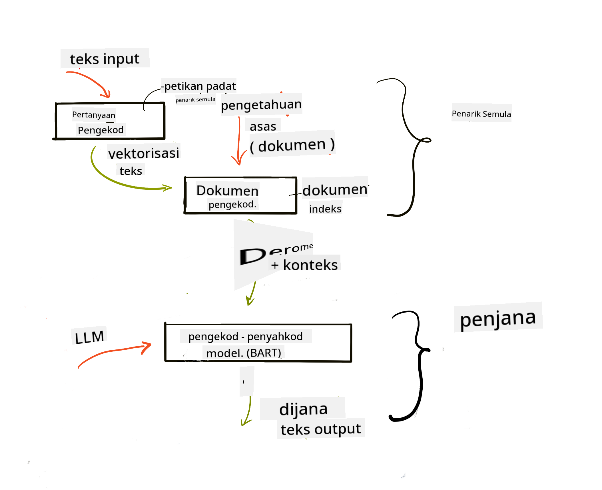

<!--
CO_OP_TRANSLATOR_METADATA:
{
  "original_hash": "e2861bbca91c0567ef32bc77fe054f9e",
  "translation_date": "2025-07-09T16:17:08+00:00",
  "source_file": "15-rag-and-vector-databases/README.md",
  "language_code": "ms"
}
-->
# Retrieval Augmented Generation (RAG) dan Pangkalan Data Vektor

[](https://aka.ms/gen-ai-lesson15-gh?WT.mc_id=academic-105485-koreyst)

Dalam pelajaran aplikasi carian, kita telah mempelajari secara ringkas bagaimana untuk mengintegrasikan data anda sendiri ke dalam Large Language Models (LLMs). Dalam pelajaran ini, kita akan mendalami lagi konsep memadankan data anda dalam aplikasi LLM, mekanisme proses dan kaedah penyimpanan data, termasuk kedua-dua embeddings dan teks.

> **Video Akan Datang Tidak Lama Lagi**

## Pengenalan

Dalam pelajaran ini kita akan membincangkan perkara berikut:

- Pengenalan kepada RAG, apa itu dan mengapa ia digunakan dalam AI (kecerdasan buatan).

- Memahami apa itu pangkalan data vektor dan cara mencipta satu untuk aplikasi kita.

- Contoh praktikal bagaimana mengintegrasikan RAG ke dalam aplikasi.

## Matlamat Pembelajaran

Selepas menamatkan pelajaran ini, anda akan dapat:

- Menerangkan kepentingan RAG dalam pengambilan dan pemprosesan data.

- Menyediakan aplikasi RAG dan memadankan data anda ke dalam LLM.

- Integrasi berkesan RAG dan Pangkalan Data Vektor dalam Aplikasi LLM.

## Senario Kita: meningkatkan LLM kita dengan data sendiri

Untuk pelajaran ini, kita ingin menambah nota sendiri ke dalam startup pendidikan, yang membolehkan chatbot mendapatkan lebih banyak maklumat mengenai subjek yang berbeza. Dengan menggunakan nota yang kita ada, pelajar akan dapat belajar dengan lebih baik dan memahami topik yang berbeza, memudahkan mereka mengulangkaji untuk peperiksaan. Untuk mencipta senario ini, kita akan menggunakan:

- `Azure OpenAI:` LLM yang akan kita gunakan untuk mencipta chatbot kita

- `Pelajaran AI untuk pemula mengenai Neural Networks:` ini akan menjadi data yang kita padankan dengan LLM kita

- `Azure AI Search` dan `Azure Cosmos DB:` pangkalan data vektor untuk menyimpan data kita dan mencipta indeks carian

Pengguna akan dapat mencipta kuiz latihan dari nota mereka, kad ulangkaji dan meringkaskannya menjadi gambaran ringkas. Untuk memulakan, mari kita lihat apa itu RAG dan bagaimana ia berfungsi:

## Retrieval Augmented Generation (RAG)

Chatbot yang dikuasakan oleh LLM memproses arahan pengguna untuk menghasilkan respons. Ia direka untuk interaktif dan berinteraksi dengan pengguna dalam pelbagai topik. Namun, responsnya terhad kepada konteks yang diberikan dan data latihan asasnya. Contohnya, GPT-4 mempunyai had pengetahuan sehingga September 2021, bermakna ia tidak mengetahui peristiwa yang berlaku selepas tempoh itu. Selain itu, data yang digunakan untuk melatih LLM tidak termasuk maklumat sulit seperti nota peribadi atau manual produk syarikat.

### Bagaimana RAG (Retrieval Augmented Generation) berfungsi


Bayangkan anda ingin melancarkan chatbot yang mencipta kuiz dari nota anda, anda memerlukan sambungan ke pangkalan pengetahuan. Di sinilah RAG membantu. RAG beroperasi seperti berikut:

- **Pangkalan pengetahuan:** Sebelum pengambilan, dokumen ini perlu dimasukkan dan diproses terlebih dahulu, biasanya dengan memecahkan dokumen besar kepada bahagian kecil, menukarnya kepada teks embedding dan menyimpannya dalam pangkalan data.

- **Pertanyaan Pengguna:** pengguna mengemukakan soalan

- **Pengambilan:** Apabila pengguna bertanya soalan, model embedding mengambil maklumat yang relevan dari pangkalan pengetahuan untuk memberikan lebih konteks yang akan dimasukkan ke dalam arahan.

- **Generasi Dipertingkatkan:** LLM memperbaiki responsnya berdasarkan data yang diambil. Ini membolehkan respons yang dihasilkan bukan sahaja berdasarkan data pra-latih tetapi juga maklumat relevan dari konteks tambahan. Data yang diambil digunakan untuk memperkayakan respons LLM. LLM kemudian memberikan jawapan kepada soalan pengguna.



Seni bina untuk RAG dilaksanakan menggunakan transformer yang terdiri daripada dua bahagian: encoder dan decoder. Contohnya, apabila pengguna bertanya soalan, teks input 'dienkod' menjadi vektor yang menangkap makna perkataan dan vektor tersebut 'didekod' ke dalam indeks dokumen kita dan menghasilkan teks baru berdasarkan pertanyaan pengguna. LLM menggunakan model encoder-decoder untuk menghasilkan output.

Dua pendekatan dalam melaksanakan RAG menurut kertas cadangan: [Retrieval-Augmented Generation for Knowledge intensive NLP (natural language processing software) Tasks](https://arxiv.org/pdf/2005.11401.pdf?WT.mc_id=academic-105485-koreyst) adalah:

- **_RAG-Sequence_** menggunakan dokumen yang diambil untuk meramalkan jawapan terbaik kepada pertanyaan pengguna

- **RAG-Token** menggunakan dokumen untuk menjana token seterusnya, kemudian mengambilnya untuk menjawab pertanyaan pengguna

### Mengapa anda perlu menggunakan RAG? 

- **Kekayaan maklumat:** memastikan respons teks adalah terkini dan relevan. Ini meningkatkan prestasi dalam tugasan khusus domain dengan mengakses pangkalan pengetahuan dalaman.

- Mengurangkan rekaan dengan menggunakan **data yang boleh disahkan** dalam pangkalan pengetahuan untuk memberikan konteks kepada pertanyaan pengguna.

- Ia **berjimat kos** kerana lebih ekonomik berbanding melatih semula LLM

## Mencipta pangkalan pengetahuan

Aplikasi kita berdasarkan data peribadi kita iaitu pelajaran Neural Network dalam kurikulum AI Untuk Pemula.

### Pangkalan Data Vektor

Pangkalan data vektor, berbeza dengan pangkalan data tradisional, adalah pangkalan data khusus yang direka untuk menyimpan, mengurus dan mencari vektor terbenam. Ia menyimpan representasi berangka dokumen. Memecahkan data kepada embedding berangka memudahkan sistem AI kita memahami dan memproses data.

Kita menyimpan embedding dalam pangkalan data vektor kerana LLM mempunyai had bilangan token yang diterima sebagai input. Oleh kerana anda tidak boleh menghantar keseluruhan embedding ke LLM, kita perlu memecahkannya kepada bahagian kecil dan apabila pengguna bertanya soalan, embedding yang paling hampir dengan soalan akan dikembalikan bersama arahan. Pemecahan juga mengurangkan kos berdasarkan bilangan token yang dihantar ke LLM.

Beberapa pangkalan data vektor popular termasuk Azure Cosmos DB, Clarifyai, Pinecone, Chromadb, ScaNN, Qdrant dan DeepLake. Anda boleh mencipta model Azure Cosmos DB menggunakan Azure CLI dengan arahan berikut:

```bash
az login
az group create -n <resource-group-name> -l <location>
az cosmosdb create -n <cosmos-db-name> -r <resource-group-name>
az cosmosdb list-keys -n <cosmos-db-name> -g <resource-group-name>
```

### Dari teks ke embeddings

Sebelum kita menyimpan data, kita perlu menukarnya kepada vector embeddings sebelum disimpan dalam pangkalan data. Jika anda bekerja dengan dokumen besar atau teks panjang, anda boleh memecahkannya berdasarkan pertanyaan yang dijangka. Pemecahan boleh dilakukan pada tahap ayat, atau perenggan. Oleh kerana pemecahan mengambil makna dari perkataan di sekelilingnya, anda boleh menambah konteks lain pada bahagian tersebut, contohnya dengan menambah tajuk dokumen atau memasukkan beberapa teks sebelum atau selepas bahagian itu. Anda boleh memecahkan data seperti berikut:

```python
def split_text(text, max_length, min_length):
    words = text.split()
    chunks = []
    current_chunk = []

    for word in words:
        current_chunk.append(word)
        if len(' '.join(current_chunk)) < max_length and len(' '.join(current_chunk)) > min_length:
            chunks.append(' '.join(current_chunk))
            current_chunk = []

    # If the last chunk didn't reach the minimum length, add it anyway
    if current_chunk:
        chunks.append(' '.join(current_chunk))

    return chunks
```

Setelah dipecahkan, kita boleh menyematkan teks menggunakan pelbagai model embedding. Beberapa model yang boleh digunakan termasuk: word2vec, ada-002 oleh OpenAI, Azure Computer Vision dan banyak lagi. Pemilihan model bergantung pada bahasa yang digunakan, jenis kandungan yang disematkan (teks/gambar/audio), saiz input yang boleh disematkan dan panjang output embedding.

Contoh teks yang disematkan menggunakan model `text-embedding-ada-002` OpenAI adalah:


## Pengambilan dan Carian Vektor

Apabila pengguna bertanya soalan, retriever menukarnya menjadi vektor menggunakan query encoder, kemudian mencari melalui indeks carian dokumen kita untuk vektor yang relevan dalam dokumen yang berkaitan dengan input. Setelah selesai, ia menukar kedua-dua vektor input dan vektor dokumen menjadi teks dan menghantarnya melalui LLM.

### Pengambilan

Pengambilan berlaku apabila sistem cuba mencari dengan cepat dokumen dari indeks yang memenuhi kriteria carian. Matlamat retriever adalah mendapatkan dokumen yang akan digunakan untuk memberikan konteks dan memadankan LLM dengan data anda.

Terdapat beberapa cara untuk melakukan carian dalam pangkalan data kita seperti:

- **Carian kata kunci** - digunakan untuk carian teks

- **Carian semantik** - menggunakan makna semantik perkataan

- **Carian vektor** - menukar dokumen dari teks ke representasi vektor menggunakan model embedding. Pengambilan dilakukan dengan menyoal dokumen yang representasi vektornya paling hampir dengan soalan pengguna.

- **Hibrid** - gabungan carian kata kunci dan carian vektor.

Cabaran dalam pengambilan berlaku apabila tiada respons yang serupa dengan pertanyaan dalam pangkalan data, sistem akan mengembalikan maklumat terbaik yang boleh didapati, namun anda boleh menggunakan taktik seperti menetapkan jarak maksimum untuk relevan atau menggunakan carian hibrid yang menggabungkan carian kata kunci dan vektor. Dalam pelajaran ini kita akan menggunakan carian hibrid, gabungan carian vektor dan kata kunci. Kita akan menyimpan data ke dalam dataframe dengan lajur yang mengandungi bahagian serta embedding.

### Kesamaan Vektor

Retriever akan mencari dalam pangkalan pengetahuan untuk embedding yang hampir antara satu sama lain, jiran terdekat, kerana ia adalah teks yang serupa. Dalam senario apabila pengguna bertanya soalan, ia terlebih dahulu disematkan kemudian dipadankan dengan embedding yang serupa. Ukuran biasa yang digunakan untuk mengukur kesamaan antara vektor adalah cosine similarity yang berdasarkan sudut antara dua vektor.

Kita juga boleh mengukur kesamaan menggunakan alternatif lain seperti jarak Euclidean iaitu garis lurus antara hujung vektor dan dot product yang mengukur jumlah hasil darab elemen-elemen sepadan dua vektor.

### Indeks carian

Apabila melakukan pengambilan, kita perlu membina indeks carian untuk pangkalan pengetahuan sebelum melakukan carian. Indeks akan menyimpan embedding kita dan boleh dengan cepat mengambil bahagian yang paling serupa walaupun dalam pangkalan data yang besar. Kita boleh mencipta indeks secara tempatan menggunakan:

```python
from sklearn.neighbors import NearestNeighbors

embeddings = flattened_df['embeddings'].to_list()

# Create the search index
nbrs = NearestNeighbors(n_neighbors=5, algorithm='ball_tree').fit(embeddings)

# To query the index, you can use the kneighbors method
distances, indices = nbrs.kneighbors(embeddings)
```

### Penarafan semula

Setelah anda menyoal pangkalan data, anda mungkin perlu menyusun hasil dari yang paling relevan. LLM penarafan semula menggunakan Pembelajaran Mesin untuk meningkatkan relevan hasil carian dengan menyusunnya dari yang paling relevan. Menggunakan Azure AI Search, penarafan semula dilakukan secara automatik menggunakan semantic reranker. Contoh bagaimana penarafan semula berfungsi menggunakan jiran terdekat:

```python
# Find the most similar documents
distances, indices = nbrs.kneighbors([query_vector])

index = []
# Print the most similar documents
for i in range(3):
    index = indices[0][i]
    for index in indices[0]:
        print(flattened_df['chunks'].iloc[index])
        print(flattened_df['path'].iloc[index])
        print(flattened_df['distances'].iloc[index])
    else:
        print(f"Index {index} not found in DataFrame")
```

## Menggabungkan semuanya

Langkah terakhir adalah menambah LLM kita ke dalam campuran untuk mendapatkan respons yang berasaskan data kita. Kita boleh melaksanakannya seperti berikut:

```python
user_input = "what is a perceptron?"

def chatbot(user_input):
    # Convert the question to a query vector
    query_vector = create_embeddings(user_input)

    # Find the most similar documents
    distances, indices = nbrs.kneighbors([query_vector])

    # add documents to query  to provide context
    history = []
    for index in indices[0]:
        history.append(flattened_df['chunks'].iloc[index])

    # combine the history and the user input
    history.append(user_input)

    # create a message object
    messages=[
        {"role": "system", "content": "You are an AI assistant that helps with AI questions."},
        {"role": "user", "content": history[-1]}
    ]

    # use chat completion to generate a response
    response = openai.chat.completions.create(
        model="gpt-4",
        temperature=0.7,
        max_tokens=800,
        messages=messages
    )

    return response.choices[0].message

chatbot(user_input)
```

## Menilai aplikasi kita

### Metod Penilaian

- Kualiti respons yang diberikan memastikan ia kedengaran semula jadi, lancar dan seperti manusia

- Ketepatan data: menilai sama ada respons datang dari dokumen yang disediakan

- Relevan: menilai sama ada respons sepadan dan berkaitan dengan soalan yang ditanya

- Kelancaran - sama ada respons masuk akal dari segi tatabahasa

## Kes penggunaan untuk menggunakan RAG (Retrieval Augmented Generation) dan pangkalan data vektor

Terdapat banyak kes penggunaan di mana panggilan fungsi boleh meningkatkan aplikasi anda seperti:

- Soal Jawab: memadankan data syarikat anda ke dalam chat yang boleh digunakan oleh pekerja untuk bertanya soalan.

- Sistem Cadangan: di mana anda boleh mencipta sistem yang memadankan nilai paling serupa contohnya filem, restoran dan banyak lagi.

- Perkhidmatan chatbot: anda boleh menyimpan sejarah chat dan mempersonalisasi perbualan berdasarkan data pengguna.

- Carian imej berdasarkan embedding vektor, berguna untuk pengecaman imej dan pengesanan anomali.

## Ringkasan

Kita telah membincangkan asas-asas RAG dari menambah data ke aplikasi, pertanyaan pengguna dan output. Untuk memudahkan penciptaan RAG, anda boleh menggunakan rangka kerja seperti Semantic Kernel, Langchain atau Autogen.

## Tugasan

Untuk meneruskan pembelajaran Retrieval Augmented Generation (RAG) anda boleh membina:

- Membangunkan front-end untuk aplikasi menggunakan rangka kerja pilihan anda

- Menggunakan rangka kerja, sama ada LangChain atau Semantic Kernel, dan bina semula aplikasi anda.

Tahniah kerana menamatkan pelajaran ini 👏.

## Pembelajaran tidak berhenti di sini, teruskan perjalanan

Selepas menamatkan pelajaran ini, lihat koleksi [Generative AI Learning](https://aka.ms/genai-collection?WT.mc_id=academic-105485-koreyst) kami untuk terus meningkatkan pengetahuan Generative AI anda!

**Penafian**:  
Dokumen ini telah diterjemahkan menggunakan perkhidmatan terjemahan AI [Co-op Translator](https://github.com/Azure/co-op-translator). Walaupun kami berusaha untuk ketepatan, sila ambil maklum bahawa terjemahan automatik mungkin mengandungi kesilapan atau ketidaktepatan. Dokumen asal dalam bahasa asalnya harus dianggap sebagai sumber yang sahih. Untuk maklumat penting, terjemahan profesional oleh manusia adalah disyorkan. Kami tidak bertanggungjawab atas sebarang salah faham atau salah tafsir yang timbul daripada penggunaan terjemahan ini.