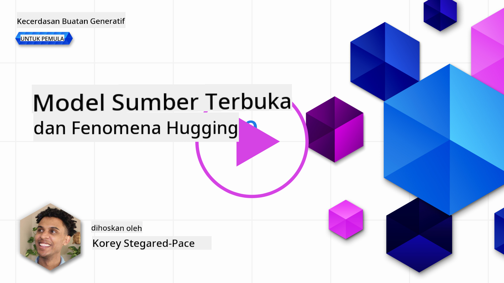
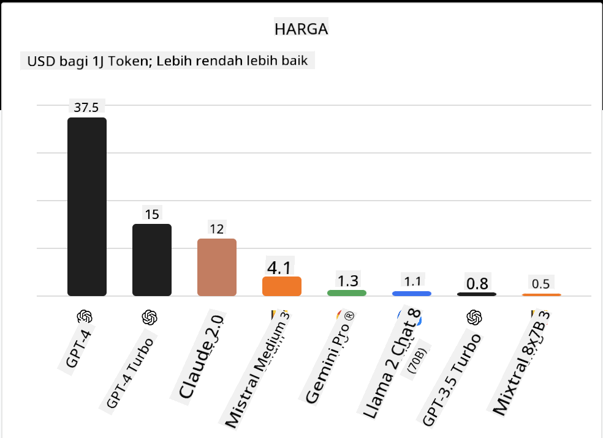
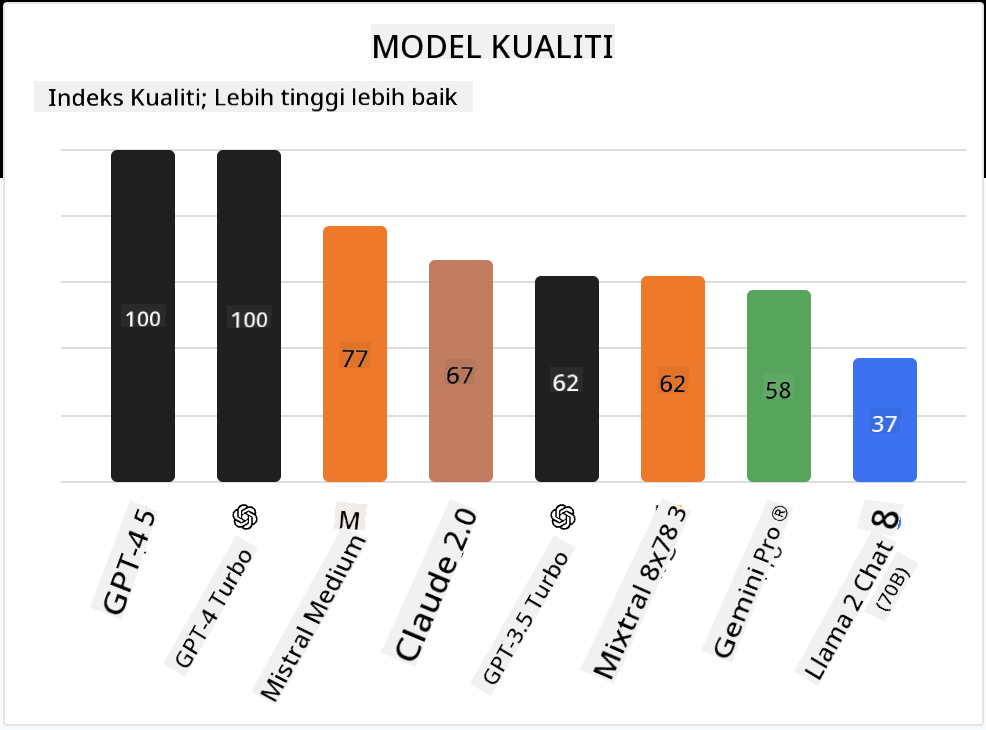

<!--
CO_OP_TRANSLATOR_METADATA:
{
  "original_hash": "0bba96e53ab841d99db731892a51fab8",
  "translation_date": "2025-05-20T07:00:24+00:00",
  "source_file": "16-open-source-models/README.md",
  "language_code": "ms"
}
-->

## Pengenalan

Dunia LLM sumber terbuka sangat menarik dan sentiasa berkembang. Pelajaran ini bertujuan untuk memberikan pandangan mendalam tentang model sumber terbuka. Jika anda mencari maklumat tentang bagaimana model proprietari dibandingkan dengan model sumber terbuka, pergi ke pelajaran ["Meneroka dan Membandingkan Pelbagai LLM"](../02-exploring-and-comparing-different-llms/README.md?WT.mc_id=academic-105485-koreyst). Pelajaran ini juga akan merangkumi topik penalaan halus tetapi penjelasan yang lebih terperinci boleh didapati dalam pelajaran ["Penalaan Halus LLM"](../18-fine-tuning/README.md?WT.mc_id=academic-105485-koreyst).

## Matlamat Pembelajaran

- Memahami model sumber terbuka
- Memahami manfaat bekerja dengan model sumber terbuka
- Meneroka model terbuka yang tersedia di Hugging Face dan Azure AI Studio

## Apakah Model Sumber Terbuka?

Perisian sumber terbuka telah memainkan peranan penting dalam pertumbuhan teknologi merentasi pelbagai bidang. Inisiatif Sumber Terbuka (OSI) telah mentakrifkan [10 kriteria untuk perisian](https://web.archive.org/web/20241126001143/https://opensource.org/osd?WT.mc_id=academic-105485-koreyst) untuk diklasifikasikan sebagai sumber terbuka. Kod sumber mesti dikongsi secara terbuka di bawah lesen yang diluluskan oleh OSI.

Walaupun pembangunan LLM mempunyai elemen serupa dengan pembangunan perisian, prosesnya tidak sama sepenuhnya. Ini telah membawa banyak perbincangan dalam komuniti mengenai definisi sumber terbuka dalam konteks LLM. Untuk model sejajar dengan definisi tradisional sumber terbuka, maklumat berikut harus tersedia secara umum:

- Dataset yang digunakan untuk melatih model.
- Berat penuh model sebagai sebahagian daripada latihan.
- Kod penilaian.
- Kod penalaan halus.
- Berat penuh model dan metrik latihan.

Pada masa ini hanya terdapat beberapa model yang memenuhi kriteria ini. [Model OLMo yang dicipta oleh Allen Institute for Artificial Intelligence (AllenAI)](https://huggingface.co/allenai/OLMo-7B?WT.mc_id=academic-105485-koreyst) adalah salah satu yang sesuai dengan kategori ini.

Untuk pelajaran ini, kita akan merujuk kepada model sebagai "model terbuka" kerana mereka mungkin tidak memenuhi kriteria di atas pada masa penulisan.

## Manfaat Model Terbuka

**Sangat Boleh Disesuaikan** - Oleh kerana model terbuka dikeluarkan dengan maklumat latihan yang terperinci, penyelidik dan pembangun boleh mengubah suai dalaman model. Ini membolehkan penciptaan model yang sangat khusus yang ditentukan untuk tugas atau bidang kajian tertentu. Beberapa contoh ini termasuk penjanaan kod, operasi matematik dan biologi.

**Kos** - Kos setiap token untuk menggunakan dan melancarkan model ini adalah lebih rendah daripada model proprietari. Apabila membina aplikasi AI Generatif, melihat prestasi vs harga apabila bekerja dengan model ini untuk kes penggunaan anda harus dilakukan.

Sumber: Artificial Analysis

**Fleksibiliti** - Bekerja dengan model terbuka membolehkan anda fleksibel dari segi menggunakan model yang berbeza atau menggabungkannya. Contoh ini adalah [Pembantu HuggingChat](https://huggingface.co/chat?WT.mc_id=academic-105485-koreyst) di mana pengguna boleh memilih model yang digunakan secara langsung dalam antara muka pengguna:

## Meneroka Pelbagai Model Terbuka

### Llama 2

[LLama2](https://huggingface.co/meta-llama?WT.mc_id=academic-105485-koreyst), dibangunkan oleh Meta adalah model terbuka yang dioptimumkan untuk aplikasi berasaskan chat. Ini disebabkan oleh kaedah penalaan halusnya, yang merangkumi sejumlah besar dialog dan maklum balas manusia. Dengan kaedah ini, model menghasilkan lebih banyak keputusan yang selaras dengan jangkaan manusia yang memberikan pengalaman pengguna yang lebih baik.

Beberapa contoh versi penalaan halus Llama termasuk [Japanese Llama](https://huggingface.co/elyza/ELYZA-japanese-Llama-2-7b?WT.mc_id=academic-105485-koreyst), yang mengkhususkan diri dalam bahasa Jepun dan [Llama Pro](https://huggingface.co/TencentARC/LLaMA-Pro-8B?WT.mc_id=academic-105485-koreyst), yang merupakan versi yang dipertingkatkan dari model asas.

### Mistral

[Mistral](https://huggingface.co/mistralai?WT.mc_id=academic-105485-koreyst) adalah model terbuka dengan fokus kuat pada prestasi tinggi dan kecekapan. Ia menggunakan pendekatan Mixture-of-Experts yang menggabungkan sekumpulan model pakar khusus ke dalam satu sistem di mana bergantung pada input, model tertentu dipilih untuk digunakan. Ini menjadikan pengiraan lebih efektif kerana model hanya menangani input yang mereka khususkan.

Beberapa contoh versi penalaan halus Mistral termasuk [BioMistral](https://huggingface.co/BioMistral/BioMistral-7B?text=Mon+nom+est+Thomas+et+mon+principal?WT.mc_id=academic-105485-koreyst), yang berfokus pada domain perubatan dan [OpenMath Mistral](https://huggingface.co/nvidia/OpenMath-Mistral-7B-v0.1-hf?WT.mc_id=academic-105485-koreyst), yang melakukan pengiraan matematik.

### Falcon

[Falcon](https://huggingface.co/tiiuae?WT.mc_id=academic-105485-koreyst) adalah LLM yang dicipta oleh Institut Inovasi Teknologi (**TII**). Falcon-40B dilatih pada 40 bilion parameter yang telah menunjukkan prestasi lebih baik daripada GPT-3 dengan bajet pengiraan yang lebih rendah. Ini disebabkan oleh penggunaan algoritma FlashAttention dan perhatian multiquery yang membolehkannya mengurangkan keperluan memori semasa waktu inferens. Dengan waktu inferens yang dikurangkan ini, Falcon-40B sesuai untuk aplikasi chat.

Beberapa contoh versi penalaan halus Falcon adalah [OpenAssistant](https://huggingface.co/OpenAssistant/falcon-40b-sft-top1-560?WT.mc_id=academic-105485-koreyst), pembantu yang dibina di atas model terbuka dan [GPT4ALL](https://huggingface.co/nomic-ai/gpt4all-falcon?WT.mc_id=academic-105485-koreyst), yang memberikan prestasi lebih tinggi daripada model asas.

## Cara Memilih

Tiada satu jawapan untuk memilih model terbuka. Tempat yang baik untuk bermula adalah dengan menggunakan ciri penapis oleh tugas di Azure AI Studio. Ini akan membantu anda memahami jenis tugas yang telah dilatih oleh model. Hugging Face juga mengekalkan Papan Pemimpin LLM yang menunjukkan model yang berprestasi terbaik berdasarkan metrik tertentu.

Apabila ingin membandingkan LLM merentasi pelbagai jenis, [Artificial Analysis](https://artificialanalysis.ai/?WT.mc_id=academic-105485-koreyst) adalah satu lagi sumber yang hebat:

Sumber: Artificial Analysis

Jika bekerja pada kes penggunaan tertentu, mencari versi penalaan halus yang berfokus pada kawasan yang sama boleh menjadi efektif. Bereksperimen dengan pelbagai model terbuka untuk melihat bagaimana mereka berprestasi mengikut jangkaan anda dan pengguna anda adalah satu lagi amalan yang baik.

## Langkah Seterusnya

Bahagian terbaik tentang model terbuka adalah anda boleh mula bekerja dengan mereka dengan cepat. Lihat [Katalog Model Azure AI Studio](https://ai.azure.com?WT.mc_id=academic-105485-koreyst), yang menampilkan koleksi Hugging Face khusus dengan model-model yang kita bincangkan di sini.

## Pembelajaran tidak berhenti di sini, teruskan Perjalanan

Selepas menyelesaikan pelajaran ini, lihat koleksi [Pembelajaran AI Generatif](https://aka.ms/genai-collection?WT.mc_id=academic-105485-koreyst) kami untuk terus meningkatkan pengetahuan AI Generatif anda!

**Penafian**:  
Dokumen ini telah diterjemahkan menggunakan perkhidmatan terjemahan AI [Co-op Translator](https://github.com/Azure/co-op-translator). Walaupun kami berusaha untuk ketepatan, sila ambil perhatian bahawa terjemahan automatik mungkin mengandungi kesilapan atau ketidaktepatan. Dokumen asal dalam bahasa asalnya harus dianggap sebagai sumber yang berwibawa. Untuk maklumat penting, terjemahan manusia profesional adalah disyorkan. Kami tidak bertanggungjawab atas sebarang salah faham atau salah tafsir yang timbul daripada penggunaan terjemahan ini.