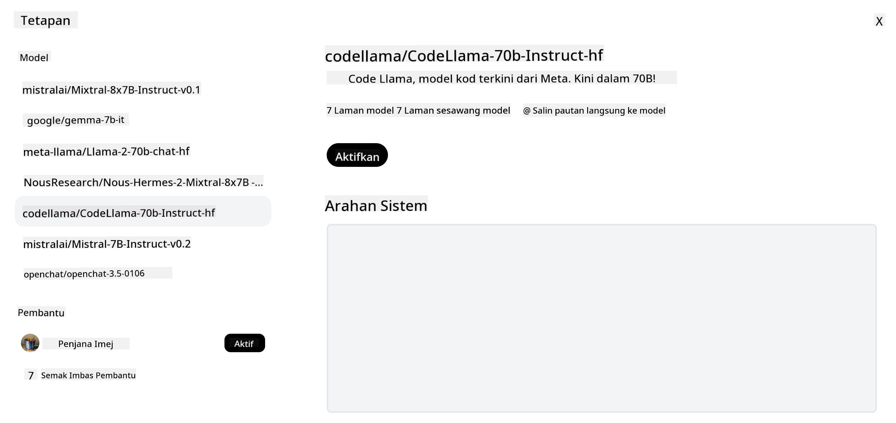

<!--
CO_OP_TRANSLATOR_METADATA:
{
  "original_hash": "0bba96e53ab841d99db731892a51fab8",
  "translation_date": "2025-07-09T17:13:00+00:00",
  "source_file": "16-open-source-models/README.md",
  "language_code": "ms"
}
-->

## Pengenalan

Dunia LLM sumber terbuka sangat menarik dan sentiasa berkembang. Pelajaran ini bertujuan untuk memberikan pandangan mendalam mengenai model sumber terbuka. Jika anda mencari maklumat tentang bagaimana model proprietari dibandingkan dengan model sumber terbuka, sila ke pelajaran ["Meneroka dan Membandingkan Pelbagai LLM"](../02-exploring-and-comparing-different-llms/README.md?WT.mc_id=academic-105485-koreyst). Pelajaran ini juga akan membincangkan topik penalaan halus tetapi penjelasan yang lebih terperinci boleh didapati dalam pelajaran ["Penalaan Halus LLM"](../18-fine-tuning/README.md?WT.mc_id=academic-105485-koreyst).

## Matlamat Pembelajaran

- Memahami Model sumber terbuka  
- Memahami manfaat bekerja dengan Model sumber terbuka  
- Meneroka model terbuka yang tersedia di Hugging Face dan Azure AI Studio  

## Apakah Model Sumber Terbuka?

Perisian sumber terbuka telah memainkan peranan penting dalam perkembangan teknologi di pelbagai bidang. Open Source Initiative (OSI) telah mentakrifkan [10 kriteria untuk perisian](https://web.archive.org/web/20241126001143/https://opensource.org/osd?WT.mc_id=academic-105485-koreyst) supaya diklasifikasikan sebagai sumber terbuka. Kod sumber mesti dikongsi secara terbuka di bawah lesen yang diluluskan oleh OSI.

Walaupun pembangunan LLM mempunyai elemen yang serupa dengan pembangunan perisian, prosesnya tidak sama sepenuhnya. Ini telah menimbulkan banyak perbincangan dalam komuniti mengenai definisi sumber terbuka dalam konteks LLM. Untuk model selaras dengan definisi tradisional sumber terbuka, maklumat berikut harus tersedia secara awam:

- Set data yang digunakan untuk melatih model.  
- Berat model penuh sebagai sebahagian daripada latihan.  
- Kod penilaian.  
- Kod penalaan halus.  
- Berat model penuh dan metrik latihan.  

Pada masa ini, hanya beberapa model yang memenuhi kriteria ini. [Model OLMo yang dibangunkan oleh Allen Institute for Artificial Intelligence (AllenAI)](https://huggingface.co/allenai/OLMo-7B?WT.mc_id=academic-105485-koreyst) adalah salah satu yang sesuai dengan kategori ini.

Untuk pelajaran ini, kami akan merujuk model-model ini sebagai "model terbuka" kerana mungkin tidak memenuhi kriteria di atas pada masa penulisan.

## Manfaat Model Terbuka

**Sangat Boleh Disesuaikan** - Oleh kerana model terbuka dikeluarkan dengan maklumat latihan yang terperinci, penyelidik dan pembangun boleh mengubah suai bahagian dalaman model. Ini membolehkan penciptaan model yang sangat khusus yang ditala halus untuk tugasan atau bidang kajian tertentu. Contohnya termasuk penjanaan kod, operasi matematik dan biologi.

**Kos** - Kos setiap token untuk menggunakan dan melaksanakan model ini lebih rendah berbanding model proprietari. Apabila membina aplikasi Generative AI, adalah penting untuk menilai prestasi berbanding harga apabila menggunakan model ini untuk kes penggunaan anda.

  
Sumber: Artificial Analysis

**Fleksibiliti** - Bekerja dengan model terbuka membolehkan anda lebih fleksibel dari segi menggunakan model yang berbeza atau menggabungkannya. Contohnya adalah [HuggingChat Assistants](https://huggingface.co/chat?WT.mc_id=academic-105485-koreyst) di mana pengguna boleh memilih model yang digunakan terus dalam antara muka pengguna:

## Meneroka Pelbagai Model Terbuka

### Llama 2

[LLama2](https://huggingface.co/meta-llama?WT.mc_id=academic-105485-koreyst), yang dibangunkan oleh Meta adalah model terbuka yang dioptimumkan untuk aplikasi berasaskan sembang. Ini kerana kaedah penalaan halusnya, yang merangkumi sejumlah besar dialog dan maklum balas manusia. Dengan kaedah ini, model menghasilkan keputusan yang lebih selaras dengan jangkaan manusia yang memberikan pengalaman pengguna yang lebih baik.

Beberapa contoh versi Llama yang ditala halus termasuk [Japanese Llama](https://huggingface.co/elyza/ELYZA-japanese-Llama-2-7b?WT.mc_id=academic-105485-koreyst), yang khusus dalam bahasa Jepun dan [Llama Pro](https://huggingface.co/TencentARC/LLaMA-Pro-8B?WT.mc_id=academic-105485-koreyst), yang merupakan versi dipertingkatkan model asas.

### Mistral

[Mistral](https://huggingface.co/mistralai?WT.mc_id=academic-105485-koreyst) adalah model terbuka yang menumpukan perhatian tinggi pada prestasi dan kecekapan. Ia menggunakan pendekatan Mixture-of-Experts yang menggabungkan sekumpulan model pakar khusus ke dalam satu sistem di mana bergantung pada input, model tertentu dipilih untuk digunakan. Ini menjadikan pengiraan lebih berkesan kerana model hanya menangani input yang mereka pakar dalamnya.

Beberapa contoh versi Mistral yang ditala halus termasuk [BioMistral](https://huggingface.co/BioMistral/BioMistral-7B?text=Mon+nom+est+Thomas+et+mon+principal?WT.mc_id=academic-105485-koreyst), yang fokus pada domain perubatan dan [OpenMath Mistral](https://huggingface.co/nvidia/OpenMath-Mistral-7B-v0.1-hf?WT.mc_id=academic-105485-koreyst), yang melakukan pengiraan matematik.

### Falcon

[Falcon](https://huggingface.co/tiiuae?WT.mc_id=academic-105485-koreyst) adalah LLM yang dicipta oleh Technology Innovation Institute (**TII**). Falcon-40B dilatih menggunakan 40 bilion parameter yang telah terbukti berprestasi lebih baik daripada GPT-3 dengan bajet pengiraan yang lebih rendah. Ini kerana penggunaan algoritma FlashAttention dan multiquery attention yang membolehkan pengurangan keperluan memori semasa inferens. Dengan masa inferens yang dikurangkan ini, Falcon-40B sesuai untuk aplikasi sembang.

Beberapa contoh versi Falcon yang ditala halus adalah [OpenAssistant](https://huggingface.co/OpenAssistant/falcon-40b-sft-top1-560?WT.mc_id=academic-105485-koreyst), pembantu yang dibina berdasarkan model terbuka dan [GPT4ALL](https://huggingface.co/nomic-ai/gpt4all-falcon?WT.mc_id=academic-105485-koreyst), yang memberikan prestasi lebih tinggi daripada model asas.

## Cara Memilih

Tiada jawapan tunggal untuk memilih model terbuka. Tempat yang baik untuk bermula adalah dengan menggunakan ciri tapis mengikut tugasan di Azure AI Studio. Ini akan membantu anda memahami jenis tugasan yang telah dilatih oleh model tersebut. Hugging Face juga mengekalkan LLM Leaderboard yang menunjukkan model terbaik berdasarkan metrik tertentu.

Apabila ingin membandingkan LLM merentasi pelbagai jenis, [Artificial Analysis](https://artificialanalysis.ai/?WT.mc_id=academic-105485-koreyst) adalah sumber yang sangat baik:

  
Sumber: Artificial Analysis

Jika bekerja pada kes penggunaan tertentu, mencari versi yang ditala halus yang fokus pada bidang yang sama boleh menjadi berkesan. Mencuba beberapa model terbuka untuk melihat bagaimana prestasi mereka mengikut jangkaan anda dan pengguna anda adalah amalan yang baik.

## Langkah Seterusnya

Bahagian terbaik mengenai model terbuka ialah anda boleh mula bekerja dengan mereka dengan cepat. Lihat [Azure AI Studio Model Catalog](https://ai.azure.com?WT.mc_id=academic-105485-koreyst), yang menampilkan koleksi khusus Hugging Face dengan model-model yang telah kita bincangkan di sini.

## Pembelajaran tidak berhenti di sini, teruskan Perjalanan

Selepas menamatkan pelajaran ini, lihat koleksi [Generative AI Learning](https://aka.ms/genai-collection?WT.mc_id=academic-105485-koreyst) kami untuk terus meningkatkan pengetahuan Generative AI anda!

**Penafian**:  
Dokumen ini telah diterjemahkan menggunakan perkhidmatan terjemahan AI [Co-op Translator](https://github.com/Azure/co-op-translator). Walaupun kami berusaha untuk ketepatan, sila ambil maklum bahawa terjemahan automatik mungkin mengandungi kesilapan atau ketidaktepatan. Dokumen asal dalam bahasa asalnya harus dianggap sebagai sumber yang sahih. Untuk maklumat penting, terjemahan profesional oleh manusia adalah disyorkan. Kami tidak bertanggungjawab atas sebarang salah faham atau salah tafsir yang timbul daripada penggunaan terjemahan ini.