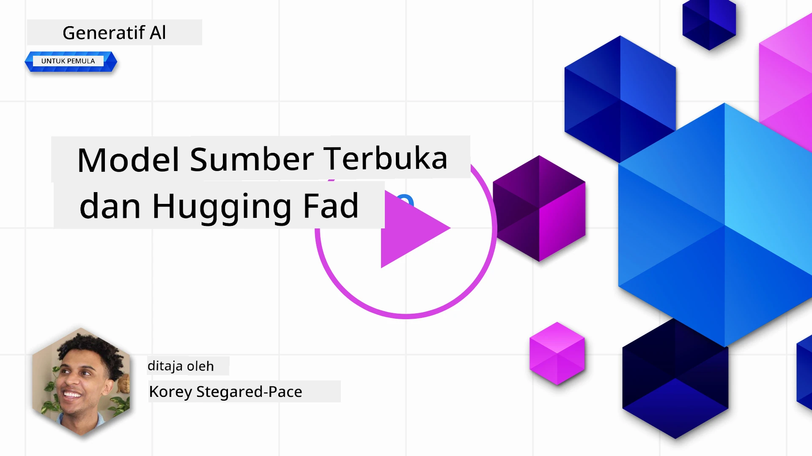
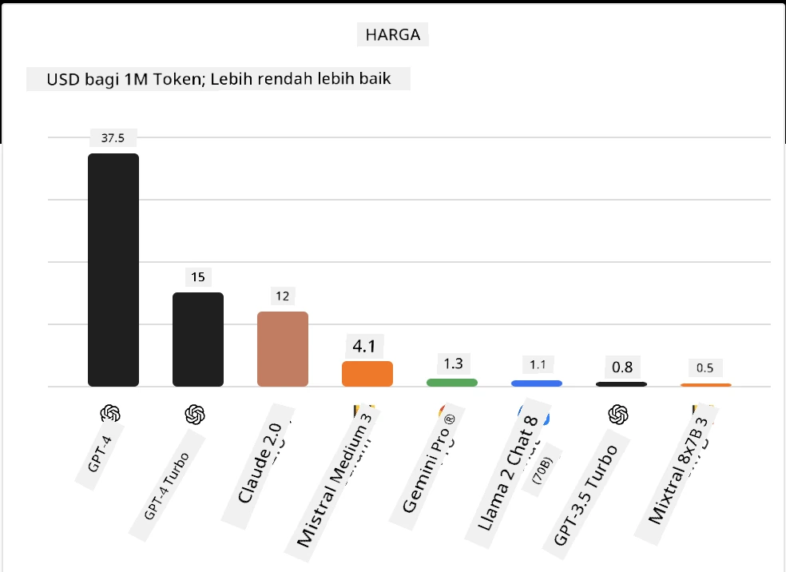
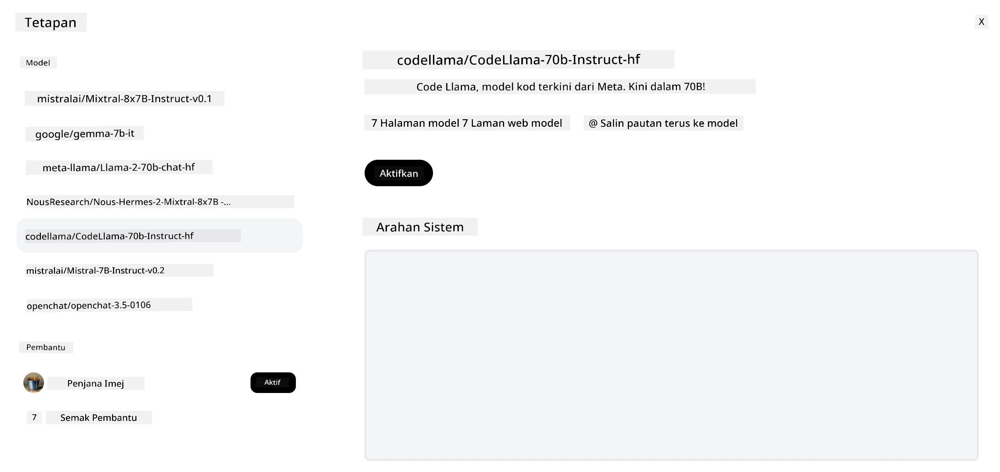
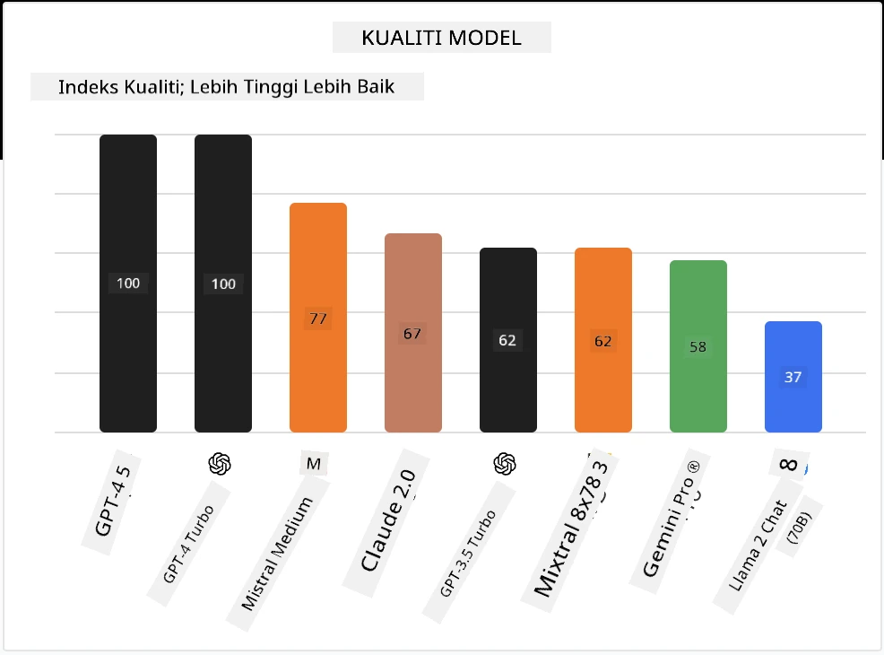

## Pengenalan

Dunia LLM sumber terbuka sangat menarik dan sentiasa berkembang. Pelajaran ini bertujuan untuk memberikan pandangan mendalam mengenai model sumber terbuka. Jika anda mencari maklumat mengenai bagaimana model proprietari dibandingkan dengan model sumber terbuka, pergi ke pelajaran ["Meneroka dan Membandingkan Pelbagai LLM"](../02-exploring-and-comparing-different-llms/README.md?WT.mc_id=academic-105485-koreyst). Pelajaran ini juga akan membincangkan topik penyempurnaan tetapi penjelasan yang lebih terperinci boleh didapati dalam pelajaran ["Penyempurnaan LLM"](../18-fine-tuning/README.md?WT.mc_id=academic-105485-koreyst).

## Matlamat pembelajaran

- Memperoleh pemahaman tentang Model Sumber Terbuka
- Memahami manfaat bekerja dengan Model Sumber Terbuka
- Meneroka model terbuka yang tersedia di Hugging Face dan katalog model Microsoft Foundry

## Apakah Model Sumber Terbuka?

Perisian sumber terbuka telah memainkan peranan penting dalam pertumbuhan teknologi merentas pelbagai bidang. Inisiatif Sumber Terbuka (OSI) telah mentakrifkan [10 kriteria untuk perisian](https://web.archive.org/web/20241126001143/https://opensource.org/osd?WT.mc_id=academic-105485-koreyst) diklasifikasikan sebagai sumber terbuka. Kod sumber mesti dikongsi secara terbuka di bawah lesen yang diluluskan oleh OSI.

Walaupun pembangunan LLM mempunyai elemen yang serupa dengan pembangunan perisian, prosesnya tidak sama sepenuhnya. Ini telah membawa banyak perbincangan dalam komuniti mengenai definisi sumber terbuka dalam konteks LLM. Untuk model selaras dengan definisi tradisional sumber terbuka maklumat berikut harus tersedia secara umum:

- Set data yang digunakan untuk melatih model.
- Berat model penuh sebagai sebahagian daripada latihan.
- Kod penilaian.
- Kod penyempurnaan.
- Berat model penuh dan metrik latihan.

Hanya beberapa model yang memenuhi kriteria ini buat masa ini. [Model OLMo yang dibuat oleh Allen Institute for Artificial Intelligence (AllenAI)](https://huggingface.co/allenai/OLMo-7B?WT.mc_id=academic-105485-koreyst) adalah salah satu yang sesuai dengan kategori ini.

Untuk pelajaran ini, kita akan merujuk model sebagai "model terbuka" kerana mungkin mereka tidak memenuhi kriteria di atas pada waktu penulisan.

## Manfaat Model Terbuka

**Sangat Boleh Disesuaikan** - Oleh kerana model terbuka dikeluarkan dengan maklumat latihan terperinci, penyelidik dan pembangun boleh mengubah suai dalaman model. Ini membolehkan penciptaan model yang sangat khusus yang disesuaikan untuk tugasan atau bidang pengajian tertentu. Beberapa contoh ialah penjanaan kod, operasi matematik dan biologi.

**Kos** - Kos per token untuk menggunakan dan menyebarkan model ini lebih rendah berbanding model proprietari. Apabila membina aplikasi Generatif AI, melihat prestasi berbanding harga apabila bekerja dengan model ini untuk kes penggunaan anda adalah penting.

Sumber: Artificial Analysis

**Fleksibiliti** - Bekerja dengan model terbuka membolehkan anda fleksibel dari segi menggunakan pelbagai model atau menggabungkannya. Contohnya adalah [Pembantu HuggingChat](https://huggingface.co/chat?WT.mc_id=academic-105485-koreyst) di mana pengguna boleh memilih model yang digunakan terus di antara muka pengguna:

## Meneroka Pelbagai Model Terbuka

### Llama 2

[LLama2](https://huggingface.co/meta-llama?WT.mc_id=academic-105485-koreyst), dibangunkan oleh Meta adalah model terbuka yang dioptimumkan untuk aplikasi berasaskan sembang. Ini kerana kaedah penyempurnaannya, yang termasuk sejumlah besar dialog dan maklum balas manusia. Dengan kaedah ini, model menghasilkan lebih banyak hasil yang sejajar dengan jangkaan manusia yang memberikan pengalaman pengguna yang lebih baik.

Beberapa contoh versi Llama yang disempurnakan termasuk [Japanese Llama](https://huggingface.co/elyza/ELYZA-japanese-Llama-2-7b?WT.mc_id=academic-105485-koreyst), yang mengkhusus dalam bahasa Jepun dan [Llama Pro](https://huggingface.co/TencentARC/LLaMA-Pro-8B?WT.mc_id=academic-105485-koreyst), yang merupakan versi dipertingkatkan model asas.

### Mistral

[Mistral](https://huggingface.co/mistralai?WT.mc_id=academic-105485-koreyst) adalah model terbuka yang fokus kuat pada prestasi tinggi dan kecekapan. Ia menggunakan pendekatan Mixture-of-Experts yang menggabungkan sekumpulan model pakar khusus menjadi satu sistem di mana bergantung pada input, model tertentu dipilih untuk digunakan. Ini membuat pengiraan lebih berkesan kerana model hanya menangani input yang mereka pakar dalamnya.

Beberapa contoh versi Mistral yang disempurnakan termasuk [BioMistral](https://huggingface.co/BioMistral/BioMistral-7B?text=Mon+nom+est+Thomas+et+mon+principal?WT.mc_id=academic-105485-koreyst), yang fokus pada domain perubatan dan [OpenMath Mistral](https://huggingface.co/nvidia/OpenMath-Mistral-7B-v0.1-hf?WT.mc_id=academic-105485-koreyst), yang melakukan pengiraan matematik.

### Falcon

[Falcon](https://huggingface.co/tiiuae?WT.mc_id=academic-105485-koreyst) adalah LLM yang dicipta oleh Technology Innovation Institute (**TII**). Falcon-40B dilatih pada 40 bilion parameter yang telah menunjukkan prestasi lebih baik daripada GPT-3 dengan bajet pengiraan yang lebih rendah. Ini kerana penggunaan algoritma FlashAttention dan perhatian multiquery yang membolehkannya mengurangkan keperluan memori semasa inferens. Dengan masa inferens yang dikurangkan ini, Falcon-40B sesuai untuk aplikasi sembang.

Beberapa contoh versi Falcon yang disempurnakan adalah [OpenAssistant](https://huggingface.co/OpenAssistant/falcon-40b-sft-top1-560?WT.mc_id=academic-105485-koreyst), pembantu yang dibina atas model terbuka dan [GPT4ALL](https://huggingface.co/nomic-ai/gpt4all-falcon?WT.mc_id=academic-105485-koreyst), yang memberi prestasi lebih tinggi daripada model asas.

## Cara Memilih

Tiada satu jawapan untuk memilih model terbuka. Tempat yang baik untuk bermula adalah dengan menggunakan ciri tapis mengikut tugas di katalog model Microsoft Foundry. Ini akan membantu anda memahami jenis tugas yang telah dilatih oleh model. Hugging Face juga mengekalkan Papan Pemimpin LLM yang menunjukkan model terbaik berdasarkan metrik tertentu.

Apabila ingin membandingkan LLM merentas pelbagai jenis, [Artificial Analysis](https://artificialanalysis.ai/?WT.mc_id=academic-105485-koreyst) adalah sumber yang hebat:

Sumber: Artificial Analysis

Jika bekerja pada kes penggunaan tertentu, mencari versi disempurnakan yang fokus pada bidang yang sama boleh menjadi berkesan. Mencuba pelbagai model terbuka untuk melihat bagaimana prestasi mengikut jangkaan anda dan pengguna anda adalah amalan yang baik.

## Langkah Seterusnya

Bahagian terbaik mengenai model terbuka ialah anda boleh mula bekerja dengan mereka dengan cepat. Lihat katalog model [Microsoft Foundry](https://ai.azure.com?WT.mc_id=academic-105485-koreyst), yang menampilkan koleksi Hugging Face khusus dengan model-model yang kita bincangkan di sini.

## Pembelajaran tidak berhenti di sini, teruskan Perjalanan

Selepas menyelesaikan pelajaran ini, lihat koleksi [Pembelajaran Generatif AI kami](https://aka.ms/genai-collection?WT.mc_id=academic-105485-koreyst) untuk terus meningkatkan pengetahuan Generatif AI anda!

---

<!-- CO-OP TRANSLATOR DISCLAIMER START -->
**Penafian**:
Dokumen ini telah diterjemahkan menggunakan perkhidmatan terjemahan AI [Co-op Translator](https://github.com/Azure/co-op-translator). Walaupun kami berusaha untuk ketepatan, sila ambil maklum bahawa terjemahan automatik mungkin mengandungi kesilapan atau ketidaktepatan. Dokumen asal dalam bahasa asalnya harus dianggap sebagai sumber yang sahih. Untuk maklumat penting, terjemahan oleh manusia profesional adalah disyorkan. Kami tidak bertanggungjawab terhadap sebarang salah faham atau salah tafsir yang timbul daripada penggunaan terjemahan ini.
<!-- CO-OP TRANSLATOR DISCLAIMER END -->