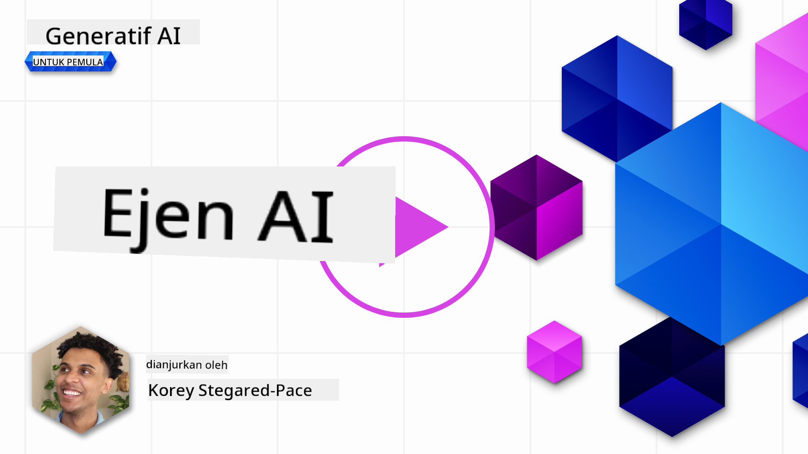
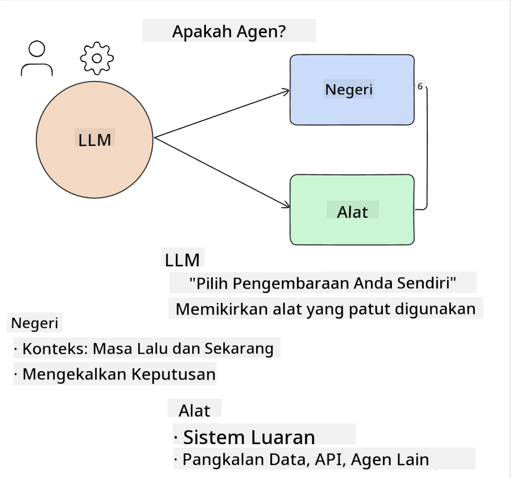
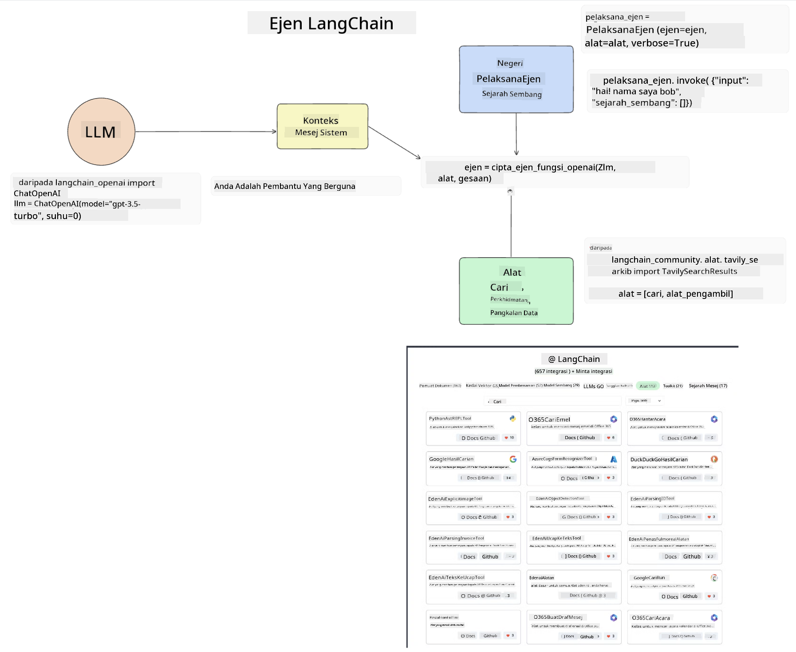
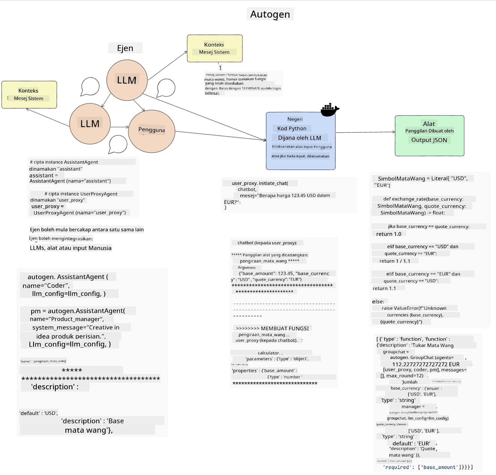
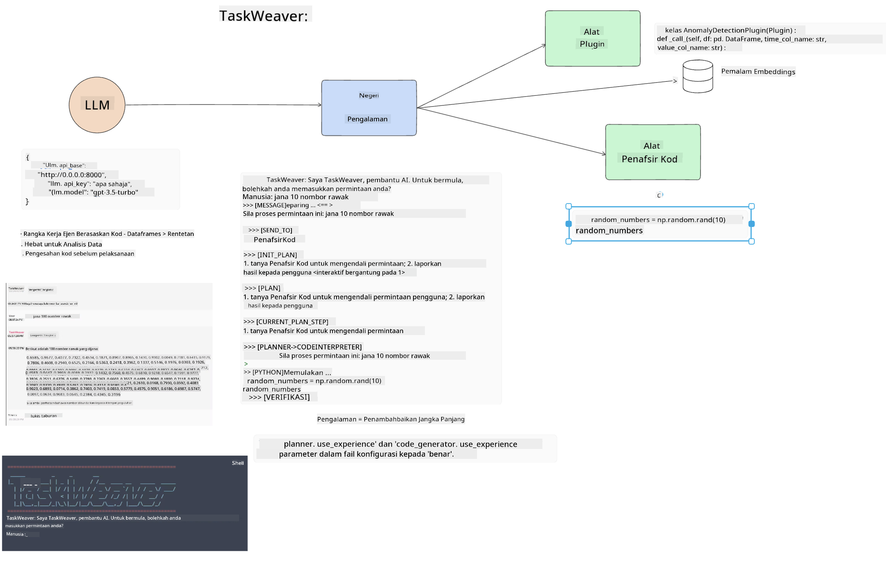
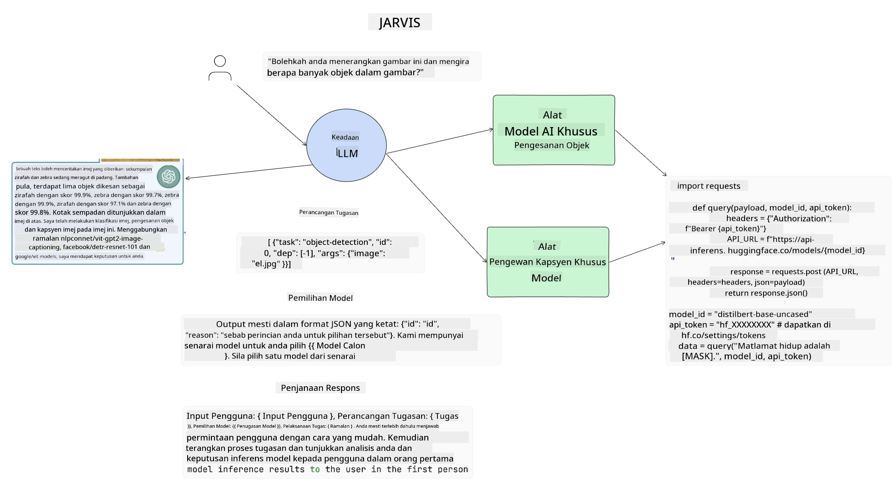

<!--
CO_OP_TRANSLATOR_METADATA:
{
  "original_hash": "11f03c81f190d9cbafd0f977dcbede6c",
  "translation_date": "2025-05-20T07:28:43+00:00",
  "source_file": "17-ai-agents/README.md",
  "language_code": "ms"
}
-->
[](https://aka.ms/gen-ai-lesson17-gh?WT.mc_id=academic-105485-koreyst)

## Pengenalan

Ejen AI mewakili perkembangan yang menarik dalam AI Generatif, membolehkan Model Bahasa Besar (LLM) berkembang daripada pembantu kepada ejen yang mampu mengambil tindakan. Rangka kerja Ejen AI membolehkan pembangun mencipta aplikasi yang memberi LLM akses kepada alat dan pengurusan keadaan. Rangka kerja ini juga meningkatkan keterlihatan, membolehkan pengguna dan pembangun memantau tindakan yang dirancang oleh LLM, dengan itu meningkatkan pengurusan pengalaman.

Pelajaran ini akan merangkumi perkara berikut:

- Memahami apa itu Ejen AI - Apa sebenarnya Ejen AI?
- Meneroka empat rangka kerja Ejen AI yang berbeza - Apa yang membuatkan mereka unik?
- Mengaplikasikan Ejen AI ini kepada pelbagai kes penggunaan - Bilakah kita harus menggunakan Ejen AI?

## Matlamat Pembelajaran

Selepas mengikuti pelajaran ini, anda akan dapat:

- Menerangkan apa itu Ejen AI dan bagaimana ia boleh digunakan.
- Memahami perbezaan antara beberapa rangka kerja Ejen AI yang popular, dan bagaimana mereka berbeza.
- Memahami bagaimana Ejen AI berfungsi untuk membina aplikasi dengan mereka.

## Apa Itu Ejen AI?

Ejen AI adalah bidang yang sangat menarik dalam dunia AI Generatif. Dengan kegembiraan ini kadang-kadang datang kekeliruan istilah dan aplikasi mereka. Untuk menjaga perkara mudah dan inklusif bagi kebanyakan alat yang merujuk kepada Ejen AI, kita akan menggunakan definisi ini:

Ejen AI membolehkan Model Bahasa Besar (LLM) melaksanakan tugas dengan memberi mereka akses kepada **keadaan** dan **alat**.



Mari kita definisikan istilah ini:

**Model Bahasa Besar** - Ini adalah model yang dirujuk sepanjang kursus ini seperti GPT-3.5, GPT-4, Llama-2, dll.

**Keadaan** - Ini merujuk kepada konteks di mana LLM bekerja. LLM menggunakan konteks tindakan masa lalu dan konteks semasa, membimbing pengambilan keputusan untuk tindakan seterusnya. Rangka kerja Ejen AI membolehkan pembangun mengekalkan konteks ini dengan lebih mudah.

**Alat** - Untuk menyelesaikan tugas yang diminta oleh pengguna dan yang telah dirancang oleh LLM, LLM memerlukan akses kepada alat. Beberapa contoh alat boleh menjadi pangkalan data, API, aplikasi luaran atau bahkan LLM lain!

Definisi ini diharapkan dapat memberi anda asas yang baik untuk terus maju semasa kita melihat bagaimana mereka dilaksanakan. Mari kita terokai beberapa rangka kerja Ejen AI yang berbeza:

## Ejen LangChain

[Ejen LangChain](https://python.langchain.com/docs/how_to/#agents?WT.mc_id=academic-105485-koreyst) adalah pelaksanaan definisi yang kami berikan di atas.

Untuk menguruskan **keadaan**, ia menggunakan fungsi terbina dalam yang dipanggil `AgentExecutor`. Ini menerima `agent` yang ditakrifkan dan `tools` yang tersedia untuknya.

`Agent Executor` juga menyimpan sejarah sembang untuk memberikan konteks sembang.



LangChain menawarkan [katalog alat](https://integrations.langchain.com/tools?WT.mc_id=academic-105485-koreyst) yang boleh diimport ke dalam aplikasi anda di mana LLM boleh mendapat akses. Ini dibuat oleh komuniti dan oleh pasukan LangChain.

Anda kemudian boleh mentakrifkan alat ini dan menyerahkannya kepada `Agent Executor`.

Keterlihatan adalah aspek penting lain apabila bercakap mengenai Ejen AI. Penting bagi pembangun aplikasi untuk memahami alat mana yang digunakan oleh LLM dan mengapa.. Untuk itu, pasukan di LangChain telah membangunkan LangSmith.

## AutoGen

Rangka kerja Ejen AI seterusnya yang akan kita bincangkan ialah [AutoGen](https://microsoft.github.io/autogen/?WT.mc_id=academic-105485-koreyst). Fokus utama AutoGen adalah perbualan. Ejen adalah **boleh berbual** dan **boleh disesuaikan**.

**Boleh berbual -** LLM boleh memulakan dan meneruskan perbualan dengan LLM lain untuk menyelesaikan tugas. Ini dilakukan dengan mencipta `AssistantAgents` dan memberikan mereka mesej sistem tertentu.

```python

autogen.AssistantAgent( name="Coder", llm_config=llm_config, ) pm = autogen.AssistantAgent( name="Product_manager", system_message="Creative in software product ideas.", llm_config=llm_config, )

```

**Boleh disesuaikan** - Ejen boleh ditakrifkan bukan sahaja sebagai LLM tetapi sebagai pengguna atau alat. Sebagai pembangun, anda boleh mentakrifkan `UserProxyAgent` yang bertanggungjawab untuk berinteraksi dengan pengguna untuk mendapatkan maklum balas dalam menyelesaikan tugas. Maklum balas ini boleh meneruskan pelaksanaan tugas atau menghentikannya.

```python
user_proxy = UserProxyAgent(name="user_proxy")
```

### Keadaan dan Alat

Untuk mengubah dan mengurus keadaan, Ejen pembantu menjana kod Python untuk menyelesaikan tugas.

Berikut adalah contoh proses:



#### LLM Ditakrifkan dengan Mesej Sistem

```python
system_message="For weather related tasks, only use the functions you have been provided with. Reply TERMINATE when the task is done."
```

Mesej sistem ini mengarahkan LLM tertentu ini kepada fungsi yang relevan untuk tugasnya. Ingat, dengan AutoGen anda boleh mempunyai beberapa AssistantAgents yang ditakrifkan dengan mesej sistem yang berbeza.

#### Sembang Dimulakan oleh Pengguna

```python
user_proxy.initiate_chat( chatbot, message="I am planning a trip to NYC next week, can you help me pick out what to wear? ", )

```

Mesej daripada user_proxy (Manusia) inilah yang akan memulakan proses Ejen untuk meneroka fungsi yang mungkin harus dilaksanakan.

#### Fungsi Dilaksanakan

```bash
chatbot (to user_proxy):

***** Suggested tool Call: get_weather ***** Arguments: {"location":"New York City, NY","time_periond:"7","temperature_unit":"Celsius"} ******************************************************** --------------------------------------------------------------------------------

>>>>>>>> EXECUTING FUNCTION get_weather... user_proxy (to chatbot): ***** Response from calling function "get_weather" ***** 112.22727272727272 EUR ****************************************************************

```

Sebaik sahaja sembang awal diproses, Ejen akan menghantar alat yang dicadangkan untuk dipanggil. Dalam kes ini, ia adalah fungsi yang dipanggil `get_weather`. Depending on your configuration, this function can be automatically executed and read by the Agent or can be executed based on user input.

You can find a list of [AutoGen code samples](https://microsoft.github.io/autogen/docs/Examples/?WT.mc_id=academic-105485-koreyst) to further explore how to get started building.

## Taskweaver

The next agent framework we will explore is [Taskweaver](https://microsoft.github.io/TaskWeaver/?WT.mc_id=academic-105485-koreyst). It is known as a "code-first" agent because instead of working strictly with `strings` , it can work with DataFrames in Python. This becomes extremely useful for data analysis and generation tasks. This can be things like creating graphs and charts or generating random numbers.

### State and Tools

To manage the state of the conversation, TaskWeaver uses the concept of a `Planner`. The `Planner` is a LLM that takes the request from the users and maps out the tasks that need to be completed to fulfill this request.

To complete the tasks the `Planner` is exposed to the collection of tools called `Plugins`. Ini boleh menjadi kelas Python atau jurubahasa kod umum. Plugin ini disimpan sebagai embedding supaya LLM dapat mencari plugin yang betul dengan lebih baik.



Berikut adalah contoh plugin untuk menangani pengesanan anomali:

```python
class AnomalyDetectionPlugin(Plugin): def __call__(self, df: pd.DataFrame, time_col_name: str, value_col_name: str):
```

Kod disahkan sebelum dilaksanakan. Ciri lain untuk menguruskan konteks dalam Taskweaver ialah `experience`. Experience allows for the context of a conversation to be stored over to the long term in a YAML file. This can be configured so that the LLM improves over time on certain tasks given that it is exposed to prior conversations.

## JARVIS

The last agent framework we will explore is [JARVIS](https://github.com/microsoft/JARVIS?tab=readme-ov-file?WT.mc_id=academic-105485-koreyst). What makes JARVIS unique is that it uses an LLM to manage the `state` perbualan dan `tools` adalah model AI lain. Setiap model AI adalah model khusus yang melaksanakan tugas tertentu seperti pengesanan objek, transkripsi atau kapsyen imej.



LLM, sebagai model tujuan umum, menerima permintaan daripada pengguna dan mengenal pasti tugas tertentu serta sebarang hujah/data yang diperlukan untuk menyelesaikan tugas.

```python
[{"task": "object-detection", "id": 0, "dep": [-1], "args": {"image": "e1.jpg" }}]
```

LLM kemudian memformat permintaan dalam cara yang boleh ditafsirkan oleh model AI khusus, seperti JSON. Sebaik sahaja model AI telah mengembalikan ramalannya berdasarkan tugas, LLM menerima respons.

Jika beberapa model diperlukan untuk menyelesaikan tugas, ia juga akan mentafsirkan respons daripada model tersebut sebelum menggabungkannya untuk menghasilkan respons kepada pengguna.

Contoh di bawah menunjukkan bagaimana ini akan berfungsi apabila pengguna meminta penerangan dan bilangan objek dalam gambar:

## Tugasan

Untuk meneruskan pembelajaran anda tentang Ejen AI, anda boleh membina dengan AutoGen:

- Aplikasi yang mensimulasikan mesyuarat perniagaan dengan jabatan yang berbeza dalam permulaan pendidikan.
- Cipta mesej sistem yang membimbing LLM dalam memahami persona dan keutamaan yang berbeza, dan membolehkan pengguna untuk mengemukakan idea produk baharu.
- LLM kemudian harus menjana soalan susulan daripada setiap jabatan untuk memperhalusi dan memperbaiki idea produk dan idea produk

## Pembelajaran tidak berhenti di sini, teruskan Perjalanan

Selepas menyelesaikan pelajaran ini, lihat [koleksi Pembelajaran AI Generatif](https://aka.ms/genai-collection?WT.mc_id=academic-105485-koreyst) kami untuk terus meningkatkan pengetahuan AI Generatif anda!

**Penafian**:  
Dokumen ini telah diterjemahkan menggunakan perkhidmatan terjemahan AI [Co-op Translator](https://github.com/Azure/co-op-translator). Walaupun kami berusaha untuk ketepatan, sila maklum bahawa terjemahan automatik mungkin mengandungi kesilapan atau ketidaktepatan. Dokumen asal dalam bahasa asalnya harus dianggap sebagai sumber yang berwibawa. Untuk maklumat kritikal, terjemahan manusia profesional adalah disyorkan. Kami tidak bertanggungjawab atas sebarang salah faham atau salah tafsir yang timbul daripada penggunaan terjemahan ini.