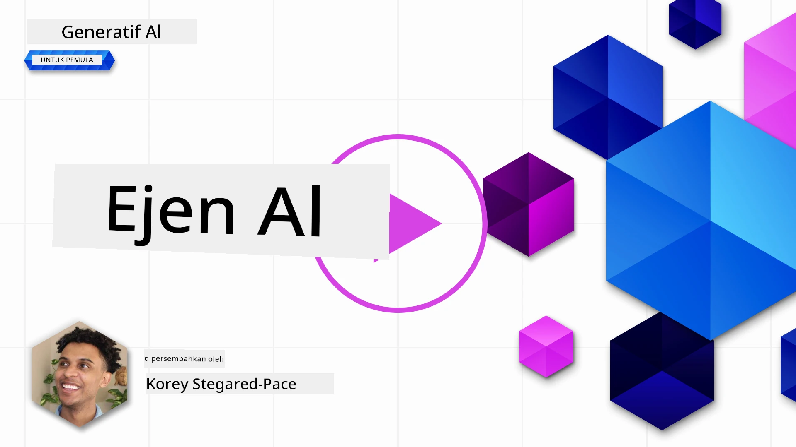
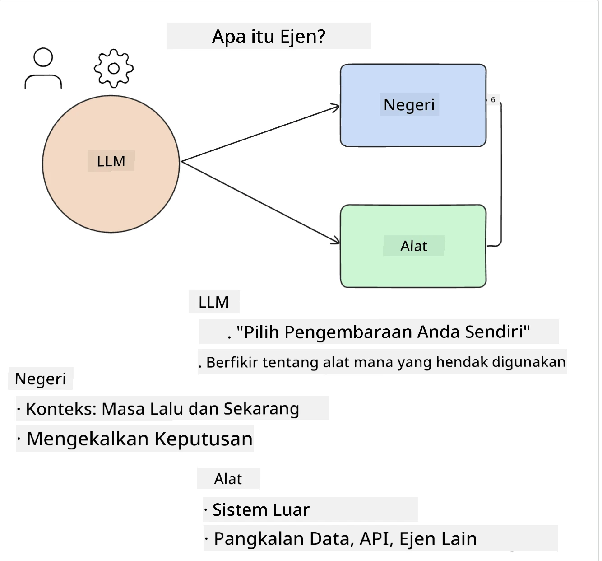
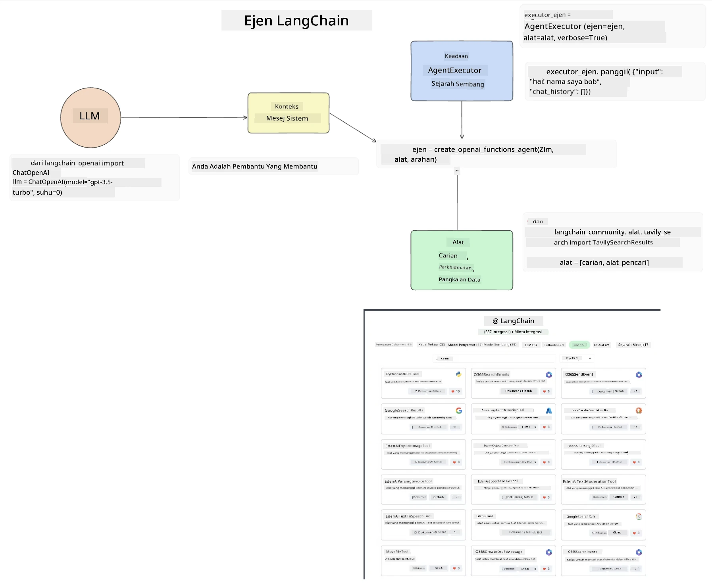
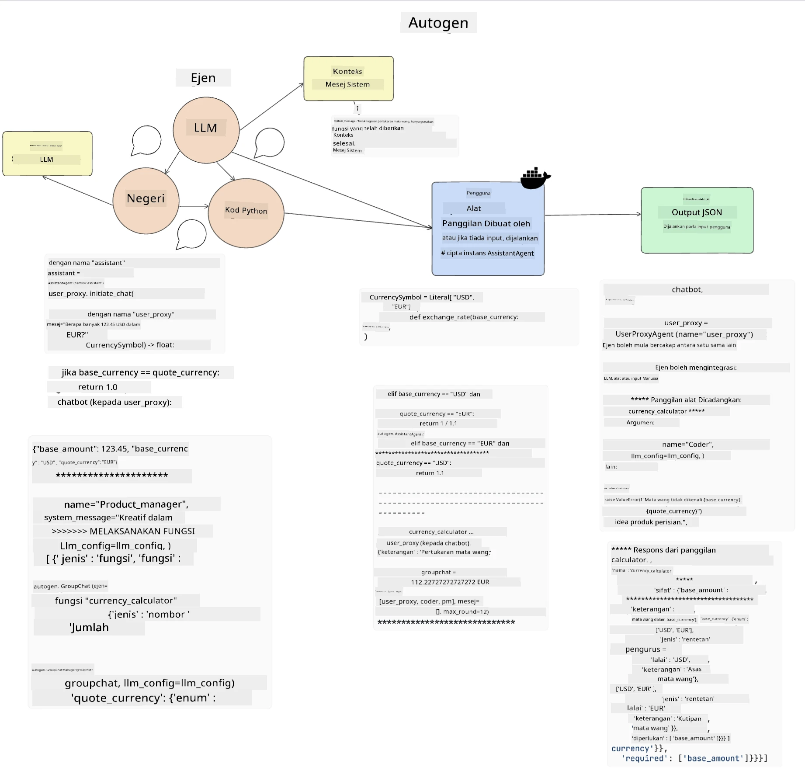
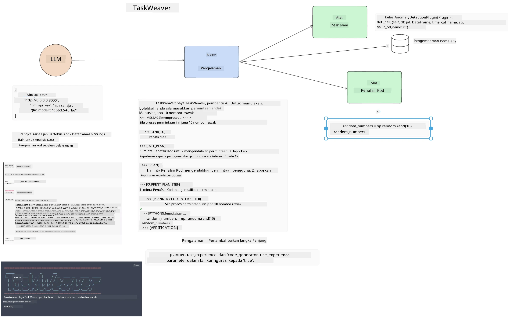
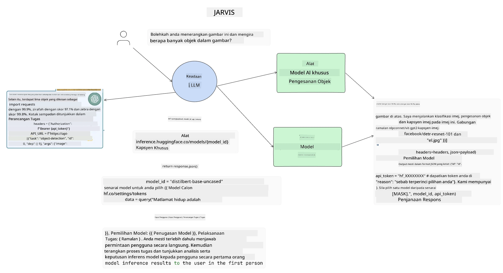

[](https://youtu.be/yAXVW-lUINc?si=bOtW9nL6jc3XJgOM)

## Pengenalan

Ejen AI mewakili perkembangan yang menarik dalam AI Generatif, membolehkan Model Bahasa Besar (LLMs) berkembang daripada pembantu kepada ejen yang mampu mengambil tindakan. Rangka kerja Ejen AI membolehkan pembangun mencipta aplikasi yang memberi akses kepada LLM kepada alat dan pengurusan keadaan. Rangka kerja ini juga meningkatkan keterlihatan, membolehkan pengguna dan pembangun memantau tindakan yang dirancang oleh LLM, sekaligus memperbaiki pengurusan pengalaman.

Pelajaran ini akan merangkumi bidang berikut:

- Memahami apa itu Ejen AI - Apakah sebenarnya Ejen AI?
- Meneroka empat Rangka Kerja Ejen AI yang berbeza - Apa yang menjadikannya unik?
- Mengaplikasikan Ejen AI ini kepada pelbagai kes penggunaan - Bilakah kita harus menggunakan Ejen AI?

## Matlamat Pembelajaran

Selepas mengambil pelajaran ini, anda akan dapat:

- Menjelaskan apa itu Ejen AI dan bagaimana ia boleh digunakan.
- Memahami perbezaan antara beberapa Rangka Kerja Ejen AI popular dan bagaimana ia berbeza.
- Memahami bagaimana Ejen AI berfungsi untuk membina aplikasi menggunakan mereka.

## Apakah Ejen AI?

Ejen AI adalah bidang yang sangat menarik dalam dunia AI Generatif. Dengan keterujaan ini datang juga kekeliruan tentang istilah dan penggunaannya. Untuk memudahkan dan merangkumi kebanyakan alat yang merujuk kepada Ejen AI, kami akan menggunakan definisi ini:

Ejen AI membenarkan Model Bahasa Besar (LLMs) melaksanakan tugas dengan memberikan mereka akses kepada **keadaan** dan **alat**.



Mari kita definisikan istilah-istilah ini:

**Model Bahasa Besar** - Ini adalah model yang dirujuk sepanjang kursus ini seperti GPT-3.5, GPT-4, Llama-2, dan lain-lain.

**Keadaan** - Ini merujuk kepada konteks yang sedang digunakan oleh LLM. LLM menggunakan konteks dari tindakan lampau dan konteks semasa, membimbing pembuatan keputusan untuk tindakan seterusnya. Rangka Kerja Ejen AI membolehkan pembangun mengekalkan konteks ini dengan lebih mudah.

**Alat** - Untuk menyelesaikan tugasan yang diminta oleh pengguna dan telah dirancang oleh LLM, LLM memerlukan akses kepada alat. Contoh alat termasuk pangkalan data, API, aplikasi luaran atau malah LLM lain!

Definisi ini diharapkan memberi anda asas yang kukuh untuk memahami bagaimana ia diimplementasi. Mari kita terokai beberapa rangka kerja Ejen AI yang berbeza:

## Ejen LangChain

[Ejen LangChain](https://python.langchain.com/docs/how_to/#agents?WT.mc_id=academic-105485-koreyst) adalah pelaksanaan definisi yang kami berikan di atas.

Untuk mengurus **keadaan**, ia menggunakan fungsi terbina dalam yang dipanggil `AgentExecutor`. Ini menerima `agen` yang telah ditetapkan dan `alat` yang tersedia kepadanya.

`AgentExecutor` juga menyimpan sejarah perbualan untuk menyediakan konteks perbualan.



LangChain menawarkan [katalog alat](https://integrations.langchain.com/tools?WT.mc_id=academic-105485-koreyst) yang boleh diimport ke dalam aplikasi anda untuk diakses oleh LLM. Alat-alat ini dibuat oleh komuniti dan oleh pasukan LangChain.

Anda kemudiannya boleh mentakrifkan alat-alat ini dan menghantarnya kepada `AgentExecutor`.

Keterlihatan adalah aspek penting lain ketika bercakap tentang Ejen AI. Penting bagi pembangun aplikasi untuk memahami alat manakah yang digunakan oleh LLM dan mengapa. Untuk itu, pasukan LangChain telah membangunkan LangSmith.

## AutoGen

Rangka kerja Ejen AI seterusnya yang akan kita bincangkan ialah [AutoGen](https://microsoft.github.io/autogen/?WT.mc_id=academic-105485-koreyst). Fokus utama AutoGen adalah perbualan. Ejen adalah **boleh berbual** dan **boleh disesuaikan**.

**Boleh berbual -** LLM boleh memulakan dan meneruskan perbualan dengan LLM lain untuk menyelesaikan tugasan. Ini dilakukan dengan mencipta `AssistantAgents` dan memberi mereka mesej sistem tertentu.

```python

autogen.AssistantAgent( name="Coder", llm_config=llm_config, ) pm = autogen.AssistantAgent( name="Product_manager", system_message="Creative in software product ideas.", llm_config=llm_config, )

```

**Boleh disesuaikan** - Ejen boleh ditakrifkan bukan sahaja sebagai LLM tetapi juga sebagai pengguna atau alat. Sebagai pembangun, anda boleh mentakrifkan `UserProxyAgent` yang bertanggungjawab berinteraksi dengan pengguna untuk maklum balas dalam menyelesaikan tugas. Maklum balas ini boleh meneruskan pelaksanaan tugas atau memberhentikannya.

```python
user_proxy = UserProxyAgent(name="user_proxy")
```

### Keadaan dan Alat

Untuk mengubah dan mengurus keadaan, Ejen pembantu menjana kod Python untuk melengkapkan tugasan.

Berikut adalah contoh prosesnya:



#### LLM Ditakrifkan dengan Mesej Sistem

```python
system_message="For weather related tasks, only use the functions you have been provided with. Reply TERMINATE when the task is done."
```

Mesej sistem ini mengarahkan LLM khusus ini kepada fungsi yang relevan untuk tugasan tersebut. Ingat, dengan AutoGen anda boleh mempunyai beberapa `AssistantAgents` yang ditakrifkan dengan mesej sistem berbeza.

#### Perbualan Dimulakan oleh Pengguna

```python
user_proxy.initiate_chat( chatbot, message="I am planning a trip to NYC next week, can you help me pick out what to wear? ", )

```

Mesej ini daripada user_proxy (Manusia) adalah apa yang akan memulakan proses Ejen untuk meneroka fungsi yang mungkin untuk dilaksanakan.

#### Fungsi Dilaksanakan

```bash
chatbot (to user_proxy):

***** Suggested tool Call: get_weather ***** Arguments: {"location":"New York City, NY","time_periond:"7","temperature_unit":"Celsius"} ******************************************************** --------------------------------------------------------------------------------

>>>>>>>> EXECUTING FUNCTION get_weather... user_proxy (to chatbot): ***** Response from calling function "get_weather" ***** 112.22727272727272 EUR ****************************************************************

```

Setelah perbualan awal diproses, Ejen akan menghantar alat cadangan untuk dipanggil. Dalam kes ini, ia adalah fungsi yang dipanggil `get_weather`. Bergantung pada konfigurasi anda, fungsi ini boleh dilaksanakan secara automatik dan dibaca oleh Ejen atau boleh dilaksanakan berdasarkan input pengguna.

Anda boleh mendapatkan senarai [contoh kod AutoGen](https://microsoft.github.io/autogen/docs/Examples/?WT.mc_id=academic-105485-koreyst) untuk lebih meneroka cara memulakan pembinaan.

## Taskweaver

Rangka kerja ejen seterusnya yang akan kita terokai adalah [Taskweaver](https://microsoft.github.io/TaskWeaver/?WT.mc_id=academic-105485-koreyst). Ia dikenali sebagai ejen "code-first" kerana sebagai ganti bekerja secara eksklusif dengan `strings`, ia boleh bekerja dengan DataFrames dalam Python. Ini menjadi sangat berguna untuk analisis data dan tugasan penjanaan. Ini boleh termasuk membuat graf dan carta atau menjana nombor rawak.

### Keadaan dan Alat

Untuk mengurus keadaan perbualan, TaskWeaver menggunakan konsep `Planner`. `Planner` adalah LLM yang menerima permintaan dari pengguna dan memetakan tugasan yang perlu diselesaikan untuk memenuhi permintaan ini.

Untuk menyelesaikan tugasan, `Planner` mendapat pendedahan kepada koleksi alat yang dipanggil `Plugins`. Ini boleh menjadi kelas Python atau penafsir kod umum. Plugins ini disimpan sebagai embedding supaya LLM dapat mencari plugin yang betul dengan lebih baik.



Berikut adalah contoh plugin untuk mengendalikan pengesanan anomali:

```python
class AnomalyDetectionPlugin(Plugin): def __call__(self, df: pd.DataFrame, time_col_name: str, value_col_name: str):
```

Kod ini disahkan sebelum pelaksanaan. Satu lagi ciri untuk mengurus konteks dalam Taskweaver ialah `experience`. Experience membenarkan konteks perbualan disimpan dalam jangka masa panjang dalam fail YAML. Ini boleh dikonfigurasikan supaya LLM meningkat dari masa ke masa terhadap tugasan tertentu dengan syarat ia didedahkan kepada perbualan terdahulu.

## JARVIS

Rangka kerja ejen terakhir yang akan kita terokai adalah [JARVIS](https://github.com/microsoft/JARVIS?tab=readme-ov-file&WT.mc_id=academic-105485-koreyst). Apa yang menjadikan JARVIS unik ialah ia menggunakan LLM untuk menguruskan `keadaan` perbualan dan `alat` adalah model AI lain. Setiap model AI adalah model khusus yang melaksanakan tugasan tertentu seperti pengesanan objek, transkripsi atau penterjemah imej.



LLM, sebagai model tujuan umum, menerima permintaan dari pengguna dan mengenal pasti tugasan khusus serta sebarang argumen/data yang diperlukan untuk melengkapkan tugasan tersebut.

```python
[{"task": "object-detection", "id": 0, "dep": [-1], "args": {"image": "e1.jpg" }}]
```

LLM kemudian memformat permintaan dalam cara yang boleh ditafsirkan oleh model AI khusus, seperti JSON. Setelah model AI mengembalikan ramalannya berdasarkan tugasan, LLM menerima respons tersebut.

Jika beberapa model diperlukan untuk melengkapkan tugasan, LLM juga akan mentafsir respons dari model-model tersebut sebelum menggabungkannya untuk menghasilkan respons kepada pengguna.

Contoh di bawah menunjukkan bagaimana ini berfungsi apabila pengguna meminta keterangan dan kiraan objek dalam gambar:

## Tugasan

Untuk meneruskan pembelajaran tentang Ejen AI, anda boleh membina menggunakan AutoGen:

- Aplikasi yang mensimulasikan mesyuarat perniagaan dengan jabatan-jabatan yang berbeza dalam startup pendidikan.
- Buat mesej sistem yang membimbing LLM dalam memahami persona dan keutamaan yang berbeza, dan membolehkan pengguna membentangkan idea produk baru.
- LLM kemudiannya perlu menghasilkan soalan susulan dari setiap jabatan untuk memperhalusi dan memperbaiki pembentangan serta idea produk tersebut.

## Pembelajaran tidak berhenti di sini, teruskan Perjalanan

Selepas menyelesaikan pelajaran ini, lihat koleksi [Pembelajaran AI Generatif kami](https://aka.ms/genai-collection?WT.mc_id=academic-105485-koreyst) untuk terus meningkatkan pengetahuan AI Generatif anda!

---

<!-- CO-OP TRANSLATOR DISCLAIMER START -->
**Penafian**:
Dokumen ini telah diterjemahkan menggunakan perkhidmatan terjemahan AI [Co-op Translator](https://github.com/Azure/co-op-translator). Walaupun kami berusaha untuk ketepatan, harap maklum bahawa terjemahan automatik mungkin mengandungi kesilapan atau ketidakakuratan. Dokumen asal dalam bahasa asalnya hendaklah dianggap sebagai sumber yang sahih. Untuk maklumat penting, disyorkan terjemahan manusia profesional. Kami tidak bertanggungjawab atas sebarang salah faham atau salah tafsir yang timbul daripada penggunaan terjemahan ini.
<!-- CO-OP TRANSLATOR DISCLAIMER END -->