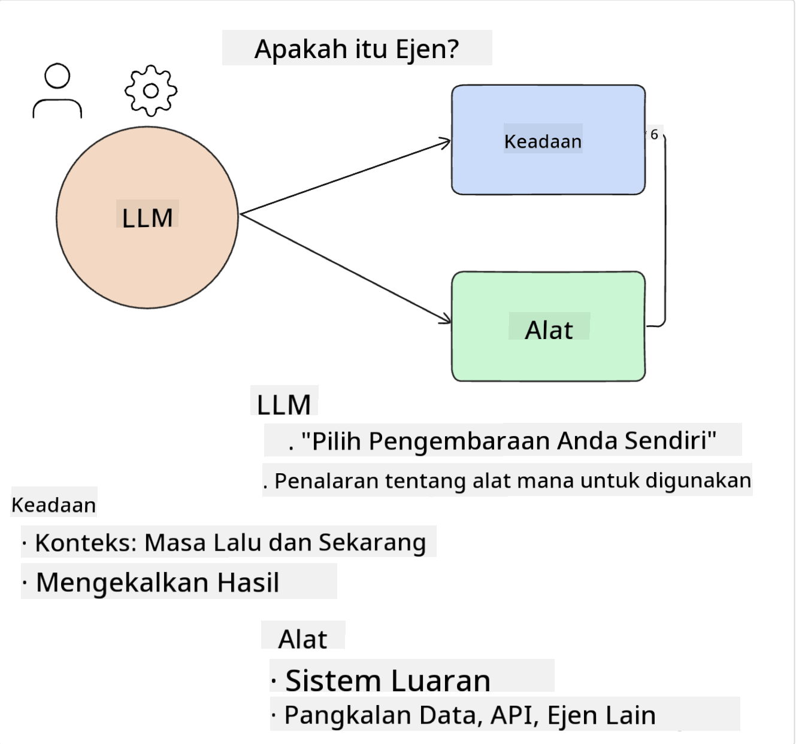

<!--
CO_OP_TRANSLATOR_METADATA:
{
  "original_hash": "8e8d1f6a63da606af7176a87ff8e92b6",
  "translation_date": "2025-10-17T20:59:50+00:00",
  "source_file": "17-ai-agents/README.md",
  "language_code": "ms"
}
-->
[](https://youtu.be/yAXVW-lUINc?si=bOtW9nL6jc3XJgOM)

## Pengenalan

Ejen AI mewakili perkembangan menarik dalam AI Generatif, membolehkan Model Bahasa Besar (LLM) berkembang daripada pembantu kepada ejen yang mampu mengambil tindakan. Rangka kerja Ejen AI membolehkan pembangun mencipta aplikasi yang memberikan LLM akses kepada alat dan pengurusan keadaan. Rangka kerja ini juga meningkatkan keterlihatan, membolehkan pengguna dan pembangun memantau tindakan yang dirancang oleh LLM, sekali gus meningkatkan pengurusan pengalaman.

Pelajaran ini akan merangkumi perkara berikut:

- Memahami apa itu Ejen AI - Apa sebenarnya Ejen AI?
- Meneroka empat rangka kerja Ejen AI yang berbeza - Apa yang menjadikannya unik?
- Mengaplikasikan Ejen AI ini kepada pelbagai kes penggunaan - Bila kita patut menggunakan Ejen AI?

## Matlamat Pembelajaran

Selepas mengikuti pelajaran ini, anda akan dapat:

- Menerangkan apa itu Ejen AI dan bagaimana ia boleh digunakan.
- Memahami perbezaan antara beberapa rangka kerja Ejen AI yang popular, dan bagaimana ia berbeza.
- Memahami bagaimana Ejen AI berfungsi untuk membina aplikasi dengan mereka.

## Apa Itu Ejen AI?

Ejen AI adalah bidang yang sangat menarik dalam dunia AI Generatif. Dengan keterujaan ini kadang-kadang timbul kekeliruan tentang istilah dan penggunaannya. Untuk mempermudah dan merangkumi kebanyakan alat yang merujuk kepada Ejen AI, kita akan menggunakan definisi ini:

Ejen AI membolehkan Model Bahasa Besar (LLM) melaksanakan tugas dengan memberikan mereka akses kepada **keadaan** dan **alat**.



Mari kita definisikan istilah ini:

**Model Bahasa Besar** - Ini adalah model yang dirujuk sepanjang kursus ini seperti GPT-3.5, GPT-4, Llama-2, dan lain-lain.

**Keadaan** - Ini merujuk kepada konteks yang sedang digunakan oleh LLM. LLM menggunakan konteks tindakan lalu dan konteks semasa, membimbing pengambilan keputusannya untuk tindakan seterusnya. Rangka kerja Ejen AI membolehkan pembangun mengekalkan konteks ini dengan lebih mudah.

**Alat** - Untuk melengkapkan tugas yang diminta oleh pengguna dan yang dirancang oleh LLM, LLM memerlukan akses kepada alat. Beberapa contoh alat boleh menjadi pangkalan data, API, aplikasi luaran atau bahkan LLM lain!

Definisi ini diharapkan dapat memberikan asas yang baik untuk terus maju ketika kita melihat bagaimana ia dilaksanakan. Mari kita terokai beberapa rangka kerja Ejen AI yang berbeza:

## Ejen LangChain

[Ejen LangChain](https://python.langchain.com/docs/how_to/#agents?WT.mc_id=academic-105485-koreyst) adalah pelaksanaan definisi yang kami berikan di atas.

Untuk menguruskan **keadaan**, ia menggunakan fungsi terbina dalam yang dipanggil `AgentExecutor`. Fungsi ini menerima `agent` yang ditakrifkan dan `tools` yang tersedia untuknya.

`Agent Executor` juga menyimpan sejarah perbualan untuk memberikan konteks perbualan.


LangChain menawarkan [katalog alat](https://integrations.langchain.com/tools?WT.mc_id=academic-105485-koreyst) yang boleh diimport ke dalam aplikasi anda di mana LLM boleh mendapatkan akses. Alat ini dibuat oleh komuniti dan pasukan LangChain.

Anda kemudian boleh mentakrifkan alat ini dan menyerahkannya kepada `Agent Executor`.

Keterlihatan adalah aspek penting lain apabila bercakap tentang Ejen AI. Penting bagi pembangun aplikasi untuk memahami alat mana yang digunakan oleh LLM dan mengapa. Untuk itu, pasukan di LangChain telah membangunkan LangSmith.

## AutoGen

Rangka kerja Ejen AI seterusnya yang akan kita bincangkan ialah [AutoGen](https://microsoft.github.io/autogen/?WT.mc_id=academic-105485-koreyst). Fokus utama AutoGen adalah perbualan. Ejen adalah **boleh berbual** dan **boleh disesuaikan**.

**Boleh berbual -** LLM boleh memulakan dan meneruskan perbualan dengan LLM lain untuk melengkapkan tugas. Ini dilakukan dengan mencipta `AssistantAgents` dan memberikan mereka mesej sistem tertentu.

```python

autogen.AssistantAgent( name="Coder", llm_config=llm_config, ) pm = autogen.AssistantAgent( name="Product_manager", system_message="Creative in software product ideas.", llm_config=llm_config, )

```

**Boleh disesuaikan** - Ejen boleh ditakrifkan bukan sahaja sebagai LLM tetapi sebagai pengguna atau alat. Sebagai pembangun, anda boleh mentakrifkan `UserProxyAgent` yang bertanggungjawab untuk berinteraksi dengan pengguna untuk maklum balas dalam melengkapkan tugas. Maklum balas ini boleh meneruskan pelaksanaan tugas atau menghentikannya.

```python
user_proxy = UserProxyAgent(name="user_proxy")
```

### Keadaan dan Alat

Untuk menukar dan menguruskan keadaan, Ejen pembantu menjana kod Python untuk melengkapkan tugas.

Berikut adalah contoh prosesnya:


#### LLM Ditakrifkan dengan Mesej Sistem

```python
system_message="For weather related tasks, only use the functions you have been provided with. Reply TERMINATE when the task is done."
```

Mesej sistem ini mengarahkan LLM tertentu kepada fungsi yang relevan untuk tugasnya. Ingat, dengan AutoGen anda boleh mempunyai beberapa AssistantAgents yang ditakrifkan dengan mesej sistem yang berbeza.

#### Perbualan Dimulakan oleh Pengguna

```python
user_proxy.initiate_chat( chatbot, message="I am planning a trip to NYC next week, can you help me pick out what to wear? ", )

```

Mesej daripada user_proxy (Manusia) ini adalah apa yang akan memulakan proses Ejen untuk meneroka fungsi yang mungkin perlu dilaksanakan.

#### Fungsi Dilaksanakan

```bash
chatbot (to user_proxy):

***** Suggested tool Call: get_weather ***** Arguments: {"location":"New York City, NY","time_periond:"7","temperature_unit":"Celsius"} ******************************************************** --------------------------------------------------------------------------------

>>>>>>>> EXECUTING FUNCTION get_weather... user_proxy (to chatbot): ***** Response from calling function "get_weather" ***** 112.22727272727272 EUR ****************************************************************

```

Setelah perbualan awal diproses, Ejen akan menghantar alat yang dicadangkan untuk dipanggil. Dalam kes ini, ia adalah fungsi yang dipanggil `get_weather`. Bergantung pada konfigurasi anda, fungsi ini boleh dilaksanakan secara automatik dan dibaca oleh Ejen atau boleh dilaksanakan berdasarkan input pengguna.

Anda boleh menemui senarai [contoh kod AutoGen](https://microsoft.github.io/autogen/docs/Examples/?WT.mc_id=academic-105485-koreyst) untuk meneroka lebih lanjut bagaimana untuk mula membina.

## Taskweaver

Rangka kerja ejen seterusnya yang akan kita terokai ialah [Taskweaver](https://microsoft.github.io/TaskWeaver/?WT.mc_id=academic-105485-koreyst). Ia dikenali sebagai ejen "berasaskan kod" kerana bukannya bekerja secara ketat dengan `strings`, ia boleh bekerja dengan DataFrames dalam Python. Ini menjadi sangat berguna untuk tugas analisis dan penjanaan data. Ini boleh menjadi perkara seperti mencipta graf dan carta atau menjana nombor rawak.

### Keadaan dan Alat

Untuk menguruskan keadaan perbualan, TaskWeaver menggunakan konsep `Planner`. `Planner` adalah LLM yang mengambil permintaan daripada pengguna dan memetakan tugas yang perlu diselesaikan untuk memenuhi permintaan ini.

Untuk melengkapkan tugas, `Planner` didedahkan kepada koleksi alat yang dipanggil `Plugins`. Ini boleh menjadi kelas Python atau jurubahasa kod umum. Plugin ini disimpan sebagai embeddings supaya LLM boleh mencari plugin yang betul dengan lebih baik.


Berikut adalah contoh plugin untuk mengendalikan pengesanan anomali:

```python
class AnomalyDetectionPlugin(Plugin): def __call__(self, df: pd.DataFrame, time_col_name: str, value_col_name: str):
```

Kod disahkan sebelum dilaksanakan. Satu lagi ciri untuk menguruskan konteks dalam TaskWeaver ialah `experience`. Pengalaman membolehkan konteks perbualan disimpan dalam jangka masa panjang dalam fail YAML. Ini boleh dikonfigurasikan supaya LLM bertambah baik dari masa ke masa pada tugas tertentu memandangkan ia terdedah kepada perbualan sebelumnya.

## JARVIS

Rangka kerja ejen terakhir yang akan kita terokai ialah [JARVIS](https://github.com/microsoft/JARVIS?tab=readme-ov-file?WT.mc_id=academic-105485-koreyst). Apa yang menjadikan JARVIS unik ialah ia menggunakan LLM untuk menguruskan `keadaan` perbualan dan `alat` adalah model AI lain. Setiap model AI adalah model khusus yang melaksanakan tugas tertentu seperti pengesanan objek, transkripsi atau kapsyen imej.


LLM, sebagai model tujuan umum, menerima permintaan daripada pengguna dan mengenal pasti tugas tertentu serta sebarang argumen/data yang diperlukan untuk melengkapkan tugas.

```python
[{"task": "object-detection", "id": 0, "dep": [-1], "args": {"image": "e1.jpg" }}]
```

LLM kemudian memformat permintaan dengan cara yang boleh ditafsirkan oleh model AI khusus, seperti JSON. Setelah model AI mengembalikan ramalannya berdasarkan tugas, LLM menerima respons.

Jika beberapa model diperlukan untuk melengkapkan tugas, ia juga akan mentafsirkan respons daripada model tersebut sebelum menggabungkannya untuk menghasilkan respons kepada pengguna.

Contoh di bawah menunjukkan bagaimana ini akan berfungsi apabila pengguna meminta penerangan dan kiraan objek dalam gambar:

## Tugasan

Untuk meneruskan pembelajaran anda tentang Ejen AI, anda boleh membina dengan AutoGen:

- Aplikasi yang mensimulasikan mesyuarat perniagaan dengan pelbagai jabatan dalam sebuah syarikat permulaan pendidikan.
- Cipta mesej sistem yang membimbing LLM dalam memahami pelbagai persona dan keutamaan, dan membolehkan pengguna mengemukakan idea produk baharu.
- LLM kemudian harus menjana soalan susulan daripada setiap jabatan untuk memperhalusi dan memperbaiki idea produk dan cadangan.

## Pembelajaran tidak berhenti di sini, teruskan Perjalanan

Selepas menyelesaikan pelajaran ini, lihat [koleksi Pembelajaran AI Generatif kami](https://aka.ms/genai-collection?WT.mc_id=academic-105485-koreyst) untuk terus meningkatkan pengetahuan AI Generatif anda!

---

**Penafian**:  
Dokumen ini telah diterjemahkan menggunakan perkhidmatan terjemahan AI [Co-op Translator](https://github.com/Azure/co-op-translator). Walaupun kami berusaha untuk ketepatan, sila ambil perhatian bahawa terjemahan automatik mungkin mengandungi kesilapan atau ketidaktepatan. Dokumen asal dalam bahasa asalnya harus dianggap sebagai sumber yang berwibawa. Untuk maklumat penting, terjemahan manusia profesional adalah disyorkan. Kami tidak bertanggungjawab atas sebarang salah faham atau salah tafsir yang timbul daripada penggunaan terjemahan ini.