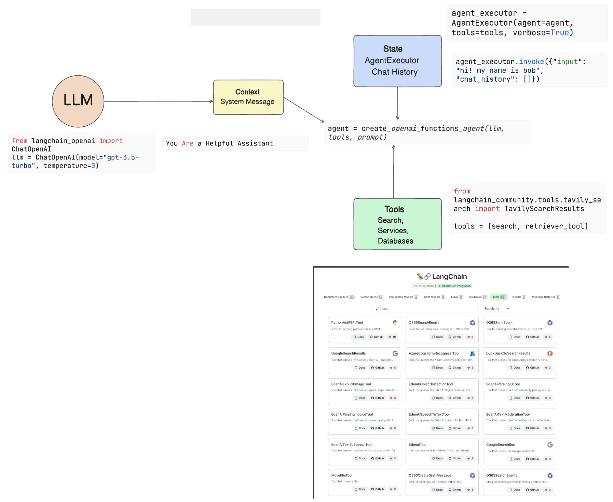
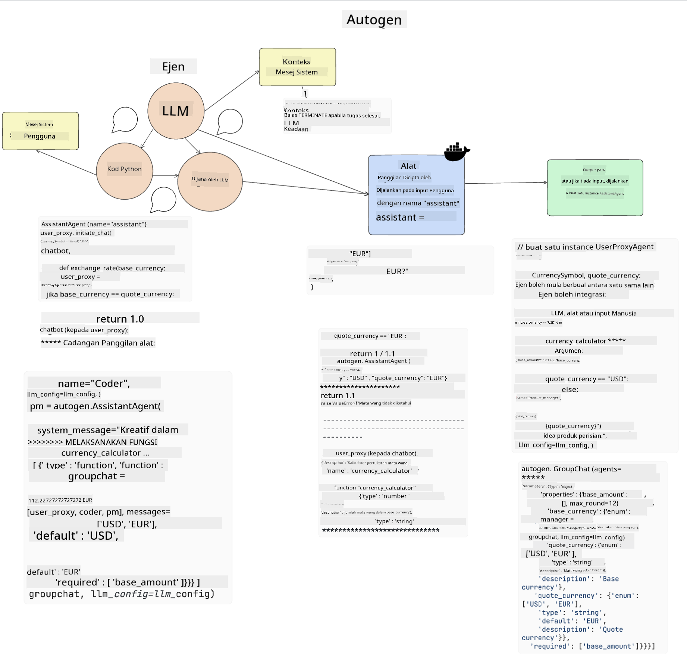

<!--
CO_OP_TRANSLATOR_METADATA:
{
  "original_hash": "11f03c81f190d9cbafd0f977dcbede6c",
  "translation_date": "2025-07-09T17:28:58+00:00",
  "source_file": "17-ai-agents/README.md",
  "language_code": "ms"
}
-->
[](https://aka.ms/gen-ai-lesson17-gh?WT.mc_id=academic-105485-koreyst)

## Pengenalan

Ejen AI mewakili perkembangan menarik dalam Generative AI, membolehkan Large Language Models (LLMs) berkembang dari pembantu kepada ejen yang mampu mengambil tindakan. Rangka kerja Ejen AI membolehkan pembangun mencipta aplikasi yang memberikan LLM akses kepada alat dan pengurusan keadaan. Rangka kerja ini juga meningkatkan keterlihatan, membolehkan pengguna dan pembangun memantau tindakan yang dirancang oleh LLM, sekali gus memperbaiki pengurusan pengalaman.

Pelajaran ini akan merangkumi bidang berikut:

- Memahami apa itu Ejen AI - Apakah sebenarnya Ejen AI?
- Meneroka empat Rangka Kerja Ejen AI yang berbeza - Apa yang membezakannya?
- Mengaplikasikan Ejen AI ini kepada pelbagai kes penggunaan - Bila kita harus menggunakan Ejen AI?

## Matlamat Pembelajaran

Selepas mengikuti pelajaran ini, anda akan dapat:

- Menerangkan apa itu Ejen AI dan bagaimana ia boleh digunakan.
- Memahami perbezaan antara beberapa Rangka Kerja Ejen AI yang popular, dan bagaimana ia berbeza.
- Memahami cara Ejen AI berfungsi untuk membina aplikasi menggunakan mereka.

## Apakah Ejen AI?

Ejen AI adalah bidang yang sangat menarik dalam dunia Generative AI. Bersama dengan keterujaan ini kadang-kadang timbul kekeliruan tentang istilah dan penggunaannya. Untuk memudahkan dan merangkumi kebanyakan alat yang merujuk kepada Ejen AI, kami akan menggunakan definisi ini:

Ejen AI membolehkan Large Language Models (LLMs) melaksanakan tugasan dengan memberikan mereka akses kepada **keadaan** dan **alat**.


Mari kita definisikan istilah ini:

**Large Language Models** - Ini adalah model yang dirujuk sepanjang kursus ini seperti GPT-3.5, GPT-4, Llama-2, dan lain-lain.

**Keadaan** - Ini merujuk kepada konteks di mana LLM sedang beroperasi. LLM menggunakan konteks tindakan lalu dan konteks semasa untuk membimbing pembuatan keputusan bagi tindakan seterusnya. Rangka kerja Ejen AI membolehkan pembangun mengekalkan konteks ini dengan lebih mudah.

**Alat** - Untuk melengkapkan tugasan yang diminta oleh pengguna dan yang telah dirancang oleh LLM, LLM memerlukan akses kepada alat. Contoh alat boleh jadi pangkalan data, API, aplikasi luaran atau bahkan LLM lain!

Definisi ini diharapkan dapat memberikan asas yang baik apabila kita melihat bagaimana ia dilaksanakan. Mari kita terokai beberapa rangka kerja Ejen AI yang berbeza:

## LangChain Agents

[LangChain Agents](https://python.langchain.com/docs/how_to/#agents?WT.mc_id=academic-105485-koreyst) adalah pelaksanaan definisi yang kami berikan di atas.

Untuk mengurus **keadaan**, ia menggunakan fungsi terbina dalam yang dipanggil `AgentExecutor`. Fungsi ini menerima `agent` yang telah ditakrifkan dan `tools` yang tersedia kepadanya.

`AgentExecutor` juga menyimpan sejarah perbualan untuk menyediakan konteks perbualan.



LangChain menawarkan [katalog alat](https://integrations.langchain.com/tools?WT.mc_id=academic-105485-koreyst) yang boleh diimport ke dalam aplikasi anda di mana LLM boleh mendapat akses. Alat-alat ini dibuat oleh komuniti dan oleh pasukan LangChain.

Anda kemudian boleh mentakrifkan alat-alat ini dan menyerahkannya kepada `AgentExecutor`.

Keterlihatan adalah aspek penting apabila bercakap tentang Ejen AI. Penting bagi pembangun aplikasi untuk memahami alat mana yang digunakan oleh LLM dan mengapa. Untuk itu, pasukan di LangChain telah membangunkan LangSmith.

## AutoGen

Rangka kerja Ejen AI seterusnya yang akan kita bincangkan ialah [AutoGen](https://microsoft.github.io/autogen/?WT.mc_id=academic-105485-koreyst). Fokus utama AutoGen adalah perbualan. Ejen adalah **boleh berbual** dan **boleh disesuaikan**.

**Boleh berbual -** LLM boleh memulakan dan meneruskan perbualan dengan LLM lain untuk melengkapkan tugasan. Ini dilakukan dengan mencipta `AssistantAgents` dan memberikan mereka mesej sistem tertentu.

```python

autogen.AssistantAgent( name="Coder", llm_config=llm_config, ) pm = autogen.AssistantAgent( name="Product_manager", system_message="Creative in software product ideas.", llm_config=llm_config, )

```

**Boleh disesuaikan** - Ejen boleh ditakrifkan bukan sahaja sebagai LLM tetapi juga sebagai pengguna atau alat. Sebagai pembangun, anda boleh mentakrifkan `UserProxyAgent` yang bertanggungjawab berinteraksi dengan pengguna untuk mendapatkan maklum balas dalam melengkapkan tugasan. Maklum balas ini boleh meneruskan pelaksanaan tugasan atau menghentikannya.

```python
user_proxy = UserProxyAgent(name="user_proxy")
```

### Keadaan dan Alat

Untuk mengubah dan mengurus keadaan, ejen pembantu menghasilkan kod Python untuk melengkapkan tugasan.

Berikut adalah contoh prosesnya:



#### LLM Ditakrifkan dengan Mesej Sistem

```python
system_message="For weather related tasks, only use the functions you have been provided with. Reply TERMINATE when the task is done."
```

Mesej sistem ini mengarahkan LLM tertentu ini fungsi mana yang relevan untuk tugasan. Ingat, dengan AutoGen anda boleh mempunyai beberapa `AssistantAgents` yang ditakrifkan dengan mesej sistem yang berbeza.

#### Perbualan Dimulakan oleh Pengguna

```python
user_proxy.initiate_chat( chatbot, message="I am planning a trip to NYC next week, can you help me pick out what to wear? ", )

```

Mesej ini dari user_proxy (Manusia) adalah yang akan memulakan proses Ejen untuk meneroka fungsi yang mungkin perlu dilaksanakan.

#### Fungsi Dilaksanakan

```bash
chatbot (to user_proxy):

***** Suggested tool Call: get_weather ***** Arguments: {"location":"New York City, NY","time_periond:"7","temperature_unit":"Celsius"} ******************************************************** --------------------------------------------------------------------------------

>>>>>>>> EXECUTING FUNCTION get_weather... user_proxy (to chatbot): ***** Response from calling function "get_weather" ***** 112.22727272727272 EUR ****************************************************************

```

Setelah perbualan awal diproses, Ejen akan menghantar cadangan alat untuk dipanggil. Dalam kes ini, ia adalah fungsi yang dipanggil `get_weather`. Bergantung pada konfigurasi anda, fungsi ini boleh dilaksanakan secara automatik dan dibaca oleh Ejen atau boleh dilaksanakan berdasarkan input pengguna.

Anda boleh mendapatkan senarai [contoh kod AutoGen](https://microsoft.github.io/autogen/docs/Examples/?WT.mc_id=academic-105485-koreyst) untuk meneroka lebih lanjut cara memulakan pembinaan.

## Taskweaver

Rangka kerja ejen seterusnya yang akan kita terokai ialah [Taskweaver](https://microsoft.github.io/TaskWeaver/?WT.mc_id=academic-105485-koreyst). Ia dikenali sebagai ejen "code-first" kerana ia tidak bekerja secara ketat dengan `strings`, sebaliknya boleh bekerja dengan DataFrames dalam Python. Ini sangat berguna untuk tugasan analisis data dan penjanaan. Contohnya seperti membuat graf dan carta atau menjana nombor rawak.

### Keadaan dan Alat

Untuk mengurus keadaan perbualan, TaskWeaver menggunakan konsep `Planner`. `Planner` adalah LLM yang mengambil permintaan dari pengguna dan memetakan tugasan yang perlu diselesaikan untuk memenuhi permintaan tersebut.

Untuk melengkapkan tugasan, `Planner` diberi akses kepada koleksi alat yang dipanggil `Plugins`. Ini boleh jadi kelas Python atau penafsir kod umum. Plugin ini disimpan sebagai embeddings supaya LLM boleh mencari plugin yang betul dengan lebih baik.


Berikut adalah contoh plugin untuk mengendalikan pengesanan anomali:

```python
class AnomalyDetectionPlugin(Plugin): def __call__(self, df: pd.DataFrame, time_col_name: str, value_col_name: str):
```

Kod ini disahkan sebelum dilaksanakan. Satu lagi ciri untuk mengurus konteks dalam Taskweaver ialah `experience`. Experience membolehkan konteks perbualan disimpan untuk jangka masa panjang dalam fail YAML. Ini boleh dikonfigurasikan supaya LLM bertambah baik dari masa ke masa dalam tugasan tertentu dengan pendedahan kepada perbualan terdahulu.

## JARVIS

Rangka kerja ejen terakhir yang akan kita terokai ialah [JARVIS](https://github.com/microsoft/JARVIS?tab=readme-ov-file?WT.mc_id=academic-105485-koreyst). Apa yang membezakan JARVIS ialah ia menggunakan LLM untuk mengurus `keadaan` perbualan dan `tools` adalah model AI lain. Setiap model AI ini adalah model khusus yang melaksanakan tugasan tertentu seperti pengesanan objek, transkripsi atau kapsyen imej.


LLM, sebagai model tujuan umum, menerima permintaan dari pengguna dan mengenal pasti tugasan khusus serta sebarang argumen/data yang diperlukan untuk melengkapkan tugasan.

```python
[{"task": "object-detection", "id": 0, "dep": [-1], "args": {"image": "e1.jpg" }}]
```

LLM kemudian memformat permintaan dalam cara yang boleh ditafsir oleh model AI khusus, seperti JSON. Setelah model AI mengembalikan ramalannya berdasarkan tugasan, LLM menerima respons tersebut.

Jika beberapa model diperlukan untuk melengkapkan tugasan, ia juga akan mentafsir respons dari model-model tersebut sebelum menggabungkannya untuk menghasilkan respons kepada pengguna.

Contoh di bawah menunjukkan bagaimana ini berfungsi apabila pengguna meminta penerangan dan kiraan objek dalam gambar:

## Tugasan

Untuk meneruskan pembelajaran anda tentang Ejen AI, anda boleh membina dengan AutoGen:

- Aplikasi yang mensimulasikan mesyuarat perniagaan dengan jabatan-jabatan berbeza dalam sebuah startup pendidikan.
- Cipta mesej sistem yang membimbing LLM memahami persona dan keutamaan yang berbeza, dan membolehkan pengguna membentangkan idea produk baru.
- LLM kemudian harus menjana soalan susulan dari setiap jabatan untuk memperhalusi dan memperbaiki pembentangan dan idea produk tersebut.

## Pembelajaran tidak berhenti di sini, teruskan Perjalanan

Selepas menamatkan pelajaran ini, lihat koleksi [Generative AI Learning](https://aka.ms/genai-collection?WT.mc_id=academic-105485-koreyst) kami untuk terus meningkatkan pengetahuan Generative AI anda!

**Penafian**:  
Dokumen ini telah diterjemahkan menggunakan perkhidmatan terjemahan AI [Co-op Translator](https://github.com/Azure/co-op-translator). Walaupun kami berusaha untuk ketepatan, sila ambil perhatian bahawa terjemahan automatik mungkin mengandungi kesilapan atau ketidaktepatan. Dokumen asal dalam bahasa asalnya harus dianggap sebagai sumber yang sahih. Untuk maklumat penting, terjemahan profesional oleh manusia adalah disyorkan. Kami tidak bertanggungjawab atas sebarang salah faham atau salah tafsir yang timbul daripada penggunaan terjemahan ini.