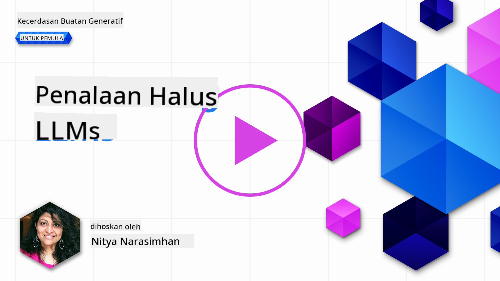
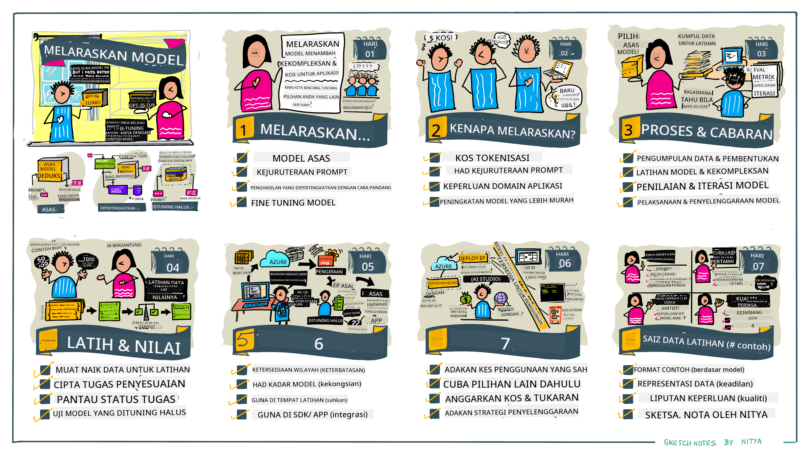

<!--
CO_OP_TRANSLATOR_METADATA:
{
  "original_hash": "68664f7e754a892ae1d8d5e2b7bd2081",
  "translation_date": "2025-07-09T17:47:01+00:00",
  "source_file": "18-fine-tuning/README.md",
  "language_code": "ms"
}
-->

# Melatih Semula LLM Anda

Menggunakan model bahasa besar untuk membina aplikasi AI generatif datang dengan cabaran baru. Isu utama adalah memastikan kualiti respons (ketepatan dan kesesuaian) dalam kandungan yang dijana oleh model untuk permintaan pengguna tertentu. Dalam pelajaran sebelum ini, kita membincangkan teknik seperti kejuruteraan prompt dan generasi dipertingkatkan pengambilan yang cuba menyelesaikan masalah dengan _mengubah input prompt_ kepada model sedia ada.

Dalam pelajaran hari ini, kita akan membincangkan teknik ketiga, **melatih semula (fine-tuning)**, yang cuba menangani cabaran ini dengan _melatih semula model itu sendiri_ menggunakan data tambahan. Mari kita selami butiran.

## Objektif Pembelajaran

Pelajaran ini memperkenalkan konsep melatih semula untuk model bahasa yang telah dilatih sebelumnya, meneroka manfaat dan cabaran pendekatan ini, serta memberikan panduan bila dan bagaimana menggunakan fine-tuning untuk meningkatkan prestasi model AI generatif anda.

Pada akhir pelajaran ini, anda sepatutnya dapat menjawab soalan berikut:

- Apakah itu fine-tuning untuk model bahasa?
- Bila dan mengapa fine-tuning berguna?
- Bagaimana saya boleh melatih semula model yang telah dilatih sebelumnya?
- Apakah had fine-tuning?

Sedia? Mari kita mulakan.

## Panduan Bergambar

Mahukan gambaran besar tentang apa yang akan kita pelajari sebelum kita mula? Lihat panduan bergambar ini yang menerangkan perjalanan pembelajaran untuk pelajaran ini - dari mempelajari konsep teras dan motivasi untuk fine-tuning, hingga memahami proses dan amalan terbaik untuk melaksanakan tugas fine-tuning. Ini adalah topik yang menarik untuk diterokai, jadi jangan lupa untuk melawat halaman [Resources](./RESOURCES.md?WT.mc_id=academic-105485-koreyst) untuk pautan tambahan yang menyokong perjalanan pembelajaran kendiri anda!

## Apakah itu fine-tuning untuk model bahasa?

Secara definisi, model bahasa besar adalah _telah dilatih sebelumnya_ menggunakan sejumlah besar teks yang diperoleh dari pelbagai sumber termasuk internet. Seperti yang telah kita pelajari dalam pelajaran sebelum ini, kita memerlukan teknik seperti _kejuruteraan prompt_ dan _generasi dipertingkatkan pengambilan_ untuk meningkatkan kualiti respons model terhadap soalan pengguna ("prompt").

Satu teknik kejuruteraan prompt yang popular melibatkan memberikan model lebih banyak panduan tentang apa yang dijangka dalam respons sama ada dengan menyediakan _arahan_ (panduan eksplisit) atau _memberikan beberapa contoh_ (panduan tersirat). Ini dikenali sebagai _pembelajaran beberapa contoh (few-shot learning)_ tetapi ia mempunyai dua had:

- Had token model boleh mengehadkan bilangan contoh yang boleh anda berikan, dan mengehadkan keberkesanannya.
- Kos token model boleh menjadikan ia mahal untuk menambah contoh pada setiap prompt, dan mengehadkan fleksibiliti.

Fine-tuning adalah amalan biasa dalam sistem pembelajaran mesin di mana kita mengambil model yang telah dilatih sebelumnya dan melatih semula dengan data baru untuk meningkatkan prestasinya pada tugas tertentu. Dalam konteks model bahasa, kita boleh melatih semula model yang telah dilatih sebelumnya _dengan set contoh yang dipilih khas untuk tugas atau domain aplikasi tertentu_ untuk menghasilkan **model tersuai** yang mungkin lebih tepat dan relevan untuk tugas atau domain tersebut. Kelebihan sampingan fine-tuning adalah ia juga boleh mengurangkan bilangan contoh yang diperlukan untuk pembelajaran beberapa contoh - mengurangkan penggunaan token dan kos berkaitan.

## Bila dan mengapa kita perlu melatih semula model?

Dalam _konteks ini_, apabila kita bercakap tentang fine-tuning, kita merujuk kepada fine-tuning **berpandukan pengawasan (supervised)** di mana latihan semula dilakukan dengan **menambah data baru** yang bukan sebahagian daripada set data latihan asal. Ini berbeza daripada pendekatan fine-tuning tanpa pengawasan di mana model dilatih semula menggunakan data asal, tetapi dengan hiperparameter yang berbeza.

Perkara utama yang perlu diingat ialah fine-tuning adalah teknik lanjutan yang memerlukan tahap kepakaran tertentu untuk mendapatkan hasil yang diingini. Jika dilakukan dengan tidak betul, ia mungkin tidak memberikan peningkatan yang dijangka, malah boleh merosakkan prestasi model untuk domain sasaran anda.

Jadi, sebelum anda belajar "bagaimana" untuk melatih semula model bahasa, anda perlu tahu "mengapa" anda perlu mengambil pendekatan ini, dan "bila" untuk memulakan proses fine-tuning. Mulakan dengan bertanya pada diri sendiri soalan-soalan ini:

- **Kes Penggunaan**: Apakah _kes penggunaan_ anda untuk fine-tuning? Aspek manakah model yang telah dilatih sebelumnya yang anda ingin perbaiki?
- **Alternatif**: Adakah anda telah mencuba _teknik lain_ untuk mencapai hasil yang diingini? Gunakan teknik tersebut untuk mencipta garis asas perbandingan.
  - Kejuruteraan prompt: Cuba teknik seperti few-shot prompting dengan contoh respons prompt yang relevan. Nilai kualiti respons.
  - Generasi Dipertingkatkan Pengambilan: Cuba menambah prompt dengan hasil carian data anda. Nilai kualiti respons.
- **Kos**: Adakah anda telah mengenal pasti kos untuk fine-tuning?
  - Kebolehtalaan - adakah model yang telah dilatih tersedia untuk fine-tuning?
  - Usaha - untuk menyediakan data latihan, menilai & memperbaiki model.
  - Pengkomputeran - untuk menjalankan tugasan fine-tuning, dan menyebarkan model yang telah dilatih semula
  - Data - akses kepada contoh berkualiti yang mencukupi untuk impak fine-tuning
- **Manfaat**: Adakah anda telah mengesahkan manfaat fine-tuning?
  - Kualiti - adakah model yang telah dilatih semula mengatasi garis asas?
  - Kos - adakah ia mengurangkan penggunaan token dengan memudahkan prompt?
  - Kebolehlanjutan - bolehkah anda menggunakan semula model asas untuk domain baru?

Dengan menjawab soalan-soalan ini, anda sepatutnya dapat memutuskan sama ada fine-tuning adalah pendekatan yang sesuai untuk kes penggunaan anda. Secara ideal, pendekatan ini sah hanya jika manfaat melebihi kos. Setelah anda memutuskan untuk meneruskan, tiba masanya untuk memikirkan _bagaimana_ anda boleh melatih semula model yang telah dilatih sebelumnya.

Mahukan lebih banyak pandangan tentang proses membuat keputusan? Tonton [To fine-tune or not to fine-tune](https://www.youtube.com/watch?v=0Jo-z-MFxJs)

## Bagaimana kita boleh melatih semula model yang telah dilatih sebelumnya?

Untuk melatih semula model yang telah dilatih sebelumnya, anda perlu mempunyai:

- model yang telah dilatih sebelumnya untuk dilatih semula
- set data untuk digunakan dalam fine-tuning
- persekitaran latihan untuk menjalankan tugasan fine-tuning
- persekitaran hos untuk menyebarkan model yang telah dilatih semula

## Fine-Tuning Dalam Tindakan

Sumber berikut menyediakan tutorial langkah demi langkah untuk membimbing anda melalui contoh sebenar menggunakan model terpilih dengan set data yang dipilih khas. Untuk mengikuti tutorial ini, anda memerlukan akaun pada penyedia tertentu, bersama akses kepada model dan set data yang relevan.

| Penyedia     | Tutorial                                                                                                                                                                       | Penerangan                                                                                                                                                                                                                                                                                                                                                                                                                        |
| ------------ | ------------------------------------------------------------------------------------------------------------------------------------------------------------------------------ | ---------------------------------------------------------------------------------------------------------------------------------------------------------------------------------------------------------------------------------------------------------------------------------------------------------------------------------------------------------------------------------------------------------------------------------- |
| OpenAI       | [How to fine-tune chat models](https://github.com/openai/openai-cookbook/blob/main/examples/How_to_finetune_chat_models.ipynb?WT.mc_id=academic-105485-koreyst)                | Belajar melatih semula `gpt-35-turbo` untuk domain tertentu ("pembantu resipi") dengan menyediakan data latihan, menjalankan tugasan fine-tuning, dan menggunakan model yang telah dilatih semula untuk inferens.                                                                                                                                                                                                                   |
| Azure OpenAI | [GPT 3.5 Turbo fine-tuning tutorial](https://learn.microsoft.com/azure/ai-services/openai/tutorials/fine-tune?tabs=python-new%2Ccommand-line?WT.mc_id=academic-105485-koreyst) | Belajar melatih semula model `gpt-35-turbo-0613` **di Azure** dengan langkah-langkah untuk mencipta & memuat naik data latihan, menjalankan tugasan fine-tuning. Sebarkan & gunakan model baru.                                                                                                                                                                                                                                   |
| Hugging Face | [Fine-tuning LLMs with Hugging Face](https://www.philschmid.de/fine-tune-llms-in-2024-with-trl?WT.mc_id=academic-105485-koreyst)                                               | Pos blog ini membimbing anda melatih semula _open LLM_ (contoh: `CodeLlama 7B`) menggunakan perpustakaan [transformers](https://huggingface.co/docs/transformers/index?WT.mc_id=academic-105485-koreyst) & [Transformer Reinforcement Learning (TRL)](https://huggingface.co/docs/trl/index?WT.mc_id=academic-105485-koreyst) dengan set data terbuka di Hugging Face.                                                                 |
|              |                                                                                                                                                                                |                                                                                                                                                                                                                                                                                                                                                                                                                                    |
| 🤗 AutoTrain | [Fine-tuning LLMs with AutoTrain](https://github.com/huggingface/autotrain-advanced/?WT.mc_id=academic-105485-koreyst)                                                         | AutoTrain (atau AutoTrain Advanced) adalah perpustakaan python yang dibangunkan oleh Hugging Face yang membolehkan fine-tuning untuk pelbagai tugasan termasuk fine-tuning LLM. AutoTrain adalah penyelesaian tanpa kod dan fine-tuning boleh dilakukan di awan anda sendiri, di Hugging Face Spaces atau secara tempatan. Ia menyokong GUI berasaskan web, CLI dan latihan melalui fail konfigurasi yaml.                                   |
|              |                                                                                                                                                                                |                                                                                                                                                                                                                                                                                                                                                                                                                                    |

## Tugasan

Pilih salah satu tutorial di atas dan ikuti langkah-langkahnya. _Kami mungkin akan menyalin versi tutorial ini dalam Jupyter Notebooks dalam repo ini untuk rujukan sahaja. Sila gunakan sumber asal secara langsung untuk mendapatkan versi terkini_.

## Kerja Hebat! Teruskan Pembelajaran Anda.

Selepas menamatkan pelajaran ini, lawati koleksi [Generative AI Learning](https://aka.ms/genai-collection?WT.mc_id=academic-105485-koreyst) kami untuk terus meningkatkan pengetahuan AI Generatif anda!

Tahniah!! Anda telah menamatkan pelajaran terakhir dari siri v2 untuk kursus ini! Jangan berhenti belajar dan membina. \*\*Lihat halaman [RESOURCES](RESOURCES.md?WT.mc_id=academic-105485-koreyst) untuk senarai cadangan tambahan khusus untuk topik ini.

Siri pelajaran v1 kami juga telah dikemas kini dengan lebih banyak tugasan dan konsep. Jadi luangkan masa sekejap untuk menyegarkan pengetahuan anda - dan sila [kongsi soalan dan maklum balas anda](https://github.com/microsoft/generative-ai-for-beginners/issues?WT.mc_id=academic-105485-koreyst) untuk membantu kami memperbaiki pelajaran ini untuk komuniti.

**Penafian**:  
Dokumen ini telah diterjemahkan menggunakan perkhidmatan terjemahan AI [Co-op Translator](https://github.com/Azure/co-op-translator). Walaupun kami berusaha untuk ketepatan, sila ambil perhatian bahawa terjemahan automatik mungkin mengandungi kesilapan atau ketidaktepatan. Dokumen asal dalam bahasa asalnya harus dianggap sebagai sumber yang sahih. Untuk maklumat penting, terjemahan profesional oleh manusia adalah disyorkan. Kami tidak bertanggungjawab atas sebarang salah faham atau salah tafsir yang timbul daripada penggunaan terjemahan ini.