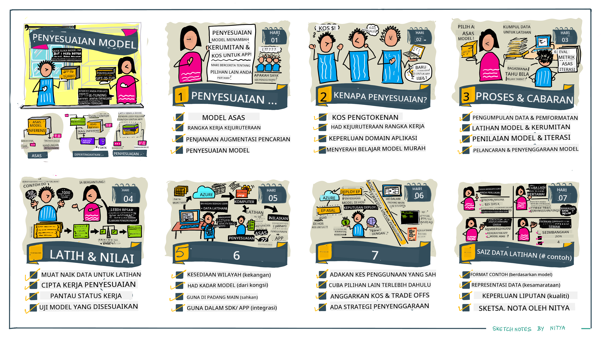

<!--
CO_OP_TRANSLATOR_METADATA:
{
  "original_hash": "68664f7e754a892ae1d8d5e2b7bd2081",
  "translation_date": "2025-05-20T07:54:24+00:00",
  "source_file": "18-fine-tuning/README.md",
  "language_code": "ms"
}
-->

# Menyesuaikan LLM Anda

Menggunakan model bahasa besar untuk membina aplikasi AI generatif datang dengan cabaran baru. Isu utama adalah memastikan kualiti respons (ketepatan dan relevan) dalam kandungan yang dihasilkan oleh model untuk permintaan pengguna tertentu. Dalam pelajaran sebelumnya, kita telah membincangkan teknik seperti kejuruteraan prompt dan penghasilan yang diperkaya pengambilan yang cuba menyelesaikan masalah dengan _mengubah input prompt_ kepada model sedia ada.

Dalam pelajaran hari ini, kita akan membincangkan teknik ketiga, **penyesuaian**, yang cuba menangani cabaran dengan _melatih semula model itu sendiri_ dengan data tambahan. Mari kita selami butirannya.

## Objektif Pembelajaran

Pelajaran ini memperkenalkan konsep penyesuaian untuk model bahasa yang telah dilatih, meneroka manfaat dan cabaran pendekatan ini, dan memberikan panduan bila dan bagaimana menggunakan penyesuaian untuk meningkatkan prestasi model AI generatif anda.

Pada akhir pelajaran ini, anda sepatutnya dapat menjawab soalan-soalan berikut:

- Apakah penyesuaian untuk model bahasa?
- Bilakah, dan mengapa, penyesuaian berguna?
- Bagaimana saya boleh menyesuaikan model yang telah dilatih?
- Apakah batasan penyesuaian?

Sedia? Mari kita mulakan.

## Panduan Bergambar

Ingin mendapatkan gambaran keseluruhan tentang apa yang akan kita bahas sebelum kita mendalami? Lihat panduan bergambar ini yang menerangkan perjalanan pembelajaran untuk pelajaran ini - dari mempelajari konsep teras dan motivasi untuk penyesuaian, hingga memahami proses dan amalan terbaik untuk melaksanakan tugas penyesuaian. Ini adalah topik yang menarik untuk diterokai, jadi jangan lupa untuk melihat halaman [Sumber](./RESOURCES.md?WT.mc_id=academic-105485-koreyst) untuk pautan tambahan bagi menyokong perjalanan pembelajaran kendiri anda!

## Apakah penyesuaian untuk model bahasa?

Secara definisi, model bahasa besar adalah _dilatih awal_ pada kuantiti teks yang besar yang diperoleh dari pelbagai sumber termasuk internet. Seperti yang telah kita pelajari dalam pelajaran sebelumnya, kita memerlukan teknik seperti _kejuruteraan prompt_ dan _penghasilan yang diperkaya pengambilan_ untuk meningkatkan kualiti respons model terhadap soalan pengguna ("prompt").

Satu teknik kejuruteraan prompt yang popular melibatkan memberikan model lebih panduan tentang apa yang diharapkan dalam respons sama ada dengan memberikan _arahan_ (panduan eksplisit) atau _memberikan beberapa contoh_ (panduan implisit). Ini disebut sebagai _pembelajaran beberapa tembakan_ tetapi ia mempunyai dua batasan:

- Had token model boleh mengehadkan jumlah contoh yang boleh anda berikan, dan mengehadkan keberkesanan.
- Kos token model boleh menjadikannya mahal untuk menambah contoh kepada setiap prompt, dan mengehadkan fleksibiliti.

Penyesuaian adalah amalan biasa dalam sistem pembelajaran mesin di mana kita mengambil model yang telah dilatih dan melatih semula dengan data baru untuk meningkatkan prestasinya pada tugas tertentu. Dalam konteks model bahasa, kita boleh menyesuaikan model yang telah dilatih _dengan set contoh yang dikurasi untuk tugas atau domain aplikasi tertentu_ untuk mencipta **model tersuai** yang mungkin lebih tepat dan relevan untuk tugas atau domain tersebut. Manfaat sampingan penyesuaian adalah ia juga boleh mengurangkan jumlah contoh yang diperlukan untuk pembelajaran beberapa tembakan - mengurangkan penggunaan token dan kos berkaitan.

## Bilakah dan mengapa kita perlu menyesuaikan model?

Dalam konteks _ini_, apabila kita bercakap tentang penyesuaian, kita merujuk kepada penyesuaian **diselia** di mana latihan semula dilakukan dengan **menambah data baru** yang bukan sebahagian daripada set data latihan asal. Ini berbeza daripada pendekatan penyesuaian tidak diselia di mana model dilatih semula pada data asal, tetapi dengan hiperparameter yang berbeza.

Perkara utama yang perlu diingat ialah penyesuaian adalah teknik maju yang memerlukan tahap kepakaran tertentu untuk mendapatkan hasil yang diinginkan. Jika dilakukan dengan tidak betul, ia mungkin tidak memberikan peningkatan yang diharapkan, dan mungkin malah menurunkan prestasi model untuk domain yang disasarkan.

Jadi, sebelum anda mempelajari "bagaimana" untuk menyesuaikan model bahasa, anda perlu tahu "mengapa" anda harus mengambil laluan ini, dan "bilakah" untuk memulakan proses penyesuaian. Mulakan dengan bertanya kepada diri sendiri soalan-soalan ini:

- **Kes Penggunaan**: Apakah _kes penggunaan_ anda untuk penyesuaian? Aspek mana dari model yang telah dilatih sekarang yang ingin anda tingkatkan?
- **Alternatif**: Adakah anda telah mencuba _teknik lain_ untuk mencapai hasil yang diinginkan? Gunakan mereka untuk mencipta asas untuk perbandingan.
  - Kejuruteraan prompt: Cuba teknik seperti prompt beberapa tembakan dengan contoh respons prompt yang relevan. Nilai kualiti respons.
  - Penghasilan yang Diperkaya Pengambilan: Cuba memperkayakan prompt dengan hasil carian yang diperoleh dengan mencari data anda. Nilai kualiti respons.
- **Kos**: Adakah anda telah mengenal pasti kos untuk penyesuaian?
  - Kebolehsesuaian - adakah model yang telah dilatih tersedia untuk penyesuaian?
  - Usaha - untuk menyediakan data latihan, menilai & memperbaiki model.
  - Pengiraan - untuk menjalankan pekerjaan penyesuaian, dan menggunakan model yang telah disesuaikan
  - Data - akses kepada contoh berkualiti yang mencukupi untuk kesan penyesuaian
- **Manfaat**: Adakah anda telah mengesahkan manfaat untuk penyesuaian?
  - Kualiti - adakah model yang telah disesuaikan mengatasi asas?
  - Kos - adakah ia mengurangkan penggunaan token dengan mempermudahkan prompt?
  - Kebolehlanjutan - bolehkah anda menggunakan semula model asas untuk domain baru?

Dengan menjawab soalan-soalan ini, anda seharusnya dapat memutuskan jika penyesuaian adalah pendekatan yang tepat untuk kes penggunaan anda. Idealnya, pendekatan ini sah hanya jika manfaatnya melebihi kos. Setelah anda memutuskan untuk meneruskan, sudah tiba masanya untuk memikirkan _bagaimana_ anda boleh menyesuaikan model yang telah dilatih.

Ingin mendapatkan lebih banyak wawasan tentang proses membuat keputusan? Tonton [Untuk menyesuaikan atau tidak menyesuaikan](https://www.youtube.com/watch?v=0Jo-z-MFxJs)

## Bagaimana kita boleh menyesuaikan model yang telah dilatih?

Untuk menyesuaikan model yang telah dilatih, anda perlu mempunyai:

- model yang telah dilatih untuk disesuaikan
- set data untuk digunakan dalam penyesuaian
- persekitaran latihan untuk menjalankan pekerjaan penyesuaian
- persekitaran hosting untuk menggunakan model yang telah disesuaikan

## Penyesuaian Dalam Tindakan

Sumber berikut menyediakan tutorial langkah demi langkah untuk memandu anda melalui contoh sebenar menggunakan model terpilih dengan set data yang dikurasi. Untuk melalui tutorial ini, anda memerlukan akaun pada penyedia tertentu, bersama dengan akses kepada model dan set data yang relevan.

| Penyedia     | Tutorial                                                                                                                                                                       | Penerangan                                                                                                                                                                                                                                                                                                                                                                                                                        |
| ------------ | ------------------------------------------------------------------------------------------------------------------------------------------------------------------------------ | ---------------------------------------------------------------------------------------------------------------------------------------------------------------------------------------------------------------------------------------------------------------------------------------------------------------------------------------------------------------------------------------------------------------------------------- |
| OpenAI       | [Cara menyesuaikan model sembang](https://github.com/openai/openai-cookbook/blob/main/examples/How_to_finetune_chat_models.ipynb?WT.mc_id=academic-105485-koreyst)                | Pelajari cara menyesuaikan `gpt-35-turbo` untuk domain tertentu ("pembantu resipi") dengan menyediakan data latihan, menjalankan pekerjaan penyesuaian, dan menggunakan model yang telah disesuaikan untuk inferens.                                                                                                                                                                                                                                              |
| Azure OpenAI | [Tutorial penyesuaian GPT 3.5 Turbo](https://learn.microsoft.com/azure/ai-services/openai/tutorials/fine-tune?tabs=python-new%2Ccommand-line?WT.mc_id=academic-105485-koreyst) | Pelajari cara menyesuaikan model `gpt-35-turbo-0613` **di Azure** dengan mengambil langkah untuk mencipta & memuat naik data latihan, menjalankan pekerjaan penyesuaian. Gunakan & gunakan model baru.                                                                                                                                                                                                                                                                 |
| Hugging Face | [Menyesuaikan LLM dengan Hugging Face](https://www.philschmid.de/fine-tune-llms-in-2024-with-trl?WT.mc_id=academic-105485-koreyst)                                               | Kiriman blog ini memandu anda menyesuaikan _LLM terbuka_ (contoh: `CodeLlama 7B`) menggunakan perpustakaan [transformers](https://huggingface.co/docs/transformers/index?WT.mc_id=academic-105485-koreyst) & [Pembelajaran Pengukuhan Transformer (TRL)](https://huggingface.co/docs/trl/index?WT.mc_id=academic-105485-koreyst]) dengan set data terbuka [datasets](https://huggingface.co/docs/datasets/index?WT.mc_id=academic-105485-koreyst) di Hugging Face. |
|              |                                                                                                                                                                                |                                                                                                                                                                                                                                                                                                                                                                                                                                    |
| 🤗 AutoTrain | [Menyesuaikan LLM dengan AutoTrain](https://github.com/huggingface/autotrain-advanced/?WT.mc_id=academic-105485-koreyst)                                                         | AutoTrain (atau AutoTrain Advanced) adalah perpustakaan python yang dibangunkan oleh Hugging Face yang membolehkan penyesuaian untuk pelbagai tugas termasuk penyesuaian LLM. AutoTrain adalah penyelesaian tanpa kod dan penyesuaian boleh dilakukan dalam awan anda sendiri, di Hugging Face Spaces atau secara tempatan. Ia menyokong GUI berasaskan web, CLI dan latihan melalui fail konfigurasi yaml.                                                                               |
|              |                                                                                                                                                                                |                                                                                                                                                                                                                                                                                                                                                                                                                                    |

## Tugasan

Pilih salah satu daripada tutorial di atas dan lalui mereka. _Kami mungkin meniru versi tutorial ini dalam Jupyter Notebooks dalam repo ini untuk rujukan sahaja. Sila gunakan sumber asal secara langsung untuk mendapatkan versi terkini_.

## Kerja Hebat! Teruskan Pembelajaran Anda.

Setelah menyelesaikan pelajaran ini, lihat koleksi [Pembelajaran AI Generatif](https://aka.ms/genai-collection?WT.mc_id=academic-105485-koreyst) kami untuk terus meningkatkan pengetahuan AI Generatif anda!

Tahniah!! Anda telah menyelesaikan pelajaran terakhir dari siri v2 untuk kursus ini! Jangan berhenti belajar dan membina. **Lihat halaman [SUMBER](RESOURCES.md?WT.mc_id=academic-105485-koreyst) untuk senarai cadangan tambahan hanya untuk topik ini.

Siri pelajaran v1 kami juga telah dikemas kini dengan lebih banyak tugasan dan konsep. Jadi luangkan masa untuk menyegarkan pengetahuan anda - dan sila [kongsikan soalan dan maklum balas anda](https://github.com/microsoft/generative-ai-for-beginners/issues?WT.mc_id=academic-105485-koreyst) untuk membantu kami memperbaiki pelajaran ini untuk komuniti.

**Penafian**: 
Dokumen ini telah diterjemahkan menggunakan perkhidmatan terjemahan AI [Co-op Translator](https://github.com/Azure/co-op-translator). Walaupun kami berusaha untuk memastikan ketepatan, sila ambil perhatian bahawa terjemahan automatik mungkin mengandungi kesilapan atau ketidaktepatan. Dokumen asal dalam bahasa asalnya harus dianggap sebagai sumber yang berwibawa. Untuk maklumat kritikal, terjemahan manusia profesional adalah disyorkan. Kami tidak bertanggungjawab atas sebarang salah faham atau salah tafsir yang timbul daripada penggunaan terjemahan ini.