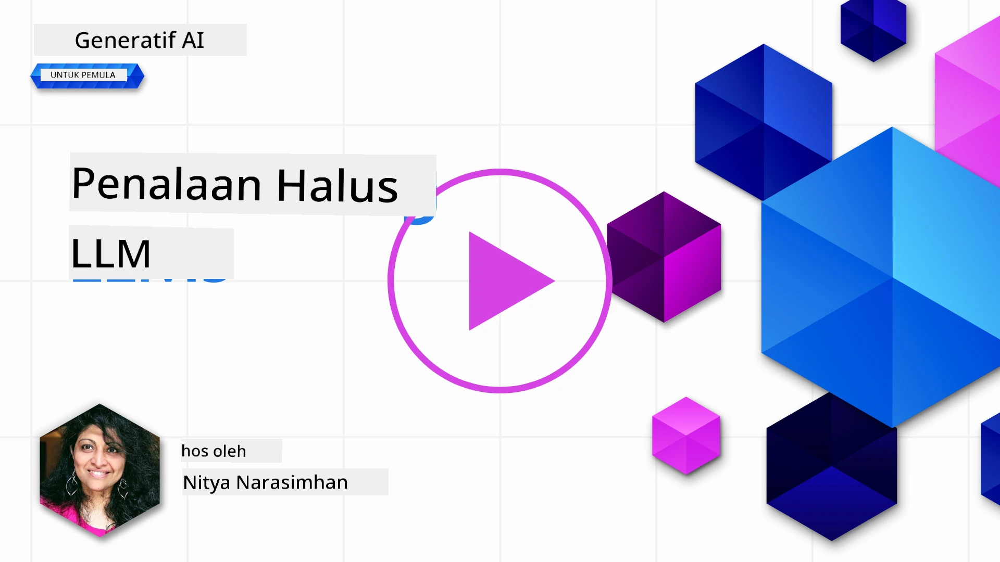

# Penalaan Halus LLM Anda

Menggunakan model bahasa besar untuk membina aplikasi AI generatif datang dengan cabaran baru. Isu utama adalah memastikan kualiti respons (ketepatan dan relevansi) dalam kandungan yang dijana oleh model bagi permintaan pengguna tertentu. Dalam pelajaran sebelumnya, kami membincangkan teknik seperti kejuruteraan prompt dan generasi ditambah pengambilan yang cuba menyelesaikan masalah dengan _meminda input prompt_ kepada model sedia ada.

Dalam pelajaran hari ini, kita membincangkan satu teknik ketiga, **penalaan halus**, yang cuba menangani cabaran tersebut dengan _melatih semula model itu sendiri_ menggunakan data tambahan. Mari kita teroka butirannya.

## Objektif Pembelajaran

Pelajaran ini memperkenalkan konsep penalaan halus untuk model bahasa yang telah dipra-latih, meneroka manfaat dan cabaran pendekatan ini, serta memberi panduan bila dan bagaimana menggunakan penalaan halus untuk memperbaiki prestasi model AI generatif anda.

Menjelang akhir pelajaran ini, anda harus dapat menjawab soalan berikut:

- Apakah penalaan halus untuk model bahasa?
- Bila, dan mengapa, penalaan halus berguna?
- Bagaimana saya boleh menala halus model yang dipra-latih?
- Apakah had penalaan halus?

Bersedia? Mari kita mulakan.

## Panduan Bergambar

Mahukan gambaran besar apa yang akan kita bincangkan sebelum kita menyelami? Lihat panduan bergambar ini yang menerangkan perjalanan pembelajaran untuk pelajaran ini - dari mempelajari konsep teras dan motivasi untuk penalaan halus, hingga memahami proses dan amalan terbaik untuk melaksanakan tugas penalaan halus. Ini adalah topik yang menarik untuk diteroka, jadi jangan lupa untuk melawat halaman [Sumber](./RESOURCES.md?WT.mc_id=academic-105485-koreyst) untuk pautan tambahan menyokong perjalanan pembelajaran kendiri anda!

## Apakah penalaan halus untuk model bahasa?

Secara definisi, model bahasa besar adalah _dipra-latih_ pada sejumlah besar teks yang berasal dari pelbagai sumber termasuk internet. Seperti yang telah kita pelajari dalam pelajaran sebelumnya, kita memerlukan teknik seperti _kejuruteraan prompt_ dan _generasi ditambah pengambilan_ untuk meningkatkan kualiti respons model kepada soalan pengguna ("prompt").

Satu teknik kejuruteraan prompt popular adalah dengan memberikan model lebih banyak panduan tentang apa yang diharapkan dalam respons sama ada dengan memberikan _arahan_ (panduan eksplisit) atau _memberikan beberapa contoh_ (panduan tersirat). Ini dirujuk sebagai _pembelajaran sedikit tembakan_ tetapi ada dua had:

- Had token model boleh mengehadkan jumlah contoh yang anda boleh berikan, dan mengehadkan keberkesanan.
- Kos token model boleh menyebabkan kos tinggi untuk menambah contoh pada setiap prompt, dan mengehadkan fleksibiliti.

Penalaan halus adalah amalan biasa dalam sistem pembelajaran mesin di mana kita mengambil model yang dipra-latih dan melatih semula dengan data baru untuk meningkatkan prestasi pada tugas khusus. Dalam konteks model bahasa, kita boleh menala halus model pra-latih _dengan set contoh terpilih untuk tugas atau domain aplikasi tertentu_ untuk mencipta **model khas** yang mungkin lebih tepat dan relevan untuk tugas atau domain tersebut. Kelebihan sampingan penalaan halus adalah ia juga dapat mengurangkan jumlah contoh yang diperlukan untuk pembelajaran sedikit tembakan - mengurangkan penggunaan token dan kos berkaitan.

## Bila dan mengapa kita patut menala halus model?

Dalam konteks _ini_, apabila kita bercakap tentang penalaan halus, kita merujuk kepada penalaan halus **terarah** di mana latihan semula dilakukan dengan **menambah data baru** yang bukan sebahagian daripada set data latihan asal. Ini berbeza daripada pendekatan penalaan halus tanpa pengawasan di mana model dilatih semula pada data asal, tetapi dengan hyperparameter yang berbeza.

Perkara utama untuk diingat ialah penalaan halus adalah teknik lanjutan yang memerlukan tahap kepakaran tertentu untuk mendapatkan hasil yang diingini. Jika dilakukan dengan tidak betul, ia mungkin tidak memberikan peningkatan yang dijangkakan, dan malah boleh merendahkan prestasi model untuk domain sasaran anda.

Jadi, sebelum anda belajar "bagaimana" untuk menala halus model bahasa, anda perlu tahu "mengapa" anda harus memilih jalan ini, dan "bilakah" mula proses penalaan halus. Mulakan dengan bertanya soalan ini pada diri sendiri:

- **Kes Penggunaan**: Apakah _kes penggunaan_ anda untuk penalaan halus? Aspek manakah model pra-latih sedia ada yang anda ingin tingkatkan?
- **Alternatif**: Adakah anda telah mencuba _teknik lain_ untuk mencapai hasil yang diinginkan? Gunakan mereka untuk mencipta garis dasar untuk perbandingan.
  - Kejuruteraan prompt: Cuba teknik seperti sedikit tembakan menggunakan contoh respons prompt yang relevan. Nilai kualiti respons.
  - Generasi Ditambah Pengambilan: Cuba menambah prompt dengan keputusan pertanyaan yang diperoleh dari carian data anda. Nilai kualiti respons.
- **Kos**: Adakah anda mengenal pasti kos untuk penalaan halus?
  - Kebolehtalaan - adakah model pra-latih tersedia untuk penalaan halus?
  - Usaha - untuk menyediakan data latihan, menilai & memperbaiki model.
  - Pengkomputeran - untuk menjalankan tugas penalaan halus, dan menggunakan model yang ditala halus
  - Data - akses kepada contoh berkualiti mencukupi untuk impak penalaan halus
- **Manfaat**: Adakah anda telah mengesahkan manfaat penalaan halus?
  - Kualiti - adakah model yang ditala halus mengatasi garis dasar?
  - Kos - adakah ia mengurangkan penggunaan token dengan memudahkan prompt?
  - Keterluasan - bolehkah anda guna semula model asas untuk domain baru?

Dengan menjawab soalan ini, anda harus dapat memutuskan sama ada penalaan halus adalah pendekatan yang betul untuk kes penggunaan anda. Secara ideal, pendekatan ini sah hanya jika manfaat melebihi kos. Setelah anda memutuskan untuk meneruskan, sudah tiba masanya untuk memikirkan _bagaimana_ anda boleh menala halus model pra-latih.

Mahukan lebih pandangan mengenai proses membuat keputusan? Tonton [To fine-tune or not to fine-tune](https://www.youtube.com/watch?v=0Jo-z-MFxJs)

## Bagaimana kita boleh menala halus model pra-latih?

Untuk menala halus model pra-latih, anda perlu mempunyai:

- model pra-latih untuk ditala halus
- set data untuk digunakan dalam penalaan halus
- persekitaran latihan untuk menjalankan tugas penalaan halus
- persekitaran hosting untuk melaksanakan model yang ditala halus

## Penalaan Halus Dalam Tindakan

Sumber berikut menyediakan tutorial langkah demi langkah untuk membimbing anda melalui contoh sebenar menggunakan model terpilih dengan dataset terpilih. Untuk mengikuti tutorial ini, anda memerlukan akaun pada penyedia tertentu, bersama akses ke model dan dataset yang relevan.

| Penyedia     | Tutorial                                                                                                                                                                       | Penerangan                                                                                                                                                                                                                                                                                                                                                                                                                        |
| ------------ | ------------------------------------------------------------------------------------------------------------------------------------------------------------------------------ | ---------------------------------------------------------------------------------------------------------------------------------------------------------------------------------------------------------------------------------------------------------------------------------------------------------------------------------------------------------------------------------------------------------------------------------- |
| OpenAI       | [Cara menala halus model chat](https://github.com/openai/openai-cookbook/blob/main/examples/How_to_finetune_chat_models.ipynb?WT.mc_id=academic-105485-koreyst)                | Belajar cara menala halus `gpt-35-turbo` untuk domain khusus ("penolong resipi") dengan menyediakan data latihan, menjalankan tugas penalaan halus, dan menggunakan model yang ditala halus untuk inferens.                                                                                                                                                                                                                        |
| Azure OpenAI | [Tutorial penalaan halus GPT 3.5 Turbo](https://learn.microsoft.com/azure/ai-services/openai/tutorials/fine-tune?tabs=python-new%2Ccommand-line&WT.mc_id=academic-105485-koreyst) | Belajar menala halus model `gpt-35-turbo-0613` **di Azure** dengan membuat & memuat naik data latihan, menjalankan tugas penalaan halus. Melaksanakan & menggunakan model baru.                                                                                                                                                                                                                                                  |
| Hugging Face | [Penalaan halus LLM dengan Hugging Face](https://www.philschmid.de/fine-tune-llms-in-2024-with-trl?WT.mc_id=academic-105485-koreyst)                                               | Pos blog ini membimbing anda menala halus _open LLM_ (contoh: `CodeLlama 7B`) menggunakan perpustakaan [transformers](https://huggingface.co/docs/transformers/index?WT.mc_id=academic-105485-koreyst) & [Transformer Reinforcement Learning (TRL)](https://huggingface.co/docs/trl/index?WT.mc_id=academic-105485-koreyst) dengan [dataset](https://huggingface.co/docs/datasets/index?WT.mc_id=academic-105485-koreyst) terbuka di Hugging Face. |
|              |                                                                                                                                                                                |                                                                                                                                                                                                                                                                                                                                                                                                                                    |
| 🤗 AutoTrain | [Penalaan halus LLM dengan AutoTrain](https://github.com/huggingface/autotrain-advanced/?WT.mc_id=academic-105485-koreyst)                                                         | AutoTrain (atau AutoTrain Advanced) ialah perpustakaan python yang dibangunkan oleh Hugging Face yang membolehkan penalaan halus untuk pelbagai tugas termasuk penalaan halus LLM. AutoTrain adalah penyelesaian tanpa kod dan penalaan halus boleh dilakukan di awan sendiri, di Hugging Face Spaces atau secara tempatan. Ia menyokong GUI berasaskan web, CLI dan latihan melalui fail konfigurasi yaml.                      |
|              |                                                                                                                                                                                |                                                                                                                                                                                                                                                                                                                                                                                                                                    |
| 🦥 Unsloth | [Penalaan halus LLM dengan Unsloth](https://github.com/unslothai/unsloth)                                                         | Unsloth ialah rangka kerja sumber terbuka yang menyokong penalaan halus LLM dan pembelajaran penguatan (RL). Unsloth mempermudah latihan tempatan, penilaian, dan pelaksanaan dengan [notebook](https://github.com/unslothai/notebooks) sedia digunakan. Ia juga menyokong teks-ke-ucapan (TTS), BERT dan model multimodal. Untuk bermula, baca panduan langkah demi langkah mereka [Fine-tuning LLMs Guide](https://docs.unsloth.ai/get-started/fine-tuning-llms-guide).         |
|              |                                                                                                                                                                                |                                                                                                                                                                                                                                                                                                                                                                                                                                    |
## Tugasan

Pilih salah satu tutorial di atas dan ikuti langkahnya. _Kami mungkin menggandakan versi tutorial ini dalam Jupyter Notebooks dalam repo ini untuk rujukan sahaja. Sila gunakan sumber asal secara langsung untuk mendapatkan versi terkini_.

## Kerja Hebat! Teruskan Pembelajaran Anda.

Selepas melengkapkan pelajaran ini, layari koleksi [Generative AI Learning](https://aka.ms/genai-collection?WT.mc_id=academic-105485-koreyst) kami untuk terus meningkatkan ilmu Generative AI anda!

Tahniah!! Anda telah melengkapkan pelajaran terakhir dari siri v2 untuk kursus ini! Jangan berhenti belajar dan membina. \*\*Lihat halaman [SUMBER](RESOURCES.md?WT.mc_id=academic-105485-koreyst) untuk senarai cadangan tambahan untuk topik ini sahaja.

Siri pelajaran v1 kami juga telah dikemas kini dengan lebih banyak tugasan dan konsep. Jadi luangkan masa sebentar untuk menyegarkan semula ilmu anda - dan sila [kongsi soalan dan maklum balas anda](https://github.com/microsoft/generative-ai-for-beginners/issues?WT.mc_id=academic-105485-koreyst) untuk membantu kami memperbaiki pelajaran ini untuk komuniti.

---

<!-- CO-OP TRANSLATOR DISCLAIMER START -->
**Penafian**:
Dokumen ini telah diterjemahkan menggunakan perkhidmatan terjemahan AI [Co-op Translator](https://github.com/Azure/co-op-translator). Walaupun kami berusaha untuk ketepatan, sila ambil maklum bahawa terjemahan automatik mungkin mengandungi kesilapan atau ketidaktepatan. Dokumen asal dalam bahasa asalnya harus dianggap sebagai sumber yang sahih. Untuk maklumat penting, terjemahan profesional oleh manusia adalah disyorkan. Kami tidak bertanggungjawab atas sebarang salah faham atau salah tafsir yang timbul daripada penggunaan terjemahan ini.
<!-- CO-OP TRANSLATOR DISCLAIMER END -->