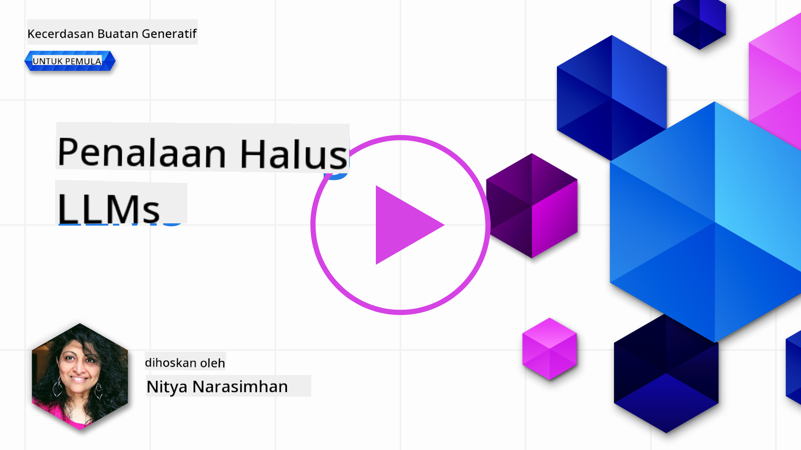
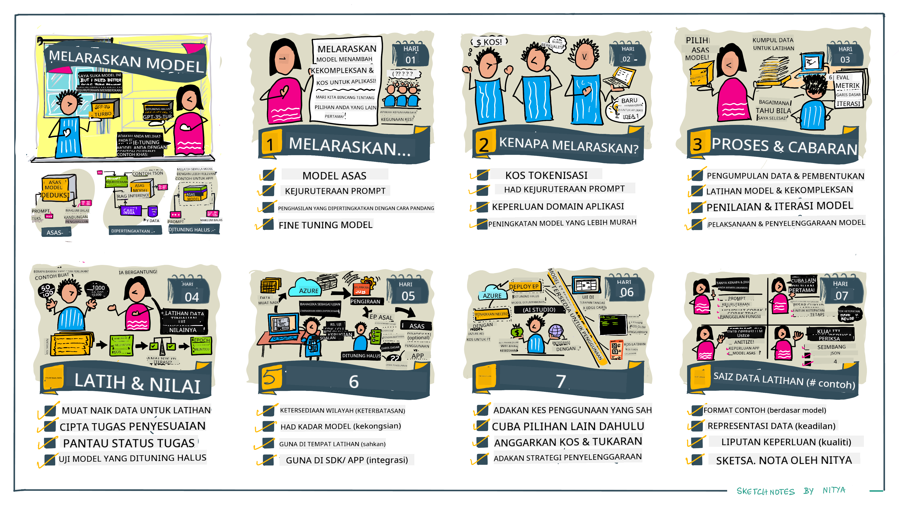

<!--
CO_OP_TRANSLATOR_METADATA:
{
  "original_hash": "68664f7e754a892ae1d8d5e2b7bd2081",
  "translation_date": "2025-06-26T00:48:06+00:00",
  "source_file": "18-fine-tuning/README.md",
  "language_code": "ms"
}
-->

# Menyempurnakan LLM Anda

Menggunakan model bahasa besar untuk membina aplikasi AI generatif datang dengan cabaran baru. Isu utama adalah memastikan kualiti respons (ketepatan dan relevansi) dalam kandungan yang dihasilkan oleh model untuk permintaan pengguna tertentu. Dalam pelajaran sebelumnya, kita membincangkan teknik seperti kejuruteraan prompt dan penghasilan yang ditambah penarikan yang cuba menyelesaikan masalah dengan _mengubah input prompt_ kepada model yang sedia ada.

Dalam pelajaran hari ini, kita membincangkan teknik ketiga, **penyempurnaan**, yang cuba menangani cabaran dengan _melatih semula model itu sendiri_ dengan data tambahan. Mari kita selami butirannya.

## Objektif Pembelajaran

Pelajaran ini memperkenalkan konsep penyempurnaan untuk model bahasa yang telah dilatih, meneroka manfaat dan cabaran pendekatan ini, dan memberikan panduan tentang bila dan bagaimana menggunakan penyempurnaan untuk meningkatkan prestasi model AI generatif anda.

Pada akhir pelajaran ini, anda sepatutnya dapat menjawab soalan-soalan berikut:

- Apa itu penyempurnaan untuk model bahasa?
- Bila, dan kenapa, penyempurnaan berguna?
- Bagaimana saya boleh menyempurnakan model yang telah dilatih?
- Apakah batasan penyempurnaan?

Sedia? Mari kita mulakan.

## Panduan Bergambar

Ingin mendapatkan gambaran besar tentang apa yang akan kita bahas sebelum kita terjun ke dalamnya? Lihat panduan bergambar ini yang menerangkan perjalanan pembelajaran untuk pelajaran ini - dari mempelajari konsep teras dan motivasi untuk penyempurnaan, kepada memahami proses dan amalan terbaik untuk melaksanakan tugas penyempurnaan. Ini adalah topik yang menarik untuk diterokai, jadi jangan lupa untuk melihat halaman [Sumber](./RESOURCES.md?WT.mc_id=academic-105485-koreyst) untuk pautan tambahan bagi menyokong perjalanan pembelajaran kendiri anda!

## Apa itu penyempurnaan untuk model bahasa?

Secara definisi, model bahasa besar adalah _telah dilatih_ pada sejumlah besar teks yang bersumber dari pelbagai sumber termasuk internet. Seperti yang telah kita pelajari dalam pelajaran sebelumnya, kita memerlukan teknik seperti _kejuruteraan prompt_ dan _penghasilan yang ditambah penarikan_ untuk meningkatkan kualiti respons model kepada soalan pengguna ("prompt").

Teknik kejuruteraan prompt yang popular melibatkan memberikan lebih banyak panduan kepada model tentang apa yang diharapkan dalam respons sama ada dengan memberikan _arahan_ (panduan eksplisit) atau _memberikannya beberapa contoh_ (panduan implisit). Ini dirujuk sebagai _pembelajaran beberapa contoh_ tetapi ia mempunyai dua batasan:

- Had token model boleh mengehadkan jumlah contoh yang boleh anda berikan, dan mengehadkan keberkesanan.
- Kos token model boleh menjadikannya mahal untuk menambah contoh kepada setiap prompt, dan mengehadkan fleksibiliti.

Penyempurnaan adalah amalan biasa dalam sistem pembelajaran mesin di mana kita mengambil model yang telah dilatih dan melatih semula dengan data baru untuk meningkatkan prestasinya pada tugas tertentu. Dalam konteks model bahasa, kita boleh menyempurnakan model yang telah dilatih _dengan set contoh yang dikurasi untuk tugas atau domain aplikasi tertentu_ untuk mencipta **model khusus** yang mungkin lebih tepat dan relevan untuk tugas atau domain tertentu itu. Manfaat sampingan penyempurnaan adalah ia juga boleh mengurangkan jumlah contoh yang diperlukan untuk pembelajaran beberapa contoh - mengurangkan penggunaan token dan kos berkaitan.

## Bila dan kenapa kita harus menyempurnakan model?

Dalam _konteks ini_, apabila kita bercakap tentang penyempurnaan, kita merujuk kepada penyempurnaan **diawasi** di mana latihan semula dilakukan dengan **menambah data baru** yang tidak menjadi sebahagian daripada set data latihan asal. Ini berbeza dengan pendekatan penyempurnaan tidak diawasi di mana model dilatih semula pada data asal, tetapi dengan hiperparameter yang berbeza.

Perkara utama yang perlu diingat adalah bahawa penyempurnaan adalah teknik lanjutan yang memerlukan tahap kepakaran tertentu untuk mendapatkan hasil yang diinginkan. Jika dilakukan dengan tidak betul, ia mungkin tidak memberikan peningkatan yang diharapkan, dan mungkin malah menurunkan prestasi model untuk domain yang anda sasarkan.

Jadi, sebelum anda belajar "bagaimana" untuk menyempurnakan model bahasa, anda perlu tahu "kenapa" anda harus mengambil laluan ini, dan "bila" untuk memulakan proses penyempurnaan. Mulakan dengan bertanya kepada diri sendiri soalan-soalan ini:

- **Kes Penggunaan**: Apakah _kes penggunaan_ anda untuk penyempurnaan? Aspek mana dari model yang telah dilatih sekarang yang ingin anda perbaiki?
- **Alternatif**: Adakah anda telah mencuba _teknik lain_ untuk mencapai hasil yang diinginkan? Gunakan mereka untuk membuat garis dasar untuk perbandingan.
  - Kejuruteraan prompt: Cuba teknik seperti pemulaan beberapa contoh dengan contoh respons prompt yang relevan. Nilai kualiti respons.
  - Penghasilan yang ditambah penarikan: Cuba menambah prompt dengan hasil carian yang diperoleh dengan mencari data anda. Nilai kualiti respons.
- **Kos**: Adakah anda telah mengenal pasti kos untuk penyempurnaan?
  - Kebolehsempurnaan - adakah model yang telah dilatih tersedia untuk penyempurnaan?
  - Usaha - untuk menyediakan data latihan, menilai & memperbaiki model.
  - Pengiraan - untuk menjalankan tugas penyempurnaan, dan menyebarkan model yang telah disempurnakan
  - Data - akses kepada contoh berkualiti yang mencukupi untuk impak penyempurnaan
- **Manfaat**: Adakah anda telah mengesahkan manfaat untuk penyempurnaan?
  - Kualiti - adakah model yang telah disempurnakan mengatasi garis dasar?
  - Kos - adakah ia mengurangkan penggunaan token dengan mempermudah prompt?
  - Kebolehlanjutan - bolehkah anda menggunakan semula model asas untuk domain baru?

Dengan menjawab soalan-soalan ini, anda sepatutnya dapat memutuskan jika penyempurnaan adalah pendekatan yang tepat untuk kes penggunaan anda. Secara idealnya, pendekatan ini sah hanya jika manfaat melebihi kos. Setelah anda memutuskan untuk meneruskan, sudah tiba masanya untuk memikirkan _bagaimana_ anda boleh menyempurnakan model yang telah dilatih.

Ingin mendapatkan lebih banyak pandangan tentang proses membuat keputusan? Tonton [Untuk menyempurnakan atau tidak untuk menyempurnakan](https://www.youtube.com/watch?v=0Jo-z-MFxJs)

## Bagaimana kita boleh menyempurnakan model yang telah dilatih?

Untuk menyempurnakan model yang telah dilatih, anda perlu mempunyai:

- model yang telah dilatih untuk disempurnakan
- set data untuk digunakan dalam penyempurnaan
- persekitaran latihan untuk menjalankan tugas penyempurnaan
- persekitaran hosting untuk menyebarkan model yang telah disempurnakan

## Penyempurnaan Dalam Tindakan

Sumber berikut menyediakan tutorial langkah demi langkah untuk membimbing anda melalui contoh sebenar menggunakan model terpilih dengan set data yang dikurasi. Untuk bekerja melalui tutorial ini, anda memerlukan akaun pada penyedia tertentu, bersama dengan akses kepada model dan set data yang relevan.

| Penyedia     | Tutorial                                                                                                                                                                       | Penerangan                                                                                                                                                                                                                                                                                                                                                                                                                        |
| ------------ | ------------------------------------------------------------------------------------------------------------------------------------------------------------------------------ | ---------------------------------------------------------------------------------------------------------------------------------------------------------------------------------------------------------------------------------------------------------------------------------------------------------------------------------------------------------------------------------------------------------------------------------- |
| OpenAI       | [Bagaimana untuk menyempurnakan model chat](https://github.com/openai/openai-cookbook/blob/main/examples/How_to_finetune_chat_models.ipynb?WT.mc_id=academic-105485-koreyst)                | Belajar untuk menyempurnakan `gpt-35-turbo` untuk domain tertentu ("pembantu resipi") dengan menyediakan data latihan, menjalankan tugas penyempurnaan, dan menggunakan model yang telah disempurnakan untuk inferens.                                                                                                                                                                                                                                              |
| Azure OpenAI | [Tutorial penyempurnaan GPT 3.5 Turbo](https://learn.microsoft.com/azure/ai-services/openai/tutorials/fine-tune?tabs=python-new%2Ccommand-line?WT.mc_id=academic-105485-koreyst) | Belajar untuk menyempurnakan model `gpt-35-turbo-0613` **di Azure** dengan mengambil langkah untuk mencipta & memuat naik data latihan, menjalankan tugas penyempurnaan. Sebarkan & gunakan model baru.                                                                                                                                                                                                                                                                 |
| Hugging Face | [Menyempurnakan LLM dengan Hugging Face](https://www.philschmid.de/fine-tune-llms-in-2024-with-trl?WT.mc_id=academic-105485-koreyst)                                               | Catatan blog ini membimbing anda menyempurnakan _LLM terbuka_ (cth: `CodeLlama 7B`) menggunakan perpustakaan [transformers](https://huggingface.co/docs/transformers/index?WT.mc_id=academic-105485-koreyst) & [Pembelajaran Pengukuhan Transformer (TRL)](https://huggingface.co/docs/trl/index?WT.mc_id=academic-105485-koreyst]) dengan set [data terbuka](https://huggingface.co/docs/datasets/index?WT.mc_id=academic-105485-koreyst) di Hugging Face. |
|              |                                                                                                                                                                                |                                                                                                                                                                                                                                                                                                                                                                                                                                    |
| 🤗 AutoTrain | [Menyempurnakan LLM dengan AutoTrain](https://github.com/huggingface/autotrain-advanced/?WT.mc_id=academic-105485-koreyst)                                                         | AutoTrain (atau AutoTrain Advanced) adalah perpustakaan python yang dibangunkan oleh Hugging Face yang membolehkan penyempurnaan untuk banyak tugas yang berbeza termasuk penyempurnaan LLM. AutoTrain adalah penyelesaian tanpa kod dan penyempurnaan boleh dilakukan di awan anda sendiri, di Hugging Face Spaces atau secara tempatan. Ia menyokong kedua-dua GUI berasaskan web, CLI dan latihan melalui fail konfigurasi yaml.                                                                               |
|              |                                                                                                                                                                                |                                                                                                                                                                                                                                                                                                                                                                                                                                    |

## Tugasan

Pilih salah satu tutorial di atas dan lalui mereka. _Kami mungkin meniru versi tutorial ini dalam Jupyter Notebooks dalam repo ini untuk rujukan sahaja. Sila gunakan sumber asal secara langsung untuk mendapatkan versi terkini_.

## Kerja Hebat! Teruskan Pembelajaran Anda.

Selepas melengkapkan pelajaran ini, lihat koleksi [Pembelajaran AI Generatif](https://aka.ms/genai-collection?WT.mc_id=academic-105485-koreyst) kami untuk terus meningkatkan pengetahuan AI Generatif anda!

Tahniah!! Anda telah melengkapkan pelajaran terakhir dari siri v2 untuk kursus ini! Jangan berhenti belajar dan membina. \*\*Lihat halaman [SUMBER](RESOURCES.md?WT.mc_id=academic-105485-koreyst) untuk senarai cadangan tambahan hanya untuk topik ini.

Siri pelajaran v1 kami juga telah dikemas kini dengan lebih banyak tugasan dan konsep. Jadi luangkan masa untuk menyegarkan pengetahuan anda - dan sila [kongsi soalan dan maklum balas anda](https://github.com/microsoft/generative-ai-for-beginners/issues?WT.mc_id=academic-105485-koreyst) untuk membantu kami meningkatkan pelajaran ini untuk komuniti.

**Penafian**:  
Dokumen ini telah diterjemahkan menggunakan perkhidmatan terjemahan AI [Co-op Translator](https://github.com/Azure/co-op-translator). Walaupun kami berusaha untuk ketepatan, sila ambil perhatian bahawa terjemahan automatik mungkin mengandungi kesilapan atau ketidaktepatan. Dokumen asal dalam bahasa asalnya harus dianggap sebagai sumber yang berwibawa. Untuk maklumat penting, terjemahan manusia profesional disyorkan. Kami tidak bertanggungjawab atas sebarang salah faham atau salah tafsir yang timbul daripada penggunaan terjemahan ini.