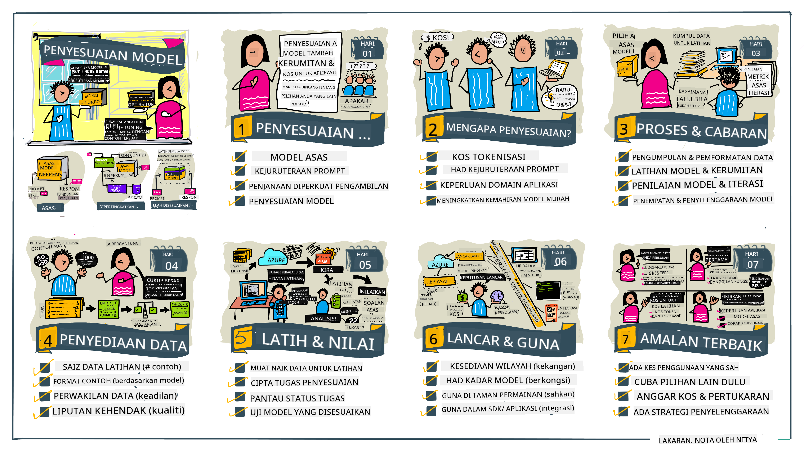

<!--
CO_OP_TRANSLATOR_METADATA:
{
  "original_hash": "807f0d9fc1747e796433534e1be6a98a",
  "translation_date": "2025-10-17T20:57:20+00:00",
  "source_file": "18-fine-tuning/README.md",
  "language_code": "ms"
}
-->

# Penyesuaian Model LLM Anda

Menggunakan model bahasa besar untuk membina aplikasi AI generatif datang dengan cabaran baru. Isu utama adalah memastikan kualiti respons (ketepatan dan relevansi) dalam kandungan yang dihasilkan oleh model untuk permintaan pengguna tertentu. Dalam pelajaran sebelumnya, kita telah membincangkan teknik seperti kejuruteraan arahan dan generasi yang diperkaya pengambilan yang cuba menyelesaikan masalah dengan _mengubah input arahan_ kepada model sedia ada.

Dalam pelajaran hari ini, kita akan membincangkan teknik ketiga, **penyesuaian**, yang cuba menangani cabaran ini dengan _melatih semula model itu sendiri_ menggunakan data tambahan. Mari kita selami perinciannya.

## Objektif Pembelajaran

Pelajaran ini memperkenalkan konsep penyesuaian untuk model bahasa yang telah dilatih, meneroka manfaat dan cabaran pendekatan ini, serta memberikan panduan tentang bila dan bagaimana menggunakan penyesuaian untuk meningkatkan prestasi model AI generatif anda.

Pada akhir pelajaran ini, anda seharusnya dapat menjawab soalan berikut:

- Apa itu penyesuaian untuk model bahasa?
- Bila, dan mengapa, penyesuaian berguna?
- Bagaimana saya boleh menyesuaikan model yang telah dilatih?
- Apakah batasan penyesuaian?

Sedia? Mari kita mulakan.

## Panduan Bergambar

Ingin mendapatkan gambaran besar tentang apa yang akan kita bahas sebelum kita mendalami? Lihat panduan bergambar ini yang menerangkan perjalanan pembelajaran untuk pelajaran ini - dari mempelajari konsep utama dan motivasi untuk penyesuaian, hingga memahami proses dan amalan terbaik untuk melaksanakan tugas penyesuaian. Ini adalah topik yang menarik untuk diterokai, jadi jangan lupa untuk melihat halaman [Sumber](./RESOURCES.md?WT.mc_id=academic-105485-koreyst) untuk pautan tambahan bagi menyokong perjalanan pembelajaran kendiri anda!

## Apa itu penyesuaian untuk model bahasa?

Secara definisi, model bahasa besar adalah _telah dilatih_ pada sejumlah besar teks yang diperoleh dari pelbagai sumber termasuk internet. Seperti yang telah kita pelajari dalam pelajaran sebelumnya, kita memerlukan teknik seperti _kejuruteraan arahan_ dan _generasi yang diperkaya pengambilan_ untuk meningkatkan kualiti respons model terhadap soalan pengguna ("arahan").

Salah satu teknik kejuruteraan arahan yang popular melibatkan memberikan model lebih banyak panduan tentang apa yang diharapkan dalam respons sama ada dengan memberikan _arahan_ (panduan eksplisit) atau _memberikan beberapa contoh_ (panduan implisit). Ini disebut sebagai _pembelajaran beberapa contoh_ tetapi ia mempunyai dua batasan:

- Had token model boleh mengehadkan jumlah contoh yang boleh diberikan, dan mengehadkan keberkesanan.
- Kos token model boleh menjadikannya mahal untuk menambah contoh pada setiap arahan, dan mengehadkan fleksibiliti.

Penyesuaian adalah amalan biasa dalam sistem pembelajaran mesin di mana kita mengambil model yang telah dilatih dan melatih semula dengan data baru untuk meningkatkan prestasinya pada tugas tertentu. Dalam konteks model bahasa, kita boleh menyesuaikan model yang telah dilatih _dengan set contoh yang dikurasi untuk tugas atau domain aplikasi tertentu_ untuk mencipta **model khusus** yang mungkin lebih tepat dan relevan untuk tugas atau domain tertentu. Manfaat sampingan penyesuaian adalah ia juga dapat mengurangkan jumlah contoh yang diperlukan untuk pembelajaran beberapa contoh - mengurangkan penggunaan token dan kos berkaitan.

## Bila dan mengapa kita perlu menyesuaikan model?

Dalam konteks _ini_, apabila kita bercakap tentang penyesuaian, kita merujuk kepada penyesuaian **terarah** di mana latihan semula dilakukan dengan **menambah data baru** yang tidak termasuk dalam dataset latihan asal. Ini berbeza dengan pendekatan penyesuaian tidak terarah di mana model dilatih semula pada data asal, tetapi dengan parameter hiper yang berbeza.

Perkara utama yang perlu diingat adalah bahawa penyesuaian adalah teknik lanjutan yang memerlukan tahap kepakaran tertentu untuk mendapatkan hasil yang diinginkan. Jika dilakukan dengan tidak betul, ia mungkin tidak memberikan peningkatan yang diharapkan, malah boleh merosakkan prestasi model untuk domain sasaran anda.

Jadi, sebelum anda belajar "bagaimana" untuk menyesuaikan model bahasa, anda perlu tahu "mengapa" anda harus mengambil jalan ini, dan "bila" untuk memulakan proses penyesuaian. Mulakan dengan bertanya kepada diri sendiri soalan-soalan ini:

- **Kes Penggunaan**: Apakah _kes penggunaan_ anda untuk penyesuaian? Aspek apa dari model yang telah dilatih sekarang yang ingin anda tingkatkan?
- **Alternatif**: Adakah anda telah mencuba _teknik lain_ untuk mencapai hasil yang diinginkan? Gunakan mereka untuk mencipta garis dasar untuk perbandingan.
  - Kejuruteraan arahan: Cuba teknik seperti arahan beberapa contoh dengan contoh respons arahan yang relevan. Nilai kualiti respons.
  - Generasi yang Diperkaya Pengambilan: Cuba memperkaya arahan dengan hasil carian yang diperoleh dengan mencari data anda. Nilai kualiti respons.
- **Kos**: Adakah anda telah mengenal pasti kos untuk penyesuaian?
  - Kebolehsesuaian - adakah model yang telah dilatih tersedia untuk penyesuaian?
  - Usaha - untuk menyediakan data latihan, menilai & memperbaiki model.
  - Komputasi - untuk menjalankan tugas penyesuaian, dan menyebarkan model yang telah disesuaikan.
  - Data - akses kepada contoh berkualiti yang mencukupi untuk impak penyesuaian.
- **Manfaat**: Adakah anda telah mengesahkan manfaat untuk penyesuaian?
  - Kualiti - adakah model yang telah disesuaikan mengatasi garis dasar?
  - Kos - adakah ia mengurangkan penggunaan token dengan mempermudah arahan?
  - Kebolehlanjutan - bolehkah anda menggunakan semula model asas untuk domain baru?

Dengan menjawab soalan-soalan ini, anda seharusnya dapat memutuskan sama ada penyesuaian adalah pendekatan yang tepat untuk kes penggunaan anda. Secara ideal, pendekatan ini sah hanya jika manfaat melebihi kos. Setelah anda memutuskan untuk meneruskan, sudah tiba masanya untuk memikirkan _bagaimana_ anda boleh menyesuaikan model yang telah dilatih.

Ingin mendapatkan lebih banyak pandangan tentang proses membuat keputusan? Tonton [Untuk menyesuaikan atau tidak menyesuaikan](https://www.youtube.com/watch?v=0Jo-z-MFxJs)

## Bagaimana kita boleh menyesuaikan model yang telah dilatih?

Untuk menyesuaikan model yang telah dilatih, anda perlu mempunyai:

- model yang telah dilatih untuk disesuaikan
- dataset untuk digunakan dalam penyesuaian
- persekitaran latihan untuk menjalankan tugas penyesuaian
- persekitaran hosting untuk menyebarkan model yang telah disesuaikan

## Penyesuaian Dalam Tindakan

Sumber berikut menyediakan tutorial langkah demi langkah untuk membimbing anda melalui contoh sebenar menggunakan model terpilih dengan dataset yang dikurasi. Untuk bekerja melalui tutorial ini, anda memerlukan akaun pada penyedia tertentu, bersama dengan akses kepada model dan dataset yang relevan.

| Penyedia     | Tutorial                                                                                                                                                                       | Penerangan                                                                                                                                                                                                                                                                                                                                                                                                                        |
| ------------ | ------------------------------------------------------------------------------------------------------------------------------------------------------------------------------ | ---------------------------------------------------------------------------------------------------------------------------------------------------------------------------------------------------------------------------------------------------------------------------------------------------------------------------------------------------------------------------------------------------------------------------------- |
| OpenAI       | [Cara menyesuaikan model chat](https://github.com/openai/openai-cookbook/blob/main/examples/How_to_finetune_chat_models.ipynb?WT.mc_id=academic-105485-koreyst)                | Belajar menyesuaikan `gpt-35-turbo` untuk domain tertentu ("pembantu resipi") dengan menyediakan data latihan, menjalankan tugas penyesuaian, dan menggunakan model yang telah disesuaikan untuk inferens.                                                                                                                                                                                                                          |
| Azure OpenAI | [Tutorial penyesuaian GPT 3.5 Turbo](https://learn.microsoft.com/azure/ai-services/openai/tutorials/fine-tune?tabs=python-new%2Ccommand-line?WT.mc_id=academic-105485-koreyst) | Belajar menyesuaikan model `gpt-35-turbo-0613` **di Azure** dengan mengambil langkah-langkah untuk mencipta & memuat naik data latihan, menjalankan tugas penyesuaian. Sebarkan & gunakan model baru.                                                                                                                                                                                                                              |
| Hugging Face | [Penyesuaian LLM dengan Hugging Face](https://www.philschmid.de/fine-tune-llms-in-2024-with-trl?WT.mc_id=academic-105485-koreyst)                                               | Blog ini membimbing anda menyesuaikan _LLM terbuka_ (contoh: `CodeLlama 7B`) menggunakan perpustakaan [transformers](https://huggingface.co/docs/transformers/index?WT.mc_id=academic-105485-koreyst) & [Transformer Reinforcement Learning (TRL)](https://huggingface.co/docs/trl/index?WT.mc_id=academic-105485-koreyst]) dengan [dataset terbuka](https://huggingface.co/docs/datasets/index?WT.mc_id=academic-105485-koreyst) di Hugging Face. |
|              |                                                                                                                                                                                |                                                                                                                                                                                                                                                                                                                                                                                                                                    |
| 🤗 AutoTrain | [Penyesuaian LLM dengan AutoTrain](https://github.com/huggingface/autotrain-advanced/?WT.mc_id=academic-105485-koreyst)                                                         | AutoTrain (atau AutoTrain Advanced) adalah perpustakaan python yang dibangunkan oleh Hugging Face yang membolehkan penyesuaian untuk pelbagai tugas termasuk penyesuaian LLM. AutoTrain adalah penyelesaian tanpa kod dan penyesuaian boleh dilakukan di awan anda sendiri, di Hugging Face Spaces atau secara tempatan. Ia menyokong GUI berasaskan web, CLI dan latihan melalui fail konfigurasi yaml.                                                       |
|              |                                                                                                                                                                                |                                                                                                                                                                                                                                                                                                                                                                                                                                    |

## Tugasan

Pilih salah satu tutorial di atas dan ikuti langkah-langkahnya. _Kami mungkin meniru versi tutorial ini dalam Jupyter Notebooks dalam repo ini untuk rujukan sahaja. Sila gunakan sumber asal secara langsung untuk mendapatkan versi terkini_.

## Kerja Hebat! Teruskan Pembelajaran Anda.

Selepas menyelesaikan pelajaran ini, lihat koleksi [Pembelajaran AI Generatif](https://aka.ms/genai-collection?WT.mc_id=academic-105485-koreyst) kami untuk terus meningkatkan pengetahuan AI Generatif anda!

Tahniah!! Anda telah menyelesaikan pelajaran terakhir dari siri v2 untuk kursus ini! Jangan berhenti belajar dan membina. **Lihat halaman [SUMBER](RESOURCES.md?WT.mc_id=academic-105485-koreyst) untuk senarai cadangan tambahan hanya untuk topik ini.

Siri pelajaran v1 kami juga telah dikemas kini dengan lebih banyak tugasan dan konsep. Jadi luangkan masa untuk menyegarkan pengetahuan anda - dan sila [kongsikan soalan dan maklum balas anda](https://github.com/microsoft/generative-ai-for-beginners/issues?WT.mc_id=academic-105485-koreyst) untuk membantu kami meningkatkan pelajaran ini untuk komuniti.

---

**Penafian**:  
Dokumen ini telah diterjemahkan menggunakan perkhidmatan terjemahan AI [Co-op Translator](https://github.com/Azure/co-op-translator). Walaupun kami berusaha untuk ketepatan, sila ambil perhatian bahawa terjemahan automatik mungkin mengandungi kesilapan atau ketidaktepatan. Dokumen asal dalam bahasa asalnya harus dianggap sebagai sumber yang berwibawa. Untuk maklumat kritikal, terjemahan manusia profesional adalah disyorkan. Kami tidak bertanggungjawab atas sebarang salah faham atau salah tafsir yang timbul daripada penggunaan terjemahan ini.