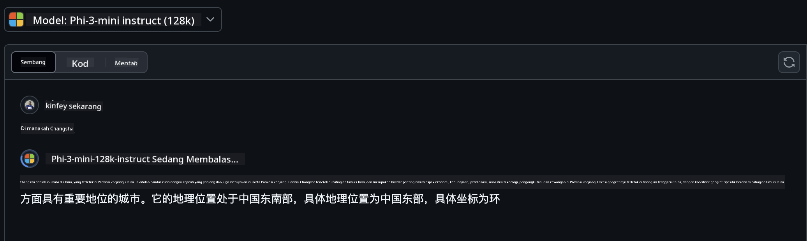
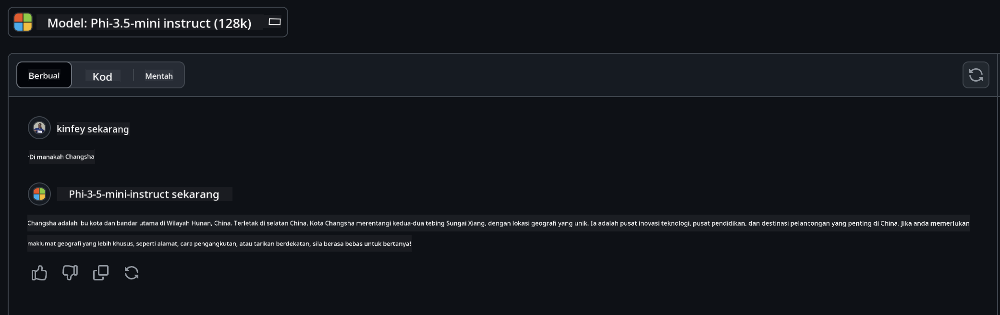

<!--
CO_OP_TRANSLATOR_METADATA:
{
  "original_hash": "124ad36cfe96f74038811b6e2bb93e9d",
  "translation_date": "2025-05-20T10:18:09+00:00",
  "source_file": "19-slm/README.md",
  "language_code": "ms"
}
-->
# Pengenalan kepada Model Bahasa Kecil untuk Generatif AI untuk Pemula

Generatif AI adalah bidang kecerdasan buatan yang menarik yang menumpukan pada penciptaan sistem yang mampu menghasilkan kandungan baru. Kandungan ini boleh merangkumi teks dan imej kepada muzik dan juga persekitaran maya sepenuhnya. Salah satu aplikasi paling menarik bagi generatif AI adalah dalam bidang model bahasa.

## Apakah Model Bahasa Kecil?

Model Bahasa Kecil (SLM) mewakili varian berskala kecil bagi model bahasa besar (LLM), memanfaatkan banyak prinsip dan teknik seni bina LLM, sambil mempamerkan jejak komputasi yang jauh lebih kecil. SLM adalah subset model bahasa yang direka untuk menjana teks seperti manusia. Tidak seperti rakan sejawat mereka yang lebih besar, seperti GPT-4, SLM lebih padat dan cekap, menjadikannya ideal untuk aplikasi di mana sumber komputasi adalah terhad. Walaupun saiznya lebih kecil, mereka masih boleh melakukan pelbagai tugas. Biasanya, SLM dibina dengan memampatkan atau menyuling LLM, bertujuan untuk mengekalkan sebahagian besar fungsi dan kemampuan linguistik model asal. Pengurangan saiz model ini mengurangkan kerumitan keseluruhan, menjadikan SLM lebih cekap dari segi penggunaan memori dan keperluan komputasi. Walaupun dengan pengoptimuman ini, SLM masih boleh melakukan pelbagai tugas pemprosesan bahasa semula jadi (NLP):

- Penjanaan Teks: Mencipta ayat atau perenggan yang koheren dan berkaitan dengan konteks.
- Pelengkap Teks: Meramalkan dan melengkapkan ayat berdasarkan petunjuk yang diberikan.
- Terjemahan: Menukar teks dari satu bahasa ke bahasa lain.
- Ringkasan: Memadatkan teks panjang menjadi ringkasan yang lebih pendek dan mudah dicerna.

Walaupun dengan beberapa pertukaran dalam prestasi atau kedalaman pemahaman berbanding rakan sejawat mereka yang lebih besar.

## Bagaimana Model Bahasa Kecil Berfungsi?

SLM dilatih pada sejumlah besar data teks. Semasa latihan, mereka mempelajari pola dan struktur bahasa, membolehkan mereka menjana teks yang betul secara tatabahasa dan sesuai dengan konteks. Proses latihan melibatkan:

- Pengumpulan Data: Mengumpulkan set data teks besar dari pelbagai sumber.
- Prapemprosesan: Membersihkan dan mengatur data untuk menjadikannya sesuai untuk latihan.
- Latihan: Menggunakan algoritma pembelajaran mesin untuk mengajar model bagaimana memahami dan menjana teks.
- Penalaan Halus: Menyesuaikan model untuk meningkatkan prestasinya pada tugas tertentu.

Pembangunan SLM sejajar dengan peningkatan keperluan untuk model yang boleh digunakan dalam persekitaran yang terhad sumber, seperti peranti mudah alih atau platform pengkomputeran tepi, di mana LLM skala penuh mungkin tidak praktikal kerana permintaan sumber yang berat. Dengan menumpukan pada kecekapan, SLM mengimbangi prestasi dengan kebolehcapaian, membolehkan aplikasi yang lebih luas merentasi pelbagai domain.

## Objektif Pembelajaran

Dalam pelajaran ini, kami berharap untuk memperkenalkan pengetahuan tentang SLM dan menggabungkannya dengan Microsoft Phi-3 untuk mempelajari senario yang berbeza dalam kandungan teks, penglihatan dan MoE. Menjelang akhir pelajaran ini, anda seharusnya dapat menjawab soalan-soalan berikut:

- Apakah itu SLM
- Apakah perbezaan antara SLM dan LLM
- Apakah itu Keluarga Microsoft Phi-3/3.5
- Bagaimana untuk menyimpulkan Keluarga Microsoft Phi-3/3.5

Bersedia? Mari kita mulakan.

## Perbezaan antara Model Bahasa Besar (LLM) dan Model Bahasa Kecil (SLM)

Kedua-dua LLM dan SLM dibina berdasarkan prinsip asas pembelajaran mesin probabilistik, mengikuti pendekatan yang serupa dalam reka bentuk seni bina, metodologi latihan, proses penjanaan data, dan teknik penilaian model. Walau bagaimanapun, beberapa faktor utama membezakan kedua-dua jenis model ini.

## Aplikasi Model Bahasa Kecil

SLM mempunyai pelbagai aplikasi, termasuk:

- Chatbot: Memberikan sokongan pelanggan dan berinteraksi dengan pengguna secara perbualan.
- Penciptaan Kandungan: Membantu penulis dengan menjana idea atau bahkan merangka artikel sepenuhnya.
- Pendidikan: Membantu pelajar dengan tugasan penulisan atau mempelajari bahasa baru.
- Kebolehcapaian: Mencipta alat untuk individu dengan ketidakupayaan, seperti sistem teks-ke-ucapan.

**Saiz**

Perbezaan utama antara LLM dan SLM terletak pada skala model. LLM, seperti ChatGPT (GPT-4), boleh terdiri daripada anggaran 1.76 trilion parameter, manakala SLM sumber terbuka seperti Mistral 7B direka dengan parameter yang jauh lebih sedikit—sekitar 7 bilion. Perbezaan ini terutama disebabkan oleh perbezaan dalam seni bina model dan proses latihan. Sebagai contoh, ChatGPT menggunakan mekanisme perhatian sendiri dalam rangka kerja pengekod-penyahkod, manakala Mistral 7B menggunakan perhatian tetingkap gelongsor, yang membolehkan latihan lebih cekap dalam model hanya penyahkod. Varians seni bina ini mempunyai implikasi mendalam terhadap kerumitan dan prestasi model-model ini.

**Pemahaman**

SLM biasanya dioptimumkan untuk prestasi dalam domain tertentu, menjadikannya sangat khusus tetapi berpotensi terhad dalam keupayaan mereka untuk menyediakan pemahaman kontekstual yang luas merentasi pelbagai bidang pengetahuan. Sebaliknya, LLM bertujuan untuk mensimulasikan kecerdasan seperti manusia pada tahap yang lebih komprehensif. Dilatih pada set data yang luas dan pelbagai, LLM direka untuk berprestasi baik merentasi pelbagai domain, menawarkan serba boleh dan kebolehsuaian yang lebih besar. Akibatnya, LLM lebih sesuai untuk pelbagai tugas hiliran, seperti pemprosesan bahasa semula jadi dan pengaturcaraan.

**Pengkomputeran**

Latihan dan penyebaran LLM adalah proses intensif sumber, sering memerlukan infrastruktur komputasi yang signifikan, termasuk kluster GPU skala besar. Sebagai contoh, melatih model seperti ChatGPT dari awal mungkin memerlukan ribuan GPU dalam tempoh yang panjang. Sebaliknya, SLM, dengan bilangan parameter yang lebih kecil, lebih mudah diakses dari segi sumber komputasi. Model seperti Mistral 7B boleh dilatih dan dijalankan pada mesin tempatan yang dilengkapi dengan kemampuan GPU sederhana, walaupun latihan masih memerlukan beberapa jam merentasi berbilang GPU.

**Bias**

Bias adalah isu yang diketahui dalam LLM, terutamanya disebabkan oleh sifat data latihan. Model-model ini sering bergantung pada data mentah yang tersedia secara terbuka dari internet, yang mungkin kurang mewakili atau salah mewakili kumpulan tertentu, memperkenalkan pelabelan yang salah, atau mencerminkan bias linguistik yang dipengaruhi oleh dialek, variasi geografi, dan peraturan tatabahasa. Selain itu, kerumitan seni bina LLM boleh secara tidak sengaja memperburuk bias, yang mungkin tidak disedari tanpa penalaan halus yang teliti. Sebaliknya, SLM, yang dilatih pada set data yang lebih terhad dan spesifik domain, secara semula jadi kurang terdedah kepada bias tersebut, walaupun mereka tidak kebal terhadapnya.

**Inferens**

Saiz SLM yang dikurangkan memberikan mereka kelebihan yang signifikan dari segi kelajuan inferens, membolehkan mereka menjana output dengan cekap pada perkakasan tempatan tanpa memerlukan pemprosesan selari yang meluas. Sebaliknya, LLM, disebabkan oleh saiz dan kerumitan mereka, sering memerlukan sumber komputasi selari yang besar untuk mencapai masa inferens yang boleh diterima. Kehadiran pelbagai pengguna serentak selanjutnya memperlahankan masa tindak balas LLM, terutamanya apabila digunakan pada skala.

Secara ringkas, walaupun kedua-dua LLM dan SLM berkongsi asas dalam pembelajaran mesin, mereka berbeza dengan ketara dari segi saiz model, keperluan sumber, pemahaman kontekstual, kecenderungan kepada bias, dan kelajuan inferens. Perbezaan ini mencerminkan kesesuaian mereka yang berbeza untuk kegunaan yang berbeza, dengan LLM lebih serba boleh tetapi berat sumber, dan SLM menawarkan kecekapan spesifik domain dengan permintaan komputasi yang dikurangkan.

***Nota: Dalam bab ini, kami akan memperkenalkan SLM menggunakan Microsoft Phi-3 / 3.5 sebagai contoh.***

## Memperkenalkan Keluarga Phi-3 / Phi-3.5

Keluarga Phi-3 / 3.5 terutamanya mensasarkan senario aplikasi teks, penglihatan, dan Agen (MoE):

### Phi-3 / 3.5 Arahan

Terutamanya untuk penjanaan teks, pelengkap perbualan, dan pengekstrakan maklumat kandungan, dsb.

**Phi-3-mini**

Model bahasa 3.8B tersedia di Microsoft Azure AI Studio, Hugging Face, dan Ollama. Model Phi-3 dengan ketara mengatasi model bahasa dengan saiz yang sama dan lebih besar pada penanda aras utama (lihat nombor penanda aras di bawah, nombor yang lebih tinggi adalah lebih baik). Phi-3-mini mengatasi model dua kali ganda saiznya, manakala Phi-3-kecil dan Phi-3-sederhana mengatasi model yang lebih besar, termasuk GPT-3.5

**Phi-3-kecil & sederhana**

Dengan hanya 7B parameter, Phi-3-kecil mengalahkan GPT-3.5T pada pelbagai penanda aras bahasa, penaakulan, pengkodan, dan matematik. Phi-3-sederhana dengan 14B parameter meneruskan trend ini dan mengatasi Gemini 1.0 Pro.

**Phi-3.5-mini**

Kita boleh menganggapnya sebagai peningkatan Phi-3-mini. Walaupun parameter kekal tidak berubah, ia meningkatkan keupayaan untuk menyokong pelbagai bahasa (Menyokong 20+ bahasa: Arab, Cina, Czech, Denmark, Belanda, Inggeris, Finland, Perancis, Jerman, Ibrani, Hungary, Itali, Jepun, Korea, Norway, Poland, Portugis, Rusia, Sepanyol, Sweden, Thai, Turki, Ukraine) dan menambah sokongan yang lebih kuat untuk konteks panjang. Phi-3.5-mini dengan 3.8B parameter mengatasi model bahasa dengan saiz yang sama dan setanding dengan model dua kali ganda saiznya.

### Phi-3 / 3.5 Penglihatan

Kita boleh menganggap model Arahan Phi-3/3.5 sebagai keupayaan Phi untuk memahami, dan Penglihatan adalah apa yang memberi mata kepada Phi untuk memahami dunia.

**Phi-3-Penglihatan**

Phi-3-penglihatan, dengan hanya 4.2B parameter, meneruskan trend ini dan mengatasi model yang lebih besar seperti Claude-3 Haiku dan Gemini 1.0 Pro V pada tugas penaakulan visual umum, OCR, dan pemahaman jadual dan diagram.

**Phi-3.5-Penglihatan**

Phi-3.5-Penglihatan juga merupakan peningkatan Phi-3-Penglihatan, menambah sokongan untuk pelbagai imej. Anda boleh menganggapnya sebagai peningkatan dalam penglihatan, bukan sahaja boleh melihat gambar, tetapi juga video. Phi-3.5-penglihatan mengatasi model yang lebih besar seperti Claude-3.5 Sonnet dan Gemini 1.5 Flash merentasi OCR, pemahaman jadual dan carta dan setanding pada tugas penaakulan pengetahuan visual umum. Menyokong input berbilang bingkai, iaitu, melakukan penaakulan pada berbilang imej input

### Phi-3.5-MoE

***Campuran Pakar (MoE)*** membolehkan model untuk diprapelajari dengan lebih sedikit komputasi, yang bermaksud anda boleh meningkatkan saiz model atau set data secara dramatik dengan bajet komputasi yang sama seperti model padat. Khususnya, model MoE seharusnya mencapai kualiti yang sama seperti rakan padatnya dengan lebih cepat semasa prapelajaran. Phi-3.5-MoE terdiri daripada 16x3.8B modul pakar. Phi-3.5-MoE dengan hanya 6.6B parameter aktif mencapai tahap penaakulan, pemahaman bahasa, dan matematik yang serupa dengan model yang jauh lebih besar

Kita boleh menggunakan model Keluarga Phi-3/3.5 berdasarkan senario yang berbeza. Tidak seperti LLM, anda boleh menggunakan Phi-3/3.5-mini atau Phi-3/3.5-Penglihatan pada peranti tepi.

## Cara menggunakan model Keluarga Phi-3/3.5

Kami berharap untuk menggunakan Phi-3/3.5 dalam senario yang berbeza. Seterusnya, kami akan menggunakan Phi-3/3.5 berdasarkan senario yang berbeza.

### Perbezaan inferens

API Cloud

**Model GitHub**

GitHub
Model adalah cara yang paling langsung. Anda boleh mengakses model Phi-3/3.5-Instruct dengan cepat melalui GitHub Models. Digabungkan dengan Azure AI Inference SDK / OpenAI SDK, anda boleh mengakses API melalui kod untuk melengkapkan panggilan Phi-3/3.5-Instruct. Anda juga boleh menguji kesan yang berbeza melalui Playground. - Demo: Perbandingan kesan Phi-3-mini dan Phi-3.5-mini dalam senario Cina   **Azure AI Studio** Atau jika kita mahu menggunakan model vision dan MoE, anda boleh menggunakan Azure AI Studio untuk melengkapkan panggilan. Jika anda berminat, anda boleh membaca Phi-3 Cookbook untuk belajar cara memanggil Phi-3/3.5 Instruct, Vision, MoE melalui Azure AI Studio [Klik pautan ini](https://github.com/microsoft/Phi-3CookBook/blob/main/md/02.QuickStart/AzureAIStudio_QuickStart.md?WT.mc_id=academic-105485-koreyst) **NVIDIA NIM** Selain daripada penyelesaian Model Catalog berasaskan awan yang disediakan oleh Azure dan GitHub, anda juga boleh menggunakan [Nivida NIM](https://developer.nvidia.com/nim?WT.mc_id=academic-105485-koreyst) untuk melengkapkan panggilan berkaitan. Anda boleh melawat NIVIDA NIM untuk melengkapkan panggilan API keluarga Phi-3/3.5. NVIDIA NIM (NVIDIA Inference Microservices) adalah satu set perkhidmatan mikro inferens yang dipercepatkan yang direka untuk membantu pembangun mengerahkan model AI dengan cekap di pelbagai persekitaran, termasuk awan, pusat data, dan workstation. Berikut adalah beberapa ciri utama NVIDIA NIM: - **Kemudahan Penggunaan:** NIM membolehkan penyebaran model AI dengan satu perintah, menjadikannya mudah untuk diintegrasikan ke dalam aliran kerja sedia ada. - **Prestasi Dioptimumkan:** Ia memanfaatkan enjin inferens pra-dioptimumkan NVIDIA, seperti TensorRT dan TensorRT-LLM, untuk memastikan latensi rendah dan throughput tinggi. - **Kebolehskalaan:** NIM menyokong autoskala pada Kubernetes, membolehkannya menangani beban kerja yang berbeza dengan berkesan. - **Keselamatan dan Kawalan:** Organisasi boleh mengekalkan kawalan ke atas data dan aplikasi mereka dengan mengehoskan sendiri perkhidmatan mikro NIM pada infrastruktur yang diuruskan sendiri. - **API Standard:** NIM menyediakan API standard industri, menjadikannya mudah untuk membina dan mengintegrasikan aplikasi AI seperti chatbot, pembantu AI, dan banyak lagi. NIM adalah sebahagian daripada NVIDIA AI Enterprise, yang bertujuan untuk memudahkan penyebaran dan pengoperasian model AI, memastikan ia berjalan dengan cekap pada GPU NVIDIA. - Demo: Menggunakan Nividia NIM untuk memanggil Phi-3.5-Vision-API [[Klik pautan ini](../../../19-slm/python/Phi-3-Vision-Nividia-NIM.ipynb)] ### Inferens Phi-3/3.5 dalam persekitaran tempatan Inferens berkaitan dengan Phi-3, atau mana-mana model bahasa seperti GPT-3, merujuk kepada proses menjana respons atau ramalan berdasarkan input yang diterima. Apabila anda memberikan arahan atau soalan kepada Phi-3, ia menggunakan rangkaian neural yang dilatih untuk menyimpulkan respons yang paling mungkin dan relevan dengan menganalisis corak dan hubungan dalam data yang dilatih. **Hugging Face Transformer** Hugging Face Transformers adalah perpustakaan yang kuat yang direka untuk pemprosesan bahasa semulajadi (NLP) dan tugas pembelajaran mesin lain. Berikut adalah beberapa perkara utama mengenainya: 1. **Model Pra-Latihan:** Ia menyediakan beribu-ribu model pra-latihan yang boleh digunakan untuk pelbagai tugas seperti klasifikasi teks, pengenalan entiti bernama, menjawab soalan, pemadatan, terjemahan, dan penjanaan teks. 2. **Keserasian Rangka Kerja:** Perpustakaan ini menyokong pelbagai rangka kerja pembelajaran mendalam, termasuk PyTorch, TensorFlow, dan JAX. Ini membolehkan anda melatih model dalam satu rangka kerja dan menggunakannya dalam rangka kerja lain. 3. **Keupayaan Multimodal:** Selain NLP, Hugging Face Transformers juga menyokong tugas dalam penglihatan komputer (contohnya, klasifikasi imej, pengesanan objek) dan pemprosesan audio (contohnya, pengenalan pertuturan, klasifikasi audio). 4. **Kemudahan Penggunaan:** Perpustakaan ini menawarkan API dan alat untuk memuat turun dan menala model dengan mudah, menjadikannya boleh diakses untuk pemula dan pakar. 5. **Komuniti dan Sumber:** Hugging Face mempunyai komuniti yang meriah dan dokumentasi yang luas, tutorial, dan panduan untuk membantu pengguna memulakan dan memanfaatkan perpustakaan sepenuhnya. [dokumentasi rasmi](https://huggingface.co/docs/transformers/index?WT.mc_id=academic-105485-koreyst) atau [repositori GitHub mereka](https://github.com/huggingface/transformers?WT.mc_id=academic-105485-koreyst). Ini adalah kaedah yang paling biasa digunakan, tetapi ia juga memerlukan pecutan GPU. Lagipun, adegan seperti Vision dan MoE memerlukan banyak pengiraan, yang akan sangat terhad dalam CPU jika tidak dikuantifikasi. - Demo: Menggunakan Transformer untuk memanggil Phi-3.5-Instruct [Klik pautan ini](../../../19-slm/python/phi35-instruct-demo.ipynb) - Demo: Menggunakan Transformer untuk memanggil Phi-3.5-Vision[Klik pautan ini](../../../19-slm/python/phi35-vision-demo.ipynb) - Demo: Menggunakan Transformer untuk memanggil Phi-3.5-MoE[Klik pautan ini](../../../19-slm/python/phi35_moe_demo.ipynb) **Ollama** [Ollama](https://ollama.com/?WT.mc_id=academic-105485-koreyst) adalah platform yang direka untuk memudahkan menjalankan model bahasa besar (LLM) secara tempatan pada mesin anda. Ia menyokong pelbagai model seperti Llama 3.1, Phi 3, Mistral, dan Gemma 2, antara lain. Platform ini memudahkan proses dengan membundel berat model, konfigurasi, dan data ke dalam satu pakej, menjadikannya lebih mudah diakses untuk pengguna menyesuaikan dan mencipta model mereka sendiri. Ollama tersedia untuk macOS, Linux, dan Windows. Ia adalah alat yang hebat jika anda ingin bereksperimen dengan atau menyebarkan LLM tanpa bergantung pada perkhidmatan awan. Ollama adalah cara yang paling langsung, anda hanya perlu melaksanakan kenyataan berikut. ```bash

ollama run phi3.5

``` **ONNX Runtime untuk GenAI** [ONNX Runtime](https://github.com/microsoft/onnxruntime-genai?WT.mc_id=academic-105485-koreyst) adalah pemecut pembelajaran mesin inferens dan latihan lintas-platform. ONNX Runtime untuk Generative AI (GENAI) adalah alat yang kuat yang membantu anda menjalankan model AI generatif dengan cekap di pelbagai platform. ## Apa itu ONNX Runtime? ONNX Runtime adalah projek sumber terbuka yang membolehkan inferens berprestasi tinggi bagi model pembelajaran mesin. Ia menyokong model dalam format Open Neural Network Exchange (ONNX), yang merupakan standard untuk mewakili model pembelajaran mesin. Inferens ONNX Runtime boleh membolehkan pengalaman pelanggan yang lebih cepat dan kos yang lebih rendah, menyokong model dari rangka kerja pembelajaran mendalam seperti PyTorch dan TensorFlow/Keras serta perpustakaan pembelajaran mesin klasik seperti scikit-learn, LightGBM, XGBoost, dll. ONNX Runtime serasi dengan perkakasan, pemacu, dan sistem operasi yang berbeza, dan menyediakan prestasi optimum dengan memanfaatkan pemecut perkakasan di mana berkenaan bersama pengoptimuman dan transformasi graf ## Apa itu Generative AI? Generative AI merujuk kepada sistem AI yang boleh menghasilkan kandungan baru, seperti teks, imej, atau muzik, berdasarkan data yang telah dilatih. Contohnya termasuk model bahasa seperti GPT-3 dan model penjanaan imej seperti Stable Diffusion. Perpustakaan ONNX Runtime untuk GenAI menyediakan gelung AI generatif untuk model ONNX, termasuk inferens dengan ONNX Runtime, pemprosesan logits, pencarian dan pensampelan, dan pengurusan cache KV. ## ONNX Runtime untuk GENAI ONNX Runtime untuk GENAI memperluas keupayaan ONNX Runtime untuk menyokong model AI generatif. Berikut adalah beberapa ciri utama: - **Sokongan Platform Luas:** Ia berfungsi pada pelbagai platform, termasuk Windows, Linux, macOS, Android, dan iOS. - **Sokongan Model:** Ia menyokong banyak model AI generatif popular, seperti LLaMA, GPT-Neo, BLOOM, dan banyak lagi. - **Pengoptimuman Prestasi:** Ia termasuk pengoptimuman untuk pemecut perkakasan yang berbeza seperti GPU NVIDIA, GPU AMD, dan banyak lagi2. - **Kemudahan Penggunaan:** Ia menyediakan API untuk integrasi mudah ke dalam aplikasi, membolehkan anda menjana teks, imej, dan kandungan lain dengan kod yang minimum - Pengguna boleh memanggil kaedah generate() peringkat tinggi, atau menjalankan setiap iterasi model dalam gelung, menjana satu token pada satu masa, dan pilihan mengemas kini parameter generasi dalam gelung. - ONNX runtime juga mempunyai sokongan untuk pencarian tamak/beam dan pensampelan TopP, TopK untuk menjana urutan token dan pemprosesan logits terbina dalam seperti penalti pengulangan. Anda juga boleh menambah pemarkahan tersuai dengan mudah. ## Memulakan Untuk memulakan dengan ONNX Runtime untuk GENAI, anda boleh mengikuti langkah-langkah ini: ### Pasang ONNX Runtime: ```Python
pip install onnxruntime
``` ### Pasang Sambungan AI Generatif: ```Python
pip install onnxruntime-genai
``` ### Jalankan Model: Berikut adalah contoh mudah dalam Python: ```Python
import onnxruntime_genai as og

model = og.Model('path_to_your_model.onnx')

tokenizer = og.Tokenizer(model)

input_text = "Hello, how are you?"

input_tokens = tokenizer.encode(input_text)

output_tokens = model.generate(input_tokens)

output_text = tokenizer.decode(output_tokens)

print(output_text) 
``` ### Demo: Menggunakan ONNX Runtime GenAI untuk memanggil Phi-3.5-Vision ```python

import onnxruntime_genai as og

model_path = './Your Phi-3.5-vision-instruct ONNX Path'

img_path = './Your Image Path'

model = og.Model(model_path)

processor = model.create_multimodal_processor()

tokenizer_stream = processor.create_stream()

text = "Your Prompt"

prompt = "<|user|>\n"

prompt += "<|image_1|>\n"

prompt += f"{text}<|end|>\n"

prompt += "<|assistant|>\n"

image = og.Images.open(img_path)

inputs = processor(prompt, images=image)

params = og.GeneratorParams(model)

params.set_inputs(inputs)

params.set_search_options(max_length=3072)

generator = og.Generator(model, params)

while not generator.is_done():

    generator.compute_logits()
    
    generator.generate_next_token()

    new_token = generator.get_next_tokens()[0]
    
    code += tokenizer_stream.decode(new_token)
    
    print(tokenizer_stream.decode(new_token), end='', flush=True)

``` **Lain-lain** Selain daripada kaedah rujukan ONNX Runtime dan Ollama, kita juga boleh melengkapkan rujukan model kuantitatif berdasarkan kaedah rujukan model yang disediakan oleh pengeluar yang berbeza. Seperti rangka kerja Apple MLX dengan Apple Metal, Qualcomm QNN dengan NPU, Intel OpenVINO dengan CPU/GPU, dll. Anda juga boleh mendapatkan lebih banyak kandungan dari [Phi-3 Cookbook](https://github.com/microsoft/phi-3cookbook?WT.mc_id=academic-105485-koreyst) ## Lebih Banyak Kita telah mempelajari asas-asas keluarga Phi-3/3.5, tetapi untuk mempelajari lebih lanjut mengenai SLM kita memerlukan lebih banyak pengetahuan. Anda boleh mencari jawapan dalam Phi-3 Cookbook. Jika anda ingin belajar lebih lanjut, sila lawati [Phi-3 Cookbook](https://github.com/microsoft/phi-3cookbook?WT.mc_id=academic-105485-koreyst).

**Penafian**:  
Dokumen ini telah diterjemahkan menggunakan perkhidmatan terjemahan AI [Co-op Translator](https://github.com/Azure/co-op-translator). Walaupun kami berusaha untuk ketepatan, sila ambil perhatian bahawa terjemahan automatik mungkin mengandungi kesilapan atau ketidaktepatan. Dokumen asal dalam bahasa asalnya harus dianggap sebagai sumber yang berwibawa. Untuk maklumat kritikal, terjemahan manusia profesional adalah disyorkan. Kami tidak bertanggungjawab ke atas sebarang salah faham atau salah tafsir yang timbul daripada penggunaan terjemahan ini.