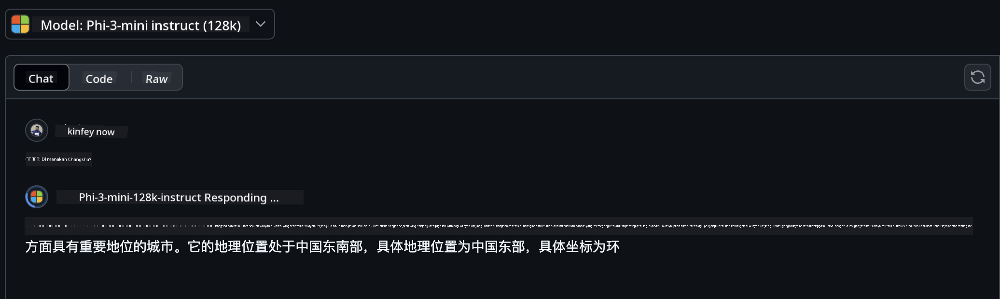
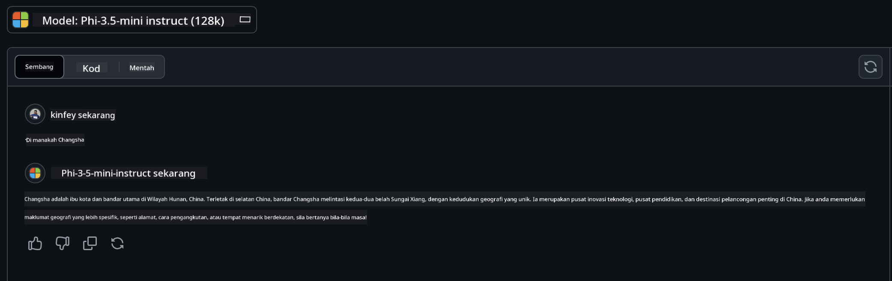

<!--
CO_OP_TRANSLATOR_METADATA:
{
  "original_hash": "124ad36cfe96f74038811b6e2bb93e9d",
  "translation_date": "2025-06-26T02:39:11+00:00",
  "source_file": "19-slm/README.md",
  "language_code": "ms"
}
-->

Model adalah cara paling langsung. Anda boleh mengakses model Phi-3/3.5-Instruct dengan cepat melalui GitHub Models. Digabungkan dengan Azure AI Inference SDK / OpenAI SDK, anda boleh mengakses API melalui kod untuk melengkapkan panggilan Phi-3/3.5-Instruct. Anda juga boleh menguji kesan yang berbeza melalui Playground. - Demo:Perbandingan kesan Phi-3-mini dan Phi-3.5-mini dalam senario Cina   **Azure AI Studio** Atau jika kita ingin menggunakan model vision dan MoE, anda boleh menggunakan Azure AI Studio untuk melengkapkan panggilan. Jika anda berminat, anda boleh membaca Phi-3 Cookbook untuk belajar cara memanggil Phi-3/3.5 Instruct, Vision, MoE melalui Azure AI Studio [Klik pautan ini](https://github.com/microsoft/Phi-3CookBook/blob/main/md/02.QuickStart/AzureAIStudio_QuickStart.md?WT.mc_id=academic-105485-koreyst) **NVIDIA NIM** Selain daripada penyelesaian Model Catalog berasaskan awan yang disediakan oleh Azure dan GitHub, anda juga boleh menggunakan [Nivida NIM](https://developer.nvidia.com/nim?WT.mc_id=academic-105485-koreyst) untuk melengkapkan panggilan berkaitan. Anda boleh melawat NIVIDA NIM untuk melengkapkan panggilan API bagi Keluarga Phi-3/3.5. NVIDIA NIM (NVIDIA Inference Microservices) adalah satu set mikroservis inferensi yang dipercepatkan yang direka untuk membantu pembangun melaksanakan model AI dengan cekap di pelbagai persekitaran, termasuk awan, pusat data, dan stesen kerja. Berikut adalah beberapa ciri utama NVIDIA NIM: - **Kemudahan Pelaksanaan:** NIM membolehkan pelaksanaan model AI dengan satu perintah, menjadikannya mudah untuk diintegrasikan ke dalam aliran kerja yang sedia ada. - **Prestasi Optimum:** Ia menggunakan enjin inferensi yang telah dioptimumkan oleh NVIDIA, seperti TensorRT dan TensorRT-LLM, untuk memastikan latensi rendah dan throughput tinggi. - **Kebolehskalaan:** NIM menyokong autoscaling pada Kubernetes, membolehkannya mengendalikan beban kerja yang berbeza dengan berkesan. - **Keselamatan dan Kawalan:** Organisasi boleh mengekalkan kawalan ke atas data dan aplikasi mereka dengan mengehoskan sendiri mikroservis NIM pada infrastruktur yang diuruskan sendiri. - **API Standard:** NIM menyediakan API standard industri, menjadikannya mudah untuk membina dan mengintegrasikan aplikasi AI seperti chatbot, pembantu AI, dan banyak lagi. NIM adalah sebahagian daripada NVIDIA AI Enterprise, yang bertujuan untuk memudahkan pelaksanaan dan pengoperasian model AI, memastikan ia berjalan dengan cekap pada GPU NVIDIA. - Demo: Menggunakan Nividia NIM untuk memanggil Phi-3.5-Vision-API [[Klik pautan ini](../../../19-slm/python/Phi-3-Vision-Nividia-NIM.ipynb)] ### Inferensi Phi-3/3.5 dalam persekitaran tempatan Inferensi berkaitan dengan Phi-3, atau mana-mana model bahasa seperti GPT-3, merujuk kepada proses menjana respons atau ramalan berdasarkan input yang diterima. Apabila anda memberikan arahan atau soalan kepada Phi-3, ia menggunakan rangkaian neural yang telah dilatihnya untuk menyimpulkan respons yang paling mungkin dan relevan dengan menganalisis corak dan hubungan dalam data yang telah dilatihnya. **Hugging Face Transformer** Hugging Face Transformers adalah perpustakaan yang kuat yang direka untuk pemprosesan bahasa semulajadi (NLP) dan tugas pembelajaran mesin lain. Berikut adalah beberapa perkara penting mengenainya: 1. **Model Pra-latih**: Ia menyediakan ribuan model pra-latih yang boleh digunakan untuk pelbagai tugas seperti klasifikasi teks, pengecaman entiti bernama, penjawaban soalan, penjumlahan, terjemahan, dan penjanaan teks. 2. **Interoperabiliti Rangka Kerja**: Perpustakaan ini menyokong pelbagai rangka kerja pembelajaran mendalam, termasuk PyTorch, TensorFlow, dan JAX. Ini membolehkan anda melatih model dalam satu rangka kerja dan menggunakannya dalam rangka kerja lain. 3. **Keupayaan Multimodal**: Selain NLP, Hugging Face Transformers juga menyokong tugas dalam visi komputer (contohnya, klasifikasi imej, pengesanan objek) dan pemprosesan audio (contohnya, pengecaman ucapan, klasifikasi audio). 4. **Kemudahan Penggunaan**: Perpustakaan ini menawarkan API dan alat untuk memuat turun dan menyesuaikan model dengan mudah, menjadikannya boleh diakses untuk pemula dan pakar. 5. **Komuniti dan Sumber**: Hugging Face mempunyai komuniti yang bersemangat dan dokumentasi yang luas, tutorial, dan panduan untuk membantu pengguna memulakan dan memanfaatkan perpustakaan ini. [dokumentasi rasmi](https://huggingface.co/docs/transformers/index?WT.mc_id=academic-105485-koreyst) atau [repositori GitHub mereka](https://github.com/huggingface/transformers?WT.mc_id=academic-105485-koreyst). Ini adalah kaedah yang paling biasa digunakan, tetapi ia juga memerlukan pemecutan GPU. Lagipun, senario seperti Vision dan MoE memerlukan banyak pengiraan, yang akan sangat terhad pada CPU jika mereka tidak dikuantifikasikan. - Demo:Menggunakan Transformer untuk memanggil Phi-3.5-Instuct [Klik pautan ini](../../../19-slm/python/phi35-instruct-demo.ipynb) - Demo:Menggunakan Transformer untuk memanggil Phi-3.5-Vision[Klik pautan ini](../../../19-slm/python/phi35-vision-demo.ipynb) - Demo:Menggunakan Transformer untuk memanggil Phi-3.5-MoE[Klik pautan ini](../../../19-slm/python/phi35_moe_demo.ipynb) **Ollama** [Ollama](https://ollama.com/?WT.mc_id=academic-105485-koreyst) adalah platform yang direka untuk memudahkan menjalankan model bahasa besar (LLM) secara tempatan pada mesin anda. Ia menyokong pelbagai model seperti Llama 3.1, Phi 3, Mistral, dan Gemma 2, antara lain. Platform ini mempermudahkan proses dengan menggabungkan berat model, konfigurasi, dan data ke dalam satu pakej, menjadikannya lebih mudah diakses untuk pengguna untuk menyesuaikan dan mencipta model mereka sendiri. Ollama tersedia untuk macOS, Linux, dan Windows. Ia adalah alat yang hebat jika anda ingin bereksperimen dengan atau melaksanakan LLM tanpa bergantung pada perkhidmatan awan. Ollama adalah cara paling langsung, anda hanya perlu melaksanakan kenyataan berikut. ```bash

ollama run phi3.5

``` **ONNX Runtime untuk GenAI** [ONNX Runtime](https://github.com/microsoft/onnxruntime-genai?WT.mc_id=academic-105485-koreyst) adalah pemecutan pembelajaran mesin inferensi dan latihan merentas platform. ONNX Runtime untuk Generative AI (GENAI) adalah alat yang kuat yang membantu anda menjalankan model AI generatif dengan cekap di pelbagai platform. ## Apa itu ONNX Runtime? ONNX Runtime adalah projek sumber terbuka yang membolehkan inferensi berprestasi tinggi model pembelajaran mesin. Ia menyokong model dalam format Open Neural Network Exchange (ONNX), yang merupakan standard untuk mewakili model pembelajaran mesin. Inferensi ONNX Runtime boleh membolehkan pengalaman pelanggan yang lebih pantas dan kos yang lebih rendah, menyokong model dari rangka kerja pembelajaran mendalam seperti PyTorch dan TensorFlow/Keras serta perpustakaan pembelajaran mesin klasik seperti scikit-learn, LightGBM, XGBoost, dll. ONNX Runtime adalah serasi dengan perkakasan, pemacu, dan sistem operasi yang berbeza, dan menyediakan prestasi optimum dengan memanfaatkan pemecut perkakasan di mana sesuai bersama-sama pengoptimuman graf dan transformasi ## Apa itu Generative AI? Generative AI merujuk kepada sistem AI yang boleh menjana kandungan baru, seperti teks, imej, atau muzik, berdasarkan data yang telah dilatihnya. Contoh termasuk model bahasa seperti GPT-3 dan model penjanaan imej seperti Stable Diffusion. Perpustakaan ONNX Runtime untuk GenAI menyediakan gelung AI generatif untuk model ONNX, termasuk inferensi dengan ONNX Runtime, pemprosesan logits, pencarian dan persampelan, dan pengurusan cache KV. ## ONNX Runtime untuk GENAI ONNX Runtime untuk GENAI memperluaskan keupayaan ONNX Runtime untuk menyokong model AI generatif. Berikut adalah beberapa ciri utama: - **Sokongan Platform Luas:** Ia berfungsi di pelbagai platform, termasuk Windows, Linux, macOS, Android, dan iOS. - **Sokongan Model:** Ia menyokong banyak model AI generatif yang popular, seperti LLaMA, GPT-Neo, BLOOM, dan banyak lagi. - **Pengoptimuman Prestasi:** Ia termasuk pengoptimuman untuk pemecut perkakasan yang berbeza seperti GPU NVIDIA, GPU AMD, dan banyak lagi. - **Kemudahan Penggunaan:** Ia menyediakan API untuk integrasi mudah ke dalam aplikasi, membolehkan anda menjana teks, imej, dan kandungan lain dengan kod yang minimal - Pengguna boleh memanggil kaedah generate() tahap tinggi, atau menjalankan setiap iterasi model dalam gelung, menjana satu token pada satu masa, dan secara opsional mengemas kini parameter penjanaan di dalam gelung. - ONNX runtime juga mempunyai sokongan untuk pencarian greedy/beam dan persampelan TopP, TopK untuk menjana urutan token dan pemprosesan logits terbina dalam seperti penalti pengulangan. Anda juga boleh menambah penilaian khusus dengan mudah. ## Memulakan Untuk memulakan dengan ONNX Runtime untuk GENAI, anda boleh mengikuti langkah-langkah ini: ### Pasang ONNX Runtime: ```Python
pip install onnxruntime
``` ### Pasang Ekstensi AI Generatif: ```Python
pip install onnxruntime-genai
``` ### Jalankan Model: Berikut adalah contoh mudah dalam Python: ```Python
import onnxruntime_genai as og

model = og.Model('path_to_your_model.onnx')

tokenizer = og.Tokenizer(model)

input_text = "Hello, how are you?"

input_tokens = tokenizer.encode(input_text)

output_tokens = model.generate(input_tokens)

output_text = tokenizer.decode(output_tokens)

print(output_text) 
``` ### Demo:Menggunakan ONNX Runtime GenAI untuk memanggil Phi-3.5-Vision ```python

import onnxruntime_genai as og

model_path = './Your Phi-3.5-vision-instruct ONNX Path'

img_path = './Your Image Path'

model = og.Model(model_path)

processor = model.create_multimodal_processor()

tokenizer_stream = processor.create_stream()

text = "Your Prompt"

prompt = "<|user|>\n"

prompt += "<|image_1|>\n"

prompt += f"{text}<|end|>\n"

prompt += "<|assistant|>\n"

image = og.Images.open(img_path)

inputs = processor(prompt, images=image)

params = og.GeneratorParams(model)

params.set_inputs(inputs)

params.set_search_options(max_length=3072)

generator = og.Generator(model, params)

while not generator.is_done():

    generator.compute_logits()
    
    generator.generate_next_token()

    new_token = generator.get_next_tokens()[0]
    
    code += tokenizer_stream.decode(new_token)
    
    print(tokenizer_stream.decode(new_token), end='', flush=True)

``` **Lain-lain** Selain daripada kaedah rujukan ONNX Runtime dan Ollama, kita juga boleh melengkapkan rujukan model kuantitatif berdasarkan kaedah rujukan model yang disediakan oleh pengeluar yang berbeza. Seperti rangka kerja Apple MLX dengan Apple Metal, Qualcomm QNN dengan NPU, Intel OpenVINO dengan CPU/GPU, dll. Anda juga boleh mendapatkan lebih banyak kandungan dari [Phi-3 Cookbook](https://github.com/microsoft/phi-3cookbook?WT.mc_id=academic-105485-koreyst) ## Lebih Banyak Kita telah mempelajari asas Keluarga Phi-3/3.5, tetapi untuk mempelajari lebih lanjut tentang SLM kita memerlukan lebih banyak pengetahuan. Anda boleh mencari jawapan dalam Phi-3 Cookbook. Jika anda ingin mempelajari lebih lanjut, sila lawati [Phi-3 Cookbook](https://github.com/microsoft/phi-3cookbook?WT.mc_id=academic-105485-koreyst).

**Penafian**:  
Dokumen ini telah diterjemahkan menggunakan perkhidmatan terjemahan AI [Co-op Translator](https://github.com/Azure/co-op-translator). Walaupun kami berusaha untuk ketepatan, sila ambil perhatian bahawa terjemahan automatik mungkin mengandungi kesilapan atau ketidaktepatan. Dokumen asal dalam bahasa asalnya harus dianggap sebagai sumber yang berwibawa. Untuk maklumat penting, terjemahan manusia profesional disyorkan. Kami tidak bertanggungjawab atas sebarang salah faham atau salah tafsir yang timbul daripada penggunaan terjemahan ini.