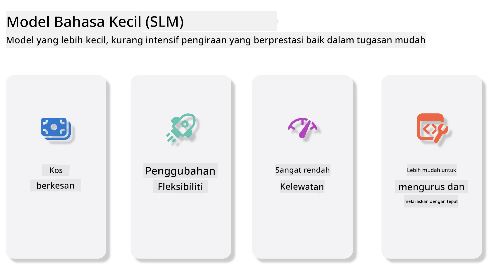
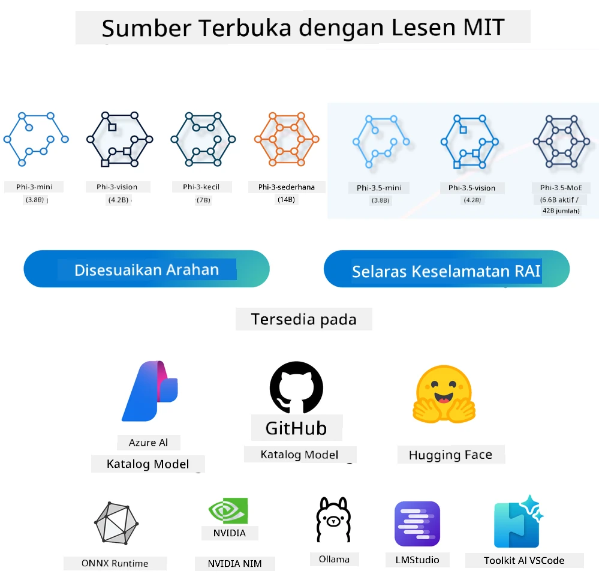
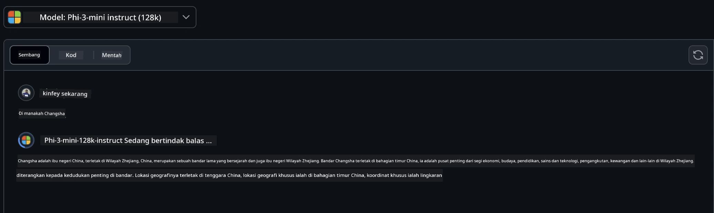
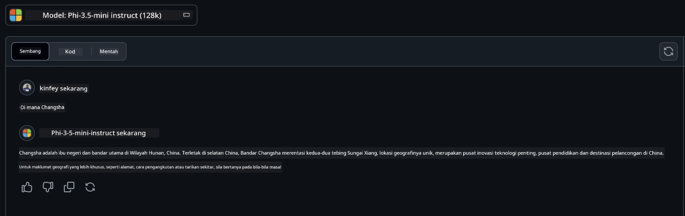

# Pengenalan kepada Model Bahasa Kecil untuk AI Generatif bagi Permula

AI Generatif adalah bidang kecerdasan buatan yang menarik yang menumpukan pada penciptaan sistem yang mampu menghasilkan kandungan baru. Kandungan ini boleh berupa teks dan imej hingga muzik dan bahkan persekitaran maya sepenuhnya. Salah satu aplikasi yang paling menarik bagi AI generatif adalah dalam bidang model bahasa.

## Apakah Model Bahasa Kecil?

Model Bahasa Kecil (SLM) mewakili varian berskala kecil bagi model bahasa besar (LLM), menggunakan banyak prinsip dan teknik seni bina LLM, sambil menunjukkan jejak pengiraan yang jauh lebih kecil.

SLM adalah subset model bahasa yang direka untuk menghasilkan teks seperti manusia. Berbeza dengan model besar seperti GPT-4, SLM lebih padat dan cekap, menjadikannya sesuai untuk aplikasi di mana sumber pengiraan adalah terhad. Walaupun saiznya kecil, ia masih boleh melaksanakan pelbagai tugas. Biasanya, SLM dibina dengan memampat atau memurnikan LLM, bertujuan mengekalkan sebahagian besar fungsi dan kebolehan linguistik model asal. Pengurangan saiz model ini mengurangkan keseluruhan kerumitan, menjadikan SLM lebih cekap dari segi penggunaan memori dan keperluan pengiraan. Walaupun dengan pengoptimuman ini, SLM masih mampu melaksanakan pelbagai tugasan pemprosesan bahasa semula jadi (NLP):

- Penjanaan Teks: Mencipta ayat atau perenggan yang koheren dan relevan secara kontekstual.
- Penyempurnaan Teks: Memprediksi dan melengkapkan ayat berdasarkan petunjuk diberi.
- Terjemahan: Menukar teks dari satu bahasa ke bahasa lain.
- Ringkasan: Merumuskan teks panjang menjadi ringkasan yang lebih pendek dan mudah difahami.

Walaupun terdapat beberapa kompromi dalam prestasi atau kedalaman pemahaman berbanding dengan model lebih besar.

## Bagaimana Model Bahasa Kecil Berfungsi?
SLM dilatih menggunakan sejumlah besar data teks. Semasa latihan, mereka mempelajari corak dan struktur bahasa, membolehkan mereka menghasilkan teks yang betul dari segi tatabahasa dan sesuai dari segi konteks. Proses latihan melibatkan:

- Pengumpulan Data: Mengumpul set data teks yang besar dari pelbagai sumber.
- Pra-pemprosesan: Membersihkan dan menyusun data untuk menjadikannya sesuai untuk latihan.
- Latihan: Menggunakan algoritma pembelajaran mesin untuk mengajar model cara memahami dan menghasilkan teks.
- Penalaan Halus: Menyesuaikan model untuk meningkatkan prestasinya dalam tugasan tertentu.

Pembangunan SLM sejajar dengan keperluan yang semakin meningkat untuk model yang boleh digunakan dalam persekitaran dengan sumber terhad, seperti peranti mudah alih atau platform pengkomputeran edge, di mana LLM skala penuh mungkin tidak praktikal disebabkan permintaan sumber yang tinggi. Dengan menumpu pada kecekapan, SLM mengimbangi prestasi dengan aksesibiliti, membolehkan aplikasi yang lebih luas dalam pelbagai domain.



## Objektif Pembelajaran

Dalam pelajaran ini, kami berharap dapat memperkenalkan pengetahuan mengenai SLM dan menggabungkannya dengan Microsoft Phi-3 untuk mempelajari pelbagai senario dalam kandungan teks, visi, dan MoE.

Menjelang akhir pelajaran ini, anda sepatutnya dapat menjawab soalan berikut:

- Apakah itu SLM?
- Apakah perbezaan antara SLM dan LLM?
- Apakah Keluarga Microsoft Phi-3/3.5?
- Bagaimana untuk menjalankan inferens dengan Keluarga Microsoft Phi-3/3.5?

Sedia? Mari kita mulakan.

## Perbezaan antara Model Bahasa Besar (LLM) dan Model Bahasa Kecil (SLM)

Kedua-dua LLM dan SLM dibina berdasarkan prinsip asas pembelajaran mesin probabilistik, mengikuti pendekatan yang serupa dalam reka bentuk seni bina, metodologi latihan, proses penjanaan data, dan teknik penilaian model. Namun, beberapa faktor utama membezakan kedua-dua jenis model ini.

## Aplikasi Model Bahasa Kecil

SLM mempunyai pelbagai aplikasi, termasuk:

- Chatbot: Memberi sokongan pelanggan dan berinteraksi dengan pengguna secara perbualan.
- Penciptaan Kandungan: Membantu penulis dengan menghasilkan idea atau bahkan draf artikel sepenuhnya.
- Pendidikan: Membantu pelajar dengan tugasan penulisan atau pembelajaran bahasa baru.
- Aksesibiliti: Mencipta alat untuk individu dengan kecacatan, seperti sistem teks ke pertuturan.

**Saiz**

Perbezaan utama antara LLM dan SLM terletak pada skala model. LLM, seperti ChatGPT (GPT-4), boleh mengandungi anggaran 1.76 trilion parameter, manakala SLM sumber terbuka seperti Mistral 7B direka dengan parameter yang jauh lebih sedikit—sekitar 7 bilion. Perbezaan ini terutamanya disebabkan oleh perbezaan dalam seni bina model dan proses latihan. Sebagai contoh, ChatGPT menggunakan mekanisme perhatian sendiri dalam kerangka pengekod-penyahkod, manakala Mistral 7B menggunakan perhatian jendela gelongsor, yang membolehkan latihan yang lebih cekap dalam model hanya penyahkod. Variasi seni bina ini mempunyai implikasi besar terhadap kerumitan dan prestasi model.

**Pemahaman**

SLM biasanya dioptimumkan untuk prestasi dalam domain tertentu, menjadikannya sangat khusus tetapi mungkin terhad dalam kemampuan memberikan pemahaman kontekstual luas merentas pelbagai bidang pengetahuan. Sebaliknya, LLM bertujuan untuk mensimulasikan kecerdasan seperti manusia pada tahap yang lebih menyeluruh. Dilatih pada set data yang besar dan pelbagai, LLM direka untuk berprestasi baik dalam pelbagai domain, menawarkan lebih banyak serbaguna dan kemampuan penyesuaian. Oleh itu, LLM lebih sesuai untuk pelbagai tugasan hiliran, seperti pemprosesan bahasa semula jadi dan pengaturcaraan.

**Pengkomputeran**

Latihan dan penyebaran LLM adalah proses yang memerlukan sumber tinggi, lazimnya memerlukan infrastruktur pengkomputeran yang besar termasuk kluster GPU berskala besar. Contohnya, latihan model seperti ChatGPT dari awal mungkin memerlukan ribuan GPU selama tempoh yang panjang. Sebaliknya, SLM dengan jumlah parameter yang lebih kecil lebih mudah diakses dari segi sumber pengiraan. Model seperti Mistral 7B boleh dilatih dan dijalankan pada mesin tempatan dengan keupayaan GPU sederhana, walaupun latihan masih memerlukan beberapa jam menggunakan pelbagai GPU.

**Bias**

Bias adalah isu yang diketahui dalam LLM, terutamanya disebabkan oleh sifat data latihan. Model ini sering bergantung pada data mentah yang tersedia secara terbuka dari internet, yang mungkin kurang mewakili atau salah mewakili kumpulan tertentu, memperkenalkan pelabelan yang salah, atau mencerminkan bias linguistik yang dipengaruhi oleh dialek, variasi geografi, dan peraturan tatabahasa. Selain itu, kompleksiti seni bina LLM boleh secara tidak sengaja memburukkan bias, yang mungkin tidak disedari tanpa penalaan halus yang teliti. Sebaliknya, SLM yang dilatih pada set data yang lebih terhad dan khusus domain, secara semula jadi kurang terdedah kepada bias sedemikian, walaupun tidak terkecuali.

**Inferens**

Saiz SLM yang lebih kecil memberinya kelebihan besar dari segi kelajuan inferens, membolehkan mereka menghasilkan output dengan cekap pada perkakasan tempatan tanpa memerlukan pemprosesan selari yang meluas. Sebaliknya, LLM, disebabkan saiz dan kerumitannya, sering memerlukan sumber pengiraan selari yang besar untuk mencapai masa inferens yang boleh diterima. Kehadiran pelbagai pengguna serentak lagi melambatkan masa tindak balas LLM, terutamanya apabila dikerahkan pada skala besar.

Kesimpulannya, walaupun kedua-dua LLM dan SLM berkongsi asas dalam pembelajaran mesin, mereka berbeza dengan ketara dalam saiz model, keperluan sumber, pemahaman kontekstual, kerentanan kepada bias, dan kelajuan inferens. Perbezaan ini mencerminkan kesesuaian mereka untuk kegunaan berbeza, dengan LLM lebih serbaguna tetapi memerlukan sumber banyak, dan SLM menawarkan kecekapan khusus domain dengan keperluan pengiraan yang dikurangkan.

***Nota: Dalam pelajaran ini, kami akan memperkenalkan SLM menggunakan Microsoft Phi-3 / 3.5 sebagai contoh.***

## Memperkenalkan Keluarga Phi-3 / Phi-3.5

Keluarga Phi-3 / 3.5 terutamanya menyasarkan senario aplikasi teks, visi, dan Agen (MoE):

### Phi-3 / 3.5 Instruct

Terutama untuk penjanaan teks, penyempurnaan chat, dan pengekstrakan maklumat kandungan, dan lain-lain.

**Phi-3-mini**

Model bahasa 3.8B tersedia di Microsoft Azure AI Studio, Hugging Face, dan Ollama. Model Phi-3 memberikan prestasi yang jauh lebih baik daripada model bahasa bersaiz sama dan lebih besar pada penanda aras utama (lihat nombor penanda aras di bawah, nombor yang lebih tinggi lebih baik). Phi-3-mini mengatasi model yang dua kali ganda saiznya, manakala Phi-3-small dan Phi-3-medium mengatasi model yang lebih besar, termasuk GPT-3.5.

**Phi-3-small & medium**

Dengan hanya 7B parameter, Phi-3-small mengatasi GPT-3.5T dalam pelbagai penanda aras bahasa, penaakulan, pengkodan, dan matematik.

Phi-3-medium dengan 14B parameter meneruskan tren ini dan mengatasi Gemini 1.0 Pro.

**Phi-3.5-mini**

Kita boleh menganggapnya sebagai naik taraf daripada Phi-3-mini. Walaupun parameter kekal tidak berubah, ia meningkatkan kemampuan untuk menyokong pelbagai bahasa (menyokong 20+ bahasa: Arab, Cina, Czech, Denmark, Belanda, Inggeris, Finland, Perancis, Jerman, Ibrani, Hungary, Itali, Jepun, Korea, Norway, Poland, Portugis, Rusia, Sepanyol, Sweden, Thai, Turki, Ukraine) dan menambah sokongan lebih kuat untuk konteks panjang.

Phi-3.5-mini dengan 3.8B parameter mengatasi model bahasa saiz sama dan setanding dengan model dua kali ganda saiznya.

### Phi-3 / 3.5 Vision

Kita boleh menganggap model Instruct Phi-3/3.5 sebagai kemampuan Phi untuk memahami, dan Vision adalah apa yang memberikan Phi “mata” untuk memahami dunia.

**Phi-3-Vision**

Phi-3-vision, dengan hanya 4.2B parameter, meneruskan tren ini dan mengatasi model yang lebih besar seperti Claude-3 Haiku dan Gemini 1.0 Pro V dalam tugasan penaakulan visual umum, OCR, dan pemahaman jadual serta diagram.

**Phi-3.5-Vision**

Phi-3.5-Vision juga adalah naik taraf Phi-3-Vision, menambah sokongan untuk pelbagai imej. Anda boleh menganggapnya sebagai penambahbaikan dalam visi, bukan sahaja boleh melihat gambar malah juga video.

Phi-3.5-vision mengatasi model lebih besar seperti Claude-3.5 Sonnet dan Gemini 1.5 Flash merentas tugasan OCR, pemahaman jadual dan carta serta setanding dalam tugasan penaakulan pengetahuan visual umum. Menyokong input berbilang bingkai, iaitu melaksanakan penaakulan pada pelbagai imej input.

### Phi-3.5-MoE

***Mixture of Experts (MoE)*** membolehkan model dilatih dengan penggunaan pengiraan jauh lebih rendah, yang bermakna anda boleh skala model atau saiz dataset dengan ketara dengan anggaran pengiraan yang sama seperti model padat. Secara khusus, model MoE harus mencapai kualiti sama seperti model padat sebaliknya dengan lebih cepat semasa pralatihan.

Phi-3.5-MoE terdiri daripada 16 modul pakar 3.8B. Phi-3.5-MoE dengan hanya 6.6B parameter aktif mencapai tahap penaakulan, pemahaman bahasa, dan matematik yang serupa dengan model yang jauh lebih besar.

Kita boleh menggunakan model Keluarga Phi-3/3.5 berdasarkan senario yang berbeza. Tidak seperti LLM, anda boleh melaksanakan Phi-3/3.5-mini atau Phi-3/3.5-Vision pada peranti edge.

## Cara menggunakan model Keluarga Phi-3/3.5

Kami berharap menggunakan Phi-3/3.5 dalam pelbagai senario. Seterusnya, kami akan menggunakan Phi-3/3.5 berdasarkan pelbagai senario.



### Inferens melalui API Awan

**Model GitHub**

Model GitHub adalah cara paling langsung. Anda boleh dengan cepat mengakses model Phi-3/3.5-Instruct melalui Model GitHub. Digabungkan dengan Azure AI Inference SDK / OpenAI SDK, anda boleh mengakses API melalui kod untuk melengkapkan panggilan Phi-3/3.5-Instruct. Anda juga boleh menguji kesan berbeza melalui Playground.

- Demo: Perbandingan kesan Phi-3-mini dan Phi-3.5-mini dalam senario bahasa Cina





**Azure AI Studio**

Atau jika anda ingin menggunakan model visi dan MoE, anda boleh gunakan Azure AI Studio untuk melengkapkan panggilan. Jika berminat, anda boleh baca Phi-3 Cookbook untuk belajar cara memanggil Phi-3/3.5 Instruct, Vision, MoE melalui Azure AI Studio [Klik pautan ini](https://github.com/microsoft/Phi-3CookBook/blob/main/md/02.QuickStart/AzureAIStudio_QuickStart.md?WT.mc_id=academic-105485-koreyst)

**NVIDIA NIM**

Selain daripada penyelesaian Model Catalog berasaskan awan yang disediakan oleh Azure dan GitHub, anda juga boleh menggunakan [NVIDIA NIM](https://developer.nvidia.com/nim?WT.mc_id=academic-105485-koreyst) untuk melengkapkan panggilan berkaitan. Anda boleh melawat NVIDIA NIM untuk melengkapkan panggilan API Keluarga Phi-3/3.5. NVIDIA NIM (NVIDIA Inference Microservices) adalah set mikroservis inferens dipercepat yang direka untuk membantu pembangun menggunakan model AI dengan cekap merentas pelbagai persekitaran, termasuk awan, pusat data, dan stesen kerja.

Berikut adalah beberapa ciri utama NVIDIA NIM:
- **Kemudahan Penyebaran:** NIM membenarkan penyebaran model AI dengan satu arahan, menjadikannya mudah untuk digabungkan ke dalam aliran kerja sedia ada.
- **Prestasi Optimum:** Ia memanfaatkan enjin inferens NVIDIA yang telah dioptimumkan, seperti TensorRT dan TensorRT-LLM, untuk memastikan latensi rendah dan melalui yang tinggi.
- **Kebolehskalaan:** NIM menyokong autoskala pada Kubernetes, membolehkannya mengendalikan beban kerja yang berubah-ubah dengan berkesan.
- **Keselamatan dan Kawalan:** Organisasi boleh mengekalkan kawalan ke atas data dan aplikasi mereka dengan menghoskan sendiri mikrosistem NIM pada infrastruktur terurus mereka sendiri.
- **API Standard:** NIM menyediakan API standard industri, menjadikannya mudah untuk membina dan menggabungkan aplikasi AI seperti chatbot, pembantu AI, dan lain-lain.

NIM adalah sebahagian daripada NVIDIA AI Enterprise, yang bertujuan untuk memudahkan penyebaran dan pengoperasian model AI, memastikan ia berjalan dengan cekap pada GPU NVIDIA.

- Demo: Menggunakan NVIDIA NIM untuk memanggil Phi-3.5-Vision-API  [[Klik pautan ini](./python/Phi-3-Vision-Nividia-NIM.ipynb?WT.mc_id=academic-105485-koreyst)]


### Menjalankan Phi-3/3.5 Secara Tempatan
Inferens berkaitan dengan Phi-3, atau mana-mana model bahasa seperti GPT-3, merujuk kepada proses menghasilkan respons atau ramalan berdasarkan input yang diterima. Apabila anda memberikan prompt atau soalan kepada Phi-3, ia menggunakan rangkaian neural yang telah dilatih untuk mentafsirkan respons yang paling mungkin dan relevan dengan menganalisis corak dan hubungan dalam data yang telah dilatih.

**Hugging Face Transformer**
Hugging Face Transformers adalah perpustakaan yang kuat direka untuk pemprosesan bahasa semula jadi (NLP) dan tugas pembelajaran mesin lain. Berikut adalah beberapa perkara penting mengenainya:

1. **Model Latihan Awal:** Ia menyediakan beribu-ribu model latih awal yang boleh digunakan untuk pelbagai tugasan seperti pengkelasan teks, pengecaman entiti bernama, menjawab soalan, meringkaskan, menterjemah, dan penjanaan teks.

2. **Keserasian Kerangka:** Perpustakaan ini menyokong pelbagai kerangka pembelajaran mendalam, termasuk PyTorch, TensorFlow, dan JAX. Ini membolehkan anda melatih model dalam satu kerangka dan menggunakannya dalam kerangka lain.

3. **Kebolehan Multimodal:** Selain NLP, Hugging Face Transformers juga menyokong tugas-tugas dalam penglihatan komputer (contohnya, pengkelasan imej, pengesanan objek) dan pemprosesan audio (contohnya, pengecaman suara, pengkelasan audio).

4. **Mudah Digunakan:** Perpustakaan ini menyediakan API dan alat untuk memuat turun dan melakukan penalaan halus model dengan mudah, menjadikannya boleh diakses oleh pemula dan pakar.

5. **Komuniti dan Sumber:** Hugging Face mempunyai komuniti yang hidup dan dokumentasi, tutorial, serta panduan yang luas untuk membantu pengguna memulakan dan menggunakan perpustakaan ini dengan optimum.
[dokumentasi rasmi](https://huggingface.co/docs/transformers/index?WT.mc_id=academic-105485-koreyst) atau [repositori GitHub mereka](https://github.com/huggingface/transformers?WT.mc_id=academic-105485-koreyst).

Ini adalah kaedah yang paling biasa digunakan, tetapi ia juga memerlukan pecutan GPU. Apatah lagi, senario seperti Vision dan MoE memerlukan banyak pengiraan, yang akan sangat perlahan pada CPU jika tidak dikwantisasi.


- Demo: Menggunakan Transformer untuk memanggil Phi-3.5-Instruct [Klik pautan ini](./python/phi35-instruct-demo.ipynb?WT.mc_id=academic-105485-koreyst)

- Demo: Menggunakan Transformer untuk memanggil Phi-3.5-Vision [Klik pautan ini](./python/phi35-vision-demo.ipynb?WT.mc_id=academic-105485-koreyst)

- Demo: Menggunakan Transformer untuk memanggil Phi-3.5-MoE [Klik pautan ini](./python/phi35_moe_demo.ipynb?WT.mc_id=academic-105485-koreyst)

**Ollama**
[Ollama](https://ollama.com/?WT.mc_id=academic-105485-koreyst) adalah platform yang direka untuk memudahkan pelaksanaan model bahasa besar (LLM) secara tempatan pada mesin anda. Ia menyokong pelbagai model seperti Llama 3.1, Phi 3, Mistral, dan Gemma 2, antara lain. Platform ini memudahkan proses dengan menggabungkan berat model, konfigurasi, dan data ke dalam satu pakej, menjadikannya lebih mudah diakses untuk pengguna menyesuaikan dan mencipta model mereka sendiri. Ollama tersedia untuk macOS, Linux, dan Windows. Ia adalah alat yang hebat jika anda ingin bereksperimen atau menyebarkan LLM tanpa bergantung pada perkhidmatan awan. Ollama adalah cara yang paling langsung, anda hanya perlu melaksanakan arahan berikut.


```bash

ollama run phi3.5

```


**ONNX Runtime untuk GenAI**

[ONNX Runtime](https://github.com/microsoft/onnxruntime-genai?WT.mc_id=academic-105485-koreyst) adalah pemecut inferens dan latihan pembelajaran mesin merentas platform. ONNX Runtime untuk Generative AI (GENAI) adalah alat yang kuat yang membantu anda menjalankan model AI generatif dengan cekap merentas pelbagai platform. 

## Apa itu ONNX Runtime?
ONNX Runtime adalah projek sumber terbuka yang membolehkan inferens berprestasi tinggi bagi model pembelajaran mesin. Ia menyokong model dalam format Open Neural Network Exchange (ONNX), yang merupakan standard untuk mewakili model pembelajaran mesin. Inferens ONNX Runtime boleh mempercepatkan pengalaman pelanggan dan mengurangkan kos, menyokong model daripada kerangka pembelajaran mendalam seperti PyTorch dan TensorFlow/Keras serta perpustakaan pembelajaran mesin klasik seperti scikit-learn, LightGBM, XGBoost, dan lain-lain. ONNX Runtime serasi dengan pelbagai perkakasan, pemacu, dan sistem operasi, dan menyediakan prestasi optimum dengan memanfaatkan pemecut perkakasan di mana sesuai bersama pengoptimuman dan transformasi graf.

## Apa itu Generative AI?
Generative AI merujuk kepada sistem AI yang boleh menjana kandungan baru, seperti teks, imej, atau muzik, berdasarkan data yang telah mereka latih. Contohnya termasuk model bahasa seperti GPT-3 dan model penjanaan imej seperti Stable Diffusion. Perpustakaan ONNX Runtime untuk GenAI menyediakan gelung generatif AI untuk model ONNX, termasuk inferens dengan ONNX Runtime, pemprosesan logits, pencarian dan pensampelan, serta pengurusan cache KV.

## ONNX Runtime untuk GENAI
ONNX Runtime untuk GENAI memperluaskan keupayaan ONNX Runtime untuk menyokong model AI generatif. Berikut adalah beberapa ciri utama:

- **Sokongan Platform Luas:** Ia berfungsi pada pelbagai platform, termasuk Windows, Linux, macOS, Android, dan iOS.
- **Sokongan Model:** Ia menyokong banyak model AI generatif popular, seperti LLaMA, GPT-Neo, BLOOM, dan banyak lagi.
- **Pengoptimuman Prestasi:** Ia termasuk pengoptimuman untuk pelbagai pemecut perkakasan seperti GPU NVIDIA, GPU AMD, dan lain-lain.
- **Kemudahan Penggunaan:** Ia menyediakan API untuk integrasi mudah ke dalam aplikasi, membolehkan anda menjana teks, imej, dan kandungan lain dengan kod yang minimum.
- Pengguna boleh memanggil kaedah generate() tahap tinggi, atau menjalankan setiap iterasi model dalam gelung, menjana satu token pada satu masa, dan secara pilihan mengemas kini parameter penjanaan di dalam gelung.
- ONNX runtime juga menyokong pencarian greedy/beam dan pensampelan TopP, TopK untuk menjana urutan token dan pemprosesan logits terbina dalam seperti penalti pengulangan. Anda juga boleh menambah penilaian tersuai dengan mudah.

## Mula Bermula
Untuk memulakan dengan ONNX Runtime untuk GENAI, anda boleh mengikuti langkah-langkah berikut:

### Pasang ONNX Runtime:
```Python
pip install onnxruntime
```
### Pasang Sambungan AI Generatif:
```Python
pip install onnxruntime-genai
```

### Jalankan Model: Berikut adalah contoh mudah dalam Python:
```Python
import onnxruntime_genai as og

model = og.Model('path_to_your_model.onnx')

tokenizer = og.Tokenizer(model)

input_text = "Hello, how are you?"

input_tokens = tokenizer.encode(input_text)

output_tokens = model.generate(input_tokens)

output_text = tokenizer.decode(output_tokens)

print(output_text) 
```
### Demo: Menggunakan ONNX Runtime GenAI untuk memanggil Phi-3.5-Vision


```python

import onnxruntime_genai as og

model_path = './Your Phi-3.5-vision-instruct ONNX Path'

img_path = './Your Image Path'

model = og.Model(model_path)

processor = model.create_multimodal_processor()

tokenizer_stream = processor.create_stream()

text = "Your Prompt"

prompt = "<|user|>\n"

prompt += "<|image_1|>\n"

prompt += f"{text}<|end|>\n"

prompt += "<|assistant|>\n"

image = og.Images.open(img_path)

inputs = processor(prompt, images=image)

params = og.GeneratorParams(model)

params.set_inputs(inputs)

params.set_search_options(max_length=3072)

generator = og.Generator(model, params)

while not generator.is_done():

    generator.compute_logits()
    
    generator.generate_next_token()

    new_token = generator.get_next_tokens()[0]
    
    output = tokenizer_stream.decode(new_token)
    
    print(tokenizer_stream.decode(new_token), end='', flush=True)

```


**Lain-lain**

Selain kaedah rujukan ONNX Runtime dan Ollama, kita juga boleh melengkapkan rujukan model kuantitatif berdasarkan kaedah rujukan model yang disediakan oleh pengeluar berbeza. Seperti rangka kerja Apple MLX dengan Apple Metal, Qualcomm QNN dengan NPU, Intel OpenVINO dengan CPU/GPU, dan lain-lain. Anda juga boleh mendapatkan lebih banyak kandungan dari [Phi-3 Cookbook](https://github.com/microsoft/phi-3cookbook?WT.mc_id=academic-105485-koreyst)


## Lanjutan

Kita telah mempelajari asas Keluarga Phi-3/3.5, tetapi untuk mengetahui lebih lanjut mengenai SLM kita memerlukan lebih banyak pengetahuan. Anda boleh mendapatkan jawapan dalam Phi-3 Cookbook. Jika anda ingin belajar lebih lanjut, sila lawati [Phi-3 Cookbook](https://github.com/microsoft/phi-3cookbook?WT.mc_id=academic-105485-koreyst).

---

<!-- CO-OP TRANSLATOR DISCLAIMER START -->
**Penafian**:  
Dokumen ini telah diterjemahkan menggunakan perkhidmatan terjemahan AI [Co-op Translator](https://github.com/Azure/co-op-translator). Walaupun kami berusaha untuk mencapai ketepatan, sila ambil perhatian bahawa terjemahan automatik mungkin mengandungi kesilapan atau ketidaktepatan. Dokumen asal dalam bahasa asalnya harus dianggap sebagai sumber yang sahih. Untuk maklumat penting, terjemahan profesional oleh manusia adalah disyorkan. Kami tidak bertanggungjawab terhadap sebarang salah faham atau salah tafsiran yang timbul daripada penggunaan terjemahan ini.
<!-- CO-OP TRANSLATOR DISCLAIMER END -->