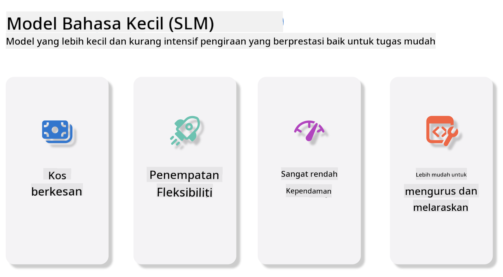
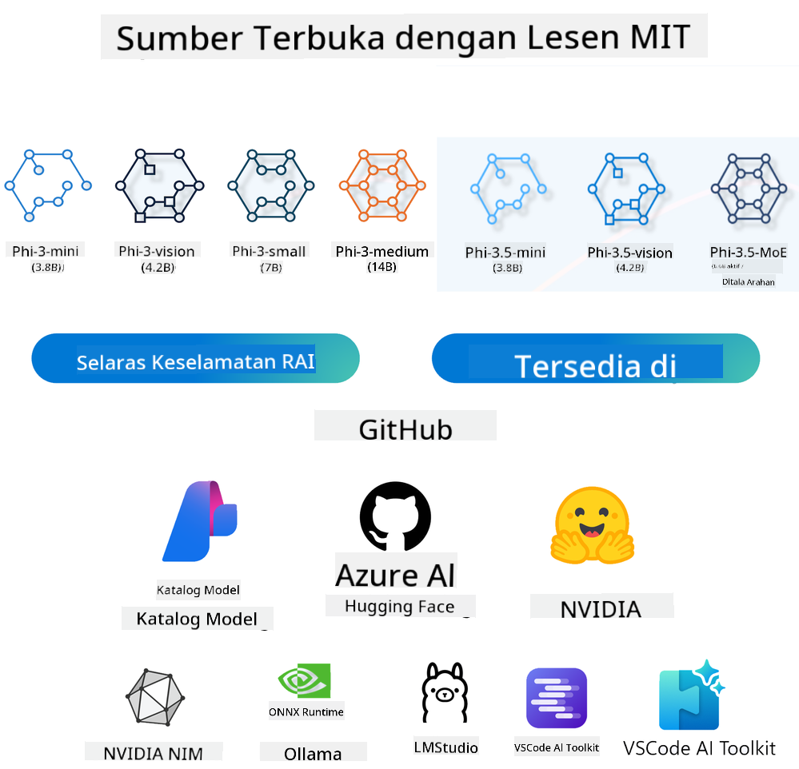
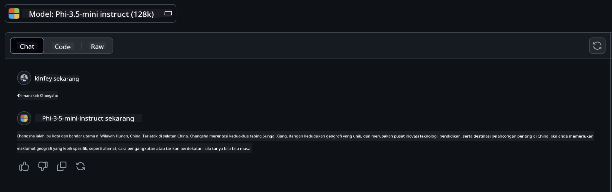

<!--
CO_OP_TRANSLATOR_METADATA:
{
  "original_hash": "124ad36cfe96f74038811b6e2bb93e9d",
  "translation_date": "2025-07-09T18:42:16+00:00",
  "source_file": "19-slm/README.md",
  "language_code": "ms"
}
-->
# Pengenalan kepada Model Bahasa Kecil untuk AI Generatif bagi Pemula  
AI generatif adalah bidang kecerdasan buatan yang menarik yang memfokuskan pada penciptaan sistem yang mampu menghasilkan kandungan baru. Kandungan ini boleh merangkumi teks, imej, muzik, malah persekitaran maya sepenuhnya. Salah satu aplikasi paling menarik AI generatif adalah dalam bidang model bahasa.

## Apakah Model Bahasa Kecil?  

Model Bahasa Kecil (SLM) adalah varian berskala kecil daripada model bahasa besar (LLM), yang menggunakan banyak prinsip dan teknik seni bina LLM, tetapi dengan jejak pengkomputeran yang jauh lebih kecil.  

SLM adalah subset model bahasa yang direka untuk menghasilkan teks yang menyerupai bahasa manusia. Berbeza dengan model yang lebih besar seperti GPT-4, SLM lebih padat dan cekap, menjadikannya sesuai untuk aplikasi yang mempunyai sumber pengkomputeran terhad. Walaupun saiznya lebih kecil, ia masih mampu melaksanakan pelbagai tugasan. Biasanya, SLM dibina dengan memampatkan atau mendistilasi LLM, dengan tujuan mengekalkan sebahagian besar fungsi dan keupayaan linguistik model asal. Pengurangan saiz model ini mengurangkan kerumitan keseluruhan, menjadikan SLM lebih cekap dari segi penggunaan memori dan keperluan pengkomputeran. Walaupun dengan pengoptimuman ini, SLM masih boleh melaksanakan pelbagai tugasan pemprosesan bahasa semula jadi (NLP):  

- Penjanaan Teks: Mencipta ayat atau perenggan yang koheren dan relevan dengan konteks.  
- Lengkapkan Teks: Meramalkan dan melengkapkan ayat berdasarkan arahan yang diberikan.  
- Terjemahan: Menukar teks dari satu bahasa ke bahasa lain.  
- Ringkasan: Memendekkan teks panjang menjadi ringkasan yang lebih mudah difahami.  

Walaupun terdapat beberapa kompromi dari segi prestasi atau kedalaman pemahaman berbanding model yang lebih besar.  

## Bagaimana Model Bahasa Kecil Berfungsi?  
SLM dilatih menggunakan sejumlah besar data teks. Semasa latihan, model mempelajari corak dan struktur bahasa, membolehkannya menghasilkan teks yang betul dari segi tatabahasa dan sesuai dengan konteks. Proses latihan melibatkan:  

- Pengumpulan Data: Mengumpul set data teks yang besar dari pelbagai sumber.  
- Pra-pemprosesan: Membersihkan dan menyusun data supaya sesuai untuk latihan.  
- Latihan: Menggunakan algoritma pembelajaran mesin untuk mengajar model memahami dan menghasilkan teks.  
- Penalaan Halus: Melaraskan model untuk meningkatkan prestasi pada tugasan tertentu.  

Pembangunan SLM sejajar dengan keperluan yang semakin meningkat untuk model yang boleh digunakan dalam persekitaran dengan sumber terhad, seperti peranti mudah alih atau platform pengkomputeran tepi, di mana LLM berskala penuh mungkin tidak praktikal kerana keperluan sumber yang tinggi. Dengan menumpukan pada kecekapan, SLM mengimbangi prestasi dengan kebolehcapaian, membolehkan aplikasi yang lebih meluas dalam pelbagai bidang.  

  

## Objektif Pembelajaran  

Dalam pelajaran ini, kami berharap dapat memperkenalkan pengetahuan tentang SLM dan menggabungkannya dengan Microsoft Phi-3 untuk mempelajari pelbagai senario dalam kandungan teks, visi dan MoE.  

Menjelang akhir pelajaran ini, anda sepatutnya dapat menjawab soalan berikut:  

- Apakah itu SLM  
- Apakah perbezaan antara SLM dan LLM  
- Apakah Keluarga Microsoft Phi-3/3.5  
- Bagaimana untuk membuat inferens Microsoft Phi-3/3.5  

Sedia? Mari kita mulakan.  

## Perbezaan antara Model Bahasa Besar (LLM) dan Model Bahasa Kecil (SLM)  

Kedua-dua LLM dan SLM dibina berdasarkan prinsip asas pembelajaran mesin probabilistik, mengikuti pendekatan yang serupa dalam reka bentuk seni bina, metodologi latihan, proses penjanaan data, dan teknik penilaian model. Namun, terdapat beberapa faktor utama yang membezakan kedua-dua jenis model ini.  

## Aplikasi Model Bahasa Kecil  

SLM mempunyai pelbagai aplikasi, termasuk:  

- Chatbot: Memberi sokongan pelanggan dan berinteraksi dengan pengguna secara perbualan.  
- Penciptaan Kandungan: Membantu penulis dengan menjana idea atau bahkan draf artikel penuh.  
- Pendidikan: Membantu pelajar dalam tugasan penulisan atau pembelajaran bahasa baru.  
- Aksesibiliti: Mewujudkan alat untuk individu kurang upaya, seperti sistem teks-ke-ucapan.  

**Saiz**  

Perbezaan utama antara LLM dan SLM terletak pada skala model. LLM seperti ChatGPT (GPT-4) boleh mengandungi anggaran 1.76 trilion parameter, manakala SLM sumber terbuka seperti Mistral 7B direka dengan parameter yang jauh lebih sedikit—kira-kira 7 bilion. Perbezaan ini terutamanya disebabkan oleh perbezaan seni bina model dan proses latihan. Contohnya, ChatGPT menggunakan mekanisme perhatian kendiri dalam rangka kerja penyandi-penyahkodi, manakala Mistral 7B menggunakan perhatian tetingkap gelongsor, yang membolehkan latihan lebih cekap dalam model penyahkod sahaja. Variasi seni bina ini mempunyai implikasi besar terhadap kerumitan dan prestasi model-model ini.  

**Pemahaman**  

SLM biasanya dioptimumkan untuk prestasi dalam domain tertentu, menjadikannya sangat khusus tetapi mungkin terhad dalam keupayaan untuk memberikan pemahaman konteks yang luas merentasi pelbagai bidang pengetahuan. Sebaliknya, LLM bertujuan untuk mensimulasikan kecerdasan seperti manusia pada tahap yang lebih menyeluruh. Dilatih dengan set data yang besar dan pelbagai, LLM direka untuk berprestasi baik dalam pelbagai domain, menawarkan lebih banyak kepelbagaian dan kebolehsuaian. Oleh itu, LLM lebih sesuai untuk pelbagai tugasan hiliran, seperti pemprosesan bahasa semula jadi dan pengaturcaraan.  

**Pengkomputeran**  

Latihan dan penggunaan LLM memerlukan sumber yang tinggi, sering memerlukan infrastruktur pengkomputeran yang besar, termasuk kluster GPU berskala besar. Contohnya, melatih model seperti ChatGPT dari awal mungkin memerlukan ribuan GPU untuk tempoh masa yang panjang. Sebaliknya, SLM dengan bilangan parameter yang lebih kecil lebih mudah diakses dari segi sumber pengkomputeran. Model seperti Mistral 7B boleh dilatih dan dijalankan pada mesin tempatan yang dilengkapi dengan GPU sederhana, walaupun latihan masih memerlukan beberapa jam menggunakan pelbagai GPU.  

**Bias**  

Bias adalah isu yang diketahui dalam LLM, terutamanya disebabkan oleh sifat data latihan. Model ini sering bergantung pada data mentah yang tersedia secara terbuka dari internet, yang mungkin kurang mewakili atau salah mewakili kumpulan tertentu, memperkenalkan label yang salah, atau mencerminkan bias linguistik yang dipengaruhi oleh dialek, variasi geografi, dan peraturan tatabahasa. Selain itu, kerumitan seni bina LLM boleh secara tidak sengaja memburukkan bias, yang mungkin tidak disedari tanpa penalaan halus yang teliti. Sebaliknya, SLM yang dilatih pada set data yang lebih terhad dan khusus domain secara semula jadi kurang terdedah kepada bias tersebut, walaupun tidak kebal daripadanya.  

**Inferens**  

Saiz SLM yang lebih kecil memberikan kelebihan ketara dari segi kelajuan inferens, membolehkan mereka menghasilkan output dengan cekap pada perkakasan tempatan tanpa memerlukan pemprosesan selari yang meluas. Sebaliknya, LLM, kerana saiz dan kerumitannya, sering memerlukan sumber pengkomputeran selari yang besar untuk mencapai masa inferens yang boleh diterima. Kehadiran pengguna serentak yang ramai juga melambatkan masa tindak balas LLM, terutamanya apabila digunakan secara besar-besaran.  

Secara ringkas, walaupun LLM dan SLM berkongsi asas pembelajaran mesin yang sama, mereka berbeza dengan ketara dari segi saiz model, keperluan sumber, pemahaman konteks, kerentanan terhadap bias, dan kelajuan inferens. Perbezaan ini mencerminkan kesesuaian masing-masing untuk kegunaan yang berbeza, dengan LLM lebih serba boleh tetapi memerlukan sumber yang banyak, manakala SLM menawarkan kecekapan khusus domain dengan keperluan pengkomputeran yang lebih rendah.  

***Nota：Dalam bab ini, kami akan memperkenalkan SLM menggunakan Microsoft Phi-3 / 3.5 sebagai contoh.***  

## Memperkenalkan Keluarga Phi-3 / Phi-3.5  

Keluarga Phi-3 / 3.5 terutamanya menyasarkan senario aplikasi teks, visi, dan Agen (MoE):  

### Phi-3 / 3.5 Instruct  

Terutamanya untuk penjanaan teks, pelengkap perbualan, dan pengekstrakan maklumat kandungan, dan lain-lain.  

**Phi-3-mini**  

Model bahasa 3.8B tersedia di Microsoft Azure AI Studio, Hugging Face, dan Ollama. Model Phi-3 menunjukkan prestasi jauh lebih baik berbanding model bahasa dengan saiz sama atau lebih besar pada penanda aras utama (lihat nombor penanda aras di bawah, nombor yang lebih tinggi adalah lebih baik). Phi-3-mini mengatasi model dua kali ganda saiznya, manakala Phi-3-small dan Phi-3-medium mengatasi model yang lebih besar, termasuk GPT-3.5.  

**Phi-3-small & medium**  

Dengan hanya 7B parameter, Phi-3-small mengalahkan GPT-3.5T dalam pelbagai penanda aras bahasa, penaakulan, pengaturcaraan, dan matematik.  

Phi-3-medium dengan 14B parameter meneruskan trend ini dan mengatasi Gemini 1.0 Pro.  

**Phi-3.5-mini**  

Boleh dianggap sebagai peningkatan kepada Phi-3-mini. Walaupun parameter kekal sama, ia meningkatkan keupayaan menyokong pelbagai bahasa (Menyokong lebih 20 bahasa: Arab, Cina, Czech, Denmark, Belanda, Inggeris, Finland, Perancis, Jerman, Ibrani, Hungary, Itali, Jepun, Korea, Norway, Poland, Portugis, Rusia, Sepanyol, Sweden, Thai, Turki, Ukraine) dan menambah sokongan lebih kuat untuk konteks panjang.  

Phi-3.5-mini dengan 3.8B parameter mengatasi model bahasa saiz sama dan setanding dengan model dua kali ganda saiznya.  

### Phi-3 / 3.5 Vision  

Boleh dianggap model Instruct Phi-3/3.5 sebagai keupayaan Phi untuk memahami, dan Vision adalah apa yang memberikan Phi "mata" untuk memahami dunia.  

**Phi-3-Vision**  

Phi-3-vision, dengan hanya 4.2B parameter, meneruskan trend ini dan mengatasi model yang lebih besar seperti Claude-3 Haiku dan Gemini 1.0 Pro V dalam tugasan penaakulan visual umum, OCR, serta pemahaman jadual dan rajah.  

**Phi-3.5-Vision**  

Phi-3.5-Vision juga merupakan peningkatan kepada Phi-3-Vision, menambah sokongan untuk pelbagai imej. Anda boleh menganggapnya sebagai peningkatan dalam visi, bukan sahaja boleh melihat gambar, tetapi juga video.  

Phi-3.5-vision mengatasi model yang lebih besar seperti Claude-3.5 Sonnet dan Gemini 1.5 Flash dalam tugasan OCR, pemahaman jadual dan carta serta setanding dalam tugasan penaakulan pengetahuan visual umum. Menyokong input berbilang bingkai, iaitu melakukan penaakulan ke atas pelbagai imej input.  

### Phi-3.5-MoE  

***Mixture of Experts (MoE)*** membolehkan model dilatih dengan penggunaan pengkomputeran yang jauh lebih rendah, yang bermakna anda boleh meningkatkan saiz model atau set data dengan ketara menggunakan bajet pengkomputeran yang sama seperti model padat. Secara khusus, model MoE sepatutnya mencapai kualiti yang sama dengan model padat dengan lebih cepat semasa pra-latihan.  

Phi-3.5-MoE terdiri daripada 16 modul pakar 3.8B. Phi-3.5-MoE dengan hanya 6.6B parameter aktif mencapai tahap penaakulan, pemahaman bahasa, dan matematik yang setanding dengan model yang jauh lebih besar.  

Kita boleh menggunakan model Keluarga Phi-3/3.5 berdasarkan senario yang berbeza. Berbeza dengan LLM, anda boleh melaksanakan Phi-3/3.5-mini atau Phi-3/3.5-Vision pada peranti tepi.  

## Cara menggunakan model Keluarga Phi-3/3.5  

Kami berharap dapat menggunakan Phi-3/3.5 dalam pelbagai senario. Seterusnya, kami akan menggunakan Phi-3/3.5 berdasarkan senario yang berbeza.  

  

### Perbezaan Inferens API Awan  

**Model GitHub**  

Model GitHub adalah cara paling langsung. Anda boleh mengakses model Phi-3/3.5-Instruct dengan cepat melalui Model GitHub. Digabungkan dengan Azure AI Inference SDK / OpenAI SDK, anda boleh mengakses API melalui kod untuk melengkapkan panggilan Phi-3/3.5-Instruct. Anda juga boleh menguji kesan berbeza melalui Playground.  

- Demo: Perbandingan kesan Phi-3-mini dan Phi-3.5-mini dalam senario bahasa Cina  

  

  

**Azure AI Studio**  

Atau jika anda ingin menggunakan model visi dan MoE, anda boleh menggunakan Azure AI Studio untuk melengkapkan panggilan. Jika berminat, anda boleh membaca Phi-3 Cookbook untuk belajar cara memanggil Phi-3/3.5 Instruct, Vision, MoE melalui Azure AI Studio [Klik pautan ini](https://github.com/microsoft/Phi-3CookBook/blob/main/md/02.QuickStart/AzureAIStudio_QuickStart.md?WT.mc_id=academic-105485-koreyst)  

**NVIDIA NIM**  

Selain penyelesaian Model Catalog berasaskan awan yang disediakan oleh Azure dan GitHub, anda juga boleh menggunakan [NVIDIA NIM](https://developer.nvidia.com/nim?WT.mc_id=academic-105485-koreyst) untuk melengkapkan panggilan berkaitan. Anda boleh melawat NVIDIA NIM untuk melaksanakan panggilan API Keluarga Phi-3/3.5. NVIDIA NIM (NVIDIA Inference Microservices) adalah satu set perkhidmatan mikro inferens yang dipercepatkan direka untuk membantu pembangun melaksanakan model AI dengan cekap merentasi pelbagai persekitaran, termasuk awan, pusat data, dan stesen kerja.  

Berikut adalah beberapa ciri utama NVIDIA NIM:  

- **Mudah Digunakan:** NIM membolehkan pelaksanaan model AI dengan satu arahan, menjadikannya mudah untuk diintegrasikan ke dalam aliran kerja sedia ada.  
- **Prestasi Dioptimumkan:** Ia menggunakan enjin inferens yang telah dioptimumkan NVIDIA, seperti TensorRT dan TensorRT-LLM, untuk memastikan latensi rendah dan throughput tinggi.  
- **Skalabiliti:** NIM menyokong autoskalasi pada Kubernetes, membolehkannya mengendalikan beban kerja yang berubah-ubah dengan berkesan.
- **Keselamatan dan Kawalan:** Organisasi boleh mengekalkan kawalan ke atas data dan aplikasi mereka dengan menghoskan sendiri perkhidmatan mikro NIM pada infrastruktur yang mereka uruskan sendiri.  
- **API Standard:** NIM menyediakan API standard industri, memudahkan pembinaan dan integrasi aplikasi AI seperti chatbot, pembantu AI, dan lain-lain.

NIM adalah sebahagian daripada NVIDIA AI Enterprise, yang bertujuan untuk memudahkan penyebaran dan pengoperasian model AI, memastikan ia berjalan dengan cekap pada GPU NVIDIA.

- Demo: Menggunakan Nividia NIM untuk memanggil Phi-3.5-Vision-API  [[Klik pautan ini](../../../19-slm/python/Phi-3-Vision-Nividia-NIM.ipynb)]


### Inferens Phi-3/3.5 dalam persekitaran tempatan  
Inferens berkaitan dengan Phi-3, atau mana-mana model bahasa seperti GPT-3, merujuk kepada proses menjana respons atau ramalan berdasarkan input yang diterima. Apabila anda memberikan arahan atau soalan kepada Phi-3, ia menggunakan rangkaian neural yang telah dilatih untuk membuat inferens respons yang paling mungkin dan relevan dengan menganalisis corak dan hubungan dalam data yang telah dilatih.

**Hugging Face Transformer**  
Hugging Face Transformers adalah perpustakaan yang kuat direka untuk pemprosesan bahasa semula jadi (NLP) dan tugasan pembelajaran mesin lain. Berikut adalah beberapa perkara penting mengenainya:

1. **Model Pra-latih:** Ia menyediakan ribuan model pra-latih yang boleh digunakan untuk pelbagai tugasan seperti klasifikasi teks, pengecaman entiti bernama, menjawab soalan, meringkaskan, menterjemah, dan penjanaan teks.

2. **Interoperabiliti Rangka Kerja:** Perpustakaan ini menyokong pelbagai rangka kerja pembelajaran mendalam, termasuk PyTorch, TensorFlow, dan JAX. Ini membolehkan anda melatih model dalam satu rangka kerja dan menggunakannya dalam rangka kerja lain.

3. **Keupayaan Multimodal:** Selain NLP, Hugging Face Transformers juga menyokong tugasan dalam penglihatan komputer (contohnya, klasifikasi imej, pengesanan objek) dan pemprosesan audio (contohnya, pengecaman ucapan, klasifikasi audio).

4. **Mudah Digunakan:** Perpustakaan ini menawarkan API dan alat untuk memuat turun dan melaras model dengan mudah, menjadikannya boleh diakses oleh pemula dan pakar.

5. **Komuniti dan Sumber:** Hugging Face mempunyai komuniti yang aktif serta dokumentasi, tutorial, dan panduan yang luas untuk membantu pengguna memulakan dan memanfaatkan perpustakaan ini sepenuhnya.  
[dokumentasi rasmi](https://huggingface.co/docs/transformers/index?WT.mc_id=academic-105485-koreyst) atau [repositori GitHub mereka](https://github.com/huggingface/transformers?WT.mc_id=academic-105485-koreyst).

Ini adalah kaedah yang paling biasa digunakan, tetapi ia juga memerlukan pemecut GPU. Lagipun, senario seperti Vision dan MoE memerlukan banyak pengiraan, yang akan sangat terhad pada CPU jika tidak dikuantakan.


- Demo: Menggunakan Transformer untuk memanggil Phi-3.5-Instuct [Klik pautan ini](../../../19-slm/python/phi35-instruct-demo.ipynb)

- Demo: Menggunakan Transformer untuk memanggil Phi-3.5-Vision [Klik pautan ini](../../../19-slm/python/phi35-vision-demo.ipynb)

- Demo: Menggunakan Transformer untuk memanggil Phi-3.5-MoE [Klik pautan ini](../../../19-slm/python/phi35_moe_demo.ipynb)

**Ollama**  
[Ollama](https://ollama.com/?WT.mc_id=academic-105485-koreyst) adalah platform yang direka untuk memudahkan menjalankan model bahasa besar (LLM) secara tempatan pada mesin anda. Ia menyokong pelbagai model seperti Llama 3.1, Phi 3, Mistral, dan Gemma 2, antara lain. Platform ini memudahkan proses dengan menggabungkan berat model, konfigurasi, dan data ke dalam satu pakej, menjadikannya lebih mudah diakses untuk pengguna menyesuaikan dan mencipta model mereka sendiri. Ollama tersedia untuk macOS, Linux, dan Windows. Ia adalah alat yang hebat jika anda ingin bereksperimen atau menyebarkan LLM tanpa bergantung pada perkhidmatan awan. Ollama adalah cara paling langsung, anda hanya perlu melaksanakan pernyataan berikut.


```bash

ollama run phi3.5

```


**ONNX Runtime untuk GenAI**

[ONNX Runtime](https://github.com/microsoft/onnxruntime-genai?WT.mc_id=academic-105485-koreyst) adalah pemecut pembelajaran mesin rentas platform untuk inferens dan latihan. ONNX Runtime untuk Generative AI (GENAI) adalah alat yang kuat yang membantu anda menjalankan model AI generatif dengan cekap merentasi pelbagai platform.

## Apa itu ONNX Runtime?  
ONNX Runtime adalah projek sumber terbuka yang membolehkan inferens berprestasi tinggi untuk model pembelajaran mesin. Ia menyokong model dalam format Open Neural Network Exchange (ONNX), yang merupakan standard untuk mewakili model pembelajaran mesin. Inferens ONNX Runtime boleh mempercepat pengalaman pelanggan dan mengurangkan kos, menyokong model dari rangka kerja pembelajaran mendalam seperti PyTorch dan TensorFlow/Keras serta perpustakaan pembelajaran mesin klasik seperti scikit-learn, LightGBM, XGBoost, dan lain-lain. ONNX Runtime serasi dengan pelbagai perkakasan, pemacu, dan sistem operasi, serta menyediakan prestasi optimum dengan memanfaatkan pemecut perkakasan apabila sesuai bersama pengoptimuman dan transformasi graf.

## Apa itu Generative AI?  
Generative AI merujuk kepada sistem AI yang boleh menjana kandungan baru, seperti teks, imej, atau muzik, berdasarkan data yang telah dilatih. Contohnya termasuk model bahasa seperti GPT-3 dan model penjanaan imej seperti Stable Diffusion. Perpustakaan ONNX Runtime untuk GenAI menyediakan kitaran AI generatif untuk model ONNX, termasuk inferens dengan ONNX Runtime, pemprosesan logits, carian dan pensampelan, serta pengurusan cache KV.

## ONNX Runtime untuk GENAI  
ONNX Runtime untuk GENAI memperluaskan keupayaan ONNX Runtime untuk menyokong model AI generatif. Berikut adalah beberapa ciri utama:

- **Sokongan Platform Luas:** Ia berfungsi pada pelbagai platform, termasuk Windows, Linux, macOS, Android, dan iOS.  
- **Sokongan Model:** Ia menyokong banyak model AI generatif popular, seperti LLaMA, GPT-Neo, BLOOM, dan lain-lain.  
- **Pengoptimuman Prestasi:** Ia termasuk pengoptimuman untuk pelbagai pemecut perkakasan seperti GPU NVIDIA, GPU AMD, dan lain-lain.  
- **Mudah Digunakan:** Ia menyediakan API untuk integrasi mudah ke dalam aplikasi, membolehkan anda menjana teks, imej, dan kandungan lain dengan kod yang minimum.  
- Pengguna boleh memanggil kaedah generate() tahap tinggi, atau menjalankan setiap iterasi model dalam gelung, menjana satu token pada satu masa, dan secara pilihan mengemas kini parameter penjanaan dalam gelung tersebut.  
- ONNX Runtime juga menyokong carian greedy/beam dan pensampelan TopP, TopK untuk menjana urutan token serta pemprosesan logits terbina dalam seperti penalti pengulangan. Anda juga boleh menambah penilaian tersuai dengan mudah.

## Mula Menggunakan  
Untuk mula menggunakan ONNX Runtime untuk GENAI, anda boleh ikut langkah berikut:

### Pasang ONNX Runtime:  
```Python
pip install onnxruntime
```  
### Pasang Sambungan Generative AI:  
```Python
pip install onnxruntime-genai
```

### Jalankan Model: Berikut adalah contoh ringkas dalam Python:  
```Python
import onnxruntime_genai as og

model = og.Model('path_to_your_model.onnx')

tokenizer = og.Tokenizer(model)

input_text = "Hello, how are you?"

input_tokens = tokenizer.encode(input_text)

output_tokens = model.generate(input_tokens)

output_text = tokenizer.decode(output_tokens)

print(output_text) 
```  
### Demo: Menggunakan ONNX Runtime GenAI untuk memanggil Phi-3.5-Vision


```python

import onnxruntime_genai as og

model_path = './Your Phi-3.5-vision-instruct ONNX Path'

img_path = './Your Image Path'

model = og.Model(model_path)

processor = model.create_multimodal_processor()

tokenizer_stream = processor.create_stream()

text = "Your Prompt"

prompt = "<|user|>\n"

prompt += "<|image_1|>\n"

prompt += f"{text}<|end|>\n"

prompt += "<|assistant|>\n"

image = og.Images.open(img_path)

inputs = processor(prompt, images=image)

params = og.GeneratorParams(model)

params.set_inputs(inputs)

params.set_search_options(max_length=3072)

generator = og.Generator(model, params)

while not generator.is_done():

    generator.compute_logits()
    
    generator.generate_next_token()

    new_token = generator.get_next_tokens()[0]
    
    code += tokenizer_stream.decode(new_token)
    
    print(tokenizer_stream.decode(new_token), end='', flush=True)

```


**Lain-lain**

Selain daripada kaedah rujukan ONNX Runtime dan Ollama, kita juga boleh melengkapkan rujukan model kuantitatif berdasarkan kaedah rujukan model yang disediakan oleh pengeluar berbeza. Contohnya seperti rangka kerja Apple MLX dengan Apple Metal, Qualcomm QNN dengan NPU, Intel OpenVINO dengan CPU/GPU, dan lain-lain. Anda juga boleh mendapatkan lebih banyak kandungan dari [Phi-3 Cookbook](https://github.com/microsoft/phi-3cookbook?WT.mc_id=academic-105485-koreyst)


## Lagi

Kita telah mempelajari asas keluarga Phi-3/3.5, tetapi untuk mempelajari lebih lanjut tentang SLM kita memerlukan lebih banyak pengetahuan. Anda boleh mendapatkan jawapan dalam Phi-3 Cookbook. Jika anda ingin belajar lebih lanjut, sila lawati [Phi-3 Cookbook](https://github.com/microsoft/phi-3cookbook?WT.mc_id=academic-105485-koreyst).

**Penafian**:  
Dokumen ini telah diterjemahkan menggunakan perkhidmatan terjemahan AI [Co-op Translator](https://github.com/Azure/co-op-translator). Walaupun kami berusaha untuk ketepatan, sila ambil maklum bahawa terjemahan automatik mungkin mengandungi kesilapan atau ketidaktepatan. Dokumen asal dalam bahasa asalnya harus dianggap sebagai sumber yang sahih. Untuk maklumat penting, terjemahan profesional oleh manusia adalah disyorkan. Kami tidak bertanggungjawab atas sebarang salah faham atau salah tafsir yang timbul daripada penggunaan terjemahan ini.