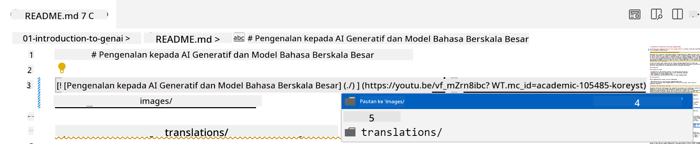
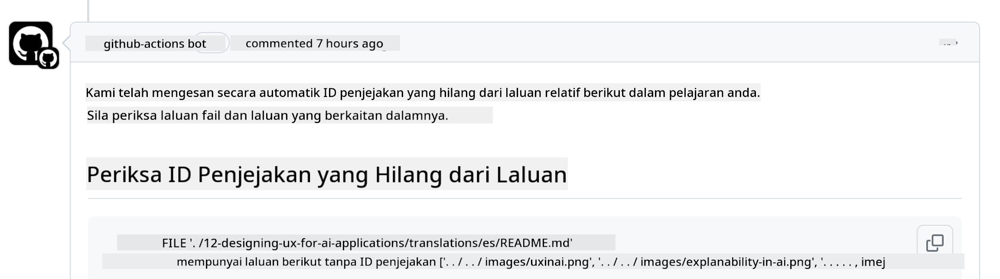
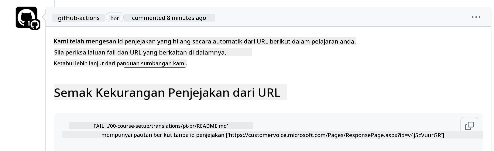
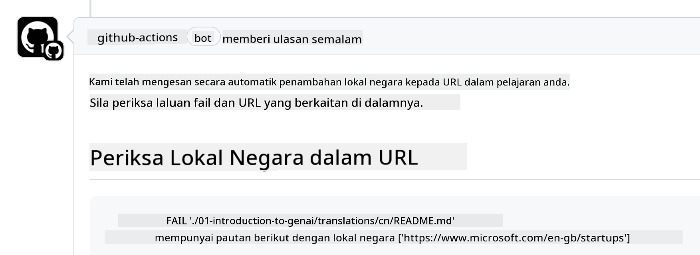

<!--
CO_OP_TRANSLATOR_METADATA:
{
  "original_hash": "57c41f2af71001a2cff9d8eb797cb843",
  "translation_date": "2025-05-19T11:21:27+00:00",
  "source_file": "CONTRIBUTING.md",
  "language_code": "ms"
}
-->
# Menyumbang

Projek ini mengalu-alukan sumbangan dan cadangan. Kebanyakan sumbangan memerlukan anda bersetuju dengan Perjanjian Lesen Penyumbang (CLA) yang mengisytiharkan bahawa anda mempunyai hak untuk, dan sebenarnya memberikan kami hak untuk menggunakan sumbangan anda. Untuk maklumat lanjut, lawati <https://cla.microsoft.com>.

> Penting: apabila menterjemah teks dalam repo ini, sila pastikan anda tidak menggunakan terjemahan mesin. Kami akan mengesahkan terjemahan melalui komuniti, jadi sila hanya sukarela untuk terjemahan dalam bahasa yang anda mahir.

Apabila anda menyerahkan permintaan tarik, CLA-bot akan secara automatik menentukan sama ada anda perlu memberikan CLA dan menghias PR dengan sewajarnya (cth., label, komen). Ikut sahaja arahan yang diberikan oleh bot. Anda hanya perlu melakukannya sekali sahaja di semua repositori yang menggunakan CLA kami.

## Tatakelakuan

Projek ini telah menerima pakai [Tatakelakuan Sumber Terbuka Microsoft](https://opensource.microsoft.com/codeofconduct/?WT.mc_id=academic-105485-koreyst). Untuk maklumat lanjut baca [Soalan Lazim Tatakelakuan](https://opensource.microsoft.com/codeofconduct/faq/?WT.mc_id=academic-105485-koreyst) atau hubungi [opencode@microsoft.com](mailto:opencode@microsoft.com) dengan sebarang soalan atau komen tambahan.

## Soalan atau Masalah?

Sila jangan buka isu GitHub untuk soalan sokongan umum kerana senarai GitHub sepatutnya digunakan untuk permintaan ciri dan laporan pepijat. Dengan cara ini kita boleh menjejaki isu atau pepijat sebenar dari kod dan mengekalkan perbincangan umum berasingan daripada kod sebenar.

## Kesilapan, Isu, Pepijat dan Sumbangan

Setiap kali anda menyerahkan sebarang perubahan kepada repositori Generative AI for Beginners, sila ikuti cadangan ini.

* Sentiasa fork repositori ke akaun anda sendiri sebelum membuat pengubahsuaian
* Jangan gabungkan pelbagai perubahan ke dalam satu permintaan tarik. Sebagai contoh, serahkan sebarang pembetulan pepijat dan kemas kini dokumentasi menggunakan PR berasingan
* Jika permintaan tarik anda menunjukkan konflik gabungan, pastikan untuk mengemas kini main tempatan anda supaya menjadi cermin kepada apa yang ada dalam repositori utama sebelum membuat pengubahsuaian
* Jika anda menyerahkan terjemahan, sila buat satu PR untuk semua fail yang diterjemahkan kerana kami tidak menerima terjemahan separa untuk kandungan
* Jika anda menyerahkan pembetulan kesilapan atau dokumentasi, anda boleh menggabungkan pengubahsuaian ke dalam satu PR di mana sesuai

## Panduan Umum untuk Menulis

- Pastikan semua URL anda dibungkus dalam kurungan siku diikuti dengan tanda kurungan tanpa ruang tambahan di sekelilingnya atau di dalamnya ``.
- Pastikan mana-mana pautan relatif (iaitu pautan ke fail dan folder lain dalam repositori) bermula dengan `./` merujuk kepada fail atau folder yang terletak dalam direktori kerja semasa atau `../` merujuk kepada fail atau folder yang terletak dalam direktori kerja induk.
- Pastikan mana-mana pautan relatif (iaitu pautan ke fail dan folder lain dalam repositori) mempunyai ID penjejakan (iaitu `?` atau `&` kemudian `wt.mc_id=` atau `WT.mc_id=`) di penghujungnya.
- Pastikan mana-mana URL dari domain berikut _github.com, microsoft.com, visualstudio.com, aka.ms, dan azure.com_ mempunyai ID penjejakan (iaitu `?` atau `&` kemudian `wt.mc_id=` atau `WT.mc_id=`) di penghujungnya.
- Pastikan pautan anda tidak mempunyai lokasi khusus negara di dalamnya (iaitu `/en-us/` atau `/en/`).
- Pastikan semua imej disimpan dalam folder `./images`.
- Pastikan imej mempunyai nama deskriptif menggunakan aksara Inggeris, nombor, dan tanda sengkang dalam nama imej anda.

## Aliran Kerja GitHub

Apabila anda menyerahkan permintaan tarik, empat aliran kerja berbeza akan dicetuskan untuk mengesahkan peraturan sebelumnya. Ikut sahaja arahan yang disenaraikan di sini untuk lulus pemeriksaan aliran kerja.

- [Semak Laluan Relatif Rosak](../..)
- [Semak Laluan Ada Penjejakan](../..)
- [Semak URL Ada Penjejakan](../..)
- [Semak URL Tidak Ada Locale](../..)

### Semak Laluan Relatif Rosak

Aliran kerja ini memastikan bahawa mana-mana laluan relatif dalam fail anda berfungsi. Repositori ini digunakan ke halaman GitHub jadi anda perlu berhati-hati apabila menaip pautan yang menghubungkan segala-galanya agar tidak mengarahkan sesiapa ke tempat yang salah.

Untuk memastikan pautan anda berfungsi dengan betul, gunakan sahaja VS code untuk memeriksa.

Sebagai contoh, apabila anda mengarahkan kursor ke atas mana-mana pautan dalam fail anda, anda akan diminta untuk mengikuti pautan dengan menekan **ctrl + klik**

Jika anda mengklik pada pautan dan ia tidak berfungsi secara tempatan, maka, pasti ia akan mencetuskan aliran kerja dan tidak akan berfungsi di GitHub.

Untuk membetulkan masalah ini, cuba taip pautan dengan bantuan VS code.

Apabila anda menaip `./` atau `../` VS code akan meminta anda memilih daripada pilihan yang tersedia mengikut apa yang anda taip.

Ikuti laluan dengan mengklik pada fail atau folder yang dikehendaki dan anda akan pasti bahawa laluan anda tidak rosak.

Setelah anda menambah laluan relatif yang betul, simpan, dan tolak perubahan anda, aliran kerja akan dicetuskan semula untuk mengesahkan perubahan anda. Jika anda lulus pemeriksaan maka anda baik untuk pergi.

### Semak Laluan Ada Penjejakan

Aliran kerja ini memastikan bahawa mana-mana laluan relatif mempunyai penjejakan di dalamnya. Repositori ini digunakan ke halaman GitHub jadi kita perlu menjejaki pergerakan antara fail dan folder yang berbeza.

Untuk memastikan laluan relatif anda mempunyai penjejakan di dalamnya, periksa sahaja teks berikut `?wt.mc_id=` di penghujung laluan. Jika ia ditambah kepada laluan relatif anda maka anda akan lulus pemeriksaan ini.

Jika tidak, anda mungkin mendapat ralat berikut.

Untuk membetulkan masalah ini, cuba buka laluan fail yang diserlahkan oleh aliran kerja dan tambah ID penjejakan ke penghujung laluan relatif.

Setelah anda menambah ID penjejakan, simpan, dan tolak perubahan anda, aliran kerja akan dicetuskan semula untuk mengesahkan perubahan anda. Jika anda lulus pemeriksaan maka anda baik untuk pergi.

### Semak URL Ada Penjejakan

Aliran kerja ini memastikan bahawa mana-mana URL web mempunyai penjejakan di dalamnya. Repositori ini boleh diakses oleh semua orang jadi anda perlu memastikan untuk menjejaki akses untuk mengetahui dari mana trafik datang.

Untuk memastikan URL anda mempunyai penjejakan di dalamnya, periksa sahaja teks berikut `?wt.mc_id=` di penghujung URL. Jika ia ditambah kepada URL anda maka anda akan lulus pemeriksaan ini.

Jika tidak, anda mungkin mendapat ralat berikut.

Untuk membetulkan masalah ini, cuba buka laluan fail yang diserlahkan oleh aliran kerja dan tambah ID penjejakan ke penghujung URL.

Setelah anda menambah ID penjejakan, simpan, dan tolak perubahan anda, aliran kerja akan dicetuskan semula untuk mengesahkan perubahan anda. Jika anda lulus pemeriksaan maka anda baik untuk pergi.

### Semak URL Tidak Ada Locale

Aliran kerja ini memastikan bahawa mana-mana URL web tidak mempunyai lokasi khusus negara di dalamnya. Repositori ini boleh diakses oleh semua orang di seluruh dunia jadi anda perlu memastikan tidak memasukkan lokasi negara anda dalam URL.

Untuk memastikan URL anda tidak mempunyai lokasi negara di dalamnya, periksa sahaja teks berikut `/en-us/` atau `/en/` atau mana-mana lokasi bahasa lain di mana-mana dalam URL. Jika ia tidak hadir dalam URL anda maka anda akan lulus pemeriksaan ini.

Jika tidak, anda mungkin mendapat ralat berikut.

Untuk membetulkan masalah ini, cuba buka laluan fail yang diserlahkan oleh aliran kerja dan keluarkan lokasi negara dari URL.

Setelah anda mengeluarkan lokasi negara, simpan, dan tolak perubahan anda, aliran kerja akan dicetuskan semula untuk mengesahkan perubahan anda. Jika anda lulus pemeriksaan maka anda baik untuk pergi.

Tahniah! Kami akan kembali kepada anda secepat mungkin dengan maklum balas tentang sumbangan anda.

**Penafian**:  
Dokumen ini telah diterjemahkan menggunakan perkhidmatan terjemahan AI [Co-op Translator](https://github.com/Azure/co-op-translator). Walaupun kami berusaha untuk ketepatan, sila maklum bahawa terjemahan automatik mungkin mengandungi kesilapan atau ketidaktepatan. Dokumen asal dalam bahasa asalnya harus dianggap sebagai sumber yang berwibawa. Untuk maklumat kritikal, terjemahan manusia profesional disyorkan. Kami tidak bertanggungjawab atas sebarang salah faham atau salah tafsir yang timbul daripada penggunaan terjemahan ini.