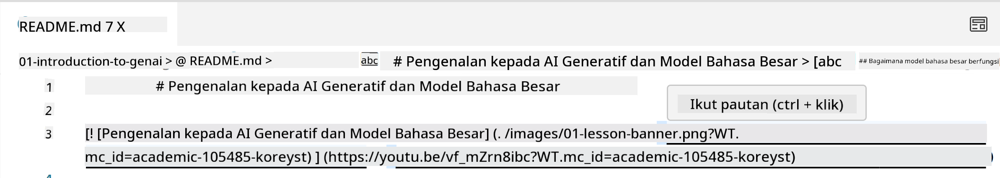
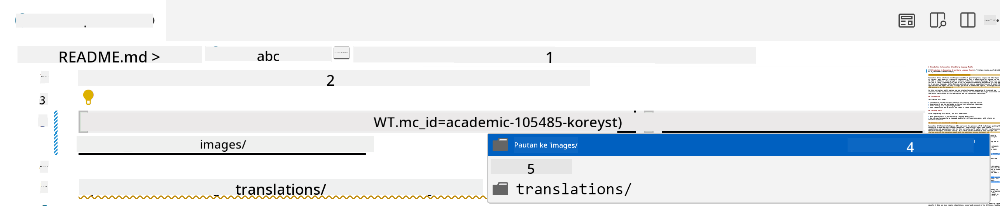
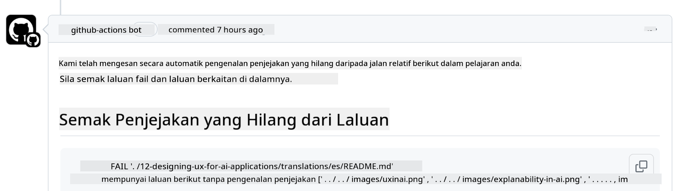
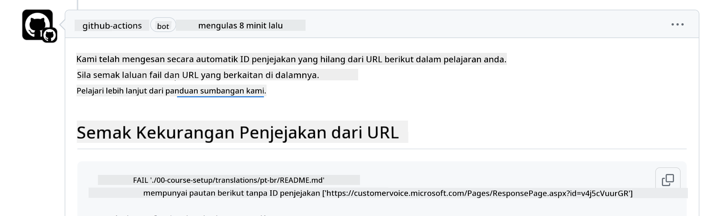
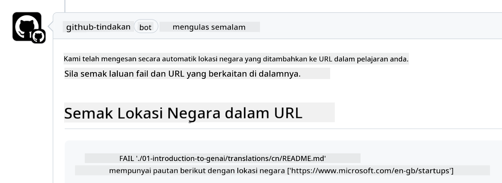

<!--
CO_OP_TRANSLATOR_METADATA:
{
  "original_hash": "57c41f2af71001a2cff9d8eb797cb843",
  "translation_date": "2025-06-25T07:15:59+00:00",
  "source_file": "CONTRIBUTING.md",
  "language_code": "ms"
}
-->
# Menyumbang

Projek ini mengalu-alukan sumbangan dan cadangan. Kebanyakan sumbangan memerlukan anda bersetuju dengan Perjanjian Lesen Penyumbang (CLA) yang menyatakan bahawa anda mempunyai hak, dan benar-benar memberikan kami hak untuk menggunakan sumbangan anda. Untuk maklumat lanjut, lawati <https://cla.microsoft.com>.

> Penting: apabila menterjemah teks dalam repo ini, pastikan anda tidak menggunakan terjemahan mesin. Kami akan mengesahkan terjemahan melalui komuniti, jadi sila hanya menjadi sukarelawan untuk terjemahan dalam bahasa yang anda mahir.

Apabila anda menghantar permintaan tarik, CLA-bot akan secara automatik menentukan sama ada anda perlu menyediakan CLA dan menghias PR dengan sewajarnya (contohnya, label, komen). Ikuti sahaja arahan yang diberikan oleh bot. Anda hanya perlu melakukannya sekali sahaja di semua repositori yang menggunakan CLA kami.

## Kod Etika

Projek ini telah menerima pakai [Kod Etika Sumber Terbuka Microsoft](https://opensource.microsoft.com/codeofconduct/?WT.mc_id=academic-105485-koreyst). Untuk maklumat lanjut, baca [Soalan Lazim Kod Etika](https://opensource.microsoft.com/codeofconduct/faq/?WT.mc_id=academic-105485-koreyst) atau hubungi [opencode@microsoft.com](mailto:opencode@microsoft.com) dengan sebarang soalan atau komen tambahan.

## Soalan atau Masalah?

Sila jangan buka isu GitHub untuk soalan sokongan umum kerana senarai GitHub sepatutnya digunakan untuk permintaan ciri dan laporan pepijat. Dengan cara ini kita dapat menjejak isu sebenar atau pepijat daripada kod dan memisahkan perbincangan umum daripada kod sebenar.

## Kesalahan Ejaan, Isu, Pepijat dan sumbangan

Setiap kali anda menghantar sebarang perubahan kepada repositori Generative AI for Beginners, sila ikut cadangan ini.

* Sentiasa fork repositori ke akaun anda sendiri sebelum membuat pengubahsuaian anda
* Jangan gabungkan pelbagai perubahan kepada satu permintaan tarik. Contohnya, hantar sebarang pembetulan pepijat dan kemas kini dokumentasi menggunakan PR berasingan
* Jika permintaan tarik anda menunjukkan konflik gabungan, pastikan untuk mengemas kini main tempatan anda agar menjadi cermin kepada apa yang ada dalam repositori utama sebelum membuat pengubahsuaian anda
* Jika anda menghantar terjemahan, sila buat satu PR untuk semua fail yang diterjemahkan kerana kami tidak menerima terjemahan separa untuk kandungan
* Jika anda menghantar kesalahan ejaan atau pembetulan dokumentasi, anda boleh menggabungkan pengubahsuaian kepada satu PR jika sesuai

## Panduan Umum untuk Menulis

- Pastikan semua URL anda dibungkus dalam kurungan siku diikuti dengan kurungan dengan tiada ruang tambahan di sekelilingnya atau di dalamnya ``.
- Pastikan sebarang pautan relatif (iaitu pautan ke fail dan folder lain dalam repositori) bermula dengan `./` merujuk kepada fail atau folder yang terletak di direktori kerja semasa atau `../` merujuk kepada fail atau folder yang terletak di direktori kerja ibu bapa.
- Pastikan sebarang pautan relatif (iaitu pautan ke fail dan folder lain dalam repositori) mempunyai ID penjejakan (iaitu `?` atau `&` kemudian `wt.mc_id=` atau `WT.mc_id=`) di hujungnya.
- Pastikan sebarang URL daripada domain berikut _github.com, microsoft.com, visualstudio.com, aka.ms, dan azure.com_ mempunyai ID penjejakan (iaitu `?` atau `&` kemudian `wt.mc_id=` atau `WT.mc_id=`) di hujungnya.
- Pastikan pautan anda tidak mempunyai lokasi khusus negara di dalamnya (iaitu `/en-us/` atau `/en/`).
- Pastikan semua imej disimpan dalam folder `./images`.
- Pastikan imej mempunyai nama yang deskriptif menggunakan aksara Inggeris, nombor, dan tanda sengkang dalam nama imej anda.

## Aliran Kerja GitHub

Apabila anda menghantar permintaan tarik, empat aliran kerja berbeza akan dicetuskan untuk mengesahkan peraturan sebelumnya. Ikuti sahaja arahan yang disenaraikan di sini untuk melepasi pemeriksaan aliran kerja.

- [Semak Laluan Relatif Rosak](../..)
- [Semak Laluan Mempunyai Penjejakan](../..)
- [Semak URL Mempunyai Penjejakan](../..)
- [Semak URL Tidak Mempunyai Lokasi](../..)

### Semak Laluan Relatif Rosak

Aliran kerja ini memastikan sebarang laluan relatif dalam fail anda berfungsi. Repositori ini diterapkan ke halaman GitHub jadi anda perlu berhati-hati apabila menaip pautan yang menghubungkan semuanya agar tidak mengarahkan sesiapa ke tempat yang salah.

Untuk memastikan pautan anda berfungsi dengan betul, gunakan sahaja VS code untuk memeriksa.

Contohnya, apabila anda melayang di atas sebarang pautan dalam fail anda, anda akan diminta untuk mengikuti pautan dengan menekan **ctrl + klik**

Jika anda mengklik pada pautan dan ia tidak berfungsi secara tempatan, maka ia pasti akan mencetuskan aliran kerja dan tidak akan berfungsi di GitHub.

Untuk menyelesaikan masalah ini, cuba taip pautan dengan bantuan VS code.

Apabila anda menaip `./` atau `../`, VS code akan meminta anda memilih daripada pilihan yang tersedia mengikut apa yang anda taip.

Ikuti laluan dengan mengklik pada fail atau folder yang dikehendaki dan anda akan pasti bahawa laluan anda tidak rosak.

Sebaik sahaja anda menambah laluan relatif yang betul, simpan, dan tolak perubahan anda, aliran kerja akan dicetuskan semula untuk mengesahkan perubahan anda. Jika anda melepasi pemeriksaan maka anda boleh meneruskannya.

### Semak Laluan Mempunyai Penjejakan

Aliran kerja ini memastikan sebarang laluan relatif mempunyai penjejakan di dalamnya. Repositori ini diterapkan ke halaman GitHub jadi kita perlu menjejaki pergerakan antara fail dan folder yang berbeza.

Untuk memastikan laluan relatif anda mempunyai penjejakan di dalamnya, periksa sahaja teks berikut `?wt.mc_id=` di hujung laluan. Jika ia ditambah kepada laluan relatif anda, maka anda akan melepasi pemeriksaan ini.

Jika tidak, anda mungkin mendapat ralat berikut.

Untuk menyelesaikan masalah ini, cuba buka laluan fail yang disorot oleh aliran kerja dan tambahkan ID penjejakan ke hujung laluan relatif.

Sebaik sahaja anda menambah ID penjejakan, simpan, dan tolak perubahan anda, aliran kerja akan dicetuskan semula untuk mengesahkan perubahan anda. Jika anda melepasi pemeriksaan maka anda boleh meneruskannya.

### Semak URL Mempunyai Penjejakan

Aliran kerja ini memastikan sebarang URL web mempunyai penjejakan di dalamnya. Repositori ini tersedia untuk semua orang jadi anda perlu memastikan untuk menjejaki akses untuk mengetahui dari mana lalu lintas datang.

Untuk memastikan URL anda mempunyai penjejakan di dalamnya, periksa sahaja teks berikut `?wt.mc_id=` di hujung URL. Jika ia ditambah kepada URL anda, maka anda akan melepasi pemeriksaan ini.

Jika tidak, anda mungkin mendapat ralat berikut.

Untuk menyelesaikan masalah ini, cuba buka laluan fail yang disorot oleh aliran kerja dan tambahkan ID penjejakan ke hujung URL.

Sebaik sahaja anda menambah ID penjejakan, simpan, dan tolak perubahan anda, aliran kerja akan dicetuskan semula untuk mengesahkan perubahan anda. Jika anda melepasi pemeriksaan maka anda boleh meneruskannya.

### Semak URL Tidak Mempunyai Lokasi

Aliran kerja ini memastikan sebarang URL web tidak mempunyai lokasi khusus negara di dalamnya. Repositori ini tersedia untuk semua orang di seluruh dunia jadi anda perlu memastikan tidak memasukkan lokasi negara anda dalam URL.

Untuk memastikan URL anda tidak mempunyai lokasi negara di dalamnya, periksa sahaja teks berikut `/en-us/` atau `/en/` atau sebarang lokasi bahasa lain di mana-mana dalam URL. Jika ia tidak hadir dalam URL anda, maka anda akan melepasi pemeriksaan ini.

Jika tidak, anda mungkin mendapat ralat berikut.

Untuk menyelesaikan masalah ini, cuba buka laluan fail yang disorot oleh aliran kerja dan keluarkan lokasi negara dari URL.

Sebaik sahaja anda mengeluarkan lokasi negara, simpan, dan tolak perubahan anda, aliran kerja akan dicetuskan semula untuk mengesahkan perubahan anda. Jika anda melepasi pemeriksaan maka anda boleh meneruskannya.

Tahniah! Kami akan menghubungi anda secepat mungkin dengan maklum balas tentang sumbangan anda.

**Penafian**:  
Dokumen ini telah diterjemahkan menggunakan perkhidmatan terjemahan AI [Co-op Translator](https://github.com/Azure/co-op-translator). Walaupun kami berusaha untuk ketepatan, sila ambil perhatian bahawa terjemahan automatik mungkin mengandungi kesilapan atau ketidaktepatan. Dokumen asal dalam bahasa asalnya harus dianggap sebagai sumber yang berwibawa. Untuk maklumat penting, terjemahan manusia profesional adalah disyorkan. Kami tidak bertanggungjawab atas sebarang salah faham atau salah tafsir yang timbul daripada penggunaan terjemahan ini.