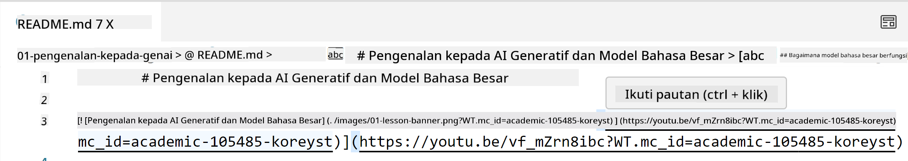
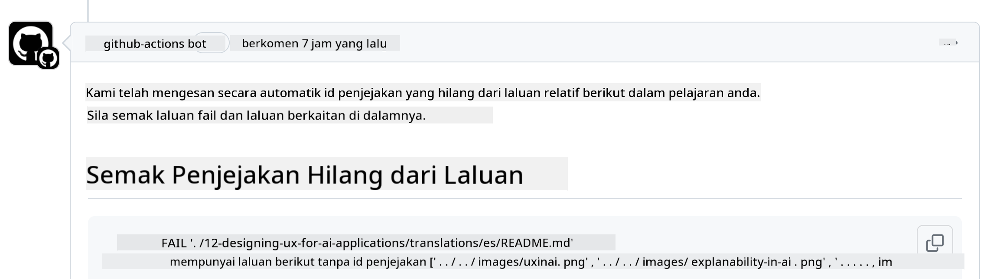
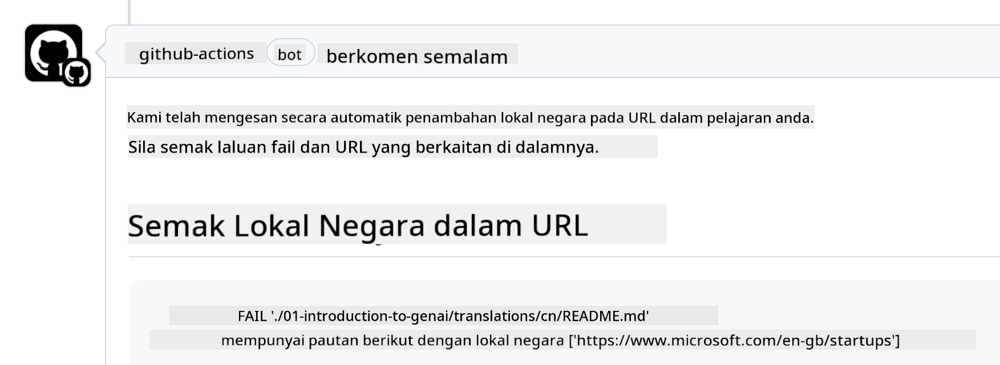

<!--
CO_OP_TRANSLATOR_METADATA:
{
  "original_hash": "57c41f2af71001a2cff9d8eb797cb843",
  "translation_date": "2025-07-09T06:10:20+00:00",
  "source_file": "CONTRIBUTING.md",
  "language_code": "ms"
}
-->
# Menyumbang

Projek ini mengalu-alukan sumbangan dan cadangan. Kebanyakan sumbangan memerlukan anda
bersetuju dengan Perjanjian Lesen Penyumbang (CLA) yang menyatakan bahawa anda mempunyai hak untuk,
dan benar-benar memberikan kami hak untuk menggunakan sumbangan anda. Untuk maklumat lanjut, lawati
<https://cla.microsoft.com>.

> Penting: apabila menterjemah teks dalam repo ini, sila pastikan anda tidak menggunakan terjemahan mesin. Kami akan mengesahkan terjemahan melalui komuniti, jadi sila hanya sukarela untuk terjemahan dalam bahasa yang anda mahir.

Apabila anda menghantar permintaan tarik, CLA-bot akan secara automatik menentukan sama ada anda perlu
menyediakan CLA dan menghias PR dengan sewajarnya (contohnya, label, komen). Ikuti sahaja
arahan yang diberikan oleh bot. Anda hanya perlu melakukan ini sekali sahaja untuk semua repositori yang menggunakan CLA kami.

## Kod Etika

Projek ini telah mengamalkan [Microsoft Open Source Code of Conduct](https://opensource.microsoft.com/codeofconduct/?WT.mc_id=academic-105485-koreyst).
Untuk maklumat lanjut, baca [Soalan Lazim Kod Etika](https://opensource.microsoft.com/codeofconduct/faq/?WT.mc_id=academic-105485-koreyst) atau hubungi [opencode@microsoft.com](mailto:opencode@microsoft.com) untuk sebarang soalan atau komen tambahan.

## Soalan atau Masalah?

Sila jangan buka isu GitHub untuk soalan sokongan umum kerana senarai GitHub sepatutnya digunakan untuk permintaan ciri dan laporan pepijat. Dengan cara ini, kami dapat mengesan isu atau pepijat sebenar dari kod dengan lebih mudah dan memisahkan perbincangan umum daripada kod sebenar.

## Kesalahan Ejaan, Isu, Pepijat dan sumbangan

Setiap kali anda menghantar sebarang perubahan ke repositori Generative AI for Beginners, sila ikut cadangan berikut.

* Sentiasa buat fork repositori ke akaun anda sendiri sebelum membuat pengubahsuaian
* Jangan gabungkan pelbagai perubahan dalam satu permintaan tarik. Contohnya, hantar pembetulan pepijat dan kemas kini dokumentasi menggunakan PR yang berasingan
* Jika permintaan tarik anda menunjukkan konflik penggabungan, pastikan anda mengemas kini main tempatan anda supaya menjadi cermin kepada apa yang ada dalam repositori utama sebelum membuat pengubahsuaian
* Jika anda menghantar terjemahan, sila buat satu PR untuk semua fail yang diterjemah kerana kami tidak menerima terjemahan separa untuk kandungan
* Jika anda menghantar pembetulan ejaan atau dokumentasi, anda boleh gabungkan pengubahsuaian ke dalam satu PR jika sesuai

## Panduan Am untuk penulisan

- Pastikan semua URL anda dibungkus dalam kurungan siku diikuti dengan kurungan bulat tanpa ruang tambahan di sekeliling atau di dalamnya ``.
- Pastikan sebarang pautan relatif (iaitu pautan ke fail dan folder lain dalam repositori) bermula dengan `./` merujuk kepada fail atau folder yang terletak dalam direktori kerja semasa atau `../` merujuk kepada fail atau folder yang terletak dalam direktori kerja induk.
- Pastikan sebarang pautan relatif (iaitu pautan ke fail dan folder lain dalam repositori) mempunyai ID penjejakan (iaitu `?` atau `&` kemudian `wt.mc_id=` atau `WT.mc_id=`) di hujungnya.
- Pastikan sebarang URL dari domain berikut _github.com, microsoft.com, visualstudio.com, aka.ms, dan azure.com_ mempunyai ID penjejakan (iaitu `?` atau `&` kemudian `wt.mc_id=` atau `WT.mc_id=`) di hujungnya.
- Pastikan pautan anda tidak mempunyai lokal khusus negara (iaitu `/en-us/` atau `/en/`).
- Pastikan semua imej disimpan dalam folder `./images`.
- Pastikan imej mempunyai nama yang deskriptif menggunakan aksara Inggeris, nombor, dan tanda sempang dalam nama imej anda.

## Aliran Kerja GitHub

Apabila anda menghantar permintaan tarik, empat aliran kerja berbeza akan dicetuskan untuk mengesahkan peraturan sebelum ini.
Ikuti sahaja arahan yang disenaraikan di sini untuk lulus pemeriksaan aliran kerja.

- [Semak Laluan Relatif Rosak](../..)
- [Semak Laluan Ada Penjejakan](../..)
- [Semak URL Ada Penjejakan](../..)
- [Semak URL Tiada Lokal](../..)

### Semak Laluan Relatif Rosak

Aliran kerja ini memastikan bahawa sebarang laluan relatif dalam fail anda berfungsi.
Repositori ini dideploy ke GitHub pages jadi anda perlu sangat berhati-hati apabila menaip pautan yang menghubungkan semuanya supaya tidak mengarahkan sesiapa ke tempat yang salah.

Untuk memastikan pautan anda berfungsi dengan betul, gunakan VS code untuk memeriksa.

Contohnya, apabila anda mengarahkan kursor ke atas mana-mana pautan dalam fail anda, anda akan diberi pilihan untuk mengikuti pautan dengan menekan **ctrl + klik**

Jika anda klik pada pautan dan ia tidak berfungsi secara tempatan, sudah tentu ia akan mencetuskan aliran kerja dan tidak akan berfungsi di GitHub.

Untuk membetulkan isu ini, cuba taip pautan dengan bantuan VS code.

Apabila anda menaip `./` atau `../` VS code akan memberi pilihan untuk memilih dari pilihan yang tersedia mengikut apa yang anda taip.

Ikuti laluan dengan mengklik pada fail atau folder yang dikehendaki dan anda akan pasti bahawa laluan anda tidak rosak.

Setelah anda menambah laluan relatif yang betul, simpan, dan tolak perubahan anda, aliran kerja akan dicetuskan semula untuk mengesahkan perubahan anda.
Jika anda lulus pemeriksaan, anda boleh teruskan.

### Semak Laluan Ada Penjejakan

Aliran kerja ini memastikan bahawa sebarang laluan relatif mempunyai penjejakan di dalamnya.
Repositori ini dideploy ke GitHub pages jadi kami perlu menjejaki pergerakan antara fail dan folder yang berbeza.

Untuk memastikan laluan relatif anda mempunyai penjejakan, periksa teks berikut `?wt.mc_id=` di hujung laluan.
Jika ia ditambah pada laluan relatif anda, anda akan lulus pemeriksaan ini.

Jika tidak, anda mungkin mendapat ralat berikut.

Untuk membetulkan isu ini, cuba buka laluan fail yang diserlahkan oleh aliran kerja dan tambah ID penjejakan di hujung laluan relatif.

Setelah anda menambah ID penjejakan, simpan, dan tolak perubahan anda, aliran kerja akan dicetuskan semula untuk mengesahkan perubahan anda.
Jika anda lulus pemeriksaan, anda boleh teruskan.

### Semak URL Ada Penjejakan

Aliran kerja ini memastikan bahawa sebarang URL web mempunyai penjejakan di dalamnya.
Repositori ini boleh diakses oleh semua orang jadi anda perlu memastikan untuk menjejaki akses bagi mengetahui dari mana trafik datang.

Untuk memastikan URL anda mempunyai penjejakan, periksa teks berikut `?wt.mc_id=` di hujung URL.
Jika ia ditambah pada URL anda, anda akan lulus pemeriksaan ini.

Jika tidak, anda mungkin mendapat ralat berikut.

Untuk membetulkan isu ini, cuba buka laluan fail yang diserlahkan oleh aliran kerja dan tambah ID penjejakan di hujung URL.

Setelah anda menambah ID penjejakan, simpan, dan tolak perubahan anda, aliran kerja akan dicetuskan semula untuk mengesahkan perubahan anda.
Jika anda lulus pemeriksaan, anda boleh teruskan.

### Semak URL Tiada Lokal

Aliran kerja ini memastikan bahawa sebarang URL web tidak mempunyai lokal khusus negara di dalamnya.
Repositori ini boleh diakses oleh semua orang di seluruh dunia jadi anda perlu pastikan tidak memasukkan lokal negara anda dalam URL.

Untuk memastikan URL anda tidak mempunyai lokal negara, periksa teks berikut `/en-us/` atau `/en/` atau mana-mana lokal bahasa lain di mana-mana dalam URL.
Jika ia tidak ada dalam URL anda, anda akan lulus pemeriksaan ini.

Jika tidak, anda mungkin mendapat ralat berikut.

Untuk membetulkan isu ini, cuba buka laluan fail yang diserlahkan oleh aliran kerja dan keluarkan lokal negara dari URL.

Setelah anda keluarkan lokal negara, simpan, dan tolak perubahan anda, aliran kerja akan dicetuskan semula untuk mengesahkan perubahan anda.
Jika anda lulus pemeriksaan, anda boleh teruskan.

Tahniah! Kami akan menghubungi anda secepat mungkin dengan maklum balas mengenai sumbangan anda.

**Penafian**:  
Dokumen ini telah diterjemahkan menggunakan perkhidmatan terjemahan AI [Co-op Translator](https://github.com/Azure/co-op-translator). Walaupun kami berusaha untuk ketepatan, sila ambil maklum bahawa terjemahan automatik mungkin mengandungi kesilapan atau ketidaktepatan. Dokumen asal dalam bahasa asalnya harus dianggap sebagai sumber yang sahih. Untuk maklumat penting, terjemahan profesional oleh manusia adalah disyorkan. Kami tidak bertanggungjawab atas sebarang salah faham atau salah tafsir yang timbul daripada penggunaan terjemahan ini.