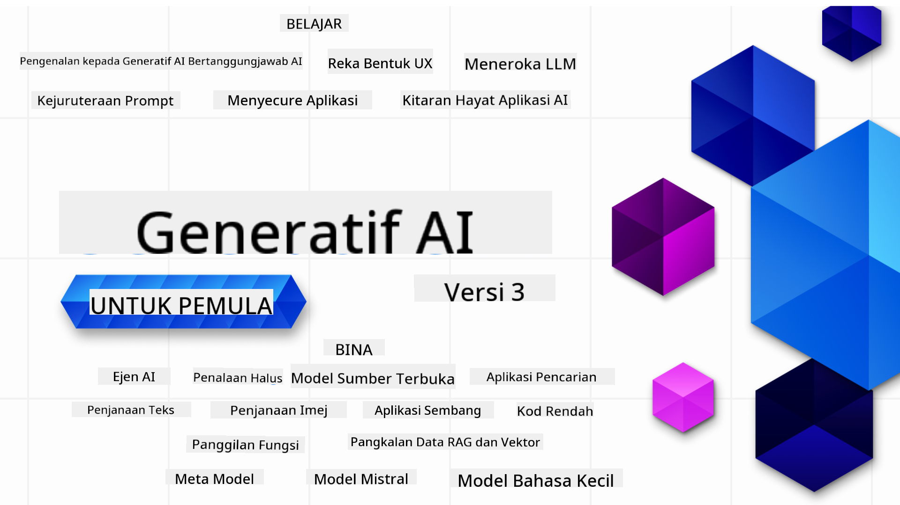

<!--
CO_OP_TRANSLATOR_METADATA:
{
  "original_hash": "c2ee25895ebbfa1a52868bb6eab686fc",
  "translation_date": "2025-05-19T11:54:59+00:00",
  "source_file": "README.md",
  "language_code": "ms"
}
-->

### 21 Pelajaran yang mengajar semua yang anda perlu tahu untuk mula membina aplikasi AI Generatif

### 🌐 Sokongan Pelbagai Bahasa

#### Disokong melalui GitHub Action (Automatik & Sentiasa Terkini)
[Perancis](../fr/README.md) | [Sepanyol](../es/README.md) | [Jerman](../de/README.md) | [Rusia](../ru/README.md) | [Arab](../ar/README.md) | [Parsi (Farsi)](../fa/README.md) | [Urdu](../ur/README.md) | [Cina (Ringkas)](../zh/README.md) | [Cina (Tradisional, Macau)](../mo/README.md) | [Cina (Tradisional, Hong Kong)](../hk/README.md) | [Cina (Tradisional, Taiwan)](../tw/README.md) | [Jepun](../ja/README.md) | [Korea](../ko/README.md) | [Hindi](../hi/README.md) | [Bengali](../bn/README.md) | [Marathi](../mr/README.md) | [Nepali](../ne/README.md) | [Punjabi (Gurmukhi)](../pa/README.md) | [Portugis (Portugal)](../pt/README.md) | [Portugis (Brazil)](../br/README.md) | [Itali](../it/README.md) | [Poland](../pl/README.md) | [Turki](../tr/README.md) | [Yunani](../el/README.md) | [Thai](../th/README.md) | [Sweden](../sv/README.md) | [Denmark](../da/README.md) | [Norway](../no/README.md) | [Finland](../fi/README.md) | [Belanda](../nl/README.md) | [Ibrani](../he/README.md) | [Vietnam](../vi/README.md) | [Indonesia](../id/README.md) | [Melayu](./README.md) | [Tagalog (Filipina)](../tl/README.md) | [Swahili](../sw/README.md) | [Hungary](../hu/README.md) | [Czech](../cs/README.md) | [Slovak](../sk/README.md) | [Romania](../ro/README.md) | [Bulgaria](../bg/README.md) | [Serbia (Cyrillic)](../sr/README.md) | [Croatia](../hr/README.md) | [Slovenia](../sl/README.md)Sila tulis output dari kiri ke kanan.
# AI Generatif untuk Pemula (Versi 3) - Kursus

Pelajari asas membina aplikasi AI Generatif dengan kursus komprehensif 21 pelajaran kami oleh Microsoft Cloud Advocates.

## 🌱 Memulakan

Kursus ini mempunyai 21 pelajaran. Setiap pelajaran merangkumi topik tersendiri, jadi mulakan di mana sahaja anda suka!

Pelajaran dilabel sama ada sebagai pelajaran "Belajar" yang menerangkan konsep AI Generatif atau pelajaran "Bina" yang menerangkan konsep dan contoh kod dalam **Python** dan **TypeScript** bila mungkin.

Untuk pembangun .NET lihat [AI Generatif untuk Pemula (Edisi .NET)](https://github.com/microsoft/Generative-AI-for-beginners-dotnet?WT.mc_id=academic-105485-koreyst)!

Setiap pelajaran juga termasuk bahagian "Terus Belajar" dengan alat pembelajaran tambahan.

## Apa yang Anda Perlukan
### Untuk menjalankan kod kursus ini, anda boleh menggunakan sama ada:
 - [Perkhidmatan Azure OpenAI](https://aka.ms/genai-beginners/azure-open-ai?WT.mc_id=academic-105485-koreyst) - **Pelajaran:** "aoai-assignment"
 - [Katalog Model Pasaran GitHub](https://aka.ms/genai-beginners/gh-models?WT.mc_id=academic-105485-koreyst) - **Pelajaran:** "githubmodels"
 - [API OpenAI](https://aka.ms/genai-beginners/open-ai?WT.mc_id=academic-105485-koreyst) - **Pelajaran:** "oai-assignment"

- Pengetahuan asas tentang Python atau TypeScript adalah berguna - \*Untuk pemula mutlak lihat kursus [Python](https://aka.ms/genai-beginners/python?WT.mc_id=academic-105485-koreyst) dan [TypeScript](https://aka.ms/genai-beginners/typescript?WT.mc_id=academic-105485-koreyst) ini
- Akaun GitHub untuk [fork keseluruhan repo ini](https://aka.ms/genai-beginners/github?WT.mc_id=academic-105485-koreyst) ke akaun GitHub anda sendiri

Kami telah mencipta pelajaran **[Persediaan Kursus](./00-course-setup/README.md?WT.mc_id=academic-105485-koreyst)** untuk membantu anda dengan persediaan persekitaran pembangunan anda.

Jangan lupa untuk [beri bintang (🌟) repo ini](https://docs.github.com/en/get-started/exploring-projects-on-github/saving-repositories-with-stars?WT.mc_id=academic-105485-koreyst) supaya mudah ditemui kemudian.

## 🧠 Sedia untuk Dihantar?

Jika anda mencari contoh kod yang lebih maju, lihat [koleksi Contoh Kod AI Generatif](https://aka.ms/genai-beg-code?WT.mc_id=academic-105485-koreyst) kami dalam **Python** dan **TypeScript**.

## 🗣️ Bertemu Pelajar Lain, Dapatkan Sokongan

Sertai [server Discord Azure AI Foundry rasmi](https://aka.ms/genai-discord?WT.mc_id=academic-105485-koreyst) kami untuk bertemu dan berhubung dengan pelajar lain yang mengikuti kursus ini dan dapatkan sokongan.

Tanya soalan atau kongsi maklum balas produk di [Forum Pembangun Azure AI Foundry](https://aka.ms/azureaifoundry/forum) kami di Github.

## 🚀 Membangun Startup?

Daftar untuk [Microsoft untuk Startups Founders Hub](https://aka.ms/genai-foundershub?WT.mc_id=academic-105485-koreyst) untuk menerima **kredit OpenAI percuma** dan sehingga **$150k untuk kredit Azure untuk mengakses model OpenAI melalui Perkhidmatan Azure OpenAI**.

## 🙏 Ingin membantu?

Adakah anda mempunyai cadangan atau menemui kesalahan ejaan atau kod? [Buat isu](https://github.com/microsoft/generative-ai-for-beginners/issues?WT.mc_id=academic-105485-koreyst) atau [Buat permintaan tarik](https://github.com/microsoft/generative-ai-for-beginners/pulls?WT.mc_id=academic-105485-koreyst)

## 📂 Setiap pelajaran merangkumi:

- Pengenalan video ringkas tentang topik
- Pelajaran bertulis yang terletak dalam README
- Contoh kod Python dan TypeScript yang menyokong Azure OpenAI dan API OpenAI
- Pautan ke sumber tambahan untuk meneruskan pembelajaran anda

## 🗃️ Pelajaran

| #   | **Pautan Pelajaran**                                                                                                                            | **Deskripsi**                                                                                  | **Video**                                                                   | **Pembelajaran Tambahan**                                                         |
| --- | ----------------------------------------------------------------------------------------------------------------------------------------------- | --------------------------------------------------------------------------------------------- | --------------------------------------------------------------------------- | ---------------------------------------------------------------------------------- |
| 00  | [Persediaan Kursus](./00-course-setup/README.md?WT.mc_id=academic-105485-koreyst)                                                               | **Belajar:** Cara Menyediakan Persekitaran Pembangunan Anda                                    | Video Akan Datang                                                             | [Belajar Lebih Lanjut](https://aka.ms/genai-collection?WT.mc_id=academic-105485-koreyst) |
| 01  | [Pengenalan kepada AI Generatif dan LLMs](./01-introduction-to-genai/README.md?WT.mc_id=academic-105485-koreyst)                                | **Belajar:** Memahami apa itu AI Generatif dan bagaimana Model Bahasa Besar (LLMs) berfungsi  | [Video](https://aka.ms/gen-ai-lesson-1-gh?WT.mc_id=academic-105485-koreyst) | [Belajar Lebih Lanjut](https://aka.ms/genai-collection?WT.mc_id=academic-105485-koreyst) |
| 02  | [Meneroka dan membandingkan LLMs yang berbeza](./02-exploring-and-comparing-different-llms/README.md?WT.mc_id=academic-105485-koreyst)          | **Belajar:** Cara memilih model yang tepat untuk kes penggunaan anda                           | [Video](https://aka.ms/gen-ai-lesson2-gh?WT.mc_id=academic-105485-koreyst)  | [Belajar Lebih Lanjut](https://aka.ms/genai-collection?WT.mc_id=academic-105485-koreyst) |
| 03  | [Menggunakan AI Generatif dengan Bertanggungjawab](./03-using-generative-ai-responsibly/README.md?WT.mc_id=academic-105485-koreyst)             | **Belajar:** Cara membina Aplikasi AI Generatif dengan bertanggungjawab                        | [Video](https://aka.ms/gen-ai-lesson3-gh?WT.mc_id=academic-105485-koreyst)  | [Belajar Lebih Lanjut](https://aka.ms/genai-collection?WT.mc_id=academic-105485-koreyst) |
| 04  | [Memahami Asas Kejuruteraan Prompt](./04-prompt-engineering-fundamentals/README.md?WT.mc_id=academic-105485-koreyst)                            | **Belajar:** Amalan Terbaik Kejuruteraan Prompt secara Praktikal                               | [Video](https://aka.ms/gen-ai-lesson4-gh?WT.mc_id=academic-105485-koreyst)  | [Belajar Lebih Lanjut](https://aka.ms/genai-collection?WT.mc_id=academic-105485-koreyst) |
| 05  | [Mencipta Prompt Lanjutan](./05-advanced-prompts/README.md?WT.mc_id=academic-105485-koreyst)                                                | **Belajar:** Cara menerapkan teknik kejuruteraan prompt yang meningkatkan hasil prompt anda. | [Video](https://aka.ms/gen-ai-lesson5-gh?WT.mc_id=academic-105485-koreyst)  | [Ketahui Lebih Lanjut](https://aka.ms/genai-collection?WT.mc_id=academic-105485-koreyst) |
| 06  | [Membina Aplikasi Penjanaan Teks](./06-text-generation-apps/README.md?WT.mc_id=academic-105485-koreyst)                                | **Bina:** Aplikasi penjanaan teks menggunakan Azure OpenAI / OpenAI API                                | [Video](https://aka.ms/gen-ai-lesson6-gh?WT.mc_id=academic-105485-koreyst)  | [Ketahui Lebih Lanjut](https://aka.ms/genai-collection?WT.mc_id=academic-105485-koreyst) |
| 07  | [Membina Aplikasi Sembang](./07-building-chat-applications/README.md?WT.mc_id=academic-105485-koreyst)                                     | **Bina:** Teknik untuk membina dan mengintegrasi aplikasi sembang dengan berkesan.               | [Video](https://aka.ms/gen-ai-lessons7-gh?WT.mc_id=academic-105485-koreyst) | [Ketahui Lebih Lanjut](https://aka.ms/genai-collection?WT.mc_id=academic-105485-koreyst) |
| 08  | [Membina Aplikasi Carian Pangkalan Data Vektor](./08-building-search-applications/README.md?WT.mc_id=academic-105485-koreyst)                        | **Bina:** Aplikasi carian yang menggunakan Embeddings untuk mencari data.                        | [Video](https://aka.ms/gen-ai-lesson8-gh?WT.mc_id=academic-105485-koreyst)  | [Ketahui Lebih Lanjut](https://aka.ms/genai-collection?WT.mc_id=academic-105485-koreyst) |
| 09  | [Membina Aplikasi Penjanaan Imej](./09-building-image-applications/README.md?WT.mc_id=academic-105485-koreyst)                        | **Bina:** Aplikasi penjanaan imej                                                       | [Video](https://aka.ms/gen-ai-lesson9-gh?WT.mc_id=academic-105485-koreyst)  | [Ketahui Lebih Lanjut](https://aka.ms/genai-collection?WT.mc_id=academic-105485-koreyst) |
| 10  | [Membina Aplikasi AI Kod Rendah](./10-building-low-code-ai-applications/README.md?WT.mc_id=academic-105485-koreyst)                       | **Bina:** Aplikasi AI Generatif menggunakan alat Kod Rendah                                     | [Video](https://aka.ms/gen-ai-lesson10-gh?WT.mc_id=academic-105485-koreyst) | [Ketahui Lebih Lanjut](https://aka.ms/genai-collection?WT.mc_id=academic-105485-koreyst) |
| 11  | [Mengintegrasi Aplikasi Luaran dengan Panggilan Fungsi](./11-integrating-with-function-calling/README.md?WT.mc_id=academic-105485-koreyst) | **Bina:** Apakah itu panggilan fungsi dan kegunaannya untuk aplikasi                          | [Video](https://aka.ms/gen-ai-lesson11-gh?WT.mc_id=academic-105485-koreyst) | [Ketahui Lebih Lanjut](https://aka.ms/genai-collection?WT.mc_id=academic-105485-koreyst) |
| 12  | [Mereka Bentuk UX untuk Aplikasi AI](./12-designing-ux-for-ai-applications/README.md?WT.mc_id=academic-105485-koreyst)                         | **Belajar:** Cara menerapkan prinsip reka bentuk UX semasa membangunkan Aplikasi AI Generatif         | [Video](https://aka.ms/gen-ai-lesson12-gh?WT.mc_id=academic-105485-koreyst) | [Ketahui Lebih Lanjut](https://aka.ms/genai-collection?WT.mc_id=academic-105485-koreyst) |
| 13  | [Mengamankan Aplikasi AI Generatif Anda](./13-securing-ai-applications/README.md?WT.mc_id=academic-105485-koreyst)                         | **Belajar:** Ancaman dan risiko kepada sistem AI dan kaedah untuk mengamankan sistem ini.             | [Video](https://aka.ms/gen-ai-lesson13-gh?WT.mc_id=academic-105485-koreyst) | [Ketahui Lebih Lanjut](https://aka.ms/genai-collection?WT.mc_id=academic-105485-koreyst) |
| 14  | [Kitaran Hayat Aplikasi AI Generatif](./14-the-generative-ai-application-lifecycle/README.md?WT.mc_id=academic-105485-koreyst)           | **Belajar:** Alat dan metrik untuk menguruskan Kitaran Hayat LLM dan LLMOps                         | [Video](https://aka.ms/gen-ai-lesson14-gh?WT.mc_id=academic-105485-koreyst) | [Ketahui Lebih Lanjut](https://aka.ms/genai-collection?WT.mc_id=academic-105485-koreyst) |
| 15  | [Retrieval Augmented Generation (RAG) dan Pangkalan Data Vektor](./15-rag-and-vector-databases/README.md?WT.mc_id=academic-105485-koreyst)        | **Bina:** Aplikasi menggunakan RAG Framework untuk mendapatkan embeddings daripada Pangkalan Data Vektor  | [Video](https://aka.ms/gen-ai-lesson15-gh?WT.mc_id=academic-105485-koreyst) | [Ketahui Lebih Lanjut](https://aka.ms/genai-collection?WT.mc_id=academic-105485-koreyst) |
| 16  | [Model Sumber Terbuka dan Hugging Face](./16-open-source-models/README.md?WT.mc_id=academic-105485-koreyst)                                    | **Bina:** Aplikasi menggunakan model sumber terbuka yang tersedia di Hugging Face                    | [Video](https://aka.ms/gen-ai-lesson16-gh?WT.mc_id=academic-105485-koreyst) | [Ketahui Lebih Lanjut](https://aka.ms/genai-collection?WT.mc_id=academic-105485-koreyst) |
| 17  | [Ejen AI](./17-ai-agents/README.md?WT.mc_id=academic-105485-koreyst)                                                                       | **Bina:** Aplikasi menggunakan AI Agent Framework                                           | [Video](https://aka.ms/gen-ai-lesson17-gh?WT.mc_id=academic-105485-koreyst) | [Ketahui Lebih Lanjut](https://aka.ms/genai-collection?WT.mc_id=academic-105485-koreyst) |
| 18  | [Penalaan Halus LLMs](./18-fine-tuning/README.md?WT.mc_id=academic-105485-koreyst)                                                              | **Belajar:** Apa, kenapa dan bagaimana penalaan halus LLMs                                            | [Video](https://aka.ms/gen-ai-lesson18-gh?WT.mc_id=academic-105485-koreyst) | [Ketahui Lebih Lanjut](https://aka.ms/genai-collection?WT.mc_id=academic-105485-koreyst) |
| 19  | [Membina dengan SLMs](./19-slm/README.md?WT.mc_id=academic-105485-koreyst)                                                              | **Belajar:** Kelebihan membina dengan Small Language Models                                            | Video Akan Datang | [Ketahui Lebih Lanjut](https://aka.ms/genai-collection?WT.mc_id=academic-105485-koreyst) |
| 20  | [Membina dengan Model Mistral](./20-mistral/README.md?WT.mc_id=academic-105485-koreyst)                                                              | **Belajar:** Ciri-ciri dan perbezaan Model Keluarga Mistral                                           | Video Akan Datang | [Ketahui Lebih Lanjut](https://aka.ms/genai-collection?WT.mc_id=academic-105485-koreyst) |
| 21  | [Membina dengan Model Meta](./21-meta/README.md?WT.mc_id=academic-105485-koreyst)                                                              | **Belajar:** Ciri-ciri dan perbezaan Model Keluarga Meta                                           | Video Akan Datang | [Ketahui Lebih Lanjut](https://aka.ms/genai-collection?WT.mc_id=academic-105485-koreyst) |

### 🌟 Terima kasih istimewa

Terima kasih istimewa kepada [**John Aziz**](https://www.linkedin.com/in/john0isaac/) kerana mencipta semua GitHub Actions dan workflows

[**Bernhard Merkle**](https://www.linkedin.com/in/bernhard-merkle-738b73/) kerana membuat sumbangan penting kepada setiap pelajaran untuk meningkatkan pengalaman pembelajaran dan kod. 

## 🎒 Kursus Lain

Pasukan kami menghasilkan kursus lain! Lihat:

- [**BARU** Ejen AI untuk Pemula](https://github.com/microsoft/ai-agents-for-beginners?WT.mc_id=academic-105485-koreyst)
- [**BARU** AI Generatif untuk Pemula menggunakan .NET](https://github.com/microsoft/Generative-AI-for-beginners-dotnet?WT.mc_id=academic-105485-koreyst)
- [**BARU** AI Generatif untuk Pemula menggunakan JavaScript](https://aka.ms/genai-js-course?WT.mc_id=academic-105485-koreyst)
- [ML untuk Pemula](https://aka.ms/ml-beginners?WT.mc_id=academic-105485-koreyst)
- [Sains Data untuk Pemula](https://aka.ms/datascience-beginners?WT.mc_id=academic-105485-koreyst)
- [AI untuk Pemula](https://aka.ms/ai-beginners?WT.mc_id=academic-105485-koreyst)
- [Keselamatan Siber untuk Pemula](https://github.com/microsoft/Security-101??WT.mc_id=academic-96948-sayoung)
- [Pembangunan Web untuk Pemula](https://aka.ms/webdev-beginners?WT.mc_id=academic-105485-koreyst)
- [IoT untuk Pemula](https://aka.ms/iot-beginners?WT.mc_id=academic-105485-koreyst)
- [Pembangunan XR untuk Pemula](https://github.com/microsoft/xr-development-for-beginners?WT.mc_id=academic-105485-koreyst)
- [Menguasai GitHub Copilot untuk Pengaturcaraan Berpasangan AI](https://aka.ms/GitHubCopilotAI?WT.mc_id=academic-105485-koreyst)
- [Menguasai GitHub Copilot untuk Pembangun C#/.NET](https://github.com/microsoft/mastering-github-copilot-for-dotnet-csharp-developers?WT.mc_id=academic-105485-koreyst)
- [Pilih Pengembaraan Copilot Anda Sendiri](https://github.com/microsoft/CopilotAdventures?WT.mc_id=academic-105485-koreyst)

**Penafian**:  
Dokumen ini telah diterjemahkan menggunakan perkhidmatan terjemahan AI [Co-op Translator](https://github.com/Azure/co-op-translator). Walaupun kami berusaha untuk memastikan ketepatan, sila ambil perhatian bahawa terjemahan automatik mungkin mengandungi kesilapan atau ketidaktepatan. Dokumen asal dalam bahasa asalnya harus dianggap sebagai sumber berwibawa. Untuk maklumat kritikal, terjemahan manusia profesional adalah disyorkan. Kami tidak bertanggungjawab atas sebarang salah faham atau salah tafsir yang timbul daripada penggunaan terjemahan ini.