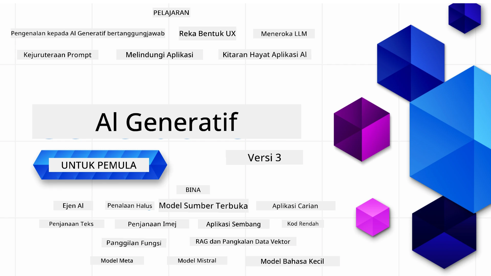

### 21 Pelajaran mengajar segala yang anda perlu tahu untuk mula membina aplikasi Generative AI

[](https://github.com/microsoft/Generative-AI-For-Beginners/blob/master/LICENSE?WT.mc_id=academic-105485-koreyst)
[](https://GitHub.com/microsoft/Generative-AI-For-Beginners/graphs/contributors/?WT.mc_id=academic-105485-koreyst)
[](https://GitHub.com/microsoft/Generative-AI-For-Beginners/issues/?WT.mc_id=academic-105485-koreyst)
[](https://GitHub.com/microsoft/Generative-AI-For-Beginners/pulls/?WT.mc_id=academic-105485-koreyst)
[](http://makeapullrequest.com?WT.mc_id=academic-105485-koreyst)

[](https://GitHub.com/microsoft/Generative-AI-For-Beginners/watchers/?WT.mc_id=academic-105485-koreyst)
[](https://GitHub.com/microsoft/Generative-AI-For-Beginners/network/?WT.mc_id=academic-105485-koreyst)
[](https://GitHub.com/microsoft/Generative-AI-For-Beginners/stargazers/?WT.mc_id=academic-105485-koreyst)

[](https://discord.gg/nTYy5BXMWG)

### 🌐 Sokongan Pelbagai Bahasa

#### Disokong melalui GitHub Action (Automatik & Sentiasa Dikemas Kini)

<!-- CO-OP TRANSLATOR LANGUAGES TABLE START -->
[Arabic](../ar/README.md) | [Bengali](../bn/README.md) | [Bulgarian](../bg/README.md) | [Burmese (Myanmar)](../my/README.md) | [Chinese (Simplified)](../zh-CN/README.md) | [Chinese (Traditional, Hong Kong)](../zh-HK/README.md) | [Chinese (Traditional, Macau)](../zh-MO/README.md) | [Chinese (Traditional, Taiwan)](../zh-TW/README.md) | [Croatian](../hr/README.md) | [Czech](../cs/README.md) | [Danish](../da/README.md) | [Dutch](../nl/README.md) | [Estonian](../et/README.md) | [Finnish](../fi/README.md) | [French](../fr/README.md) | [German](../de/README.md) | [Greek](../el/README.md) | [Hebrew](../he/README.md) | [Hindi](../hi/README.md) | [Hungarian](../hu/README.md) | [Indonesian](../id/README.md) | [Italian](../it/README.md) | [Japanese](../ja/README.md) | [Kannada](../kn/README.md) | [Korean](../ko/README.md) | [Lithuanian](../lt/README.md) | [Malay](./README.md) | [Malayalam](../ml/README.md) | [Marathi](../mr/README.md) | [Nepali](../ne/README.md) | [Nigerian Pidgin](../pcm/README.md) | [Norwegian](../no/README.md) | [Persian (Farsi)](../fa/README.md) | [Polish](../pl/README.md) | [Portuguese (Brazil)](../pt-BR/README.md) | [Portuguese (Portugal)](../pt-PT/README.md) | [Punjabi (Gurmukhi)](../pa/README.md) | [Romanian](../ro/README.md) | [Russian](../ru/README.md) | [Serbian (Cyrillic)](../sr/README.md) | [Slovak](../sk/README.md) | [Slovenian](../sl/README.md) | [Spanish](../es/README.md) | [Swahili](../sw/README.md) | [Swedish](../sv/README.md) | [Tagalog (Filipino)](../tl/README.md) | [Tamil](../ta/README.md) | [Telugu](../te/README.md) | [Thai](../th/README.md) | [Turkish](../tr/README.md) | [Ukrainian](../uk/README.md) | [Urdu](../ur/README.md) | [Vietnamese](../vi/README.md)

> **Lebih suka Klon Secara Tempatan?**

> Repositori ini termasuk lebih 50+ terjemahan bahasa yang secara signifikan meningkatkan saiz muat turun. Untuk klon tanpa terjemahan, gunakan sparse checkout:
> ```bash
> git clone --filter=blob:none --sparse https://github.com/microsoft/generative-ai-for-beginners.git
> cd generative-ai-for-beginners
> git sparse-checkout set --no-cone '/*' '!translations' '!translated_images'
> ```
> Ini memberikan anda semua yang anda perlukan untuk menyelesaikan kursus dengan muat turun yang lebih pantas.
<!-- CO-OP TRANSLATOR LANGUAGES TABLE END -->

# Generative AI untuk Pemula (Versi 3) - Satu Kursus

Pelajari asas-asas membina aplikasi Generative AI dengan kursus komprehensif 21 pelajaran oleh Microsoft Cloud Advocates.

## 🌱 Bermula

Kursus ini mempunyai 21 pelajaran. Setiap pelajaran merangkumi topik sendiri jadi mulakan di mana-mana sahaja yang anda suka!

Pelajaran dilabel sama ada pelajaran "Learn" yang menerangkan konsep Generative AI atau pelajaran "Build" yang menerangkan konsep dan contoh kod dalam kedua-dua **Python** dan **TypeScript** jika boleh.

Untuk Pembangun .NET lihat [Generative AI untuk Pemula (Edisi .NET)](https://github.com/microsoft/Generative-AI-for-beginners-dotnet?WT.mc_id=academic-105485-koreyst)!

Setiap pelajaran juga termasuk seksyen "Keep Learning" dengan alat pembelajaran tambahan.

## Apa Yang Anda Perlu
### Untuk jalankan kod kursus ini, anda boleh gunakan:
 - [Azure OpenAI Service](https://aka.ms/genai-beginners/azure-open-ai?WT.mc_id=academic-105485-koreyst) - **Pelajaran:** "aoai-assignment"
 - [GitHub Marketplace Model Catalog](https://aka.ms/genai-beginners/gh-models?WT.mc_id=academic-105485-koreyst) - **Pelajaran:** "githubmodels"
 - [OpenAI API](https://aka.ms/genai-beginners/open-ai?WT.mc_id=academic-105485-koreyst) - **Pelajaran:** "oai-assignment" 
   
- Pengetahuan asas Python atau TypeScript adalah berguna - \*Untuk pemula mutlak, lihat kursus [Python](https://aka.ms/genai-beginners/python?WT.mc_id=academic-105485-koreyst) dan [TypeScript](https://aka.ms/genai-beginners/typescript?WT.mc_id=academic-105485-koreyst)
- Akaun GitHub untuk [fork seluruh repo ini](https://aka.ms/genai-beginners/github?WT.mc_id=academic-105485-koreyst) ke akaun GitHub anda sendiri

Kami telah membuat pelajaran **[Course Setup](./00-course-setup/README.md?WT.mc_id=academic-105485-koreyst)** untuk membantu anda menyediakan persekitaran pembangunan anda.

Jangan lupa untuk [berbintang (🌟) repo ini](https://docs.github.com/en/get-started/exploring-projects-on-github/saving-repositories-with-stars?WT.mc_id=academic-105485-koreyst) supaya lebih mudah dicari kemudian.

## 🧠 Sedia untuk Deploy?

Jika anda mencari contoh kod yang lebih maju, lihat koleksi kami [Contoh Kod Generative AI](https://aka.ms/genai-beg-code?WT.mc_id=academic-105485-koreyst) dalam kedua-dua **Python** dan **TypeScript**.

## 🗣️ Bertemu Pelajar Lain, Dapatkan Sokongan

Sertai [pelayan Discord rasmi Azure AI Foundry](https://aka.ms/genai-discord?WT.mc_id=academic-105485-koreyst) untuk bertemu dan berjejaring dengan pelajar-pelajar lain yang mengambil kursus ini dan dapatkan sokongan.

Tanya soalan atau kongsi maklum balas produk di [Azure AI Foundry Developer Forum](https://aka.ms/azureaifoundry/forum) di Github.

## 🚀 Membangun Startup?

Lawati [Microsoft for Startups](https://www.microsoft.com/startups) untuk mengetahui cara memulakan membina dengan kredit Azure hari ini.

## 🙏 Mahu membantu?

Adakah anda mempunyai cadangan atau menemui ralat ejaan atau kod? [Laporkan isu](https://github.com/microsoft/generative-ai-for-beginners/issues?WT.mc_id=academic-105485-koreyst) atau [Buat pull request](https://github.com/microsoft/generative-ai-for-beginners/pulls?WT.mc_id=academic-105485-koreyst)

## 📂 Setiap pelajaran termasuk:

- Pengenalan video ringkas kepada topik
- Pelajaran bertulis yang terdapat dalam README
- Contoh kod Python dan TypeScript yang menyokong Azure OpenAI dan OpenAI API
- Pautan kepada sumber tambahan untuk meneruskan pembelajaran anda

## 🗃️ Pelajaran

| #   | **Pautan Pelajaran**                                                                                                                         | **Penerangan**                                                                                 | **Video**                                                                   | **Pembelajaran Tambahan**                                                     |
| --- | ------------------------------------------------------------------------------------------------------------------------------------------- | --------------------------------------------------------------------------------------------- | --------------------------------------------------------------------------- | ------------------------------------------------------------------------------ |
| 00  | [Course Setup](./00-course-setup/README.md?WT.mc_id=academic-105485-koreyst)                                                                  | **Learn:** Cara Menyediakan Persekitaran Pembangunan Anda                                     | Video Akan Datang                                                           | [Ketahui Lebih Lanjut](https://aka.ms/genai-collection?WT.mc_id=academic-105485-koreyst) |
| 01  | [Pengenalan kepada Generative AI dan LLM](./01-introduction-to-genai/README.md?WT.mc_id=academic-105485-koreyst)                              | **Learn:** Memahami apa itu Generative AI dan bagaimana Model Bahasa Besar (LLMs) berfungsi.   | [Video](https://aka.ms/gen-ai-lesson-1-gh?WT.mc_id=academic-105485-koreyst) | [Ketahui Lebih Lanjut](https://aka.ms/genai-collection?WT.mc_id=academic-105485-koreyst) |
| 02  | [Meneroka dan membandingkan LLM berlainan](./02-exploring-and-comparing-different-llms/README.md?WT.mc_id=academic-105485-koreyst)             | **Learn:** Cara memilih model yang betul untuk kes penggunaan anda                            | [Video](https://aka.ms/gen-ai-lesson2-gh?WT.mc_id=academic-105485-koreyst)  | [Ketahui Lebih Lanjut](https://aka.ms/genai-collection?WT.mc_id=academic-105485-koreyst) |
| 03  | [Menggunakan Generative AI secara Bertanggungjawab](./03-using-generative-ai-responsibly/README.md?WT.mc_id=academic-105485-koreyst)           | **Learn:** Cara membina Aplikasi Generative AI secara bertanggungjawab                        | [Video](https://aka.ms/gen-ai-lesson3-gh?WT.mc_id=academic-105485-koreyst)  | [Ketahui Lebih Lanjut](https://aka.ms/genai-collection?WT.mc_id=academic-105485-koreyst) |
| 04  | [Memahami Asas Kejuruteraan Prompt](./04-prompt-engineering-fundamentals/README.md?WT.mc_id=academic-105485-koreyst)             | **Belajar:** Amalan Terbaik Kejuruteraan Prompt Secara Praktikal                              | [Video](https://aka.ms/gen-ai-lesson4-gh?WT.mc_id=academic-105485-koreyst)  | [Ketahui Lebih Lanjut](https://aka.ms/genai-collection?WT.mc_id=academic-105485-koreyst) |
| 05  | [Mewujudkan Prompt Lanjutan](./05-advanced-prompts/README.md?WT.mc_id=academic-105485-koreyst)                                        | **Belajar:** Cara menggunakan teknik kejuruteraan prompt yang meningkatkan hasil prompt anda. | [Video](https://aka.ms/gen-ai-lesson5-gh?WT.mc_id=academic-105485-koreyst)  | [Ketahui Lebih Lanjut](https://aka.ms/genai-collection?WT.mc_id=academic-105485-koreyst) |
| 06  | [Membina Aplikasi Penjanaan Teks](./06-text-generation-apps/README.md?WT.mc_id=academic-105485-koreyst)                              | **Membina:** Aplikasi penjanaan teks menggunakan Azure OpenAI / OpenAI API                    | [Video](https://aka.ms/gen-ai-lesson6-gh?WT.mc_id=academic-105485-koreyst)  | [Ketahui Lebih Lanjut](https://aka.ms/genai-collection?WT.mc_id=academic-105485-koreyst) |
| 07  | [Membina Aplikasi Sembang](./07-building-chat-applications/README.md?WT.mc_id=academic-105485-koreyst)                               | **Membina:** Teknik untuk membina dan menyepadukan aplikasi sembang dengan cekap.            | [Video](https://aka.ms/gen-ai-lessons7-gh?WT.mc_id=academic-105485-koreyst) | [Ketahui Lebih Lanjut](https://aka.ms/genai-collection?WT.mc_id=academic-105485-koreyst) |
| 08  | [Membina Aplikasi Carian Pangkalan Data Vektor](./08-building-search-applications/README.md?WT.mc_id=academic-105485-koreyst)         | **Membina:** Aplikasi carian yang menggunakan Embeddings untuk mencari data.                 | [Video](https://aka.ms/gen-ai-lesson8-gh?WT.mc_id=academic-105485-koreyst)  | [Ketahui Lebih Lanjut](https://aka.ms/genai-collection?WT.mc_id=academic-105485-koreyst) |
| 09  | [Membina Aplikasi Penjanaan Imej](./09-building-image-applications/README.md?WT.mc_id=academic-105485-koreyst)                       | **Membina:** Aplikasi penjanaan imej                                                        | [Video](https://aka.ms/gen-ai-lesson9-gh?WT.mc_id=academic-105485-koreyst)  | [Ketahui Lebih Lanjut](https://aka.ms/genai-collection?WT.mc_id=academic-105485-koreyst) |
| 10  | [Membina Aplikasi AI Kod Rendah](./10-building-low-code-ai-applications/README.md?WT.mc_id=academic-105485-koreyst)                  | **Membina:** Aplikasi AI Generatif menggunakan alat Kod Rendah                              | [Video](https://aka.ms/gen-ai-lesson10-gh?WT.mc_id=academic-105485-koreyst) | [Ketahui Lebih Lanjut](https://aka.ms/genai-collection?WT.mc_id=academic-105485-koreyst) |
| 11  | [Menyepadukan Aplikasi Luaran dengan Panggilan Fungsi](./11-integrating-with-function-calling/README.md?WT.mc_id=academic-105485-koreyst) | **Membina:** Apakah panggilan fungsi dan kegunaannya untuk aplikasi                         | [Video](https://aka.ms/gen-ai-lesson11-gh?WT.mc_id=academic-105485-koreyst) | [Ketahui Lebih Lanjut](https://aka.ms/genai-collection?WT.mc_id=academic-105485-koreyst) |
| 12  | [Reka Bentuk UX untuk Aplikasi AI](./12-designing-ux-for-ai-applications/README.md?WT.mc_id=academic-105485-koreyst)                  | **Belajar:** Cara menerapkan prinsip reka bentuk UX semasa membangunkan Aplikasi AI Generatif| [Video](https://aka.ms/gen-ai-lesson12-gh?WT.mc_id=academic-105485-koreyst) | [Ketahui Lebih Lanjut](https://aka.ms/genai-collection?WT.mc_id=academic-105485-koreyst) |
| 13  | [Mengamankan Aplikasi AI Generatif Anda](./13-securing-ai-applications/README.md?WT.mc_id=academic-105485-koreyst)                   | **Belajar:** Ancaman dan risiko kepada sistem AI serta kaedah untuk mengamankan sistem tersebut.| [Video](https://aka.ms/gen-ai-lesson13-gh?WT.mc_id=academic-105485-koreyst) | [Ketahui Lebih Lanjut](https://aka.ms/genai-collection?WT.mc_id=academic-105485-koreyst) |
| 14  | [Kitaran Hayat Aplikasi AI Generatif](./14-the-generative-ai-application-lifecycle/README.md?WT.mc_id=academic-105485-koreyst)        | **Belajar:** Alat dan metrik untuk mengurus Kitaran Hayat LLM dan LLMOps                     | [Video](https://aka.ms/gen-ai-lesson14-gh?WT.mc_id=academic-105485-koreyst) | [Ketahui Lebih Lanjut](https://aka.ms/genai-collection?WT.mc_id=academic-105485-koreyst) |
| 15  | [Generasi Dipertingkatkan Pemulihan (RAG) dan Pangkalan Data Vektor](./15-rag-and-vector-databases/README.md?WT.mc_id=academic-105485-koreyst) | **Membina:** Aplikasi menggunakan Rangka Kerja RAG untuk mendapatkan embeddings dari Pangkalan Data Vektor | [Video](https://aka.ms/gen-ai-lesson15-gh?WT.mc_id=academic-105485-koreyst) | [Ketahui Lebih Lanjut](https://aka.ms/genai-collection?WT.mc_id=academic-105485-koreyst) |
| 16  | [Model Sumber Terbuka dan Hugging Face](./16-open-source-models/README.md?WT.mc_id=academic-105485-koreyst)                            | **Membina:** Aplikasi menggunakan model sumber terbuka yang tersedia di Hugging Face          | [Video](https://aka.ms/gen-ai-lesson16-gh?WT.mc_id=academic-105485-koreyst) | [Ketahui Lebih Lanjut](https://aka.ms/genai-collection?WT.mc_id=academic-105485-koreyst) |
| 17  | [Ejen AI](./17-ai-agents/README.md?WT.mc_id=academic-105485-koreyst)                                                                    | **Membina:** Aplikasi menggunakan Rangka Kerja Ejen AI                                      | [Video](https://aka.ms/gen-ai-lesson17-gh?WT.mc_id=academic-105485-koreyst) | [Ketahui Lebih Lanjut](https://aka.ms/genai-collection?WT.mc_id=academic-105485-koreyst) |
| 18  | [Melaras LLMs](./18-fine-tuning/README.md?WT.mc_id=academic-105485-koreyst)                                                             | **Belajar:** Apa, mengapa dan bagaimana melaras LLMs                                        | [Video](https://aka.ms/gen-ai-lesson18-gh?WT.mc_id=academic-105485-koreyst) | [Ketahui Lebih Lanjut](https://aka.ms/genai-collection?WT.mc_id=academic-105485-koreyst) |
| 19  | [Membina dengan SLMs](./19-slm/README.md?WT.mc_id=academic-105485-koreyst)                                                              | **Belajar:** Manfaat membina dengan Model Bahasa Kecil                                      | Video Akan Datang | [Ketahui Lebih Lanjut](https://aka.ms/genai-collection?WT.mc_id=academic-105485-koreyst) |
| 20  | [Membina dengan Model Mistral](./20-mistral/README.md?WT.mc_id=academic-105485-koreyst)                                                  | **Belajar:** Ciri-ciri dan perbezaan Model Keluarga Mistral                                 | Video Akan Datang | [Ketahui Lebih Lanjut](https://aka.ms/genai-collection?WT.mc_id=academic-105485-koreyst) |
| 21  | [Membina dengan Model Meta](./21-meta/README.md?WT.mc_id=academic-105485-koreyst)                                                      | **Belajar:** Ciri-ciri dan perbezaan Model Keluarga Meta                                   | Video Akan Datang | [Ketahui Lebih Lanjut](https://aka.ms/genai-collection?WT.mc_id=academic-105485-koreyst) |

### 🌟 Terima kasih istimewa

Terima kasih istimewa kepada [**John Aziz**](https://www.linkedin.com/in/john0isaac/) kerana mencipta semua GitHub Actions dan aliran kerja

[**Bernhard Merkle**](https://www.linkedin.com/in/bernhard-merkle-738b73/) kerana membuat sumbangan penting pada setiap pelajaran untuk meningkatkan pengalaman pembelajaran dan pengekodan.

## 🎒 Kursus Lain

Pasukan kami menghasilkan kursus lain! Lihat:

<!-- CO-OP TRANSLATOR OTHER COURSES START -->
### LangChain
[](https://aka.ms/langchain4j-for-beginners)
[](https://aka.ms/langchainjs-for-beginners?WT.mc_id=m365-94501-dwahlin)

---

### Azure / Edge / MCP / Ejen
[](https://github.com/microsoft/AZD-for-beginners?WT.mc_id=academic-105485-koreyst)
[](https://github.com/microsoft/edgeai-for-beginners?WT.mc_id=academic-105485-koreyst)
[](https://github.com/microsoft/mcp-for-beginners?WT.mc_id=academic-105485-koreyst)
[](https://github.com/microsoft/ai-agents-for-beginners?WT.mc_id=academic-105485-koreyst)

---
 
### Siri AI Generatif
[](https://github.com/microsoft/generative-ai-for-beginners?WT.mc_id=academic-105485-koreyst)
[-9333EA?style=for-the-badge&labelColor=E5E7EB&color=9333EA)](https://github.com/microsoft/Generative-AI-for-beginners-dotnet?WT.mc_id=academic-105485-koreyst)
[-C084FC?style=for-the-badge&labelColor=E5E7EB&color=C084FC)](https://github.com/microsoft/generative-ai-for-beginners-java?WT.mc_id=academic-105485-koreyst)
[-E879F9?style=for-the-badge&labelColor=E5E7EB&color=E879F9)](https://github.com/microsoft/generative-ai-with-javascript?WT.mc_id=academic-105485-koreyst)

---
 
### Pembelajaran Teras
[](https://aka.ms/ml-beginners?WT.mc_id=academic-105485-koreyst)
[](https://aka.ms/datascience-beginners?WT.mc_id=academic-105485-koreyst)
[](https://aka.ms/ai-beginners?WT.mc_id=academic-105485-koreyst)
[](https://github.com/microsoft/Security-101?WT.mc_id=academic-96948-sayoung)
[](https://aka.ms/webdev-beginners?WT.mc_id=academic-105485-koreyst)
[](https://aka.ms/iot-beginners?WT.mc_id=academic-105485-koreyst)
[](https://github.com/microsoft/xr-development-for-beginners?WT.mc_id=academic-105485-koreyst)

---
 
### Siri Copilot
[](https://aka.ms/GitHubCopilotAI?WT.mc_id=academic-105485-koreyst)
[](https://github.com/microsoft/mastering-github-copilot-for-dotnet-csharp-developers?WT.mc_id=academic-105485-koreyst)
[](https://github.com/microsoft/CopilotAdventures?WT.mc_id=academic-105485-koreyst)
<!-- CO-OP TRANSLATOR OTHER COURSES END -->

## Mendapatkan Bantuan

Jika anda tersekat atau mempunyai sebarang soalan mengenai pembangunan aplikasi AI. Sertailah para pelajar dan pembangun berpengalaman dalam perbincangan mengenai MCP. Ia adalah komuniti sokongan di mana soalan dialu-alukan dan ilmu dikongsi dengan bebas.

[](https://discord.gg/nTYy5BXMWG)

Jika anda mempunyai maklum balas produk atau ralat semasa membangun, lawati:

[](https://aka.ms/foundry/forum)

---

<!-- CO-OP TRANSLATOR DISCLAIMER START -->
**Penafian**:  
Dokumen ini telah diterjemahkan menggunakan perkhidmatan terjemahan AI [Co-op Translator](https://github.com/Azure/co-op-translator). Walaupun kami berusaha untuk ketepatan, sila maklum bahawa terjemahan automatik mungkin mengandungi kesilapan atau ketidakakuratan. Dokumen asal dalam bahasa asalnya hendaklah dianggap sebagai sumber rujukan yang sah. Untuk maklumat penting, terjemahan profesional oleh manusia adalah disyorkan. Kami tidak bertanggungjawab terhadap sebarang salah faham atau salah tafsir yang timbul daripada penggunaan terjemahan ini.
<!-- CO-OP TRANSLATOR DISCLAIMER END -->