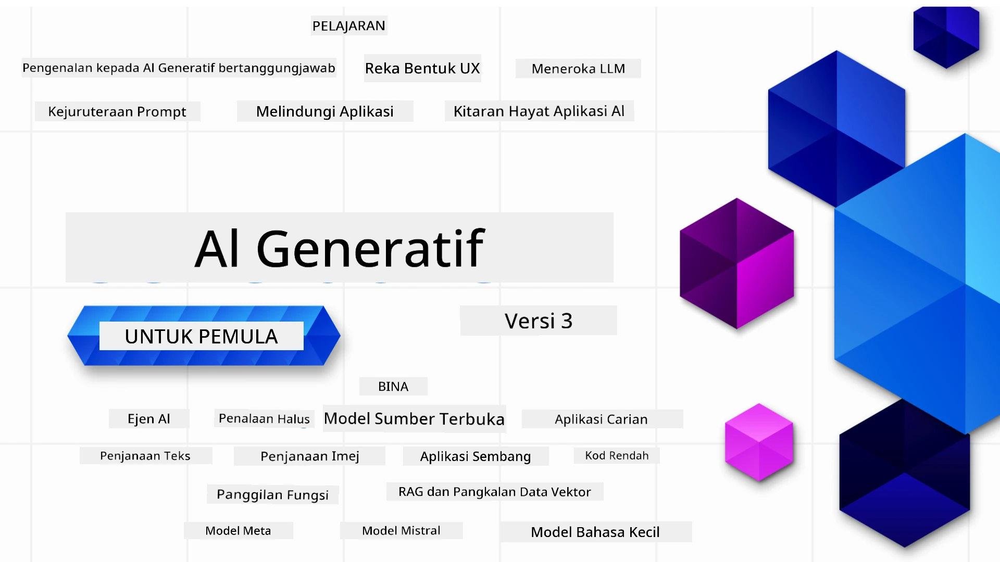

### 21 Pelajaran mengajar segala yang anda perlu tahu untuk mula membina aplikasi Generative AI

[](https://github.com/microsoft/Generative-AI-For-Beginners/blob/master/LICENSE?WT.mc_id=academic-105485-koreyst)
[](https://GitHub.com/microsoft/Generative-AI-For-Beginners/graphs/contributors/?WT.mc_id=academic-105485-koreyst)
[](https://GitHub.com/microsoft/Generative-AI-For-Beginners/issues/?WT.mc_id=academic-105485-koreyst)
[](https://GitHub.com/microsoft/Generative-AI-For-Beginners/pulls/?WT.mc_id=academic-105485-koreyst)
[](http://makeapullrequest.com?WT.mc_id=academic-105485-koreyst)

[](https://GitHub.com/microsoft/Generative-AI-For-Beginners/watchers/?WT.mc_id=academic-105485-koreyst)
[](https://GitHub.com/microsoft/Generative-AI-For-Beginners/network/?WT.mc_id=academic-105485-koreyst)
[](https://GitHub.com/microsoft/Generative-AI-For-Beginners/stargazers/?WT.mc_id=academic-105485-koreyst)

[](https://discord.gg/nTYy5BXMWG)

### 🌐 Sokongan Pelbagai Bahasa

#### Disokong melalui GitHub Action (Automatik & Sentiasa Terkini)

<!-- CO-OP TRANSLATOR LANGUAGES TABLE START -->
[Arab](../ar/README.md) | [Bengali](../bn/README.md) | [Bulgaria](../bg/README.md) | [Burmese (Myanmar)](../my/README.md) | [Cina (Ringkas)](../zh-CN/README.md) | [Cina (Tradisional, Hong Kong)](../zh-HK/README.md) | [Cina (Tradisional, Macau)](../zh-MO/README.md) | [Cina (Tradisional, Taiwan)](../zh-TW/README.md) | [Kroasia](../hr/README.md) | [Czech](../cs/README.md) | [Denmark](../da/README.md) | [Belanda](../nl/README.md) | [Estonia](../et/README.md) | [Finland](../fi/README.md) | [Perancis](../fr/README.md) | [Jerman](../de/README.md) | [Greek](../el/README.md) | [Ibrani](../he/README.md) | [Hindi](../hi/README.md) | [Hungarian](../hu/README.md) | [Indonesia](../id/README.md) | [Itali](../it/README.md) | [Jepun](../ja/README.md) | [Kannada](../kn/README.md) | [Khmer](../km/README.md) | [Korea](../ko/README.md) | [Lithuania](../lt/README.md) | [Melayu](./README.md) | [Malayalam](../ml/README.md) | [Marathi](../mr/README.md) | [Nepali](../ne/README.md) | [Nigerian Pidgin](../pcm/README.md) | [Norwegian](../no/README.md) | [Parsi (Farsi)](../fa/README.md) | [Poland](../pl/README.md) | [Portugis (Brazil)](../pt-BR/README.md) | [Portugis (Portugal)](../pt-PT/README.md) | [Punjabi (Gurmukhi)](../pa/README.md) | [Romania](../ro/README.md) | [Rusia](../ru/README.md) | [Serbia (Cyrillic)](../sr/README.md) | [Slovak](../sk/README.md) | [Slovenian](../sl/README.md) | [Sepanyol](../es/README.md) | [Swahili](../sw/README.md) | [Sweden](../sv/README.md) | [Tagalog (Filipina)](../tl/README.md) | [Tamil](../ta/README.md) | [Telugu](../te/README.md) | [Thai](../th/README.md) | [Turki](../tr/README.md) | [Ukraine](../uk/README.md) | [Urdu](../ur/README.md) | [Vietnam](../vi/README.md)

> **Lebih Suka Klon Tempatan?**
>
> Repositori ini merangkumi lebih 50 terjemahan bahasa yang secara signifikan meningkatkan saiz muat turun. Untuk klon tanpa terjemahan, gunakan sparse checkout:
>
> **Bash / macOS / Linux:**
> ```bash
> git clone --filter=blob:none --sparse https://github.com/microsoft/generative-ai-for-beginners.git
> cd generative-ai-for-beginners
> git sparse-checkout set --no-cone '/*' '!translations' '!translated_images'
> ```
>
> **CMD (Windows):**
> ```cmd
> git clone --filter=blob:none --sparse https://github.com/microsoft/generative-ai-for-beginners.git
> cd generative-ai-for-beginners
> git sparse-checkout set --no-cone "/*" "!translations" "!translated_images"
> ```
>
> Ini memberikan anda segala yang anda perlukan untuk menyelesaikan kursus dengan muat turun yang jauh lebih pantas.
<!-- CO-OP TRANSLATOR LANGUAGES TABLE END -->

# Generative AI untuk Pemula (Versi 3) - Satu Kursus

Pelajari asas-asas membina aplikasi Generative AI dengan kursus komprehensif 21 pelajaran oleh Microsoft Cloud Advocates.

## 🌱 Memulakan

Kursus ini mempunyai 21 pelajaran. Setiap pelajaran merangkumi topik tersendiri jadi mulai dari mana-mana yang anda suka!

Pelajaran dilabel sama ada pelajaran "Belajar" yang menerangkan konsep Generative AI atau pelajaran "Bina" yang menerangkan konsep dan contoh kod dalam kedua-dua **Python** dan **TypeScript** bila boleh.

Untuk Pembangun .NET lihat [Generative AI untuk Pemula (Edisi .NET)](https://github.com/microsoft/Generative-AI-for-beginners-dotnet?WT.mc_id=academic-105485-koreyst)!

Setiap pelajaran juga termasuk bahagian "Terus Belajar" dengan alat pembelajaran tambahan.

## Apa Yang Anda Perlukan
### Untuk menjalankan kod kursus ini, anda boleh menggunakan salah satu: 
 - [Azure OpenAI Service](https://aka.ms/genai-beginners/azure-open-ai?WT.mc_id=academic-105485-koreyst) - **Pelajaran:** "aoai-assignment"
 - [Microsoft Foundry Models](https://ai.azure.com/catalog/models?WT.mc_id=academic-105485-koreyst) - **Pelajaran:** "githubmodels" (GitHub Models akan dihentikan pada akhir Julai 2026 - gunakan Microsoft Foundry Models sebagai gantinya)
 - [OpenAI API](https://aka.ms/genai-beginners/open-ai?WT.mc_id=academic-105485-koreyst) - **Pelajaran:** "oai-assignment" 
 - [Foundry Local](https://foundrylocal.ai?WT.mc_id=academic-105485-koreyst) - Jalankan model sepenuhnya secara offline pada peranti anda sendiri, tiada langganan awan diperlukan
   
- Pengetahuan asas Python atau TypeScript adalah berguna - \*Untuk pemula mutlak cuba kursus [Python](https://aka.ms/genai-beginners/python?WT.mc_id=academic-105485-koreyst) dan [TypeScript](https://aka.ms/genai-beginners/typescript?WT.mc_id=academic-105485-koreyst) ini
- Akaun GitHub untuk [fork semua repo ini](https://aka.ms/genai-beginners/github?WT.mc_id=academic-105485-koreyst) ke akaun GitHub anda sendiri

Kami telah membuat pelajaran **[Persediaan Kursus](./00-course-setup/README.md?WT.mc_id=academic-105485-koreyst)** untuk membantu anda menyediakan persekitaran pembangunan anda.

Jangan lupa untuk [berikan bintang (🌟) pada repo ini](https://docs.github.com/en/get-started/exploring-projects-on-github/saving-repositories-with-stars?WT.mc_id=academic-105485-koreyst) supaya lebih mudah dijumpai kemudian.

## 🧠 Sedia untuk Memasang?

Jika anda mencari contoh kod yang lebih maju, lihat [koleksi Contoh Kod Generative AI kami](https://aka.ms/genai-beg-code?WT.mc_id=academic-105485-koreyst) dalam kedua-dua **Python** dan **TypeScript**.

## 🗣️ Temui Pelajar Lain, Dapatkan Sokongan

Sertai [server Discord rasmi Microsoft Foundry](https://aka.ms/genai-discord?WT.mc_id=academic-105485-koreyst) untuk bertemu dan berhubung dengan pelajar lain yang mengambil kursus ini serta dapatkan sokongan.

Ajukan soalan atau kongsi maklum balas produk di [Forum Pembangun Microsoft Foundry](https://aka.ms/azureaifoundry/forum) di Github.

## 🚀 Membangun Startup?

Lawati [Microsoft for Startups](https://www.microsoft.com/startups) untuk mengetahui cara memulakan pembangunan dengan kredit Azure hari ini.

## 🙏 Mahu membantu?

Ada cadangan atau jumpa kesalahan ejaan atau kod? [Buat isu](https://github.com/microsoft/generative-ai-for-beginners/issues?WT.mc_id=academic-105485-koreyst) atau [Buat permintaan tarik](https://github.com/microsoft/generative-ai-for-beginners/pulls?WT.mc_id=academic-105485-koreyst)

## 📂 Setiap pelajaran termasuk:

- Pengenalan video ringkas kepada topik
- Pelajaran bertulis yang terletak di README
- Contoh kod Python dan TypeScript yang menyokong Azure OpenAI dan OpenAI API
- Pautan kepada sumber tambahan untuk teruskan pembelajaran anda

## 🗃️ Pelajaran

| #   | **Pautan Pelajaran**                                                                                                                              | **Penerangan**                                                                                 | **Video**                                                                   | **Pembelajaran Tambahan**                                                     |
| --- | -------------------------------------------------------------------------------------------------------------------------------------------- | ----------------------------------------------------------------------------------------------- | --------------------------------------------------------------------------- | ------------------------------------------------------------------------------ |
| 00  | [Persediaan Kursus](./00-course-setup/README.md?WT.mc_id=academic-105485-koreyst)                                                                 | **Belajar:** Cara Menyediakan Persekitaran Pembangunan Anda                                     | Video Akan Datang                                                               | [Ketahui Lebih Lanjut](https://aka.ms/genai-collection?WT.mc_id=academic-105485-koreyst) |
| 01  | [Pengenalan kepada Generative AI dan LLM](./01-introduction-to-genai/README.md?WT.mc_id=academic-105485-koreyst)                              | **Belajar:** Memahami apa itu Generative AI dan bagaimana Model Bahasa Besar (LLM) berfungsi    | [Video](https://aka.ms/gen-ai-lesson-1-gh?WT.mc_id=academic-105485-koreyst) | [Ketahui Lebih Lanjut](https://aka.ms/genai-collection?WT.mc_id=academic-105485-koreyst) |
| 02  | [Meneroka dan membandingkan pelbagai LLM](./02-exploring-and-comparing-different-llms/README.md?WT.mc_id=academic-105485-koreyst)             | **Belajar:** Cara memilih model yang sesuai untuk kes penggunaan anda                          | [Video](https://aka.ms/gen-ai-lesson2-gh?WT.mc_id=academic-105485-koreyst)  | [Ketahui Lebih Lanjut](https://aka.ms/genai-collection?WT.mc_id=academic-105485-koreyst) |
| 03  | [Menggunakan Generative AI dengan Bertanggungjawab](./03-using-generative-ai-responsibly/README.md?WT.mc_id=academic-105485-koreyst)           | **Belajar:** Cara membina Aplikasi Generative AI secara bertanggungjawab                      | [Video](https://aka.ms/gen-ai-lesson3-gh?WT.mc_id=academic-105485-koreyst)  | [Ketahui Lebih Lanjut](https://aka.ms/genai-collection?WT.mc_id=academic-105485-koreyst) |

| 04  | [Memahami Asas Kejuruteraan Prompt](./04-prompt-engineering-fundamentals/README.md?WT.mc_id=academic-105485-koreyst)             | **Belajar:** Amalan Terbaik Kejuruteraan Prompt Secara Praktikal                                           | [Video](https://aka.ms/gen-ai-lesson4-gh?WT.mc_id=academic-105485-koreyst)  | [Ketahui Lebih Lanjut](https://aka.ms/genai-collection?WT.mc_id=academic-105485-koreyst) |
| 05  | [Mencipta Prompt Lanjutan](./05-advanced-prompts/README.md?WT.mc_id=academic-105485-koreyst)                                                | **Belajar:** Cara menggunakan teknik kejuruteraan prompt yang meningkatkan hasil prompt anda. | [Video](https://aka.ms/gen-ai-lesson5-gh?WT.mc_id=academic-105485-koreyst)  | [Ketahui Lebih Lanjut](https://aka.ms/genai-collection?WT.mc_id=academic-105485-koreyst) |
| 06  | [Membangun Aplikasi Penjanaan Teks](./06-text-generation-apps/README.md?WT.mc_id=academic-105485-koreyst)                                | **Bina:** Aplikasi penjanaan teks menggunakan Azure OpenAI / OpenAI API                                | [Video](https://aka.ms/gen-ai-lesson6-gh?WT.mc_id=academic-105485-koreyst)  | [Ketahui Lebih Lanjut](https://aka.ms/genai-collection?WT.mc_id=academic-105485-koreyst) |
| 07  | [Membangun Aplikasi Chat](./07-building-chat-applications/README.md?WT.mc_id=academic-105485-koreyst)                                     | **Bina:** Teknik untuk membina dan mengintegrasi aplikasi chat secara cekap.               | [Video](https://aka.ms/gen-ai-lessons7-gh?WT.mc_id=academic-105485-koreyst) | [Ketahui Lebih Lanjut](https://aka.ms/genai-collection?WT.mc_id=academic-105485-koreyst) |
| 08  | [Membangun Aplikasi Carian Pangkalan Data Vektor](./08-building-search-applications/README.md?WT.mc_id=academic-105485-koreyst)                        | **Bina:** Aplikasi carian yang menggunakan Embeddings untuk mencari data.                        | [Video](https://aka.ms/gen-ai-lesson8-gh?WT.mc_id=academic-105485-koreyst)  | [Ketahui Lebih Lanjut](https://aka.ms/genai-collection?WT.mc_id=academic-105485-koreyst) |
| 09  | [Membangun Aplikasi Penjanaan Imej](./09-building-image-applications/README.md?WT.mc_id=academic-105485-koreyst)                        | **Bina:** Aplikasi penjanaan imej                                                       | [Video](https://aka.ms/gen-ai-lesson9-gh?WT.mc_id=academic-105485-koreyst)  | [Ketahui Lebih Lanjut](https://aka.ms/genai-collection?WT.mc_id=academic-105485-koreyst) |
| 10  | [Membangun Aplikasi AI Kod Rendah](./10-building-low-code-ai-applications/README.md?WT.mc_id=academic-105485-koreyst)                       | **Bina:** Aplikasi AI Generatif menggunakan alat Kod Rendah                                     | [Video](https://aka.ms/gen-ai-lesson10-gh?WT.mc_id=academic-105485-koreyst) | [Ketahui Lebih Lanjut](https://aka.ms/genai-collection?WT.mc_id=academic-105485-koreyst) |
| 11  | [Mengintegrasi Aplikasi Luaran dengan Panggilan Fungsi](./11-integrating-with-function-calling/README.md?WT.mc_id=academic-105485-koreyst) | **Bina:** Apa itu panggilan fungsi dan kes penggunaannya untuk aplikasi                          | [Video](https://aka.ms/gen-ai-lesson11-gh?WT.mc_id=academic-105485-koreyst) | [Ketahui Lebih Lanjut](https://aka.ms/genai-collection?WT.mc_id=academic-105485-koreyst) |
| 12  | [Rekabentuk UX untuk Aplikasi AI](./12-designing-ux-for-ai-applications/README.md?WT.mc_id=academic-105485-koreyst)                         | **Belajar:** Cara menggunakan prinsip rekabentuk UX apabila membangunkan Aplikasi AI Generatif         | [Video](https://aka.ms/gen-ai-lesson12-gh?WT.mc_id=academic-105485-koreyst) | [Ketahui Lebih Lanjut](https://aka.ms/genai-collection?WT.mc_id=academic-105485-koreyst) |
| 13  | [Memastikan Keselamatan Aplikasi AI Generatif Anda](./13-securing-ai-applications/README.md?WT.mc_id=academic-105485-koreyst)                         | **Belajar:** Ancaman dan risiko terhadap sistem AI serta kaedah untuk melindungi sistem ini.             | [Video](https://aka.ms/gen-ai-lesson13-gh?WT.mc_id=academic-105485-koreyst) | [Ketahui Lebih Lanjut](https://aka.ms/genai-collection?WT.mc_id=academic-105485-koreyst) |
| 14  | [Kitaran Hayat Aplikasi AI Generatif](./14-the-generative-ai-application-lifecycle/README.md?WT.mc_id=academic-105485-koreyst)           | **Belajar:** Alat dan metrik untuk menguruskan Kitaran Hayat LLM dan LLMOps                         | [Video](https://aka.ms/gen-ai-lesson14-gh?WT.mc_id=academic-105485-koreyst) | [Ketahui Lebih Lanjut](https://aka.ms/genai-collection?WT.mc_id=academic-105485-koreyst) |
| 15  | [Penjanaan Dipertingkatkan dengan Pengambilan (RAG) dan Pangkalan Data Vektor](./15-rag-and-vector-databases/README.md?WT.mc_id=academic-105485-koreyst)        | **Bina:** Aplikasi menggunakan Rangka Kerja RAG untuk mengambil embeddings dari Pangkalan Data Vektor  | [Video](https://aka.ms/gen-ai-lesson15-gh?WT.mc_id=academic-105485-koreyst) | [Ketahui Lebih Lanjut](https://aka.ms/genai-collection?WT.mc_id=academic-105485-koreyst) |
| 16  | [Model Sumber Terbuka dan Hugging Face](./16-open-source-models/README.md?WT.mc_id=academic-105485-koreyst)                                    | **Bina:** Aplikasi menggunakan model sumber terbuka yang terdapat di Hugging Face                    | [Video](https://aka.ms/gen-ai-lesson16-gh?WT.mc_id=academic-105485-koreyst) | [Ketahui Lebih Lanjut](https://aka.ms/genai-collection?WT.mc_id=academic-105485-koreyst) |
| 17  | [Ejen AI](./17-ai-agents/README.md?WT.mc_id=academic-105485-koreyst)                                                                       | **Bina:** Aplikasi menggunakan Rangka Kerja Ejen AI                                           | [Video](https://aka.ms/gen-ai-lesson17-gh?WT.mc_id=academic-105485-koreyst) | [Ketahui Lebih Lanjut](https://aka.ms/genai-collection?WT.mc_id=academic-105485-koreyst) |
| 18  | [Penalaan Halus LLM](./18-fine-tuning/README.md?WT.mc_id=academic-105485-koreyst)                                                              | **Belajar:** Apa, mengapa dan cara penalaan halus LLM                                            | [Video](https://aka.ms/gen-ai-lesson18-gh?WT.mc_id=academic-105485-koreyst) | [Ketahui Lebih Lanjut](https://aka.ms/genai-collection?WT.mc_id=academic-105485-koreyst) |
| 19  | [Membangun dengan SLM](./19-slm/README.md?WT.mc_id=academic-105485-koreyst)                                                              | **Belajar:** Manfaat membina dengan Model Bahasa Kecil                                            | Video Akan Datang | [Ketahui Lebih Lanjut](https://aka.ms/genai-collection?WT.mc_id=academic-105485-koreyst) |
| 20  | [Membangun dengan Model Mistral](./20-mistral/README.md?WT.mc_id=academic-105485-koreyst)                                                              | **Belajar:** Ciri-ciri dan perbezaan Model Keluarga Mistral                                           | Video Akan Datang | [Ketahui Lebih Lanjut](https://aka.ms/genai-collection?WT.mc_id=academic-105485-koreyst) |
| 21  | [Membangun dengan Model Meta](./21-meta/README.md?WT.mc_id=academic-105485-koreyst)                                                              | **Belajar:** Ciri-ciri dan perbezaan Model Keluarga Meta                                           | Video Akan Datang | [Ketahui Lebih Lanjut](https://aka.ms/genai-collection?WT.mc_id=academic-105485-koreyst) |

### 🌟 Terima kasih istimewa

Terima kasih istimewa kepada [**John Aziz**](https://www.linkedin.com/in/john0isaac/) kerana mencipta semua Tindakan GitHub dan aliran kerja

[**Bernhard Merkle**](https://www.linkedin.com/in/bernhard-merkle-738b73/) kerana membuat sumbangan penting pada setiap pelajaran untuk meningkatkan pengalaman pembelajar dan kod. 

## 🎒 Kursus Lain

Pasukan kami menghasilkan kursus lain! Lihat:

<!-- CO-OP TRANSLATOR OTHER COURSES START -->
### LangChain
[](https://aka.ms/langchain4j-for-beginners)
[](https://aka.ms/langchainjs-for-beginners?WT.mc_id=m365-94501-dwahlin)
[](https://github.com/microsoft/langchain-for-beginners?WT.mc_id=m365-94501-dwahlin)
---

### Azure / Edge / MCP / Ejen
[](https://github.com/microsoft/AZD-for-beginners?WT.mc_id=academic-105485-koreyst)
[](https://github.com/microsoft/edgeai-for-beginners?WT.mc_id=academic-105485-koreyst)
[](https://github.com/microsoft/mcp-for-beginners?WT.mc_id=academic-105485-koreyst)
[](https://github.com/microsoft/ai-agents-for-beginners?WT.mc_id=academic-105485-koreyst)

---
 
### Siri AI Generatif
[](https://github.com/microsoft/generative-ai-for-beginners?WT.mc_id=academic-105485-koreyst)
[-9333EA?style=for-the-badge&labelColor=E5E7EB&color=9333EA)](https://github.com/microsoft/Generative-AI-for-beginners-dotnet?WT.mc_id=academic-105485-koreyst)
[-C084FC?style=for-the-badge&labelColor=E5E7EB&color=C084FC)](https://github.com/microsoft/generative-ai-for-beginners-java?WT.mc_id=academic-105485-koreyst)

[-E879F9?style=for-the-badge&labelColor=E5E7EB&color=E879F9)](https://github.com/microsoft/generative-ai-with-javascript?WT.mc_id=academic-105485-koreyst)

---
 
### Pembelajaran Teras
[](https://aka.ms/ml-beginners?WT.mc_id=academic-105485-koreyst)
[](https://aka.ms/datascience-beginners?WT.mc_id=academic-105485-koreyst)
[](https://aka.ms/ai-beginners?WT.mc_id=academic-105485-koreyst)
[](https://github.com/microsoft/Security-101?WT.mc_id=academic-96948-sayoung)
[](https://aka.ms/webdev-beginners?WT.mc_id=academic-105485-koreyst)
[](https://aka.ms/iot-beginners?WT.mc_id=academic-105485-koreyst)
[](https://github.com/microsoft/xr-development-for-beginners?WT.mc_id=academic-105485-koreyst)

---
 
### Siri Copilot
[](https://aka.ms/GitHubCopilotAI?WT.mc_id=academic-105485-koreyst)
[](https://github.com/microsoft/mastering-github-copilot-for-dotnet-csharp-developers?WT.mc_id=academic-105485-koreyst)
[](https://github.com/microsoft/CopilotAdventures?WT.mc_id=academic-105485-koreyst)
<!-- CO-OP TRANSLATOR OTHER COURSES END -->

## Mendapatkan Bantuan

Jika anda tersekat atau mempunyai soalan tentang membina aplikasi AI. Sertai para pelajar dan pembangun berpengalaman dalam perbincangan tentang MCP. Ia adalah komuniti sokongan di mana soalan dialu-alukan dan pengetahuan dikongsi dengan bebas.

[](https://discord.gg/nTYy5BXMWG)

Jika anda mempunyai maklum balas produk atau ralat semasa membina lawati:

[](https://aka.ms/foundry/forum)

---

<!-- CO-OP TRANSLATOR DISCLAIMER START -->
**Penafian**:
Dokumen ini telah diterjemahkan menggunakan perkhidmatan terjemahan AI [Co-op Translator](https://github.com/Azure/co-op-translator). Walaupun kami berusaha untuk ketepatan, sila ambil maklum bahawa terjemahan automatik mungkin mengandungi kesilapan atau ketidaktepatan. Dokumen asal dalam bahasa asalnya harus dianggap sebagai sumber yang sahih. Untuk maklumat penting, terjemahan oleh manusia profesional adalah disyorkan. Kami tidak bertanggungjawab terhadap sebarang salah faham atau salah tafsir yang timbul daripada penggunaan terjemahan ini.
<!-- CO-OP TRANSLATOR DISCLAIMER END -->