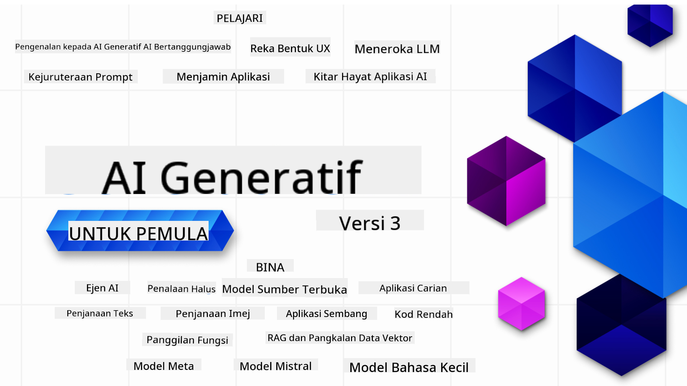

<!--
CO_OP_TRANSLATOR_METADATA:
{
  "original_hash": "5b8a98d103818ddf6f3a41f119738b24",
  "translation_date": "2025-10-24T10:14:15+00:00",
  "source_file": "README.md",
  "language_code": "ms"
}
-->

### 21 Pelajaran yang mengajar semua yang anda perlu tahu untuk mula membina aplikasi Generative AI

### 🌐 Sokongan Pelbagai Bahasa

#### Disokong melalui GitHub Action (Automatik & Sentiasa Terkini)

<!-- CO-OP TRANSLATOR LANGUAGES TABLE START -->
[Arab](../ar/README.md) | [Bengali](../bn/README.md) | [Bulgaria](../bg/README.md) | [Burma (Myanmar)](../my/README.md) | [Cina (Ringkas)](../zh/README.md) | [Cina (Tradisional, Hong Kong)](../hk/README.md) | [Cina (Tradisional, Macau)](../mo/README.md) | [Cina (Tradisional, Taiwan)](../tw/README.md) | [Croatia](../hr/README.md) | [Czech](../cs/README.md) | [Denmark](../da/README.md) | [Belanda](../nl/README.md) | [Estonia](../et/README.md) | [Finland](../fi/README.md) | [Perancis](../fr/README.md) | [Jerman](../de/README.md) | [Greek](../el/README.md) | [Ibrani](../he/README.md) | [Hindi](../hi/README.md) | [Hungary](../hu/README.md) | [Indonesia](../id/README.md) | [Itali](../it/README.md) | [Jepun](../ja/README.md) | [Korea](../ko/README.md) | [Lithuania](../lt/README.md) | [Melayu](./README.md) | [Marathi](../mr/README.md) | [Nepal](../ne/README.md) | [Norway](../no/README.md) | [Parsi (Farsi)](../fa/README.md) | [Poland](../pl/README.md) | [Portugis (Brazil)](../br/README.md) | [Portugis (Portugal)](../pt/README.md) | [Punjabi (Gurmukhi)](../pa/README.md) | [Romania](../ro/README.md) | [Rusia](../ru/README.md) | [Serbia (Cyrillic)](../sr/README.md) | [Slovak](../sk/README.md) | [Slovenia](../sl/README.md) | [Sepanyol](../es/README.md) | [Swahili](../sw/README.md) | [Sweden](../sv/README.md) | [Tagalog (Filipina)](../tl/README.md) | [Tamil](../ta/README.md) | [Thai](../th/README.md) | [Turki](../tr/README.md) | [Ukraine](../uk/README.md) | [Urdu](../ur/README.md) | [Vietnam](../vi/README.md)
<!-- CO-OP TRANSLATOR LANGUAGES TABLE END -->

# Generative AI untuk Pemula (Versi 3) - Satu Kursus

Belajar asas membina aplikasi Generative AI dengan kursus 21 pelajaran komprehensif kami oleh Microsoft Cloud Advocates.

## 🌱 Bermula

Kursus ini mempunyai 21 pelajaran. Setiap pelajaran meliputi topik tersendiri, jadi anda boleh mula di mana-mana sahaja yang anda suka!

Pelajaran dilabelkan sama ada sebagai pelajaran "Learn" yang menerangkan konsep Generative AI atau pelajaran "Build" yang menerangkan konsep dan contoh kod dalam **Python** dan **TypeScript** jika boleh.

Untuk pembangun .NET, lihat [Generative AI untuk Pemula (Edisi .NET)](https://github.com/microsoft/Generative-AI-for-beginners-dotnet?WT.mc_id=academic-105485-koreyst)!

Setiap pelajaran juga termasuk bahagian "Keep Learning" dengan alat pembelajaran tambahan.

## Apa yang Anda Perlukan
### Untuk menjalankan kod kursus ini, anda boleh menggunakan sama ada: 
 - [Azure OpenAI Service](https://aka.ms/genai-beginners/azure-open-ai?WT.mc_id=academic-105485-koreyst) - **Pelajaran:** "aoai-assignment"
 - [GitHub Marketplace Model Catalog](https://aka.ms/genai-beginners/gh-models?WT.mc_id=academic-105485-koreyst) - **Pelajaran:** "githubmodels"
 - [OpenAI API](https://aka.ms/genai-beginners/open-ai?WT.mc_id=academic-105485-koreyst) - **Pelajaran:** "oai-assignment" 
   
- Pengetahuan asas tentang Python atau TypeScript adalah berguna - \*Untuk pemula mutlak, lihat kursus [Python](https://aka.ms/genai-beginners/python?WT.mc_id=academic-105485-koreyst) dan [TypeScript](https://aka.ms/genai-beginners/typescript?WT.mc_id=academic-105485-koreyst) ini
- Akaun GitHub untuk [fork keseluruhan repo ini](https://aka.ms/genai-beginners/github?WT.mc_id=academic-105485-koreyst) ke akaun GitHub anda sendiri

Kami telah mencipta pelajaran **[Course Setup](./00-course-setup/README.md?WT.mc_id=academic-105485-koreyst)** untuk membantu anda menyediakan persekitaran pembangunan anda.

Jangan lupa untuk [bintang (🌟) repo ini](https://docs.github.com/en/get-started/exploring-projects-on-github/saving-repositories-with-stars?WT.mc_id=academic-105485-koreyst) supaya mudah dijumpai kemudian.

## 🧠 Sedia untuk Diterapkan?

Jika anda mencari contoh kod yang lebih maju, lihat [koleksi Contoh Kod Generative AI](https://aka.ms/genai-beg-code?WT.mc_id=academic-105485-koreyst) kami dalam **Python** dan **TypeScript**.

## 🗣️ Temui Pelajar Lain, Dapatkan Sokongan

Sertai [pelayan Discord rasmi Azure AI Foundry](https://aka.ms/genai-discord?WT.mc_id=academic-105485-koreyst) kami untuk bertemu dan berhubung dengan pelajar lain yang mengambil kursus ini dan mendapatkan sokongan.

Ajukan soalan atau kongsi maklum balas produk di [Forum Pembangun Azure AI Foundry](https://aka.ms/azureaifoundry/forum) kami di Github.

## 🚀 Membina Startup?

Lawati [Microsoft for Startups](https://www.microsoft.com/startups) untuk mengetahui cara memulakan pembinaan dengan kredit Azure hari ini.

## 🙏 Mahu membantu?

Adakah anda mempunyai cadangan atau menemui kesalahan ejaan atau kod? [Buat isu](https://github.com/microsoft/generative-ai-for-beginners/issues?WT.mc_id=academic-105485-koreyst) atau [Cipta permintaan tarik](https://github.com/microsoft/generative-ai-for-beginners/pulls?WT.mc_id=academic-105485-koreyst)

## 📂 Setiap pelajaran termasuk:

- Video pengenalan ringkas kepada topik
- Pelajaran bertulis yang terletak dalam README
- Contoh kod Python dan TypeScript yang menyokong Azure OpenAI dan OpenAI API
- Pautan ke sumber tambahan untuk meneruskan pembelajaran anda

## 🗃️ Pelajaran

| #   | **Pautan Pelajaran**                                                                                                                         | **Penerangan**                                                                                  | **Video**                                                                   | **Pembelajaran Tambahan**                                                      |
| --- | -------------------------------------------------------------------------------------------------------------------------------------------- | ----------------------------------------------------------------------------------------------- | --------------------------------------------------------------------------- | ------------------------------------------------------------------------------ |
| 00  | [Course Setup](./00-course-setup/README.md?WT.mc_id=academic-105485-koreyst)                                                                 | **Learn:** Cara Menyediakan Persekitaran Pembangunan Anda                                       | Video Akan Datang                                                                 | [Learn More](https://aka.ms/genai-collection?WT.mc_id=academic-105485-koreyst) |
| 01  | [Pengenalan kepada Generative AI dan LLMs](./01-introduction-to-genai/README.md?WT.mc_id=academic-105485-koreyst)                            | **Learn:** Memahami apa itu Generative AI dan bagaimana Large Language Models (LLMs) berfungsi. | [Video](https://aka.ms/gen-ai-lesson-1-gh?WT.mc_id=academic-105485-koreyst) | [Learn More](https://aka.ms/genai-collection?WT.mc_id=academic-105485-koreyst) |
| 02  | [Meneroka dan membandingkan LLMs yang berbeza](./02-exploring-and-comparing-different-llms/README.md?WT.mc_id=academic-105485-koreyst)       | **Learn:** Cara memilih model yang sesuai untuk kes penggunaan anda                             | [Video](https://aka.ms/gen-ai-lesson2-gh?WT.mc_id=academic-105485-koreyst)  | [Learn More](https://aka.ms/genai-collection?WT.mc_id=academic-105485-koreyst) |
| 03  | [Menggunakan Generative AI Secara Bertanggungjawab](./03-using-generative-ai-responsibly/README.md?WT.mc_id=academic-105485-koreyst)         | **Learn:** Cara membina Aplikasi Generative AI secara bertanggungjawab                          | [Video](https://aka.ms/gen-ai-lesson3-gh?WT.mc_id=academic-105485-koreyst)  | [Learn More](https://aka.ms/genai-collection?WT.mc_id=academic-105485-koreyst) |
| 04  | [Memahami Asas Kejuruteraan Prompt](./04-prompt-engineering-fundamentals/README.md?WT.mc_id=academic-105485-koreyst)                         | **Learn:** Amalan Terbaik Kejuruteraan Prompt Secara Praktikal                                  | [Video](https://aka.ms/gen-ai-lesson4-gh?WT.mc_id=academic-105485-koreyst)  | [Learn More](https://aka.ms/genai-collection?WT.mc_id=academic-105485-koreyst) |
| 05  | [Mencipta Prompt Lanjutan](./05-advanced-prompts/README.md?WT.mc_id=academic-105485-koreyst)                                                 | **Learn:** Cara menerapkan teknik kejuruteraan prompt yang meningkatkan hasil prompt anda.      | [Video](https://aka.ms/gen-ai-lesson5-gh?WT.mc_id=academic-105485-koreyst)  | [Learn More](https://aka.ms/genai-collection?WT.mc_id=academic-105485-koreyst) |
| 06  | [Membina Aplikasi Penjanaan Teks](./06-text-generation-apps/README.md?WT.mc_id=academic-105485-koreyst)                                | **Bina:** Aplikasi penjanaan teks menggunakan Azure OpenAI / OpenAI API                                | [Video](https://aka.ms/gen-ai-lesson6-gh?WT.mc_id=academic-105485-koreyst)  | [Ketahui Lebih Lanjut](https://aka.ms/genai-collection?WT.mc_id=academic-105485-koreyst) |
| 07  | [Membina Aplikasi Chat](./07-building-chat-applications/README.md?WT.mc_id=academic-105485-koreyst)                                     | **Bina:** Teknik untuk membina dan mengintegrasikan aplikasi chat dengan cekap.               | [Video](https://aka.ms/gen-ai-lessons7-gh?WT.mc_id=academic-105485-koreyst) | [Ketahui Lebih Lanjut](https://aka.ms/genai-collection?WT.mc_id=academic-105485-koreyst) |
| 08  | [Membina Aplikasi Carian dengan Pangkalan Data Vektor](./08-building-search-applications/README.md?WT.mc_id=academic-105485-koreyst)                        | **Bina:** Aplikasi carian yang menggunakan Embeddings untuk mencari data.                        | [Video](https://aka.ms/gen-ai-lesson8-gh?WT.mc_id=academic-105485-koreyst)  | [Ketahui Lebih Lanjut](https://aka.ms/genai-collection?WT.mc_id=academic-105485-koreyst) |
| 09  | [Membina Aplikasi Penjanaan Imej](./09-building-image-applications/README.md?WT.mc_id=academic-105485-koreyst)                        | **Bina:** Aplikasi penjanaan imej                                                       | [Video](https://aka.ms/gen-ai-lesson9-gh?WT.mc_id=academic-105485-koreyst)  | [Ketahui Lebih Lanjut](https://aka.ms/genai-collection?WT.mc_id=academic-105485-koreyst) |
| 10  | [Membina Aplikasi AI Kod Rendah](./10-building-low-code-ai-applications/README.md?WT.mc_id=academic-105485-koreyst)                       | **Bina:** Aplikasi AI Generatif menggunakan alat Kod Rendah                                     | [Video](https://aka.ms/gen-ai-lesson10-gh?WT.mc_id=academic-105485-koreyst) | [Ketahui Lebih Lanjut](https://aka.ms/genai-collection?WT.mc_id=academic-105485-koreyst) |
| 11  | [Mengintegrasikan Aplikasi Luaran dengan Panggilan Fungsi](./11-integrating-with-function-calling/README.md?WT.mc_id=academic-105485-koreyst) | **Bina:** Apa itu panggilan fungsi dan kes penggunaannya untuk aplikasi                          | [Video](https://aka.ms/gen-ai-lesson11-gh?WT.mc_id=academic-105485-koreyst) | [Ketahui Lebih Lanjut](https://aka.ms/genai-collection?WT.mc_id=academic-105485-koreyst) |
| 12  | [Mereka Bentuk UX untuk Aplikasi AI](./12-designing-ux-for-ai-applications/README.md?WT.mc_id=academic-105485-koreyst)                         | **Belajar:** Cara menerapkan prinsip reka bentuk UX semasa membangunkan Aplikasi AI Generatif         | [Video](https://aka.ms/gen-ai-lesson12-gh?WT.mc_id=academic-105485-koreyst) | [Ketahui Lebih Lanjut](https://aka.ms/genai-collection?WT.mc_id=academic-105485-koreyst) |
| 13  | [Melindungi Aplikasi AI Generatif Anda](./13-securing-ai-applications/README.md?WT.mc_id=academic-105485-koreyst)                         | **Belajar:** Ancaman dan risiko kepada sistem AI serta kaedah untuk melindungi sistem ini.             | [Video](https://aka.ms/gen-ai-lesson13-gh?WT.mc_id=academic-105485-koreyst) | [Ketahui Lebih Lanjut](https://aka.ms/genai-collection?WT.mc_id=academic-105485-koreyst) |
| 14  | [Kitaran Hayat Aplikasi AI Generatif](./14-the-generative-ai-application-lifecycle/README.md?WT.mc_id=academic-105485-koreyst)           | **Belajar:** Alat dan metrik untuk menguruskan Kitaran Hayat LLM dan LLMOps                         | [Video](https://aka.ms/gen-ai-lesson14-gh?WT.mc_id=academic-105485-koreyst) | [Ketahui Lebih Lanjut](https://aka.ms/genai-collection?WT.mc_id=academic-105485-koreyst) |
| 15  | [Retrieval Augmented Generation (RAG) dan Pangkalan Data Vektor](./15-rag-and-vector-databases/README.md?WT.mc_id=academic-105485-koreyst)        | **Bina:** Aplikasi menggunakan RAG Framework untuk mendapatkan embeddings daripada Pangkalan Data Vektor  | [Video](https://aka.ms/gen-ai-lesson15-gh?WT.mc_id=academic-105485-koreyst) | [Ketahui Lebih Lanjut](https://aka.ms/genai-collection?WT.mc_id=academic-105485-koreyst) |
| 16  | [Model Sumber Terbuka dan Hugging Face](./16-open-source-models/README.md?WT.mc_id=academic-105485-koreyst)                                    | **Bina:** Aplikasi menggunakan model sumber terbuka yang tersedia di Hugging Face                    | [Video](https://aka.ms/gen-ai-lesson16-gh?WT.mc_id=academic-105485-koreyst) | [Ketahui Lebih Lanjut](https://aka.ms/genai-collection?WT.mc_id=academic-105485-koreyst) |
| 17  | [Ejen AI](./17-ai-agents/README.md?WT.mc_id=academic-105485-koreyst)                                                                       | **Bina:** Aplikasi menggunakan Framework Ejen AI                                           | [Video](https://aka.ms/gen-ai-lesson17-gh?WT.mc_id=academic-105485-koreyst) | [Ketahui Lebih Lanjut](https://aka.ms/genai-collection?WT.mc_id=academic-105485-koreyst) |
| 18  | [Fine-Tuning LLMs](./18-fine-tuning/README.md?WT.mc_id=academic-105485-koreyst)                                                              | **Belajar:** Apa, mengapa dan bagaimana untuk fine-tuning LLMs                                            | [Video](https://aka.ms/gen-ai-lesson18-gh?WT.mc_id=academic-105485-koreyst) | [Ketahui Lebih Lanjut](https://aka.ms/genai-collection?WT.mc_id=academic-105485-koreyst) |
| 19  | [Membina dengan SLMs](./19-slm/README.md?WT.mc_id=academic-105485-koreyst)                                                              | **Belajar:** Kelebihan membina dengan Model Bahasa Kecil                                            | Video Akan Datang | [Ketahui Lebih Lanjut](https://aka.ms/genai-collection?WT.mc_id=academic-105485-koreyst) |
| 20  | [Membina dengan Model Mistral](./20-mistral/README.md?WT.mc_id=academic-105485-koreyst)                                                              | **Belajar:** Ciri-ciri dan perbezaan Model Keluarga Mistral                                           | Video Akan Datang | [Ketahui Lebih Lanjut](https://aka.ms/genai-collection?WT.mc_id=academic-105485-koreyst) |
| 21  | [Membina dengan Model Meta](./21-meta/README.md?WT.mc_id=academic-105485-koreyst)                                                              | **Belajar:** Ciri-ciri dan perbezaan Model Keluarga Meta                                           | Video Akan Datang | [Ketahui Lebih Lanjut](https://aka.ms/genai-collection?WT.mc_id=academic-105485-koreyst) |

### 🌟 Terima kasih khas

Terima kasih khas kepada [**John Aziz**](https://www.linkedin.com/in/john0isaac/) kerana mencipta semua GitHub Actions dan aliran kerja.

[**Bernhard Merkle**](https://www.linkedin.com/in/bernhard-merkle-738b73/) atas sumbangan pentingnya kepada setiap pelajaran untuk meningkatkan pengalaman pembelajaran dan kod.

## 🎒 Kursus Lain

Pasukan kami menghasilkan kursus lain! Lihat:

<!-- CO-OP TRANSLATOR OTHER COURSES START -->
### Azure / Edge / MCP / Ejen

---
 
### Siri AI Generatif

[-9333EA?style=for-the-badge&labelColor=E5E7EB&color=9333EA)](https://github.com/microsoft/Generative-AI-for-beginners-dotnet?WT.mc_id=academic-105485-koreyst)
[-C084FC?style=for-the-badge&labelColor=E5E7EB&color=C084FC)](https://github.com/microsoft/generative-ai-for-beginners-java?WT.mc_id=academic-105485-koreyst)
[-E879F9?style=for-the-badge&labelColor=E5E7EB&color=E879F9)](https://github.com/microsoft/generative-ai-with-javascript?WT.mc_id=academic-105485-koreyst)

---
 
### Pembelajaran Teras

  

---

### Siri Copilot  
  
  
  
<!-- CO-OP TRANSLATOR OTHER COURSES END -->

## Mendapatkan Bantuan  

Jika anda menghadapi kesukaran atau mempunyai soalan tentang membina aplikasi AI, sertai:  

  

Jika anda mempunyai maklum balas produk atau menghadapi ralat semasa membina, lawati:  

  

---

**Penafian**:  
Dokumen ini telah diterjemahkan menggunakan perkhidmatan terjemahan AI [Co-op Translator](https://github.com/Azure/co-op-translator). Walaupun kami berusaha untuk ketepatan, sila ambil perhatian bahawa terjemahan automatik mungkin mengandungi kesilapan atau ketidaktepatan. Dokumen asal dalam bahasa asalnya harus dianggap sebagai sumber yang berwibawa. Untuk maklumat penting, terjemahan manusia profesional adalah disyorkan. Kami tidak bertanggungjawab atas sebarang salah faham atau salah tafsir yang timbul daripada penggunaan terjemahan ini.